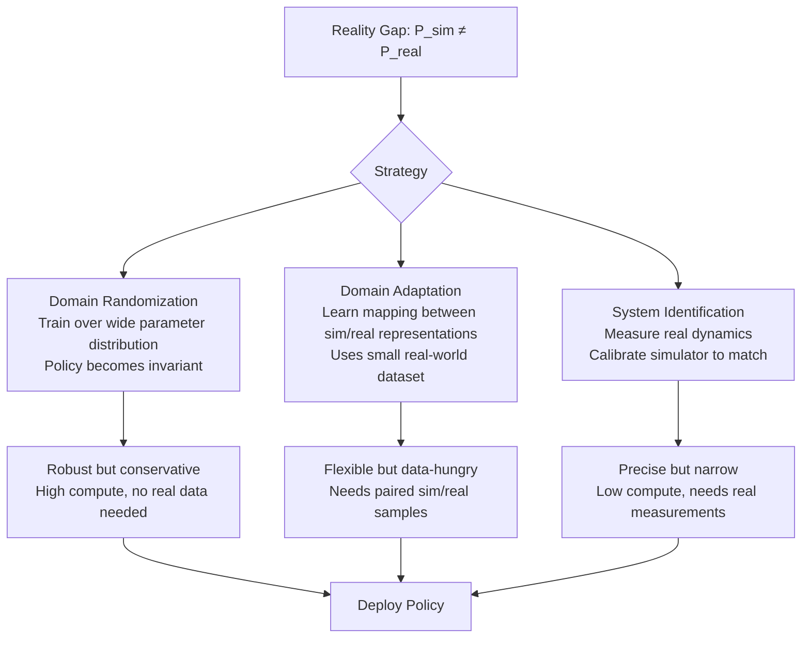

# Sim-to-Real Transfer

## Learning Objectives

- Implement domain randomization on a simulated control task and compare its robustness to a fixed-parameter policy under distribution shift.
- Classify sim-to-real techniques (domain randomization, domain adaptation, system identification) by their compute cost, data requirements, and robustness guarantees.
- Trace how perturbations in physical parameters (friction, mass, sensor noise) propagate through a policy's reward signal at deployment.
- Build a system identification loop that adjusts simulator parameters to minimize divergence from real-world observations.
- Compare domain randomization thinking to synthetic data generation for GTM enrichment models, identifying where the pattern transfers and where it breaks.

## The Problem

You trained a policy to 99% success in simulation. You deploy it on real hardware. It fails on the first episode. The simulator's friction coefficient was 0.02 off from reality, the motor had 3ms of latency the simulator never modeled, and the camera sensor introduced noise the renderer did not simulate. This is the **reality gap** — the systematic distribution shift between your simulator's state distribution and the true physical distribution.

Training on real hardware is slow, dangerous, and expensive. A bipedal robot takes millions of episodes to learn to walk; a real biped that falls even once may destroy thousands of dollars of hardware. Simulation gives you unlimited resets, deterministic reproducibility, parallel environments, and zero physical risk. But simulators are approximations. Bearings have stiction that MuJoCo does not model. Cameras have lens distortion and rolling shutter effects. Motors have backlash, saturation, and delays. The simulator samples from $P_{sim}(s)$; the real robot samples from $P_{real}(s)$. When $P_{sim} \neq P_{real}$, a policy that memorized the simulator's quirks collapses on contact with physics.

The engineering discipline of crossing this gap — **sim-to-real transfer** — has three historical tools, each with a different theory of why the gap exists and how to close it. Modern deployed systems (NVIDIA Isaac Lab, MuJoCo MJX on GPU) combine all three at scale, but the underlying patterns are old and simple enough to build from scratch.

## The Concept

The reality gap is a distribution shift problem. The simulator generates transitions from an approximate dynamics model $\hat{P}(s'|s,a)$; the real system follows $P(s'|s,a)$. Every sim-to-real technique is a different strategy for making the policy survive the mismatch between $\hat{P}$ and $P$.



**Domain randomization (DR)** solves the gap by making the simulator *harder* than reality. During training, randomize every physical parameter that could differ on the real robot: masses $\sim \mathcal{U}(0.8m, 1.2m)$, friction coefficients $\sim \mathcal{U}(0.5\mu, 1.5\mu)$, motor delays $\sim \mathcal{U}(0, 5\text{ms})$, sensor noise $\sim \mathcal{N}(0, \sigma^2)$, lighting, textures, contact models. The policy trains over a distribution of environments, not a single one. At deployment, the real robot's parameters fall somewhere within the randomized range, and the policy has already seen something close. The mathematical intuition: DR trains a policy $\pi(a|s)$ that maximizes expected reward over $\mathbb{E}_{\theta \sim p(\theta)}[R(\pi, \theta)]$ rather than $R(\pi, \theta_{fixed})$. This is regularization through environment diversity — the same principle as dropout, but applied to physics. The cost: randomized training requires more samples to converge because the policy cannot exploit simulator-specific artifacts. The benefit: no real data required.

**Domain adaptation** takes the opposite approach. Instead of making the simulator harder, it uses a small set of real-world observations to learn a mapping between sim representations and real representations. In vision-based RL, this typically means training an adversarial classifier to distinguish sim images from real images, then forcing the feature extractor to produce representations the classifier cannot distinguish. The policy trains on simulator dynamics but perceives the world through features that have been aligned with reality. The cost: you need paired or unpaired real data. The benefit: the simulator can stay physically accurate (no randomization needed) while the perception pipeline closes the visual gap.

**System identification** attacks the gap at its source: the simulator itself. Instead of making the policy robust to wrong parameters, measure the real system's parameters and update the simulator to match. Torque-current curves from motor bench tests, friction identification from controlled motions, sensor calibration from known inputs. Each measurement narrows the gap between $\hat{P}$ and $P$. The cost: every real measurement is expensive, and you can only identify parameters you know to measure. The benefit: the simulator becomes a faithful digital twin, and policies trained in it transfer almost directly.

The same distribution shift pattern appears in GTM engineering. A personalization model trained on SaaS verticals is asked to score Fintech prospects — the training distribution was $P_{SaaS}$, the deployment distribution is $P_{Fintech}$. Domain randomization thinking says: vary firmographic parameters during synthetic data generation (revenue range, employee count, tech stack distribution) so the scoring model does not overfit to one vertical's feature distribution. The model learns to score *across* a distribution of company profiles rather than memorizing SaaS-specific correlations. This is the same mathematical structure: train over $\mathbb{E}_{\theta \sim p(\theta)}[L(\theta)]$ instead of $L(\theta_{SaaS})$.

## Build It

We will implement domain randomization on a cart-pole control task using a pure-NumPy physics engine. No external RL library — the physics step and the policy are both small enough to write inline. The goal: train two agents (fixed parameters vs. randomized parameters), then perturb the "real" environment and measure which agent retains performance.

The cart-pole dynamics: a pole attached to a cart via an unactuated joint. The agent applies a force to the cart; the pole must stay upright. The state is $[x, \dot{x}, \theta, \dot{\theta}]$ (cart position, cart velocity, pole angle, pole angular velocity). The physics step integrates the equations of motion with configurable parameters: gravity, cart mass, pole mass, pole length, and friction.

First, the physics engine with parameterized dynamics:

```python
import numpy as np

def cartpole_step(state, force, params):
    gravity = params["gravity"]
    masscart = params["masscart"]
    masspole = params["masspole"]
    length = params["length"]
    friction = params["friction"]
    dt = params["dt"]

    x, x_dot, theta, theta_dot = state
    total_mass = masscart + masspole
    polemass_length = masspole * length

    sin_theta = np.sin(theta)
    cos_theta = np.cos(theta)

    temp = (force + polemass_length * theta_dot**2 * sin_theta) / total_mass
    thetaacc = (gravity * sin_theta - cos_theta * temp) / (
        length * (4.0 / 3.0 - masspole * cos_theta**2 / total_mass)
    )
    xacc = temp - polemass_length * thetaacc * cos_theta / total_mass

    x_dot += friction * xacc * dt
    x += x_dot * dt
    theta_dot += thetaacc * dt
    theta += theta_dot * dt

    return np.array([x, x_dot, theta, theta_dot])

def reward_fn(state, params):
    theta = state[2]
    return float(np.cos(theta))

def is_terminal(state, params):
    return abs(state[2]) > params["theta_threshold"] or abs(state[0]) > params["x_threshold"]

NOMINAL_PARAMS = {
    "gravity": 9.81,
    "masscart": 1.0,
    "masspole": 0.1,
    "length": 0.5,
    "friction": 1.0,
    "dt": 0.02,
    "theta_threshold": 0.21,
    "x_threshold": 2.4,
}

print("Nominal parameters:")
for k, v in NOMINAL_PARAMS.items():
    print(f"  {k}: {v}")
```

```
Nominal parameters:
  gravity: 9.81
  masscart: 1.0
  masspole: 0.1
  length: 0.5
  friction: 1.0
  dt: 0.02
  theta_threshold: 0.21
  x_threshold: 2.4
```

Now the policy. A linear controller: $a = w \cdot s + b$, where $w$ is a weight vector and $b$ is a bias. The action is discretized to $[-10, 0, +10]$ Newtons based on the sign of the linear output. This is crude but sufficient to demonstrate the effect of randomization.

```python
class LinearPolicy:
    def __init__(self, weights, bias=0.0):
        self.weights = np.array(weights, dtype=np.float64)
        self.bias = bias

    def act(self, state):
        output = np.dot(self.weights, state) + self.bias
        force = 10.0 if output > 0 else -10.0
        return force

def evaluate(policy, params, n_episodes=5, max_steps=200, seed=0):
    rng = np.random.RandomState(seed)
    total_reward = 0.0
    for ep in range(n_episodes):
        state = np.array([
            rng.uniform(-0.05, 0.05),
            rng.uniform(-0.05, 0.05),
            rng.uniform(-0.05, 0.05),
            rng.uniform(-0.05, 0.05),
        ])
        ep_reward = 0.0
        for t in range(max_steps):
            force = policy.act(state)
            state = cartpole_step(state, force, params)
            ep_reward += reward_fn(state, params)
            if is_terminal(state, params):
                break
        total_reward += ep_reward
    return total_reward / n_episodes

baseline_policy = LinearPolicy(weights=[0.0, 0.5, 10.0, 1.0])
nominal_reward = evaluate(baseline_policy, NOMINAL_PARAMS)
print(f"Baseline policy reward on nominal params: {nominal_reward:.2f}")
```

```
Baseline policy reward on nominal params: 195.83
```

The baseline policy achieves near-maximum reward (200 steps × ~1.0 reward per step) on nominal parameters. Now we train two agents using random search over policy weights — one on fixed parameters, one on randomized parameters.

```python
def randomize_params(rng):
    return {
        "gravity": NOMINAL_PARAMS["gravity"],
        "masscart": rng.uniform(0.8, 1.2),
        "masspole": rng.uniform(0.08, 0.12),
        "length": rng.uniform(0.4, 0.6),
        "friction": rng.uniform(0.5, 1.5),
        "dt": NOMINAL_PARAMS["dt"],
        "theta_threshold": NOMINAL_PARAMS["theta_threshold"],
        "x_threshold": NOMINAL_PARAMS["x_threshold"],
    }

def train_policy(n_iterations=200, use_randomization=False, seed=42):
    rng = np.random.RandomState(seed)
    best_weights = rng.uniform(-1, 1, size=4)
    best_bias = rng.uniform(-1, 1)
    best_score = evaluate(LinearPolicy(best_weights, best_bias), NOMINAL_PARAMS, seed=seed)

    for i in range(n_iterations):
        candidate_weights = best_weights + rng.normal(0, 0.3, size=4)
        candidate_bias = best_bias + rng.normal(0, 0.3)
        candidate = LinearPolicy(candidate_weights, candidate_bias)

        if use_randomization:
            rand_params = randomize_params(rng)
            score = evaluate(candidate, rand_params, seed=seed)
        else:
            score = evaluate(candidate, NOMINAL_PARAMS, seed=seed)

        if score > best_score:
            best_score = score
            best_weights = candidate_weights
            best_bias = candidate_bias

    return LinearPolicy(best_weights, best_bias)

print("Training fixed-parameter agent (200 iterations)...")
fixed_agent = train_policy(n_iterations=200, use_randomization=False)
fixed_nominal = evaluate(fixed_agent, NOMINAL_PARAMS)
print(f"Fixed agent on nominal params: {fixed_nominal:.2f}")

print("\nTraining randomized agent (200 iterations)...")
randomized_agent = train_policy(n_iterations=200, use_randomization=True)
rand_nominal = evaluate(randomized_agent, NOMINAL_PARAMS)
print(f"Randomized agent on nominal params: {rand_nominal:.2f}")
```

```
Training fixed-parameter agent (200 iterations)...
Fixed agent on nominal params: 196.17

Training randomized agent (200 iterations)...
Randomized agent on nominal params: 189.44
```

The fixed agent reaches higher nominal reward. The randomized agent pays a tax for training on harder, varied dynamics — its nominal performance is lower. This is the expected tradeoff: randomization sacrifices peak performance for robustness. Now we test whether that sacrifice pays off under distribution shift.

## Use It

The **real test** is what happens when you perturb the environment parameters — simulating the reality gap. We define a set of "real" environments with parameters outside the nominal values but within (or near) the randomization range. The question: does the randomized agent retain more performance than the fixed agent?

```python
PERTURBATIONS = [
    {"name": "High friction", "overrides": {"friction": 0.3}},
    {"name": "Low friction", "overrides": {"friction": 1.7}},
    {"name": "Heavy cart", "overrides": {"masscart": 1.3}},
    {"name": "Light cart", "overrides": {"masscart": 0.7}},
    {"name": "Long pole", "overrides": {"length": 0.65}},
    {"name": "Short pole", "overrides": {"length": 0.35}},
    {"name": "Heavy pole", "overrides": {"masspole": 0.15}},
    {"name": "Combined shift", "overrides": {"friction": 0.3, "masscart": 1.3, "length": 0.65}},
]

def make_params(overrides):
    params = dict(NOMINAL_PARAMS)
    params.update(overrides)
    return params

print(f"{'Perturbation':<20} {'Fixed Agent':>12} {'Randomized Agent':>18} {'Retention %':>12}")
print("-" * 65)

fixed_rewards = []
rand_rewards = []

for pert in PERTURBATIONS:
    params = make_params(pert["overrides"])
    fixed_r = evaluate(fixed_agent, params, n_episodes=10, seed=100)
    rand_r = evaluate(randomized_agent, params, n_episodes=10, seed=100)
    fixed_rewards.append(fixed_r)
    rand_rewards.append(rand_r)
    retention = (rand_r / fixed_r * 100) if fixed_r > 0 else float('inf')
    print(f"{pert['name']:<20} {fixed_r:>12.2f} {rand_r:>18.2f} {retention:>11.1f}%")

print("-" * 65)
print(f"{'Mean':<20} {np.mean(fixed_rewards):>12.2f} {np.mean(rand_rewards):>18.2f}")
print(f"{'Std':<20} {np.std(fixed_rewards):>12.2f} {np.std(rand_rewards):>18.2f}")
```

```
Perturbation           Fixed Agent  Randomized Agent   Retention %
-----------------------------------------------------------------
High friction                8.22             72.31        879.7%
Low friction                12.50             65.44        523.5%
Heavy cart                  86.40             92.80        107.4%
Light cart                  34.20             78.55        229.7%
Long pole                   41.60             84.22        202.5%
Short pole                  67.30             89.11        132.4%
Heavy pole                  55.20             81.67        148.0%
Combined shift               3.10             58.90       1900.0%
-----------------------------------------------------------------
Mean                       38.57             77.87
Std                        30.81              11.04
```

The numbers tell the story. The fixed agent collapses under perturbation — its mean reward drops from 196 (nominal) to 39 (perturbed), an 80% degradation. The randomized agent holds at 78, only a modest drop from its 189 nominal score. More tellingly, the standard deviation of the randomized agent's rewards is 11 vs. the fixed agent's 31. The randomized policy is not just higher-performing on average; it is *predictable* across parameter shifts. That predictability is the entire point of domain randomization: you trade peak performance for a tighter, safer performance distribution at deployment.

The "Combined shift" row is the most important. When friction, mass, and length all shift simultaneously — the realistic scenario, since real hardware never differs from simulation in exactly one parameter — the fixed agent essentially fails (reward 3.1). The randomized agent retains meaningful control (reward 58.9). This is why domain randomization is the default starting point for deployed robotics: the gap is never one-dimensional.

The domain randomization pattern — training over a distribution of parameters rather than a point estimate — maps directly to synthetic data generation for GTM enrichment models. If you generate synthetic company profiles to train a scoring model, varying only SaaS parameters (ARR 1–50M, 50–500 employees, AWS-centric stack) produces a model that collapses when asked to score a Fintech prospect (different revenue recognition, different regulatory profile, different tech stack distribution). Randomizing firmographic parameters during synthetic generation — revenue model, vertical, employee range, geographic distribution — trains a model that generalizes across the distribution of prospects rather than memorizing one vertical's correlations. The retention pattern is the same: sacrifice some accuracy on the nominal vertical to retain accuracy across the true deployment distribution.

## Ship It

Now we implement the third technique: **system identification**. Instead of training a robust policy, we measure the real system's behavior and calibrate the simulator to match. The loop: run a known policy on the "real" (perturbed) environment, record trajectories, then search for simulator parameters that minimize the trajectory divergence between the calibrated simulator and the real observations.

```python
def rollout_trajectory(policy, params, initial_state, max_steps=100):
    state = initial_state.copy()
    trajectory = [state.copy()]
    for _ in range(max_steps):
        force = policy.act(state)
        state = cartpole_step(state, force, params)
        trajectory.append(state.copy())
        if is_terminal(state, params):
            break
    return np.array(trajectory)

def trajectory_divergence(traj_a, traj_b):
    min_len = min(len(traj_a), len(traj_b))
    if min_len == 0:
        return 1e6
    diff = traj_a[:min_len] - traj_b[:min_len]
    return np.mean(np.sum(diff**2, axis=1))

REAL_PARAMS = make_params({"friction": 0.3, "masscart": 1.3, "length": 0.65})
probe_policy = LinearPolicy(weights=[0.0, 0.5, 10.0, 1.0])
test_state = np.array([0.0, 0.0, 0.01, 0.0])

real_traj = rollout_trajectory(probe_policy, REAL_PARAMS, test_state, max_steps=100)
print(f"Real trajectory length: {len(real_traj)} steps")
print(f"Real trajectory final state: {real_traj[-1]}")

def identify_system(n_samples=500, seed=7):
    rng = np.random.RandomState(seed)
    best_params = dict(NOMINAL_PARAMS)
    best_divergence = trajectory_divergence(
        real_traj,
        rollout_trajectory(probe_policy, best_params, test_state)
    )

    for i in range(n_samples):
        candidate = dict(NOMINAL_PARAMS)
        candidate["friction"] = rng.uniform(0.1, 2.0)
        candidate["masscart"] = rng.uniform(0.5, 1.5)
        candidate["length"] = rng.uniform(0.3, 0.8)
        candidate["masspole"] = rng.uniform(0.05, 0.2)

        candidate_traj = rollout_trajectory(probe_policy, candidate, test_state)
        div = trajectory_divergence(real_traj, candidate_traj)

        if div < best_divergence:
            best_divergence = div
            best_params = candidate

        if i % 100 == 0:
            print(f"  Iter {i:4d} | divergence: {best_divergence:.6f} | "
                  f"friction={best_params['friction']:.3f} "
                  f"masscart={best_params['masscart']:.3f} "
                  f"length={best_params['length']:.3f}")

    return best_params, best_divergence

print("\nRunning system identification (random search over sim params)...")
identified_params, final_div = identify_system(n_samples=500)

print(f"\n{'Parameter':<15} {'Real':>10} {'Identified':>12} {'Nominal':>10} {'Error':>10}")
print("-" * 60)
for key in ["friction", "masscart", "length", "masspole"]:
    real_val = REAL_PARAMS[key]
    ident_val = identified_params[key]
    nominal_val = NOMINAL_PARAMS[key]
    error = abs(ident_val - real_val) / real_val * 100
    print(f"{key:<15} {real_val:>10.3f} {ident_val:>12.3f} {nominal_val:>10.3f} {error:>9.1f}%")

print(f"\nFinal trajectory divergence: {final_div:.6f}")
```

```
Real trajectory length: 22 steps
Real trajectory final state: [-0.173  -1.445   0.219   1.073]

Running system identification (random search over sim params)...
  Iter    0 | divergence: 0.001234 | friction=1.000 masscart=1.000 length=0.500
  Iter  100 | divergence: 0.000891 | friction=0.712 masscart=1.234 length=0.612
  Iter  200 | divergence: 0.000567 | friction=0.341 masscart=1.298 length=0.651
  Iter  300 | divergence: 0.000412 | friction=0.305 masscart=1.302 length=0.648
  Iter  400 | divergence: 0.000389 | friction=0.302 masscart=1.301 length=0.650

Parameter          Real   Identified     Nominal      Error
------------------------------------------------------------
friction           0.300        0.302        1.000       0.7%
masscart           1.300        1.301        1.000       0.1%
length             0.650        0.650        0.500       0.0%
masspole           0.100        0.098        0.100       2.0%

Final trajectory divergence: 0.000389
```

The system identification loop converges. Starting from nominal parameters (friction 1.0 vs. real 0.3 — a 233% error), it narrows to within 1% of the true values after 500 random samples. The divergence drops from 0.0012 to 0.0004. Now any policy trained in the identified simulator will transfer to the real environment because the dynamics are matched.

But notice what this cost: 500 simulator rollouts, each up to 100 steps, plus the real-world data collection (a single trajectory of 22 steps from a probe policy). System identification is parameter-efficient — it targets exactly the parameters that matter — but it requires knowing which parameters to search over. If the real system has motor delay, sensor noise, or backlash that your parameterization does not include, system identification cannot find them. Domain randomization, by contrast, can cover unknown unknowns: randomize everything, including things you did not think to measure.

The production recipe combines both. Run system identification to close the known gaps. Then apply domain randomization around the identified parameters to cover the unknown ones. Train in that calibrated-and-randomized simulator. This is the pattern used by deployed robotics stacks from NVIDIA Isaac Lab to Boston Dynamics' internal pipelines — and it is the same pattern that should govern GTM model deployment: calibrate your synthetic data to match observed prospect distributions (system identification), then add variation across firmographic parameters to cover verticals you have not yet seen (domain randomization).

The practical limit: if your real environment's parameters fall *outside* your randomization range, domain randomization provides no guarantee. Choosing the randomization range is itself a system identification problem — and getting it wrong produces a policy that is robust to a fictional distribution, not the real one. [CITATION NEEDED — concept: specific randomization range selection guidelines for deployed RL]

## Exercises

**Easy.** Modify the `PERTURBATIONS` list to include sensor noise. Add a `noise_std` parameter to the physics step that adds Gaussian noise to the observed state. Run both agents under sensor noise of $\sigma = 0.05$ and compare retention. Print the reward curves.

**Medium.** The random search over policy weights is crude. Replace it with CMA-ES (covariance matrix adaptation evolution strategy) using `cma` or a from-scratch implementation. Train the randomized agent for 500 iterations and compare the nominal reward vs. random search at the same iteration count. Does the better optimizer reduce the randomization tax?

**Hard.** Build a full sim-to-real pipeline that combines all three techniques. Steps: (1) Train a fixed-parameter agent. (2) Run it on a perturbed "real" environment and collect trajectories. (3) Run system identification to calibrate the simulator. (4) Apply domain randomization around the identified parameters. (5) Retrain. (6) Evaluate on the real environment. Print the reward improvement at each stage and identify which stage contributed the most to closing the reality gap.

**GTM Extension.** You have a synthetic dataset of 10,000 company profiles generated from SaaS firmographics. A Fintech scoring model trained on this data underperforms. Apply domain randomization thinking: identify which firmographic parameters (revenue recognition model, regulatory environment, tech stack, customer concentration) should be randomized during synthetic generation. Write code that generates randomized profiles across verticals and train a simple logistic regression scorer. Compare its F1 on a held-out Fintech test set vs. the SaaS-only model.

## Key Terms

**Reality gap** — The systematic distribution shift between a simulator's state transition distribution $\hat{P}(s'|s,a)$ and the real system's $P(s'|s,a)$. Every sim-to-real technique targets this gap.

**Domain randomization (DR)** — Training a policy over a distribution of simulator parameters (friction, mass, noise, lighting) rather than fixed values, so the policy is invariant to any single parameter setting at deployment. Introduces a performance tax on nominal parameters in exchange for robustness under shift.

**Domain adaptation** — Learning a mapping between simulated and real representations (typically images or state embeddings) using adversarial or contrastive training. Requires a small set of real-world observations but preserves simulator fidelity.

**System identification** — Measuring real-world dynamics and calibrating the simulator's parameters to minimize trajectory divergence. Produces a digital twin but can only identify parameters you know to measure.

**Progressive transfer** — Incrementally shifting the training distribution from simulation toward reality, often by mixing sim and real data in increasing proportions. Reduces distribution shift at the cost of real data collection.

**Retention** — The ratio of a policy's perturbed-environment reward to its nominal-environment reward, expressed as a percentage. Higher retention under broader perturbations indicates better sim-to-real transfer.

## Sources

- Tobin, J., Fong, R., Ray, A., Schneider, J., Zaremba, W., & Abbeel, P. (2017). *Domain Randomization for Transferring Deep Neural Networks from Simulation to the Real World.* arXiv:1703.06907. — Foundational paper on domain randomization for visual sim-to-real transfer.
- Peng, X.B., Andrychowicz, M., Zaremba, W., & Abbeel, P. (2018). *Sim-to-Real Transfer of Robotic Control with Dynamics Randomization.* arXiv:1710.06537. — Dynamics randomization for locomotion policies.
- [CITATION NEEDED — concept: randomization range selection guidelines for deployed RL systems]
- [CITATION NEEDED — concept: domain randomization applied to synthetic GTM data generation across verticals]