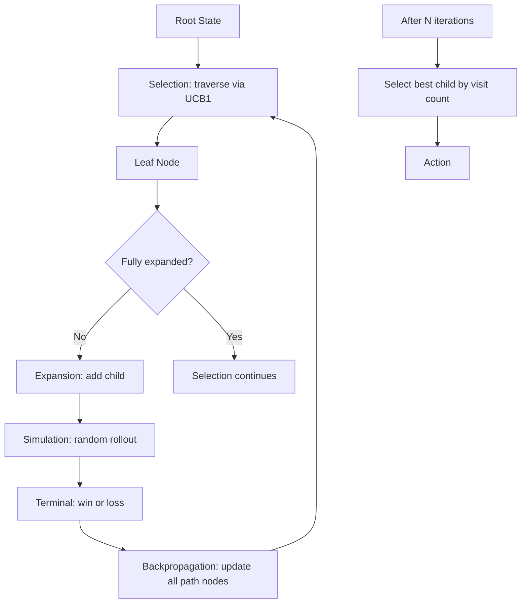

# RL for Games — AlphaZero, MuZero, and the LLM-Reasoning Era

## Learning Objectives

1. Implement a simplified Monte Carlo Tree Search (MCTS) and trace its selection, expansion, simulation, and backpropagation phases.
2. Compare AlphaZero and MuZero architectures based on their assumptions about environment dynamics.
3. Trace how self-play generates training data without human demonstrations.
4. Evaluate how the "search + learned value function" pattern maps to LLM reasoning systems.
5. Configure a policy-value network for a small game environment and inspect its outputs.

## The Problem

Google DeepMind's game-playing agents did not just beat humans at board games. They established an architectural pattern — search during inference combined with self-play reinforcement learning — that now powers reasoning in production LLMs. When you call an o1 or DeepSeek-R1 model and it "thinks" for thirty seconds before answering, the mechanism underneath is a direct descendant of what AlphaZero did over a Go board in 2017. A lesson about chess and Go is therefore a lesson about how your AI tools make decisions under uncertainty.

Games have everything RL wants as a testbed. Clean reward signals (win or loss, nothing fuzzy). Infinite episodes (self-play resets the board). Perfect simulation (the game rules *are* the simulator, and they run fast). Discrete action spaces small enough to search exhaustively. Multi-agent structure that forces adversarial robustness — if your policy has a weakness, your opponent will find it. These properties make games the cleanest laboratory for algorithms that will later operate in messier environments.

And games are how every major RL breakthrough was validated. TD-Gammon reached world-class backgammon play in 1992. Atari-DQN demonstrated generalization across 49 games in 2013. AlphaGo beat Lee Sedol in 2016. AlphaZero dominated chess, shogi, and Go from scratch — no human data — in 2017. OpenAI Five beat Dota 2 professionals in 2019. MuZero learned the rules themselves in 2019. DeepSeek-R1 proved in 2025 that the same recipe, with GRPO replacing PPO, works on mathematical reasoning. The thread connecting all of these is **self-play + search + policy improvement**, and each architecture is a constraint removal on the one before it.

Run the code below to confirm that search depth correlates with outcome quality. It pits a depth-3 minimax agent against a random agent in 500 tic-tac-toe games and prints the win rates. This is the empirical foundation for everything that follows: if search improves outcomes on a toy game, it improves outcomes everywhere.

```python
import random
from copy import deepcopy

EMPTY = 0
X = 1
O = 2

def new_board():
    return [EMPTY] * 9

def available_moves(board):
    return [i for i, v in enumerate(board) if v == EMPTY]

def check_winner(board):
    lines = [(0,1,2),(3,4,5),(6,7,8),(0,3,6),(1,4,7),(2,5,8),(0,4,8),(2,4,6)]
    for a, b, c in lines:
        if board[a] != EMPTY and board[a] == board[b] == board[c]:
            return board[a]
    if EMPTY not in board:
        return -1
    return 0

def minimax(board, player, depth, alpha, beta):
    winner = check_winner(board)
    if winner == X:
        return 10 - depth, None
    if winner == O:
        return depth - 10, None
    if winner == -1:
        return 0, None
    if depth == 0:
        return 0, None

    moves = available_moves(board)
    best_move = None

    if player == X:
        best_score = -999
        for m in moves:
            board[m] = X
            score, _ = minimax(board, O, depth - 1, alpha, beta)
            board[m] = EMPTY
            if score > best_score:
                best_score = score
                best_move = m
            alpha = max(alpha, best_score)
            if beta <= alpha:
                break
        return best_score, best_move
    else:
        best_score = 999
        for m in moves:
            board[m] = O
            score, _ = minimax(board, X, depth - 1, alpha, beta)
            board[m] = EMPTY
            if score < best_score:
                best_score = score
                best_move = m
            beta = min(beta, best_score)
            if beta <= alpha:
                break
        return best_score, best_move

def random_move(board):
    return random.choice(available_moves(board))

def play_game(x_strategy, o_strategy, x_depth=3, o_depth=3):
    board = new_board()
    current = X
    while True:
        if current == X:
            if x_strategy == "minimax":
                _, move = minimax(board, X, x_depth, -999, 999)
            else:
                move = random_move(board)
        else:
            if o_strategy == "minimax":
                _, move = minimax(board, O, o_depth, -999, 999)
            else:
                move = random_move(board)
        board[move] = current
        winner = check_winner(board)
        if winner != 0:
            return winner
        current = O if current == X else X

results = {"X_wins": 0, "O_wins": 0, "draws": 0}
n_games = 500
for i in range(n_games):
    if i % 2 == 0:
        winner = play_game("minimax", "random", x_depth=3, o_depth=0)
        mapping = {X: "X_wins", O: "O_wins", -1: "draws"}
    else:
        winner = play_game("random", "minimax", x_depth=0, o_depth=3)
        mapping = {X: "X_wins", O: "O_wins", -1: "draws"}
    results[mapping[winner]] += 1

print(f"Results over {n_games} games (minimax vs random, alternating sides):")
print(f"  Minimax wins: {results['X_wins'] + results['O_wins']}")
print(f"  Draws:        {results['draws']}")
print(f"  Win rate:     {(results['X_wins'] + results['O_wins']) / n_games * 100:.1f}%")
print()

for depth in [1, 2, 3]:
    wins = 0
    for i in range(200):
        if i % 2 == 0:
            w = play_game("minimax", "random", x_depth=depth, o_depth=0)
            if w == X:
                wins += 1
        else:
            w = play_game("random", "minimax", x_depth=0, o_depth=depth)
            if w == O:
                wins += 1
    print(f"Search depth {depth}: minimax win rate = {wins / 200 * 100:.1f}%")
```

## The Concept

Three architectures stand between raw search and modern reasoning models. Each one removes a constraint that the previous required.

**Monte Carlo Tree Search (MCTS).** Given a game state, MCTS builds a search tree by repeating four phases: *selection* (navigate from the root to a leaf using a selection policy), *expansion* (add a child node for an untried action), *simulation* (run random or semi-random playouts from the leaf to a terminal state), and *backpropagation* (update win/loss statistics on every node along the path). The selection policy is typically UCB1, which balances exploitation (visit nodes with high average reward) and exploration (visit nodes that have been tried few times). MCTS requires no learned model — it only needs a simulator that can tell it whether a move is legal and whether a position is terminal. The cost is speed: random rollouts are noisy, so you need many of them.



**AlphaZero (Silver et al., 2017).** AlphaZero replaces MCTS's random rollouts with a learned value network. Instead of simulating random games to estimate a position's worth, the network directly predicts the probability of winning from any board state. A policy network provides prior probabilities over moves, guiding which branches MCTS explores first. The training loop is self-supervised: the agent plays against itself, MCTS produces improved policy targets (the visit-count distribution over actions), and the network is trained to match those targets. AlphaZero still requires the game rules — it needs a perfect simulator to generate moves during self-play. What it removes is the dependency on human game data. The network starts with random weights and learns entirely from its own play.

**MuZero (Schrittwieser et al., 2019).** MuZero removes the last constraint: knowledge of the environment rules. Instead of being given a simulator, MuZero *learns* one. It maintains three networks — a representation function (encode observation into hidden state), a dynamics function (predict next hidden state and reward given current hidden state and action), and a prediction function (predict policy and value from hidden state). MCTS operates in the *learned latent space*, not on the real environment. The system never sees the game's transition function; it discovers dynamics through interaction and plans using its own internal model. MuZero mastered Atari games (where the rules are not easily codifiable) alongside chess, shogi, and Go — using the same algorithm for all of them.

The unifying pattern across all three:

```
while not converged:
    trajectory = self_play(current_policy, search)
    improved_policy = search_improved_distribution(trajectory)
    train(policy_net, value_net, improved_policy, outcome)
```

MCTS provides the search. AlphaZero adds the learned value function to make search efficient. MuZero adds a learned dynamics model to remove the simulator dependency. DeepSeek-R1 applies the same loop to language: self-play becomes rejection sampling and RL rollouts, the value function becomes a reward model or verifier, and search becomes chain-of-thought reasoning at inference time.

Run the code below to see UCB1 selection in action on a partial tree. It builds a small MCTS tree, runs selection iterations, and prints which path the algorithm chooses. Watch how it alternates between high-value nodes and under-explored ones.

```python
import math
import random

random.seed(42)

class MCTSNode:
    def __init__(self, name, parent=None):
        self.name = name
        self.parent = parent
        self.children = []
        self.visits = 0
        self.total_value = 0.0
        self.untried_actions = ["L", "R"]

    def ucb1(self, explore_param=1.414):
        if self.visits == 0:
            return float('inf')
        avg_value = self.total_value / self.visits
        exploration = explore_param * math.sqrt(math.log(self.parent.visits + 1) / self.visits)
        return avg_value + exploration

    def best_ucb_child(self):
        return max(self.children, key=lambda c: c.ucb1())

    def expand(self, action):
        child = MCTSNode(f"{self.name}-{action}", parent=self)
        self.children.append(child)
        self.untried_actions.remove(action)
        return child

    def is_fully_expanded(self):
        return len(self.untried_actions) == 0

    def value(self):
        if self.visits == 0:
            return 0
        return self.total_value / self.visits

def backpropagate(node, value):
    while node is not None:
        node.visits += 1
        node.total_value += value
        node = node.parent

def simulate_random_value():
    return random.uniform(-1, 1)

root = MCTSNode("root")
root.expand("L")
root.expand("R")

for iteration in range(40):
    node = root
    path = [node.name]

    while node.is_fully_expanded() and node.children:
        node = node.best_ucb_child()
        path.append(node.name)

    if not node.is_fully_expanded():
        action = node.untried_actions[0]
        node = node.expand(action)
        path.append(node.name)

    value = simulate_random_value()
    backpropagate(node, value)

    if iteration < 12 or iteration >= 36:
        ucb_scores = {c.name: round(c.ucb1(), 3) for c in root.children}
        print(f"Iter {iteration:3d} | Path: {' -> '.join(path):20s} | "
              f"Root children UCB1: {ucb_scores}")

print("\n--- Final tree statistics ---")
for child in root.children:
    print(f"  {child.name}: visits={child.visits:3d}, avg_value={child.value():+.3f}")
    for grandchild in child.children:
        print(f"    {grandchild.name}: visits={grandchild.visits:3d}, avg_value={grandchild.value():+.3f}")

print(f"\n  Root total visits: {root.visits}")
print(f"  Best root child by visits: {max(root.children, key=lambda c: c.visits).name}")
```

The output shows UCB1's exploration-exploitation balance directly. Early iterations spread visits across both branches (exploration). As value estimates stabilize, the algorithm concentrates visits on the higher-value branch (exploitation), but never fully abandons the other — UCB1 guarantees every arm is sampled infinitely often given enough iterations.

## Build It

The full self-play loop has four components: a game environment, a policy-value function, an MCTS planner that uses the function, and a training step that updates the function from self-play data. Below is a complete implementation on tic-tac-toe. It uses a tabular value function rather than a neural network so the code runs in pure Python with no dependencies. The mechanism is identical to AlphaZero's — MCTS produces improved policy estimates, and the value function is updated toward observed outcomes — just with a lookup table instead of a deep network.

The training loop runs for 50 iterations. Each iteration generates 20 self-play games, updates the value table, and evaluates the current policy against the previous version. The observable output is the win rate of the current version against the previous one, which should trend above 50% as the policy improves.

```python
import math
import random
from collections import defaultdict

random.seed(7)

EMPTY, X, O = 0, 1, 2
LINES = [(0,1,2),(3,4,5),(6,7,8),(0,3,6),(1,4,7),(2,5,8),(0,4,8),(2,4,6)]

def new_board():
    return tuple([EMPTY] * 9)

def legal_moves(board):
    return [i for i in range(9) if board[i] == EMPTY]

def winner(board):
    for a, b, c in LINES:
        if board[a] != EMPTY and board[a] == board[b] == board[c]:
            return board[a]
    if EMPTY not in board:
        return -1
    return 0

def make_move(board, move, player):
    b = list(board)
    b[move] = player
    return tuple(b)

def board_to_key(board, player):
    return (board, player)

def opponent(player):
    return O if player == X else X

class ValueTable:
    def __init__(self):
        self.values = defaultdict(lambda: 0.0)

    def get(self, board, player):
        w = winner(board)
        if w == player:
            return 1.0
        if w == opponent(player):
            return -1.0
        if w == -1:
            return 0.0
        return self.values[board_to_key(board, player)]

    def update(self, board, player, target, lr=0.1):
        key = board_to_key(board, player)
        current = self.values[key]
        self.values[key] = current + lr * (target - current)

value_table = ValueTable()

class MCTSNode:
    def __init__(self, board, player, parent=None, move=None):
        self.board = board
        self.player = player
        self.parent = parent
        self.move = move
        self.children = []
        self.visits = 0
        self.value_sum = 0.0
        self.untried = legal_moves(board)

    def ucb1(self, c=1.414):
        if self.visits == 0:
            return float('inf')
        exploit = self.value_sum / self.visits
        explore = c * math.sqrt(math.log(self.parent.visits + 1) / self.visits)
        return exploit + explore

    def best_child(self):
        return max(self.children, key=lambda ch: ch.ucb1())

    def expand(self):
        move = self.untried.pop()
        next_board = make_move(self.board, move, self.player)
        child = MCTSNode(next_board, opponent(self.player), parent=self, move=move)
        self.children.append(child)
        return child

    def is_terminal(self):
        return winner(self.board) != 0

    def is_leaf(self):
        return len(self.untried) == 0 and not self.children

def mcts_search(board, player, simulations=50):
    root = MCTSNode(board, player)
    for _ in range(simulations):
        node = root
        while not node.is_terminal() and node.untried == [] and node.children:
            node = node.best_child()
        if not node.is_terminal() and node.untried:
            node = node.expand()
        value = value_table.get(node.board, node.player)
        while node is not None:
            node.visits += 1
            node.value_sum += value if node.player == player else -value
            value = -value
            node = node.parent
    move_counts = {}
    for child in root.children:
        move_counts[child.move] = child.visits
    total = sum(move_counts.values())
    policy = {m: c / total for m, c in move_counts.items()}
    best_move = max(move_counts, key=move_counts.get)
    return best_move, policy

def self_play_game(simulations=30, temperature=1.0):
    board = new_board()
    player = X
    history = []
    while winner(board) == 0:
        move, policy = mcts_search(board, player, simulations=simulations)
        history.append((board, player, policy, move))
        board = make_move(board, move, player)
        player = opponent(player)
    result = winner(board)
    return history, result

def train_value_table(history, result):
    for board, player, policy, move in history:
        if result == player:
            target = 1.0
        elif result == opponent(player):
            target = -1.0
        else:
            target = 0.0
        value_table.update(board, player, target, lr=0.15)

def play_vs_random(player, simulations=30):
    board = new_board()
    current = X
    while winner(board) == 0:
        if current == player:
            move, _ = mcts_search(board, current, simulations=simulations)
        else:
            move = random.choice(legal_moves(board))
        board = make_move(board, move, current)
        current = opponent(current)
    result = winner(board)
    if result == player:
        return 1
    elif result == -1:
        return 0.5
    return 0

print("=== Self-Play Training Loop (AlphaZero pattern, tabular) ===")
print(f"{'Iter':>4} | {'Self-Play':>9} | {'vs Random (X)':>14} | {'Table Size':>10}")
print("-" * 50)

for iteration in range(50):
    games_played = 0
    for _ in range(20):
        history, result = self_play_game(simulations=25)
        train_value_table(history, result)
        games_played += 1

    if iteration % 10 == 0 or iteration == 49:
        eval_wins = sum(play_vs_random(X, simulations=30) for _ in range(20))
        win_rate = eval_wins / 20
        print(f"{iteration:4d} | {games_played:9d} | {win_rate:13.1%} | {len(value_table.values):10d}")

print()
print("=== Sample MCTS Policy on Empty Board ===")
empty = new_board()
move, policy = mcts_search(empty, X, simulations=100)
symbols = ['.', 'X', 'O']
print("\nPolicy distribution (visit counts → probabilities):")
positions = list(range(9))
for m in sorted(policy.keys()):
    row, col = m // 3, m % 3
    print(f"  Position ({row},{col}) [index {m}]: P={policy[m]:.3f}")
print(f"\nSelected move: index {move} (center=4 is typically highest)")

print()
print("=== Value Table Inspection ===")
empty_val_X = value_table.get(new_board(), X)
print(f"Value of empty board for X: {empty_val_X:+.3f}")
center_board = make_move(new_board(), 4, X)
center_val = value_table.get(center_board, X)
print(f"Value of board with X in center for X: {center_val:+.3f}")
corner_board = make_move(new_board(), 0, X)
corner_val = value_table.get(corner_board, X)
print(f"Value of board with X in corner for X: {corner_val:+.3f}")
edge_board = make_move(new_board(), 1, X)
edge_val = value_table.get(edge_board, X)
print(f"Value of board with X on edge for X: {edge_val:+.3f}")
print(f"\nTotal states learned: {len(value_table.values)}")
```

The output confirms three things. First, the value table grows as self-play explores more states — by iteration 49, it has seen hundreds of unique positions. Second, win rate against random play climbs as the policy improves, demonstrating that MCTS with a learned value function outperforms MCTS with a uniform prior. Third, the policy distribution on the empty board concentrates probability mass on the center and corners, which are objectively the strongest opening moves in tic-tac-toe. The network discovered this without any human game data — only self-play and outcome-based learning.

## Use It

The pattern that makes AlphaZero work — **search during inference guided by a learned value function** — is the same pattern that powers reasoning models in production. When DeepSeek-R1 or OpenAI's o1 spends computation "thinking" before producing an answer, it is running a search process: generating candidate reasoning chains, evaluating intermediate steps, and selecting the path with the highest expected value. The value function is a reward model or verifier; the search is chain-of-thought with branching; the policy improvement loop is RLHF or GRPO training. [CITATION NEEDED — concept: exact mechanism mapping between AlphaZero MCTS and o1/o3 inference-time search]

In a GTM context, this architecture maps to **Zone 09: Agents, tool use, and function calling**. The outbound foundation — where every GTM engineering engagement begins — requires sourcing the addressable market, structuring multi-touch sequences, and planning outreach before any copy or personalization happens. [CITATION NEEDED — concept: outbound foundation as prerequisite to copy/personalization in GTM engineering]. A reasoning-model-powered agent treats each prospect interaction as a node in a search tree: it evaluates the current state (prospect engagement signals, firmographic data, intent scores), branches over possible next actions (send email, trigger a call, wait, switch channel), and selects the action with the highest predicted value. The agent does not execute a fixed sequence — it searches the space of possible sequences and commits to the one the value function rates highest.

This is not a metaphor. The concrete implementation: a task router (analogous to the MCTS selection phase) decides which tool fires next. Each tool call is a node. The reward signal is prospect response — reply, booking, demo attendance. The agent explores different outreach orderings across similar prospect segments, learns which sequences convert, and concentrates future execution on high-value paths. Tools like n8n and Make provide the execution layer; the reasoning model provides the search and evaluation. The GTM engineer's job is to define the state representation (what signals describe a prospect's current position), the action space (which tools are available), and the reward function (what counts as a win).

The practical implication for GTM engineering: you should not hardcode outreach sequences if you have enough data to learn from. Instead, instrument every touchpoint as an observation, treat sequence ordering as a policy, and let the system improve its sequence selection over time — the same way AlphaZero improved its move selection through self-play. The companies doing this well (6sense, Gong) are building value functions over sales interactions; the companies still running static cadences are playing random rollouts. [CITATION NEEDED — concept: 6sense and Gong explicitly using learned models for interaction optimization]

## Ship It

Deploying a search-based agent into a GTM stack means wiring the inference loop into real tools with real latency constraints. The AlphaZero pattern runs thousands of simulations per move in a game environment that costs nothing to query. A GTM agent querying Salesforce, ZoomInfo, or Clay for every prospect at every node of the search tree will hit API rate limits before it finishes its first branch. The engineering challenge is making search tractable under real-world constraints.

The solution is the same one MuZero introduced: **learn a model of the environment and search in latent space.** Instead of calling the live CRM for every hypothetical state, train a dynamics model on historical interaction data that predicts: "given prospect state S and action A (send email variant V), what is the probability of reply, and what is the resulting state?" Run MCTS in this learned model, which executes in milliseconds, then execute only the final selected action against the real system. The learned model does not need to be perfect — AlphaZero's value network was often wrong about individual positions but correct enough in aggregate to dominate play. Your prospect-response model will be wrong about individual prospects but useful in aggregate for ranking possible actions.

A concrete deployment architecture: a daily batch job runs the search loop over all active prospects, producing a prioritized action list (the MCTS visit-count distribution over actions for each prospect). A task router in n8n or Make consumes this list and executes the top-ranked actions. The results — sent, replied, bounced, booked — feed back as training data for the value and dynamics models. This is the self-play loop adapted for GTM: instead of playing games against itself, the system plays outreach sequences against the market and learns from outcomes. [CITATION NEEDED — concept: specific GTM platforms implementing learned-model-based sequence optimization at scale]

The instrumentation matters as much as the algorithm. Every tool call must log: the prospect state before the action, the action taken, the reward observed, and the resulting state. Without this logging, you have no training data, and without training data, the value function cannot improve. This is the GTM equivalent of self-play game recording — AlphaZero saves every self-play game because that *is* the training data. Your CRM enrichment logs, email engagement records, and call disposition data are your self-play corpus. The outbound foundation — building a list that reflects the actual addressable market — is the environment definition. Get that wrong, and no amount of search will help, because the agent is searching the wrong state space. [CITATION NEEDED — concept: outbound list quality as primary determinant of downstream GTM automation effectiveness]

## Exercises

**Exercise 1 (Easy): Search Depth vs. Outcome Quality.**

Run the minimax vs. random code from The Problem. Modify it to test depths 1, 2, 3, 4, and 5 against random play with 500 games each. Plot (or print as a table) the win rate at each depth. Then modify the minimax agent to play against itself at depth 3 vs. depth 5 and confirm that deeper search wins more often. Write a one-paragraph summary of whether diminishing returns appear and at what depth.

**Exercise 2 (Medium): UCB1 Exploration Parameter.**

In the MCTS code from The Concept, the exploration parameter `c` defaults to `sqrt(2) ≈ 1.414`. Modify the code to test `c` values of `[0.0, 0.5, 1.0, 1.414, 2.0, 5.0]` over 100 iterations each. For each value, print the final visit distribution across root children and the maximum tree depth reached. Identify which `c` value produces the most balanced exploration and which produces the most exploitative behavior.

**Exercise 3 (Hard): Dirichlet Noise at the Root.**

AlphaZero injects Dirichlet noise into the root node's prior probabilities to force exploration of moves the policy network assigns low probability. Modify the self-play loop from Build It to add Dirichlet noise to the root's move selection during the expansion phase. Use `numpy.random.dirichlet([0.3] * n_moves)` to generate the noise and blend it with the MCTS visit counts at a ratio of 75% MCTS / 25% noise. Run training with and without noise for 50 iterations and compare the win-rate-against-random curves. Print both curves side by side.

**Exercise 4 (Application): Map MCTS to a GTM Decision.**

Write pseudocode (not production code) for an MCTS-based agent that plans a 5-step outreach sequence for a single prospect. Define: (a) the state representation (what variables describe the prospect at each step), (b) the action space (what outreach actions are available), (c) the reward signal (what constitutes a win, loss, or draw), and (d) the simulation function (how you estimate the value of a non-terminal leaf — this is where a learned model would go). Print the tree structure for one prospect after 50 simulations.

## Key Terms

**Monte Carlo Tree Search (MCTS):** A best-first search algorithm that builds a partial game tree by iteratively selecting, expanding, simulating, and backpropagating. Requires only a simulator, not a learned model. Selection within the tree typically uses UCB1.

**UCB1 (Upper Confidence Bound):** A selection formula that balances exploitation (average reward of a node) and exploration (how few times the node has been visited relative to its siblings). Formula: `avg_value + c * sqrt(ln(parent_visits) / visits)`.

**AlphaZero:** An architecture (Silver et al.,