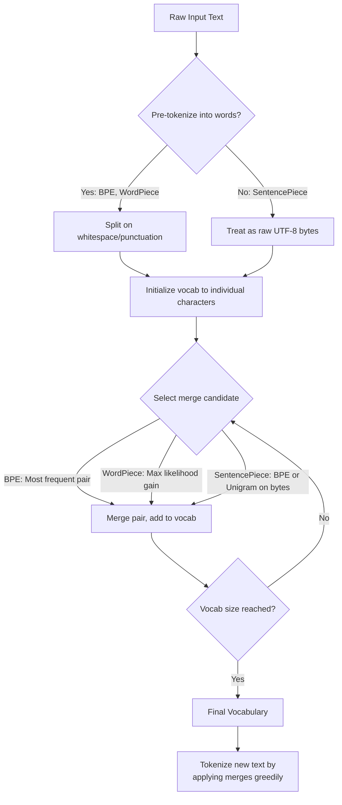

# Tokenizers: BPE, WordPiece, SentencePiece

## Learning Objectives

- Implement BPE merge training from scratch and trace how vocabulary grows with each iteration
- Compare BPE, WordPiece, and SentencePiece tokenization on identical GTM-related input strings
- Compute token-level cost differences across tokenizer implementations for the same input text
- Diagnose tokenization failures on company names, URLs, and multilingual text using merge traces
- Configure tiktoken and sentencepiece libraries to inspect token IDs for production prompt strings

## The Problem

Every LLM you call in a GTM workflow first converts your text to integers. The tokenizer decides the mapping. "GTM" is one token in GPT-4's tokenizer but three tokens in LLaMA's. That difference propagates into your API bill, your prompt design, and your output quality. If you do not know the shredder's pattern, you cannot predict the output.

The gap between "Hello, world!" and `[15496, 11, 995, 0]` is the tokenizer. Every word, every space, every punctuation mark must be converted into an integer before the model can process it. This conversion is not neutral — it bakes assumptions into the pipeline that cannot be undone at inference time.

Get this wrong and your model wastes capacity encoding common words with multiple tokens. "unfortunately" becomes four tokens instead of one. Your 128K context window shrinks by 75% for text heavy in multi-syllable words. Get it right and the same window holds twice as much meaning. The difference between "this model handles code well" and "this model chokes on Python" often traces back to how the tokenizer was trained.

Every API call you make to GPT-4 or Claude is priced per token. Every token your model generates costs compute. The fewer tokens required to represent an output, the faster the end-to-end inference. Tokenization is not preprocessing — it is architecture.

## The Concept

Three naive approaches to text-to-integer conversion fail at scale. Character-level tokenization assigns each character a unique ID, keeping vocabulary tiny but ballooning sequence length — "B2B SaaS revenue" becomes 17 tokens instead of 4. Word-level tokenization assigns each unique word an ID, producing short sequences but exploding vocabulary size — every typo, every conjugation, every new company name ("Zuora," "Clari," "Gong") demands its own entry. A 500K vocabulary means a 500K-row embedding matrix consuming GPU memory for words seen once in training.

Subword tokenization splits the difference. Common words stay whole as single tokens. Rare words decompose into reusable subword fragments. "Zuora" might split into `["Zu", "ora"]` — not ideal, but both fragments appear elsewhere in the vocabulary and earn their keep. Three algorithms dominate: BPE, WordPiece, and SentencePiece. They solve the same problem — representing any text with a finite vocabulary — using different merge selection criteria.

**BPE (Byte Pair Encoding)** initializes the vocabulary as all individual characters. It counts adjacent symbol pairs across the training corpus, merges the most frequent pair into a new symbol, and repeats until the vocabulary reaches its target size. Used by GPT-2, GPT-4, and Claude. **WordPiece** uses the same character-level initialization but a different selection criterion: instead of raw frequency, it scores each candidate merge by the likelihood it would increase given the current model. It selects the merge that maximizes a language model score. Non-initial subwords are prefixed with `##`. Used by BERT and DistilBERT. **SentencePiece** treats input as raw UTF-8 bytes with no pre-tokenization into words. Whitespace is encoded as the special token `▁`. The same code path handles English, Korean, code, or mixed content. BPE or Unigram algorithm applied at the byte level. Used by T5, LLaMA, and Mistral.



Walk through `"B2B SaaS revenue: $2.3M"` under each algorithm. BPE (GPT-4's tiktoken) produces something like `["B", "2", "B", " S", "aa", "S", " revenue", ":", " $", "2", ".", "3", "M"]` — 13 tokens. WordPiece (BERT) fragments differently because BERT's vocabulary was trained on Wikipedia, not SaaS jargon — "SaaS" is not a known word. SentencePiece (LLaMA) operates at the byte level and may chunk "revenue" differently depending on whether its training corpus included financial notation. There is no "correct" tokenization. There is only the tokenization your specific model was trained with, and you must inspect it to know how your input gets shredded.

## Build It

The clearest way to understand BPE is to implement the merge loop yourself. Here is a working implementation that trains on a GTM corpus and traces each merge decision.

```python
from collections import Counter

corpus = [
    "B2B SaaS revenue growth",
    "SaaS companies scale revenue",
    "B2B sales pipeline metrics",
    "revenue churn and retention",
    "SaaS ARR MRR and growth",
    "B2B GTM strategy and execution",
    "pipeline coverage and conversion",
    "customer acquisition cost",
    "lifetime value and churn",
    "SaaS revenue operations",
]

word_freqs = Counter()
for sentence in corpus:
    for word in sentence.split():
        word_freqs[word] += 1

splits = {word: list(word) for word in word_freqs}
vocab = set()
for word in splits:
    for char in word:
        vocab.add(char)

print(f"Initial vocabulary ({len(vocab)} chars): {sorted(vocab)}")
print()

def get_pair_stats(splits, word_freqs):
    pair_counts = Counter()
    for word, freq in word_freqs.items():
        symbols = splits[word]
        for i in range(len(symbols) - 1):
            pair_counts[(symbols[i], symbols[i + 1])] += freq
    return pair_counts

def merge_pair(pair, splits):
    new_splits = {}
    for word, symbols in splits.items():
        new_symbols = []
        i = 0
        while i < len(symbols):
            if i < len(symbols) - 1 and (symbols[i], symbols[i + 1]) == pair:
                new_symbols.append(symbols[i] + symbols[i + 1])
                i += 2
            else:
                new_symbols.append(symbols[i])
                i += 1
        new_splits[word] = new_symbols
    return new_splits

num_merges = 15
for merge_idx in range(num_merges):
    pair_stats = get_pair_stats(splits, word_freqs)
    if not pair_stats:
        break
    best_pair = max(pair_stats, key=pair_stats.get)
    splits = merge_pair(best_pair, splits)
    new_token = best_pair[0] + best_pair[1]
    vocab.add(new_token)
    print(f"Merge {merge_idx + 1:2d}: '{best_pair[0]}' + '{best_pair[1]}' -> '{new_token}'  (frequency: {pair_stats[best_pair]})")

print(f"\nFinal vocabulary size: {len(vocab)}")
```

When you run this, notice what BPE prioritizes. The pair "re" merges early because it appears across "revenue" and "retention." The algorithm has no linguistic knowledge — it is pure frequency counting. Now compare how production tokenizers handle the same GTM strings.

```python
import subprocess
import sys

def install_if_needed(package):
    try:
        __import__(package)
    except ImportError:
        subprocess.check_call([sys.executable, "-m", "pip", "install", package, "-q"])

install_if_needed("tiktoken")
install_if_needed("transformers")
install_if_needed("sentencepiece")

from tiktoken import get_encoding
from transformers import AutoTokenizer

gpt4 = get_encoding("cl100k_base")
bert = AutoTokenizer.from_pretrained("bert-base-uncased")
llama = AutoTokenizer.from_pretrained("hf-internal-testing/llama-tokenizer")

gtm_strings = [
    "B2B SaaS revenue",
    "Zuora Clari Gong Outreach",
    "https://app.clay.com/companies/123",
    "ARR MRR churn",
    "한국어 고객 지원",
]

print(f"\n{'Text':<40} {'GPT-4':>6} {'BERT':>6} {'LLaMA':>6}")
print("-" * 62)
for text in gtm_strings:
    g4 = len(gpt4.encode(text))
    bt = len(bert.encode(text, add_special_tokens=False))
    ll = len(llama.encode(text))
    print(f"{text:<40} {g4:>6} {bt:>6} {ll:>6}")

print("\n--- Token breakdown: 'Zuora Clari Gong Outreach' ---")
text = "Zuora Clari Gong Outreach"
print(f"GPT-4:   {[gpt4.decode([t]) for t in gpt4.encode(text)]}")
print(f"BERT:    {bert.tokenize(text)}")
print(f"LLaMA:   {llama.tokenize(text)}")
```

The token breakdown shows the core tradeoff. BERT fragments "Zuora" into `["zu", "##ora"]` — the `##` prefix marks a non-initial subword, meaning the fragment only appears attached to something before it. GPT-4 and LLaMA handle the same string with different merge histories because their training corpora differ. The Korean string (`한국어 고객 지원`) will fail or fragment heavily under BERT's WordPiece because its vocabulary is English-only. SentencePiece handles it because it operates at the byte level. This is why multilingual models switched to SentencePiece — it removes the language dependency from the tokenizer layer.

## Use It

Byte Pair Encoding via tiktoken determines your per-call GPT-4 cost for every GTM prompt — the same enrichment payload or outbound sequence may cost meaningfully different amounts depending on whether your string fragments into common subwords or rare character sequences.

```python
import tiktoken

enc = tiktoken.get_encoding("cl100k_base")

prompts = {
    "Cold email": "Hi {first_name}, noticed {company} just raised Series B. Our platform helps B2B SaaS teams automate revenue operations and reduce churn by 30%. Worth a 15-minute call next week?",
    "ICP payload": '{"company":"Clari","industry":"SaaS","arr_estimate":"$50M-100M","employees":500,"tech_stack":["Salesforce","Gong","Clay","Outreach"]}',
    "Discovery notes": "QBR recap: Pipeline coverage at 3.2x. Deal slippage in enterprise segment driven by procurement delays. Champion at Zuora left for competitor. Expansion path: multi-product bundle.",
    "Website scrape": "Clari | Revenue Platform | Run RevOps like never before. AI-powered forecasting, pipeline management, and revenue intelligence for modern B2B teams.",
}

rate_input = 0.03
rate_output = 0.06

print(f"{'Prompt type':<18} {'Tokens':>7} {'In/1k':>8} {'Out/1k':>8}")
print("-" * 45)
for label, text in prompts.items():
    n = len(enc.encode(text))
    print(f"{label:<18} {n:>7} ${n*rate_input:>6.2f} ${n*rate_output:>6.2f}")
```

This is foundational for prompt cost management across every GTM AI workflow — the tokenizer determines how much of your context window each ICP profile, enrichment payload, or outbound sequence actually consumes. When a vendor claims "our model handles 128K tokens," what matters is how many *of your tokens* fit in that window. A tokenizer that shreds SaaS jargon into fragments effectively gives you a smaller window than the number suggests. [CITATION NEEDED — concept: GTM token budget benchmarks across common enrichment payloads]

## Exercises

**Exercise 1 (Easy):** Add a `tokenize(text)` function to the BPE implementation in Build It. The function should take a new string, apply the learned merges in order, and return the token list. Test it on `"SaaS revenue churn"` — a string that shares vocabulary with the training corpus — and on `"enterprise onboarding"` — a string that does not. Print both results. Observe that words unseen during training cannot be merged beyond what the learned pairs happen to cover.

**Exercise 2 (Hard):** Build a token-cost comparison tool for a GTM engineering workflow. Collect 20 strings that represent real GTM payloads: five outbound email bodies, five ICP enrichment JSON objects, five LinkedIn profile scrapes, and five meeting transcript excerpts. Run all 20 through `tiktoken` (GPT-4), a WordPiece tokenizer (BERT), and a SentencePiece tokenizer (LLaMA). Compute the average tokens-per-string for each tokenizer. Identify the three strings with the largest token-count variance across tokenizers. Write a one-paragraph diagnosis for each: what in the string (company name, URL, notation, multilingual content) causes the tokenizer to fragment it? This builds the intuition you need to design prompts that stay under context limits across model providers.

## Key Terms

- **BPE (Byte Pair Encoding):** Subword tokenization algorithm that starts from individual characters and iteratively merges the most frequent adjacent pair until vocabulary size is reached. Used by GPT-2, GPT-4, Claude.
- **WordPiece:** Subword tokenization that selects merges by maximum likelihood increase rather than raw frequency. Non-initial subwords are prefixed with `##`. Used by BERT, DistilBERT.
- **SentencePiece:** Tokenization framework that treats input as raw UTF-8 bytes without pre-tokenizing into words. Whitespace becomes `▁`. Supports BPE or Unigram algorithms. Used by T5, LLaMA, Mistral.
- **Pre-tokenization:** The step of splitting raw text into words before subword tokenization begins. BPE and WordPiece pre-tokenize on whitespace and punctuation. SentencePiece skips this step entirely.
- **Vocabulary size:** The number of unique tokens the tokenizer can produce. Larger vocabularies produce shorter sequences but require larger embedding matrices. GPT-4 uses ~100K; LLaMA uses 32K; BERT uses 30K.
- **Token ID:** The integer assigned to a token in the vocabulary. This is what the model actually processes — the tokenizer is the bridge between human-readable text and model-readable integers.
- **Merge rule:** A learned operation (`A + B → AB`) that BPE or WordPiece applies during tokenization. The order of merge rules matters — they are applied greedily in training order.

## Sources

- Sennrich, R., Haddow, B., & Birch, A. (2016). "Neural Machine Translation of Rare Words with Subword Units." *ACL 2016.* — Original BPE paper for NMT.
- Schuster, M. & Nakajima, K. (2012). "Japanese and Korean Voice Search." *ICASSP 2012.* — WordPiece algorithm origin.
- Kudo, T. & Richardson, J. (2018). "SentencePiece: A simple and language independent subword tokenizer and detokenizer for Neural Text Processing." *EMNLP 2018 Demo.* — SentencePiece framework.
- OpenAI. `tiktoken` library. GitHub: openai/tiktoken. — Production BPE encoder for GPT-3.5/GPT-4 (`cl100k_base`, `o200k_base`).
- Devlin, J. et al. (2019). "BERT: Pre-training of Deep Bidirectional Transformers for Language Understanding." *NAACL 2019.* — WordPiece tokenization in BERT.