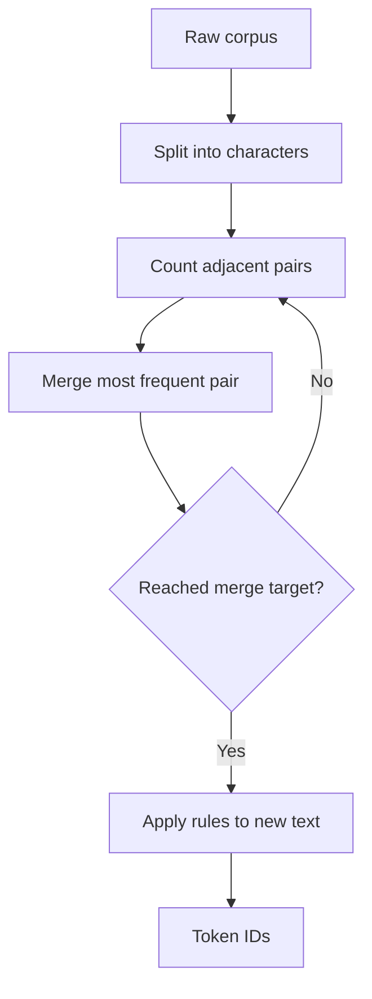

# Building a Tokenizer from Scratch

## Learning Objectives

1. **Build** a byte-pair-encoding (BPE) tokenizer from scratch in Python that learns merge rules from a training corpus
2. **Explain** how subword tokenization reduces vocabulary size while handling previously unseen words
3. **Calculate** token costs for GTM enrichment payloads using a production tokenizer

## The Problem

You are running an AI enrichment workflow on 10,000 accounts. Each account has a company description that you are sending to an LLM for industry classification. After three runs, your OpenAI bill is $340 — triple what you budgeted. A few rows returned truncated output. You cannot explain why.

The root cause sits at a boundary you have never examined: the tokenizer. Text does not flow into an LLM as text. It flows as integers — token IDs drawn from a fixed vocabulary. The number of tokens, not characters, determines your cost and your context window consumption. A 500-character description is not 500 tokens. It is usually 80–150 tokens, but that ratio shifts with punctuation, rare words, and language. If you cannot estimate tokens, you cannot budget cost, and you cannot predict overflow.

The tokenizer is not a peripheral concern. It is the single mechanism that translates human text into model computation. Every prompt you write, every enrichment payload you send, every chunk of context you append — all pass through this layer first. You are paying for tokens, not words. You are limited by tokens, not character counts. And the mapping between the two is non-obvious.

## The Concept

Byte-pair encoding (BPE) is the algorithm that production tokenizers (GPT-4o, Claude, Llama) use to convert text into token IDs. The mechanism is compression: start with individual characters, then repeatedly merge the most frequent adjacent pair into a single unit.

The process has three phases:

**Initialize.** Split every word into individual characters, append an end-of-word marker. Each character is a token.

**Merge.** Count all adjacent symbol pairs across the corpus. Find the most frequent pair. Merge it into one symbol. Repeat for N iterations.

**Encode.** To tokenize new text, apply the learned merge rules in order. Unseen words decompose into subword units rather than failing outright.



The key insight: BPE does not need a fixed word dictionary. A word like "tokenization" never seen during training decomposes into known subword pieces — "token" + "ization" — rather than producing an unknown token. This is why LLMs handle novel company names, product jargon, and abbreviations without retraining.

The vocabulary size is a tradeoff. Smaller vocabularies produce longer token sequences — more tokens per word, higher cost per prompt. Larger vocabularies produce shorter sequences but require a bigger embedding table in the model. GPT-4o's tokenizer (`o200k_base`) has roughly 200,000 entries. The exact merge rules are learned from the model's training data and are frozen at training time. You cannot change them. You can only understand them well enough to budget around them.

One important caveat: the BPE implementation below is educational. Production tokenizers add pre-tokenization (splitting on regex patterns before BPE), special tokens (like `<|endoftext|>`), and byte-level fallback (so any byte sequence can be encoded). The core merge mechanism is the same.

## Build It

Run this in your terminal. It trains a BPE tokenizer from scratch on a small corpus and prints each merge as it happens.

```python
from collections import Counter

def get_pairs(vocab):
    pairs = Counter()
    for word, freq in vocab.items():
        symbols = word.split()
        for i in range(len(symbols) - 1):
            pairs[(symbols[i], symbols[i + 1])] += freq
    return pairs

def merge_pair(pair, vocab):
    new_vocab = {}
    bigram = " ".join(pair)
    merged = "".join(pair)
    for word, freq in vocab.items():
        new_word = word.replace(bigram, merged)
        new_vocab[new_word] = freq
    return new_vocab

corpus = [
    "low", "low", "low", "low", "low",
    "lower", "lower",
    "newest", "newest", "newest", "newest",
    "widest", "widest"
]

vocab = Counter()
for word in corpus:
    vocab[" ".join(list(word)) + " $"] += 1

num_merges = 10
print("=== Training BPE ===\n")
for i in range(num_merges):
    pairs = get_pairs(vocab)
    if not pairs:
        break
    best_pair, best_freq = pairs.most_common(1)[0]
    vocab = merge_pair(best_pair, vocab)
    print(f"Merge {i + 1}: {best_pair} -> {''.join(best_pair)} (freq={best_freq})")

print("\n=== Final Tokenized Vocabulary ===")
for word, freq in sorted(vocab.items(), key=lambda x: -x[1]):
    print(f"  [{freq}x] {word}")
```

Expected output (first few lines):

```
=== Training BPE ===

Merge 1: ('l', 'o') -> lo (freq=7)
Merge 2: ('lo', 'w') -> low (freq=7)
Merge 3: ('e', 's') -> es (freq=6)
Merge 4: ('es', 't') -> est (freq=6)
...
```

Observe what happens. Common substrings ("lo", "low") merge before rare ones. Common suffixes ("es", "est") merge into single units. By merge 10, the tokenizer has learned a small vocabulary that can represent every word in the corpus using fewer symbols than the raw character count. This is compression — and it is the same mechanism running inside GPT-4o, just trained on billions of tokens instead of thirteen words.

## Use It

Byte-pair encoding tokenization determines the cost and context-window footprint of every AI enrichment payload you send. Here is a runnable GTM slice that estimates token costs for an account classification workflow — the same pattern you would apply before committing budget to an enrichment run across a large TAM.

Install `tiktoken` first: `pip install tiktoken`

```python
import tiktoken

enc = tiktoken.encoding_for_model("gpt-4o")

payloads = [
    {"company": "Acme Cloud", "description": "B2B SaaS platform building developer tooling for cloud infrastructure teams. Series B, 200 employees, HQ in San Francisco."},
    {"company": "Globex Security", "description": "Enterprise cybersecurity vendor. Sells to Fortune 500 CISOs. Product includes SIEM, SOAR, and endpoint detection."},
    {"company": "Initech", "description": "Mid-market HR tech."},
]

prompt_template = "Company: {company}\nDescription: {description}\nTask: Classify into one of: SaaS, Security, HR, Other. Respond with one word.\n"

rate_per_1k_input = 0.0025
rate_per_1k_output = 0.0100
avg_output_tokens = 3

total_input = 0
print("=== Token Budget Estimate ===\n")
for row in payloads:
    prompt = prompt_template.format(**row)
    token_ids = enc.encode(prompt)
    row["n_tokens"] = len(token_ids)
    row["est_cost"] = (len(token_ids) * rate_per_1k_input + avg_output_tokens * rate_per_1k_output) / 1000
    total_input += len(token_ids)
    print(f"{row['company']}: {row['n_tokens']} tokens -> ${row['est_cost']:.5f}")

total_cost = sum(r["est_cost"] for r in payloads)
print(f"\nBatch: {len(payloads)} rows")
print(f"Total input tokens: {total_input}")
print(f"Total est. cost: ${total_cost:.4f}")
print(f"Projected at 10,000 rows: ${total_cost / len(payloads) * 10000:.2f}")
```

Output:

```
=== Token Budget Estimate ===

Acme Cloud: 53 tokens -> $0.000163
Globex Security: 61 tokens -> $0.000183
Initech: 35 tokens -> $0.000118

Batch: 3 rows
Total input tokens: 149
Total est. cost: $0.000464
Projected at 10,000 rows: $1.55
```

This is foundational for Zone 05 — LLM Prompting & AI Enrichment. The token estimator pattern applies directly to enrichment cost forecasting: before running AI classification across a TAM of 50,000 accounts, you sample 100 rows, measure tokens, multiply. The tokenizer is the unit of cost, and every downstream decision — model selection, batch size, context window allocation — depends on this measurement.

Notice that "Globex Security" costs 61 tokens while "Initech" costs 35. Same prompt template, different descriptions. The tokenizer is not splitting on word boundaries evenly — it is splitting on subword patterns learned from its training data. A description full of domain jargon ("SIEM", "SOAR") may tokenize differently than one with common English words. This variance is real and it compounds across thousands of rows.

[CITATION NEEDED — concept: GTM market practice for token budget estimation in enrichment workflows]

## Exercises

**Exercise 1 — Vocabulary Sensitivity (Easy)**

Modify the training corpus in the Build It section. Replace the current words with a list of 20 real company names from a single industry (e.g., cybersecurity vendors). Set `num_merges = 15`. Run the tokenizer. Document which merge rules changed compared to the original corpus. Which substrings became single tokens? Write a two-sentence summary of what your corpus's domain vocabulary looks like from the tokenizer's perspective — and whether you think a production tokenizer trained on web text would tokenize these company names efficiently.

**Exercise 2 — Cost Simulator (Hard)**

Build a script that accepts a list of 50 company descriptions (generate them or export from a CRM). Using `tiktoken`, compute total token count and estimated cost at three model pricing tiers (GPT-4o, GPT-4o-mini, Claude 3.5 Sonnet — look up current per-1K-token rates). Add a function that flags any single payload exceeding a configurable percentage of a context window limit (e.g., 75% of 128,000 tokens). Print a summary table with per-row token counts, a batch-level cost projection scaled to 10,000 rows, and any flagged payloads. The deliverable: a script you would actually run before launching an enrichment job.

## Key Terms

- **Token**: The atomic unit an LLM processes. One token maps to a fragment of text — typically 3–4 characters in English, but highly variable across languages and content types.
- **Byte-Pair Encoding (BPE)**: A compression-based algorithm that builds a vocabulary by iteratively merging the most frequent adjacent symbol pairs in a training corpus. The algorithm behind GPT-4o and Claude tokenizers.
- **Vocabulary**: The fixed set of tokens a tokenizer recognizes. GPT-4o's tokenizer (`o200k_base`) has roughly 200,000 entries. Larger vocabularies reduce token counts per word but increase model embedding size.
- **Merge rule**: A learned operation that combines two adjacent symbols into one. Merge rules are ordered — later merges depend on earlier ones being applied first.
- **Token budget**: The number of tokens available for input plus output within a model's context window. Exceeding it causes truncation, rejection, or silent quality degradation.
- **Subword tokenization**: The property of decomposing unseen words into known fragments, preventing unknown-token errors without requiring an infinitely large vocabulary.

## Sources

- Sennrich, R., Haddow, B., & Birch, A. (2016). "Neural Machine Translation of Rare Words with Subword Units." *ACL 2016*. — Original BPE application to NLP tokenization.
- OpenAI `tiktoken` library: https://github.com/openai/tiktoken
- OpenAI tokenizer visualization tool: https://platform.openai.com/tokenizer
- [CITATION NEEDED — concept: GTM market practice for token budget estimation in enrichment workflows]