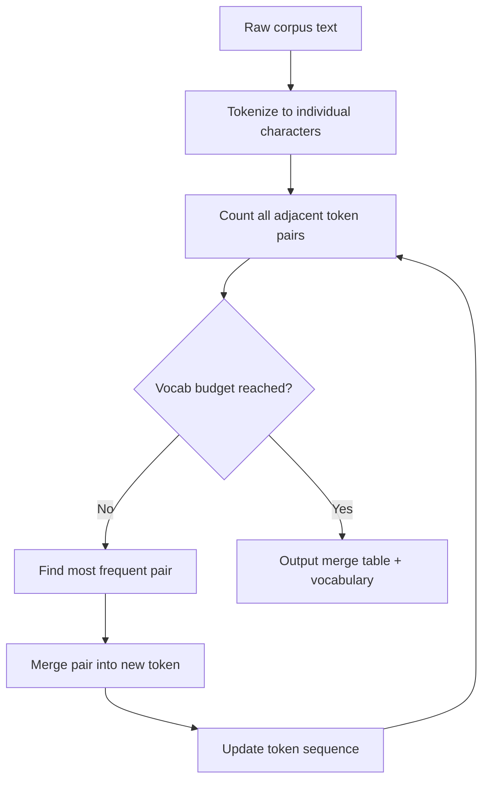

# Building a Tokenizer from Scratch

## Learning Objectives

- Implement BPE training, encoding, and decoding from scratch using only the Python standard library
- Trace how a merge table transforms raw characters into subword tokens through iterative pair counting
- Compare character-level, word-level, and subword-level tokenization strategies on the same corpus
- Build a token-based cost estimator that flags enrichment records exceeding context limits before an API call
- Evaluate how vocabulary size and frequency thresholds change compression ratio and merge decisions

## The Problem

You pass text to an LLM and it responds. But models do not read text — they read integer sequences. Every character, word fragment, and punctuation mark in your prompt gets converted into a list of integers before the model ever sees it. That translation layer is the tokenizer, and its behavior determines how your input is chunked, how much context window you consume, and why some words cost more tokens than others.

The tokenizer is not a neutral pass-through. It makes decisions. The word "tokenization" might be one token, or three ("token", "iz", "ation"), or eleven characters, depending on how the merge table was built. Those decisions cascade: they affect your cost per API call, how many prospects you can fit into a batch classification job, and whether your carefully crafted prompt gets truncated before the model reads the last sentence.

Most practitioners treat the tokenizer as a black box — you call `tiktoken.encode()` and move on. That works until you need to estimate costs on 10,000 enrichment records before spending money, or until you wonder why your prompt consumed 4,000 tokens when you expected 2,500. Build one from scratch and you stop guessing.

## The Concept

Text is variable-length. Models need fixed-size vocabularies. This tension produces three families of tokenizers, each with a different trade-off.

Character-level tokenizers assign one token per character. The vocabulary is tiny — 256 tokens covers all ASCII. But the sequence lengths are enormous: a 1,000-word email becomes 5,000+ tokens, which means more attention computation, longer training, and weaker semantic grouping. The model has to learn that "c", "a", and "t" combine to mean "cat" entirely on its own.

Word-level tokenizers split on whitespace and assign one token per word. Sequences are short, but the vocabulary is unbounded. Every misspelling, every product name, every URL becomes a new token. You need an `<UNK>` token for everything you haven't seen, and in practice you hit it constantly. "Stripe," "Stripe," and "Stripe:" would be three different tokens unless you add aggressive normalization.

Subword tokenizers split the difference. Common words stay whole. Rare words decompose into reusable pieces. "unhappiness" becomes "un" + "happiness" or "un" + "happy" + "ness" — the model sees familiar subunits instead of either one giant token or eleven characters. This is what every modern LLM uses.

Byte-Pair Encoding (BPE) is the algorithm behind most subword tokenizers, including GPT-2, GPT-4, and Llama. The idea is compression through greedy merging:

1. Start with every character as its own token.
2. Count how often each adjacent pair of tokens appears in the corpus.
3. Merge the most frequent pair into a single new token.
4. Repeat until you hit your vocabulary budget.

Each merge gets recorded in a merge table with a priority — the order in which it was learned. Encoding new text means applying those merges in priority order. Decoding means concatenating the tokens back together. The merge table is the entire artifact: small, serializable, and deterministic.

On a 20-character corpus like `"low lower lowest"`, the algorithm would see that `("l", "o")` and `("o", "w")` each appear three times. It merges one of them first (say `"lo"`), then recounts pairs, finds `("lo", "w")` appears three times, merges that