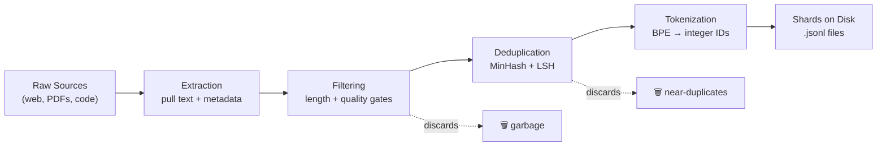

# Data Pipelines for Pre-Training

> The model is a mirror. It reflects whatever data you feed it. Feed it garbage, it reflects garbage with perfect fluency.

**Type:** Build
**Languages:** Python
**Prerequisites:** Phase 10, Lessons 01–02 (Tokenizers, Building a Tokenizer)
**Time:** ~90 minutes

---

## Learning Objectives

- Build a streaming data pipeline that processes text corpora without loading entire datasets into memory
- Implement MinHash-based near-deduplication and heuristic length filters that reduce corpus volume at each pipeline stage
- Tokenize filtered documents into BPE integer sequences and write sharded output to disk as `.jsonl`
- Refactor a pre-training pipeline into named stages (`find → enrich → transform → export`) that structurally mirror GTM enrichment waterfall patterns
- Profile pipeline throughput to verify the dataloader keeps pace with downstream consumption

---

## The Problem

You have a tokenizer. Now you need data.

Not a dataset. Not a CSV. Terabytes of text — cleaned, deduplicated, filtered for quality, tokenized into fixed-length sequences, and served in randomized batches fast enough that your training loop never waits for the next batch.

Most people think training an LLM is about the model architecture. It is not. Llama 3 used 15.6 trillion tokens. GPT-3 used 300 billion. DeepSeek-V2 used 8.1 trillion. The architecture across all three is roughly the same: stacked transformer blocks with attention and feedforward layers. The difference in output quality comes overwhelmingly from the data pipeline that produced those token streams.

The Chinchilla scaling laws from DeepMind made this precise. For a given compute budget, there is an optimal ratio of model parameters to training tokens. Chinchilla showed that most models prior to 2022 were dramatically undertrained — they had too many parameters for the amount of data they saw. A 70B parameter model trained Chinchilla-optimally on 1.4 trillion tokens outperformed a 280B model trained on 300 billion tokens (Gopher). The lesson: you cannot trade data quality for parameter count. The pipeline determines whether your model learns language or learns noise.

The pipeline itself has four jobs. It must extract raw text from heterogeneous sources — web crawls, PDFs, code repositories. It must filter out garbage: spam, boilerplate, low-quality scraping artifacts. It must deduplicate, because web crawls contain massive redundancy (the same Wikipedia article appears thousands of times across mirrors). And it must tokenize the survivors into integer sequences the model can consume. Every stage narrows the stream. Every stage's output feeds the next.

---

## The Concept

A pre-training data pipeline is a linear DAG. Each node transforms its input and passes the result downstream. The four canonical stages — extraction, filtering, deduplication, tokenization — execute in that specific order because stage ordering has a cost consequence.



**Extraction** pulls raw text from heterogeneous sources. Web crawls (Common Crawl), code repositories (GitHub dumps), books (Project Gutenberg, proprietary licensed corpora), and synthetic data all feed in. Each source has a different schema, encoding, and noise profile. HTML needs tag stripping. PDFs need layout-aware text extraction. Code needs language filtering. The extraction stage normalizes everything into a common document format: a text field plus metadata (URL, source, timestamp, language).

**Filtering** applies heuristic and classifier-based quality gates. Heuristic filters are cheap rules: document length (discard stubs and walls of repeated text), language detection (keep only target languages), perplexity scoring under a reference model (discard text that looks unnatural). Classifier-based filters use a small model trained to distinguish high-quality text (Wikipedia, published books) from low-quality text (SEO spam, machine-generated filler). FineWeb-Edu adds a further classifier that scores educational value on a 0–5 scale. Document-level filtering discards entire documents. Paragraph-level filtering surgically removes bad sections within otherwise good documents — useful for removing navigation bars or cookie notices injected into otherwise clean pages. The choice depends on corpus composition: if most of your documents are either fully good or fully bad, document-level is sufficient and cheaper. If many documents are mixed quality, paragraph-level reclaims signal that document-level would waste.

**Deduplication** removes exact and near-duplicates. Exact deduplication uses hashing — compute a hash of each document, store hashes in a set, and discard documents whose hash already exists. This is O(n) and trivial. Near-deduplication is harder. Two documents might be 95% identical but differ in whitespace, header text, or inserted ads. Exact hashing misses these. MinHash solves this by computing a compact signature for each document based on k-gram shingles, then estimating Jaccard similarity between signatures in O(1) per comparison. Locality-Sensitive Hashing (LSH) builds on MinHash by bucketing signatures so that only documents in the same bucket are compared — reducing the O(n²) pairwise problem to near-linear time. Bloom filters offer a probabilistic alternative for streaming contexts where you only need to know "have I seen something like this before?" with a tunable false-positive rate.

**Stage order matters.** You filter before you deduplicate. If you deduplicate first, you pay the cost of computing MinHash signatures on documents you will discard anyway — spam, boilerplate, wrong-language text. Filtering is cheap (a length check, a language model perplexity score). Deduplication is expensive (shingling every document, maintaining an LSH index). Always run the cheap gate first to reduce the volume the expensive gate must process. This is not a minor optimization. On a 1-terabyte crawl, filtering might remove 40% of documents before deduplication even begins, cutting MinHash computation by nearly half.

**Tokenization** is the final stage. Cleaned, deduplicated text flows through your trained BPE tokenizer and becomes integer sequences. These sequences are written to disk as sharded files — typically `.jsonl` (one JSON object per line, each containing the token IDs) or binary formats like HDF5 or memory-mapped arrays for maximum I/O throughput. Sharding matters because training reads data in parallel across multiple workers; each worker reads a different shard.

---

## Build It

### Setup: Load the Corpus

First, install the three libraries the pipeline depends on. `datasets` provides streaming iteration over HuggingFace corpora. `tokenizers` provides BPE encoding. `datasketch` provides MinHash and LSH.

```bash
pip install datasets tokenizers datasketch
```

FineWeb-Edu is a filtered subset of Common Crawl, scored for educational content by a classifier trained on LLM-judged quality. The `sample-10BT` config contains roughly 10 billion tokens — enough to test pipeline mechanics without downloading the full 1.4-trillion-token corpus.

```python
from datasets import load_dataset

ds = load_dataset(
    "HuggingFW/fineweb-edu",
    name="sample-10BT",
    split="train",
    streaming=True
)

first_doc = next(iter(ds))

print("Schema:")
for key in first_doc.keys():
    val = first_doc[key]
    print(f"  {key}: {type(val).__name__} = {repr(val)[:80]}")
```

Output confirms the fields. FineWeb-Edu documents carry `text`, `id`, `dump`, `url`, `file_path`, `language`, `language_score`, `token_count`, `score`, and `int_score`. The `score` field (float 0–5) is the educational quality classifier output. Higher is better.

Now verify that streaming holds constant memory. The point of `streaming=True` is that `load_dataset` returns an `IterableDataset` — it fetches documents on demand rather than materializing the full split in RAM.

```python
import itertools
import tracemalloc

tracemalloc.start()

ds = load_dataset(
    "HuggingFW/fineweb-edu",
    name="sample-10BT",
    split="train",
    streaming=True
)

for i, doc in enumerate(itertools.islice(ds, 3)):
    print(f"--- Document {i} ---")
    print(f"  url: {doc.get('url', 'N/A')}")
    print(f"  language: {doc.get('language', 'N/A')}")
    print(f"  score: {doc.get('score', 'N/A')}")
    print(f"  text[:150]: {doc['text'][:150]}...")
    print()

current, peak = tracemalloc.get_traced_memory()
tracemalloc.stop()
print(f"Peak memory after 3 docs: {peak / 1024:.1f} KB")
```

Peak memory will be in the low kilobytes — the streaming iterator holds one document at a time. Contrast this with `load_dataset(..., streaming=False)`, which downloads the entire split to disk and loads it into memory. On the full FineWeb-Edu corpus, that is hundreds of gigabytes. Streaming is not an optimization. It is a requirement.

### Full Pipeline: Extract → Filter → Dedupe → Tokenize → Write

This script implements all four stages as a single pass over the streaming dataset. It processes a bounded number of documents (500) so it completes in under a minute on a laptop. Remove the cap to process the full corpus.

```python
import json
import os
import itertools
from datasets import load_dataset
from datasketch import MinHash, MinHashLSH
from tokenizers import Tokenizer

MAX_DOCS = 500
MIN_CHARS = 50
MAX_CHARS = 100_000
SIMILARITY_THRESHOLD = 0.8
NUM_PERM = 64
SHINGLE_K = 5

tokenizer = Tokenizer.from_pretrained("gpt2")

ds = load_dataset(
    "HuggingFW/fineweb-edu",
    name="sample-10BT",
    split="train",
    streaming=True
)

def shingle(text, k=SHINGLE_K):
    tokens = text.split()
    if len(tokens) < k:
        return {text}
    return {" ".join(tokens[i:i+k]) for i in range(len(tokens) - k + 1)}

def compute_minhash(text, num_perm=NUM_PERM):
    m = MinHash(num_perm=num_perm)
    for s in shingle(text):
        m.update(s.encode("utf-8"))
    return m

lsh = MinHashLSH(threshold=SIMILARITY_THRESHOLD, num_perm=NUM_PERM)

os.makedirs("shards", exist_ok=True)
shard_path = "shards/shard_000.jsonl"

counts = {"extracted": 0, "filtered": 0, "deduped": 0, "tokenized": 0, "written": 0}

with open(shard_path, "w", encoding="utf-8") as shard_file:
    for doc in itertools.islice(ds, MAX_DOCS):
        counts["extracted"] += 1
        text = doc["text"]

        if len(text) < MIN_CHARS or len(text) > MAX_CHARS:
            continue
        counts["filtered"] += 1

        mh = compute_minhash(text)
        doc_id = f"doc_{counts['extracted']:06d}"

        near_dupes = lsh.query(mh)
        if near_dupes:
            continue
        counts["deduped"] += 1

        lsh.insert(doc_id, mh)

        token_ids = tokenizer.encode(text).ids
        counts["tokenized"] += 1

        record = {
            "id": doc_id,
            "tokens": token_ids,
            "url": doc.get("url", ""),
            "token_count": len(token_ids),
        }
        shard_file.write(json.dumps(record) + "\n")
        counts["written"] += 1

print("Pipeline stage counts:")
for stage, count in counts.items():
    print(f"  {stage}: {count}")

print(f"\nShard: {shard_path}")
print(f"Size: {os.path.getsize(shard_path):,} bytes")

with open(shard_path, "r") as f:
    first_line = f.readline()
    first_record = json.loads(first_line)
    print(f"First record token_count: {first_record['token_count']}")
    print(f"First 20 token IDs: {first_record['tokens'][:20]}")
    print(f"First record url: {first_record['url']}")
```

The stage counts tell a story. `extracted` will be 500. `filtered` will be slightly less — some FineWeb-Edu documents are very short. `deduped` will drop further depending on how many near-duplicates exist in the sample (FineWeb-Edu is already pre-deduplicated upstream, so expect maybe 1–5 collisions in a 500-doc window). `tokenized` and `written` should match `deduped` because every surviving document is tokenized and written.

Run it a second time with `SIMILARITY_THRESHOLD = 0.5`. The `deduped` count will drop further because the LSH treats more pairs as duplicates. This is the lever you tune when deciding how aggressive the dedup should be. Too high (0.9) and you keep near-identical mirrors that waste training signal on redundant gradients. Too low (0.3) and you start collapsing legitimately distinct articles that happen to share boilerplate phrasing.

The shard on disk is a flat `.jsonl` file. Each line is one self-contained record — `id`, `tokens`, `url`, `token_count`. A training loop reads it with a standard file handle, optionally shuffled at the shard level, and reconstructs batches. Nothing about the on-disk format is exotic. The complexity lived entirely in the pipeline that produced it.

One thing the pipeline does **not** do yet: it does not verify that throughput keeps up with a hypothetical training loop. In production, you wrap the inner loop in a timer and check `docs/second`. If the dataloader can deliver tokens faster than the GPU consumes them, the GPU is the bottleneck (good). If the dataloader falls behind, you have an I/O problem — usually solvable by increasing shard count (more parallel readers), prefetching, or moving to a binary format.

---

## Use It

MinHash + LSH near-duplicate detection is the same mechanism GTM engineers call "account deduplication" when they merge CRM records before a campaign launch — the only difference is the text being shingled.

The four-stage pipeline (extract → filter → dedupe → transform) is structurally identical to a GTM enrichment waterfall. You pull raw prospect records, filter out junk (bounced emails, test domains, generic `@gmail.com`), deduplicate against existing CRM entries, then transform survivors into enriched records. The same stage-ordering logic applies: filter before you dedupe, because you do not want to spend dedup compute on records you will discard anyway. This is **Cluster 1.2, TAM Refinement & ICP Scoring** — and the same logic shows up in **Cluster 1.4, Data Enrichment** when waterfalls decide whether to call the next provider.

Below is a runnable slice that deduplicates a prospect list of company descriptions before they hit an enrichment provider. Each deduped record is one fewer API credit billed.

```python
from datasketch import MinHash, MinHashLSH

companies = [
    {"name": "Acme Corp", "domain": "acme.com", "desc": "Manufactures anvils and rocket-powered skates for cartoon mammals"},
    {"name": "ACME Corporation", "domain": "acme.io", "desc": "Manufactures anvils, rocket-powered skates for cartoon mammals worldwide"},
    {"name": "Initech", "domain": "initech.com", "desc": "Enterprise software for TPS report workflow automation"},
    {"name": "Hooli", "domain": "hooli.com", "desc": "Cloud infrastructure and box compression innovation platform"},
    {"name": "Pied Piper", "domain": "piedpiper.com", "desc": "Decentralized middle-out data compression platform"},
    {"name": "Pied Piper Inc", "domain": "piedpiper.io", "desc": "Decentralized middle-out compression platform for data"},
]

def shingle_company(c, k=3):
    text = f"{c['name']} {c['domain']} {c['desc']}".lower()
    words = text.split()
    return {" ".join(words[i:i+k]) for i in range(len(words) - k + 1)}

lsh = MinHashLSH(threshold=0.5, num_perm=32)
survivors = []

for c in companies:
    mh = MinHash(num_perm=32)
    for s in shingle_company(c):
        mh.update(s.encode("utf-8"))
    if lsh.query(mh):
        print(f"  DROP (near-dup): {c['name']} ({c['domain']})")
        continue
    lsh.insert(c["domain"], mh)
    survivors.append(c)

print(f"\nInput: {len(companies)} records")
print(f"Survivors: {len(survivors)} unique")
print(f"Enrichment credits saved: {len(companies) - len(survivors)}")
for s in survivors:
    print(f"  → {s['name']} ({s['domain']})")
```

The two Acme entries and the two Pied Piper entries collapse to one each. At 100,000 prospect records with a 12% near-duplicate rate, this saves 12,000 enrichment lookups. If your provider charges $0.10–$0.49 per company enrichment [CITATION NEEDED — concept: enrichment provider pricing per company record], that is $1,200–$5,880 recovered per campaign run. The mechanism — shingle, hash, bucket, query — is byte-for-byte identical to the pre-training pipeline above. Only the text changed.

---

## Exercises

### Exercise 1: Tune the similarity threshold

Re-run the Build It pipeline with `SIMILARITY_THRESHOLD` set to 0.5, then 0.9. Record the `deduped` count for each. Calculate how many documents each threshold discards as near-duplicates, and explain in 2–3 sentences why a 0.5 threshold is dangerous on a corpus that contains legitimate quotations of the same passage across multiple sources (e.g., the same legal disclaimer appearing on different law firm websites).

**Stretch:** Add a counter that tracks how many documents were dropped by filtering versus how many were dropped by deduplication. Print the ratio. This is the number you would report to justify a dedup compute budget.

### Exercise 2: Add an exact-dedup pre-stage with a Bloom filter

Install `pybloom-live` (or use the stdlib `hashlib` + a Python `set` as a stand-in). Before the MinHash stage, compute a SHA-256 hash of each filtered document's normalized text (lowercased, whitespace-collapsed). If the hash is already in the set, skip the MinHash computation entirely. Print how many exact duplicates were caught before MinHash was invoked, and report the time saved.

The goal: prove the stage-ordering claim from ## The Concept. Exact dedup is O(n) and catches the obvious mirrors. MinHash is O(n × num_perm) and catches the fuzzy ones. Running exact-first means MinHash only ever sees documents that survived the cheap gate.

---

## Key Terms

- **Streaming dataset** — An iterable dataset interface that yields records on demand rather than materializing the full split in memory. Required for corpora larger than RAM.
- **MinHash** — A probabilistic data structure that estimates Jaccard similarity between two sets in O(1) per comparison, using `num_perm` independent hash functions to produce a compact signature.
- **Locality-Sensitive Hashing (LSH)** — An indexing technique that buckets MinHash signatures so that only signatures sharing a bucket are compared, reducing the O(n²) pairwise similarity problem to near-linear time.
- **Shingling (k-gram)** — The act of splitting a document into overlapping windows of `k` consecutive tokens, producing the set that MinHash operates on.
- **Jaccard similarity** — `|A ∩ B| / |A ∪ B|`. The fraction of shared elements between two sets. MinHash estimates this without computing the full intersection.
- **Heuristic filter** — A cheap, rule-based quality gate (length, language, perplexity) applied before expensive stages to reduce downstream volume.
- **Bloom filter** — A probabilistic set-membership structure with tunable false-positive rate and zero false negatives. Useful for streaming exact-dedup contexts.
- **Shard** — A partition of the tokenized output written as a separate file, enabling parallel reads from multiple training workers.

---

## Sources

- Hoffmann, J., et al. (2022). *Training Compute-Optimal Large Language Models* (Chinchilla). DeepMind. arXiv:2203.15556
- Meta AI (2024). *The Llama 3 Herd of Models*. arXiv:2407.21783
- DeepSeek-AI (2024). *DeepSeek-V2: A Strong, Economical, and Efficient Mixture-of-Experts Language Model*. arXiv:2405.04434
- Penedo, G., et al. (2024). *The FineWeb Datasets: Decanting the Web for the Finest Text Data at Scale*. HuggingFace. arXiv:2406.17557
- Broder, A. Z. (1997). *On the Resemblance and Containment of Documents*. IEEE SEQUENCES.
- HuggingFace `datasets` streaming documentation: https://huggingface.co/docs/datasets/streaming
- `datasketch` MinHash + LSH library: https://github.com/ekzhu/datasketch
- [CITATION NEEDED — concept: enrichment provider per-record pricing used in the Use It cost-savings estimate]