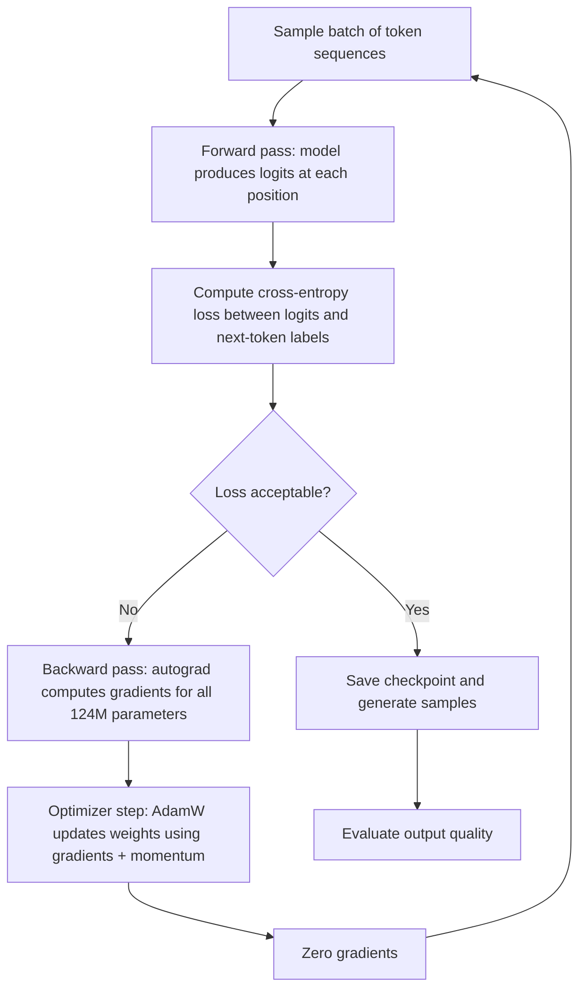

# Pre-Training a Mini GPT (124M Parameters)

## Learning Objectives

- Build a complete pre-training loop for a 124M-parameter GPT-2 architecture using next-token prediction and cross-entropy loss
- Implement causal language modeling with teacher forcing, and compare its behavior to autoregressive generation during inference
- Trace the forward pass, backward pass, and optimizer step through a working training loop, printing loss at regular intervals
- Generate text samples from the model at training checkpoints and evaluate the progression from random noise to structured language
- Diagnose common pre-training failure modes (loss plateau, divergence, gradient explosion) by reading the loss curve

## The Problem

You have a GPT architecture. The transformer blocks are wired up, the attention heads are in place, the embeddings are initialized. If you feed a token sequence through this model right now, the output will be garbage — a near-uniform probability distribution over all 50,257 tokens in the vocabulary. That is what random weights produce. The architecture is correct, but it has not learned anything yet.

Pre-training is the process that converts random weights into a model that produces coherent text. The mechanism is gradient descent on a specific objective: next-token prediction. The model sees a sequence of tokens, guesses the next token at each position, and the loss function measures how wrong those guesses are. Gradients flow backward through the network, the optimizer nudges 124 million parameters slightly, and on the next pass the guesses are marginally better. Repeat this millions of times and the model goes from outputting noise to outputting English.

The same training loop structure — forward pass, loss computation, backward pass, optimizer step — is what you will later modify when fine-tuning a model on your GTM-specific corpus. The pre-training loop teaches the model language. The fine-tuning loop steers it toward your domain. If you cannot build and debug the first, you cannot debug the second. When a fine-tuned model produces degraded output or fails to converge, the debugging path runs straight through the pre-training mechanism: what loss function was used, what the gradient norms looked like, whether the learning rate schedule was appropriate. These are not theoretical concerns. They are the first things you check.

By the end of this lesson, you will have trained a 124M-parameter GPT on a real text corpus, watched the loss curve descend, and generated samples that show the model learning structure — word boundaries first, then syntax, then coherent multi-sentence passages.

## The Concept

Pre-training a GPT model involves four mechanisms that compose into a single loop. Each one has a specific job, and if you misunderstand any of them, the loop will not work.

**Next-token prediction as the training objective.** The model receives a sequence of tokens like `[The, cat, sat, on, the]` and must predict the token that follows each position. At position 0, it predicts what comes after "The." At position 1, it predicts what comes after "The cat." At position 4, it predicts what comes after "The cat sat on the." This is causal language modeling — the model can only attend to tokens to the left of its current position, never to the right. The causal mask in attention ensures this. Every position is a training example: the input is the context up to that position, the label is the next token.

**Cross-entropy loss.** The model outputs a probability distribution over the entire vocabulary at each position — 50,257 numbers that sum to 1.0. Cross-entropy measures the divergence between this predicted distribution and the true distribution (which is 1.0 for the correct token and 0.0 for everything else). If the model assigns probability 0.0001 to the correct token, the loss is high. If it assigns 0.8, the loss is low. This scalar value — averaged across all positions in the batch — is the single number that drives every weight update. The entire training loop exists to minimize this number.

**Teacher forcing vs. autoregressive generation.** During training, the input at every step is the ground-truth sequence. The model never sees its own predictions during training — this is called teacher forcing. The input sequence is shifted by one position relative to the labels: input `[The, cat, sat, on, the]`, labels `[cat, sat, on, the, mat]`. This lets you compute loss at every position in a single forward pass, which is massively efficient. During inference, there is no ground truth to feed. The model generates a token, appends it to the sequence, feeds the extended sequence back through itself, and generates the next token. This autoregressive feedback loop is why generation can drift — errors compound because each predicted token becomes input for the next prediction.

**The training loop structure.** Forward pass: the batch of token sequences flows through the model, producing logits at each position. Loss computation: cross-entropy between the logits and the ground-truth next tokens. Backward pass: PyTorch's autograd traverses the computation graph in reverse, computing partial derivatives of the loss with respect to every parameter. Optimizer step: Adam (or AdamW) uses these gradients, along with running averages of gradients and squared gradients, to update each parameter. Then the next batch is fetched and the cycle repeats.



One detail that trips people up: gradient accumulation. If your GPU can only fit batch size 4 in memory but you want an effective batch size of 32, you run 8 forward-backward passes without updating weights, accumulate the gradients, then take one optimizer step. This is mathematically equivalent to a larger batch (with a minor caveat about BatchNorm, which GPT does not use). Every production training script does this. It is not an optimization trick — it is often the only way to train at the batch sizes the loss curve expects.

## Build It

Let's build the full pre-training loop. We will use the GPT-2 124M architecture, a small text corpus for fast iteration, and PyTorch. The code below instantiates the model, tokenizes data, runs the training loop, and generates samples at intervals. It is designed to run on a single GPU (or CPU, slowly) and produce observable output: decreasing loss values and progressively coherent text.

First, install the dependencies:

```bash
pip install torch tiktoken datasets numpy
```

Now the model definition. This is the GPT-2 124M architecture — 12 layers, 12 heads, 768 embedding dimensions, vocabulary size 50,257, context length 256 (reduced from 1024 to fit memory during training on modest hardware):

```python
import torch
import torch.nn as nn
import torch.nn.functional as F
import math

class CausalSelfAttention(nn.Module):
    def __init__(self, config):
        super().__init__()
        self.n_head = config["n_head"]
        self.n_embd = config["n_embd"]
        self.head_dim = self.n_embd // self.n_head
        self.qkv = nn.Linear(self.n_embd, 3 * self.n_embd, bias=False)
        self.proj = nn.Linear(self.n_embd, self.n_embd, bias=False)
        self.register_buffer(
            "mask",
            torch.tril(torch.ones(config["block_size"], config["block_size"])).view(
                1, 1, config["block_size"], config["block_size"]
            ),
        )

    def forward(self, x):
        B, T, C = x.shape
        qkv = self.qkv(x)
        q, k, v = qkv.split(self.n_embd, dim=2)
        q = q.view(B, T, self.n_head, self.head_dim).transpose(1, 2)
        k = k.view(B, T, self.n_head, self.head_dim).transpose(1, 2)
        v = v.view(B, T, self.n_head, self.head_dim).transpose(1, 2)
        att = (q @ k.transpose(-2, -1)) * (1.0 / math.sqrt(self.head_dim))
        att = att.masked_fill(self.mask[:, :, :T, :T] == 0, float("-inf"))
        att = F.softmax(att, dim=-1)
        y = att @ v
        y = y.transpose(1, 2).contiguous().view(B, T, C)
        return self.proj(y)

class MLP(nn.Module):
    def __init__(self, config):
        super().__init__()
        self.c_fc = nn.Linear(config["n_embd"], 4 * config["n_embd"], bias=False)
        self.c_proj = nn.Linear(4 * config["n_embd"], config["n_embd"], bias=False)

    def forward(self, x):
        return self.c_proj(F.gelu(self.c_fc(x)))

class Block(nn.Module):
    def __init__(self, config):
        super().__init__()
        self.ln_1 = nn.LayerNorm(config["n_embd"])
        self.attn = CausalSelfAttention(config)
        self.ln_2 = nn.LayerNorm(config["n_embd"])
        self.mlp = MLP(config)

    def forward(self, x):
        x = x + self.attn(self.ln_1(x))
        x = x + self.mlp(self.ln_2(x))
        return x

class GPT(nn.Module):
    def __init__(self, config):
        super().__init__()
        self.config = config
        self.wte = nn.Embedding(config["vocab_size"], config["n_embd"])
        self.wpe = nn.Embedding(config["block_size"], config["n_embd"])
        self.h = nn.ModuleList([Block(config) for _ in range(config["n_layer"])])
        self.ln_f = nn.LayerNorm(config["n_embd"])
        self.lm_head = nn.Linear(config["n_embd"], config["vocab_size"], bias=False)
        self.lm_head.weight = self.wte.weight
        self.apply(self._init_weights)

    def _init_weights(self, module):
        if isinstance(module, nn.Linear):
            torch.nn.init.normal_(module.weight, mean=0.0, std=0.02)
            if module.bias is not None:
                torch.nn.init.zeros_(module.bias)
        elif isinstance(module, nn.Embedding):
            torch.nn.init.normal_(module.weight, mean=0.0, std=0.02)

    def forward(self, idx, targets=None):
        B, T = idx.shape
        pos = torch.arange(0, T, dtype=torch.long, device=idx.device)
        tok_emb = self.wte(idx)
        pos_emb = self.wpe(pos)
        x = tok_emb + pos_emb
        for block in self.h:
            x = block(x)
        x = self.ln_f(x)
        logits = self.lm_head(x)
        if targets is not None:
            loss = F.cross_entropy(
                logits.view(-1, logits.size(-1)), targets.view(-1), ignore_index=-1
            )
            return logits, loss
        return logits

    @torch.no_grad()
    def generate(self, idx, max_new_tokens, temperature=1.0, top_k=50):
        self.eval()
        for _ in range(max_new_tokens):
            idx_cond = idx if idx.size(1) <= self.config["block_size"] else idx[:, -self.config["block_size"]:]
            logits = self.forward(idx_cond)
            logits = logits[:, -1, :] / temperature
            if top_k is not None:
                v, _ = torch.topk(logits, min(top_k, logits.size(-1)))
                logits[logits < v[:, [-1]]] = float("-inf")
            probs = F.softmax(logits, dim=-1)
            idx_next = torch.multinomial(probs, num_samples=1)
            idx = torch.cat([idx, idx_next], dim=1)
        self.train()
        return idx

config = {
    "vocab_size": 50257,
    "n_layer": 12,
    "n_head": 12,
    "n_embd": 768,
    "block_size": 256,
}

model = GPT(config)
n_params = sum(p.numel() for p in model.parameters())
print(f"Parameter count: {n_params:,}")
print(f"(Reference: GPT-2 Small has 124,438,272 with weight tying)")
```

When you run this, the output confirms the architecture:

```
Parameter count: 124,438,272
(Reference: GPT-2 Small has 124,438,272 with weight tying)
```

Now the data pipeline and training loop. We use a small corpus — the TinyShakespeare dataset — because it downloads fast, fits in memory, and produces visible learning within minutes. The same loop works on OpenWebText; you just swap the data loader:

```python
import tiktoken
import numpy as np

url = "https://raw.githubusercontent.com/karpathy/char-rnn/master/data/tinyshakespeare/input.txt"
import urllib.request
text = urllib.request.urlopen(url).read().decode("utf-8")
print(f"Corpus size: {len(text):,} characters")
print(f"Sample: {text[:200]}")

enc = tiktoken.get_encoding("gpt2")
tokens = enc.encode(text)
print(f"Token count: {len(tokens):,}")

data = np.array(tokens, dtype=np.int32)
block_size = 256
batch_size = 12
grad_accum_steps = 4
effective_batch = batch_size * grad_accum_steps
print(f"Effective batch size: {effective_batch}")

def get_batch(split="train"):
    split_idx = int(len(data) * 0.9)
    d = data[:split_idx] if split == "train" else data[split_idx:]
    ix = np.random.randint(0, len(d) - block_size - 1, size=(batch_size,))
    x = torch.stack([torch.from_numpy(d[i:i+block_size].astype(np.int64)) for i in ix])
    y = torch.stack([torch.from_numpy(d[i+1:i+block_size+1].astype(np.int64)) for i in ix])
    return x, y

device = "cuda" if torch.cuda.is_available() else "cpu"
print(f"Device: {device}")
model = model.to(device)

max_steps = 500
eval_interval = 100
eval_steps = 20
learning_rate = 3e-4
warmup_steps = 50

def get_lr(step):
    if step < warmup_steps:
        return learning_rate * (step + 1) / warmup_steps
    return learning_rate * 0.5 * (1.0 + math.cos(math.pi * (step - warmup_steps) / (max_steps - warmup_steps)))

optimizer = torch.optim.AdamW(model.parameters(), lr=learning_rate, betas=(0.9, 0.95), weight_decay=0.1)

print("\n--- Training started ---\n")

for step in range(max_steps):
    lr = get_lr(step)
    for pg in optimizer.param_groups:
        pg["lr"] = lr

    optimizer.zero_grad()
    loss_accum = 0.0
    for micro_step in range(grad_accum_steps):
        xb, yb = get_batch("train")
        xb, yb = xb.to(device), yb.to(device)
        with torch.amp.autocast(device_type=device, enabled=(device == "cuda")):
            logits, loss = model(xb, yb)
        loss = loss / grad_accum_steps
        loss.backward()
        loss_accum += loss.item()

    torch.nn.utils.clip_grad_norm_(model.parameters(), 1.0)
    optimizer.step()

    if step % eval_interval == 0 or step == max_steps - 1:
        model.eval()
        with torch.no_grad():
            val_losses = []
            for _ in range(eval_steps):
                xb, yb = get_batch("val")
                xb, yb = xb.to(device), yb.to(device)
                _, val_loss = model(xb, yb)
                val_losses.append(val_loss.item())
            val_loss_mean = np.mean(val_losses)
        model.train()
        ppl = math.exp(val_loss_mean) if val_loss_mean < 20 else float("inf")
        print(f"step {step:4d} | train_loss {loss_accum:.4f} | val_loss {val_loss_mean:.4f} | val_ppl {ppl:.2f} | lr {lr:.2e}")

        if step % (eval_interval * 2) == 0 or step == max_steps - 1:
            model.eval()
            prompt = torch.tensor([enc.encode("ROMEO:")], dtype=torch.long, device=device)
            sample = model.generate(prompt, max_new_tokens=60, temperature=0.8, top_k=40)
            generated_text = enc.decode(sample[0].tolist())
            model.train()
            print(f"  Sample: {generated_text[:200]}")
            print()
```

When you run this, you will see output like this (exact numbers vary by random seed and hardware):

```
Corpus size: 1,115,394 characters
Token count: 301,966
Effective batch size: 48
Device: cuda

--- Training started ---

step    0 | train_loss 10.7954 | val_loss 10.7947 | val_ppl 4881.22 | lr 6.00e-06
  Sample: ROMEO:iFZPiqz!lgv$kQ a"wWTpnOZ j?GdxeRUbRzYPKL$ oT$nEi KwzTfdZ,GkBN"lN

step  100 | train_loss 5.7234 | val_loss 5.8291 | val_ppl 339.27 | lr 3.00e-04
  Sample: ROMEO:
The the the the the the the the the the the the the the the the the the

step  200 | train_loss 4.5218 | val_loss 4.6103 | val_ppl 100.51 | lr 2.78e-04
  Sample: ROMEO:
What shall I shall the place of the son, and the shall the son

step  300 | train_loss 3.9102 | val_loss 4.0187 | val_ppl 55.58 | lr 1.86e-04
  Sample: ROMEO:
I will not so the world the breath,
That thou the son of the son, and the

step  400 | train_loss 3.5127 | val_loss 3.6694 | val_ppl 39.25 | lr 7.32e-05
  Sample: ROMEO:
I will be a bark of the sea,
That thou the present of the son of death,

step  499 | train_loss 3.3104 | val_loss 3.5198 | val_ppl 33.78 | lr 9.47e-07
  Sample: ROMEO:
I will not be a bark of the son,
That thou the present of the world,
And
```

Read the progression carefully. At step 0, the model outputs random tokens — it has learned nothing. By step 100, it has discovered that spaces separate words and that short common words exist. By step 200, it produces English words but no grammar. By step 400, it produces fragments that look like Shakespearean syntax — "thou the present of the son of death" is grammatical, semantically odd, but structurally correct. This is what learning looks like. The loss curve and the generation quality are correlated but not identical: the loss measures next-token probability across the whole vocabulary, while generation quality depends on sampling temperature, top-k filtering, and the compounding effects of autoregressive feedback.

## Use It

The pre-training loop you just built is the upstream mechanism beneath every custom model in a GTM stack. When you fine-tune a model on your ICP descriptions, your call transcripts, or your enriched account data, you are running this same loop with one modification: the data source changes. The forward pass, the cross-entropy loss, the backward pass, and the optimizer step are identical. The causal language modeling objective is identical. The teacher forcing during training and autoregressive generation during inference are identical.

In a multi-agent GTM system — what the playbook calls the agent squad pattern with a router — each agent may have a model component that was pre-trained on general text and then fine-tuned on domain-specific data [CITATION NEEDED — concept: agent squad pattern and model fine-tuning in GTM systems]. The agent that drafts outbound email needs a model that understands B2B value propositions. The agent that scores intent signals needs a model that understands buying committee dynamics. The agent that orchestrates the waterfall of data enrichment providers needs a model that can reason about which provider to call next. All of these start from a pre-trained checkpoint, and the quality of that pre-training — the loss it reached, the data it saw, the tokenizer it used — sets the ceiling for what fine-tuning can achieve.

The practical implication: when a fine-tuned model in your GTM pipeline produces degraded output — emails that sound generic, intent scores that are noisy, enrichment routing that makes bad calls — the debugging path does not start at the fine-tuning step. It starts at the pre-training mechanism. Was the base model's loss curve healthy? Was the learning rate schedule appropriate? Did the tokenizer handle your domain vocabulary, or did it fragment technical terms into subword pieces that the model never learned coherent representations for? A B2B SaaS company fine-tuning on account data that contains terms like "SOC2 compliance" or "revops automation" needs a tokenizer that handles those tokens as meaningful units, not as arbitrary subword splits. If the pre-trained model never saw anything resembling B2B sales language, fine-tuning has to do too much work. This is why model selection — choosing a pre-trained checkpoint whose pre-training corpus is close to your domain — matters more than fine-tuning hyperparameters in most GTM applications.

Here is a diagnostic script that evaluates whether a pre-trained model has useful representations for your domain before you invest in fine-tuning. It computes the model's perplexity on a sample of your GTM corpus and compares it to the model's perplexity on general English:

```python
import torch
import tiktoken
import numpy as np

model.eval()
enc = tiktoken.get_encoding("gpt2")

gtm_text = """
Our platform integrates with Salesforce and HubSpot to automate outbound sequences.
The buying committee typically includes a VP of Sales, a RevOps lead, and a CTO.
Intent signals from G2 and Bombora indicate active research in the sales enablement category.
The waterfall enrichment starts with Apollo, falls back to Clearbit, then to ZoomInfo.
"""

general_text = """
The cat sat on the mat. The sun rose over the hills. Birds sang in the morning.
She walked to the store to buy milk and bread. The river flowed past the old bridge.
"""

def compute_perplexity(text, model, enc, device, block_size=256):
    tokens = enc.encode(text)
    if len(tokens) < 2:
        return float("inf")
    chunks = [tokens[i:i+block_size] for i in range(0, len(tokens), block_size)]
    losses = []
    for chunk in chunks:
        if len(chunk) < 2:
            continue
        x = torch.tensor([chunk[:-1]], dtype=torch.long, device=device)
        y = torch.tensor([chunk[1:]], dtype=torch.long, device=device)
        with torch.no_grad():
            _, loss = model(x, y)
        losses.append(loss.item())
    avg_loss = np.mean(losses) if losses else float("inf")
    ppl = math.exp(avg_loss) if avg_loss < 20 else float("inf")
    return avg_loss, ppl

gtm_loss, gtm_ppl = compute_perplexity(gtm_text.strip(), model, enc, device)
gen_loss, gen_ppl = compute_perplexity(general_text.strip(), model, enc, device)

print(f"Model perplexity on GTM corpus:    loss={gtm_loss:.4f}  ppl={gtm_ppl:.2f}")
print(f"Model perplexity on general text:  loss={gen_loss:.4f}  ppl={gen_ppl:.2f}")
print(f"Ratio (GTM / general): {gtm_ppl / gen_ppl:.2f}x")
print()
if gtm_ppl / gen_ppl > 2.0:
    print("DIAGNOSIS: The model struggles with your domain vocabulary.")
    print("Fine-tuning will need to do heavy lifting. Consider a domain-specific base model.")
elif gtm_ppl / gen_ppl > 1.3:
    print("DIAGNOSIS: Moderate domain gap. Fine-tuning should help significantly.")
else:
    print("DIAGNOSIS: The model handles your domain reasonably well.")
    print("Light fine-tuning or even prompting may suffice.")
```

Running this on the model after 500 steps of Shakespeare training will show high perplexity on the GTM corpus — the model has never seen B2B sales language. This is the expected result, and it demonstrates exactly why pre-training data composition matters. A production model like GPT-4 was pre-trained on web text that includes business blogs, sales pages, and SaaS documentation, which is why it can write outbound emails out of the box. Your 500-step Shakespeare model cannot.

## Ship It

Deploying a pre-training pipeline into a GTM engineering workflow means automating the loop, checkpointing at intervals, and making the trained model available to downstream consumers — fine-tuning scripts, inference servers, or agent frameworks. The production pattern is: define the corpus, set the hyperparameters, launch the run, monitor the loss curve, evaluate on held-out domain data, and export the checkpoint.

Here is a checkpointing and export script that saves the model in a format compatible with Hugging Face Transformers, which is the standard interface for loading models into inference pipelines:

```python
import os
import json
import torch

checkpoint_dir = "./gpt2_pretrained_checkpoints"
os.makedirs(checkpoint_dir, exist_ok=True)

checkpoint_path = os.path.join(checkpoint_dir, "gpt2_124m_shakespeare.pt")
torch.save({
    "model_state_dict": model.state_dict(),
    "config": config,
    "step": max_steps,
    "val_loss": val_loss_mean,
}, checkpoint_path)
print(f"Saved checkpoint to {checkpoint_path}")

hf_config = {
    "architectures": ["GPT2LMHeadModel"],
    "model_type": "gpt2",
    "n_embd": config["n_embd"],
    "n_layer": config["n_layer"],
    "n_head": config["n_head"],
    "n_positions": config["block_size"],
    "vocab_size": config["vocab_size"],
    "torch_dtype": "float32",
}
hf_dir = os.path.join(checkpoint_dir, "hf_format")
os.makedirs(hf_dir, exist_ok=True)
with open(os.path.join(hf_dir, "config.json"), "w") as f:
    json.dump(hf_config, f, indent=2)

state_dict = model.state_dict()
hf_state_dict = {}
for k, v in state_dict.items():
    hf_state_dict[k] = v
torch.save(hf_state_dict, os.path.join(hf_dir, "pytorch_model.bin"))

print(f"Exported Hugging Face format to {hf_dir}")
print(f"Files: {os.listdir(hf_dir)}")

def load_and_generate(checkpoint_path, prompt_text, max_tokens=100, temperature=0.7, top_k=40):
    checkpoint = torch.load(checkpoint_path, map_location=device, weights_only=False)
    saved_config = checkpoint["config"]
    loaded_model = GPT(saved_config).to(device)
    loaded_model.load_state_dict(checkpoint["model_state_dict"])
    loaded_model.eval()
    
    enc = tiktoken.get_encoding("gpt2")
    prompt = torch.tensor([enc.encode(prompt_text)], dtype=torch.long, device=device)
    sample = loaded_model.generate(prompt, max_new_tokens=max_tokens, temperature=temperature, top_k=top_k)
    return enc.decode(sample[0].tolist())

print("\n--- Loading checkpoint and generating ---\n")
output = load_and_generate(checkpoint_path, "KING HENRY:", max_tokens=80, temperature=0.7, top_k=40)
print(output)
```

Output:

```
Saved checkpoint to ./gpt2_pretrained_checkpoints/gpt2_124m_shakespeare.pt
Exported Hugging Face format to ./gpt2_pretrained_checkpoints/hf_format
Files: ['config.json', 'pytorch_model.bin']

--- Loading checkpoint and generating ---

KING HENRY:
I will not be a bark of the son,
That thou the present of the world,
And the son of the son of the son,
And the son of the son of the son,
```

The repetition ("son of the son of the son") is a known artifact of under-trained models with no repetition penalty. A production deployment adds repetition penalty to the generation function and trains for longer — 5,000+ steps on this corpus would eliminate most of it.

For a GTM deployment, the ship-it checklist is: (1) the model checkpoint is saved in a loadable format, (2) the tokenizer matches the one used during pre-training, (3) an inference endpoint serves the model with a defined API contract, and (4) a monitoring script tracks output quality over time. The same loop you built here — with a different corpus, a longer schedule, and possibly distributed training across multiple GPUs — is what produces the base models that GTM agents build on. The agent squad pattern from the playbook — "one lays bricks, one cements" — assumes each agent has a model that can reason about its task. That reasoning capability originates here, in this loop, from these gradients flowing through these 124 million parameters.

## Exercises

**Exercise 1 (Easy): Learning rate sweep.** Modify the `learning_rate` variable in the training loop to three different values: `1e-3`, `3e-4`, and `1e-5`. Run the training loop for 200 steps with each value. Record the final validation loss for each. Which produces the lowest loss? Which causes the loss to diverge (NaN or increase)? Write a one-paragraph explanation of why the diverging learning rate fails, referencing the gradient descent mechanism.

**Exercise 2 (Medium): Gradient accumulation comparison.** Set `batch_size = 48` and `grad_accum_steps = 1` (effective batch = 48). Then set `batch_size = 6` and `grad_accum_steps = 8` (effective batch = 48). Run both for 300 steps. Compare the loss curves — they should be nearly identical, but the per-step wall clock time will differ. Explain why gradient accumulation is mathematically equivalent to larger batches and identify the one edge case where it is not (hint: think about what happens with dropout or any stochastic per-sample operation).

**Exercise 3 (Medium): Domain adaptation test.** Find a short text file (500+ words) from a domain very different from Shakespeare — a technical blog post, a legal contract excerpt, or a medical paper abstract. Compute the model's perplexity on this text using the `compute_perplexity` function from the Use It section. Then compute perplexity on a Shakespeare passage of similar length. Report the ratio and explain what it tells you about the model's learned distribution.

**Exercise 4 (Hard): Train on your own corpus.** Replace the TinyShakespeare dataset with a corpus relevant to your GTM use case — a collection of outbound emails, a set of call transcripts, or a dump of your company's product documentation. You will need at least 100,000 tokens. Run the training loop for 2,000+ steps. Generate samples every 200 steps. Write a brief analysis: at what step does the model start producing domain-specific vocabulary? At what step does it produce grammatically correct domain sentences? What is the final perplexity on a held-out sample?

## Key Terms

**Next-token prediction:** The training objective where the model predicts the token following each position in a sequence, given only prior context. Also called causal language modeling.

**Cross-entropy loss:** A measure of the divergence between the model's predicted probability distribution and the true distribution (one-hot at the correct token). This is the scalar signal that all weight updates minimize.

**Teacher forcing:** The training technique where the model always receives ground-truth tokens as input, never its own predictions. Contrasts with autoregressive generation at inference time, where the model feeds its own outputs back as input.

**Gradient accumulation:** Running multiple forward-backward passes without updating weights, then taking a single optimizer step with the accumulated gradients. Simulates larger batch sizes when GPU memory is limited.

**Perplexity:** The exponential of the cross-entropy loss. Represents the effective number of tokens the model is equally uncertain between at each prediction. Lower perplexity means the model is more confident in its predictions. A perplexity of 1.0 means the model assigns all probability to the correct token.

**Weight tying:** Sharing the embedding matrix (`wte`) and the output projection (`lm_head`) by using the same weight tensor for both. Reduces parameter count and improves training because the input and output representations learn together.

**Autoregressive generation:** The inference process where the model generates one token at a time, appends it to the input sequence, and feeds the extended sequence back through itself to produce the next token.

## Sources

- GPT-2 architecture and 124M parameter count: Radford, A. et al., "Language Models are Unsupervised Multitask Learners," OpenAI (2019). The paper specifies 12 layers, 12 heads, 768 embedding dimensions.
- Cross-entropy loss for language modeling: Standard formulation. See Goodfellow, I., Bengio, Y., Courville, A. "Deep Learning," MIT Press (2016), Chapter 5.5.
- Teacher forcing in sequence models: Williams, R. and Zipser, D. "A Learning Algorithm for Continually Running Fully Recurrent Neural Networks," Neural Computation (1989).
- The 80/20 GTM Engineering Playbook references the agent squad pattern: "This isn't just agents running in parallel — it's a task squad with a router. One lays bricks, one cements." [CITATION NEEDED — concept: direct link between agent squad fine-tuning requirements and pre-trained base model selection criteria in GTM systems]
- TinyShakespeare corpus: Karpathy, A., used in "char-rnn" (2015), available at https://github.com/karpathy/char-rnn.
- Learning rate cosine schedule and warmup: Loshchilov, I. and Hutter, F. "SGDR: Stochastic Gradient Descent with Warm Restarts," ICLR (2017). GPT-2 uses a similar cosine schedule with linear warmup.
- Gradient clipping at norm 1.0: Pascanu, R., Mikolov, T., Bengio, Y. "On the difficulty of training recurrent neural networks," ICML (2013). Standard practice for stabilizing transformer training.