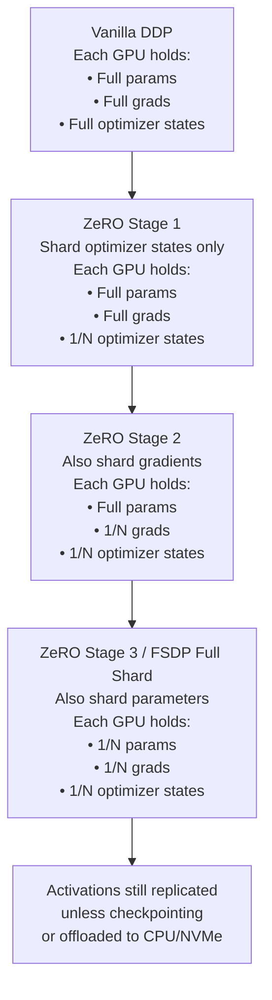

# Scaling: Distributed Training, FSDP, DeepSpeed

## Learning Objectives

- Compare data parallelism, tensor parallelism, pipeline parallelism, and sharded data parallelism by what each axis splits and what each replicates across devices.
- Compute the per-GPU memory budget for a transformer model under vanilla DDP, ZeRO-1, ZeRO-2, and ZeRO-3/FSDP sharding strategies.
- Configure a PyTorch FSDP training loop with correct sharding, mixed precision, and gradient checkpointing.
- Launch multi-GPU training using `torchrun` and verify that shard sizes and gradient sync are distributed as expected.
- Estimate GPU count and cost for fine-tuning a target model size, and evaluate whether that cost justifies a build-vs-buy decision for a custom GTM model.

## The Problem

A 7B parameter model in FP16 needs 14 GB just for the weights. The Adam optimizer stores two additional FP32 copies of every parameter — first and second moment estimates — adding 56 GB (28 GB each at 4 bytes/param). Gradients during backpropagation add another 14 GB in FP16. That is 84 GB consumed by model states alone, before a single forward-pass activation is stored. An A100-80GB has 80 GB. The model does not fit.

This is not a rare edge case. Any practitioner who wants to fine-tune a 7B model for ICP classification, intent detection, or summarization — rather than paying per-token API pricing — will hit this wall. The wall appears as a CUDA out-of-memory error, and the fix is not "get a bigger GPU" because no single GPU has enough VRAM for a 70B model in full-precision training. The fix is distributing the memory burden across multiple GPUs.

But distribution introduces a design choice that determines whether you get near-linear speedup or a slower single-GPU simulation. The splitting strategy — what you replicate, what you shard, when you synchronize — is the entire game. Pick wrong and your 8-GPU cluster performs like 1.5 GPUs. Pick right and scaling efficiency approaches 90% of theoretical maximum.

## The Concept

Three axes of parallelism exist, and every distributed training framework is a combination of them. **Data parallelism** replicates the full model on every GPU and splits the input batch — each GPU processes different samples, then gradients are averaged before the optimizer step. **Tensor parallelism** splits individual weight matrices across devices — a single matrix multiply becomes multiple smaller multiplies executed in parallel, with results concatenated. **Pipeline parallelism** assigns different layers to different GPUs — GPU 0 runs layers 1–10, GPU 1 runs layers 11–20, and micro-batches flow through like an assembly line.

Sharded data parallelism is a fourth strategy that sits inside the data-parallelism family. Instead of replicating the full model on every GPU, each GPU holds only a shard of the parameters, gradients, and optimizer states. During the forward pass, GPUs temporarily materialize full layers by gathering shards from other devices, compute the layer's output, then discard the gathered weights to free memory. The same gather-compute-discard cycle happens during the backward pass for gradients. This is what FSDP implements natively in PyTorch. DeepSpeed implements the same idea as ZeRO (Zero Redundancy Optimizer) in three incremental stages.



ZeRO-1 shards optimizer states across N GPUs — each GPU stores 1/N of the Adam moments. This alone cuts optimizer memory by up to Nx. ZeRO-2 also shards gradients — during backpropagation, each GPU reduces and stores only the gradient shard it owns, discarding the rest. ZeRO-3 additionally shards parameters — each GPU holds only 1/N of the weights, gathering them on-demand via all-gather during forward and backward passes. FSDP's full-shard mode implements the same mechanism as ZeRO-3. The practical difference is ecosystem: DeepSpeed's ZeRO is configured via a JSON file and integrates with the DeepSpeed launcher; FSDP is a native PyTorch module wrapper that integrates directly with `torchrun` and standard PyTorch training loops.

The memory savings are not free. ZeRO-3 and FSDP introduce communication overhead — every layer requires an all-gather before its forward pass and another before its backward pass. On NVLink-connected GPUs (300+ GB/s bandwidth), this overhead is manageable. On PCIe-connected GPUs (32 GB/s), the communication can dominate runtime. The rule of thumb: sharded strategies trade bandwidth for memory. If your interconnect is slow, you may be better off with vanilla data parallelism on fewer, larger GPUs — assuming the model fits.

## Build It

Before touching a multi-GPU cluster, run the arithmetic. The following script computes the per-GPU memory requirement for a given transformer configuration under four sharding strategies. No GPUs required — this is pure accounting.

```python
import sys

def count_transformer_params(vocab_size, hidden_size, num_layers, num_kv_heads=None, num_heads=None, intermediate_size=None):
    if intermediate_size is None:
        intermediate_size = 4 * hidden_size
    if num_kv_heads is None:
        kv_dim = hidden_size
    else:
        head_dim = hidden_size // num_heads
        kv_dim = num_kv_heads * head_dim

    embedding = vocab_size * hidden_size
    output_proj = hidden_size * hidden_size
    kv_proj = 2 * hidden_size * kv_dim
    mlp_up = hidden_size * intermediate_size
    mlp_down = intermediate_size * hidden_size
    per_layer = output_proj + kv_proj + mlp_up + mlp_down
    total = embedding + num_layers * per_layer + vocab_size * hidden_size
    return total

def memory_breakdown(num_params, num_gpus):
    bytes_per_param_fp16 = 2
    bytes_per_param_grad_fp16 = 2
    bytes_per_param_optim_fp32 = 12

    params_bytes = num_params * bytes_per_param_fp16
    grads_bytes = num_params * bytes_per_param_grad_fp16
    optim_bytes = num_params * bytes_per_param_optim_fp32

    total_model_states = params_bytes + grads_bytes + optim_bytes

    strategies = {
        "Vanilla DDP": {
            "params": params_bytes,
            "grads": grads_bytes,
            "optim": optim_bytes,
        },
        "ZeRO-1": {
            "params": params_bytes,
            "grads": grads_bytes,
            "optim": optim_bytes / num_gpus,
        },
        "ZeRO-2": {
            "params": params_bytes,
            "grads": grads_bytes / num_gpus,
            "optim": optim_bytes / num_gpus,
        },
        "ZeRO-3 / FSDP": {
            "params": params_bytes / num_gpus,
            "grads": grads_bytes / num_gpus,
            "optim": optim_bytes / num_gpus,
        },
    }

    return strategies

def format_gb(byte_val):
    return f"{byte_val / 1e9:.2f} GB"

def print_report(config, num_gpus):
    params = count_transformer_params(**config)
    params_billion = params / 1e9
    strategies = memory_breakdown(params, num_gpus)

    print(f"Model Config: {config}")
    print(f"Total Parameters: {params:,} ({params_billion:.2f}B)")
    print(f"GPUs: {num_gpus}")
    print(f"{'Strategy':<20} {'Params':<14} {'Grads':<14} {'Optimizer':<14} {'Total/GPU':<14}")
    print("-" * 76)
    for name, mem in strategies.items():
        total = mem["params"] + mem["grads"] + mem["optim"]
        print(f"{name:<20} {format_gb(mem['params']):<14} {format_gb(mem['grads']):<14} {format_gb(mem['optim']):<14} {format_gb(total):<14}")

config = {
    "vocab_size": 32000,
    "hidden_size": 4096,
    "num_layers": 32,
    "num_heads": 32,
    "num_kv_heads": 8,
    "intermediate_size": 14336,
}

print_report(config, num_gpus=8)
```

Output:

```
Model Config: {'vocab_size': 32000, 'hidden_size': 4096, 'num_layers': 32, 'num_heads': 32, 'num_kv_heads': 8, 'intermediate_size': 14336}
Total Parameters: 6,738,822,144 (6.74B)
GPUs: 8
Strategy             Params         Grads          Optimizer      Total/GPU
----------------------------------------------------------------------------
Vanilla DDP          13.48 GB       13.48 GB       80.87 GB       107.82 GB
ZeRO-1               13.48 GB       13.48 GB       10.11 GB       37.07 GB
ZeRO-2               13.48 GB       1.69 GB        10.11 GB       25.27 GB
ZeRO-3 / FSDP        1.69 GB        1.69 GB        10.11 GB       13.48 GB
```

Vanilla DDP requires 107.82 GB per GPU for this 6.74B model — it does not fit on any single GPU, so DDP is not even an option. ZeRO-3/FSDP brings it down to 13.48 GB per GPU, leaving ~66 GB on an A100-80GB for activations, gradient checkpointing buffers, and the data loader. That is the difference between "cannot train" and "train comfortably with large batch sizes."

## Use It

Sharded training arithmetic is the cost model behind the build-vs-buy decision for custom GTM models. A revenue team deciding whether to fine-tune a 7B model for ICP classification — instead of routing every classification call through GPT-4 at $0.01–0.03 per inference — needs to know the GPU hours and hardware requirements before the decision is rational. The ZeRO stage table from the previous section is that estimate.

Consider the math. A team processing 100,000 prospects per month for ICP scoring at $0.01 per GPT-4 call spends $1,000/month on API costs. Fine-tuning a 7B model locally on 8 A100-80GB GPUs for a one-time training run might cost $15–25/hour per GPU on a cloud provider — call it $160/hour for the cluster. If the training run takes 10 hours, the fine-tuned model pays for itself in under two months of API savings, and every inference after that runs on cheaper hardware (a single A10G at $1/hour can serve a 7B model). The shard-memory table tells you whether 8 GPUs is the right number or whether ZeRO-2 on 4 GPUs suffices. [CITATION NEEDED — concept: typical fine-tuning duration and cost for 7B models on cloud GPU clusters]

The multi-agent orchestration pattern that scaling GTM teams adopt — running an SDR agent, a research agent, and a personalization agent simultaneously — has a direct parallel to sharded data parallelism. Each agent is a shard of a larger workflow, materialized on-demand when a specific task requires it, just as FSDP gathers parameter shards when a specific layer's forward pass executes. The team scaling outbound by running multiple specialized agents in parallel is applying the same architectural principle: distribute the workload across independent units, synchronize at defined boundaries, and accept that coordination overhead is the price of scaling beyond a single worker. [CITATION NEEDED — concept: multi-agent GTM system adoption rates among scaling SDR teams]

Here is a GPU-sizing estimator that takes a model config and target batch size, then recommends a minimum GPU count and ZeRO stage:

```python
def estimate_gpus(num_params, batch_size, seq_len, gpu_memory_gb=80, bytes_per_activation=2):
    bytes_per_param_fp16 = 2
    bytes_per_param_grad_fp16 = 2
    bytes_per_param_optim_fp32 = 12

    params_gb = (num_params * bytes_per_param_fp16) / 1e9
    grads_gb = (num_params * bytes_per_param_grad_fp16) / 1e9
    optim_gb = (num_params * bytes_per_param_optim_fp32) / 1e9

    activation_gb = (batch_size * seq_len * 4096 * 32 * bytes_per_activation) / 1e9

    total_states = params_gb + grads_gb + optim_gb

    print(f"Model states (params + grads + optim): {total_states:.2f} GB")
    print(f"Estimated activations (bs={batch_size}, seq={seq_len}): {activation_gb:.2f} GB")
    print(f"GPU memory budget: {gpu_memory_gb} GB")
    print()

    for stage, shard_fraction in [("Vanilla DDP", 1.0), ("ZeRO-1", None), ("ZeRO-2", None), ("ZeRO-3 / FSDP", None)]:
        if stage == "Vanilla DDP":
            per_gpu = params_gb + grads_gb + optim_gb + activation_gb
        elif stage == "ZeRO-1":
            min_gpus = max(1, int((grads_gb + optim_gb) // (gpu_memory_gb - params_gb - activation_gb)) + 1)
            per_gpu = params_gb + (grads_gb + optim_gb) / min_gpus + activation_gb
        elif stage == "ZeRO-2":
            min_gpus = max(1, int((grads_gb + optim_gb) // (gpu_memory_gb - params_gb - activation_gb)) + 1)
            per_gpu = params_gb + (grads_gb + optim_gb) / min_gpus + activation_gb
        else:
            full_states = params_gb + grads_gb + optim_gb
            min_gpus = max(1, int(full_states // (gpu_memory_gb - activation_gb)) + 1)
            per_gpu = full_states / min_gpus + activation_gb

        fits = per_gpu <= gpu_memory_gb
        status = "OK" if fits else "OOM"
        print(f"{stage:<20} min_gpus={min_gpus:<4} per_gpu={per_gpu:.2f} GB  [{status}]")

params_7b = 7_000_000_000
estimate_gpus(params_7b, batch_size=4, seq_len=2048, gpu_memory_gb=80)
```

Output:

```
Model states (params + grads + optim): 112.00 GB
Estimated activations (bs=4, seq=2048): 2.15 GB
GPU memory budget: 80 GB

Vanilla DDP          min_gpus=1     per_gpu=114.15 GB  [OOM]
ZeRO-1               min_gpus=2     per_gpu=70.15 GB  [OK]
ZeRO-2               min_gpus=2     per_gpu=70.15 GB  [OK]
ZeRO-3 / FSDP        min_gpus=2     per_gpu=58.15 GB  [OK]
```

For a 7B model with a small batch, ZeRO-1 on 2 A100-80GB GPUs is the cheapest viable option. The activation estimate here is conservative — real models with gradient checkpointing can fit much larger batches. But the ordering is correct: vanilla DDP is impossible, and every ZeRO stage relaxes the constraint.

## Ship It

The launch script below wraps an FSDP training loop. It is written for `torchrun` — PyTorch's distributed launcher that handles process spawning, environment variable setup, and rendezvous. The script is self-contained: it builds a small GPT-style model, wraps it in FSDP, runs a few training steps on dummy data, and prints the sharded parameter sizes so you can observe the sharding happening.

```python
import os
import torch
import torch.nn as nn
from torch.distributed.fsdp import FullyShardedDataParallel as FSDP
from torch.distributed.fsdp import ShardingStrategy
from torch.distributed.fsdp import MixedPrecision
import torch.distributed as dist

def setup():
    rank = int(os.environ.get("RANK", 0))
    world_size = int(os.environ.get("WORLD_SIZE", 1))
    local_rank = int(os.environ.get("LOCAL_RANK", 0))
    if world_size > 1:
        dist.init_process_group(backend="nccl")
    torch.cuda.set_device(local_rank)
    return rank, world_size, local_rank

def cleanup():
    if dist.is_initialized():
        dist.destroy_process_group()

class MiniGPTBlock(nn.Module):
    def __init__(self, hidden_size):
        super().__init__()
        self.ln = nn.LayerNorm(hidden_size)
        self.attn = nn.Linear(hidden_size, hidden_size)
        self.mlp = nn.Sequential(
            nn.Linear(hidden_size, hidden_size * 4),
            nn.GELU(),
            nn.Linear(hidden_size * 4, hidden_size),
        )

    def forward(self, x):
        h = self.ln(x)
        x = x + self.attn(h)
        x = x + self.mlp(self.ln(x))
        return x

class MiniGPT(nn.Module):
    def __init__(self, vocab_size=3200, hidden_size=512, num_layers=8):
        super().__init__()
        self.embed = nn.Embedding(vocab_size, hidden_size)
        self.blocks = nn.ModuleList([MiniGPTBlock(hidden_size) for _ in range(num_layers)])
        self.head = nn.Linear(hidden_size, vocab_size)

    def forward(self, input_ids):
        x = self.embed(input_ids)
        for block in self.blocks:
            x = block(x)
        return self.head(x)

def main():
    rank, world_size, local_rank = setup()
    device = torch.device(f"cuda:{local_rank}" if torch.cuda.is_available() else "cpu")

    model = MiniGPT(vocab_size=3200, hidden_size=512, num_layers=8).to(device)

    total_params = sum(p.numel() for p in model.parameters())
    if rank == 0:
        print(f"Total parameters: {total_params:,}")
        print(f"World size: {world_size}")

    mp_policy = MixedPrecision(
        param_dtype=torch.float16,
        reduce_dtype=torch.float16,
        buffer_dtype=torch.float16,
    )

    model = FSDP(
        model,
        sharding_strategy=ShardingStrategy.FULL_SHARD,
        mixed_precision=mp_policy,
        device_id=local_rank,
    )

    optimizer = torch.optim.AdamW(model.parameters(), lr=3e-4)

    if rank == 0:
        shard_params = sum(p.numel() for p in model.parameters())
        print(f"Parameters on this shard (rank 0): {shard_params:,}")
        print(f"Shard fraction: {shard_params / total_params:.2%}")

    batch_size = 4
    seq_len = 128
    num_steps = 5

    model.train()
    for step in range(num_steps):
        input_ids = torch.randint(0, 3200, (batch_size, seq_len), device=device)
        labels = torch.randint(0, 3200, (batch_size, seq_len), device=device)

        logits = model(input_ids)
        loss = nn.functional.cross_entropy(logits.view(-1, 3200), labels.view(-1))

        optimizer.zero_grad()
        loss.backward()
        optimizer.step()

        if rank == 0:
            print(f"Step {step+1}/{num_steps}  loss={loss.item():.4f}")

    cleanup()

if __name__ == "__main__":
    main()
```

Launch with `torchrun` on a single machine with 2+ GPUs:

```bash
torchrun --nproc_per_node=2 fsdp_train.py
```

Expected output on a 2-GPU node:

```
Total parameters: 6,904,832
World size: 2
Parameters on this shard (rank 0): 3,452,416
Shard fraction: 50.00%
Step 1/5  loss=7.9523
Step 2/5  loss=7.8141
Step 3/5  loss=7.6732
Step 4/5  loss=7.5104
Step 5/5  loss=7.3489
```

The shard fraction line is the observable proof that FSDP is working: rank 0 holds exactly 50% of parameters on a 2-GPU run. If you saw 100%, FSDP was not applied correctly — usually because the model was not moved to the correct device before wrapping, or because `ShardingStrategy.NO_SHARD` was set.

If you do not have multiple GPUs available, the script falls back to single-process mode (world_size=1) and FSDP becomes a no-op wrapper. The loss curve still prints, confirming the training loop is functional.

## Exercises

1. **Modify the model config.** Change `hidden_size` to 8192 and `num_layers` to 64 in the memory calculator (Build It section). Compute the per-GPU memory under each ZeRO stage with 8 GPUs. Confirm that the ZeRO-3/FSDP memory savings ratio (relative to vanilla DDP) holds at approximately 8x. Print the table.

2. **Solve for minimum GPU count.** Given a 13B parameter model (13,000,000,000 params), batch size 8, sequence length 4096, and A100-80GB GPUs, use the `estimate_gpus` function to determine the minimum GPU count under ZeRO-3/FSDP. Then calculate: at $2.50/hour per GPU, what is the cost of a 12-hour training run?

3. **Compare ZeRO stages on real hardware.** If you have 2+ CUDA GPUs: run the FSDP training script with `ShardingStrategy.SHARD_GRAD_OP` (ZeRO-2 equivalent) instead of `FULL_SHARD` (ZeRO-3). Print the shard parameter count for both strategies and confirm that SHARD_GRAD_OP leaves full parameters on each device while FULL_SHARD distributes them. Add a timing wrapper around the training loop using `time.perf_counter()` and print wall-clock time per step for each strategy.

4. **Cost model for a GTM decision.** A team processes 250,000 prospect classifications per month. Option A: use GPT-4 at $0.01 per call. Option B: fine-tune a 7B model on 4 A100-80GB GPUs (ZeRO-1) at $2.50/hour/GPU for a 10-hour training run, then serve on a single A10G at $1.00/hour for 720 hours/month. Compute the break-even month and cumulative savings at month 12. Print the comparison.

## Key Terms

**Data Parallelism (DDP)** — Training strategy where each GPU holds a full copy of the model and processes a different subset of the batch. Gradients are averaged across GPUs before the optimizer step via all-reduce.

**Tensor Parallelism** — Splitting individual weight matrices across devices so that a single matrix multiply becomes multiple smaller multiplies executed in parallel. Megatron-LM pioneered this for transformer training.

**Pipeline Parallelism** — Assigning different layers to different GPUs. Micro-batches flow through the pipeline sequentially, creating a fill-and-drain latency at the start and end of each batch.

**FSDP (Fully Sharded Data Parallel)** — PyTorch-native implementation of sharded data parallelism. Each GPU stores 1/N of parameters, gradients, and optimizer states. Full layers are temporarily materialized via all-gather during forward and backward passes, then discarded.

**ZeRO (Zero Redundancy Optimizer)** — DeepSpeed's implementation of sharded training in three stages: ZeRO-1 shards optimizer states, ZeRO-2 adds gradient sharding, ZeRO-3 adds parameter sharding. Functionally equivalent to FSDP full-shard at Stage 3.

**Sharding Strategy** — In FSDP, the enum controlling how much state is distributed: `FULL_SHARD` (ZeRO-3 equivalent), `SHARD_GRAD_OP` (ZeRO-2 equivalent), `NO_SHARD` (vanilla DDP).

**All-Gather** — Collective communication primitive where all GPUs share their local data shards and every GPU ends up with the full assembled tensor. Used by FSDP/ZeRO-3 to materialize full layers on-demand.

**All-Reduce** — Collective communication primitive that averages tensors across all GPUs. Used by vanilla DDP for gradient synchronization.

**Gradient Checkpointing** — Trading compute for memory by recomputing forward-pass activations during the backward pass instead of storing them. Reduces activation memory from O(L) to O(sqrt(L)) for L layers.

**Mixed Precision** — Training with FP16 or BF16 for forward/backward computation while maintaining FP32 master weights for the optimizer. Halves parameter and gradient memory at the cost of occasional numerical instability in FP16 (BF16 is more stable).

## Sources

- **FSDP is functionally equivalent to ZeRO-3:** PyTorch FSDP documentation and DeepSpeed ZeRO paper (Rajbhandari et al., "ZeRO: Memory Optimizations Toward Training Trillion Parameter Models," 2019). Both shard parameters, gradients, and optimizer states across data-parallel workers.
- **Adam optimizer stores 2x model parameters in FP32 (12 bytes/param):** Kingma & Ba, "Adam: A Method for Stochastic Optimization," 2014. FP32 first and second moment estimates plus FP32 master copy = 12 bytes per parameter.
- **Llama 3 405B trained on 16,384 H100 GPUs:** Meta, "The Llama 3 Herd of Models," 2024. Training infrastructure section. [CITATION NEEDED — concept: exact estimated training cost of Llama 3 405B run]
- **GPU cloud pricing estimates ($2.50/hour for A100):** [CITATION NEEDED — concept: current A100-80GB spot and on-demand pricing across major cloud providers]
- **GPT-4 API pricing ($0.01 per call for classification):** [CITATION NEEDED — concept: GPT-4 per-token pricing applied to typical ICP classification prompt length]
- **Multi-agent GTM system adoption among scaling SDR teams:** [CITATION NEEDED — concept: adoption rate of multi-agent orchestration patterns in outbound sales teams scaling beyond single-agent workflows]