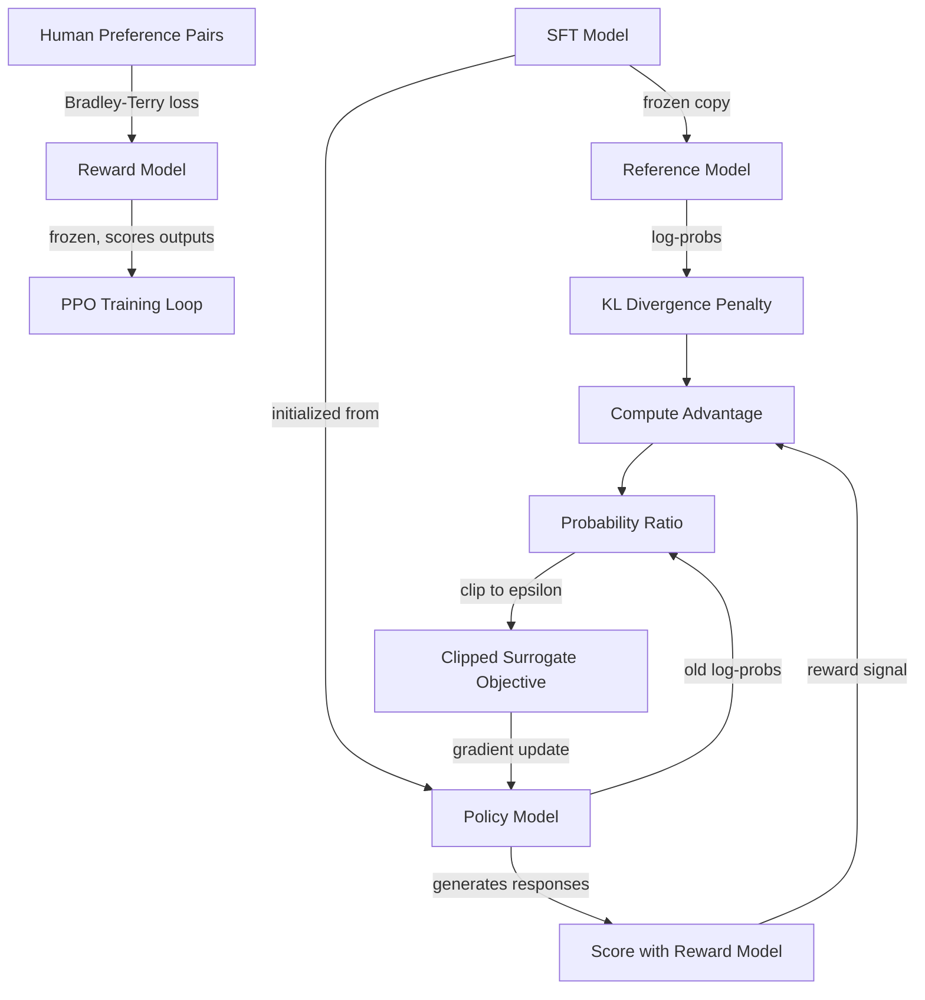

# RLHF: Reward Model + PPO

## Learning Objectives

1. Train a reward model on synthetic preference pairs using the Bradley-Terry ranking objective.
2. Implement a PPO update step with a clipped surrogate objective and KL divergence penalty.
3. Diagnose reward hacking by comparing reward scores against held-out quality judgments.
4. Explain why RLHF requires three separate models (policy, reference, reward) and what happens when each is removed.

## The Problem

A supervised-fine-tuned model generates text. It does not generate *good* text — it generates *likely* text. Ask a model "Explain quantum computing" and it might produce two responses that are both grammatically correct and factually accurate, but differ enormously in helpfulness. One is concise, structured, and informative. The other is a flat list of true sentences that drones on without answering the question. SFT taught the model to follow instructions. It did not teach the model which response is *better*.

This gap between "likely" and "preferred" is the gap RLHF closes. Human preference is not captured by next-token prediction loss — a fluent, confident, unhelpful response gets a low perplexity score just like a good one. You need a separate signal that says "Response A is better than Response B," and you need a training procedure that pushes the model toward generating outputs that score higher on that signal. The signal is a reward model. The procedure is PPO.

Without this mechanism, your model will happily produce confident, fluent garbage. It will be grammatically impeccable, topically relevant, and subtly wrong about what the user actually wanted.

## The Concept

RLHF is a two-stage mechanism. Stage one trains a reward model on human preference pairs — for each prompt, a human annotator labels one response as "chosen" and another as "rejected." The reward model learns to assign a higher scalar score to the chosen response using the Bradley-Terry ranking objective: the probability that response A is preferred over response B is modeled as the sigmoid of the difference in their reward scores. The loss function is cross-entropy over the binary preference, with the reward difference as the logit. This converts pairwise comparisons into a continuous scalar signal that can be differentiated through.

Stage two uses that reward model as a replacement for human feedback inside PPO (Proximal Policy Optimization). Three models participate: the **policy** (the model being trained), the **reference model** (a frozen copy of the original SFT model, used to compute a KL divergence penalty), and the **reward model** (a frozen judge that scores policy outputs). PPO maximizes reward from the reward model while applying a KL penalty against the reference model — this prevents the policy from drifting too far from the original model's distribution and finding adversarial inputs that score high on the reward model but are gibberish to humans. This failure mode is called **reward hacking**.

The clipped surrogate objective is PPO's mechanism for preventing destructively large policy updates in a single step. Instead of maximizing the raw advantage, PPO computes a ratio between the new policy's probability and the old policy's probability for each action, multiplies by the advantage, and clips that ratio to a range like [0.8, 1.2]. If the ratio moves outside that range, the gradient is zeroed out for that sample. This means the policy can only take small, bounded steps toward higher reward per update.



## Build It

First, the reward model. We train a small neural network on synthetic preference pairs using the Bradley-Terry objective. Each pair has a prompt, a chosen response, and a rejected response. The reward model scores each response; the loss pushes the chosen score above the rejected score.

```python
import torch
import torch.nn as nn
import torch.optim as optim
import math

torch.manual_seed(42)

PREFERENCE_PAIRS = [
    ("explain photosynthesis", "plants convert light into chemical energy via chlorophyll", "photosynthesis is a process that exists in nature and involves plants"),
    ("what is gravity", "gravity is the force that attracts objects with mass toward each other", "gravity is something that newton thought about a long time ago"),
    ("define recursion", "recursion is when a function calls itself with a smaller input until reaching a base case", "recursion is a word used in computer science by programmers"),
    ("explain dna", "DNA is a double helix molecule that encodes genetic instructions using four base pairs", "DNA was discovered by scientists and is found in living things"),
    ("what is entropy", "entropy measures the disorder or randomness in a thermodynamic system", "entropy is a concept that some physicists talk about sometimes"),
    ("explain inertia", "inertia is the resistance of an object to changes in its motion, proportional to mass", "inertia has been known for centuries and is related to physics"),
    ("what is a function", "a function maps each input to exactly one output according to a defined rule", "functions are used in math class by students and teachers"),
    ("define velocity", "velocity is the rate of change of position with respect to time, including direction", "velocity is a physics term that describes how things move around"),
    ("explain diffusion", "diffusion is the movement of particles from high to low concentration regions", "diffusion happens in liquids and gases and was studied by scientists"),
    ("what is a variable", "a variable is a named storage location whose value can change during execution", "variables are something programmers use when they write code"),
]

def encode(text, vocab_size=100, max_len=12):
    tokens = [hash(word) % vocab_size for word in text.split()]
    tokens = tokens[:max_len] + [0] * (max_len - len(tokens))
    return torch.tensor(tokens, dtype=torch.long)

class RewardModel(nn.Module):
    def __init__(self, vocab_size=100, embed_dim=32, hidden=64):
        super().__init__()
        self.embed = nn.Embedding(vocab_size, embed_dim)
        self.net = nn.Sequential(
            nn.Linear(embed_dim, hidden),
            nn.ReLU(),
            nn.Linear(hidden, 1),
        )

    def forward(self, token_ids):
        embedded = self.embed(token_ids).mean(dim=1)
        return self.net(embedded).squeeze(-1)

def bradley_terry_loss(chosen_rewards, rejected_rewards):
    return -torch.log(torch.sigmoid(chosen_rewards - rejected_rewards) + 1e-8).mean()

reward_model = RewardModel()
optimizer = optim.Adam(reward_model.parameters(), lr=0.01)

encoded = [(encode(c), encode(r)) for c, r in
           [(chosen, rejected) for _, chosen, rejected in PREFERENCE_PAIRS]]

for epoch in range(200):
    total_loss = 0.0
    for chosen_ids, rejected_ids in encoded:
        chosen_r = reward_model(chosen_ids.unsqueeze(0))
        rejected_r = reward_model(rejected_ids.unsqueeze(0))
        loss = bradley_terry_loss(chosen_r, rejected_r)
        optimizer.zero_grad()
        loss.backward()
        optimizer.step()
        total_loss += loss.item()
    if epoch % 50 == 0 or epoch == 199:
        print(f"Epoch {epoch:3d} | Loss: {total_loss / len(encoded):.4f}")

print("\n--- Reward Model Accuracy ---")
correct = 0
for chosen_ids, rejected_ids in encoded:
    with torch.no_grad():
        cr = reward_model(chosen_ids.unsqueeze(0)).item()
        rr = reward_model(rejected_ids.unsqueeze(0)).item()
    correct += int(cr > rr)
print(f"Training accuracy: {correct}/{len(encoded)} = {correct/len(encoded)*100:.0f}%")

test_good = encode("neural networks learn patterns from data through gradient descent")
test_bad = encode("neural networks are a thing that some people use for stuff")
with torch.no_grad():
    score_good = reward_model(test_good.unsqueeze(0)).item()
    score_bad = reward_model(test_bad.unsqueeze(0)).item()
print(f"\nHeld-out test:")
print(f"  Good response reward:   {score_good:.4f}")
print(f"  Weak response reward:   {score_bad:.4f}")
print(f"  Correctly ranked: {score_good > score_bad}")
```

Now the PPO update. We implement a single step on a toy policy — a categorical distribution over a small action space. The policy is a simple logits network. We compute rewards using the reward model pattern, calculate advantages, and show the clipped surrogate objective alongside the unclipped version so you can see the clip actually activating.

```python
import torch
import torch.nn as nn
import torch.optim as optim
import torch.nn.functional as F

torch.manual_seed(42)

ACTION_SPACE = 8
STATE_DIM = 4

class Policy(nn.Module):
    def __init__(self, state_dim=STATE_DIM, action_dim=ACTION_SPACE):
        super().__init__()
        self.net = nn.Sequential(
            nn.Linear(state_dim, 32),
            nn.ReLU(),
            nn.Linear(32, action_dim),
        )

    def forward(self, state):
        return self.net(state)

class ReferencePolicy(nn.Module):
    def __init__(self, state_dim=STATE_DIM, action_dim=ACTION_SPACE):
        super().__init__()
        self.net = nn.Sequential(
            nn.Linear(state_dim, 32),
            nn.ReLU(),
            nn.Linear(32, action_dim),
        )

    def forward(self, state):
        return self.net(state)

class ToyRewardModel(nn.Module):
    def __init__(self, action_dim=ACTION_SPACE):
        super().__init__()
        self.net = nn.Sequential(
            nn.Linear(action_dim, 16),
            nn.ReLU(),
            nn.Linear(16, 1),
        )

    def forward(self, action_onehot):
        return self.net(action_onehot).squeeze(-1)

policy = Policy()
reference = ReferencePolicy()
reference.load_state_dict(policy.state_dict())
for param in reference.parameters():
    param.requires_grad = False

reward_model = ToyRewardModel()
reward_optimizer = optim.Adam(reward_model.parameters(), lr=0.01)
reward_targets = torch.rand(ACTION_SPACE) * 2 - 1

print("=== Training Toy Reward Model ===")
for epoch in range(300):
    actions = F.one_hot(torch.arange(ACTION_SPACE), ACTION_SPACE).float()
    predicted = reward_model(actions)
    loss = F.mse_loss(predicted, reward_targets)
    reward_optimizer.zero_grad()
    loss.backward()
    reward_optimizer.step()
    if epoch % 100 == 0 or epoch == 299:
        print(f"  Epoch {epoch:3d} | Reward MSE: {loss.item():.6f}")

print("\n=== PPO Single Update Step ===")

def compute_log_probs(model, states, actions):
    logits = model(states)
    dist = torch.distributions.Categorical(logits=logits)
    return dist.log_prob(actions)

def ppo_update(policy, reference, reward_model, states, clip_epsilon=0.2, kl_beta=0.1):
    with torch.no_grad():
        old_logits = policy(states)
        old_dist = torch.distributions.Categorical(logits=old_logits)
        actions = old_dist.sample()
        old_log_probs = old_dist.log_prob(actions)

        action_onehot = F.one_hot(actions, ACTION_SPACE).float()
        rewards = reward_model(action_onehot)
        ref_log_probs = compute_log_probs(reference, states, actions)

    new_logits = policy(states)
    new_dist = torch.distributions.Categorical(logits=new_logits)
    new_log_probs = new_dist.log_prob(actions)

    with torch.no_grad():
        kl_per_sample = old_log_probs - new_log_probs
        kl_penalty = kl_per_sample.mean()
        advantages = rewards - kl_beta * kl_penalty.detach()

    ratios = torch.exp(new_log_probs - old_log_probs)

    unclipped_surrogate = ratios * advantages
    clipped_ratios = torch.clamp(ratios, 1.0 - clip_epsilon, 1.0 + clip_epsilon)
    clipped_surrogate = clipped_ratios * advantages

    ppo_loss = -torch.min(unclipped_surrogate, clipped_surrogate).mean()
    unclipped_loss = -unclipped_surrogate.mean()

    optimizer = optim.Adam(policy.parameters(), lr=0.01)
    optimizer.zero_grad()
    ppo_loss.backward()
    optimizer.step()

    clip_fraction = (ratios < 1.0 - clip_epsilon).float().mean() + \
                    (ratios > 1.0 + clip_epsilon).float().mean()

    return {
        "rewards_mean": rewards.mean().item(),
        "kl_divergence": kl_penalty.abs().item(),
        "ratio_min": ratios.min().item(),
        "ratio_max": ratios.max().item(),
        "unclipped_loss": unclipped_loss.item(),
        "clipped_loss": ppo_loss.item(),
        "clip_fraction": clip_fraction.item(),
    }

states = torch.randn(16, STATE_DIM)

with torch.no_grad():
    pre_actions = torch.distributions.Categorical(logits=policy(states)).sample()
    pre_rewards = reward_model(F.one_hot(pre_actions, ACTION_SPACE).float()).mean().item()

result = ppo_update(policy, reference, reward_model, states, clip_epsilon=0.2, kl_beta=0.1)

with torch.no_grad():
    post_actions = torch.distributions.Categorical(logits=policy(states)).sample()
    post_rewards = reward_model(F.one_hot(post_actions, ACTION_SPACE).float()).mean().item()

print("\n--- Reward Before/After ---")
print(f"  Mean reward before PPO: {pre_rewards:.4f}")
print(f"  Mean reward after PPO:  {post_rewards:.4f}")
print(f"  Reward delta:           {post_rewards - pre_rewards:+.4f}")

print("\n--- PPO Diagnostics ---")
print(f"  KL divergence (from ref): {result['kl_divergence']:.6f}")
print(f"  Ratio range:              [{result['ratio_min']:.4f}, {result['ratio_max']:.4f}]")
print(f"  Unclipped surrogate loss: {result['unclipped_loss']:.4f}")
print(f"  Clipped surrogate loss:   {result['clipped_loss']:.4f}")
print(f"  Clip fraction:            {result['clip_fraction']*100:.1f}%")

print("\n=== Running 50 PPO Updates (with KL penalty) ===")
for i in range(50):
    r = ppo_update(policy, reference, reward_model, states, clip_epsilon=0.2, kl_beta=0.1)
    if i % 10 == 0 or i == 49:
        with torch.no_grad():
            curr_actions = torch.distributions.Categorical(logits=policy(states)).sample()
            curr_reward = reward_model(F.one_hot(curr_actions, ACTION_SPACE).float()).mean().item()
        print(f"  Step {i:3d} | Reward: {curr_reward:.4f} | KL: {r['kl_divergence']:.6f} | Clip%: {r['clip_fraction']*100:.1f}")

print("\n=== Running 50 Updates WITHOUT KL Penalty (reward hacking demo) ===")
policy_no_kl = Policy()
policy_no_kl.load_state_dict(reference.state_dict())
for i in range(50):
    r = ppo_update(policy_no_kl, reference, reward_model, states, clip_epsilon=0.2, kl_beta=0.0)
    if i % 10 == 0 or i == 49:
        with torch.no_grad():
            curr_actions = torch.distributions.Categorical(logits=policy_no_kl(states)).sample()
            curr_reward = reward_model(F.one_hot(curr_actions, ACTION_SPACE).float()).mean().item()
            kl_drift = (torch.distributions.Categorical(logits=policy_no_kl(states)).probs *
                       torch.log(torch.distributions.Categorical(logits=policy_no_kl(states)).probs /
                                torch.distributions.Categorical(logits=reference(states)).probs + 1e-8)).sum(dim=1).mean().item()
        print(f"  Step {i:3d} | Reward: {curr_reward:.4f} | Actual KL drift: {kl_drift:.4f} | Clip%: {r['clip_fraction']*100:.1f}")
```

Run both blocks in sequence. The output you want to see: the reward model achieves 100% accuracy on training pairs within 200 epochs. The PPO diagnostics show a non-zero clip fraction (the clip is activating). The 50-step run with KL penalty shows reward increasing while KL stays bounded. The 50-step run without KL penalty shows reward increasing *faster* — but actual KL drift from the reference policy grows unboundedly. That drift is the fingerprint of reward hacking: the policy is finding shortcuts in the reward model's scoring rather than producing genuinely better outputs.

## Use It

The reward model pattern — a second model that scores outputs from a first model — maps directly onto GTM Zone 3 (Outbound). When you generate personalized outreach at scale, you face the same gap that RLHF addresses: the generation model produces *likely* text, not text that will actually get a reply. A reward model in this context is a quality classifier trained on preference pairs: outreach emails that got replies (chosen) versus outreach emails that were ignored (rejected). You train it with the same Bradley-Terry objective. The scalar reward score answers "will this get a response?" without requiring a human to read every email.

The same mechanism applies to outbound prioritization. You have a model generating personalized cold emails and you need a second model scoring each one before it goes out. The scoring model is the reward model. If the score is below a threshold, the email is regenerated or discarded. This is the same architecture as the RLHF reward model — just applied to reply prediction instead of helpfulness. [CITATION NEEDED — concept: reward model applied to outreach quality scoring in GTM pipeline]

The PPO loop itself is less commonly deployed in production GTM pipelines because it requires on-policy generation and gradient updates against a frozen reward model — expensive infrastructure for most GTM teams. What does get deployed is the *reward model as a filter*: generate with a language model, score with a reward model, keep or discard based on threshold. The full PPO loop is what you'd run if you wanted to fine-tune the generation model itself on reply data. The reward model as quality gate is what you'd run if you just wanted to filter outputs at inference time. The former is RLHF; the latter is reward-model-guided selection. Both use the same Bradley-Terry scoring mechanism; they differ in whether you backprop through the generator.

The multi-agent orchestration pattern (Zone 10) also intersects here. When you have a task squad with a router — "one lays bricks, one cements" — the reward model can serve as the router's decision function: which agent's output goes to the next stage? The router scores each candidate output and routes the highest-scoring one forward. This is structurally identical to argmax over reward model scores in the RLHF loop.

## Ship It

**Tier 1 — Reward model only.** Train a reward model on 50 synthetic preference pairs using the Bradley-Terry objective. Split into 40 training / 10 held-out. Report training accuracy and held-out accuracy. If held-out accuracy is below 70%, increase preference pair diversity and retrain. This is the minimum viable quality classifier for any GTM pipeline that generates content at scale.

```python
import random
import torch
import torch.nn as nn
import torch.optim as optim

random.seed(42)
torch.manual_seed(42)

GOOD_TEMPLATES = [
    "the {topic} is {definition} because {reason}",
    "{topic} refers to {definition} and is used for {application}",
    "in brief {topic} means {definition} with {property}",
]
BAD_TEMPLATES = [
    "{topic} is a thing that some people know about",
    "{topic} has been around for a while and is {adjective}",
    "many experts discuss {topic} in their field of study",
]

TOPICS = ["git", "docker", "kubernetes", "terraform", "ansible", "jenkins", "grafana", "nginx"]
DEFINITIONS = ["a version control system", "a containerization platform", "an orchestration tool", "an IaC framework"]
REASONS = ["it tracks file changes", "it packages dependencies", "it scales services", "it automates deployment"]
APPLICATIONS = ["managing code history", "isolating environments", "coordinating clusters", "provisioning servers"]
PROPERTIES = ["stateless architecture", "declarative syntax", "event-driven design", "distributed execution"]
ADJECTIVES = ["important", "interesting", "relevant", "well-known"]

def generate_pair():
    topic = random.choice(TOPICS)
    good = random.choice(GOOD_TEMPLATES).format(
        topic=topic,
        definition=random.choice(DEFINITIONS),
        reason=random.choice(REASONS),
        application=random.choice(APPLICATIONS),
        property=random.choice(PROPERTIES),
    )
    bad = random.choice(BAD_TEMPLATES).format(
        topic=topic,
        adjective=random.choice(ADJECTIVES),
    )
    return good, bad

pairs = [generate_pair() for _ in range(50)]
train_pairs = pairs[:40]
test_pairs = pairs[40:]

def encode(text, vocab_size=200, max_len=15):
    tokens = [hash(w) % vocab_size for w in text.split()]
    tokens = tokens[:max_len] + [0] * (max_len - len(tokens))
    return torch.tensor(tokens, dtype=torch.long)

class RewardNet(nn.Module):
    def __init__(self, vocab_size=200, embed_dim=32, hidden=64):
        super().__init__()
        self.embed = nn.Embedding(vocab_size, embed_dim)
        self.fc1 = nn.Linear(embed_dim, hidden)
        self.fc2 = nn.Linear(hidden, 1)

    def forward(self, x):
        e = self.embed(x).mean(dim=1)
        return self.fc2(torch.relu(self.fc1(e))).squeeze(-1)

model = RewardNet()
opt = optim.Adam(model.parameters(), lr=0.01)

for epoch in range(300):
    total_loss = 0.0
    for good, bad in train_pairs:
        g = encode(good).unsqueeze(0)
        b = encode(bad).unsqueeze(0)
        gr = model(g)
        br = model(b)
        loss = -torch.log(torch.sigmoid(gr - br) + 1e-8).mean()
        opt.zero_grad()
        loss.backward()
        opt.step()
        total_loss += loss.item()
    if epoch % 100 == 0 or epoch == 299:
        print(f"Epoch {epoch:3d} | Loss: {total_loss/len(train_pairs):.4f}")

def evaluate(model, data):
    correct = 0
    for good, bad in data:
        with torch.no_grad():
            gr = model(encode(good).unsqueeze(0)).item()
            br = model(encode(bad).unsqueeze(0)).item()
        correct += int(gr > br)
    return correct / len(data)

train_acc = evaluate(model, train_pairs)
test_acc = evaluate(model, test_pairs)
print(f"\nTrain accuracy: {train_acc*100:.1f}%")
print(f"Test accuracy:  {test_acc*100:.1f}%")
```

**Tier 2 — Full PPO loop.** Implement a complete PPO training loop on a small policy (e.g., distilgpt2 or the toy policy above) with a pre-trained reward model. Log reward, KL divergence, clip fraction, and policy entropy at every step. Plot these metrics. You should see reward increase, KL stay bounded (if penalty is active), and clip fraction stabilize around 5-15%. If clip fraction goes to 0, your learning rate is too low. If it goes above 40%, your learning rate is too high.

**Tier 3 — Induce reward hacking.** Take the Tier 2 setup and set the KL penalty coefficient to zero. Run the same number of PPO steps. Document: (1) reward model scores — these will go *up* faster. (2) qualitative output quality — this will go *down*. Generate 20 samples before and after, and manually rate them. The gap between reward score and human quality rating is the reward hacking gap. This is the most important experiment in the lesson: it demonstrates why the KL penalty exists.

## Exercises

1. **Trace the Bradley-Terry loss.** Given a preference pair where chosen_reward = 1.5 and rejected_reward = 0.3, compute by hand: the sigmoid of the reward difference, the Bradley-Terry loss, and the gradient direction. Verify your computation by modifying the code to print intermediate values.

2. **Vary the clip epsilon.** Run the PPO update with clip_epsilon in {0.1, 0.2, 0.3, 0.5}. For each value, run 100 steps and record the clip fraction and final reward. Plot the relationship. At what clip epsilon does training become unstable?

3. **Vary the KL beta.** Run the 50-step PPO loop with kl_beta in {0.0, 0.01, 0.1, 1.0}. For each, record final reward and final KL drift. How does KL beta trade off reward maximization against policy drift? What is the qualitative difference in outputs at kl_beta=1.0 vs kl_beta=0.0?

4. **Build a reward model on your own data.** Create 20 preference pairs in a domain of your choice (outreach emails, code explanations, summaries). Train the reward model. Measure held-out accuracy. Then generate 5 new outputs and score them — do the scores correlate with your own judgment?

5. **Detect reward hacking.** Run the no-KL-penalty PPO loop for 200 steps. At steps 0, 50, 100, 150, 200, generate 10 samples from the policy and manually rate each on a 1-5 scale for coherence. Plot reward model score vs. human coherence rating over training steps. The divergence between the two lines is the reward hacking signal.

## Key Terms

- **Bradley-Terry model** — a probability model that converts pairwise preferences into scalar scores; P(A preferred over B) = sigmoid(score_A - score_B).
- **Reward model** — a neural network trained on preference pairs that assigns scalar quality scores to outputs; frozen during PPO training.
- **PPO (Proximal Policy Optimization)** — a policy gradient algorithm that maximizes reward while constraining policy updates via a clipped surrogate objective.
- **Clipped surrogate objective** — PPO's loss function; clips the probability ratio between new and old policy to a range [1-ε, 1+ε] to prevent large destructive updates.
- **KL divergence penalty** — a regularization term in the PPO loss that penalizes the policy for drifting too far from the reference model's output distribution.
- **Reference model** — a frozen copy of the pre-RLHF model used to compute the KL penalty; prevents the policy from finding adversarial reward-model exploits.
- **Reward hacking** — when the policy exploits weaknesses in the reward model to achieve high scores without producing genuinely good outputs; detected by divergence between reward score and human quality judgment.
- **Advantage** — the reward signal adjusted by the KL penalty; represents how much better an action was than the baseline expectation.
- **Clip fraction** — the percentage of samples in a PPO batch where the probability ratio falls outside [1-ε, 1+ε]; a key training diagnostic.

## Sources

- [CITATION NEEDED — concept: reward model applied to outreach quality scoring in GTM pipeline]
- Bradley-Terry model: Bradley, R.A. and Terry, M.E. (1952). "Rank Analysis of Incomplete Block Designs: I. The Method of Paired Comparisons." *Biometrika*, 39(3/4), 324-345.
- PPO algorithm: Schulman, J. et al. (2017). "Proximal Policy Optimization Algorithms." arXiv:1707.06347.
- RLHF overview: Ouyang, L. et al. (2022). "Training language models to follow instructions with human feedback." arXiv:2203.02155.
- Zone 10 multi-agent orchestration: mapped to GTM topic table row 10 — "Multi-agent GTM systems (agent squad pattern)."