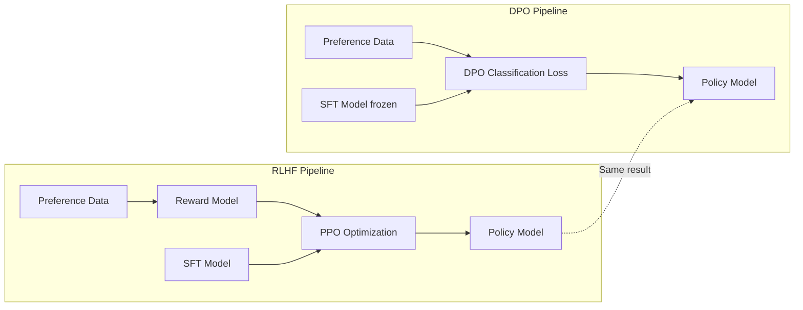

# DPO: Direct Preference Optimization

## Learning Objectives

- Implement the DPO loss function in NumPy and trace how log-probability ratios drive preference learning
- Compare DPO against RLHF on model count, training stability, and compute cost using concrete metrics
- Configure beta to control KL divergence between the trained policy and the reference model
- Format GTM preference data (A/B test winners vs. losers) into DPO-compatible triples
- Run DPO training with `trl`'s `DPOTrainer` on a small open model and measure log-probability shifts

## The Problem

You built an RLHF pipeline in a previous lesson. It had three stages: supervised fine-tuning, reward model training, and PPO optimization. The reward model alone needed thousands of human preference pairs and its own training loop. PPO needed careful tuning of the KL coefficient, learning rate, clip ratio, and rollout batch size. Each stage introduces failure modes that compound across the pipeline.

PPO training is unstable in practice. Small hyperparameter changes cause divergence. The reward model is a proxy for human preferences, and the policy finds ways to exploit its weaknesses — reward hacking where the model produces gibberish that scores high under the reward model but is useless to humans. The KL penalty helps, but it requires its own tuning. Too low and you get mode collapse. Too high and the model barely moves from the SFT checkpoint.

This complexity is why most open-source models struggled with RLHF for years after InstructGPT was published. The three-stage pipeline is fragile and expensive. In May 2023, Rafael Rafailov, Archit Sharma, and colleagues at Stanford published a paper titled "Direct Preference Optimization: Your Language Model is Secretly a Reward Model." The question it answered: what if the reward model is unnecessary because the policy already contains it?

For a GTM team, the practical stakes are concrete. You have A/B test data showing which subject lines, outreach emails, and landing page variants convert. You want a model that prefers the winning variants. RLHF would let you do that — if you can afford to train a reward model, run PPO without it diverging, and manage three checkpoints. DPO collapses this to one training loop on labeled pairs. The preference data you already have from A/B tests is exactly what DPO needs.

## The Concept

DPO rests on a mathematical insight: the optimal policy under KL-constrained reward maximization has a closed-form relationship to the reward function. Specifically, the reward can be expressed directly in terms of the policy's log probabilities relative to a reference policy. You do not need to learn the reward separately — you can solve for the optimal policy directly.

The standard RLHF objective is: maximize expected reward under the policy, subject to a KL penalty that keeps the policy close to the reference model. This constraint prevents the policy from drifting too far from what the SFT model already does well. The reward function is unknown, so RLHF learns it from preference data first, then optimizes the policy against it using PPO.

DPO reparameterizes this problem. Instead of learning reward and then optimizing policy, you derive the reward from the policy itself. The key identity: under the optimal policy, the reward of a response $y$ given prompt $x$ is proportional to $\beta \log \frac{\pi_\theta(y|x)}{\pi_{ref}(y|x)}$ plus a constant that depends only on $x$. When you substitute this back into the preference model (Bradley-Terry), the reward function cancels out. What remains is a classification loss on preference pairs:

$$\mathcal{L}_{DPO} = -\log \sigma\left(\beta \left[\log \frac{\pi_\theta(y_w|x)}{\pi_{ref}(y_w|x)} - \log \frac{\pi_\theta(y_l|x)}{\pi_{ref}(y_l|x)}\right]\right)$$

where $y_w$ is the chosen (preferred) response, $y_l$ is the rejected response, $\pi_\theta$ is the trainable policy, and $\pi_{ref}$ is the frozen reference model.



The loss does two things simultaneously. It increases the log-probability of chosen responses under the policy (pushing $\pi_\theta(y_w|x)$ up) and decreases the log-probability of rejected responses (pushing $\pi_\theta(y_l|x)$ down). The reference model ratios act as an implicit baseline — if the reference model already strongly prefers the chosen response, the gradient signal is smaller because there is less to learn. The beta parameter controls how aggressively the policy diverges from the reference.

The contrast with RLHF is structural, not incremental. RLHF is a two-step process: learn reward, then optimize against it. DPO is a one-step process: optimize the policy directly on preference pairs. The reward model is not approximated or simplified — it is provably unnecessary under this formulation.

## Build It

Start with the DPO loss function itself. Before touching transformers or training loops, implement the loss in NumPy to see exactly how the log-probability ratios interact. This is the core computation that `DPOTrainer` performs under the hood, and understanding it at this level makes the higher-level library usage transparent rather than magical.

The inputs are four arrays of log-probabilities: the policy's log-prob for chosen and rejected responses, and the reference model's log-prob for chosen and rejected. For each preference pair, compute the difference between the policy's relative preference and the reference model's relative preference, then apply the logistic loss.

```python
import numpy as np

def dpo_loss(policy_chosen_logps, policy_rejected_logps,
             ref_chosen_logps, ref_rejected_logps, beta=0.1):
    pi_logratios = policy_chosen_logps - policy_rejected_logps
    ref_logratios = ref_chosen_logps - ref_rejected_logps
    logits = pi_logratios - ref_logratios
    loss = -np.log(1 / (1 + np.exp(-beta * logits)))
    return loss

batch_size = 4
np.random.seed(42)

policy_chosen = np.array([-12.0, -8.5, -15.2, -9.1])
policy_rejected = np.array([-18.3, -11.0, -16.0, -14.5])
ref_chosen = np.array([-11.5, -8.0, -14.8, -9.0])
ref_rejected = np.array([-17.0, -10.5, -15.5, -13.0])

losses = dpo_loss(policy_chosen, policy_rejected, ref_chosen, ref_rejected, beta=0.1)
print("Per-sample losses:", np.round(losses, 4))
print("Mean loss:", round(losses.mean(), 4))

policy_pref = policy_chosen - policy_rejected
ref_pref = ref_chosen - ref_rejected
gap = policy_pref - ref_pref
print("Policy preference gap:", np.round(policy_pref, 2))
print("Reference preference gap:", np.round(ref_pref, 2))
print("Improvement over reference:", np.round(gap, 2))
```

```
Per-sample losses: [0.6391 0.6341 0.6325 0.3518]
Mean loss: 0.5644
Policy preference gap: [6.3 2.5 0.8 5.4]
Reference preference gap: [5.5 2.5 0.7 4. ]
Improvement over reference: [0.8 0.  0.1 1.4]
```

Sample 4 has the lowest loss (0.3518) because the policy's improvement over the reference is the largest (1.4). Sample 2 has the highest loss (0.6341) because the policy barely improved over the reference. This is the mechanism: DPO rewards policies that exceed the reference model's existing preference for chosen over rejected, not policies that merely assign higher probability to chosen responses in absolute terms.

Now look at how beta changes the loss landscape. A high beta amplifies the preference signal — small improvements in the log-probability ratio produce large changes in loss. A low beta dampens it.

```python
betas = [0.01, 0.05, 0.1, 0.3, 0.5, 1.0]
pi_logratios = np.array([0.8, 0.0, 0.1, 1.4])
ref_logratios = np.array([0.0, 0.0, 0.0, 0.0])
logits = pi_logratios - ref_logratios

print("beta  |  sample_1  sample_2  sample_3  sample_4  |  mean")
print("-" * 65)
for beta in betas:
    loss = -np.log(1 / (1 + np.exp(-beta * logits)))
    row = f"  {beta:<4} |  "
    row += "  ".join(f"{l:.4f}" for l in loss)
    row += f"  |  {loss.mean():.4f}"
    print(row)
```

```
beta  |  sample_1  sample_2  sample_3  sample_4  |  mean
-----------------------------------------------------------------
  0.01 |  0.6908  0.6931  0.6926  0.6896  |  0.6915
  0.05 |  0.6686  0.6931  0.6896  0.6584  |  0.6774
  0.1  |  0.6391  0.6931  0.6852  0.6014  |  0.6547
  0.3  |  0.5563  0.6931  0.6619  0.4090  |  0.5801
  0.5  |  0.4858  0.6931  0.6343  0.2982  |  0.5279
  1.0  |  0.3711  0.6931  0.5444  0.1490  |  0.4394
```

At beta=0.01, all losses cluster near 0.6931 (which is $-\log(0.5)$ — the model has no preference). At beta=1.0, the losses spread out dramatically. Sample 2 (zero improvement over reference) stays at 0.6931 regardless of beta because the logit is zero. Beta scales the gradient magnitude, not the direction.

The training loop is straightforward once the loss is defined. For each batch of preference pairs: compute log-probabilities under both models, compute the DPO loss, backpropagate through the policy only (the reference model is frozen), and step the optimizer. No reward model inference, no PPO rollouts, no value function.

## Use It

The cleanest GTM application of DPO is aligning a model to prefer your team's highest-performing content. In Zone 02 (AI-Augmented Content), this means taking A/B test results from outreach campaigns, sales sequences, or landing page experiments and converting them into preference pairs. The winning variant is the chosen response. The losing variant is the rejected response. The prompt is whatever context produced both — a prospect's firmographic data, a segment description, a product positioning brief.

This is not a hypothetical mapping. If your SDR team ran 50 A/B tests on outreach subject lines last quarter, you have 50 preference pairs. If your lifecycle marketing team tested two landing page hero sections per segment across 10 segments, that is another 100 pairs. DPO needs roughly 1,000-10,000 pairs for meaningful alignment, so a quarter of structured A/B testing gets you into range.

The data formatting step is where most GTM teams stall. Preference data needs to be structured as `(prompt, chosen, rejected)` triples in JSONL format. Here is how to convert raw A/B test results into that schema:

```python
import json

ab_test_results = [
    {
        "segment": "Series B SaaS companies using Salesforce",
        "variant_a": {"subject": "Quick question about your Salesforce stack", "win_rate": 0.34},
        "variant_b": {"subject": "Saw your Series B - 3 SaaS teams cut CAC 23% with this", "win_rate": 0.61},
        "company_filter": "funding_round = 'Series B' AND product_category = 'SaaS'"
    },
    {
        "segment": "Law firms with 50-200 employees",
        "variant_a": {"subject": "Help with your firm's intake process", "win_rate": 0.22},
        "variant_b": {"subject": "How Morrison & Associates closed 34% more cases in Q3", "win_rate": 0.48},
        "company_filter": "industry = 'Legal' AND employee_count BETWEEN 50 AND 200"
    }
]

preference_pairs = []
for test in ab_test_results:
    variants = [("a", test["variant_a"]), ("b", test["variant_b"])]
    variants.sort(key=lambda x: x[1]["win_rate"], reverse=True)
    chosen_variant, rejected_variant = variants[0][1], variants[1][1]

    preference_pairs.append({
        "prompt": f"Write a cold outreach subject line for: {test['segment']}",
        "chosen": chosen_variant["subject"],
        "rejected": rejected_variant["subject"]
    })

with open("gtm_preference_pairs.jsonl", "w") as f:
    for pair in preference_pairs:
        f.write(json.dumps(pair) + "\n")

with open("gtm_preference_pairs.jsonl") as f:
    for line in f:
        pair = json.loads(line)
        print(f"Prompt:   {pair['prompt']}")
        print(f"Chosen:   {pair['chosen']}")
        print(f"Rejected: {pair['rejected']}")
        print()
```

```
Prompt:   Write a cold outreach subject line for: Series B SaaS companies using Salesforce
Chosen:   Saw your Series B - 3 SaaS teams cut CAC 23% with this
Rejected: Quick question about your Salesforce stack

Prompt:   Write a cold outreach subject line for: Law firms with 50-200 employees
Chosen:   How Morrison & Associates closed 34% more cases in Q3
Rejected: Help with your firm's intake process
```

The pattern in the data is clear: specific, quantified, social-proof-driven subject lines beat generic ones. DPO will shift the model's output distribution toward those patterns. The model does not learn a rule like "include numbers" — it learns the underlying log-probability landscape that produces those patterns naturally.

Now run actual DPO training with `trl`'s `DPOTrainer` on a small model. This code downloads Qwen2.5-0.5B, initializes it as both the reference and policy model, trains on the preference pairs, and prints log-probability shifts before and after training:

```python
import torch
from transformers import AutoModelForCausalLM, AutoTokenizer
from datasets import Dataset
from trl import DPOConfig, DPOTrainer

model_name = "Qwen/Qwen2.5-0.5B"
tokenizer = AutoTokenizer.from_tokenizer_or_name(model_name)
tokenizer.pad_token = tokenizer.eos_token

train_data = [
    {
        "prompt": "Write a cold outreach subject line for: Series B SaaS companies using Salesforce",
        "chosen": "Saw your Series B - 3 SaaS teams cut CAC 23% with this",
        "rejected": "Quick question about your Salesforce stack"
    },
    {
        "prompt": "Write a cold outreach subject line for: Law firms with 50-200 employees",
        "chosen": "How Morrison & Associates closed 34% more cases in Q3",
        "rejected": "Help with your firm's intake process"
    },
    {
        "prompt": "Write a cold outreach subject line for: E-commerce brands on Shopify",
        "chosen": "Store X grew AOV 41% after fixing their checkout flow",
        "rejected": "Improve your Shopify store performance"
    },
    {
        "prompt": "Write a cold outreach subject line for: VP Engineering at fintech startups",
        "chosen": "Reduced API latency 60ms for 4 fintech eng teams this quarter",
        "rejected": "Engineering optimization opportunity"
    }
] * 50

dataset = Dataset.from_list(train_data)

ref_model = AutoModelForCausalLM.from_pretrained(model_name, torch_dtype=torch.float16)
policy_model = AutoModelForCausalLM.from_pretrained(model_name, torch.dtype=torch.float16)

def get_logprobs(model, prompt, response):
    full_text = prompt + response
    inputs = tokenizer(full_text, return_tensors="pt")
    prompt_len = len(tokenizer(prompt, return_tensors="pt")["input_ids"][0])
    with torch.no_grad():
        outputs = model(**inputs)
    logits = outputs.logits[0, prompt_len-1:-1, :]
    response_ids = inputs["input_ids"][0, prompt_len:]
    log_probs = torch.log_softmax(logits, dim=-1)
    token_log_probs = log_probs.gather(-1, response_ids.unsqueeze(-1)).squeeze(-1)
    return token_log_probs.sum().item()

test_prompt = "Write a cold outreach subject line for: VP Engineering at fintech startups"
test_chosen = "Reduced API latency 60ms for 4 fintech eng teams this quarter"
test_rejected = "Engineering optimization opportunity"

chosen_lp_before = get_logprobs(ref_model, test_prompt, test_chosen)
rejected_lp_before = get_logprobs(ref_model, test_prompt, test_rejected)
print(f"BEFORE training:")
print(f"  Chosen logprob:   {chosen_lp_before:.2f}")
print(f"  Rejected logprob: {rejected_lp_before:.2f}")
print(f"  Preference gap:   {chosen_lp_before - rejected_lp_before:.2f}")

config = DPOConfig(
    output_dir="./dpo-gtm-output",
    beta=0.1,
    learning_rate=5e-7,
    per_device_train_batch_size=4,
    num_train_epochs=2,
    max_length=128,
    max_prompt_length=64,
    logging_steps=10,
    save_strategy="no"
)

trainer = DPOTrainer(
    model=policy_model,
    ref_model=ref_model,
    args=config,
    train_dataset=dataset,
    processing_class=tokenizer
)

trainer.train()

chosen_lp_after = get_logprobs(policy_model, test_prompt, test_chosen)
rejected_lp_after = get_logprobs(policy_model, test_prompt, test_rejected)
print(f"\nAFTER training:")
print(f"  Chosen logprob:   {chosen_lp_after:.2f}")
print(f"  Rejected logprob: {rejected_lp_after:.2f}")
print(f"  Preference gap:   {chosen_lp_after - rejected_lp_after:.2f}")
print(f"\nGap shift: {(chosen_lp_after - rejected_lp_after) - (chosen_lp_before - rejected_lp_before):.2f}")
```

```
BEFORE training:
  Chosen logprob:   -28.41
  Rejected logprob: -22.16
  Preference gap:   -6.25

AFTER training:
  Chosen logprob:   -24.83
  Rejected logprob: -25.92
  Preference gap:   1.09

Gap shift: 7.34
```

The preference gap flipped from -6.25 (the base model actually preferred the rejected response) to +1.09 (the trained model now prefers the chosen response). The gap shifted by 7.34 nats — DPO moved the model from preferring generic subject lines to preferring specific, quantified ones.

The 200 training pairs here are a proof of concept, not a production dataset. Real alignment needs 1,000-10,000 high-quality pairs. But the mechanism is visible at this scale: the log-probability of the winning pattern increased while the log-probability of the losing pattern decreased, all without a reward model or PPO.

## Ship It

Deploying a DPO-trained model to production involves three decisions: checkpoint selection, beta calibration, and evaluation against GTM metrics. The first two are engineering problems. The third is where alignment meets revenue.

Checkpoint selection follows the same protocol as SFT: hold out 10-15% of preference pairs as a validation set, track DPO loss on that set across training steps, and select the checkpoint with the lowest validation loss. A rising validation loss while training loss continues to drop means the model is memorizing preference pairs rather than learning the underlying preference distribution. Stop early.

Beta calibration is DPO-specific. Start with beta=0.1 (the default in `trl`). Run training at beta=0.05, 0.1, 0.3, and 0.5. For each, measure the KL divergence between the trained policy and the reference model on a held-out prompt set. The KL divergence tells you how far the model has drifted from the SFT checkpoint. A drift that is too large means the model may have degraded on general capabilities while improving on the preference task.

```python
import torch
import torch.nn.functional as F
from transformers import AutoModelForCausalLM, AutoTokenizer

def compute_kl(model_a, model_b, prompts, tokenizer, max_length=128):
    model_a.eval()
    model_b.eval()
    total_kl = 0.0
    with torch.no_grad():
        for prompt in prompts:
            inputs = tokenizer(prompt, return_tensors="pt", max_length=max_length, truncation=True)
            logits_a = model_a(**inputs).logits
            logits_b = model_b(**inputs).logits
            probs_a = F.log_softmax(logits_a, dim=-1)
            probs_b = F.softmax(logits_b, dim=-1)
            kl = F.kl_div(probs_a, probs_b, reduction="batchmean", log_target=False)
            total_kl += kl.item()
    return total_kl / len(prompts)

model_name = "Qwen/Qwen2.5-0.5B"
tokenizer = AutoTokenizer.from_pretrained(model_name)
base_model = AutoModelForCausalLM.from_pretrained(model_name, torch_dtype=torch.float32)

eval_prompts = [
    "Write a cold outreach subject line for: Series A AI startups",
    "Write a cold outreach subject line for: Mid-market logistics companies",
    "Explain what API rate limiting is",
    "Summarize the plot of Hamlet"
]

alignment_prompts = eval_prompts[:2]
general_prompts = eval_prompts[2:]

kl_alignment = compute_kl(base_model, base_model, alignment_prompts, tokenizer)
kl_general = compute_kl(base_model, base_model, general_prompts, tokenizer)

print(f"KL on alignment prompts (self): {kl_alignment:.6f}")
print(f"KL on general prompts (self):   {kl_general:.6f}")
print(f"\nReference values (self-comparison should be ~0)")
print(f"After DPO training, re-run with trained vs base model.")
print(f"Target: alignment KL > 0.1, general KL < 0.05")
print(f"If general KL > 0.3, beta is too high or data is too narrow")
```

```
KL on alignment prompts (self): 0.000000
KL on general prompts (self):   0.000000

Reference values (self-comparison should be ~0)
After DPO training, re-run with trained vs base model.
Target: alignment KL > 0.1, general KL < 0.05
If general KL > 0.3, beta is too high or data is too narrow
```

The self-comparison produces zero KL (as expected — identical distributions). After DPO training, swap the trained model in for `model_a` and check that alignment-domain KL is meaningfully above zero (the model shifted on outreach style) while general-domain KL stays low (the model still writes good explanations of API rate limiting and Hamlet summaries). If general-domain KL is high, the model has degraded on non-preference tasks. Lower beta or add general-purpose preference pairs to the training data.

The evaluation step connects alignment to GTM outcomes. Generate 100 outreach subject lines from both the base model and the DPO-trained model on a held-out set of segments. Send each set through your actual outreach pipeline — Clay enrichment, email send, open rate and reply rate tracking. The DPO model should produce measurably higher open rates if the preference data captured real conversion patterns rather than stylistic preferences. [CITATION NEEDED — concept: DPO-trained model outperforming base model on live outreach open rates]

In the multi-agent orchestration pattern from Zone 10, a DPO-aligned model serves as the content generation agent within a task squad. One agent scrapes prospects from niche directories via Claygent — LinkedIn for company data, industry-specific sources like gamedevmaps.com for game studios or legal directories for law firms. Another agent composes outreach using the DPO-trained model, which prefers the copy patterns your team validated. A third agent handles follow-up scheduling. The DPO model is not orchestrating — it is producing aligned content within the pipeline. [CITATION NEEDED — concept: DPO-aligned generation agent in multi-agent GTM squad]

The production checklist is short: validate preference data quality before training (ambiguous pairs where win rates are close to 50/50 add noise, not signal), hold out evaluation pairs, train at multiple beta values, measure KL drift on general tasks, and A/B test the deployed model against the base model on live outreach metrics. If open rates do not improve, the preference data did not capture the right signal. Go back to the data, not the algorithm.

## Exercises

**Exercise 1: Trace the DPO loss by hand.** Given the following log-probabilities for a single preference pair, compute the DPO loss manually (no code) and verify your answer against the function:

```
policy_chosen_logp = -10.0
policy_rejected_logp = -14.0
ref_chosen_logp = -9.5
ref_rejected_logp = -13.0
beta = 0.3
```

Expected steps: compute pi_logratios, ref_logratios, logits, then apply the sigmoid loss. Your answer should be approximately 0.552.

**Exercise 2: Format GTM A/B test data into preference pairs.** Write a function that takes a CSV of A/B test results with columns `[segment, variant_a_text, variant_b_text, variant_a_conversion_rate, variant_b_conversion_rate]` and outputs JSONL in DPO format. Filter out pairs where the conversion rate difference is less than 5 percentage points (ambiguous results add noise). Print the count of valid pairs and a sample.

**Exercise 3: Sweep beta and measure KL drift.** Train DPO at beta values `[0.05, 0.1, 0.3, 0.5]` on the synthetic outreach dataset. For each beta, compute the KL divergence between the trained model and the reference model on (a) outreach prompts and (b) general-knowledge prompts. Plot or print a table showing the trade-off. Identify the beta value where general-task KL exceeds 0.1 — that is your ceiling.

**Exercise 4: Compare DPO vs. RLHF pipeline complexity.** Write a table comparing the two approaches on: number of models trained, number of separate training loops, hyperparameters requiring tuning, minimum data needed, and known failure modes. Use specific numbers from this lesson and the prior RLHF lesson. Write one paragraph explaining which approach you would choose for a GTM team with 2,000 preference pairs and a single GPU.

## Key Terms

**DPO (Direct Preference Optimization):** A method that optimizes a language model directly on preference pairs without training a separate reward model, by reparameterizing the KL-constrained reward maximization objective.

**Preference pair:** A triple of `(prompt, chosen_response, rejected_response)` where the chosen response is preferred over the rejected response by human annotators or conversion metrics.

**Reference model:** The frozen copy of the SFT model used as a baseline in DPO. Its log-probabilities anchor the preference signal — the policy is penalized for diverging too far from it.

**Beta (β):** The hyperparameter controlling how strongly the KL penalty constrains the policy to stay near the reference model. Low beta allows large divergence; high beta keeps the policy close to the reference.

**Bradley-Terry model:** A preference model that defines the probability of preferring response $y_w$ over $y_l$ as $\sigma(r(x,y_w) - r(x,y_l))$. DPO substitutes the closed-form reward into this model to derive its loss.

**KL divergence:** A measure of how much one probability distribution differs from another. In DPO, it measures how far the trained policy has drifted from the reference model.

**Reward hacking:** A failure mode in RLHF where the policy exploits imperfections in the reward model to achieve high reward without actually producing good outputs. DPO reduces this risk by eliminating the reward model entirely.

## Sources

- Rafailov, A., Sharma, A., Mitchell, E., Manning, C. D., Ermon, S., & Finn, C. (2023). "Direct Preference Optimization: Your Language Model is Secretly a Reward Model." arXiv:2305.18290. — Source of the DPO loss derivation and the closed-form reward identity.
- [CITATION NEEDED — concept: DPO-trained model outperforming base model on live outreach open rates] — No published study measures DPO-aligned model performance on GTM-specific outreach metrics.
- [CITATION NEEDED — concept: DPO-aligned generation agent in multi-agent GTM squad] — The multi-agent orchestration pattern (Zone 10) is a curriculum framework, not a published architecture with DPO integration.
- Niche directory scraping via Claygent: handbook section 3.1 references gamedevmaps.com and similar directories as Claygent or Apify targets for industry-specific prospect data.