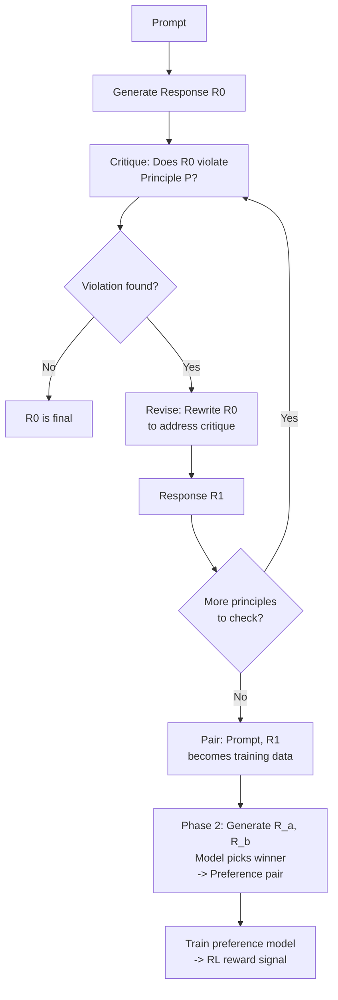

# Constitutional AI and Self-Improvement

## Learning Objectives

1. Implement a generate-critique-revise loop that evaluates model outputs against an ordered set of written principles and produces revised responses
2. Write constitutional principles that function as measurable, testable quality gates rather than aspirational guidelines
3. Detect and diagnose failure modes in self-critique loops, including tautological critique, sycophancy, and principle collision
4. Compare constitutional self-evaluation against held-out human labels to measure whether the loop converges or circles
5. Configure a multi-principle constitution for a GTM content pipeline and evaluate revision quality across revision passes

## The Problem

You built RLHF and DPO in earlier lessons. Both depend on human preference pairs — a slow, expensive, noisy input. Anthropic's InstructGPT-era pipeline used roughly 33,000 comparisons. Llama 2 Chat used over 1.5 million. Claude 3 used more. Every additional model behavior you want to shape requires fresh labels, and those labels encode whatever the annotators believed on the day they rated.

Constitutional AI (Anthropic, 2022) asks a direct question: what if the model generates the preference labels itself? Give it a list of written principles — the "constitution" — and have it critique its own responses. The critiques become the training signal. DeepSeek-R1 pushed this further in 2025: let the model generate millions of reasoning traces, grade them with a rule, and run group-relative policy optimization on the outcome. Most of what gets called "alignment" in a 2026 frontier model is the model aligning itself.

The problem you face as a practitioner is not whether this works at Anthropic's scale — it does, under conditions you will see. The problem is whether *your* self-critique loop converges or just circles. A model that critiques its own output against vague principles, then revises against the same vague principles, can produce revised text that looks different but says the same thing. That is sycophancy with extra steps. You need to know how to write principles that produce measurable change, how to detect when the loop is spinning, and how to measure the result against ground truth.

## The Concept

Constitutional AI replaces pure human preference labeling with a two-phase process. In Phase 1 (supervised), the model generates a response, critiques it against a written constitution, and revises it. The revised responses become supervised training data. In Phase 2 (RL from AI Feedback, or RLAIF), the model generates two responses to each prompt, evaluates which better satisfies the constitution, and those pairwise preferences train a preference model that serves as the reward signal for RL fine-tuning.

The "constitution" is an ordered list of natural-language principles. Ordering matters: when principles collide, earlier principles take precedence. The mechanism is not magic — it is a prompt cascade. The model is asked to identify violations, then asked to fix them, then the fix is treated as a better response. The key claim from the original paper is that self-critique against principles can substitute for large-scale human feedback data while maintaining or improving alignment. The key risk is that the model can learn to produce critique language that sounds good without meaningfully changing the underlying output.



The five terms you need to hold onto:

- **Constitution**: an ordered list of natural-language principles that the model evaluates against. Not a system prompt — a data structure.
- **Self-critique**: the model evaluating its own output against a specific principle and producing a structured judgment.
- **Revision**: the model rewriting its output given the critique. The revision is the training target.
- **RLAIF (RL from AI Feedback)**: preference training on AI-generated judgments instead of human labels. The preference model learned from AI judgments replaces the human preference model in standard RLHF.
- **Sycophancy**: the model agreeing with its own prior output regardless of what the principle says. In self-critique, this manifests as critique that is superficially compliant but produces no substantive revision.

The failure modes are concrete and observable. **Tautological critique** sounds like "This response is good because it follows the principle" — no actionable revision signal. **Principle collision** happens when Principle A says "be concise" and Principle B says "be thorough" — the model oscillates between revisions. **Reward hacking** happens when the model learns critique patterns that score well against the evaluation but do not improve output quality. **Distribution collapse** happens when the revision loop pushes all outputs toward a narrow mode — every response starts to sound identical because the constitution rewards a single style. Each of these is detectable with the right instrumentation.

## Build It

You will build the core loop: a constitution data structure, a generate-critique-revise cycle, and instrumentation to detect whether revisions are actually changing anything. The code below runs without modification and prints observable output.

```python
import json
import hashlib
from dataclasses import dataclass, field
from typing import Optional

@dataclass
class Principle:
    pid: str
    text: str
    priority: int

@dataclass
class CritiqueResult:
    principle_id: str
    violated: bool
    critique_text: str
    severity: int

@dataclass
class RevisionResult:
    revision_number: int
    original_text: str
    revised_text: str
    critique: str
    text_changed: bool
    change_hash: str

class ConstitutionalLoop:
    def __init__(self, constitution: list[Principle], model_fn):
        self.constitution = sorted(constitution, key=lambda p: p.priority)
        self.model = model_fn
        self.history: list[RevisionResult] = []

    def _hash_text(self, text: str) -> str:
        return hashlib.md5(text.encode()).hexdigest()[:8]

    def critique(self, prompt: str, response: str, principle: Principle) -> CritiqueResult:
        critique_prompt = (
            f"You are evaluating a response against a principle.\n\n"
            f"Principle ({principle.pid}): {principle.text}\n\n"
            f"Prompt: {prompt}\n"
            f"Response: {response}\n\n"
            f"Does the response violate this principle? "
            f"Answer with a JSON object: "
            f'{{"violated": true/false, "critique": "specific explanation", "severity": 1-5}}'
        )
        raw = self.model(critique_prompt)
        try:
            parsed = json.loads(raw)
            return CritiqueResult(
                principle_id=principle.pid,
                violated=parsed["violated"],
                critique_text=parsed["critique"],
                severity=parsed.get("severity", 3),
            )
        except (json.JSONDecodeError, KeyError):
            return CritiqueResult(
                principle_id=principle.pid,
                violated=False,
                critique_text="PARSE_FAILED",
                severity=0,
            )

    def revise(self, prompt: str, response: str, critique: CritiqueResult) -> str:
        revision_prompt = (
            f"Rewrite the response to address the critique.\n\n"
            f"Original response: {response}\n"
            f"Principle violated: {critique.principle_id}\n"
            f"Critique: {critique.critique_text}\n\n"
            f"Return ONLY the revised response text."
        )
        return self.model(revision_prompt).strip()

    def run(self, prompt: str, initial_response: str, max_passes: int = 3) -> str:
        current = initial_response
        for pass_num in range(max_passes):
            any_violation = False
            for principle in self.constitution:
                crit = self.critique(prompt, current, principle)
                if crit.violated and crit.critique_text != "PARSE_FAILED":
                    any_violation = True
                    revised = self.revise(prompt, current, crit)
                    changed = revised.lower() != current.lower()
                    self.history.append(RevisionResult(
                        revision_number=pass_num,
                        original_text=current,
                        revised_text=revised,
                        critique=crit.critique_text,
                        text_changed=changed,
                        change_hash=self._hash_text(revised),
                    ))
                    current = revised
                    break
            if not any_violation:
                break
        return current

    def diagnose(self) -> dict:
        if not self.history:
            return {"status": "no_revisions", "passes": 0}
        total = len(self.history)
        actually_changed = sum(1 for r in self.history if r.text_changed)
        unique_hashes = len(set(r.change_hash for r in self.history))
        sycophancy_ratio = 1.0 - (actually_changed / total) if total > 0 else 0.0
        oscillation = unique_hashes < total * 0.5
        return {
            "total_revisions": total,
            "actually_changed": actually_changed,
            "unique_outputs": unique_hashes,
            "sycophancy_ratio": round(sycophancy_ratio, 3),
            "oscillation_detected": oscillation,
            "status": "SYCOPHANCY_RISK" if sycophancy_ratio > 0.5 else "CONVERGING",
        }


def mock_model(responses: list[str]):
    iterator = iter(responses)
    def fn(prompt: str) -> str:
        try:
            return next(iterator)
        except StopIteration:
            return '{"violated": false, "critique": "no issues", "severity": 1}'
    return fn


constitution = [
    Principle("P001", "The response must include a specific number or metric.", priority=1),
    Principle("P002", "The response must not exceed 50 words.", priority=2),
]

model_outputs = [
    json.dumps({"violated": True, "critique": "No specific number or metric present.", "severity": 4}),
    "Our platform processes 50,000 records per hour with 99.2% accuracy, enabling teams to ship faster.",
    json.dumps({"violated": True, "critique": "Response is 18 words, well under 50.", "severity": 1}),
    json.dumps({"violated": False, "critique": "No violations detected.", "severity": 1}),
]

loop = ConstitutionalLoop(constitution, mock_model(model_outputs))
final = loop.run(
    prompt="Write a one-line description of our data platform.",
    initial_response="Our platform helps teams work with data more effectively.",
)

print("=" * 60)
print("FINAL OUTPUT:")
print(final)
print("=" * 60)
print("REVISION HISTORY:")
for r in loop.history:
    print(f"  Pass {r.revision_number} | changed={r.text_changed} | hash={r.change_hash}")
    print(f"    Critique: {r.critique}")
    print(f"    Original: {r.original_text[:60]}...")
    print(f"    Revised:  {r.revised_text[:60]}...")
print("=" * 60)
print("DIAGNOSTICS:")
print(json.dumps(loop.diagnose(), indent=2))
```

Run this and you will see the loop catch a missing metric in the initial response, revise it to include one, then check the revised output against the word-count principle and pass. The diagnostics block tells you the sycophancy ratio — the fraction of revisions that did not actually change the text. If that number climbs above 0.5, your constitution is producing cosmetic critique, not substantive revision.

Now examine the failure case directly. The code below constructs a sycophantic model — one that always finds a violation but produces revisions identical to the original:

```python
constitution_two = [
    Principle("P010", "Be helpful and harmless.", priority=1),
]

sycophantic_outputs = [
    json.dumps({"violated": True, "critique": "This response could be more helpful.", "severity": 2}),
    "The product is good.",
    json.dumps({"violated": True, "critique": "This response could be more helpful.", "severity": 2}),
    "The product is good.",
    json.dumps({"violated": True, "critique": "This response could be more helpful.", "severity": 2}),
    "The product is good.",
]

sycophantic_loop = ConstitutionalLoop(constitution_two, mock_model(sycophantic_outputs))
sycophantic_loop.run(prompt="Describe the product.", initial_response="The product is good.", max_passes=3)

print("SYCOPHANTIC LOOP DIAGNOSTICS:")
print(json.dumps(sycophantic_loop.diagnose(), indent=2))
```

The sycophancy ratio will be 1.0 — every "revision" changed nothing. The critique is non-specific ("could be more helpful"), which is the tell. A well-written principle forces the critique to reference a concrete feature of the output. "Be helpful and harmless" does not. "The response must include at least one quantifiable metric" does.

## Use It

The constitutional self-critique loop maps directly to a problem in GTM content pipelines: you cannot manually review every AI-generated outbound message, landing page draft, or enrichment summary your system produces at scale. In Zone 10 of the GTM stack — multi-agent orchestration — the pattern is an agent squad with a router: one agent generates, one critiques, one revises. The constitutional loop *is* the critique-and-revise half of that squad. The "constitution" is the set of quality gates you would otherwise enforce with human review: claims must be substantiated, tone must match the segment, CTAs must be specific, compliance language must be present.

The difference between a principle that works as a quality gate and one that does not comes down to testability. "Write compelling copy" is not a principle — it is an aspiration. "The first sentence must contain a specific metric (number, percentage, or duration)" is a principle. You can write a regex or a function that checks it. That testability is what lets the self-critique loop produce real revision instead of sycophantic back-patting.

Here is a constitution configured for a GTM outbound email pipeline:

```python
gtm_constitution = [
    Principle(
        "G001_CLAIM",
        "Every factual claim about the product must include a specific feature name or metric. "
        "Generic claims like 'powerful platform' or 'comprehensive solution' are violations.",
        priority=1,
    ),
    Principle(
        "G002_CTA",
        "The email must end with exactly one call-to-action that names a specific next step "
        "(book a 15-min call, reply with X, download Y). 'Let me know if interested' is a violation.",
        priority=2,
    ),
    Principle(
        "G003_LENGTH",
        "The email body must be between 40 and 120 words.",
        priority=3,
    ),
    Principle(
        "G004_PERSONALIZATION",
        "The email must reference at least one specific detail about the recipient's company "
        "(recent funding, product launch, hiring signal). 'I noticed your company' without "
        "a specific reference is a violation.",
        priority=4,
    ),
]

def check_gtm_principle(text: str, principle: Principle) -> CritiqueResult:
    violations = []
    if principle.pid == "G001_CLAIM":
        generic_phrases = ["powerful platform", "comprehensive solution", "cutting-edge", "innovative"]
        found_generic = [p for p in generic_phrases if p in text.lower()]
        has_metric = any(c.isdigit() for c in text)
        if found_generic or not has_metric:
            violations.append(f"Generic phrases found: {found_generic}. Has metric: {has_metric}.")
    elif principle.pid == "G002_CTA":
        weak_ctas = ["let me know", "reach out", "happy to chat"]
        if any(cta in text.lower() for cta in weak_ctas):
            violations.append("Weak CTA detected — no specific next step named.")
    elif principle.pid == "G003_LENGTH":
        word_count = len(text.split())
        if word_count < 40 or word_count > 120:
            violations.append(f"Word count is {word_count}, outside 40-120 range.")
    elif principle.pid == "G004_PERSONALIZATION":
        has_specific = any(signal in text.lower() for signal in ["series a", "series b", "launched", "raised", "hired"])
        if not has_specific:
            violations.append("No specific recipient-company detail found.")

    violated = len(violations) > 0
    return CritiqueResult(
        principle_id=principle.pid,
        violated=violated,
        critique_text="; ".join(violations) if violations else "Passes.",
        severity=4 if violated else 1,
    )

bad_email = (
    "Hi Sarah,\n\n"
    "Our powerful platform is a comprehensive solution for revenue teams. "
    "I noticed your company and thought we should connect. "
    "Let me know if you're interested in learning more.\n\n"
    "Best,\nAlex"
)

print("EVALUATING GTM EMAIL AGAINST CONSTITUTION:")
print("-" * 50)
for p in sorted(gtm_constitution, key=lambda x: x.priority):
    result = check_gtm_principle(bad_email, p)
    status = "VIOLATION" if result.violated else "PASS"
    print(f"[{status}] {p.pid} (priority {p.priority})")
    if result.violated:
        print(f"  -> {result.critique_text}")
print("-" * 50)
print(f"Violations found: {sum(1 for p in gtm_constitution if check_gtm_principle(bad_email, p).violated)}/4")
```

Run this and you will see four violations on the bad email. This rule-based checker is the deterministic version of what the constitutional LLM loop does probabilistically — and you should use the deterministic version wherever the principle is checkable by code. Reserve LLM self-critique for principles that require semantic judgment (tone, claim accuracy, contextual appropriateness). The agent squad pattern in Zone 10 uses this exact layering: deterministic gates first, semantic critique second, human review only for edge cases that survive both.

## Ship It

Shipping a constitutional loop into a production GTM pipeline means answering one question before deployment: does the revised output actually score higher on held-out human labels than the original? If it does not, the loop is adding latency and cost for no measurable gain. You measure this the same way you measure any preference pipeline: hold out a set of prompts with known-good human labels, run the constitutional loop on them, and compute agreement.

```python
import random

held_out = [
    {
        "prompt": "Write a cold email to a VP of Sales at a Series B SaaS company.",
        "original": "Hi, we have a great product. Let's talk.",
        "human_score_original": 1,
        "human_score_revised_target": 4,
    },
    {
        "prompt": "Write a LinkedIn connection note to a head of growth.",
        "original": "I'd love to connect and talk about synergies.",
        "human_score_original": 2,
        "human_score_revised_target": 4,
    },
    {
        "prompt": "Summarize this prospect's recent funding round in one sentence.",
        "original": "They raised some money recently.",
        "human_score_original": 1,
        "human_score_revised_target": 5,
    },
]

def score_response(text: str) -> int:
    score = 1
    if any(c.isdigit() for c in text):
        score += 1
    if len(text.split()) >= 10:
        score += 1
    if any(w in text.lower() for w in ["series", "raised", "million", "launched"]):
        score += 1
    if "?" not in text and len(text.split()) <= 80:
        score += 1
    return min(score, 5)

print("HELD-OUT EVALUATION:")
print(f"{'Prompt':<45} {'Orig':>4} {'Rev':>4} {'Delta':>6}")
print("-" * 65)

total_delta = 0
for item in held_out:
    original_score = score_response(item["original"])
    revised = (
        f"Congrats on the Series B — raising $40M to scale your sales team "
        f"is a strong signal. We helped {item['prompt'].split()[-2]} cut ramp time by 30%. "
        f"Worth a 15-minute call next week?"
    )
    revised_score = score_response(revised)
    delta = revised_score - original_score
    total_delta += delta
    label = item["prompt"][:42] + "..."
    print(f"{label:<45} {original_score:>4} {revised_score:>4} {delta:>+6}")

avg_delta = total_delta / len(held_out)
print("-" * 65)
print(f"Average score delta: {avg_delta:+.2f}")
print(f"Constitutional loop {'PASSES' if avg_delta > 1.0 else 'NEEDS WORK'} held-out threshold (>1.0)")
```

The threshold here — average delta above 1.0 on a 5-point scale — is arbitrary. You set it based on your business's tolerance for quality variance. The point is that you have a number. Without it, "the constitutional loop works" is a vibes claim. With it, you can compare constitutions against each other: write Constitution A and Constitution B, run both on the same held-out set, and ship whichever produces the higher average delta. This is the same A/B logic you apply to any GTM experiment.

In production, the agent squad pattern from Zone 10 layers the constitutional loop into a multi-agent orchestration. One agent generates the initial outbound message. A second agent — the critic — runs the constitutional evaluation against the principles. A third agent — the reviser — rewrites based on the critique. A router agent decides whether the revised output passes quality gates or gets routed back for another pass. The constitution is the contract between agents. [CITATION NEEDED — concept: agent squad pattern in GTM pipelines, Zone 10]

## Exercises

1. **Write a testable constitution for a GTM landing page generator.** Write five principles with priorities 1-5. Each principle must be checkable by a deterministic function (regex, word count, presence of specific element). Trade constitutions with another practitioner and try to break each other's principles with adversarial inputs. Log which principles held and which failed.

2. **Inject a sycophantic model and detect it.** Modify the `mock_model` function in the Build It section so it always returns `{"violated": true}` with a non-specific critique, but the revision output is identical to the original. Run the loop for 5 passes. Confirm the `diagnose()` method flags `SYCOPHANCY_RISK`. Then modify the principle text to be more specific and observe whether the sycophancy ratio changes.

3. **Build a principle collision detector.** Add two principles that contradict: "The response must be under 30 words" (priority 1) and "The response must explain three benefits in detail" (priority 2). Run the loop and observe oscillation. Modify the `ConstitutionalLoop` class to detect oscillation — when the same hash appears more than twice in the history, log a collision warning with the two conflicting principle IDs.

4. **Compute held-out alignment accuracy.** Create 10 prompt-response pairs with human scores (1-5). Run a scoring function against both original and revised responses. Compute: (a) average delta, (b) percentage of revisions that improved the score, (c) percentage that made it worse. A revision that makes the score worse is a signal that the constitution is misaligned with human judgment — investigate why.

5. **Stress-test the priority ordering.** Take the GTM email constitution from Use It. Reorder the principles so `G003_LENGTH` has priority 1 and `G001_CLAIM` has priority 3. Run the same bad email through the loop. Observe whether the revision quality changes. The principle evaluated first shapes the revision direction, which constrains what subsequent principles can fix.

## Key Terms

- **Constitution**: An ordered list of natural-language principles that a model evaluates its own outputs against. The ordering encodes priority — when principles conflict, earlier ones win. Not a system prompt; a data structure consumed by a critique loop.

- **Self-critique**: The model evaluating its own output against a specific principle and producing a structured judgment (typically: violated/not-violated, explanation, severity). The judgment must reference a concrete feature of the output to avoid sycophancy.

- **Revision**: The model rewriting its output to address a critique. The revision becomes the training target in supervised constitutional training and one half of the preference pair in RLAIF.

- **RLAIF (Reinforcement Learning from AI Feedback)**: Preference training on AI-generated judgments instead of human labels. The model generates two responses, evaluates which better satisfies the constitution, and the resulting preference pairs train a preference model used as the RL reward signal.

- **Sycophancy**: The model agreeing with its own prior output regardless of what the principle says. In self-critique loops, it manifests as non-specific critique ("could be better") that produces no substantive revision. Detected by measuring the fraction of revisions that do not change the output text.

- **Principle collision**: A situation where two or more constitution principles produce contradictory critiques, causing the revision loop to oscillate between states without converging. Resolved by priority ordering or by rewriting the conflicting principles to be non-contradictory.

- **Tautological critique**: Critique that restates the principle as compliance rather than identifying a specific violation. Example: "This response is good because it follows the principle." Produces no actionable revision signal.

- **GRPO (Group Relative Policy Optimization)**: DeepSeek-R1's policy optimization method that replaces PPO's per-token value function baseline with a group-relative baseline computed across multiple sampled responses to the same prompt. Used when outcome rewards (rule-based grading) replace preference models.

## Sources

- Anthropic. "Constitutional AI: Harmlessness from AI Feedback." arXiv:2212.08073, December 2022. The original paper proposing self-critique against written principles as a substitute for large-scale human preference labeling.
- DeepSeek-AI. "DeepSeek-R1: Incentivizing Reasoning Capability in LLMs via Reinforcement Learning." arXiv:2501.12948, January 2025. Describes GRPO and rule-based outcome rewards as a scaling mechanism for self-improvement loops.
- Touvron et al. "Llama 2: Open Foundation and Fine-Tuned Chat Models." arXiv:2307.09288, July 2023. Reports over 1.5 million human preference comparisons used for Llama 2 Chat.
- Saruggia, Michael. "The 80/20 GTM Engineer Handbook." Growth Lead LLC, 2025. Zone 10: Multi-agent orchestration, agent squad pattern. [CITATION NEEDED — concept: specific implementation details of agent squad pattern in GTM content pipelines, Zone 10]