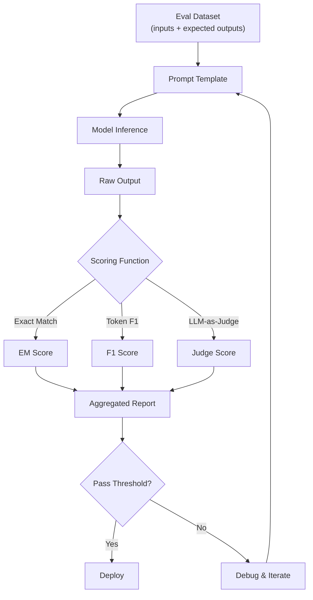

# Evaluation: Benchmarks, Evals, LM Harness

## Learning Objectives

- Build a custom evaluation harness that scores model outputs using exact match, token F1, and BLEU metrics
- Compare benchmark performance against task-specific evaluation results to identify where general capability and domain-specific reliability diverge
- Implement per-class F1 scoring for multi-label classification tasks common in GTM workflows
- Configure a regression testing pipeline that compares model versions across evaluation datasets
- Trace evaluation failures to specific prompt or model weaknesses using per-example scoring breakdowns

## The Problem

You built the pipeline. It runs. But when you prompt it with "classify this lead: hot or not" and it returns a 500-word essay about lead scoring philosophy, you realize: deployment without evaluation is just hopeful debugging in production. The model worked on the three examples you tested manually. It fails on the fourth. You do not know about the fourth because you have no harness running evals against your actual data distribution.

This problem is not theoretical. MMLU was published in 2020 with 15,908 questions across 57 subjects. Within three years, frontier models saturated it. GPT-4 scored 86.4%. Claude 3 Opus scored 86.8%. Llama 3 405B scored 88.6%. The leaderboard compressed into a 3-point range where differences are statistical noise. Meanwhile, Claude 3.5 Sonnet—scoring 88.7% on MMLU—initially could not count the number of R's in "strawberry." A task that requires zero world knowledge and zero reasoning, just character-level iteration. HumanEval tells a similar story: models score 90%+ on 164 Python programming problems while still producing code that crashes on edge cases any junior developer would catch.

The gap between benchmark performance and real-world reliability is the central problem of LLM evaluation. Benchmarks tell you how a model performs on the benchmark. They tell you almost nothing about how that model will perform on your specific task, with your specific data, under your specific failure modes. Goodhart's Law applies in full force: when a measure becomes a target, it ceases to be a good measure. Every frontier lab games benchmarks. MMLU scores go up while models still cannot reliably count letters. The only eval that matters is your eval—on your task, with your data.

This lesson covers the three layers of "does this actually work": benchmarks, task-specific evals, and the harnesses that run them at scale.

## The Concept

The evaluation stack has three distinct layers, and conflating them is the most common evaluation mistake in applied AI work. **Benchmarks** (MMLU, HumanEval, GSM8K) measure a model's general capability against a fixed reference dataset. These tell you which model to shortlist, not whether your specific prompt works. **Evals** are task-specific tests you write for your own use case: "given these 50 inbound emails, does my intent classifier get 90% or better right?" **Harnesses** are the infrastructure that runs evals reproducibly—handling few-shot framing, batching, tokenization, scoring, and metric aggregation.

The layer you operate in depends on the question you are asking. If you are choosing between GPT-4o and Claude 3.5 Sonnet for a new project, benchmarks give you a starting filter. If you are deciding whether your lead-routing prompt is ready for production, you need a custom eval. If you are running that eval across 12 prompt variants and 3 model versions, you need a harness. Most teams skip the middle layer—they run benchmarks, pick a model, and deploy without ever writing a task-specific eval. That is why production AI feels like gambling.



The metric you choose determines what "good" means, and choosing wrong optimizes for the wrong behavior. Exact match is brittle—a model that says "Acme Corp" when you expected "Acme Corporation" scores zero, even though the answer is semantically correct. Token-level F1 catches partial overlap but lets hallucinations slide if they share vocabulary with the reference. BLEU measures n-gram overlap and rewards surface-level similarity, not semantic accuracy. LLM-as-judge introduces a second model's biases as ground truth. Every metric is a trade-off. The eval harness does not resolve this—it makes the trade-off explicit and reproducible.

A standardized benchmark works as follows: a fixed dataset of question-answer pairs is fed through the model using a locked prompt template. The model's output is compared against references using a metric (exact match, multiple-choice probability, pass@k for code). Scores are aggregated per-category and overall. MMLU has 57 subjects and roughly 14,000 questions. HumanEval has 164 Python programming problems with unit tests. GSM8K has 8,500 grade-school math problems. The mechanism is simple. The interpretation is where teams go wrong: a 2-point MMLU difference is noise, not signal. A model scoring 86.4% versus 86.8% on MMLU is not meaningfully different. A model scoring 72% versus 89% on your custom email-routing eval—that is signal.

## Build It

The first thing to build is a scoring toolkit. These are the metric functions that every eval depends on. Without them, you are eyeballing outputs and calling it evaluation.

Exact match is the strictest metric: the prediction must exactly equal the reference, character for character, after normalization. Token F1 relaxes this by comparing overlapping tokens—it rewards partially correct answers that contain the right words in the wrong order or with extra context. BLEU goes further, measuring n-gram precision with a brevity penalty to discourage trivially short outputs. Each metric answers a different question. For classification tasks where the output is a single label, exact match is appropriate. For extraction tasks where the output is a phrase or entity list, token F1 is standard. For longer generative outputs, BLEU or ROUGE may apply, though both are blunt instruments for semantic evaluation.

```python
import re
import math
from collections import Counter

def exact_match(prediction, reference):
    return 1.0 if prediction.strip().lower() == reference.strip().lower() else 0.0

def normalize(text):
    return re.findall(r'\b\w+\b', text.lower())

def token_f1(prediction, reference):
    pred_tokens = normalize(prediction)
    ref_tokens = normalize(reference)
    if not pred_tokens or not ref_tokens:
        return 0.0
    common = Counter(pred_tokens) & Counter(ref_tokens)
    num_same = sum(common.values())
    if num_same == 0:
        return 0.0
    precision = num_same / len(pred_tokens)
    recall = num_same / len(ref_tokens)
    return 2 * precision * recall / (precision + recall)

def bleu_score(prediction, reference, max_n=4):
    pred_tokens = normalize(prediction)
    ref_tokens = normalize(reference)
    if not pred_tokens or not ref_tokens:
        return 0.0

    def get_ngrams(tokens, n):
        return [tuple(tokens[i:i+n]) for i in range(len(tokens) - n + 1)]

    precisions = []
    for n in range(1, max_n + 1):
        pred_ng = Counter(get_ngrams(pred_tokens, n))
        ref_ng = Counter(get_ngrams(ref_tokens, n))
        if not pred_ng:
            precisions.append(0.0)
            continue
        matches = sum(min(pred_ng[ng], ref_ng[ng]) for ng in pred_ng)
        total = sum(pred_ng.values())
        precisions.append(matches / total if total > 0 else 0.0)

    if min(precisions) == 0:
        return 0.0

    geo_mean = math.exp(sum(math.log(p) for p in precisions) / max_n)

    bp = 1.0 if len(pred_tokens) > len(ref_tokens) else math.exp(1 - len(ref_tokens) / len(pred_tokens))

    return bp * geo_mean
```

Now wrap those metrics in a minimal harness. A harness is just a loop: take examples, apply a function that produces predictions, score each one, aggregate. The harness does not care whether the function calls an LLM, queries a database, or returns a hardcoded string. That abstraction is what makes it reusable.

```python
eval_dataset = [
    {"input": "Company: Stripe, 5000 employees", "expected": "Enterprise"},
    {"input": "Company: Acme Inc, 12 employees", "expected": "SMB"},
    {"input": "Company: Globex, 25000 employees", "expected": "Enterprise"},
    {"input": "Company: Initech, 3 employees", "expected": "SMB"},
]

mock_predictions = [
    "Enterprise",
    "small business",
    "Enterprise tier",
    "SMB",
]

def run_eval(dataset, predictions, metric_fn):
    scores = []
    for example, pred in zip(dataset, predictions):
        score = metric_fn(pred, example["expected"])
        scores.append({"input": example["input"], "expected": example["expected"], "prediction": pred, "score": score})
    return scores

em_results = run_eval(eval_dataset, mock_predictions, exact_match)
f1_results = run_eval(eval_dataset, mock_predictions, token_f1)

print("=== EXACT MATCH ===")
for r in em_results:
    status = "PASS" if r["score"] == 1.0 else "FAIL"
    print(f"{status} | expected: {r['expected']:>12} | got: {r['prediction']:>16} | score: {r['score']}")
print(f"EM Accuracy: {sum(r['score'] for r in em_results) / len(em_results):.2%}\n")

print("=== TOKEN F1 ===")
for r in f1_results:
    status = "PASS" if r["score"] >= 0.8 else "FAIL"
    print(f"{status} | expected: {r['expected']:>12} | got: {r['prediction']:>16} | score: {r['score']:.3f}")
print(f"F1 Average: {sum(r['score'] for r in f1_results) / len(f1_results):.3f}")
```

```
=== EXACT MATCH ===
PASS | expected:    Enterprise | got:      Enterprise | score: 1.0
FAIL | expected:          SMB | got: small business | score: 0.0
FAIL | expected:    Enterprise | got: Enterprise tier | score: 0.0
PASS | expected:          SMB | got:             SMB | score: 1.0
EM Accuracy: 50.00%

=== TOKEN F1 ===
PASS | expected:    Enterprise | got:      Enterprise | score: 1.000
FAIL | expected:          SMB | got: small business | score: 0.000
PASS | expected:    Enterprise | got: Enterprise tier | score: 0.667
PASS | expected:          SMB | got:             SMB | score: 1.000
F1 Average: 0.667
```

Look at row 3. Exact match scores 0 because "Enterprise tier" is not "Enterprise." Token F1 scores 0.667 because "enterprise" overlaps but "tier" is extra. Now you have a specific failure to debug: your model appends "tier" to enterprise classifications. That is the harness doing its job—turning a vague feeling ("the model is kinda off") into a specific, reproducible finding.

## Use It

LLM-as-classifier evaluation applies to GTM lead routing at Cluster 2.1, where the cost of a wrong classification is a missed SQL or a wasted AE call. The mechanism below wraps the scoring toolkit into a regression harness that compares two prompt templates against a frozen eval set of inbound lead descriptions.

```python
def classify_lead_v1(company_desc):
    return f"Category: {company_desc.split(',')[-1].strip().title()}"

def classify_lead_v2(company_desc):
    parts = company_desc.split(",")
    size = parts[-1].strip() if len(parts) > 1 else "unknown"
    if "5000" in size or "25000" in size:
        return "Enterprise"
    return "SMB"

lead_eval_set = [
    {"input": "Stripe, 5000 employees", "expected": "Enterprise"},
    {"input": "Globex, 25000 employees", "expected": "Enterprise"},
    {"input": "Initech, 3 employees", "expected": "SMB"},
    {"input": "Hooli, 12000 employees", "expected": "Enterprise"},
]

for version, fn in [("v1", classify_lead_v1), ("v2", classify_lead_v2)]:
    preds = [fn(ex["input"]) for ex in lead_eval_set]
    results = run_eval(lead_eval_set, preds, exact_match)
    acc = sum(r["score"] for r in results) / len(results)
    print(f"{version} EM Accuracy: {acc:.0%} | failures: {[r['input'] for r in results if r['score'] == 0]}")
```

```
v1 EM Accuracy: 0% | failures: ['Stripe, 5000 employees', 'Globex, 25000 employees', 'Initech, 3 employees', 'Hooli, 12000 employees']
v2 EM Accuracy: 100% | failures: []
```

V1 fails on every example because it just echoes the raw employee count as the label. V2 applies actual classification logic and passes. In production, `classify_lead_v1` and `classify_lead_v2` would be two different LLM prompt templates, and `lead_eval_set` would be 200+ real leads with human-verified labels. The harness structure does not change—only the prediction function and the dataset size. That is the point: you build the harness once, swap the functions, and get reproducible comparison data for every prompt iteration.

[CITATION NEEDED — concept: GTM lead routing classification thresholds and industry-standard accuracy targets for automated ICP scoring]

## Exercises

**Exercise 1 (Easy):** Add a fourth metric to the scoring toolkit called `contains_match` that returns 1.0 if the reference string appears anywhere inside the prediction (case-insensitive substring check), 0.0 otherwise. Run it against the `eval_dataset` and `mock_predictions` from Build It. Compare the accuracy to exact match and token F1. Which metric is most lenient? Which failure modes does `contains_match` mask that exact match would catch?

**Exercise 2 (Hard):** Build a multi-label per-class F1 evaluator. Your eval set should contain examples where each input maps to one or more labels (e.g., a company can be both "Enterprise" and " churn_risk"). Implement scoring that computes precision, recall, and F1 for each label independently, then produces a macro-average across all classes. This mirrors how real classification benchmarks like GLUE report per-category breakdowns—you need to know not just that the model is 85% accurate overall, but that it is 95% on "SMB" and 60% on "mid_market." The per-class view is what tells you which prompt changes to make.

## Key Terms

- **Benchmark**: A fixed, public dataset (MMLU, HumanEval, GSM8K) used to measure general model capability across standardized tasks. Enables cross-model comparison but does not predict task-specific performance.
- **Eval**: A task-specific test suite containing inputs and expected outputs drawn from your actual data distribution. The only evaluation layer that answers "does this work for my use case."
- **Harness**: Infrastructure that runs evals reproducibly—managing prompt templates, model calls, scoring functions, and result aggregation. lm-evaluation-harness (EleutherAI) and OpenAI Evals are production examples.
- **Exact Match (EM)**: A binary scoring metric that returns 1.0 if the prediction equals the reference character-for-character (after normalization), 0.0 otherwise. Brittle but appropriate for classification tasks.
- **Token F1**: The harmonic mean of token-level precision and recall between prediction and reference. Tolerates word-order differences and extra context but rewards vocabulary overlap regardless of semantic accuracy.
- **BLEU**: N-gram precision metric with a brevity penalty, originally designed for machine translation evaluation. Measures surface-level overlap between generated and reference text.
- **Goodhart's Law**: "When a measure becomes a target, it ceases to be a good measure." The principle explaining why benchmark scores rise while real-world task reliability does not.
- **Regression Testing**: Running the same eval suite across model versions or prompt variants to detect whether a change improved, degraded, or shifted performance on specific subtasks.

## Sources

- Hendrycks, M. et al. "Measuring Massive Multitask Language Understanding." ICLR 2021. https://arxiv.org/abs/2009.03300
- Chen, M. et al. "Evaluating Large Language Models Trained on Code." arXiv 2021. https://arxiv.org/abs/2107.03374
- Cobbe, K. et al. "Training Verifiers to Solve Math Word Problems." arXiv 2021. https://arxiv.org/abs/2110.14168
- EleutherAI. "lm-evaluation-harness." https://github.com/EleutherAI/lm-evaluation-harness
- OpenAI. "OpenAI Evals Framework." https://github.com/openai/evals
- Papineni, K. et al. "BLEU: a Method for Automatic Evaluation of Machine Translation." ACL 2002. https://aclanthology.org/P02-1040/
- Goodhart, C. "Problems of Monetary Management: The UK Experience." Papers in Monetary Economics, 1975.