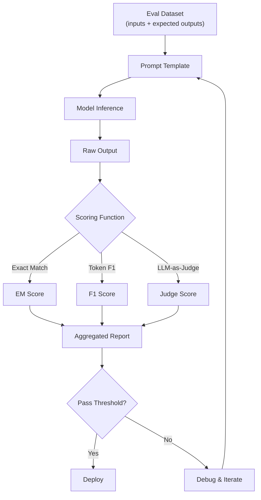

# Evaluation: Benchmarks, Evals, LM Harness

## Learning Objectives

- Build a custom evaluation harness that scores model outputs using exact match, token F1, and BLEU metrics
- Compare benchmark performance against task-specific evaluation results to identify where general capability and domain-specific reliability diverge
- Implement per-class F1 scoring for multi-label classification tasks common in GTM workflows
- Configure a regression testing pipeline that compares model versions across evaluation datasets
- Trace evaluation failures to specific prompt or model weaknesses using per-example scoring breakdowns

## The Problem

You built the pipeline. It runs. But when you prompt it with "classify this lead: hot or not" and it returns a 500-word essay about lead scoring philosophy, you realize: deployment without evaluation is just hopeful debugging in production. The model worked on the three examples you tested manually. It fails on the fourth. You do not know about the fourth because you have no harness running evals against your actual data distribution.

This problem is not theoretical. MMLU was published in 2020 with 15,908 questions across 57 subjects. Within three years, frontier models saturated it. GPT-4 scored 86.4%. Claude 3 Opus scored 86.8%. Llama 3 405B scored 88.6%. The leaderboard compressed into a 3-point range where differences are statistical noise. Meanwhile, Claude 3.5 Sonnet—scoring 88.7% on MMLU—initially could not count the number of R's in "strawberry." A task that requires zero world knowledge and zero reasoning, just character-level iteration. HumanEval tells a similar story: models score 90%+ on 164 Python programming problems while still producing code that crashes on edge cases any junior developer would catch.

The gap between benchmark performance and real-world reliability is the central problem of LLM evaluation. Benchmarks tell you how a model performs on the benchmark. They tell you almost nothing about how that model will perform on your specific task, with your specific data, under your specific failure modes. Goodhart's Law applies in full force: when a measure becomes a target, it ceases to be a good measure. Every frontier lab games benchmarks. MMLU scores go up while models still cannot reliably count letters. The only eval that matters is your eval—on your task, with your data.

This lesson covers the three layers of "does this actually work": benchmarks, task-specific evals, and the harnesses that run them at scale.

## The Concept

The evaluation stack has three distinct layers, and conflating them is the most common evaluation mistake in applied AI work. **Benchmarks** (MMLU, HumanEval, GSM8K) measure a model's general capability against a fixed reference dataset. These tell you which model to shortlist, not whether your specific prompt works. **Evals** are task-specific tests you write for your own use case: "given these 50 inbound emails, does my intent classifier get 90% or better right?" **Harnesses** are the infrastructure that runs evals reproducibly—handling few-shot framing, batching, tokenization, scoring, and metric aggregation.

The layer you operate in depends on the question you are asking. If you are choosing between GPT-4o and Claude 3.5 Sonnet for a new project, benchmarks give you a starting filter. If you are deciding whether your lead-routing prompt is ready for production, you need a custom eval. If you are running that eval across 12 prompt variants and 3 model versions, you need a harness. Most teams skip the middle layer—they run benchmarks, pick a model, and deploy without ever writing a task-specific eval. That is why production AI feels like gambling.



The metric you choose determines what "good" means, and choosing wrong optimizes for the wrong behavior. Exact match is brittle—a model that says "Acme Corp" when you expected "Acme Corporation" scores zero, even though the answer is semantically correct. Token-level F1 catches partial overlap but lets hallucinations slide if they share vocabulary with the reference. BLEU measures n-gram overlap and rewards surface-level similarity, not semantic accuracy. LLM-as-judge introduces a second model's biases as ground truth. Every metric is a trade-off. The eval harness does not resolve this—it makes the trade-off explicit and reproducible.

A standardized benchmark works as follows: a fixed dataset of question-answer pairs is fed through the model using a locked prompt template. The model's output is compared against references using a metric (exact match, multiple-choice probability, pass@k for code). Scores are aggregated per-category and overall. MMLU has 57 subjects and roughly 14,000 questions. HumanEval has 164 Python programming problems with unit tests. GSM8K has 8,500 grade-school math problems. The mechanism is simple. The interpretation is where teams go wrong: a 2-point MMLU difference is noise, not signal. A model scoring 86.4% versus 86.8% on MMLU is not meaningfully different. A model scoring 72% versus 89% on your custom email-routing eval—that is signal.

## Build It

The first thing to build is a scoring toolkit. These are the metric functions that every eval depends on. Without them, you are eyeballing outputs and calling it evaluation.

Exact match is the strictest metric: the prediction must exactly equal the reference, character for character, after normalization. Token F1 relaxes this by comparing overlapping tokens—it rewards partially correct answers that contain the right words in the wrong order or with extra context. BLEU goes further, measuring n-gram precision with a brevity penalty to discourage trivially short outputs. Each metric answers a different question. For classification tasks where the output is a single label, exact match is appropriate. For extraction tasks where the output is a phrase or entity list, token F1 is standard. For longer generative outputs, BLEU or ROUGE may apply, though both are blunt instruments for semantic evaluation.

```python
import re
import math
from collections import Counter

def exact_match(prediction, reference):
    return 1.0 if prediction.strip().lower() == reference.strip().lower() else 0.0

def normalize(text):
    return re.findall(r'\b\w+\b', text.lower())

def token_f1(prediction, reference):
    pred_tokens = normalize(prediction)
    ref_tokens = normalize(reference)
    if not pred_tokens or not ref_tokens:
        return 0.0
    common = Counter(pred_tokens) & Counter(ref_tokens)
    num_same = sum(common.values())
    if num_same == 0:
        return 0.0
    precision = num_same / len(pred_tokens)
    recall = num_same / len(ref_tokens)
    return 2 * precision * recall / (precision + recall)

def bleu_score(prediction, reference, max_n=4):
    pred_tokens = normalize(prediction)
    ref_tokens = normalize(reference)
    if not pred_tokens or not ref_tokens:
        return 0.0

    def get_ngrams(tokens, n):
        return [tuple(tokens[i:i+n]) for i in range(len(tokens) - n + 1)]

    precisions = []
    for n in range(1, max_n + 1):
        pred_ng = Counter(get_ngrams(pred_tokens, n))
        ref_ng = Counter(get_ngrams(ref_tokens, n))
        if not pred_ng:
            precisions.append(0.0)
            continue
        matches = sum(min(pred_ng[ng], ref_ng[ng]) for ng in pred_ng)
        total = sum(pred_ng.values())
        precisions.append(matches / total if total > 0 else 0.0)