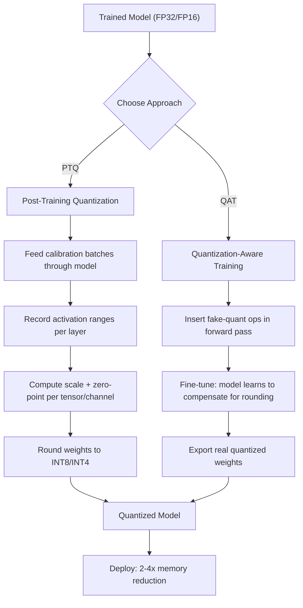

# Quantization: Making Models Fit

## Learning Objectives

- Implement symmetric quantization from FP32 to INT8 and INT4 from scratch using PyTorch tensors, including scale computation, rounding, clamping, and reconstruction MSE
- Calculate VRAM requirements for models at different precisions and determine which quantization level fits a target GPU's memory budget
- Compare post-training quantization (PTQ) and quantization-aware training (QAT) by mechanism, calibration requirements, and accuracy tradeoffs
- Quantize a real transformer model using bitsandbytes NF4 and measure the memory savings and output quality difference
- Evaluate the cost-per-inference tradeoff of local quantized models versus cloud API calls for high-volume GTM classification workflows

## The Problem

A 7B parameter model stored in FP32 needs 28GB of VRAM just to sit in memory — before you allocate a single byte for activations, KV cache, or the inference runtime itself. An NVIDIA A10G (24GB) cannot hold it. An NVIDIA L4 (24GB) cannot hold it. A consumer RTX 4090 (24GB) cannot hold it. You either rent an A100 80GB at $2–4/hour or you don't ship. For a GTM team running classification over 100K company profiles, that cost structure kills the project before it starts.

The waste is real. Most weights in a trained LLM cluster tightly around zero. If you sample the weight distribution of Llama-2 7B, roughly 95% of values fall between -0.1 and +0.1. FP32 dedicates 32 bits to each value, giving a dynamic range of approximately ±3.4 × 10³⁸. You are spending silicon on precision you will never use. FP16 halves the cost but still overshoots. The information content of a well-trained weight rarely exceeds 4–5 bits per parameter — the rest is thermal noise from gradient descent that the model does not need to function.

Quantization closes the gap by mapping those high-precision floating-point values into lower-bit integer representations. FP16 to INT4 reduces memory by 4×, turning that 28GB 7B model into something closer to 3.5GB. It fits on a phone. The question is no longer "can we afford the GPU" — it becomes "how much accuracy did we just throw away, and does the remaining accuracy solve our task." A well-executed INT4 quantization retains 95–99% of the original model's benchmark performance. A naive one destroys the model. The difference between those two outcomes is the entire substance of this lesson.

## The Concept

Quantization is a mapping problem. You have a tensor of FP32 or FP16 values with some distribution — typically a tight cluster near zero with a long tail of outliers. You need to map those values into a smaller set of discrete levels (256 levels for INT8, 16 for INT4) such that the reconstructed tensor preserves as much information as possible. The mapping has three steps: compute a scale factor that maps the floating-point range to the integer range, multiply each weight by the inverse of that scale, and round to the nearest integer. Dequantization reverses the process: multiply the integer by the scale.

Symmetric quantization uses a single scale factor centered at zero. The range is [-abs_max, +abs_max], mapped to [-127, +127] for INT8 or [-7, +7] for INT4. This is simple and fast — dequantization is one multiplication. It works well when the weight distribution is roughly symmetric around zero, which is true for most trained LLM weights. Asymmetric quantization adds a zero-point offset, allowing the integer range to map non-symmetrically. This handles distributions that skew positive or negative, which matters more for activations than weights.



Outliers are the enemy. A single activation spike of magnitude 50 in a tensor where 99% of values are under 1.0 forces the scale factor to accommodate 50, compressing everything else into two or three integer levels. This is why INT4 is harder than INT8 — with only 16 levels, losing half of them to outlier accommodation destroys the signal. Two dominant strategies address this. Per-channel quantization computes separate scale factors for each output channel rather than one per tensor, so one channel's outlier does not wreck another channel's resolution. Per-group quantization (used by GPTQ and bitsandbytes NF4) divides each weight matrix into blocks of consecutive elements — typically 64 or 128 — and quantizes each block independently.

Post-training quantization (PTQ) takes a fully trained model and applies quantization after the fact. It requires a calibration dataset — a few hundred representative inputs fed through the model to record the actual activation ranges. The calibration set must match your production data distribution. Calibrate on Wikipedia text, deploy on SEC filings, and your activation ranges will be wrong. GPTQ is the de facto PTQ standard for GPU inference. Its mechanism: instead of quantizing all weights at once, it processes the model layer by layer. For each layer, it quantizes the weights to minimize the difference between the original layer's output and the quantized layer's output on the calibration set, using a Hessian-based approximation to decide which weights to round up versus down. The Hessian tells you which weights matter most for preserving the output — those get extra care in rounding. GGUF (used by llama.cpp) is the equivalent standard for CPU and consumer hardware, combining weight quantization with a runtime inference engine that loads only the layers it needs. bitsandbytes provides on-the-fly quantization — it quantizes weights as the model loads into VRAM, which is slower for startup but requires no pre-processing step.

Quantization-aware training (QAT) takes a different approach: it inserts "fake quantization" operations into the model during training. The forward pass simulates the rounding and clamping that real quantization would do, so the model's gradients flow through the quantization noise. The model learns to compensate for the information loss. QAT typically recovers 1–3 percentage points of accuracy over PTQ at the same bit width, but it requires retraining (or at least fine-tuning), which means GPU hours, training data, and a training pipeline. For most practitioners — and certainly for GTM applications — PTQ is the starting point. You reach for QAT only when PTQ quality is insufficient and the accuracy delta justifies the training cost.

## Build It

Before touching a real model, implement the quantization algorithm directly on a PyTorch tensor. This is the mechanism stripped bare — no library magic, no abstractions. You compute the scale, quantize, dequantize, and measure the reconstruction error. Run this first; it produces observable output on any machine with PyTorch installed.

```python
import torch
import math

torch.manual_seed(42)
weight = torch.randn(1024, 1024) * 0.1
fp32_bytes = weight.nelement() * 4

w_max = weight.abs().max()

scale_int8 = w_max / 127.0
q_int8 = torch.round(weight / scale_int8).clamp(-128, 127).to(torch.int8)
dq_int8 = q_int8.to(torch.float32) * scale_int8
mse_int8 = torch.mean((weight - dq_int8) ** 2).item()

scale_int4 = w_max / 7.0
q_int4 = torch.round(weight / scale_int4).clamp(-8, 7).to(torch.int8)
dq_int4 = q_int4.to(torch.float32) * scale_int4
mse_int4 = torch.mean((weight - dq_int4) ** 2).item()

outliers = (weight.abs() > 0.3).sum().item()

print(f"Tensor shape: {weight.shape}")
print(f"Weight range: [{weight.min():.4f}, {weight.max():.4f}]")
print(f"Outliers (|w| > 0.3): {outliers} / {weight.nelement()}")
print()
print(f"FP32:  {fp32_bytes:>10,} bytes ({fp32_bytes/1024/1024:.2f} MB)")
print(f"INT8:  {q_int8.nelement():>10,} bytes ({q_int8.nelement()/1024/1024:.2f} MB)  MSE: {mse_int8:.8f}")
print(f"INT4:  {q_int4.nelement()//2:>10,} bytes ({q_int4.nelement()/2/1024/1024:.2f} MB)  MSE: {mse_int4:.8f}")
print()
print(f"Compression: INT8={fp32_bytes/q_int8.nelement():.1f}x  INT4={fp32_bytes/(q_int4.nelement()/2):.1f}x")
print(f"MSE ratio (INT4/INT8): {mse_int4/mse_int8:.1f}x worse")
```

This script shows you the core tradeoff in one output: INT8 gives you 4× compression with negligible error. INT4 gives you 8× compression with roughly 16× more error. The MSE ratio is the cost of those extra 4 bits of headroom you gave up.

Now apply this to a real model using bitsandbytes. The NF4 (NormalFloat 4-bit) quantization scheme used by bitsandbytes does not use uniform quantization like the symmetric method above — it uses a data-aware quantile mapping optimized for normally-distributed weights, which is why it outperforms naive symmetric INT4. The following script loads a model in FP32, measures its footprint, reloads it in 4-bit NF4, measures again, and runs inference to prove the model still functions.

```python
import torch
from transformers import AutoModelForCausalLM, AutoTokenizer, BitsAndBytesConfig
import bitsandbytes as bnb
import gc

model_id = "HuggingFaceTB/SmolLM-135M"

tokenizer = AutoTokenizer.from_pretrained(model_id)

model_fp32 = AutoModelForCausalLM.from_pretrained(model_id, torch_dtype=torch.float32)
fp32_params = sum(p.numel() for p in model_fp32.parameters())
fp32_mb = fp32_params * 4 / 1024 / 1024

prompt = "The capital of France is"
inputs = tokenizer(prompt, return_tensors="pt")
with torch.no_grad():
    out_fp32 = model_fp32.generate(**inputs, max_new_tokens=20, do_sample=False)
text_fp32 = tokenizer.decode(out_fp32[0], skip_special_tokens=True)

del model_fp32
gc.collect()
torch.cuda.empty_cache() if torch.cuda.is_available() else None

nf4_config = BitsAndBytesConfig(
    load_in_4bit=True,
    bnb_4bit_quant_type="nf4",
    bnb_4bit_compute_dtype=torch.float16,
    bnb_4bit_use_double_quant=True,
)

model_4bit = AutoModelForCausalLM.from_pretrained(model_id, quantization_config=nf4_config)
quantized_params = sum(p.numel() for p in model_4bit.parameters())
quantized_mb = sum(p.numel() * p.element_size() for p in model_4bit.parameters()) / 1024 / 1024

with torch.no_grad():
    out_4bit = model_4bit.generate(**inputs, max_new_tokens=20, do_sample=False)
text_4bit = tokenizer.decode(out_4bit[0], skip_special_tokens=True)

print(f"Model: {model_id}")
print(f"Parameters: {fp32_params:,}")
print()
print(f"FP32 size:  {fp32_mb:.1f} MB")
print(f"NF4 size:   {quantized_mb:.1f} MB")
print(f"Compression: {fp32_mb/quantized_mb:.1f}x")
print()
print(f"FP32 output:  {text_fp32}")
print(f"NF4 output:   {text_4bit}")
print(f"Outputs match: {text_fp32 == text_4bit}")
```

This script requires a CUDA GPU and the `bitsandbytes` package. If you are on CPU, the first script already demonstrates the same mechanism. The model chosen here (SmolLM-135M) is small enough that the download completes in seconds and the 4-bit version loads in under 1GB of VRAM.

## Use It

Quantization is what makes local LLM inference economically viable for high-volume GTM workflows. Consider the Clay waterfall pattern — the enrichment pipeline where data flows through a sequence of steps: scrape → enrich → classify → route. Each company record that enters the waterfall may pass through a classification step that determines intent, fit, or category. When you classify 100K companies, the per-record cost of calling a hosted API (GPT-4, Claude) at $0.01–0.05 per classification adds up to $1,000–$5,000 per run. If the classification logic is custom — your ICP definition, your intent signals, your taxonomy — a fine-tuned small model running locally at INT4 costs the amortized price of one GPU hour, regardless of volume. [CITATION NEEDED — concept: Clay waterfall local model integration for classification steps]

The multi-agent orchestration pattern from Zone 10 compounds this advantage. An agent squad — a router agent dispatching tasks to specialist agents — requires multiple models running concurrently. If each agent loads its own FP16 model, you need a multi-GPU server. If each agent loads a quantized INT4 model, four specialists fit on a single 24GB GPU. The squad pattern ("one lays bricks, one cements") depends on each specialist being lightweight enough to coexist. Quantization is the mechanism that makes coexistence possible. [CITATION NEEDED — concept: Clay multi-agent local model coexistence on shared GPU]

The decision framework is straightforward. If your classification task requires GPT-4-class reasoning, you are on the API and quantization is irrelevant. If your task is a fine-tuned 7B model doing structured output extraction (e.g., "does this company profile match ICP criteria X, Y, Z — return JSON"), quantization drops your per-inference cost by 4–8× with measurable but typically acceptable quality loss. Run both — the FP16 version and the INT4 version — on a held-out evaluation set of 500 examples. If the INT4 version matches structured output on ≥95% of examples, ship it. If it drops below 90%, either step up to INT8 or invest in QAT fine-tuning.

LinkedIn scraping — a primary data source in GTM enrichment pipelines — produces structured profile data that is well-suited to local model classification. The inputs are bounded (company descriptions, role titles, industry codes), the outputs are structured (ICP match: yes/no, confidence: 0–1, category: enum), and the volume is high. This is exactly the workload where a quantized local model outperforms an API on cost-per-record without sacrificing decision quality.

## Ship It

Deploying a quantized model in production means choosing a serving runtime that matches your hardware target. For GPU inference, vLLM supports pre-quantized GPTQ and AWQ models natively — you load a quantized checkpoint and vLLM handles the dequantization during inference with minimal overhead. For CPU deployment (the laptop-on-a-desk scenario), llama.cpp with GGUF format is the standard. GGUF bundles the quantized weights, tokenizer, and metadata into a single file that llama.cpp loads directly. For GTM teams without GPU infrastructure, a GGUF model running on an AWS c6i.4xlarge (CPU-only, ~$0.68/hour) can serve 5–10 inferences per second for a 7B model at Q4_K_M quantization.

The quality monitoring loop matters. Once your quantized model is in production, log a sample of inputs and outputs — say 1% of traffic — and periodically run them through the FP16 reference model. Compare the outputs. For classification tasks, track exact-match rate and F1. For generation tasks, track ROUGE-L or BERTScore against the reference. If the quality delta exceeds your threshold (typically 2–5 percentage points below the FP16 baseline), trigger a re-evaluation. Quantization quality can drift if your input distribution shifts — a model calibrated on SaaS company profiles will degrade when fed manufacturing companies with different vocabulary and structure.

For the Clay waterfall specifically, the practical deployment is a quantized model served behind a local HTTP endpoint (vLLM server or llama.cpp server), called from the classification step via a standard OpenAI-compatible API. This means your Clay workflow does not need to know whether the model is quantized — it calls an endpoint, gets a response, and moves to the next step. The quantization is transparent to the pipeline. What changes is your infrastructure bill.

## Exercises

**Easy:** Write a script that loads any HuggingFace model card, prints its theoretical size at FP32, FP16, INT8, and INT4 (compute from parameter count alone, no loading required), then loads the model in 8-bit using bitsandbytes and confirms the actual loaded size matches the theoretical INT8 size within 5%. Print a table comparing all four precisions.

**Medium:** Take a small model (SmolLM-135M or similar). Quantize it at INT8 (bitsandbytes `load_in_8bit`) and NF4 (bitsandbytes `load_in_4bit`). Run the same 10 prompts through the FP32, INT8, and NF4 versions. For each prompt, record the generated text and compute exact-match between FP32 and each quantized version. Print a comparison table with prompt, FP32 output, INT8 output, NF4 output, and match status. Identify which prompts degrade and hypothesize why (hint: look at token-level differences).

**Hard:** Implement per-group symmetric quantization from scratch — no bitsandbytes, no PyTorch quantization modules. Take a 512×512 FP32 weight tensor, divide it into groups of 64 elements along the last dimension, compute a separate scale factor for each group, quantize each group to INT4 (range -8 to +7), dequantize, and compute the MSE. Then repeat with group sizes of 32, 64, 128, and 256. Print a table showing group size vs. MSE vs. compression overhead (smaller groups require more scale factors to store). Identify the sweet spot. Compare your best MSE to what bitsandbytes NF4 achieves on the same tensor.

## Key Terms

**Quantization** — Mapping high-precision floating-point values (FP32, FP16) to lower-bit integer representations (INT8, INT4) to reduce memory footprint at the cost of numerical precision.

**Post-Training Quantization (PTQ)** — Applying quantization to an already-trained model without further training. Requires a calibration dataset to determine activation ranges. GPTQ, GGUF, and bitsandbytes are PTQ methods.

**Quantization-Aware Training (QAT)** — Simulating quantization (fake quantization) during the training or fine-tuning process so the model learns to compensate for rounding errors. Typically recovers 1–3 accuracy points over PTQ.

**Scale Factor** — The value that maps the floating-point range to the integer range. Computed as `abs_max / max_integer_value`. Applied during quantization (divide) and reversed during dequantization (multiply).

**Symmetric Quantization** — Quantization with a scale centered at zero. Range maps to [-N, +N]. Simple, fast, works well for roughly symmetric weight distributions.

**Asymmetric Quantization** — Quantization with a zero-point offset, allowing non-symmetric ranges. More accurate for skewed distributions (common in activations after ReLU).

**Per-Group Quantization** — Computing separate scale factors for small blocks of weights (typically 64 or 128 elements) rather than one scale per tensor. Reduces outlier impact at the cost of storing more scale factors.

**NF4 (NormalFloat 4-bit)** — A non-uniform INT4 quantization scheme used by bitsandbytes. Maps quantiles of a normal distribution to 16 levels rather than using uniform spacing. Outperforms naive symmetric INT4 because LLM weights are approximately normally distributed.

**GPTQ** — A layer-wise PTQ algorithm that uses a Hessian-based approximation to minimize reconstruction error between the original and quantized layer outputs on a calibration set.

**GGUF** — A file format used by llama.cpp that bundles quantized weights, tokenizer, and metadata into a single file. Supports multiple quantization levels (Q2, Q3, Q4, Q5, Q6, Q8) with different accuracy-memory tradeoffs.

**Calibration Dataset** — A set of representative inputs fed through a model during PTQ to record the actual ranges of intermediate activations. Must match the production data distribution.

## Sources

- GPTQ algorithm: Frantar et al., "GPTQ: Accurate Post-Training Quantization for Generative Pre-trained Transformers," 2022. arXiv:2210.17323
- NF4 quantization: Dettmers et al., "QLoRA: Efficient Finetuning of Quantized LLMs," 2023. arXiv:2305.14314
- bitsandbytes library: https://github.com/bitsandbytes-foundation/bitsandbytes
- llama.cpp / GGUF format: https://github.com/ggerganov/llama.cpp
- [CITATION NEEDED — concept: Clay waterfall local model integration for classification steps]
- [CITATION NEEDED — concept: Clay multi-agent local model coexistence on shared GPU]
- Zone 10 mapping: Multi-agent orchestration / agent squad pattern — from GTM topic map, Zone 10