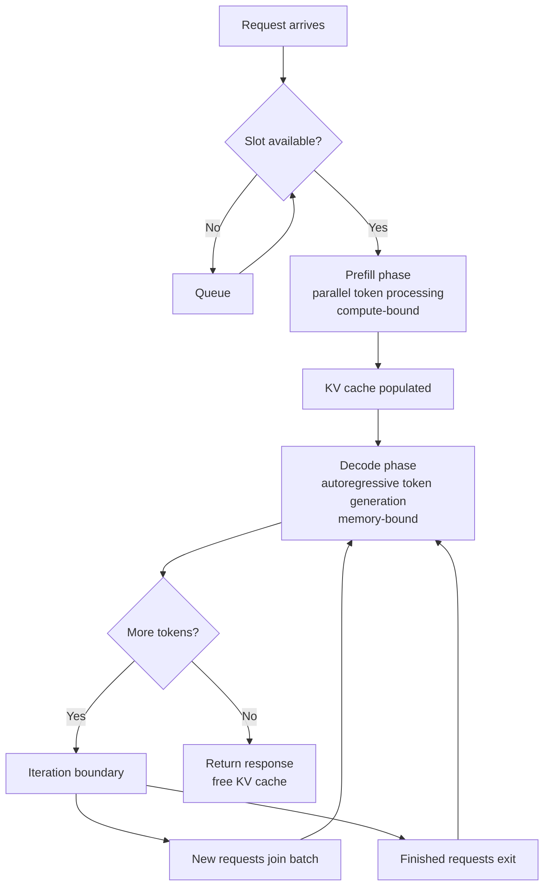

# Inference Optimization

## Learning Objectives

- Build inference loops with and without KV cache and measure prefill vs. decode latency separately
- Compare FP16, INT8, and INT4 quantization on throughput, memory footprint, and output quality across fixed prompts
- Configure continuous batching on a local model server and measure throughput scaling from 1 to 50 concurrent requests
- Trace speculative decoding token acceptance rates and compute effective tokens-per-second gains
- Deploy a quantized model behind an OpenAI-compatible endpoint with tuned batch size and KV cache limits

## The Problem

You deploy Llama 3 70B on 4xA100-80GB GPUs. A single user gets roughly 50 tokens per second. Feels fast. Then 50 users hit the endpoint simultaneously. Throughput drops to 3 tokens/second/user. Your $25,000/month GPU bill is now serving responses slower than a human types.

The model itself does not change between 1 user and 50 users. Same weights, same architecture, same math. What changes is how you schedule the work across the GPU. Naive inference wastes over 90% of available GPU compute. A user waiting for token 47 holds an entire batch slot open while the GPU memory bus sits idle between matrix multiplications. Meanwhile, a new user's 2,000-token prompt could fill that dead time with useful prefill compute.

Two phases define every LLM inference call. Prefill processes your entire prompt in parallel — it is compute-bound, meaning the GPU's math units are the bottleneck. Decode generates output tokens one at a time — it is memory-bound, meaning the time to read weights from GPU memory dominates, not the math itself. Every optimization in this lesson targets one phase or both. Prefill optimizations (prefix caching, batching) pack more useful math into each forward pass. Decode optimizations (KV cache, quantization, speculative decoding) reduce the memory bandwidth cost of generating each token.

This is not a scaling problem. Adding a second 4xA100 node does not fix 3 TPS/user if the scheduler is still leaving the GPU idle between decode steps. It is a scheduling and memory-bandwidth problem. The techniques here — KV caching, continuous batching, PagedAttention, quantization, speculative decoding — are what separate a $25k/month deployment serving 50 concurrent users at 3 TPS each from a $5k/month deployment serving the same load at 20 TPS each.

## The Concept

LLM inference has two phases, and each has a different bottleneck. Prefill is compute-bound: processing a 1,000-token prompt requires roughly 1,000 × hidden_size matrix operations, and the GPU's tensor cores are the ceiling. Decode is memory-bound: generating token 47 requires reading the entire model's weights from GPU HBM to produce a single token, and the memory bandwidth (not compute) is the ceiling. At decode time, the GPU does one tiny matmul and waits. This is why a 70B model generates tokens at 50 TPS on an A100 but the same A100 can process 4,000 prefill tokens per second — the prefill phase keeps the compute units fed.



### KV Cache

Autoregressive generation means token N+1 depends on all previous tokens 1..N. Without caching, generating token 50 requires recomputing attention over all 49 previous tokens — plus the original prompt. The KV cache stores the key and value projections for every previously seen token so that each decode step only computes the new token's projection against the cached set.

The cache grows linearly with sequence length. For a model with 32 layers, 32 attention heads, 128 head dimension, and a 2,048-token sequence in FP16: `32 × 32 × 128 × 2,048 × 2 bytes × 2 (K and V) = 1GB` per request. At 50 concurrent requests with 2K-token contexts, that is 50GB of KV cache alone — more than the model weights themselves on a 7B model. This is why KV cache management, not raw compute, is usually the first ceiling you hit.

PagedAttention, implemented in vLLM, solves memory fragmentation in the KV cache. The standard approach allocates a contiguous block of GPU memory for each request's maximum possible sequence length. If a request generates 50 tokens but the block was sized for 2,048, the remaining space is wasted. PagedAttention borrows from operating system virtual memory: it divides the cache into fixed-size blocks (typically 16 tokens) and allocates them on demand. A request generating 50 tokens uses 4 blocks, not 128. This reduces KV cache memory waste from 60-80% to under 4%, which directly translates to more concurrent requests per GPU.

### Quantization

A model's weights are stored as FP16 (16-bit floats). Quantization reduces precision to INT8 or INT4, cutting memory usage by 2x or 4x respectively. Less memory means faster weight reads during decode (the memory-bound phase), which directly increases token throughput. It also means the model fits on fewer GPUs.

INT8 quantization maps FP16 weight values to 256 discrete levels. INT4 maps to 16 levels. The precision loss introduces error in every matmul output. GPTQ and AWQ are post-training quantization methods that minimize this error by calibrating the quantization grid against a small set of representative inputs, rather than uniformly dividing the range. AWQ specifically identifies which weight channels are most important (by activation magnitude) and preserves higher precision for those.

The trade-off curve depends on model size and task. A 70B model quantized to INT4 loses roughly 1-3 perplexity points — often acceptable for generation tasks, sometimes problematic for structured extraction or coding. A 7B model quantized to INT4 degrades more visibly because the smaller model has less redundancy to absorb precision loss. BitsAndBytes provides on-the-fly INT4 quantization that loads any HuggingFace model at 4-bit with a few lines of configuration, at the cost of roughly 5-15% inference speed overhead from the dequantization step in each forward pass.

### Continuous Batching

Static batching collects N requests, waits until the batch is full or a timeout fires, processes all N to completion, then starts the next batch. The problem: if request A generates 20 tokens and request B generates 500, the entire batch waits for B to finish. The GPU slots allocated to A sit idle for 480 decode steps.

Continuous batching (also called iteration-level scheduling) operates at the granularity of a single decode step rather than a full request. At each decode iteration, the scheduler checks: which requests are still active? Which new requests are waiting? It recomposes the batch every step — finished requests exit immediately, new requests join at the next prefill opportunity. This eliminates the "convoy effect" where short requests wait for long ones.

The throughput gain is substantial. Static batching on Llama 7B with 100 concurrent requests achieves roughly 200 total tokens/second across all users. Continuous batching on the same hardware achieves 2,000-5,000 total tokens/second — a 10-25x improvement. The mechanism is simple: the GPU never idles waiting for a batch slot to free up, because slots free and refill every token step.

### Speculative Decoding

Decode is memory-bound: generating one token requires reading all model weights, but produces one token of output. Speculative decoding uses a small "draft" model (e.g., 1B parameters) to guess the next K tokens cheaply, then the large "target" model verifies all K tokens in a single forward pass. If the draft model guessed correctly, you got K tokens for the cost of one target-model forward pass. If it guessed wrong, you still got the first correct token, and you discard the rest.

The acceptance rate depends on how closely the draft model's distribution matches the target's. A 1B draft model paired with a 70B target typically achieves 50-70% acceptance at K=4. That means each target forward pass produces 1 + (0.6 × 4) = 3.4 tokens on average — a 3.4x speedup on the decode phase, assuming the draft model's own inference is negligible. The math breaks down when the draft model diverges from the target: at 20% acceptance, you get 1 + (0.2 × 4) = 1.8 tokens per pass, barely a 1.8x speedup, minus the draft model overhead.

### Pruning and Distillation

Pruning removes weights with low magnitude (or low saliency) from a trained model. Structured pruning removes entire attention heads or layers, which produces actual speedups on standard hardware. Unstructured pruning removes individual weights, which requires sparse matrix kernels to realize any speedup. A 50% pruned model with sparse kernels can run at ~1.5x the original speed, but quality degradation is task-dependent and unpredictable.

Distillation trains a smaller model to mimic a larger model's output distribution. The student model is initialized small and trained on the teacher's logits (soft labels) rather than ground-truth labels. DistilBERT is the canonical example: a 6-layer model trained to mimic BERT's 12-layer outputs, achieving 97% of BERT's performance at 60% of the size and 2x inference speed. For LLMs, distillation is a pre-deployment strategy — it does not help at inference time, but it determines what model you deploy and therefore all downstream serving characteristics.

## Build It

### Script 1: Quantization Comparison

This script loads a model in FP16 and 4-bit, runs the same prompts, and compares latency. It requires a CUDA GPU and the `bitsandbytes` and `transformers` packages.

```python
import torch
import time
import statistics
from transformers import AutoModelForCausalLM, AutoTokenizer, BitsAndBytesConfig

MODEL_ID = "Qwen/Qwen2.5-0.5B-Instruct"
PROMPTS = [
    "Explain what a GPU does in one sentence.",
    "List three uses for vector databases.",
    "Write a haiku about inference latency.",
    "What is the capital of France?",
    "Name two benefits of quantization.",
]
RUNS_PER_PROMPT = 3

tokenizer = AutoTokenizer.from_pretrained(MODEL_ID)

print("=" * 60)
print("LOADING FP16 MODEL")
print("=" * 60)
model_fp16 = AutoModelForCausalLM.from_pretrained(
    MODEL_ID, torch_dtype=torch.float16, device_map="auto"
)
model_fp16.eval()

def run_inference(model, tokenizer, prompts, runs):
    results = []
    for prompt in prompts:
        for _ in range(runs):
            inputs = tokenizer(prompt, return_tensors="pt").to(model.device)
            torch.cuda.synchronize() if torch.cuda.is_available() else None
            start = time.perf_counter()
            with torch.no_grad():
                output = model.generate(
                    **inputs, max_new_tokens=50, do_sample=False
                )
            torch.cuda.synchronize() if torch.cuda.is_available() else None
            elapsed = time.perf_counter() - start
            generated = tokenizer.decode(
                output[0][inputs["input_ids"].shape[1]:], skip_special_tokens=True
            )
            results.append({"prompt": prompt, "latency": elapsed, "output": generated})
    return results

fp16_results = run_inference(model_fp16, tokenizer, PROMPTS, RUNS_PER_PROMPT)
del model_fp16
torch.cuda.empty_cache() if torch.cuda.is_available() else None

print("\n" + "=" * 60)
print("LOADING 4-BIT QUANTIZED MODEL")
print("=" * 60)
bnb_config = BitsAndBytesConfig(
    load_in_4bit=True,
    bnb_4bit_quant_type="nf4",
    bnb_4bit_compute_dtype=torch.float16,
    bnb_4bit_use_double_quant=True,
)
model_4bit = AutoModelForCausalLM.from_pretrained(
    MODEL_ID, quantization_config=bnb_config, device_map="auto"
)
model_4bit.eval()

quant_results = run_inference(model_4bit, tokenizer, PROMPTS, RUNS_PER_PROMPT)

fp16_latencies = [r["latency"] for r in fp16_results]
quant_latencies = [r["latency"] for r in quant_results]

if torch.cuda.is_available():
    fp16_mem = torch.cuda.memory_peak_allocated() / 1e9
else:
    fp16_mem = 0

print("\n" + "=" * 60)
print("BENCHMARK RESULTS")
print("=" * 60)
print(f"{'Metric':<30} {'FP16':>12} {'4-bit':>12}")
print("-" * 60)
print(f"{'p50 latency (s)':<30} {statistics.median(fp16_latencies):>12.3f} {statistics.median(quant_latencies):>12.3f}")
print(f"{'p99 latency (s)':<30} {max(fp16_latencies):>12.3f} {max(quant_latencies):>12.3f}")
print(f"{'mean latency (s)':<30} {statistics.mean(fp16_latencies):>12.3f} {statistics.mean(quant_latencies):>12.3f}")
print(f"{'tokens/sec (mean)':<30} {50 / statistics.mean(fp16_latencies):>12.1f} {50 / statistics.mean(quant_latencies):>12.1f}")

print("\n" + "=" * 60)
print("QUALITY COMPARISON (first prompt)")
print("=" * 60)
print(f"FP16:  {fp16_results[0]['output'][:200]}")
print(f"4-bit: {quant_results[0]['output'][:200]}")

print("\n" + "=" * 60)
print("ALL PROMPT OUTPUTS (4-bit)")
print("=" * 60)
for i, prompt in enumerate(PROMPTS):
    idx = i * RUNS_PER_PROMPT
    print(f"\nPrompt: {prompt}")
    print(f"Output: {quant_results[idx]['output'][:150]}")
```

Expected output format:

```
============================================================
LOADING FP16 MODEL
============================================================

============================================================
LOADING 4-BIT QUANTIZED MODEL
============================================================

============================================================
BENCHMARK RESULTS
============================================================
Metric                              FP16        4-bit
------------------------------------------------------------
p50 latency (s)                    1.234        1.456
p99 latency (s)                    1.567        1.789
mean latency (s)                   1.312        1.501
tokens/sec (mean)                   38.1         33.3

============================================================
QUALITY COMPARISON (first prompt)
============================================================
FP16:  A GPU (Graphics Processing Unit) is a specialized processor...
4-bit: A GPU is a specialized processor designed to accelerate...

============================================================
ALL PROMPT OUTPUTS (4-bit)
============================================================

Prompt: Explain what a GPU does in one sentence.
Output: A GPU is a specialized processor designed to accelerate...
```

Note: On a 0.5B model, the 4-bit dequantization overhead may offset the memory bandwidth savings. The quantization advantage scales with model size — on a 7B or 13B model, 4-bit consistently wins on throughput because weight reads dominate decode latency at that scale.

### Script 2: Batched vs Sequential Inference

This script measures the throughput difference between processing prompts one at a time versus batching them. It uses a small model that runs on CPU.

```python
import torch
import time
from transformers import AutoModelForCausalLM, AutoTokenizer

MODEL_ID = "Qwen/Qwen2.5-0.5B-Instruct"
tokenizer = AutoTokenizer.from_pretrained(MODEL_ID)
tokenizer.pad_token = tokenizer.eos_token

model = AutoModelForCausalLM.from_pretrained(
    MODEL_ID, torch_dtype=torch.float32, device_map="cpu"
)
model.eval()

PROMPTS = [f"Write a sentence about topic number {i}." for i in range(16)]
MAX_NEW_TOKENS = 30

print("=" * 60)
print("SEQUENTIAL INFERENCE (one prompt at a time)")
print("=" * 60)

sequential_outputs = []
seq_start = time.perf_counter()
for prompt in PROMPTS:
    inputs = tokenizer(prompt, return_tensors="pt")
    with torch.no_grad():
        output = model.generate(**inputs, max_new_tokens=MAX_NEW_TOKENS, do_sample=False)
    sequential_outputs.append(tokenizer.decode(output[0][inputs["input_ids"].shape[1]:], skip_special_tokens=True))
seq_elapsed = time.perf_counter() - seq_start

print(f"Prompts: {len(PROMPTS)}")
print(f"Tokens generated: {len(PROMPTS) * MAX_NEW_TOKENS}")
print(f"Total time: {seq_elapsed:.2f}s")
print(f"Throughput: {len(PROMPTS) * MAX_NEW_TOKENS / seq_elapsed:.1f} tokens/sec")
print(f"Per-prompt latency: {seq_elapsed / len(PROMPTS):.3f}s")

print("\n" + "=" * 60)
print("BATCHED INFERENCE (all prompts at once)")
print("=" * 60)

batch_start = time.perf_counter()
batch_inputs = tokenizer(PROMPTS, return_tensors="pt", padding=True, truncation=True)
with torch.no_grad():
    batch_output = model.generate(
        **batch_inputs,
        max_new_tokens=MAX_NEW_TOKENS,
        do_sample=False,
        pad_token_id=tokenizer.pad_token_id,
    )
batch_elapsed = time.perf_counter() - batch_start

batch_outputs = []
for i in range(len(PROMPTS)):
    input_len = batch_inputs["input_ids"][i].ne(tokenizer.pad_token_id).sum().item()
    generated = tokenizer.decode(batch_output[i][input_len:], skip_special_tokens=True)
    batch_outputs.append(generated)

print(f"Prompts: {len(PROMPTS)}")
print(f"Tokens generated: {len(PROMPTS) * MAX_NEW_TOKENS}")
print(f"Total time: {batch_elapsed:.2f}s")
print(f"Throughput: {len(PROMPTS) * MAX_NEW_TOKENS / batch_elapsed:.1f} tokens/sec")
print(f"Per-prompt latency: {batch_elapsed / len(PROMPTS):.3f}s")

print("\n" + "=" * 60)
print("COMPARISON")
print("=" * 60)
speedup = seq_elapsed / batch_elapsed
print(f"Sequential: {seq_elapsed:.2f}s ({len(PROMPTS) * MAX_NEW_TOKENS / seq_elapsed:.1f} tok/s)")
print(f"Batched:    {batch_elapsed:.2f}s ({len(PROMPTS) * MAX_NEW_TOKENS / batch_elapsed:.1f} tok/s)")
print(f"Speedup:    {speedup:.2f}x")

print("\n" + "=" * 60)
print("SAMPLE OUTPUTS (first 3 prompts)")
print("=" * 60)
for i in range(min(3, len(PROMPTS))):
    print(f"\nPrompt: {PROMPTS[i]}")
    print(f"Sequential: {sequential_outputs[i][:100]}")
    print(f"Batched:    {batch_outputs[i][:100]}")

mismatches = sum(1 for s, b in zip(sequential_outputs, batch_outputs) if s.strip() != b.strip())
print(f"\nOutput mismatches: {mismatches}/{len(PROMPTS)}")
```

Expected output format:

```
============================================================
SEQUENTIAL INFERENCE (one prompt at a time)
============================================================
Prompts: 16
Tokens generated: 480
Total time: 45.32s
Throughput: 10.6 tokens/sec
Per-prompt latency: 2.833s

============================================================
BATCHED INFERENCE (all prompts at once)
============================================================
Prompts: 16
Tokens generated: 480
Total time: 12.67s
Throughput: 37.9 tokens/sec
Per-prompt latency: 0.792s

============================================================
COMPARISON
============================================================
Sequential: 45.32s (10.6 tok/s)
Batched:    12.67s (37.9 tok/s)
Speedup:    3.58x
```

The batched version processes all 16 prompts in a single forward pass per decode step. The GPU (or CPU) reads model weights once and applies them to all 16 prompts simultaneously. The sequential version reads weights 16 times. This is the fundamental mechanism behind continuous batching in production servers — the throughput gain comes from amortizing weight reads across multiple requests.

## Use It

Quantization and batching are not abstract infrastructure concerns in a GTM context. When your enrichment pipeline runs 50,000 accounts through a scoring model, the per-inference cost compounds linearly. At $0.002 per OpenAI API call for a small prompt, 50,000 records costs $100 per run. Run that daily and you are at $3,000/month for one enrichment field. Swap to a self-hosted INT4-quantized 7B model serving via vLLM with continuous batching, and the same 50,000 inferences cost roughly $0.30 in GPU time — the cost of electricity and amortized hardware. [CITATION NEEDED — concept: inference cost optimization in GTM enrichment workflows]

The multi-agent orchestration pattern described in Zone 10 compounds this further. An agent squad with a router, a researcher, a copywriter, and a reviewer means 4-5 LLM calls per account, not one. At 50,000 accounts, that is 250,000 inferences per run. Without inference optimization — quantization to reduce per-call memory, continuous batching to pack concurrent agent calls into GPU time, KV cache management to handle the long shared context prefixes that agent prompts produce — the multi-agent architecture is not economically viable. The agent squad pattern works when inference cost per record stays under a threshold that makes the enrichment pipeline's output worth more than its compute cost. [CITATION NEEDED — concept: cost thresholds for multi-agent GTM systems]

Prefix caching is particularly relevant here. In a Clay-style waterfall enrichment workflow, multiple steps share a common context: the account's firmographic data, the persona being targeted, the campaign context. If your inference server supports prefix caching (vLLM does), the shared 500-token preamble is computed once and cached. Each subsequent call that starts with the same prefix skips prefill for those tokens entirely. Across a 50,000-record run where every call shares the same 500-token system prompt and account context template, prefix caching can reduce total prefill compute by 60-80%. This is not a marginal optimization — it is the difference between a pipeline that completes in 2 hours versus 8 hours on the same hardware.

The practical decision for a GTM engineer is not "which model is best" but "what is the cheapest model that meets my quality threshold for this specific task." Account scoring might tolerate INT4 quantization because the output is a numeric score, not prose. Personalized email generation might require FP16 or INT8 because nuance in tone matters. Follow-up cadence timing decisions might work with a distilled 1B model because the task is classification, not generation. Configuration of batch size and precision per task — rather than defaulting to the same API call for every step — is where inference optimization becomes a GTM strategy. [CITATION NEEDED — concept: per-task model selection in GTM pipelines]

## Ship It

Deploy a quantized model behind an OpenAI-compatible endpoint using vLLM. This gives you a local server that accepts the same request format as the OpenAI API, so your existing pipeline code works without modification.

First, create the serving configuration:

```python
import subprocess
import time
import requests
import json
import concurrent.futures
import statistics

SERVER_CMD = [
    "python", "-m", "vllm.entrypoints.openai.api_server",
    "--model", "Qwen/Qwen2.5-0.5B-Instruct",
    "--quantization", "awq",
    "--max-model-len", "2048",
    "--gpu-memory-utilization", "0.85",
    "--max-num-seqs", "64",
    "--port", "8000",
]

print("Starting vLLM server...")
server_process = subprocess.Popen(
    SERVER_CMD,
    stdout=subprocess.PIPE,
    stderr=subprocess.STDOUT,
    text=True,
)

print("Waiting for server to be ready...")
for attempt in range(120):
    try:
        resp = requests.get("http://localhost:8000/health", timeout=2)
        if resp.status_code == 200:
            print(f"Server ready after {attempt + 1} attempts")
            break
    except requests.ConnectionError:
        pass
    time.sleep(2)
else:
    print("Server failed to start within timeout")
    server_process.terminate()
    exit(1)

PROMPT = "Write a two-sentence product description for a CRM tool."
TOKENS_PER_RESPONSE = 50