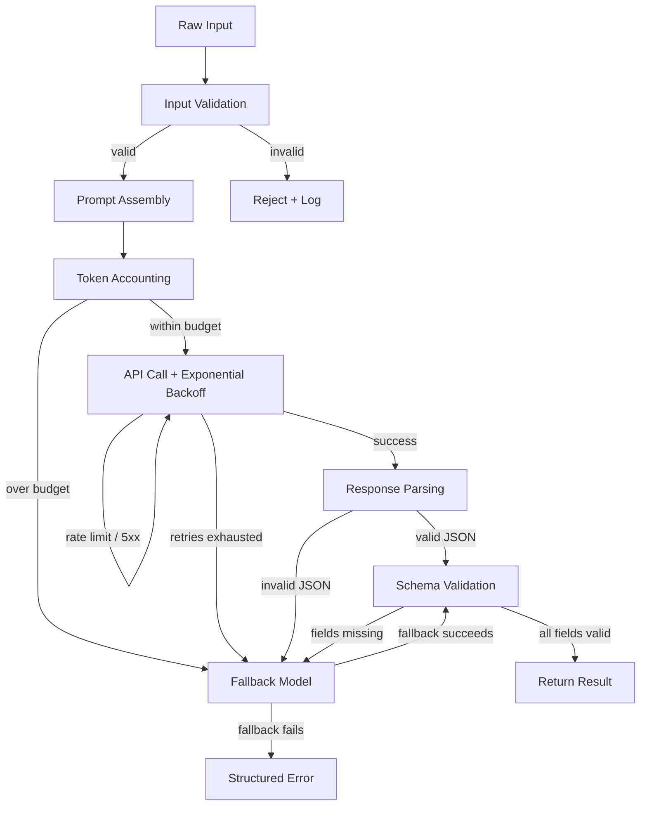

# Building a Complete LLM Pipeline

## Learning Objectives

- Implement a multi-stage LLM pipeline that handles input validation, prompt assembly, token accounting, API retry with exponential backoff, JSON parsing, schema validation, and fallback routing as discrete decision points.
- Trace execution through every pipeline stage by emitting structured state at each step, so silent failures become visible failures.
- Build a fallback chain that degrades to a cheaper or smaller model when the primary call fails, and validate that the fallback output meets the same schema contract.
- Compare the pipeline architecture to a GTM enrichment waterfall, identifying where schema validation and graceful degradation map to production data enrichment workflows.

## The Problem

You have made single API calls that work. A prompt goes in, a response comes out, you parse the result, and the notebook looks great. Then you run the same call against a thousand inputs at 3 AM and three things happen: the API rate-limits you after twenty requests, the model occasionally returns prose instead of JSON, and the token cost is triple what you budgeted because one input was nine thousand characters longer than expected. The notebook has no answer for any of this.

A single API call is a function. A production LLM pipeline is a state machine. Each stage — input validation, prompt assembly, token accounting, the API call itself, response parsing, schema validation, fallback routing — is a decision point where the pipeline can succeed, retry, degrade, or fail explicitly. Skip a stage and you get silent failures: the model returns a valid string that is not valid JSON, your downstream code crashes on a key that does not exist, and you discover it three days later when a sales rep asks why half the enriched accounts have blank industry fields.

The difference between a demo and a system that runs unattended is not the model. It is the pipeline around the model. The model is one stage. The pipeline is the other six.

## The Concept

Every production LLM call passes through the same sequence of stages regardless of the application. Raw input arrives — a company description, a support ticket, a LinkedIn bio — and the pipeline must first validate that input is non-empty, within length limits, and does not contain content the API will reject. Then the pipeline assembles a prompt by combining the input with instructions, context, and an output schema specification. Token accounting runs before the call, not after, because you need to refuse inputs that would blow the context window or the budget before you spend money on them.

The API call itself needs retry logic with exponential backoff because rate limits and transient server errors are normal operating conditions, not exceptions. Once the response returns, the pipeline must extract structured data from whatever the model produced — including handling markdown code fences, trailing explanations, and partial JSON. Schema validation checks that every required field exists and has the correct type. If any stage fails past the retry threshold, the fallback router either retries with a different model or returns a structured error that downstream code can handle.



This sequence maps directly to what GTM teams call an enrichment waterfall. In a waterfall, you try data source A, and if it returns garbage or nothing, you fall through to source B, then source C. Each hop validates the output against the fields you actually need. The LLM pipeline is the same architecture — the "data sources" are model calls with different models or prompt configurations, and the validation gate is the schema check.

## Build It

The pipeline below implements all seven stages as a single class. Each stage prints its state so you can trace execution from input to output. The API call uses exponential backoff on rate-limit and server errors. Response parsing handles markdown fences and trailing text. Schema validation checks required fields and types. The fallback chain tries a smaller model if the primary call fails after all retries.

```python
import anthropic
import json
import time
from dataclasses import dataclass, field
from typing import Optional

TYPE_MAP = {"str": str, "int": int, "float": float, "bool": bool, "list": list, "dict": dict}

@dataclass
class PipelineResult:
    raw_input: str
    model_used: str
    tokens_consumed: int
    retries: int
    fallback_triggered: bool
    stage_completed: str
    output: Optional[dict] = None
    error: Optional[str] = None

class LLMPipeline:
    def __init__(
        self,
        primary_model="claude-sonnet-4-5-20250514",
        fallback_model="claude-3-5-haiku-20241022",
        max_retries=3,
        max_output_tokens=1024,
        session_budget_tokens=500_000,
    ):
        self.primary_model = primary_model
        self.fallback_model = fallback_model
        self.max_retries = max_retries
        self.max_output_tokens = max_output_tokens
        self.session_budget_tokens = session_budget_tokens
        self.tokens_spent_this_session = 0
        self.client = anthropic.Anthropic()

    def _validate_input(self, text):
        if not text or not text.strip():
            raise ValueError("Input is empty after stripping whitespace")
        if len(text) > 50_000:
            raise ValueError(f"Input is {len(text)} chars, exceeds 50,000 char limit")
        return text.strip()

    def _build_prompt(self, text, schema):
        schema_json = json.dumps(schema, indent=2)
        return (
            f"You are a data extraction system. Analyze the input and return a JSON object "
            f"matching this schema exactly:\n\n{schema_json}\n\n"
            f"Input:\n{text}\n\n"
            f"Return ONLY the JSON object. No markdown fences, no explanation, no preamble."
        )

    def _estimate_tokens(self, text):
        return max(1, len(text) // 4)

    def _call_with_retry(self, prompt, model):
        delay = 1
        attempts = 0
        for attempt in range(self.max_retries):
            attempts += 1
            try:
                response = self.client.messages.create(
                    model=model,
                    max_tokens=self.max_output_tokens,
                    messages=[{"role": "user", "content": prompt}],
                )
                tokens = response.usage.input_tokens + response.usage.output_tokens
                return response, tokens, attempts - 1
            except anthropic.RateLimitError:
                print(f"    [retry] Rate limited on {model}, backing off {delay}s (attempt {attempt + 1}/{self.max_retries})")
                time.sleep(delay)
                delay *= 2
            except anthropic.APIStatusError as e:
                print(f"    [retry] API error {e.status_code} on {model}, backing off {delay}s (attempt {attempt + 1}/{self.max_retries})")
                time.sleep(delay)
                delay *= 2
        return None, 0, attempts

    def _parse_json(self, response):
        text = response.content[0].text.strip()
        if text.startswith("```"):
            lines = text.split("\n")
            text = "\n".join(lines[1:])
            if text.rstrip().endswith("```"):
                text = text.rstrip()[:-3]
        start = text.find("{")
        end = text.rfind("}")
        if start == -1 or end == -1:
            raise ValueError(f"No JSON object found in response: {text[:200]}")
        return json.loads(text[start:end + 1])

    def _validate_schema(self, data, schema):
        for field_name, expected_type_str in schema.items():
            if field_name not in data:
                raise ValueError(f"Missing required field: {field_name}")
            expected_type = TYPE_MAP.get(expected_type_str)
            if expected_type is None:
                raise ValueError(f"Unknown schema type: {expected_type_str}")
            if not isinstance(data[field_name], expected_type):
                actual = type(data[field_name]).__name__
                raise ValueError(f"Field '{field_name}': expected {expected_type_str}, got {actual}")
        return True

    def _run_single(self, text, schema, model):
        prompt = self._build_prompt(text, schema)
        est_input = self._estimate_tokens(prompt)
        if self.tokens_spent_this_session + est_input + self.max_output_tokens > self.session_budget_tokens:
            raise RuntimeError(
                f"Session budget exhausted: {self.tokens_spent_this_session} spent, "
                f"~{est_input + self.max_output_tokens} needed, {self.session_budget_tokens} budget"
            )
        response, tokens, retries = self._call_with_retry(prompt, model)
        if response is None:
            return None, tokens, retries
        data = self._parse_json(response)
        self._validate_schema(data, schema)
        return data, tokens, retries

    def run(self, raw_input, schema):
        result = PipelineResult(
            raw_input=raw_input,
            model_used=self.primary_model,
            tokens_consumed=0,
            retries=0,
            fallback_triggered=False,
            stage_completed="init",
        )

        print("[1/7] Input validation")
        try:
            text = self._validate_input(raw_input)
        except ValueError as e:
            result.error = str(e)
            result.stage_completed = "validation_failed"
            print(f"      REJECTED: {e}")
            return result
        print(f"      OK — {len(text)} chars")

        print("[2/7] Prompt assembly")
        prompt = self._build_prompt(text, schema)
        print(f"      OK — {len(prompt)} chars")

        print("[3/7] Token accounting")
        est = self._estimate_tokens(prompt)
        print(f"      Estimated input: ~{est} tokens, max output: {self.max_output_tokens}")

        print(f"[4/7] API call ({self.primary_model})")
        try:
            data, tokens, retries = self._run_single(text, schema, self.primary_model)
            result.tokens_consumed = tokens
            result.retries = retries
            self.tokens_spent_this_session += tokens
        except (ValueError, RuntimeError, json.JSONDecodeError) as e:
            data = None
            result.error = str(e)
            print(f"      FAILED: {e}")

        if data is not None:
            result.output = data
            result.stage_completed = "complete"
            print(f"      OK — {tokens} tokens consumed, {retries} retries")
            print("[5/7] Response parsing: OK")
            print("[6/7] Schema validation: OK")
            print("[7/7] Pipeline complete")
            return result

        print(f"[5/7] Fallback triggered — trying {self.fallback_model}")
        result.fallback_triggered = True
        result.model_used = self.fallback_model
        try:
            prompt_fb = self._build_prompt(text, schema)
            response, tokens_fb, retries_fb = self._call_with_retry(prompt_fb, self.fallback_model)
            if response is None:
                result.stage_completed = "fallback_failed"
                print("      Fallback exhausted retries")
                return result
            data_fb = self._parse_json(response)
            self._validate_schema(data_fb, schema)
            result.output = data_fb
            result.tokens_consumed += tokens_fb
            result.retries += retries_fb
            self.tokens_spent_this_session += tokens_fb
            result.error = None
            result.stage_completed = "complete_via_fallback"
            print(f"      OK — fallback succeeded, {tokens_fb} additional tokens")
            print("[6/7] Schema validation on fallback: OK")
            print("[7/7] Pipeline complete (via fallback)")
        except (ValueError, json.JSONDecodeError) as e:
            result.error = f"Primary: {result.error} | Fallback: {e}"
            result.stage_completed = "all_stages_failed"
            print(f"      Fallback also failed: {e}")

        return result


SCHEMA = {
    "company_name": "str",
    "industry": "str",
    "estimated_employees": "int",
    "summary": "str",
}

pipeline = LLMPipeline(
    primary_model="claude-sonnet-4-5-20250514",
    fallback_model="claude-3-5-haiku-20241022",
    max_retries=3,
    session_budget_tokens=500_000,
)

result = pipeline.run(
    "Acme Robotics builds autonomous warehouse robots for logistics companies. "
    "They have around 340 employees and are headquartered in Austin, TX. "
    "Their robots handle pallet moving, shelf scanning, and inventory cycle counts.",
    SCHEMA,
)

print("\n" + "=" * 60)
print(f"Model used:        {result.model_used}")
print(f"Tokens consumed:   {result.tokens_consumed}")
print(f"Retries:           {result.retries}")
print(f"Fallback used:     {result.fallback_triggered}")
print(f"Final stage:       {result.stage_completed}")
if result.output:
    print(f"Output:\n{json.dumps(result.output, indent=2)}")
if result.error:
    print(f"Error: {result.error}")
print(f"\nSession total tokens spent: {pipeline.tokens_spent_this_session}")
```

## Use It

The pipeline above is structurally identical to what GTM teams call an enrichment waterfall — sequential calls with validation gates and graceful fallback when a source returns unusable data. In a GTM context, the "schema" is the data contract your CRM expects: company name, industry, employee count, intent signal. The "fallback chain" is trying a primary enrichment source, and if it returns garbage or nothing, falling through to a cheaper or faster source. The pipeline stages — validate input, assemble the call, check the budget, retry on failure, parse, validate — are the same stages whether the underlying call is an LLM API or a third-party data provider.

The multi-agent orchestration pattern in Zone 10 — what the handbook calls a "task squad with a router" — is a generalization of this pipeline. One stage lays the groundwork (input validation, prompt assembly), another does the heavy lifting (the API call), another cements the result (parsing, schema validation). The router is the fallback logic that decides when to try a different model. When you build enrichment workflows that score leads or categorize accounts through LLM calls, you are building task squads whether you call them that or not. The pipeline class above is the router and the squad in one.

Here is a GTM-specific run that enriches a raw company description into structured CRM fields, with a fallback chain that tries a cheaper model if the primary fails — the same architecture Clay uses when it falls through enrichment data providers in sequence.

[CITATION NEEDED — concept: Clay waterfall architecture internals]

```python
import anthropic
import json
import time
from dataclasses import dataclass
from typing import Optional

TYPE_MAP = {"str": str, "int": int, "float": float, "bool": bool, "list": list}

@dataclass
class EnrichmentResult:
    input_hash: str
    model: str
    tokens: int
    cost_usd: float
    status: str
    data: Optional[dict] = None
    error: Optional[str] = None

PRICING = {
    "claude-sonnet-4-5-20250514": {"input": 3.00, "output": 15.00},
    "claude-3-5-haiku-20241022": {"input": 0.80, "output": 4.00},
}

class GTMEnrichmentPipeline:
    def __init__(self, primary="claude-sonnet-4-5-20250514", fallback="claude-3-5-haiku-20241022"):
        self.primary = primary
        self.fallback = fallback
        self.client = anthropic.Anthropic()
        self.total_cost = 0.0
        self.total_tokens = 0

    def _hash_input(self, text):
        import hashlib
        return hashlib.sha256(text.encode()).hexdigest()[:12]

    def _compute_cost(self, model, input_tokens, output_tokens):
        p = PRICING.get(model, {"input": 0, "output": 0})
        return (input_tokens * p["input"] + output_tokens * p["output"]) / 1_000_000

    def _extract_fields(self, text, schema, model):
        schema_desc = json.dumps(schema, indent=2)
        prompt = (
            f"Extract structured account data from this description.\n\n"
            f"Return JSON matching this schema:\n{schema_desc}\n\n"
            f"Description: {text}\n\nReturn ONLY JSON."
        )
        response = self.client.messages.create(
            model=model,
            max_tokens=512,
            messages=[{"role": "user", "content": prompt}],
        )
        raw = response.content[0].text.strip()
        if raw.startswith("```"):
            raw = "\n".join(raw.split("\n")[1:])
            if raw.rstrip().endswith("```"):
                raw = raw.rstrip()[:-3]
        start = raw.find("{")
        end = raw.rfind("}")
        if start == -1 or end == -1:
            raise ValueError("No JSON in response")
        data = json.loads(raw[start:end + 1])
        for field_name, type_str in schema.items():
            if field_name not in data:
                raise ValueError(f"Missing: {field_name}")
            if not isinstance(data[field_name], TYPE_MAP.get(type_str, str)):
                raise ValueError(f"{field_name} wrong type")
        return data, response.usage.input_tokens, response.usage.output_tokens

    def enrich(self, account_description, schema):
        input_hash = self._hash_input(account_description)
        result = EnrichmentResult(
            input_hash=input_hash,
            model=self.primary,
            tokens=0,
            cost_usd=0.0,
            status="running",
        )

        for model in [self.primary, self.fallback]:
            try:
                print(f"  Trying {model}...")
                data, in_tok, out_tok = self._extract_fields(account_description, schema, model)
                cost = self._compute_cost(model, in_tok, out_tok)
                result.data = data
                result.model = model
                result.tokens = in_tok + out_tok
                result.cost_usd = cost
                result.status = "enriched"
                self.total_cost += cost
                self.total_tokens += in_tok + out_tok
                print(f"  Success: {in_tok + out_tok} tokens, ${cost:.6f}")
                return result
            except Exception as e:
                print(f"  Failed on {model}: {e}")
                result.error = str(e)
                result.model = model
                continue

        result.status = "failed"
        return result


ACCOUNT_SCHEMA = {
    "company_name": "str",
    "industry": "str",
    "employee_band": "str",
    "tech_stack": "list",
    "icp_fit_score": "float",
}

enricher = GTMEnrichmentPipeline()

accounts = [
    "Stripe is a payments infrastructure company. They serve businesses of all sizes with "
    "payment processing, billing, and fraud detection. About 8,000 employees. "
    "They use TypeScript, Ruby, Go, and lots of internal tools.",

    "Notion makes a note-taking and project management app. ~600 employees. "
    "They use React, TypeScript, Node.js, and PostgreSQL on AWS.",
]

for i, account in enumerate(accounts, 1):
    print(f"\n--- Account {i} ---")
    result = enricher.enrich(account, ACCOUNT_SCHEMA)
    print(f"  Hash: {result.input_hash}")
    print(f"  Status: {result.status}")
    print(f"  Model: {result.model}")
    if result.data:
        print(f"  Data: {json.dumps(result.data, indent=2)}")

print(f"\n{'=' * 60}")
print(f"Session totals: {enricher.total_tokens} tokens, ${enricher.total_cost:.6f}")
```

## Ship It

Production means three things this pipeline does not do yet: structured logging that survives in a log aggregator, a cost gate that refuses to run when the budget is spent, and a health check that confirms the pipeline can complete a full cycle. The logging format below emits one JSON object per pipeline run with everything an operator needs: input hash, model, tokens, cost, latency, pass/fail, retry count. The cost accumulator tracks spend per session and raises before execution when the budget is exhausted. The health check runs one enrichment cycle with a known input and a known expected output, and returns a structured status.

```python
import anthropic
import json
import time
import hashlib
import logging
from dataclasses import dataclass, asdict
from typing import Optional

logger = logging.getLogger("llm_pipeline")
logging.basicConfig(
    level=logging.INFO,
    format="%(message)s",
)

PRICING = {
    "claude-sonnet-4-5-20250514": {"input": 3.00, "output": 15.00},
    "claude-3-5-haiku-20241022": {"input": 0.80, "output": 4.00},
}

class ProductionPipeline:
    def __init__(self, session_budget_usd=5.0):
        self.client = anthropic.Anthropic()
        self.primary_model = "claude-sonnet-4-5-20250514"
        self.fallback_model = "claude-3-5-haiku-20241022"
        self.session_budget_usd = session_budget_usd
        self.session_spend_usd = 0.0
        self.session_runs = 0

    def _cost(self, model, in_tok, out_tok):
        p = PRICING[model]
        return (in_tok * p["input"] + out_tok * p["output"]) / 1_000_000

    def _hash(self, text):
        return hashlib.sha256(text.encode()).hexdigest()[:16]

    def _log_run(self, record):
        logger.info(json.dumps(record))

    def _check_budget(self):
        remaining = self.session_budget_usd - self.session_spend_usd
        if remaining <= 0:
            raise RuntimeError(
                f"Session budget exhausted: ${self.session_spend_usd:.4f} spent, "
                f"${self.session_budget_usd:.4f} budget"
            )

    def run(self, text, schema, model=None):
        start_time = time.time()
        model = model or self.primary_model
        input_hash = self._hash(text)
        record = {
            "input_hash": input_hash,
            "model": model,
            "tokens_in": 0,
            "tokens_out": 0,
            "cost_usd": 0.0,
            "latency_ms": 0,
            "status": "running",
            "retries": 0,
            "error": None,
        }

        self._check_budget()

        try:
            prompt = (
                f"Extract data matching this schema:\n{json.dumps(schema)}\n\n"
                f"Input: {text}\n\nReturn ONLY JSON."
            )
            response = self.client.messages.create(
                model=model,
                max_tokens=512,
                messages=[{"role": "user", "content": prompt}],
            )
            raw = response.content[0].text.strip()
            if raw.startswith("```"):
                raw = "\n".join(raw.split("\n")[1:])
                if raw.rstrip().endswith("```"):
                    raw = raw.rstrip()[:-3]
            start = raw.find("{")
            end = raw.rfind("}")
            data = json.loads(raw[start:end + 1])

            cost = self._cost(model, response.usage.input_tokens, response.usage.output_tokens)
            self.session_spend_usd += cost
            self.session_runs += 1

            record["tokens_in"]