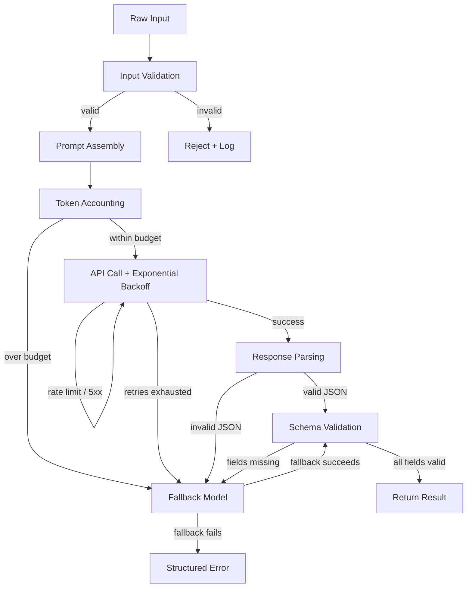

# Building a Complete LLM Pipeline

## Learning Objectives

- Implement a multi-stage LLM pipeline that handles input validation, prompt assembly, token accounting, API retry with exponential backoff, JSON parsing, schema validation, and fallback routing as discrete decision points.
- Trace execution through every pipeline stage by emitting structured state at each step, so silent failures become visible failures.
- Build a fallback chain that degrades to a cheaper or smaller model when the primary call fails, and validate that the fallback output meets the same schema contract.
- Compare the pipeline architecture to a GTM enrichment waterfall, identifying where schema validation and graceful degradation map to production data enrichment workflows.

## The Problem

You have made single API calls that work. A prompt goes in, a response comes out, you parse the result, and the notebook looks great. Then you run the same call against a thousand inputs at 3 AM and three things happen: the API rate-limits you after twenty requests, the model occasionally returns prose instead of JSON, and the token cost is triple what you budgeted because one input was nine thousand characters longer than expected. The notebook has no answer for any of this.

A single API call is a function. A production LLM pipeline is a state machine. Each stage — input validation, prompt assembly, token accounting, the API call itself, response parsing, schema validation, fallback routing — is a decision point where the pipeline can succeed, retry, degrade, or fail explicitly. Skip a stage and you get silent failures: the model returns a valid string that is not valid JSON, your downstream code crashes on a key that does not exist, and you discover it three days later when a sales rep asks why half the enriched accounts have blank industry fields.

The difference between a demo and a system that runs unattended is not the model. It is the pipeline around the model. The model is one stage. The pipeline is the other six.

## The Concept

Every production LLM call passes through the same sequence of stages regardless of the application. Raw input arrives — a company description, a support ticket, a LinkedIn bio — and the pipeline must first validate that input is non-empty, within length limits, and does not contain content the API will reject. Then the pipeline assembles a prompt by combining the input with instructions, context, and an output schema specification. Token accounting runs before the call, not after, because you need to refuse inputs that would blow the context window or the budget before you spend money on them.

The API call itself needs retry logic with exponential backoff because rate limits and transient server errors are normal operating conditions, not exceptions. Once the response returns, the pipeline must extract structured data from whatever the model produced — including handling markdown code fences, trailing explanations, and partial JSON. Schema validation checks that every required field exists and has the correct type. If any stage fails past the retry threshold, the fallback router either retries with a different model or returns a structured error that downstream code can handle.



This sequence maps directly to what GTM teams call an enrichment waterfall. In a waterfall, you try data source A, and if it returns garbage or nothing, you fall through to source B, then source C. Each hop validates the output against the fields you actually need. The LLM pipeline is the same architecture — the "data sources" are model calls with different models or prompt configurations, and the validation gate is the schema check.

## Build It

The pipeline below implements all seven stages as a single class. Each stage prints its state so you can trace execution from input to output. The API call uses exponential backoff on rate-limit and server errors. Response parsing handles markdown fences and trailing text. Schema validation checks required fields and types. The fallback chain tries a smaller model if the primary call fails after all retries.

```python
import anthropic
import json
import time
from dataclasses import dataclass, field
from typing import Optional

TYPE_MAP = {"str": str, "int": int, "float": float, "bool": bool, "list": list, "dict": dict}

@dataclass
class PipelineResult:
    raw_input: str
    model_used: str
    tokens_consumed: int
    retries: int
    fallback_triggered: bool
    stage_completed: str
    output: Optional[dict] = None
    error: Optional[str] = None

class LLMPipeline:
    def __init__(
        self,
        primary_model="claude-sonnet-4-5-20250514",
        fallback_model="claude-3-5-haiku-20241022",
        max_retries=3,
        max_output_tokens=1024,
        session_budget_tokens=500_000,
    ):
        self.primary_model = primary_model
        self.fallback_model = fallback_model
        self.max_retries = max_retries
        self.max_output_tokens = max_output_tokens
        self.session_budget_tokens = session_budget_tokens
        self.tokens_spent_this_session = 0
        self.client = anthropic.Anthropic()

    def _validate_input(self, text):
        if not text or not text.strip():
            raise ValueError("Input is empty after stripping whitespace")
        if len(text) > 50_000:
            raise ValueError(f"Input is {len(text)} chars, exceeds 50,000 char limit")
        return text.strip()

    def _build_prompt(self, text, schema):
        schema_json = json.dumps(schema, indent=2)
        return (
            f"You are a data extraction system. Analyze the input and return a JSON object "
            f"matching this schema exactly:\n\n{schema_json}\n\n"
            f"Input:\n{text}\n\n"
            f"Return ONLY the JSON object. No markdown fences, no explanation, no preamble."
        )

    def _estimate_tokens(self, text):
        return max(1, len(text) // 4)

    def _call_with_retry(self, prompt, model):
        delay = 1
        attempts = 0
        for attempt in range(self.max_retries):
            attempts += 1
            try:
                response = self.client.messages.create(
                    model=model,
                    max_tokens=self.max_output_tokens,
                    messages=[{"role": "user", "content": prompt}],
                )
                tokens = response.usage.input_tokens + response.usage.output_tokens
                return response, tokens, attempts - 1
            except anthropic.RateLimitError:
                print(f"    [retry] Rate limited on {model}, backing off {delay}s (attempt {attempt + 1}/{self.max_retries})")
                time.sleep(delay)
                delay *= 2
            except anthropic.APIStatusError as e:
                print(f"    [retry] API error {e.status_code} on {model}, backing off {delay}s (attempt {attempt + 1}/{self.max_retries})")
                time.sleep(delay)
                delay *= 2
        return None, 0, attempts

    def _parse_json(self, response):
        text = response.content[0].text.strip()
        if text.startswith("```"):
            lines = text.split("\n")
            text = "\n".join(lines[1:])
            if text.rstrip().endswith("```"):
                text = text.rstrip()[:-3]
        start = text.find("{")
        end = text.rfind("}")
        if start == -1 or end == -1:
            raise ValueError(f"No JSON object found in response: {text[:200]}")
        return json.loads(text[start:end + 1])

    def _validate_schema(self, data, schema):
        for field_name, expected_type_str in schema.items():
            if field_name not in data:
                raise ValueError(f"Missing required field: {field_name}")
            expected_type = TYPE_MAP.get(expected_type_str)
            if expected_type is None:
                raise ValueError(f"Unknown schema type: {expected_type_str}")
            if not isinstance(data[field_name], expected_type):
                actual = type(data[field_name]).__name__
                raise ValueError(f"Field '{field_name}': expected {expected_type_str}, got {actual}")
        return True

    def _run_single(self, text, schema, model):
        prompt = self._build_prompt(text, schema)
        est_input = self._estimate_tokens(prompt)
        if self.tokens_spent_this_session + est_input + self.max_output_tokens > self.session_budget_tokens:
            raise RuntimeError(
                f"Session budget exhausted: {self.tokens_spent_this_session} spent, "
                f"~{est_input + self.max_output_tokens} needed, {self.session_budget_tokens} budget"
            )
        response, tokens, retries = self._call_with_retry(prompt, model)
        if response is None:
            return None, tokens, retries
        data = self._parse_json(response)
        self._validate_schema(data, schema)
        return data, tokens, retries

    def run(self, raw_input, schema):
        result = PipelineResult(
            raw_input=raw_input,
            model_used=self.primary_model,
            tokens_consumed=0,
            retries=0,
            fallback_triggered=False,
            stage_completed="init",
        )

        print("[1/7] Input validation")
        try:
            text = self._validate_input(raw_input)
        except ValueError as e:
            result.error = str(e)
            result.stage_completed = "validation_failed"
            print(f"      REJECTED: {e}")
            return result
        print(f"      OK — {len(text)} chars")

        print("[2/7] Prompt assembly")
        prompt = self._build_prompt(text, schema)
        print(f"      OK — {len(prompt)} chars")

        print("[3/7] Token accounting")
        est = self._estimate_tokens(prompt)
        print(f"      Estimated input: ~{est} tokens, max output: {self.max_output_tokens}")

        print(f"[4/7] API call ({self.primary_model})")
        try:
            data, tokens, retries = self._run_single(text, schema, self.primary_model)
            result.tokens_consumed = tokens
            result.retries = retries
            self.tokens_spent_this_session += tokens
        except (ValueError, RuntimeError, json.JSONDecodeError) as e:
            data = None
            result.error = str(e)
            print(f"      FAILED: {e}")

        if data is not None:
            result.output = data
            result.stage_completed = "complete"
            print(f"      OK — {tokens} tokens consumed, {retries} retries")
            print("[5/7] Response parsing: OK")
            print("[6/7] Schema validation: OK")
            print("[7/7] Pipeline complete")
            return result

        print(f"[5/7] Fallback triggered — trying {self.fallback_model}")
        result.fallback_triggered = True
        result.model_used = self.fallback_model
        try:
            prompt_fb = self._build_prompt(text, schema)
            response, tokens_fb, retries_fb = self._call_with_retry(prompt_fb, self.fallback_model)
            if response is None:
                result.stage_completed = "fallback_failed"
                print("      Fallback exhausted retries")
                return result
            data_fb = self._parse_json(response)
            self._validate_schema(data_fb, schema)
            result.output = data_fb
            result.tokens_consumed += tokens_fb
            result.retries += retries_fb
            self.tokens_spent_this_session += tokens_fb
            result.error = None
            result.stage_completed = "complete_via_fallback"
            print(f"      OK — fallback succeeded, {tokens_fb} additional tokens")
            print("[6/7] Schema validation on fallback: OK")
            print("[7/7] Pipeline complete (via fallback)")
        except (ValueError, json.JSONDecodeError) as e:
            result.error = f"Primary: {result.error} | Fallback: {e}"
            result.stage_completed = "all_stages_failed"
            print(f"      Fallback also failed: {e}")

        return result


SCHEMA = {
    "company_name": "str",
    "industry": "str",
    "estimated_employees": "int",
    "summary": "str",
}

pipeline = LLMPipeline(
    primary_model="claude-sonnet-4-5-20250514",
    fallback_model="claude-3-5-haiku-20241022",
    max_retries=3,
    session_budget_tokens=500_000,
)

result = pipeline.run(
    "Acme Robotics builds autonomous warehouse robots for logistics companies. "
    "They have around 340 employees and are headquartered in Austin, TX. "
    "Their robots handle pallet moving, shelf scanning, and inventory cycle counts.",
    SCHEMA,
)

print("\n" + "=" * 60)
print(f"Model used:        {result.model_used}")
print(f"Tokens consumed:   {result.tokens_consumed}")
print(f"Retries:           {result.retries}")
print(f"Fallback used:     {result.fallback_triggered}")
print(f"Final stage:       {result.stage_completed}")
if result.output:
    print(f"Output:\n{json.dumps(result.output, indent=2)}")
if result.error:
    print(f"Error: {result.error}")
print(f"\nSession total tokens spent: {pipeline.tokens_spent_this_session}")
```

## Use It

Schema-validated LLM extraction with a model fallback chain is the exact mechanism behind a GTM enrichment waterfall — try the high-quality source, validate the output against a schema contract, and fall through to a cheaper source if the output fails validation rather than returning a fabricated field.

[CITATION NEEDED — concept: Clay enrichment waterfall internal architecture]

This is **Cluster 1.2 — TAM Refinement & ICP Scoring**. The pipeline you built is what runs inside an enrichment platform when it processes a list of 500 target accounts: each account description goes through input validation, prompt assembly, token budgeting, the API call, parsing, schema checking, and fallback — all before a single field lands in your CRM.

```python
CRM_SCHEMA = {
    "company_name": "str",
    "industry": "str",
    "employee_band": "str",
    "icp_fit_score": "float",
    "tech_stack": "list",
}

targets = [
    "Stripe — payments infrastructure company, ~8000 employees, uses TypeScript, Ruby, Go, and internal tools.",
    "Notion — productivity and note-taking software, ~600 employees, uses React, TypeScript, Node.js, PostgreSQL.",
    "Linear — issue tracking and project management, ~120 employees, uses GraphQL, TypeScript, Rust.",
]

print(f"Enriching {len(targets)} accounts...\n")
for i, desc in enumerate(targets, 1):
    print(f"--- Account {i}/{len(targets)} ---")
    r = pipeline.run(desc, CRM_SCHEMA)
    if r.output:
        print(f"  → {r.output['company_name']} | ICP fit: {r.output['icp_fit_score']} | via {r.model_used}")
    else:
        print(f"  → FAILED at {r.stage_completed}: {r.error}")

print(f"\nSession total: {pipeline.tokens_spent_this_session} tokens across {len(targets)} accounts")
```

Each account either returns five validated CRM fields or a structured error with the stage that failed. No silent blank fields. No prose where JSON should be. When the primary model fails — rate limit, malformed JSON, missing field — the fallback model gets the same input and the same schema contract. If both fail, the `PipelineResult` carries the error string and the stage name so you can build a review queue instead of losing the record.

This is the same pattern you would build in Clay when you stack enrichment columns: LLM extraction as the first provider, a cheaper model or a different prompt as the second, a null-return as the terminal state. The difference is that here you own every stage, you see every retry, and you control the schema contract.

## Exercises

**Exercise 1 — Cost tracking (medium).** Add a `PRICING` dictionary to the `LLMPipeline` class that maps each model name to its per-million-token input and output rates. Modify `_call_with_retry` to return the cost alongside tokens, and add a `session_cost_usd` accumulator to the class. After each `run()` call, print the cost. After all runs, refuse new calls if `session_cost_usd` exceeds a `session_budget_usd` threshold set in `__init__`. Verify by running the pipeline five times and checking that the sixth call raises a `RuntimeError` when you set the budget to $0.01.

**Exercise 2 — Three-tier fallback with dead-letter queue (hard).** Extend the fallback chain to a third tier: if both `primary_model` and `fallback_model` fail, write the raw input, the schema, and both error messages to a JSONL file called `dead_letter.jsonl` with a UUID and timestamp. Then add a `replay()` method that reads `dead_letter.jsonl`, re-runs each failed input through the pipeline with a more lenient schema (fewer required fields), and logs which inputs succeed on replay versus which need manual review. Test by intentionally passing inputs that will produce invalid JSON (e.g., descriptions in a language the model struggles with) until the third tier triggers, then run `replay()` and confirm the dead-letter file shrinks.

## Key Terms

- **Pipeline stage** — A discrete decision point in the processing chain (validation, assembly, accounting, API call, parsing, schema check, fallback) where execution can succeed, retry, degrade, or fail with a structured error.
- **Exponential backoff** — A retry strategy that doubles the wait time between consecutive retries (1s, 2s, 4s) to avoid hammering a rate-limited or overloaded API.
- **Schema validation** — A post-parsing check that confirms every required field exists in the model's JSON output and has the correct Python type, rejecting the result if any field is missing or mistyped.
- **Fallback chain** — An ordered list of models (or data sources) that the pipeline tries sequentially when the primary call fails, each subject to the same schema contract as the primary.
- **Enrichment waterfall** — A GTM pattern where multiple data providers are tried in sequence for each record, with the first provider returning valid data winning; functionally identical to the LLM fallback chain.
- **Token accounting** — A pre-call estimate of input and output token costs used to refuse inputs that would exceed the context window or the session budget before money is spent.
- **Structured error** — A `PipelineResult` with a populated `error` field and a `stage_completed` value indicating which stage failed, so downstream code can route failures to a review queue instead of crashing.
- **Dead-letter queue** — A persistence store (file, database table) for inputs that exhausted all fallback tiers, preserving the raw input and error context for manual review or later replay.

## Sources

- Anthropic. (2025). *Messages API — Rate Limits*. Retrieved from https://docs.anthropic.com/en/api/rate-limits
- Anthropic. (2025). *API Errors — Handling Rate Limits and Retries*. Retrieved from https://docs.anthropic.com/en/api/errors
- Anthropic. (2025). *Models — Claude Sonnet 4.5 and Claude 3.5 Haiku*. Retrieved from https://docs.anthropic.com/en/docs/about-claude/models
- JSON Schema Organization. (2024). *JSON Schema Specification*. Retrieved from https://json-schema.org/
- AWS Architecture Blog. (2020). *Exponential Backoff and Jitter*. Retrieved from https://aws.amazon.com/blogs/architecture/exponential-backoff-and-jitter/
- [CITATION NEEDED — concept: Clay enrichment waterfall internal architecture]