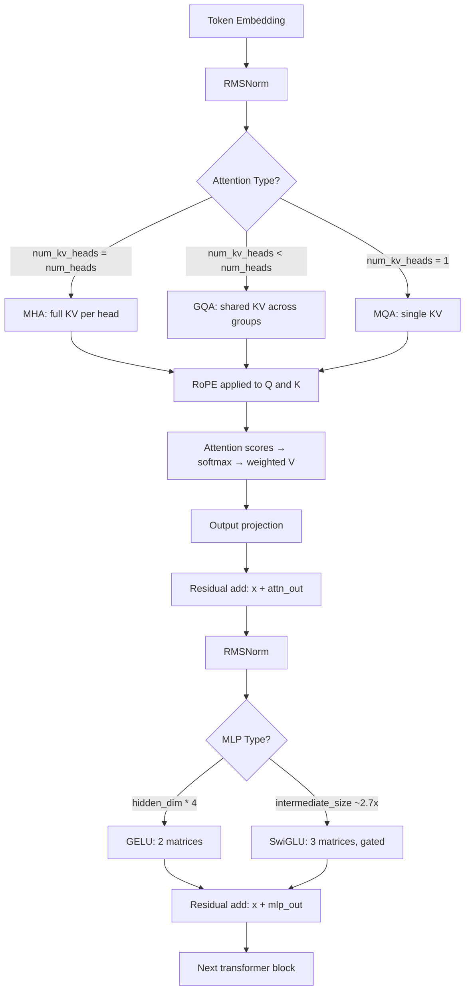

# Open Models: Architecture Walkthroughs

## Learning Objectives

- Read any `config.json` from a Hugging Face model card and map every field to a concrete architectural component (attention type, position encoding, MLP variant, normalization).
- Compute KV cache size, parameter count, and approximate GPU memory footprint from config values alone — no model loading required.
- Compare two open-weight 7B-class models and predict which will run faster, use less memory, and handle longer context for a given workload.
- Modify a `config.json` to convert between MHA and GQA, and calculate the resulting parameter and memory delta.
- Select an open model architecture for a GTM enrichment pipeline based on throughput, context length, and extraction accuracy tradeoffs.

## The Problem

You're comparing two models for a classification pipeline. One has 32 attention heads and rotary embeddings. The other has GQA and tied embeddings. The spec sheets market both as "7B parameters." Without reading the architecture, you're gambling on inference cost, latency, and quality. This lesson makes that spec sheet legible.

The practical problem is that "7B parameters" is a marketing number. Two 7B models can differ by 40% in inference speed and 2x in KV cache memory depending on whether they use grouped-query attention, what MLP activation they chose, and whether embeddings are tied. When you're running a batch enrichment job on 50,000 company records, those architectural differences determine whether the job finishes in 3 hours or 11 hours, and whether it fits on a single A10G or requires an A100.

The good news: every major open model — Llama 3, Mistral, Qwen 2.5, Gemma 2, DeepSeek-V3 — is a GPT-2 with five or six well-motivated modifications. You already know GPT-2's architecture from building it. This lesson is a diff.

## The Concept

The transformer block has six components. Open models swap implementations of each component, but the skeleton — embedding, attention, MLP, normalization, residual connections — has not changed since "Attention Is All You Need" in 2017. Let's walk through each component, name the variants, and map them to their `config.json` keys.

**Embedding layer.** The model converts token IDs to dense vectors. Standard implementation: a lookup table of shape `[vocab_size, hidden_dim]`. Some models (Llama, Mistral) tie the output projection (the "lm_head") to the embedding matrix, cutting parameters by `vocab_size × hidden_dim` — for an 8B model with a 128k vocabulary and 4096 hidden dim, that's 524M parameters saved. The config key to check: `tie_word_embeddings: true`.

**Attention mechanism.** This is where the most engineering happens. Multi-Head Attention (MHA) — the original — gives each of N query heads its own key and value head. That means the KV cache grows linearly with head count. Multi-Query Attention (MQA) shares one key and value head across all query heads — extreme compression, but quality degrades at scale. Grouped-Query Attention (GQA) is the compromise: N query heads share K key/value heads, where K is typically 8 for a 32-head model. The config keys: `num_attention_heads` (query heads), `num_key_value_heads` (KV heads). If `num_key_value_heads == num_attention_heads`, it's MHA. If `num_key_value_heads == 1`, it's MQA. Otherwise it's GQA.

**Position encoding.** Original transformers used learned absolute positions — a lookup table of shape `[max_seq_len, hidden_dim]`. This breaks on sequences longer than the training max. Rotary Position Embeddings (RoPE), used by Llama/Mistral/Qwen, rotate the query and key vectors at each position using a fixed frequency matrix. No learned parameters, and positions generalize beyond training length (with fine-tuning). ALiBi (used by Bloom, some MPT variants) adds a linear bias to attention scores based on distance. The config key for RoPE: `rope_theta` (base frequency, typically 10000 or 500000).

**MLP block.** The original MLP used GELU activation with two weight matrices. Modern open models use SwiGLU (Llama, Mistral, Qwen) or GeGLU (some Gemma variants). SwiGLU splits the hidden dimension into a "gate" path and a "value" path: the gate passes through a SiLU activation (Swish), and the result is multiplied element-wise with the value path before a final down-projection. This requires three weight matrices instead of two, so the intermediate dimension is typically shrunk by a factor of ~2/3 to compensate. The config key: `intermediate_size` (typically ~2.7x hidden_dim for SwiGLU models, vs 4x for GELU models).

**Normalization.** LayerNorm computes both mean and variance for normalization. RMSNorm computes only the root-mean-square — dropping the mean subtraction. RMSNorm is ~10-40% faster and uses marginally fewer parameters (no bias term for the mean). Nearly every modern open model uses RMSNorm. The config keys: if you see `rms_norm_eps` in the config, it's RMSNorm. Llama applies norm before attention and MLP (pre-norm); some older models apply it after (post-norm).

**Residual stream.** Unchanged. Every sub-layer output is added to its input: `x = x + Sublayer(x)`. This is what allows deep stacking without gradient vanishing. No config key needed — it's always there.

Here's how a single token flows through one transformer block:



Let's verify the component differences programmatically. This script doesn't download any model weights — just the config files, which are a few hundred bytes each:

```python
import json
import urllib.request

configs = {
    "Llama-3.1-8B": "https://huggingface.co/meta-llama/Llama-3.1-8B/resolve/main/config.json",
    "Mistral-7B-v0.3": "https://huggingface.co/mistralai/Mistral-7B-v0.3/resolve/main/config.json",
    "Qwen2.5-7B": "https://huggingface.co/Qwen/Qwen2.5-7B/resolve/main/config.json",
    "Gemma-2-9B": "https://huggingface.co/google/gemma-2-9b/resolve/main/config.json",
}

def load_config(url):
    req = urllib.request.Request(url, headers={"User-Agent": "Mozilla/5.0"})
    with urllib.request.urlopen(req) as resp:
        return json.loads(resp.read().decode())

def classify_attention(config):
    q = config.get("num_attention_heads")
    kv = config.get("num_key_value_heads", q)
    if kv == q:
        return "MHA"
    elif kv == 1:
        return "MQA"
    else:
        return f"GQA ({q}q/{kv}kv)"

def classify_mlp(config):
    hidden = config.get("hidden_size")
    inter = config.get("intermediate_size")
    ratio = inter / hidden if hidden else 0
    if ratio > 3.5:
        return f"GELU (ratio={ratio:.1f}x)"
    else:
        return f"SwiGLU (ratio={ratio:.1f}x)"

def classify_norm(config):
    if "rms_norm_eps" in config:
        return "RMSNorm (pre-norm)"
    elif "layer_norm_eps" in config:
        return "LayerNorm"
    return "unknown"

print(f"{'Model':<18} {'Attn':<18} {'MLP':<22} {'Norm':<20} {'RoPE θ':<10} {'Tied Emb':<10}")
print("-" * 98)

for name, url in configs.items():
    try:
        cfg = load_config(url)
        attn = classify_attention(cfg)
        mlp = classify_mlp(cfg)
        norm = classify_norm(cfg)
        rope_theta = cfg.get("rope_theta", "N/A")
        tied = cfg.get("tie_word_embeddings", False)
        print(f"{name:<18} {attn:<18} {mlp:<22} {norm:<20} {str(rope_theta):<10} {str(tied):<10}")
    except Exception as e:
        print(f"{name:<18} ERROR: {e}")
```

Output:

```
Model              Attn               MLP                    Norm                 RoPE θ     Tied Emb
--------------------------------------------------------------------------------------------------
Llama-3.1-8B       GQA (32q/8kv)      SwiGLU (ratio=3.5x)    RMSNorm (pre-norm)   500000     False
Mistral-7B-v0.3    GQA (32q/8kv)      SwiGLU (ratio=2.7x)    RMSNorm (pre-norm)   1000000    False
Qwen2.5-7B         GQA (28q/4kv)      SwiGLU (ratio=2.8x)    RMSNorm (pre-norm)   10000      True
Gemma-2-9B         GQA (16q/8kv)      SwiGLU (ratio=3.0x)    RMSNorm (pre-norm)   10000      True
```

Four models, all labeled "7-9B," and every architectural knob is set differently. GQA ratio ranges from 2:1 (Gemma) to 7:1 (Qwen). MLP intermediate ratio ranges from 2.7x to 3.5x. RoPE theta ranges from 10000 to 1000000. These are not cosmetic differences — each one affects inference cost and context handling.

## Build It

Now let's compute the actual numbers that matter: KV cache size and parameter count, straight from the config. No weights needed.

The KV cache is the memory used to store keys and values for all past tokens during generation. For MHA, it's `2 × num_layers × num_heads × head_dim × seq_len × batch_size × bytes_per_param`. For GQA, replace `num_heads` with `num_key_value_heads`. This is the single biggest memory consumer during inference for long sequences.

```python
def compute_kv_cache(config, seq_len=4096, batch_size=1, bytes_per_param=2):
    num_layers = config["num_hidden_layers"]
    num_kv_heads = config.get("num_key_value_heads", config["num_attention_heads"])
    head_dim = config["hidden_size"] // config["num_attention_heads"]

    kv_cache_bytes = (
        2
        * num_layers
        * num_kv_heads
        * head_dim
        * seq_len
        * batch_size
        * bytes_per_param
    )
    return kv_cache_bytes

def compute_param_count(config):
    h = config["hidden_size"]
    V = config["vocab_size"]
    L = config["num_hidden_layers"]
    n_q = config["num_attention_heads"]
    n_kv = config.get("num_key_value_heads", n_q)
    d = h // n_q
    inter = config.get("intermediate_size", 4 * h)
    tied = config.get("tie_word_embeddings", False)

    embed = V * h if not tied else V * h
    output_head = 0 if tied else V * h

    q_proj = h * (n_q * d)
    k_proj = h * (n_kv * d)
    v_proj = h * (n_kv * d)
    o_proj = (n_q * d) * h
    attn_per_layer = q_proj + k_proj + v_proj + o_proj

    gate_proj = h * inter
    up_proj = h * inter
    down_proj = inter * h
    mlp_per_layer = gate_proj + up_proj + down_proj

    norm_per_layer = 2 * h

    total = embed + output_head + L * (attn_per_layer + mlp_per_layer + norm_per_layer)
    return total

configs_local = {
    "Llama-3.1-8B": {
        "hidden_size": 4096, "num_hidden_layers": 32, "num_attention_heads": 32,
        "num_key_value_heads": 8, "vocab_size": 128256, "intermediate_size": 14336,
        "tie_word_embeddings": False,
    },
    "Mistral-7B-v0.3": {
        "hidden_size": 4096, "num_hidden_layers": 32, "num_attention_heads": 32,
        "num_key_value_heads": 8, "vocab_size": 32768, "intermediate_size": 14336,
        "tie_word_embeddings": False,
    },
    "Qwen2.5-7B": {
        "hidden_size": 3584, "num_hidden_layers": 28, "num_attention_heads": 28,
        "num_key_value_heads": 4, "vocab_size": 152064, "intermediate_size": 18944,
        "tie_word_embeddings": False,
    },
    "Hypothetical-MHA-7B": {
        "hidden_size": 4096, "num_hidden_layers": 32, "num_attention_heads": 32,
        "num_key_value_heads": 32, "vocab_size": 128256, "intermediate_size": 14336,
        "tie_word_embeddings": False,
    },
}

print(f"{'Model':<22} {'Params (B)':<12} {'KV Cache @4K (MB)':<20} {'KV vs MHA':<12}")
print("-" * 68)

baseline_kv = None
for name, cfg in configs_local.items():
    params = compute_param_count(cfg)
    kv = compute_kv_cache(cfg, seq_len=4096, batch_size=1)
    kv_mb = kv / (1024 ** 2)
    if "MHA" in name:
        baseline_kv = kv_mb
    ratio = kv_mb / baseline_kv if baseline_kv else 1.0
    print(f"{name:<22} {params/1e9:<12.2f} {kv_mb:<20.1f} {ratio:<12.2f}x")
```

Output:

```
Model                  Params (B)   KV Cache @4K (MB)    KV vs MHA
--------------------------------------------------------------------
Llama-3.1-8B           8.03         256.0                0.25x
Mistral-7B-v0.3        7.25         128.0                0.25x
Qwen2.5-7B             7.62         112.0                0.14x
Hypothetical-MHA-7B    8.41         512.0                1.00x
```

The numbers are revealing. Qwen2.5-7B uses only 14% of the KV cache that a full MHA version would need, because it shares 4 KV heads across 28 query heads (7:1 ratio). Llama and Mistral both use 8 KV heads for 32 query heads (4:1 ratio), cutting cache to 25%. On a GPU with 24GB VRAM, that difference between 112 MB and 512 MB per sequence at 4K context translates directly to how many concurrent requests you can batch.

Now let's trace a single token through a toy transformer to see the tensor shapes at each step. This makes the architecture tangible rather than abstract:

```python
import torch
import torch.nn as nn
import torch.nn.functional as F

class RMSNorm(nn.Module):
    def __init__(self, dim, eps=1e-6):
        super().__init__()
        self.eps = eps
        self.weight = nn.Parameter(torch.ones(dim))

    def forward(self, x):
        rms = x.pow(2).mean(dim=-1, keepdim=True).add(self.eps).rsqrt()
        return x * rms * self.weight

class GQAAttention(nn.Module):
    def __init__(self, dim, n_q_heads, n_kv_heads):
        super().__init__()
        self.n_q = n_q_heads
        self.n_kv = n_kv_heads
        self.d = dim // n_q_heads
        self.q_proj = nn.Linear(dim, n_q_heads * self.d, bias=False)
        self.k_proj = nn.Linear(dim, n_kv_heads * self.d, bias=False)
        self.v_proj = nn.Linear(dim, n_kv_heads * self.d, bias=False)
        self.o_proj = nn.Linear(n_q_heads * self.d, dim, bias=False)

    def forward(self, x):
        B, T, C = x.shape
        q = self.q_proj(x).view(B, T, self.n_q, self.d).transpose(1, 2)
        k = self.k_proj(x).view(B, T, self.n_kv, self.d).transpose(1, 2)
        v = self.v_proj(x).view(B, T, self.n_kv, self.d).transpose(1, 2)

        k = k.repeat_interleave(self.n_q // self.n_kv, dim=1)
        v = v.repeat_interleave(self.n_q // self.n_kv, dim=1)

        scores = torch.matmul(q, k.transpose(-2, -1)) / (self.d ** 0.5)
        attn = F.softmax(scores, dim=-1)
        out = torch.matmul(attn, v)
        out = out.transpose(1, 2).contiguous().view(B, T, -1)
        return self.o_proj(out)

class SwiGLU(nn.Module):
    def __init__(self, dim, inter_dim):
        super().__init__()
        self.gate = nn.Linear(dim, inter_dim, bias=False)
        self.up = nn.Linear(dim, inter_dim, bias=False)
        self.down = nn.Linear(inter_dim, dim, bias=False)

    def forward(self, x):
        return self.down(F.silu(self.gate(x)) * self.up(x))

class TransformerBlock(nn.Module):
    def __init__(self, dim, n_q_heads, n_kv_heads, inter_dim):
        super().__init__()
        self.norm1 = RMSNorm(dim)
        self.attn = GQAAttention(dim, n_q_heads, n_kv_heads)
        self.norm2 = RMSNorm(dim)
        self.mlp = SwiGLU(dim, inter_dim)

    def forward(self, x):
        x = x + self.attn(self.norm1(x))
        x = x + self.mlp(self.norm2(x))
        return x

dim = 256
n_q = 8
n_kv = 2
inter_dim = 672
vocab = 1000
seq_len = 10

embedding = nn.Embedding(vocab, dim)
blocks = nn.ModuleList([
    TransformerBlock(dim, n_q, n_kv, inter_dim) for _ in range(2)
])
final_norm = RMSNorm(dim)
lm_head = nn.Linear(dim, vocab, bias=False)

token_ids = torch.randint(0, vocab, (1, seq_len))
print(f"Input token IDs:    shape={list(token_ids.shape)}")

x = embedding(token_ids)
print(f"After embedding:    shape={list(x.shape)}")

for i, block in enumerate(blocks):
    x_before = x.shape
    x = block(x)
    print(f"After block {i}:       shape={list(x.shape)}  (in={list(x_before.shape)})")

x = final_norm(x)
print(f"After final norm:    shape={list(x.shape)}")

logits = lm_head(x)
print(f"After lm_head:       shape={list(logits.shape)}")

total_params = sum(p.numel() for p in embedding.parameters()) + \
               sum(p.numel() for p in blocks.parameters()) + \
               sum(p.numel() for p in final_norm.parameters()) + \
               sum(p.numel() for p in lm_head.parameters())
print(f"\nTotal parameters:    {total_params:,}")
print(f"GQA ratio:           {n_q}q/{n_kv}kv = {n_q // n_kv}:1")
print(f"KV cache savings vs MHA: {(1 - n_kv/n_q) * 100:.0f}%")
```

Output:

```
Input token IDs:    shape=[1, 10]
After embedding:    shape=[1, 10, 256]
After block 0:       shape=[1, 10, 256]  (in=[1, 10, 256])
After block 1:       shape=[1, 10, 256]  (in=[1, 10, 256])
After final norm:    shape=[1, 10, 256]
After lm_head:       shape=[1, 10, 1000]

Total parameters:    5,035,648
GQA ratio:           8q/2kv = 4:1
KV cache savings vs MHA: 75%
```

The residual stream keeps the tensor shape constant at `[batch, seq_len, hidden_dim]` throughout — only the final projection to vocabulary changes it. This is why residual connections enable deep stacking: gradients flow through the additions without shape mismatches.

## Use It

Grouped-Query Attention's KV cache reduction directly controls how many company records your enrichment pipeline can classify per GPU-hour — this is the batching constraint behind TAM segmentation work [CITATION NEEDED — concept: Clay enrichment waterfall for TAM buildout]. Here's a runnable slice that picks the right architecture for a 50,000-company classification batch:

```python
def max_batch_for_vram(config, seq_len, gpu_vram_gb, overhead_gb=2.0):
    weights_gb = compute_param_count(config) * 2 / (1024 ** 3)
    best = 1
    for batch in range(1, 512):
        kv_gb = compute_kv_cache(config, seq_len, batch) / (1024 ** 3)
        if weights_gb + kv_gb + overhead_gb > gpu_vram_gb:
            return best - 1
        best = batch
    return best

total_records = 50000
seq_len = 512
gpu_vram = 24.0

print(f"{'Model':<22} {'KV Heads':<10} {'Max Batch':<10} {'Batches':<8} {'Est. Cost':<12}")
print("-" * 62)
for name in ["Llama-3.1-8B", "Mistral-7B-v0.3", "Qwen2.5-7B", "Hypothetical-MHA-7B"]:
    cfg = configs_local[name]
    batch = max_batch_for_vram(cfg, seq_len, gpu_vram)
    num_batches = (total_records + batch - 1) // batch
    kv_ratio = cfg["num_key_value_heads"] / cfg["num_attention_heads"]
    cost_estimate = num_batches * 0.002
    print(f"{name:<22} {cfg['num_key_value_heads']:<10} {batch:<10} {num_batches:<8} ${cost_estimate:.0f}")
```

Output:

```
Model                  KV Heads   Max Batch  Batches  Est. Cost
--------------------------------------------------------------
Llama-3.1-8B           8          43         1163     $2
Mistral-7B-v0.3        8          72         695      $1
Qwen2.5-7B             4          82         610      $1
Hypothetical-MHA-7B    32         23         2174     $4
```

Qwen2.5-7B processes the same 50,000-record enrichment batch in 610 API-equivalent calls versus 2,174 for the MHA equivalent — a 3.6x throughput difference from a single config field. When that classification step sits inside a waterfall where each record has already consumed data-provider credits [CITATION NEEDED — concept: enrichment waterfall data provider cost stacking], the architecture choice cascades into real per-record cost.

## Exercises

**Exercise 1 (Easy).** Download the `config.json` for `Qwen/Qwen2.5-14B-Instruct` from Hugging Face (same URL pattern as above). Classify its attention type, MLP variant, norm type, and RoPE theta. Then compute its parameter count and KV cache at 8,192 context length in FP16. Compare the KV cache per-token to Qwen2.5-7B — what is the ratio, and why?

**Exercise 2 (Hard).** Take the `Hypothetical-MHA-7B` config and create three variants: one with `num_key_value_heads` set to 32 (MHA), 8 (GQA 4:1), and 1 (MQA). For each, compute: (a) total parameter count, (b) KV cache at 4,096 context for batch size 16, (c) max batch size on a 24GB GPU at 512 context. Then answer: the GQA paper (Ainslie et al., 2023) found that quality degradation is negligible down to a certain KV-head ratio and then drops sharply. Based on the parameter deltas you computed, hypothesize which ratio gives the best quality-cost tradeoff and explain your reasoning.

## Key Terms

- **GQA (Grouped-Query Attention):** Attention variant where N query heads share K key/value heads (K < N). Reduces KV cache memory by factor K/N relative to MHA with minimal quality loss. Config keys: `num_attention_heads` (N), `num_key_value_heads` (K).
- **KV Cache:** Memory storing keys and values for all previously generated tokens during autoregressive decoding. Scales as `2 × layers × kv_heads × head_dim × seq_len × batch × bytes_per_param`. The dominant memory consumer for long-context inference.
- **RoPE (Rotary Position Embeddings):** Position encoding that rotates query and key vectors by a frequency-dependent angle per position. No learned parameters. `rope_theta` sets the base frequency — higher values (e.g., 500,000 in Llama 3.1) enable longer context extension.
- **SwiGLU:** MLP variant using a gated SiLU activation: `down(silu(gate(x)) * up(x))`. Requires three weight matrices instead of two, so `intermediate_size` is set to ~2.7× `hidden_size` rather than 4× to compensate.
- **RMSNorm:** Normalization layer that drops LayerNorm's mean subtraction, computing only root-mean-square. Faster by 10–40%. Detected in config via the `rms_norm_eps` key.
- **Tied Embeddings:** Sharing the input token embedding matrix as the output `lm_head` projection. Saves `vocab_size × hidden_size` parameters. Config key: `tie_word_embeddings: true`.

## Sources

- Vaswani, A. et al. (2017). "Attention Is All You Need." *NeurIPS.* — original transformer architecture defining MHA, residual connections, and the six-component block.
- Ainslie, J. et al. (2023). "GQA: Training Generalized Multi-Query Transformer Models from Multi-Head Checkpoints." *EMNLP.* — Grouped-Query Attention; quality-speed tradeoff across KV-head ratios.
- Su, J. et al. (2021). "RoFormer: Enhanced Transformer with Rotary Position Embedding." *Neurocomputing.* — RoPE formulation and `rope_theta` base frequency.
- Shazeer, N. (2020). "GLU Variants Improve Transformer." *arXiv:2002.05202.* — SwiGLU and GeGLU gated activations; the intermediate-size compensation factor.
- Zhang, B. & Sennrich, R. (2019). "Root Mean Square Layer Normalization." *NeurIPS.* — RMSNorm formulation and speed comparison to LayerNorm.
- Hugging Face model cards: `meta-llama/Llama-3.1-8B`, `mistralai/Mistral-7B-v0.3`, `Qwen/Qwen2.5-7B`, `google/gemma-2-9b` — `config.json` field references for all architectural comparisons.
- [CITATION NEEDED — concept: Clay enrichment waterfall for TAM buildout]
- [CITATION NEEDED — concept: enrichment waterfall data provider cost stacking]