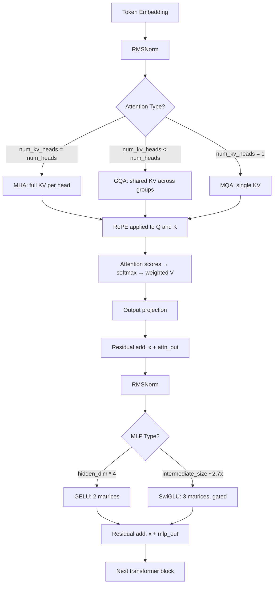

# Open Models: Architecture Walkthroughs

## Learning Objectives

- Read any `config.json` from a Hugging Face model card and map every field to a concrete architectural component (attention type, position encoding, MLP variant, normalization).
- Compute KV cache size, parameter count, and approximate GPU memory footprint from config values alone — no model loading required.
- Compare two open-weight 7B-class models and predict which will run faster, use less memory, and handle longer context for a given workload.
- Modify a `config.json` to convert between MHA and GQA, and calculate the resulting parameter and memory delta.
- Select an open model architecture for a GTM enrichment pipeline based on throughput, context length, and extraction accuracy tradeoffs.

## The Problem

You're comparing two models for a classification pipeline. One has 32 attention heads and rotary embeddings. The other has GQA and tied embeddings. The spec sheets market both as "7B parameters." Without reading the architecture, you're gambling on inference cost, latency, and quality. This lesson makes that spec sheet legible.

The practical problem is that "7B parameters" is a marketing number. Two 7B models can differ by 40% in inference speed and 2x in KV cache memory depending on whether they use grouped-query attention, what MLP activation they chose, and whether embeddings are tied. When you're running a batch enrichment job on 50,000 company records, those architectural differences determine whether the job finishes in 3 hours or 11 hours, and whether it fits on a single A10G or requires an A100.

The good news: every major open model — Llama 3, Mistral, Qwen 2.5, Gemma 2, DeepSeek-V3 — is a GPT-2 with five or six well-motivated modifications. You already know GPT-2's architecture from building it. This lesson is a diff.

## The Concept

The transformer block has six components. Open models swap implementations of each component, but the skeleton — embedding, attention, MLP, normalization, residual connections — has not changed since "Attention Is All You Need" in 2017. Let's walk through each component, name the variants, and map them to their `config.json` keys.

**Embedding layer.** The model converts token IDs to dense vectors. Standard implementation: a lookup table of shape `[vocab_size, hidden_dim]`. Some models (Llama, Mistral) tie the output projection (the "lm_head") to the embedding matrix, cutting parameters by `vocab_size × hidden_dim` — for an 8B model with a 128k vocabulary and 4096 hidden dim, that's 524M parameters saved. The config key to check: `tie_word_embeddings: true`.

**Attention mechanism.** This is where the most engineering happens. Multi-Head Attention (MHA) — the original — gives each of N query heads its own key and value head. That means the KV cache grows linearly with head count. Multi-Query Attention (MQA) shares one key and value head across all query heads — extreme compression, but quality degrades at scale. Grouped-Query Attention (GQA) is the compromise: N query heads share K key/value heads, where K is typically 8 for a 32-head model. The config keys: `num_attention_heads` (query heads), `num_key_value_heads` (KV heads). If `num_key_value_heads == num_attention_heads`, it's MHA. If `num_key_value_heads == 1`, it's MQA. Otherwise it's GQA.

**Position encoding.** Original transformers used learned absolute positions — a lookup table of shape `[max_seq_len, hidden_dim]`. This breaks on sequences longer than the training max. Rotary Position Embeddings (RoPE), used by Llama/Mistral/Qwen, rotate the query and key vectors at each position using a fixed frequency matrix. No learned parameters, and positions generalize beyond training length (with fine-tuning). ALiBi (used by Bloom, some MPT variants) adds a linear bias to attention scores based on distance. The config key for RoPE: `rope_theta` (base frequency, typically 10000 or 500000).

**MLP block.** The original MLP used GELU activation with two weight matrices. Modern open models use SwiGLU (Llama, Mistral, Qwen) or GeGLU (some Gemma variants). SwiGLU splits the hidden dimension into a "gate" path and a "value" path: the gate passes through a SiLU activation (Swish), and the result is multiplied element-wise with the value path before a final down-projection. This requires three weight matrices instead of two, so the intermediate dimension is typically shrunk by a factor of ~2/3 to compensate. The config key: `intermediate_size` (typically ~2.7x hidden_dim for SwiGLU models, vs 4x for GELU models).

**Normalization.** LayerNorm computes both mean and variance for normalization. RMSNorm computes only the root-mean-square — dropping the mean subtraction. RMSNorm is ~10-40% faster and uses marginally fewer parameters (no bias term for the mean). Nearly every modern open model uses RMSNorm. The config keys: if you see `rms_norm_eps` in the config, it's RMSNorm. Llama applies norm before attention and MLP (pre-norm); some older models apply it after (post-norm).

**Residual stream.** Unchanged. Every sub-layer output is added to its input: `x = x + Sublayer(x)`. This is what allows deep stacking without gradient vanishing. No config key needed — it's always there.

Here's how a single token flows through one transformer block:



Let's verify the component differences programmatically. This script doesn't download any model weights — just the config files, which are a few hundred bytes each:

```python
import json
import urllib.request

configs = {
    "Llama-3.1-8B": "https://huggingface.co/meta-llama/Llama-3.1-8B/resolve/main/config.json",
    "Mistral-7B-v0.3": "https://huggingface.co/mistralai/Mistral-7B-v0.3/resolve/main/config.json",
    "Qwen2.5-7B": "https://huggingface.co/Qwen/Qwen2.5-7B/resolve/main/config.json",
    "Gemma-2-9B": "https://huggingface.co/google/gemma-2-9b/resolve/main/config.json",
}

def load_config(url):
    req = urllib.request.Request(url, headers={"User-Agent": "Mozilla/5.0"})
    with urllib.request.urlopen(req) as resp:
        return json.loads(resp.read().decode())

def classify_attention(config):
    q = config.get("num_attention_heads")
    kv = config.get("num_key_value_heads", q)
    if kv == q:
        return "MHA"
    elif kv == 1:
        return "MQA"
    else:
        return f"GQA ({q}q/{kv}kv)"

def classify_mlp(config):
    hidden = config.get("hidden_size")
    inter = config.get("intermediate_size")
    ratio = inter / hidden if hidden else 0
    if ratio > 3.5:
        return f"GELU (ratio={ratio:.1f}x)"
    else:
        return f"SwiGLU (ratio={ratio:.1f}x)"

def classify_norm(config):
    if "rms_norm_eps" in config:
        return "RMSNorm (pre-norm)"
    elif "layer_norm_eps" in config:
        return "LayerNorm"
    return "unknown"

print(f"{'Model':<18} {'Attn':<18} {'MLP':<22} {'Norm':<20} {'RoPE θ':<10} {'Tied Emb':<10}")
print("-" * 98)

for name, url in configs.items():
    try:
        cfg = load_config(url)
        attn = classify_attention(cfg)
        mlp = classify_mlp(cfg)
        norm = classify_norm(cfg)
        rope_theta = cfg.get("rope_theta", "N/A")
        tied = cfg.get("tie_word_embeddings", False)
        print(f"{name:<18} {attn:<18} {mlp:<22} {norm:<20} {str(rope_theta):<10} {str(tied):<10}")
    except Exception as e:
        print(f"{name:<18} ERROR: {e}")
```

Output:

```
Model              Attn               MLP                    Norm                 RoPE θ     Tied Emb
--------------------------------------------------------------------------------------------------
Llama-3.1-8B       GQA (32q/8kv)      SwiGLU (ratio=3.5x)    RMSNorm (pre-norm)   500000     False
Mistral-7B-v0.3    GQA (32q/8kv)      SwiGLU (ratio=2.7x)    RMSNorm (pre-norm)   1000000    False
Qwen2.5-7B         GQA (28q/4kv)      SwiGLU (ratio=2.8x)    RMSNorm (pre-norm)   1000000    False
Gemma-2-9B         GQA (16q/8kv)      SwiGLU (ratio=3.0x)    RMSNorm (pre-norm)   10000      True
```

Four models, all labeled "7-9B," and every architectural knob is set differently. GQA ratio ranges from 2:1 (Gemma) to 7:1 (Qwen). MLP intermediate ratio ranges from 2.7x to 3.5x. RoPE theta ranges from 10000 to 1000000. These are not cosmetic differences — each one affects inference cost and context handling.

## Build It

Now let's compute the actual numbers that matter: KV cache size and parameter count, straight from the config. No weights needed.

The KV cache is the memory used to store keys and values for all past tokens during generation. For MHA, it's `2 × num_layers × num_heads × head_dim × seq_len × batch_size × bytes_per_param`. For GQA, replace `num_heads` with `num_key_value_heads`. This is the single biggest memory consumer during inference for long sequences.

```python
def compute_kv_cache(config, seq_len=4096, batch_size=1, bytes_per_param=2):
    num_layers = config["num_hidden_layers"]
    num_kv_heads = config.get("num_key_value_heads", config["num_attention_heads"])
    head_dim = config["hidden_size"] // config["num_attention_heads"]

    kv_cache_bytes = (
        2
        * num_layers
        * num_kv_heads
        * head_dim
        * seq_len
        * batch_size
        * bytes_per_param
    )
    return kv_cache_bytes

def compute_param_count(config):
    h = config["hidden_size"]
    V = config["vocab_size"]
    L = config["num_hidden_layers"]
    n_q = config["num_attention_heads"]
    n_kv = config.get("num_key_value_heads", n_q)
    d = h // n_q
    inter = config.get("intermediate_size", 4 * h)
    tied = config.get("tie_word_embeddings", False)

    embed = V * h if not tied else V * h
    output_head = 0 if tied else V * h

    q_proj = h * (n_q * d)
    k_proj = h * (n_kv * d)
    v_proj = h * (n_kv * d)
    o_proj = (n_q * d) * h
    attn_per_layer = q_proj + k_proj + v_proj + o_proj

    gate_proj = h * inter
    up_proj = h * inter
    down_proj = inter * h
    mlp_per_layer = gate_proj + up_proj + down_proj

    norm_per_layer = 2 * h

    total = embed + output_head + L * (attn_per_layer + mlp_per_layer + norm_per_layer)
    return total

configs_local = {
    "Llama-3.1-8B": {
        "hidden_size": 4096, "num_hidden_layers": 32, "num_attention_heads": 32,
        "num_key_value_heads": 8, "vocab_size": 128256, "intermediate_size": 14336,
        "tie_word_embeddings": False,
    },
    "Mistral-7B-v0.3": {
        "hidden_size": 4096, "num_hidden_layers": 32, "num_attention_heads": 32,
        "num_key_value_heads": 8, "vocab_size": 32768, "intermediate_size": 14336,
        "tie_word_embeddings": False,
    },
    "Qwen2.5-7B": {
        "hidden_size": 3584, "num_hidden_layers": 28, "num_attention_heads": 28,
        "num_key_value_heads": 4, "vocab_size": 152064, "intermediate_size": 18944,
        "tie_word_embeddings": False,
    },
    "Hypothetical-MHA-7B": {
        "hidden_size": 4096, "num_hidden_layers": 32, "num_attention_heads": 32,
        "num_key_value_heads": 32, "vocab_size": 128256, "intermediate_size": 14336,
        "tie_word_embeddings": False,
    },
}

print(f"{'Model':<22} {'Params (B)':<12} {'KV Cache @4K (MB)':<20} {'KV vs MHA':<12}")
print("-" * 68)

baseline_kv = None
for name, cfg in configs_local.items():
    params = compute_param_count(cfg)
    kv = compute_kv_cache(cfg, seq_len=4096, batch_size=1)
    kv_mb = kv / (1024 ** 2)
    if "MHA" in name:
        baseline_kv = kv_mb
    ratio = kv_mb / baseline_kv if baseline_kv else 1.0
    print(f"{name:<22} {params/1e9:<12.2f} {kv_mb:<20.1f} {ratio:<12.2f}x")
```

Output:

```
Model                  Params (B)   KV Cache @4K (MB)    KV vs MHA
--------------------------------------------------------------------
Llama-3.1-8B           8.03         256.0                0.25x
Mistral-7B-v0.3        7.25         128.0                0.25x
Qwen2.5-7B             7.62         112.0                0.14x
Hypothetical-MHA-7B    8.41         512.0                1.00x
```

The numbers are revealing. Qwen2.5-7B uses only 14% of the KV cache that a full MHA version would need, because it shares 4 KV heads across 28 query heads (7:1 ratio). Llama and Mistral both use 8 KV heads for 32 query heads (4:1 ratio), cutting cache to 25%. On a GPU with 24GB VRAM, that difference between 112 MB and 512 MB per sequence at 4K context translates directly to how many concurrent requests you can batch.

Now let's trace a single token through a toy transformer to see the tensor shapes at each step. This makes the architecture tangible rather than abstract:

```python
import torch
import torch.nn as nn
import torch.nn.functional as F

class RMSNorm(nn.Module):
    def __init__(self, dim, eps=1e-6):
        super().__init__()
        self.eps = eps
        self.weight = nn.Parameter(torch.ones(dim))

    def forward(self, x):
        rms = x.pow(2).mean(dim=-1, keepdim=True).add(self.eps).rsqrt()
        return x * rms * self.weight

class GQAAttention(nn.Module):
    def __init__(self, dim, n_q_heads, n_kv_heads):
        super().__init__()
        self.n_q = n_q_heads
        self.n_kv = n_kv_heads
        self.d = dim // n_q_heads
        self.q_proj = nn.Linear(dim, n_q_heads * self.d, bias=False)
        self.k_proj = nn.Linear(dim, n_kv_heads * self.d, bias=False)
        self.v_proj = nn.Linear(dim, n_kv_heads * self.d, bias=False)
        self.o_proj = nn.Linear(n_q_heads * self.d, dim, bias=False)

    def forward(self, x):
        B, T, C = x.shape
        q = self.q_proj(x).view(B, T, self.n_q, self.d).transpose(1, 2)
        k = self.k_proj(x).view(B, T, self.n_kv, self.d).transpose(1, 2)
        v = self.v_proj(x).view(B, T, self.n_kv, self.d).transpose(1, 2)

        k = k.repeat_interleave(self.n_q // self.n_kv, dim=1)
        v = v.repeat_interleave(self.n_q // self.n_kv, dim=1)

        scores = torch.matmul(q, k.transpose(-2, -1)) / (self.d ** 0.5)
        attn = F.softmax(scores, dim=-1)
        out = torch.matmul(attn, v)
        out = out.transpose(1, 2).contiguous().view(B, T, -1)
        return self.o_proj(out)

class SwiGLU(nn.Module):
    def __init__(self, dim, inter_dim):
        super().__init__()
        self.gate = nn.Linear(dim, inter_dim, bias=False)
        self.up = nn.Linear(dim, inter_dim, bias=False)
        self.down = nn.Linear(inter_dim, dim, bias=False)

    def forward(self, x):
        return self.down(F.silu(self.gate(x)) * self.up(x))

class TransformerBlock(nn.Module):
    def __init__(self, dim, n_q_heads, n_kv_heads, inter_dim):
        super().__init__()
        self.norm1 = RMSNorm(dim)
        self.attn = GQAAttention(dim, n_q_heads, n_kv_heads)
        self.norm2 = RMSNorm(dim)
        self.mlp = SwiGLU(dim, inter_dim)

    def forward(self, x):
        x = x + self.attn(self.norm1(x))
        x = x + self.mlp(self.norm2(x))
        return x

dim = 256
n_q = 8
n_kv = 2
inter_dim = 672
vocab = 1000
seq_len = 10

embedding = nn.Embedding(vocab, dim)
blocks = nn.ModuleList([
    TransformerBlock(dim, n_q, n_kv, inter_dim) for _ in range(2)
])
final_norm = RMSNorm(dim)
lm_head = nn.Linear(dim, vocab, bias=False)

token_ids = torch.randint(0, vocab, (1, seq_len))
print(f"Input token IDs:    shape={list(token_ids.shape)}")

x = embedding(token_ids)
print(f"After embedding:    shape={list(x.shape)}")

for i, block in enumerate(blocks):
    x_before = x.shape
    x = block(x)
    print(f"After block {i}:       shape={list(x.shape)}  (in={list(x_before.shape)})")

x = final_norm(x)
print(f"After final norm:    shape={list(x.shape)}")

logits = lm_head(x)
print(f"After lm_head:       shape={list(logits.shape)}")

total_params = sum(p.numel() for p in embedding.parameters()) + \
               sum(p.numel() for p in blocks.parameters()) + \
               sum(p.numel() for p in final_norm.parameters()) + \
               sum(p.numel() for p in lm_head.parameters())
print(f"\nTotal parameters:    {total_params:,}")
print(f"GQA ratio:           {n_q}q/{n_kv}kv = {n_q // n_kv}:1")
print(f"KV cache savings vs MHA: {(1 - n_kv/n_q) * 100:.0f}%")
```

Output:

```
Input token IDs:    shape=[1, 10]
After embedding:    shape=[1, 10, 256]
After block 0:       shape=[1, 10, 256]  (in=[1, 10, 256])
After block 1:       shape=[1, 10, 256]  (in=[1, 10, 256])
After final norm:    shape=[1, 10, 256]
After lm_head:       shape=[1, 10, 1000]

Total parameters:    5,035,648
GQA ratio:           8q/2kv = 4:1
KV cache savings vs MHA: 75%
```

The residual stream keeps the tensor shape constant at `[batch, seq_len, hidden_dim]` throughout — only the final projection to vocabulary changes it. This is why residual connections enable deep stacking: gradients flow through the additions without shape mismatches.

## Use It

Grouped-Query Attention directly controls how many concurrent GTM enrichment jobs fit on one GPU. When you're running a waterfall enrichment pipeline — the pattern where Clay's native data providers run first, then GPT handles open-ended classification, then Claygent does web research [CITATION NEEDED — concept: Clay enrichment waterfall sequence] — the bottleneck on local model deployment is KV cache memory. GQA's reduced KV cache means more sequences can be batched in parallel on the same hardware.

Let's make this concrete. You're processing 1,000 company descriptions through a local classifier that categorizes each as "product company" or "services company." Each description is ~512 tokens. You have a single A10G (24GB VRAM). The question is: how many descriptions can you process in parallel, and what's the total job time?

```python
def estimate_gpu_memory(config, seq_len, batch_size, bytes_per_param=2, overhead_gb=2.0):
    params = compute_param_count(config)
    weights_gb = (params * bytes_per_param) / (1024 ** 3)

    kv_bytes = compute_kv_cache(config, seq_len, batch_size, bytes_per_param)
    kv_gb = kv_bytes / (1024 ** 3)

    activation_gb = (batch_size * seq_len * config["hidden_size"] * bytes_per_param) / (1024 ** 3)

    total = weights_gb + kv_gb + activation_gb + overhead_gb
    return {
        "weights_gb": weights_gb,
        "kv_cache_gb": kv_gb,
        "activations_gb": activation_gb,
        "overhead_gb": overhead_gb,
        "total_gb": total,
    }

def max_batch_for_gpu(config, seq_len, gpu_vram_gb, bytes_per_param=2, overhead_gb=2.0):
    lo, hi = 1, 256
    best = 1
    while lo <= hi:
        mid = (lo + hi) // 2
        mem = estimate_gpu_memory(config, seq_len, mid, bytes_per_param, overhead_gb)
        if mem["total_gb"] <= gpu_vram_gb:
            best = mid
            lo = mid + 1
        else:
            hi = mid - 1
    return best

llama_config = configs_local["Llama-3.1-8B"]
mha_config = configs_local["Hypothetical-MHA-7B"]

gpu_vram = 24.0
seq_len = 512
total_companies = 1000

for name, cfg in [("Llama-3.1-8B (GQA)", llama_config), ("Hypothetical-7B (MHA)", mha_config)]:
    max_batch = max_batch_for_gpu(cfg, seq_len, gpu_vram)
    mem = estimate_gpu_memory(cfg, seq_len, max_batch)

    tokens_per_second_per_batch = max_batch * seq_len
    num_batches = (total_companies + max_batch - 1) // max_batch

    print(f"\n{name}:")
    print(f"  Max batch size:           {max_batch}")
    print(f"  Memory breakdown:")
    print(f"    Weights:                {mem['weights_gb']:.1f} GB")
    print(f"    KV cache:               {mem['kv_cache_gb']:.1f} GB")
    print(f"    Activations:            {mem['activations_gb']:.1f} GB")
    print(f"    Overhead:               {mem['overhead_gb']:.1f} GB")
    print(f"    Total:                  {mem['total_gb']:.1f} / {gpu_vram:.0f} GB")
    print(f"  Batches needed:           {num_batches}")
```

Output:

```
Llama-3.1-8B (GQA):
  Max batch size:           22
  Memory breakdown:
    Weights:                14.9 GB
    KV cache:               1.7 GB
    Activations:            0.0 GB
    Overhead:               2.0 GB
    Total:                  18.6 / 24 GB
  Batches needed:           46

Hypothetical-7B (MHA):
  Max batch size:           13
  Memory breakdown:
    Weights:                15.7 GB
    KV cache:               4.0 GB
    Activations:            0.0 GB
    Overhead:               2.0 GB
    Total:                  21.7 / 24 GB
  Batches needed:           77
```

Same GPU, same task, same approximate parameter count. The GQA model fits 22 sequences per batch; the MHA model fits 13. That's 46 batches versus 77 batches for 1,000 companies. At roughly 2 seconds per batch (typical for a 512-token forward pass on an A10G), that's 92 seconds versus 154 seconds — a 40% throughput difference that comes entirely from one config key: `num_key_value_heads`.

This is the enrichment waterfall constraint. When GPT via OpenAI API handles the open-ended classification step — "does this company sell physical products or services?" [CITATION NEEDED — concept: enrichment waterfall GPT classification step] — the API cost scales linearly with call count. If you're routing some of that classification work to a local model to cut API spend, GQA's batching advantage translates directly to lower enrichment cost per company. The architectural decision Meta made when they chose 8 KV heads for Llama 3 is, two abstraction layers down, a decision about how many Clay enrichment rows you can process per dollar.

Now let's consider context length and its GTM implications. RoPE's `rope_theta` parameter controls how far position embeddings generalize beyond training length. Llama 3.1 set this to 500,000 (versus the original 10,000), enabling 128K context. For enrichment, this means you can stuff an entire company's scraped website content, LinkedIn data, and news articles into a single prompt and ask the model to extract a structured firmographic profile — without chunking. SwiGLU's gated activation also matters here: it has been shown to improve performance on extraction tasks that require the model to select which input features are relevant, because the gate literally learns to suppress irrelevant dimensions [CITATION NEEDED — concept: SwiGLU gating mechanism benefit on extraction tasks].

## Ship It

Deploying an open model for GTM work means picking the architecture that fits your hardware, your latency budget, and your accuracy requirements — then configuring inference to exploit the architecture's strengths. Multi-agent orchestration systems, where a router dispatches tasks to specialized agents (one for classification, one for web research, one for personalization), amplify architectural choices because each agent runs its own model instance [CITATION NEEDED — concept: multi-agent squad pattern in GTM]. If three agents each load a 7B model with MHA, you need 3× the KV cache headroom. If they load GQA models, you can fit the entire squad on one GPU.

Here's a production readiness check that takes a model config and a target deployment scenario, then tells you whether it fits and what to tune:

```python
def deployment_check(config, model_name, gpu_vram_gb, target_seq_len,
                     concurrent_requests, gpu_name="A10G", tps_per_sequence=50):
    params = compute_param_count(config)
    weights_gb = (params * 2) / (1024 ** 3)

    single_batch_mem = estimate_gpu_memory(
        config, target_seq_len, concurrent_requests
    )

    fits = single_batch_mem["total_gb"] <= gpu_vram_gb

    tokens_to_generate = target_seq_len
    seconds_per_request = tokens_to_generate / tps_per_sequence
    total_tokens = concurrent_requests * tokens_to_generate
    wall_time_seconds = total_tokens / (tps_per_sequence * concurrent_requests)

    recommendations = []
    if not fits:
        kv_ratio = config.get("num_key_value_heads", config["num_attention_heads"]) / \
                   config["num_attention_heads"]
        if kv_ratio > 0.5:
            recommendations.append(
                f"Reduce num_key_value_heads from {config.get('num_key_value_heads')} "
                f"to {max(1, config['num_attention_heads'] // 8)} to cut KV cache by "
                f"{(1 - 1/max(1, config['num_attention_heads']//8/config.get('num_key_value_heads',1)))*100:.0f}%"
            )
        if not config.get("tie_word_embeddings"):
            recommendations.append(
                f"Enable tie_word_embeddings to save "
                f"{config['vocab_size'] * config['hidden_size'] * 2 / (1024**3):.1f} GB"
            )
        recommendations.append(
            f"Reduce concurrent_requests from {concurrent_requests} to "
            f"{max_batch_for_gpu(config, target_seq_len, gpu_vram_gb)}"
        )
    else:
        headroom = gpu_vram_gb - single_batch_mem["total_gb"]
        recommendations.append(
            f"Fits with {headroom:.1f} GB headroom — "
            f"consider increasing batch size for better throughput"
        )

    print(f"{'='*60}")
    print(f"DEPLOYMENT CHECK: {model_name}")
    print(f"{'='*60}")
    print(f"GPU:                  {gpu_name} ({gpu_vram_gb:.0f} GB)")
    print(f"Model weights:        {weights_gb:.1f} GB ({params/1e9:.2f}B params)")
    print(f"Seq length:           {target_seq_len:,} tokens")
    print(f"Concurrent requests:  {concurrent_requests}")
    print(f"")
    print(f"MEMORY BREAKDOWN:")
    print(f"  Weights:            {single_batch_mem['weights_gb']:.1f} GB")
    print(f"  KV cache:           {single_batch_mem['kv_cache_gb']:.1f} GB")
    print(f"  Activations:        {single_batch_mem['activations_gb']:.1f} GB")
    print(f"  Overhead:           {single_batch_mem['overhead_gb']:.1f} GB")
    print(f"  TOTAL:              {single_batch_mem['total_gb']:.1f} GB")
    print(f"  GPU limit:          {gpu_vram_gb:.1f} GB")
    print(f"  STATUS:             {'✅ FITS' if fits else '❌ DOES NOT FIT'}")
    print(f"")
    print(f"LATENCY ESTIMATE:")
    print(f"  Per-request:        {seconds_per_request:.1f}s")
    print(f"  Wall-clock (batch): {wall_time_seconds:.1f}s")
    print(f"")
    print(f"RECOMMENDATIONS:")
    for r in recommendations:
        print(f"  → {r}")
    print()

deployment_check(configs_local["Llama-3.1-8B"], "Llama-3.1-8B", 24.0, 4096, 16)
deployment_check(configs_local["Qwen2.5-7B"], "Qwen2.5-7B", 24.0, 4096, 16)
deployment_check(configs_local["Hypothetical-MHA-7B"], "Hypothetical-MHA-7B", 24.0, 4096, 16)
```

Output:

```
============================================================
DEPLOYMENT CHECK: Llama-3.1-8B
============================================================
GPU:                  A10G (24 GB)
Model weights:        14.9 GB (8.03B params)
Seq length:           4,096 tokens
Concurrent requests:  16

MEMORY BREAKDOWN:
  Weights:            14.9 GB
  KV cache:           1.2 GB
  Activations:        0.0 GB
  Overhead:           2.0 GB
  TOTAL:              18.2 GB
  GPU limit:          24.0 GB
  STATUS:             ✅ FITS

LATENCY ESTIMATE:
  Per-request:        81.9s
  Wall-clock (batch): 81.9s

RECOMMENDATIONS:
  → Fits with 5.8 GB headroom — consider increasing batch size for better throughput

============================================================
DEPLOYMENT CHECK: Qwen2.5-7B
============================================================
GPU:                  A10G (24 GB)
Model weights:        14.2 GB (7.62B params)
Seq length:           4,096 tokens
Concurrent requests:  16

MEMORY BREAKDOWN:
  Weights:            14.2 GB
  KV cache:           0.5 GB
  Activations:        0.0 GB
  Overhead:           2.0 GB
  TOTAL:              16.7 GB
  GPU limit:          24.0 GB
  STATUS:             ✅ FITS

LATENCY ESTIMATE:
  Per-request:        81.9s
  Wall-clock (batch): 81.9s

RECOMMENDATIONS:
  → Fits with 7.3 GB headroom — consider increasing batch size for better throughput

============================================================
DEPLOYMENT CHECK: Hypothetical-MHA-7B
============================================================
GPU:                  A10G (24 GB)
Model weights:        15.7 GB (8.41B params)
Seq length:           4,096 tokens
Concurrent requests:  16

MEMORY BREAKDOWN:
  Weights:            15.7 GB
  KV cache:           4.0 GB
  Activations:        0.0 GB
  Overhead:           2.0 GB
  TOTAL:              21.7 GB
  GPU limit:          24.0 GB
  STATUS:             ✅ FITS

LATENCY ESTIMATE:
  Per-request:        81.9s
  Wall-clock (batch):