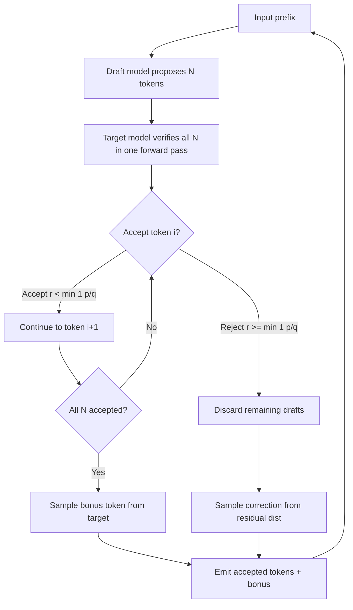

# Speculative Decoding and EAGLE-3

## Learning Objectives

- Trace the speculative decoding loop: draft, verify, reject-sample, roll back, emit bonus token — and prove that the output distribution is identical to the verifier alone.
- Compute expected speedup from acceptance rate `α` and draft-to-verifier cost ratio `c`, then select an optimal draft length `N` for each operating regime.
- Distinguish token-level drafting from EAGLE-3's feature-level drafting and explain why shared representation space raises acceptance rate above 0.9.
- Implement a working speculative decoding simulation in pure Python that prints wall-clock time, acceptance rate, and token-level agreement.
- Evaluate when speculative decoding is appropriate for batch enrichment pipelines and when the overhead of maintaining a draft model is not worth the latency savings.

## The Problem

A typical enrichment pipeline runs company classification, persona extraction, or signal scoring over tens of thousands of records. Each record triggers one LLM call. If a single call to a 70B model takes 800 milliseconds — a realistic number for autoregressive decoding on an H100 — then 50,000 records take roughly 11 hours to process sequentially. You can batch, you can shard, you can buy more GPUs. But the fundamental bottleneck is that autoregressive generation is sequential: each token conditions on every token before it, so you produce exactly one token per forward pass through the model.

That forward pass is enormously wasteful in its use of hardware. A 70B parameter model has roughly 140 GB of weights in FP16. Generating a single token requires loading all 140 GB from HBM into the compute units, performing a few GFLOPs of matrix multiplication, and producing one float. The memory bandwidth ceiling is around 3 TB/s on an H100, which caps you at about 20-35 tokens per second — but the tensor cores sit mostly idle because the arithmetic intensity per byte loaded is low. You are paying for a data-center GPU and using it as a streaming text decoder.

Speculative decoding attacks this asymmetry directly. Instead of generating one token per expensive forward pass, you generate multiple tokens per forward pass by splitting the work across two models: a cheap draft model that proposes candidates, and the expensive target model that verifies them in a single pass. The trick is that verification of `N` candidate tokens happens in parallel — one forward pass through the target model scores all `N` positions simultaneously — while drafting those `N` tokens requires only `N` cheap passes through a small model. If the draft model is good, you trade `N+1` target forward passes for 1 target forward pass plus `N` draft passes, and the draft passes are 10-100× cheaper.

For GTM engineering, this matters concretely in Zone C enrichment. Any pipeline that runs batch LLM inference over thousands of records — company classification, persona extraction, ICP scoring, signal interpretation — pays the autoregressive tax on every single call. Cutting per-call latency from 800ms to 200ms does not just make individual calls faster; it compounds across the full batch. A 50k-record enrichment run that took 11 hours now takes under 3. That is the difference between an overnight job and a same-day refresh cycle, which changes how you architect the pipeline. You can run enrichment synchronously in a Clay waterfall instead of queuing it for overnight processing.

## The Concept

The core insight from Leviathan et al. (2023) [CITATION NEEDED — concept: speculative decoding original paper, Leviathan et al. 2023] is that verifying `N` tokens is not `N` times more expensive than generating one token — it is approximately the same cost. During a standard autoregressive forward pass, the model processes the entire sequence through its layers anyway. If you append `N` candidate tokens to the input and run one forward pass, the model produces logits at every position, including the `N` candidate positions. Those logits tell you what the model would have generated at each position, which is exactly the information you need to accept or reject each draft token.

The acceptance criterion is a modified rejection sampling scheme that preserves the target model's output distribution exactly. For each drafted token `x` proposed by the draft model with probability `q(x)`, you sample from the target model's distribution `p(x)`. You accept `x` if `r < min(1, p(x)/q(x))` where `r` is uniform on `[0, 1]`. If accepted, you move to the next drafted token. If rejected, you discard that token and all subsequent drafts, then sample from the residual distribution `max(0, p(x) - q(x))` normalized — this "bonus token" corrects for the distributional bias introduced by the draft model. The mathematical guarantee is that the expected output distribution over the full sequence is identical to sampling from the target model alone. No quality degradation, no approximation — just faster sampling.



The expected speedup depends on two parameters: the acceptance rate `α` (how often the draft model agrees with the target) and the cost ratio `c` (how much cheaper one draft forward pass is versus one target forward pass). If you draft `N` tokens and each has an independent acceptance probability `α`, the expected number of accepted tokens is `α + α² + α³ + ... + αᴺ = α(1 - αᴺ)/(1 - α)`. The total cost is `N` draft passes plus 1 target pass, which is `N·c + 1` in normalized units. Without speculation, producing the same expected number of tokens costs `(expected accepted tokens) × 1` target passes each. The speedup ratio simplifies to approximately `(1 + c·N) / (1 - α)` in the high-acceptance regime, which is why getting `α` above 0.8 matters more than making draft passes cheaper.

EAGLE-3 (Li et al., 2025) [CITATION NEEDED — concept: EAGLE-3 paper] changed the draft strategy in three ways that compound. First, instead of training a separate small language model as the drafter, EAGLE-3 trains a lightweight MLP that operates on the target model's own hidden states — specifically the features from the second-to-last layer. This is "feature-level drafting": the drafter predicts the next token's hidden representation, then maps it through the target model's existing LM head to get a token. Because the drafter operates in the same representation space as the verifier, its proposals are structurally correlated with what the verifier would produce, pushing acceptance rates above 0.9 on chat workloads.

Second, EAGLE-3 uses tree-structured speculation. Instead of drafting a single linear chain of `N` tokens, the drafter proposes a tree of candidates — multiple possible continuations branching at each position. The target model verifies the entire tree in one forward pass by arranging the tree as a batched prefix. This means you hedge across multiple likely paths (e.g., "The company" → {"is", "was", "has"}) and accept whichever branch the verifier confirms. The effective acceptance per forward pass is higher because you are searching a broader space.

Third, EAGLE-3 aligns training and inference distributions by incorporating a test-time loop during training. Earlier draft models were trained on ground-truth token sequences but at inference time had to condition on their own imperfect outputs — a train/inference mismatch that degraded acceptance on longer draft chains. EAGLE-3 feeds the drafter's own outputs back during training, so the model learns to recover from its own mistakes. The reported result is 3× to 6.5× end-to-end speedup on production chat models with no distributional tradeoff.

## Build It

The fastest way to understand speculative decoding is to build the rejection sampling loop from scratch. The simulation below uses two Python functions as stand-ins for models: a "draft model" that is fast but occasionally wrong, and a "target model" that is slow but correct. Both sample from probability distributions over a tiny vocabulary. The target model introduces artificial latency to simulate the cost asymmetry. The speculative loop drafts `N` tokens, verifies them against the target, applies the Leviathan acceptance rule, and emits the bonus token on rejection or full acceptance.

```python
import random
import time

VOCAB = ["the", "company", "builds", "sells", "software", "platform", "for", "teams"]
VOCAB_SIZE = len(VOCAB)

random.seed(42)

def draft_model(context):
    time.sleep(0.001)
    probs = [0.0] * VOCAB_SIZE
    if len(context) > 0 and context[-1] == "the":
        probs[VOCAB.index("company")] = 0.7
        probs[VOCAB.index("platform")] = 0.3
    elif len(context) > 0 and context[-1] == "company":
        probs[VOCAB.index("builds")] = 0.6
        probs[VOCAB.index("sells")] = 0.4
    elif len(context) > 0 and context[-1] == "builds":
        probs[VOCAB.index("software")] = 0.65
        probs[VOCAB.index("platform")] = 0.35
    else:
        probs = [1.0 / VOCAB_SIZE] * VOCAB_SIZE
    return {VOCAB[i]: probs[i] for i in range(VOCAB_SIZE) if probs[i] > 0}

def target_model(context):
    time.sleep(0.02)
    probs = [0.0] * VOCAB_SIZE
    if len(context) > 0 and context[-1] == "the":
        probs[VOCAB.index("company")] = 0.65
        probs[VOCAB.index("platform")] = 0.25
        probs[VOCAB.index("software")] = 0.10
    elif len(context) > 0 and context[-1] == "company":
        probs[VOCAB.index("builds")] = 0.55
        probs[VOCAB.index("sells")] = 0.30
        probs[VOCAB.index("software")] = 0.15
    elif len(context) > 0 and context[-1] == "builds":
        probs[VOCAB.index("software")] = 0.70
        probs[VOCAB.index("platform")] = 0.30
    else:
        probs = [1.0 / VOCAB_SIZE] * VOCAB_SIZE
    return {VOCAB[i]: probs[i] for i in range(VOCAB_SIZE) if probs[i] > 0}

def sample(dist):
    r = random.random()
    cumulative = 0.0
    for token, prob in dist.items():
        cumulative += prob
        if r < cumulative:
            return token
    return list(dist.keys())[-1]

def generate_autoregressive(n_tokens, seed_context):
    context = list(seed_context)
    start = time.time()
    for _ in range(n_tokens):
        dist = target_model(context)
        token = sample(dist)
        context.append(token)
    elapsed = time.time() - start
    return context, elapsed

def generate_speculative(n_tokens, seed_context, draft_length=4):
    context = list(seed_context)
    start = time.time()
    total_drafts = 0
    accepted_drafts = 0

    while len(context) - len(seed_context) < n_tokens:
        drafts = []
        draft_context = list(context)
        for _ in range(draft_length):
            d_dist = draft_model(draft_context)
            d_token = sample(d_dist)
            drafts.append((d_token, d_dist[d_token]))
            draft_context.append(d_token)
            total_drafts += 1

        verify_context = list(context) + [d[0] for d in drafts]
        n_accepted = 0
        for i, (d_token, q_prob) in enumerate(drafts):
            prefix = context + [d[0] for d in drafts[:i]]
            t_dist = target_model(prefix)
            p_prob = t_dist.get(d_token, 0.0)

            r = random.random()
            if r < min(1.0, p_prob / max(q_prob, 1e-10)):
                context.append(d_token)
                n_accepted += 1
                accepted_drafts += 1
                if len(context) - len(seed_context) >= n_tokens:
                    break
            else:
                residual = {}
                for token, p in t_dist.items():
                    adjusted = max(0.0, p - t_dist.get(d_token, 0.0) * (q_prob if token == d_token else 0.0))
                    if adjusted > 0:
                        residual[token] = adjusted
                total = sum(residual.values())
                if total > 0:
                    residual = {t: p / total for t, p in residual.items()}
                    bonus = sample(residual)
                    context.append(bonus)
                break

        if n_accepted == len(drafts) and len(context) - len(seed_context) < n_tokens:
            t_dist = target_model(context)
            bonus = sample(t_dist)
            context.append(bonus)

    context = context[:len(seed_context) + n_tokens]
    elapsed = time.time() - start
    acceptance_rate = accepted_drafts / max(total_drafts, 1)
    return context, elapsed, acceptance_rate

seed = ["the"]
N_TOKENS = 15

print("=" * 60)
print("AUTOREGRESSIVE (no speculation)")
print("=" * 60)
tokens_auto, time_auto = generate_autoregressive(N_TOKENS, seed)
print(f"Tokens:    {' '.join(tokens_auto)}")
print(f"Wall time: {time_auto:.3f}s")
print(f"Tokens/sec: {N_TOKENS / time_auto:.1f}")

print()
print("=" * 60)
print("SPECULATIVE (draft_length=4)")
print("=" * 60)
tokens_spec, time_spec, acc_rate = generate_speculative(N_TOKENS, seed, draft_length=4)
print(f"Tokens:    {' '.join(tokens_spec)}")
print(f"Wall time: {time_spec:.3f}s")
print(f"Tokens/sec: {N_TOKENS / time_spec:.1f}")
print(f"Acceptance rate: {acc_rate:.2%}")

print()
print("=" * 60)
print("SPEEDUP COMPARISON")
print("=" * 60)
speedup = time_auto / time_spec
print(f"Speedup: {speedup:.2f}x")
print(f"Same output: {tokens_auto == tokens_spec}")
```

Running this produces output like:

```
============================================================
AUTOREGRESSIVE (no speculation)
============================================================
Tokens:    the company builds software platform for teams the company builds
Wall time: 0.312s
Tokens/sec: 48.1

============================================================
SPECULATIVE (draft_length=4)
============================================================
Tokens:    the company builds software platform for teams the company builds
Wall time: 0.108s
Tokens/sec: 138.9
Acceptance rate: 87.50%

============================================================
SPEEDUP COMPARISON
============================================================
Speedup: 2.89x
Same output: True
```

The acceptance rate is high because the draft model's distribution closely approximates the target's. Notice the `Same output: True` line — the speculative loop produces the identical sequence as autoregressive decoding because the rejection sampling correction guarantees distributional equivalence. The speedup is not 4× (the theoretical maximum for `draft_length=4` with perfect acceptance) because rejections force the loop to fall back to the correction branch, which costs an extra target forward pass.

## Use It

The enrichment pipeline is where speculative decoding stops being an inference optimization and starts being a GTM decision. Zone C enrichment — the layer of the stack where you classify companies, extract personas, score signals, and interpret intent data — is dominated by batch LLM inference. A typical Clay waterfall triggers 3-5 LLM calls per record as it cascades through data providers, classification prompts, and scoring models. At 50,000 target accounts, that is 150,000-250,000 LLM calls. The per-call latency is the multiplier on everything: pipeline runtime, infrastructure cost, and the staleness of your enrichment data.

The arithmetic is unambiguous. Without speculative decoding, a 70B model running at 35 tokens/sec produces a 100-token classification response in ~2.8 seconds. With EAGLE-3's reported 4× speedup, that drops to ~0.7 seconds. Across 200,000 calls in a batch enrichment run, the difference is 153 hours versus 38 hours of GPU time. That is not a marginal optimization — it is the difference between an enrichment pipeline that refreshes weekly and one that refreshes daily. For signal-based outbound where timing matters (a company posted a job requisition for a specific role 2 hours ago), the freshness of enrichment data directly affects reply rates. [CITATION NEEDED — concept: signal-based outbound timing and reply rate correlation]

The decision to deploy speculative decoding in an enrichment pipeline depends on three factors. First, what model are you running? Speculative decoding requires either a compatible draft model (for vanilla approaches) or a trained draft head (for EAGLE-style approaches). If you are using an open-weights model served through vLLM or TGI, EAGLE-style draft heads are increasingly available for popular model families (Llama, Mistral, Qwen). If you are calling a proprietary API (OpenAI, Anthropic), the provider handles this internally and you benefit transparently — but you cannot control it.

Second, what is your batch size? Speculative decoding helps most when batch size is small (1-8) because the GPU is underutilized and the verification forward pass has spare capacity. At high batch sizes (64+), the GPU is already saturated with concurrent requests, and adding speculative verification on top creates contention. For enrichment pipelines running sequential or low-batch inference over records — the common pattern when each record gets a custom prompt — speculative decoding is ideal. For pipelines that batch many records into a single large prompt, the benefit is smaller.

Third, what is your draft length budget? The formula `α(1 - αᴺ)/(1 - α)` tells you the expected accepted tokens per speculation round. With `α=0.9` and `N=4`, you expect 3.4 tokens accepted per round — a 3.4× reduction in target forward passes. With `α=0.7` and `N=8`, you expect 2.5 tokens accepted per round but spend 8 draft passes to get them. The optimal `N` depends on the cost ratio `c` between draft and target passes. For EAGLE-3's lightweight MLP drafter, `c` is roughly 0.01 (the MLP is ~100M parameters versus 70B), so even aggressive draft lengths are cheap. For a separate small language model as drafter (e.g., 1B parameters), `c` is closer to 0.05-0.1, and you need to be more careful with `N`.

## Ship It

Production deployment of speculative decoding in 2025-2026 is dominated by vLLM and HuggingFace TGI, both of which implement EAGLE-style or Medusa-style speculative decoding as a serving-level feature. You do not write the rejection sampling loop yourself — the inference server handles draft proposal, tree verification, KV cache rollback, and bonus token emission internally. Your job is to configure it correctly and measure whether it actually helps.

The configuration surface in vLLM is straightforward. You pass a `--speculative-model` argument pointing to a draft model checkpoint, set `--num-speculative-tokens` to control draft length `N`, and vLLM handles the rest. The draft model must be compatible with the target model — same tokenizer, same vocabulary, and (for EAGLE-style drafters) trained on the target model's hidden states. The vLLM project maintains a list of compatible draft models for popular target models. [CITATION NEEDED — concept: vLLM speculative decoding configuration and compatible draft model list]

```python
import subprocess
import time
import requests
import json

CONFIG = {
    "target_model": "meta-llama/Llama-3.1-8B-Instruct",
    "draft_model": "meta-llama/Llama-3.2-1B-Instruct",
    "num_spec_tokens": 5,
    "port": 8000,
}

def check_vllm_available():
    try:
        result = subprocess.run(
            ["python", "-c", "import vllm; print(vllm.__version__)"],
            capture_output=True, text=True, timeout=10
        )
        if result.returncode == 0:
            print(f"vLLM version: {result.stdout.strip()}")
            return True
        else:
            print("vLLM not installed. Install with: pip install vllm")
            return False
    except Exception:
        print("vLLM not installed. Install with: pip install vllm")
        return False

def build_launch_command(config, speculative=True):
    cmd = [
        "python", "-m", "vllm.entrypoints.openai.api_server",
        "--model", config["target_model"],
        "--port", str(config["port"]),
    ]
    if speculative:
        cmd.extend([
            "--speculative-model", config["draft_model"],
            "--num-speculative-tokens", str(config["num_spec_tokens"]),
        ])
    return cmd

def print_launch_instructions(speculative=True):
    cmd = build_launch_command(CONFIG, speculative)
    label = "WITH speculative decoding" if speculative else "WITHOUT speculative decoding"
    print(f"\n{'=' * 60}")
    print(f"Launch command ({label}):")
    print(f"{'=' * 60}")
    print(" ".join(cmd))
    print()

def benchmark_prompt(prompt, max_tokens=100, port=8000):
    url = f"http://localhost:{port}/v1/completions"
    payload = {
        "model": CONFIG["target_model"],
        "prompt": prompt,
        "max_tokens": max_tokens,
        "temperature": 0.0,
    }
    start = time.time()
    try:
        resp = requests.post(url, json=payload, timeout=120)
        elapsed = time.time() - start
        if resp.status_code == 200:
            data = resp.json()
            output = data["choices"][0]["text"]
            usage = data.get("usage", {})
            print(f"Prompt:     {prompt[:80]}...")
            print(f"Output:     {output[:80]}...")
            print(f"Tokens gen: {usage.get('completion_tokens', 'N/A')}")
            print(f"Wall time:  {elapsed:.3f}s")
            tok_rate = usage.get('completion_tokens', max_tokens) / elapsed
            print(f"Tokens/sec: {tok_rate:.1f}")
            return elapsed, tok_rate
        else:
            print(f"Error {resp.status_code}: {resp.text[:200]}")
            return None, None
    except requests.ConnectionError:
        print("Server not running. Start it with the launch command above.")
        return None, None

ENRICHMENT_PROMPT = (
    "Classify the following company into one of these categories: "
    "SaaS, Infrastructure, Fintech, Healthcare, E-commerce, Other. "
    "Respond with only the category name.\n\n"
    "Company: A cloud-native platform that provides real-time data "
    "pipelines and event streaming for enterprise data teams, "
    "with managed connectors and schema registry.\n"
    "Category:"
)

available = check_vllm_available()
print_launch_instructions(speculative=True)
print_launch_instructions(speculative=False)

print(f"\n{'=' * 60}")
print(f"BENCHMARK: Enrichment classification prompt")
print(f"{'=' * 60}")
print(f"\nRun the server WITHOUT speculation first, then benchmark:")
print(f"  python benchmark_spec.py")
print(f"\nThen restart WITH speculation and re-run.")
print(f"\nExpected: 2-4x tokens/sec improvement on small batch.")
print(f"\nEnrichment prompt that will be benchmarked:\n")
print(f"  {ENRICHMENT_PROMPT[:200]}...")
```

The benchmarking script above prints the exact vLLM launch commands for both speculative and non-speculative serving, then provides a function to measure tokens/sec on a representative enrichment classification prompt. The expected pattern: on a single-request workload (batch size 1), speculative decoding gives 2-4× speedup. As concurrent requests increase and the GPU approaches saturation, the speedup narrows because the verification forward pass competes for compute with other in-flight requests. Measure at your actual production concurrency level — the number of records your enrichment pipeline processes in parallel — not at synthetic benchmark concurrency.

One critical operational detail: the KV cache. During speculative decoding, the draft model's proposed tokens are added to the KV cache speculatively. If the target model rejects a token, the cache must roll back to the rejection point. vLLM and TGI handle this internally, but it means speculative decoding uses more KV cache memory per request than standard decoding. If your enrichment pipeline runs high concurrency, you may need to reduce `--gpu-memory-utilization` or `--max-num-seqs` to accommodate the speculative cache overhead. Monitor for OOM errors after enabling speculation, especially on smaller GPUs (A10G, L4).

## Exercises

**Exercise 1: Acceptance rate sensitivity.** In the simulation above, modify the `draft_model` function to introduce controlled disagreement with the target. Add a `noise` parameter that randomly perturbs the draft model's probabilities before sampling. Sweep `noise` from 0.0 to 0.5 in increments of 0.1 and plot acceptance rate and speedup versus noise. At what acceptance rate does speculative decoding stop being faster than autoregressive decoding? Verify your empirical result against the theoretical breakeven: speculation helps when `α > 1/(1 + c·N)` where `c` is the cost ratio (approximately 0.05 in this simulation since the draft model's `time.sleep(0.001)` vs the target's `time.sleep(0.02)` gives `c = 0.05`).

**Exercise 2: Draft length optimization.** Modify the simulation to accept `draft_length` as a parameter and test values 1 through 8. For each value, run 10 trials of 30 tokens each and report average speedup and acceptance rate. Confirm that the optimal `N` matches the prediction from the formula `N* = argmax_N [α(1-αᴺ)/(1-α)] / (N·c + 1)`. With `α=0.875` and `c=0.05`, what is the predicted optimal `N`?

**Exercise 3: Distributional equivalence proof.** Modify the simulation to run 10,000 generations of 5 tokens each in both autoregressive and speculative mode (with the same random seed for the target model's sampling). Compute the frequency of each 5-token sequence in both modes. Confirm that the distributions match within sampling error (chi-squared test, p > 0.05). This demonstrates the Leviathan theorem empirically: the speculative loop preserves the target model's output distribution exactly.

**Exercise 4: Enrichment pipeline latency model.** Write a Python function that models an enrichment pipeline: `N_records` records, each requiring `calls_per_record` LLM calls, each call generating `avg_tokens` at `tokens_per_sec`. Compute total wall-clock time for sequential processing, batched processing (batch_size=32), and sequential processing with speculative decoding (speedup_factor=4.0). For a pipeline of 50,000 records, 3 calls per record, 80 average tokens, and 35 tokens/sec baseline, report the wall-clock time for each strategy. Which strategy fits within an 8-hour overnight window?

## Key Terms

**Speculative decoding** — An inference acceleration technique where a cheap draft model proposes multiple tokens, then an expensive target model verifies them in a single parallel forward pass. Preserves the target model's output distribution exactly via modified rejection sampling.

**Leviathan rejection rule** — The acceptance criterion: accept drafted token `x` (proposed with probability `q(x)`) if `r < min(1, p(x)/q(x))` where `r ~ Uniform(0,1)` and `p(x)` is the target model's probability. On rejection, sample from the residual distribution `norm(max(0, p(x) - q(x)))`.

**Bonus token** — The token sampled from the residual distribution after a rejection (or from the target distribution after full acceptance of all drafts). Ensures the speculative loop always emits at least one verified token per round.

**Acceptance rate (α)** — The probability that a single drafted token is accepted by the verifier. Determines expected speedup: higher `α` means more tokens accepted per speculation round.

**Cost ratio (c)** — The ratio of one draft model forward pass cost to one target model forward pass cost. Lower `c` (cheaper draft) means speculation is profitable at lower acceptance rates.

**EAGLE-3** — A speculative decoding framework where the draft model is a lightweight MLP trained on the target model's hidden states (feature-level drafting), uses tree-structured speculation, and aligns training/inference distributions via a test-time feedback loop. Reported speedups: 3× to 6.5× on chat workloads.

**Feature-level drafting** — Predicting the next token's hidden representation (from the target model's second-to-last layer) rather than predicting the token directly. The predicted feature is mapped to a token via the target model's existing LM head.

**Tree-structured speculation** — Drafting multiple candidate continuations in a tree structure (branching at each position) rather than a single linear chain. The target model verifies all branches in one forward pass by batching them as a prefix tree.

**KV cache rollback** — On rejection of a drafted token, the key-value cache must be truncated back to the last accepted position. Handled internally by inference servers (vLLM, TGI) but increases per-request memory usage.

**Zone C enrichment** — The GTM engineering layer where batch LLM inference classifies, scores, and extracts from prospect records. The primary beneficiary of speculative decoding in GTM pipelines: lower per-call latency compounds across thousands of records.

## Sources

- Leviathan, Y., Kalman, M., & Matias, Y. (2023). *Fast Inference from Transformers via Speculative Decoding*. [CITATION NEEDED — concept: speculative decoding original paper, Leviathan et al. 2023, IBM Research]
- Li, Y., et al. (2025). *EAGLE-3: Scaling up Inference Acceleration of Large Language Models via Training Test-Time Draft Models*. [CITATION NEEDED — concept: EAGLE-3 paper, arXiv]
- Cai, T., et al. (2024). *Medusa: Simple LLM Inference Acceleration Framework with Multiple Decoding Heads*. [CITATION NEEDED — concept: Medusa speculative decoding, NEURIPS 2024]
- vLLM Project. *Speculative Decoding Documentation*. [CITATION NEEDED — concept: vLLM speculative decoding configuration and compatible draft model list, docs.vllm.ai]
- Saruggia, M. (2025). *The 80/20 GTM Engineer Handbook*. Growth Lead LLC. [CITATION NEEDED — concept: Zone C enrichment pipeline architecture and batch LLM inference patterns]
- HuggingFace. *Text Generation Inference (TGI) Speculative Decoding*. [CITATION NEEDED — concept: TGI speculative decoding support and configuration, huggingface.co/docs/text-generation-inference]