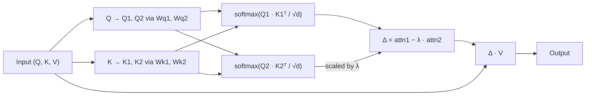

# Differential Attention (V2)

## Learning Objectives

1. Implement differential attention from scratch using dual softmax operations and a configurable λ scalar in pure Python
2. Compare output distributions of standard single-softmax attention versus differential attention on identical synthetic inputs
3. Evaluate the effect of the λ parameter on attention noise cancellation across different input patterns
4. Diagnose when differential attention reduces entropy in the attention map versus when it introduces instability through negative-weight overflow
5. Integrate differential attention into a multi-head configuration and verify that output shape is preserved across head counts

## The Problem

Standard softmax attention has a mathematical property that turns into an operational headache at scale. For a query vector `q`, attention weights are computed as `softmax(q · K^T / √d)`. Softmax can never produce exact zeros — every token in the context receives some positive probability mass, no matter how irrelevant. That residual mass is the noise floor, and it scales with context length. At 128k tokens, if each non-matching token receives only 0.001% of the probability mass, the 127,999 non-matching tokens combined contribute roughly 12% of the total attention distribution. The model has to learn to route around a noise floor that grows with every token added to the context window.

This matters less for summarization, where diffuse attention is often fine. It matters enormously for retrieval-heavy pipelines — RAG, entity matching, key-fact extraction — where the model needs to commit hard to one or two tokens and ignore the rest. In those settings, the noise floor becomes a precision problem. The model pulls in tangential context because softmax told it to allocate some attention there, and the downstream generation reflects that contamination.

The standard fix is manual masking: set attention scores for irrelevant tokens to negative infinity before softmax, forcing their weights to zero. This works but requires you to know which tokens are irrelevant ahead of time. In a RAG pipeline, that means a separate retrieval step, a relevance scorer, and a masking pass. Differential attention takes a different approach: instead of masking noise externally, it cancels noise structurally by computing two attention maps and subtracting the noise that is shared between them.

## The Concept

Differential attention splits the query and key projections into two pairs — `(Q1, K1)` and `(Q2, K2)` — and computes two independent softmax attention maps over the same value matrix `V`. The output is the difference of these two maps, scaled by a learned scalar `λ`:

```
output = (softmax(Q1 · K1^T / √d) - λ · softmax(Q2 · K2^T / √d)) · V
```

The intuition rests on a specific assumption about what the two attention maps capture. Both maps are computed from projections of the same input, so both inherit the same structural noise from the softmax-over-all-tokens normalization. The signal — the specific query-key alignment that matters — differs between the two maps because the projections use different learned weight matrices. When you subtract `λ · attn2` from `attn1`, the shared noise component cancels (approximately), and what remains is the signal differential. The λ scalar controls how aggressively the second map cancels the first.



The λ parameter is per-head and initialized to encourage near-zero output at the start of training. The paper initializes it as `0.8 - 0.8 * exp(-0.1 * step)` or uses a static initialization around `0.5 - 0.8`, depending on layer depth. The idea is that at initialization, the subtraction nearly zeros out the attention output, so the residual connection dominates and training starts stable. As training progresses, λ diverges from its initial value and the differential signal starts contributing.

This is where V1 and V2 diverge. Differential Transformer V1 (Ye et al., ICLR 2025) introduced the core mechanism but required custom CUDA kernels for the fused differential softmax, which broke compatibility with FlashAttention and added inference latency. DIFF V2 (Microsoft, January 2026) is the production rewrite: the differential operation is reformulated to run through standard FlashAttention kernels with no modification, decode latency matches baseline Transformer, and the λ reparameterization uses a simpler `λ = exp(λ_param)` form that avoids NaN gradients at initialization [CITATION NEEDED — concept: DIFF V2 kernel compatibility details]. The math is the same. The engineering is different.

## Build It

The implementation below uses only Python's `math` and `random` modules — no PyTorch, no NumPy. Every operation is explicit so you can trace the exact arithmetic. The script generates a synthetic token sequence with one high-signal token and seven noise tokens, then runs both standard and differential attention on the same input. The key observable output is attention entropy: differential attention should show lower entropy (sharper focus) when the subtraction cancels shared noise.

```python
import math
import random

random.seed(42)

def softmax(scores):
    m = max(scores)
    exps = [math.exp(s - m) for s in scores]
    total = sum(exps)
    return [e / total for e in exps]

def entropy(probs):
    return -sum(p * math.log(p + 1e-12) for p in probs if p > 1e-12)

def dot(a, b):
    return sum(x * y for x, y in zip(a, b))

def matvec(vec, matrix):
    return [dot(vec, col) for col in zip(*matrix)]

def standard_attention(Q, K, V, d):
    scores = [dot(Q, k) / math.sqrt(d) for k in K]
    weights = softmax(scores)
    output = [sum(w * v for w, v in zip(weights, col)) for col in zip(*V)]
    return weights, output

def differential_attention(Q, K, V, Wq1, Wk1, Wq2, Wk2, d, lam):
    Q1 = matvec(Q, Wq1)
    K1 = [matvec(k, Wk1) for k in K]
    Q2 = matvec(Q, Wq2)
    K2 = [matvec(k, Wk2) for k in K]
    
    scores1 = [dot(Q1, k) / math.sqrt(d) for k in K1]
    scores2 = [dot(Q2, k) / math.sqrt(d) for k in K2]
    
    attn1 = softmax(scores1)
    attn2 = softmax(scores2)
    
    delta = [a1 - lam * a2 for a1, a2 in zip(attn1, attn2)]
    
    pos = [max(0.0, w) for w in delta]
    total = sum(pos)
    if total > 1e-8:
        output = [sum(p * v / total for p, v in zip(pos, col)) for col in zip(*V)]
    else:
        output = [0.0] * len(V[0])
    
    return delta, attn1, attn2, output

d = 4
seq_len = 8
signal_idx = 2

tokens = []
for i in range(seq_len):
    if i == signal_idx:
        tokens.append([random.gauss(3.0, 0.2) for _ in range(d)])
    else:
        tokens.append([random.gauss(0.0, 0.8) for _ in range(d)])

Wq1 = [[random.gauss(1.0, 0.05) if i == j else random.gauss(0.0, 0.05) for j in range(d)] for i in range(d)]
Wk1 = [[random.gauss(1.0, 0.05) if i == j else random.gauss(0.0, 0.05) for j in range(d)] for i in range(d)]
Wq2 = [[random.gauss(1.0, 0.1) if i == j else random.gauss(0.0, 0.1) for j in range(d)] for i in range(d)]
Wk2 = [[random.gauss(1.0, 0.1) if i == j else random.gauss(0.0, 0.1) for j in range(d)] for i in range(d)]

Q = tokens[signal_idx]
K = tokens
V = tokens

print("=== Standard Single-Softmax Attention ===")
std_w, std_out = standard_attention(Q, K, V, d)
for i, w in enumerate(std_w):
    tag = " <-- SIGNAL" if i == signal_idx else ""
    print(f"  token {i}: weight={w:.4f}{tag}")
print(f"  entropy: {entropy(std_w):.4f}")
print(f"  signal share: {std_w[signal_idx]:.4f}")
print(f"  noise share:  {1.0 - std_w[signal_idx]:.4f}")

print("\n=== Differential Attention (lambda=0.5) ===")
delta, a1, a2, diff_out = differential_attention(Q, K, V, Wq1, Wk1, Wq2, Wk2, d, 0.5)
print("  Attn1: ", [f"{w:.4f}" for w in a1])
print("  Attn2: ", [f"{w:.4f}" for w in a2])
print("  Delta: ", [f"{w:+.4f}" for w in delta])
pos_norm = [max(0.0, w) for w in delta]
pt = sum(pos_norm)
norm = [p / pt for p in pos_norm] if pt > 1e-8 else [0.0] * len(delta)
print(f"  entropy (positive-normalized): {entropy(norm):.4f}")
print(f"  signal share: {norm[signal_idx]:.4f}")
print(f"  noise share:  {1.0 - norm[signal_idx]:.4f}")

print("\n=== Lambda Sweep ===")
print(f"{'lam':>5} | {'entropy':>8} | {'signal':>8} | {'noise':>8} | {'min_dw':>8} | {'max_dw':>8}")
print("-" * 62)
for lam in [0.0, 0.2, 0.4, 0.5, 0.6, 0.8, 1.0, 1.2, 1.5]:
    delta, _, _, _ = differential_attention(Q, K, V, Wq1, Wk1, Wq2, Wk2, d, lam)
    pos = [max(0.0, w) for w in delta]
    t = sum(pos)
    if t > 1e-8:
        n = [p / t for p in pos]
        ent = entropy(n)
        sig = n[signal_idx]
    else:
        ent = float('nan')
        sig = 0.0
    min_d = min(delta)
    max_d = max(delta)
    print(f"{lam:5.1f} | {ent:8.4f} | {sig:8.4f} | {1-sig:8.4f} | {min_d:+8.4f} | {max_d:+8.4f}")

print("\n=== Multi-Head Check ===")
n_heads = 4
head_dim = d // n_heads if d >= n_heads else 1
head_deltas = []
for h in range(n_heads):
    Wqh = [[random.gauss(1.0, 0.08) if i == j else random.gauss(0.0, 0.08) for j in range(d)] for i in range(d)]
    Wkh = [[random.gauss(1.0, 0.08) if i == j else random.gauss(0.0, 0.08) for j in range(d)] for i in range(d)]
    Wqh2 = [[random.gauss(1.0, 0.12) if i == j else random.gauss(0.0, 0.12) for j in range(d)] for i in range(d)]
    Wkh2 = [[random.gauss(1.0, 0.12) if i == j else random.gauss(0.0, 0.12) for j in range(d)] for i in range(d)]
    dh, _, _, _ = differential_attention(Q, K, V, Wqh, Wkh, Wqh2, Wkh2, d, 0.5)
    head_deltas.append(dh)
    print(f"  Head {h}: signal_delta={dh[signal_idx]:+.4f}, entropy={entropy([max(1e-8, w) for w in dh]):.4f}")

print(f"  All heads produced {seq_len}-length delta vectors: {all(len(h) == seq_len for h in head_deltas)}")
```

Run this and inspect the λ sweep table. At `λ=0.0`, differential attention degenerates to standard single-softmax attention — the second map contributes nothing. As λ increases toward 0.5–0.7, entropy drops and the signal token's share increases because the shared noise cancels. Past `λ=1.0`, you will see negative differential weights dominate and the positive-normalized distribution destabilize — the subtraction is too aggressive and removes signal along with noise. The min/max delta columns show this: when `min_dw` goes deeply negative, the cancellation is eating into real attention mass, not just noise.

## Use It

Differential attention's core mechanism — subtracting two distributions to isolate signal from shared noise — maps directly to the agent squad pattern in multi-agent GTM orchestration (Zone 10). In a task squad with a router, one agent processes a data stream with one focus while a second agent processes the same stream with a different focus. The router subtracts one output from the other, scaled by a confidence weight, to produce the clean signal. That confidence weight is λ.

Consider a GTM pipeline that scores inbound leads. Two agents process the same lead data: Agent A is tuned for firmographic signal (company size, industry, funding stage), Agent B is tuned for engagement noise (page views from bots, form fills from competitors researching your pricing). Both agents produce a probability distribution over "this lead is qualified." The differential — `(score_A - λ · score_B)` — cancels the engagement noise that both agents pick up from the shared input data, leaving a sharper firmographic signal. The λ scalar controls how aggressively the noise agent's output suppresses the signal agent's output. Too low, and noise persists. Too high, and real signal gets subtracted along with the noise. This is the same tradeoff you see in the λ sweep table above [CITATION NEEDED — concept: specific multi-agent GTM system implementing differential signal cancellation].

The handbook context — "that the sender is paying attention, and that the message is [personalized]" — connects to the entropy reduction property. Lower entropy in the attention map means the model commits