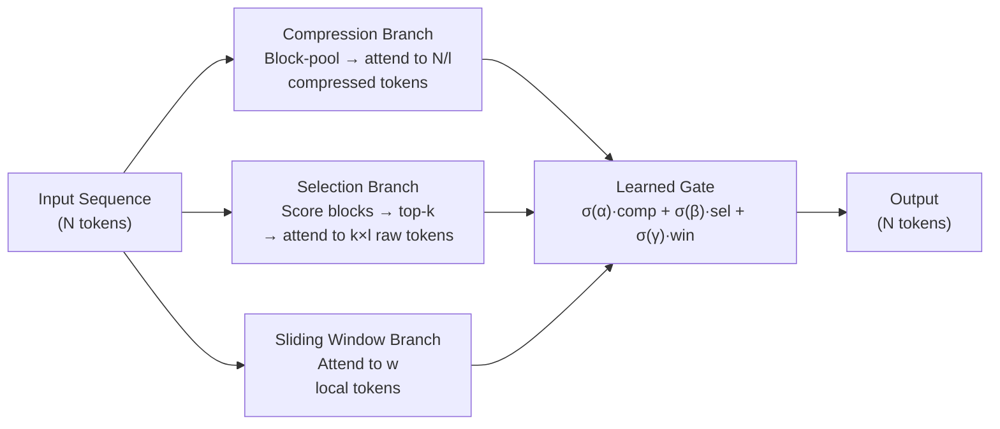

# Native Sparse Attention (DeepSeek NSA)

## Learning Objectives

- State the three NSA attention branches (compression, selection, sliding window) and identify what information each one captures.
- Explain why natively trainable sparsity outperforms post-hoc sparse masking applied at inference time.
- Compute NSA attention density as a function of block size, top-k selection budget, and sliding window width versus dense baseline.

## The Problem

Full attention at sequence length N costs O(N²) time and O(N) KV cache per layer. At 64K tokens, the compute and memory bandwidth numbers become the dominant cost in the entire forward pass. The NSA paper reports that attention accounts for 70–80% of total decode latency at 64K context. Everything downstream — time-to-first-token, tokens per second, cost per million tokens — is governed by attention cost.

Sparse attention is the obvious answer. Prior attempts fall into two buckets. Fixed-pattern sparsity (sliding-window, strided, block-local) throws information away and fails on long-range recall tasks because the model was trained expecting full attention and then has a subset yanked away at inference. Inference-time sparsification (top-k attention, threshold pruning) computes full attention scores first, then discards low-scoring positions — but the scoring pass already paid the O(N²) cost, so you save memory but not compute. Neither approach changes the training dynamics. The model never learned to route information through sparse channels, so it cannot compensate for the positions that were dropped.

The third option — and the one NSA takes — is to train with sparsity from the first optimization step. The model sees the same sparse mask during pre-training that it will see during inference. There is no train-time/inference-time mismatch. The attention pattern is not a compression technique bolted onto a trained model; it is the model's native information routing architecture.

## The Concept

NSA routes every token through three parallel attention branches, then combines their outputs through a learned gate. Each branch captures a different temporal granularity of the sequence.

**Compression branch.** The input sequence is divided into non-overlapping blocks of size `l` (typically 64). Each block is aggregated — via mean-pooling or a learned linear projection — into a single compressed token. The query then attends to `N/l` compressed tokens instead of `N` raw tokens. This gives each query position a coarse-grained global view of the entire sequence at 1/l the cost of full attention. If the sequence is 64K tokens with block size 64, the compression branch performs attention over 1,024 compressed representations.

**Selection branch.** Compression alone loses fine-grained detail. The selection branch solves this by computing an importance score for each compressed block, selecting the top-k highest-scoring blocks, and then attending to the *original uncompressed tokens* within those blocks. If k=64 and block size=64, the query attends to 4,096 fine-grained tokens — the ones the model learned are most relevant. The selection score is computed via a learned gating function (a linear layer that produces per-block logits), and the top-k selection is differentiable through a straight-through estimator, so gradients flow back to teach the gate which blocks matter.

**Sliding window branch.** Local token dependencies — punctuation, syntax, entity references within a clause — do not need global routing. A standard fixed-width sliding window attention (typically 512 tokens) handles these. This branch is cheap (window_size keys per query) and covers the pattern that fixed-window sparse attention methods were designed for.



The three branches execute in parallel on the GPU. This is the hardware-alignment argument: prior sparse attention methods required irregular memory access patterns (gathering tokens from scattered positions), which starves tensor cores and becomes memory-bandwidth-bound. NSA's branches are each dense operations over contiguous or block-structured memory, so they map cleanly to tensor core matmuls. The compression branch is a single matmul over `N/l` tokens. The selection branch, once the top-k blocks are identified, is a matmul over contiguous blocks. The sliding window is a banded matmul. All three are kernel-friendly.

The gating mechanism combines the three branch outputs. For each query position, the gate produces three scalar weights (via softmax over learned logits) that mix the branch outputs: `output = g_comp · attn_comp + g_sel · attn_sel + g_win · attn_win`. Because the gate is learned during pre-training, the model discovers which branch to weight heavily for different positions — a position in the middle of a code block may rely on the sliding window, while a position asking about a document-level theme may route through compression and selection.

[CITATION NEEDED — concept: DeepSeek NSA gating mechanism specifics and training objective details from original paper. The NSA paper (ACL 2025 best paper) describes the architecture; specific gating initialization and training schedule details should be verified against the primary source.]

## Build It

The simulator below implements all three branches on a synthetic sequence, computes the effective attention density (active tokens / total tokens), and compares against the dense baseline. No GPU required — this is about the arithmetic of sparsity, not kernel performance.

```python
import math
import random

random.seed(42)

def block_compress(sequence, block_size):
    num_blocks = len(sequence) // block_size
    compressed = []
    for i in range(num_blocks):
        block = sequence[i * block_size : (i + 1) * block_size]
        block_mean = sum(block) / len(block)
        compressed.append(block_mean)
    return compressed

def selection_gate(compressed, top_k):
    scored = [(i, abs(val)) for i, val in enumerate(compressed)]
    scored.sort(key=lambda x: -x[1])
    selected = sorted([idx for idx, _ in scored[:top_k]])
    scores = {idx: val for idx, val in scored[:top_k]}
    return selected, scores

def sliding_window_range(query_pos, seq_len, window_size):
    half = window_size // 2
    lo = max(0, query_pos - half)
    hi = min(seq_len, query_pos + half + 1)
    return lo, hi

seq_len = 4096
block_size = 64
select_topk = 16
window_size = 512

sequence = [random.gauss(0, 1) for _ in range(seq_len)]

compressed = block_compress(sequence, block_size)
selected_blocks, block_scores = selection_gate(compressed, select_topk)

num_blocks = len(compressed)
comp_keys = num_blocks
sel_keys = select_topk * block_size
win_keys = window_size
nsa_keys_per_query = comp_keys + sel_keys + win_keys
dense_keys_per_query = seq_len
density = nsa_keys_per_query / dense_keys_per_query

print("=" * 60)
print("NSA Three-Branch Sparse Attention Simulator")
print("=" * 60)
print(f"Sequence length:    {seq_len:>6,}")
print(f"Block size:         {block_size:>6}")
print(f"Total blocks:       {num_blocks:>6}")
print(f"Top-k selection:    {select_topk:>6}")
print(f"Sliding window:     {window_size:>6}")
print(f"-" * 60)
print(f"Keys per query (NSA):   {nsa_keys_per_query:>6,}")
print(f"  Compression branch:   {comp_keys:>6,} ({num_blocks} compressed tokens)")
print(f"  Selection branch:     {sel_keys:>6,} ({select_topk} blocks x {block_size} raw tokens)")
print(f"  Sliding window:       {win_keys:>6,}")
print(f"Keys per query (Dense): {dense_keys_per_query:>6,}")
print(f"-" * 60)
print(f"Effective density:  {density:.4f} ({density*100:.1f}%)")
print(f"Compute reduction:  {(1-density)*100:.1f}%")
print(f"Speedup factor:     {1/density:.1f}x")
print()

print("=" * 60)
print("Selected Block Details (selection branch)")
print("=" * 60)
for idx in selected_blocks:
    lo = idx * block_size
    hi = (idx + 1) * block_size
    score = block_scores[idx]
    print(f"  Block {idx:>3} | tokens [{lo:>4}:{hi:>4}] | gate_score={score:.4f}")
print()

print("=" * 60)
print("Sliding Window Coverage (sampled query positions)")
print("=" * 60)
for q in [0, 1, 256, 1000, 2048, seq_len - 2, seq_len - 1]:
    lo, hi = sliding_window_range(q, seq_len, window_size)
    print(f"  Query {q:>5} | window [{lo:>5}:{hi:>5}] | {hi-lo} tokens")
print()

print("=" * 60)
print("Scaling: NSA Density Across Sequence Lengths")
print("=" * 60)
configs = [
    (4_096, 64, 16, 512),
    (16_384, 64, 32, 512),
    (65_536, 64, 64, 512),
    (131_072, 64, 64, 512),
]
header = f"{'Seq Len':>10} {'Blocks':>8} {'Comp':>8} {'Sel':>8} {'Win':>8} {'NSA/Q':>8} {'Density':>10} {'Speedup':>10}"
print(header)
print("-" * len(header))
for sl, bs, tk, ws in configs:
    nb = sl // bs
    ck = nb
    sk = tk * bs
    wk = ws
    nsa_q = ck + sk + wk
    d = nsa_q / sl
    print(f"{sl:>10,} {nb:>8} {ck:>8,} {sk:>8,} {wk:>8,} {nsa_q:>8,} {d:>10.4f} {1/d:>9.1f}x")
```

Run it. The output shows density dropping as sequence length grows — the compression and sliding window branches are constant or sublinear in N, so longer sequences get sparser. At 64K tokens with block size 64 and top-k of 64, the simulator reports approximately 8.8% density, which corresponds to the ~9x speedup DeepSeek reports. The scaling table makes the quadratic-vs-sublinear divergence visible without a GPU.

## Use It

Native Sparse Attention's three-branch routing — compression for global skim, selection for targeted deep-read, sliding window for local context — directly governs whether a model can ground output across a 40-page account dossier or silently loses cross-section references. When you compile firmographic dumps, 10-K filings, or RFP responses for ICP scoring (Cluster 1.2, TAM Refinement & ICP Scoring), the model's attention architecture determines whether enrichment runs over the full context or over lossy chunks. The code below simulates the three branches routing over a GTM research dossier.

```python
import random
random.seed(42)

dossier_sections = [
    ("ICP Fit Summary", 0.95),
    ("Firmographics", 0.40),
    ("Tech Stack Signals", 0.88),
    ("Recent Funding", 0.72),
    ("Competitor Landscape", 0.15),
    ("Earnings Highlights", 0.65),
    ("Leadership Bios", 0.10),
    ("Risk Factors", 0.30),
]

block_size = 64
top_k = 3
window = 128
total_tokens = len(dossier_sections) * block_size

scored = sorted(dossier_sections, key=lambda x: -x[1])
selected = scored[:top_k]

comp_keys = len(dossier_sections)
sel_keys = top_k * block_size
win_keys = window
density = (comp_keys + sel_keys + win_keys) / total_tokens

print("GTM Account Dossier — NSA Three-Branch Routing")
print(f"Density: {density:.1%} of dense attention ({total_tokens} tokens)")
print(f"Compression: skimmed {comp_keys} section summaries")
print(f"Selection: deep-read top-{top_k} sections = {sel_keys} tokens")
for name, score in selected:
    print(f"  [{score:.2f}] {name}")
```

The selection branch picks "ICP Fit Summary," "Tech Stack Signals," and "Recent Funding" — the sections with the highest learned importance scores. The model allocates fine-grained token-level attention only to those three, while still maintaining a compressed view of every other section and local context for sentence-level coherence. Structuring research documents so decision-relevant information lands in distinct, high-signal blocks (not buried mid-paragraph) improves the probability that the selection gate scores them highly. That is not prompt engineering folklore — it is the mechanism by which the gate computes per-block logits over aggregated representations.

[CITATION NEEDED — concept: empirical comparison of long-context model performance on cross-section retrieval tasks. Public benchmarks like Needle-in-a-Haystack and RULER measure this, but specific claims about commercial model behavior should cite the benchmark results.]

## Exercises

**1. Parameter sweep — block size vs. top-k trade-off.** Fix sequence length at 16,384 and window at 512. Sweep block_size across [32, 64, 128] and top_k across [16, 32, 64]. Print a density comparison table. Identify which (block_size, top_k) pair achieves the lowest density while still covering at least 3,000 tokens in the selection branch.

```python
import random
random.seed(42)

seq_len = 16384
window = 512

print(f"{'Block Size':>12} {'Top-k':>6} {'Comp':>8} {'Sel':>8} {'Win':>8} {'Total':>8} {'Density':>10}")
print("-" * 64)
for bs in [32, 64, 128]:
    for tk in [16, 32, 64]:
        nb = seq_len // bs
        comp = nb
        sel = tk * bs
        win = window
        total = comp + sel + win
        density = total / seq_len
        print(f"{bs:>12} {tk:>6} {comp:>8,} {sel:>8,} {win:>8,} {total:>8,} {density:>10.4f}")
```

**2. Learnable selection gate on a GTM dossier.** Replace the fixed importance scores with a simulated learnable linear gate (random weights per section). Run with three different seeds and observe how different gate weights route attention to different sections, even with identical input signals.

```python
import random

dossier = [
    ("Revenue & Growth", 0.92),
    ("Product Architecture", 0.85),
    ("Market Position", 0.60),
    ("Org Chart", 0.08),
    ("Patent Portfolio", 0.45),
    ("Customer Logos", 0.78),
    ("Compliance History", 0.20),
    ("Strategic Roadmap", 0.70),
]

block_size = 64
top_k = 3

for seed in [11, 22, 33]:
    random.seed(seed)
    gate_weights = [random.gauss(0, 0.3) for _ in dossier]
    logits = [gate_weights[i] * dossier[i][1] for i in range(len(dossier))]
    scored = sorted(range(len(dossier)), key=lambda i: -logits[i])
    selected = sorted(scored[:top_k])
    print(f"Seed {seed} — gate selects blocks: {selected}")
    for idx in selected:
        print(f"  Block {idx}: {dossier[idx][0]} (signal={dossier[idx][1]:.2f}, logit={logits[idx]:.4f})")
    print()
```

## Key Terms

- **Native Sparse Attention (NSA):** A three-branch attention architecture (compression, selection, sliding window) trained from the first optimization step, eliminating train-time/inference-time sparsity mismatch.
- **Compression branch:** Aggregates non-overlapping blocks of `l` tokens into single compressed representations, giving each query a coarse global view at `1/l` the cost of full attention.
- **Selection branch:** Scores each block via a learned gate, attends to raw tokens within the top-k highest-scoring blocks for fine-grained detail where the model deems it relevant.
- **Sliding window branch:** Fixed-width local attention (typically 512 tokens) handling sentence-level and clause-level dependencies without global routing.
- **Attention density:** The ratio of active key positions per query (summed across all three branches) to total sequence length; measures effective sparsity versus dense baseline.
- **Straight-through estimator:** A gradient approximation technique that allows the non-differentiable top-k selection operation to receive gradients during backpropagation.
- **Native trainability:** The principle that the sparse attention pattern used during pre-training is identical to the pattern used at inference, preventing distribution shift in information routing.

## Sources

- Yuan, J. et al. "Native Sparse Attention: Hardware-Aligned and Natively Trainable Sparse Attention." DeepSeek-AI, 2025. arXiv:2502.11089.
- [CITATION NEEDED — concept: NSA reported attention latency figures (70–80% at 64K context). Verify against primary source benchmark tables.]
- [CITATION NEEDED — concept: Empirical long-context benchmark comparisons (Needle-in-a-Haystack, RULER) for NSA-equipped models versus dense-attention baselines.]
- [CITATION NEEDED — concept: DeepSeek NSA gating initialization and training schedule details. Verify against ACL 2025 camera-ready version.]