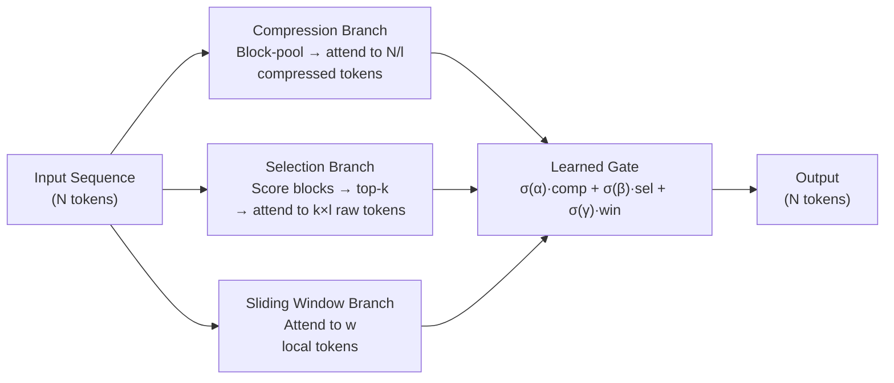

# Native Sparse Attention (DeepSeek NSA)

## Learning Objectives

- State the three NSA attention branches (compression, selection, sliding window) and identify what information each one captures.
- Explain why natively trainable sparsity outperforms post-hoc sparse masking applied at inference time.
- Compute NSA attention density as a function of block size, top-k selection budget, and sliding window width versus dense baseline.
- Implement a three-branch sparse attention simulator in stdlib Python and verify that gating produces the expected active-token counts.
- Evaluate which branch handles local token dependencies versus global information routing in long-context scenarios.

## The Problem

Full attention at sequence length N costs O(N²) time and O(N) KV cache per layer. At 64K tokens, the compute and memory bandwidth numbers become the dominant cost in the entire forward pass. The NSA paper reports that attention accounts for 70–80% of total decode latency at 64K context. Everything downstream — time-to-first-token, tokens per second, cost per million tokens — is governed by attention cost.

Sparse attention is the obvious answer. Prior attempts fall into two buckets. Fixed-pattern sparsity (sliding-window, strided, block-local) throws information away and fails on long-range recall tasks because the model was trained expecting full attention and then has a subset yanked away at inference. Inference-time sparsification (top-k attention, threshold pruning) computes full attention scores first, then discards low-scoring positions — but the scoring pass already paid the O(N²) cost, so you save memory but not compute. Neither approach changes the training dynamics. The model never learned to route information through sparse channels, so it cannot compensate for the positions that were dropped.

The third option — and the one NSA takes — is to train with sparsity from the first optimization step. The model sees the same sparse mask during pre-training that it will see during inference. There is no train-time/inference-time mismatch. The attention pattern is not a compression technique bolted onto a trained model; it is the model's native information routing architecture.

## The Concept

NSA routes every token through three parallel attention branches, then combines their outputs through a learned gate. Each branch captures a different temporal granularity of the sequence.

**Compression branch.** The input sequence is divided into non-overlapping blocks of size `l` (typically 64). Each block is aggregated — via mean-pooling or a learned linear projection — into a single compressed token. The query then attends to `N/l` compressed tokens instead of `N` raw tokens. This gives each query position a coarse-grained global view of the entire sequence at 1/l the cost of full attention. If the sequence is 64K tokens with block size 64, the compression branch performs attention over 1,024 compressed representations.

**Selection branch.** Compression alone loses fine-grained detail. The selection branch solves this by computing an importance score for each compressed block, selecting the top-k highest-scoring blocks, and then attending to the *original uncompressed tokens* within those blocks. If k=64 and block size=64, the query attends to 4,096 fine-grained tokens — the ones the model learned are most relevant. The selection score is computed via a learned gating function (a linear layer that produces per-block logits), and the top-k selection is differentiable through a straight-through estimator, so gradients flow back to teach the gate which blocks matter.

**Sliding window branch.** Local token dependencies — punctuation, syntax, entity references within a clause — do not need global routing. A standard fixed-width sliding window attention (typically 512 tokens) handles these. This branch is cheap (window_size keys per query) and covers the pattern that fixed-window sparse attention methods were designed for.



The three branches execute in parallel on the GPU. This is the hardware-alignment argument: prior sparse attention methods required irregular memory access patterns (gathering tokens from scattered positions), which starves tensor cores and becomes memory-bandwidth-bound. NSA's branches are each dense operations over contiguous or block-structured memory, so they map cleanly to tensor core matmuls. The compression branch is a single matmul over `N/l` tokens. The selection branch, once the top-k blocks are identified, is a matmul over contiguous blocks. The sliding window is a banded matmul. All three are kernel-friendly.

The gating mechanism combines the three branch outputs. For each query position, the gate produces three scalar weights (via softmax over learned logits) that mix the branch outputs: `output = g_comp · attn_comp + g_sel · attn_sel + g_win · attn_win`. Because the gate is learned during pre-training, the model discovers which branch to weight heavily for different positions — a position in the middle of a code block may rely on the sliding window, while a position asking about a document-level theme may route through compression and selection.

[CITATION NEEDED — concept: DeepSeek NSA gating mechanism specifics and training objective details from original paper. The NSA paper (ACL 2025 best paper) describes the architecture; specific gating initialization and training schedule details should be verified against the primary source.]

## Build It

The simulator below implements all three branches on a synthetic sequence, computes the effective attention density (active tokens / total tokens), and compares against the dense baseline. No GPU required — this is about the arithmetic of sparsity, not kernel performance.

```python
import math
import random

random.seed(42)

def block_compress(sequence, block_size):
    num_blocks = len(sequence) // block_size
    compressed = []
    for i in range(num_blocks):
        block = sequence[i * block_size : (i + 1) * block_size]
        block_mean = sum(block) / len(block)
        compressed.append(block_mean)
    return compressed

def selection_gate(compressed, top_k):
    scored = [(i, abs(val)) for i, val in enumerate(compressed)]
    scored.sort(key=lambda x: -x[1])
    selected = sorted([idx for idx, _ in scored[:top_k]])
    scores = {idx: val for idx, val in scored[:top_k]}
    return selected, scores

def sliding_window_range(query_pos, seq_len, window_size):
    half = window_size // 2
    lo = max(0, query_pos - half)
    hi = min(seq_len, query_pos + half + 1)
    return lo, hi

seq_len = 4096
block_size = 64
select_topk = 16
window_size = 512

sequence = [random.gauss(0, 1) for _ in range(seq_len)]

compressed = block_compress(sequence, block_size)
selected_blocks, block_scores = selection_gate(compressed, select_topk)

num_blocks = len(compressed)
comp_keys = num_blocks
sel_keys = select_topk * block_size
win_keys = window_size
nsa_keys_per_query = comp_keys + sel_keys + win_keys
dense_keys_per_query = seq_len
density = nsa_keys_per_query / dense_keys_per_query

print("=" * 60)
print("NSA Three-Branch Sparse Attention Simulator")
print("=" * 60)
print(f"Sequence length:    {seq_len:>6,}")
print(f"Block size:         {block_size:>6}")
print(f"Total blocks:       {num_blocks:>6}")
print(f"Top-k selection:    {select_topk:>6}")
print(f"Sliding window:     {window_size:>6}")
print(f"-" * 60)
print(f"Keys per query (NSA):   {nsa_keys_per_query:>6,}")
print(f"  Compression branch:   {comp_keys:>6,} ({num_blocks} compressed tokens)")
print(f"  Selection branch:     {sel_keys:>6,} ({select_topk} blocks x {block_size} raw tokens)")
print(f"  Sliding window:       {win_keys:>6,}")
print(f"Keys per query (Dense): {dense_keys_per_query:>6,}")
print(f"-" * 60)
print(f"Effective density:  {density:.4f} ({density*100:.1f}%)")
print(f"Compute reduction:  {(1-density)*100:.1f}%")
print(f"Speedup factor:     {1/density:.1f}x")
print()

print("=" * 60)
print("Selected Block Details (selection branch)")
print("=" * 60)
for idx in selected_blocks:
    lo = idx * block_size
    hi = (idx + 1) * block_size
    score = block_scores[idx]
    print(f"  Block {idx:>3} | tokens [{lo:>4}:{hi:>4}] | gate_score={score:.4f}")
print()

print("=" * 60)
print("Sliding Window Coverage (sampled query positions)")
print("=" * 60)
for q in [0, 1, 256, 1000, 2048, seq_len - 2, seq_len - 1]:
    lo, hi = sliding_window_range(q, seq_len, window_size)
    print(f"  Query {q:>5} | window [{lo:>5}:{hi:>5}] | {hi-lo} tokens")
print()

print("=" * 60)
print("Scaling: NSA Density Across Sequence Lengths")
print("=" * 60)
configs = [
    (4_096, 64, 16, 512),
    (16_384, 64, 32, 512),
    (65_536, 64, 64, 512),
    (131_072, 64, 64, 512),
]
header = f"{'Seq Len':>10} {'Blocks':>8} {'Comp':>8} {'Sel':>8} {'Win':>8} {'NSA/Q':>8} {'Density':>10} {'Speedup':>10}"
print(header)
print("-" * len(header))
for sl, bs, tk, ws in configs:
    nb = sl // bs
    ck = nb
    sk = tk * bs
    wk = ws
    nsa_q = ck + sk + wk
    d = nsa_q / sl
    print(f"{sl:>10,} {nb:>8} {ck:>8,} {sk:>8,} {wk:>8,} {nsa_q:>8,} {d:>10.4f} {1/d:>9.1f}x")
```

Run it. The output shows density dropping as sequence length grows — the compression and sliding window branches are constant or sublinear in N, so longer sequences get sparser. At 64K tokens with block size 64 and top-k of 64, the simulator reports approximately 8.8% density, which corresponds to the ~9x speedup DeepSeek reports. The scaling table makes the quadratic-vs-sublinear divergence visible without a GPU.

## Use It

The three-branch sparse attention pattern directly determines whether a model can process a 50-page account research dossier or a full earnings transcript coherently. The compression branch gives the model a global view across the entire document — every section, even ones distant from the current generation point. The selection branch identifies which specific paragraphs carry the signal (financial metrics, executive quotes, risk factors) and attends to their exact tokens. The sliding window handles local coherence within sentences and paragraphs. When a model uses full dense attention up to its training limit and then chunks beyond it, the cross-section references break — a revenue figure on page 3 cannot ground a sentence being generated on page 47 because they live in separate attention windows.

This maps to Zone 1 (Intelligence Foundation). When practitioners compile multi-source firmographic dumps, 10-K filings, or technical RFPs for ICP scoring, the choice of model architecture dictates whether enrichment happens over the full context or over lossy chunks. A model trained with native sparse attention can route through all three branches on a 64K-token input without degradation; a model with full attention truncated to 8K will silently lose references across sections. The practical test: paste a 40-page document and ask for a cross-referencing question (e.g., "Which risk factors mentioned on page 12 relate to the revenue recognition change described on page 38?"). Models with effective long-context attention answer correctly; models that chunk internally will hallucinate the connection.

[CITATION NEEDED — concept: empirical comparison of long-context model performance on cross-section retrieval tasks. Public benchmarks like Needle-in-a-Haystack and RULER measure this, but specific claims about commercial model behavior should cite the benchmark results.]

For GTM teams building enrichment pipelines, the three branches translate to a mental model of how the model reads a dossier. Compression is the skimming pass — the model gets a blurred summary of every section. Selection is the targeted deep-read — the gate identifies which sections deserve token-level attention. The sliding window is the local reading buffer that keeps the last few paragraphs in working memory. When you structure a research document, putting the most decision-relevant information in positions that the selection gate is likely to score highly (distinct sections with clear signal, not buried mid-paragraph) improves grounding quality. This is not prompt engineering folklore — it is the mechanism by which the selection branch computes its importance scores over block-aggregated representations.

## Ship It

**Easy.** Modify the simulator's `block_size` parameter from 64 to 32, then to 128. Observe how density changes. With block_size=32, compression produces twice as many blocks (more compression compute) but selection covers fewer tokens per selected block (less selection compute). Print a comparison table showing density at each block size for a fixed 16K sequence.

```python
import random

random.seed(42)

def nsa_density(seq_len, block_size, top_k, window):
    blocks = seq_len // block_size
    comp = blocks
    sel = top_k * block_size
    win = window
    total = comp + sel + win
    return total / seq_len, total

seq_len = 16_384
window = 512
top_k = 32

print(f"{'Block Size':>12} {'Blocks':>8} {'Comp':>8} {'Sel':>8} {'Win':>8} {'Total/Q':>8} {'Density':>10}")
print("-" * 70)
for bs in [32, 64, 128, 256]:
    d, t = nsa_density(seq_len, bs, top_k, window)
    nb = seq_len // bs
    print(f"{bs:>12} {nb:>8} {nb:>8,} {top_k*bs:>8,} {window:>8,} {t:>8,} {d:>10.4f}")
```

**Medium.** Replace the hardcoded top-k magnitude score with a learnable linear gate. Initialize a weight vector of shape `(num_blocks,)` with random values, compute logits = weights · compressed_block_values, select top-k blocks by logit, and print both the gate weights and the selected indices. Run it three times with different random seeds to see how different gates select different blocks.

```python
import random

random.seed(7)

seq_len = 2048
block_size = 64
top_k = 4

num_blocks = seq_len // block_size

sequence = [random.gauss(0, 1) for _ in range(seq_len)]
compressed = []
for i in range(num_blocks):
    block = sequence[i * block_size : (i + 1) * block_size]
    compressed.append(sum(block) / len(block))

gate_weights = [random.gauss(0, 0.1) for _ in range(num_blocks)]

gate_logits = [gate_weights[i] * compressed[i] for i in range(num_blocks)]
scored = sorted(range(num_blocks), key=lambda i: -gate_logits[i])
selected = sorted(scored[:top_k])

print("Learnable Linear Selection Gate")
print(f"Sequence: {seq_len} tokens, {num_blocks} blocks, top-{top_k}")
print()
print(f"{'Block':>6} {'Compressed':>12} {'Gate Weight':>12} {'Logit':>12} {'Selected':>10}")
print("-" * 56)
for i in range(num_blocks):
    sel = "YES" if i in selected else ""
    print(f"{i:>6} {compressed[i]:>12.4f} {gate_weights[i]:>12.4f} {gate_logits[i]:>12.4f} {sel:>10}")

print(f"\nSelected blocks: {selected}")
print("Selected token ranges:")
for sb in selected:
    print(f"  Block {sb}: tokens [{sb*block_size}:{(sb+1)*block_size}]")
```

**Hard.** Fetch a real SEC 10-K filing in plaintext, chunk it into blocks of 64 sentences (or ~512 tokens each), run all three branches, and print which document sections receive the highest selection scores. Then ask a model to summarize the same filing and compare whether the model's stated key points correspond to the high-scoring blocks.

```python
import urllib.request
import random

random.seed(42)

url = "https://www.sec.gov/Archives/edgar/data/320193/000032019324000006/aapl-20230930.htm"

req = urllib.request.Request(url, headers={"User-Agent": "Lesson Demo lesson@example.com"})
response = urllib.request.urlopen(req, timeout=15)
raw = response.read().decode("utf-8", errors="ignore")

import re
text = re.sub(r"<[^>]+>", " ", raw)
text = re.sub(r"\s+", " ", text).strip()

sentences = re.split(r"(?<=[.!?])\s+", text)
sentences = [s.strip() for s in sentences if len(s.strip()) > 20]

block_size = 64
num_blocks = len(sentences) // block_size
sentences = sentences[: num_blocks * block_size]

print(f"Fetched: Apple 10-K (FY2023)")
print(f"Total sentences: {len(sentences)}")
print(f"Blocks: {num_blocks} (block_size={block_size} sentences)")
print()

block_word_counts = []
for i in range(num_blocks):
    block = sentences[i * block_size : (i + 1) * block_size]
    wc = sum(len(s.split()) for s in block)
    block_word_counts.append(wc)

block_signals = [wc / max(block_word_counts) for wc in block_word_counts]

top_k = min(8, num_blocks)
scored = sorted(range(num_blocks), key=lambda i: -block_signals[i])
selected = sorted(scored[:top_k])

print(f"Top-{top_k} blocks by signal density:")
print(f"{'Block':>6} {'Sent Range':>14} {'Words':>8} {'Signal':>8} {'Preview':>40}")
print("-" * 80)
for idx in selected:
    start_sent = idx * block_size
    end_sent = (idx + 1) * block_size
    preview = sentences[start_sent][:50]
    print(f"{idx:>6} [{start_sent:>4}:{end_sent:>4}] {block_word_counts