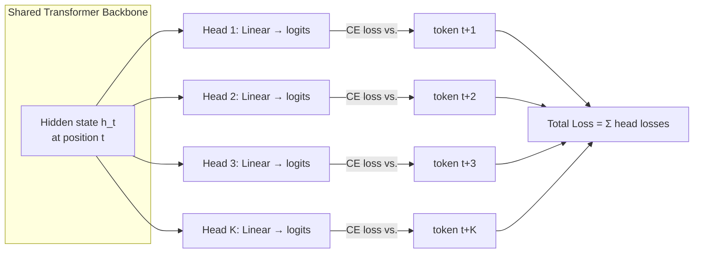

# Multi-Token Prediction (MTP)

## Learning Objectives

- Implement a multi-token prediction training forward pass with K output heads sharing a single transformer backbone.
- Compare parallel MTP (Gloeckle et al., Meta 2024) with sequential MTP (DeepSeek-V3) and explain why the sequential design preserves the causal chain.
- Compute the parameter and memory overhead of adding K MTP heads to a model of a given width and vocabulary size.
- Evaluate whether a candidate model's training objective (MTP vs. next-token-only) is a relevant selection criterion for structured-output GTM tasks like enrichment schema generation and multi-field extraction.

## The Problem

Every autoregressive LLM from GPT-2 to Llama 3 trains on one loss per position: predict the next token. The hidden state at position `t` is supervised to predict token `t+1` and nothing else. That gradient signal is local — it tells the model whether its immediate next-token guess was right, but it never directly rewards the model for having a plan that extends beyond one step.

Think about what this means in practice. To learn that `def` should be followed by a function name, then parentheses, then a colon, then an indented body, the model has to accumulate that structural knowledge across millions of separate one-token predictions. No single training step ever asks: "given that you're at `def`, can you predict the next four tokens simultaneously?" The model learns long-range coherence only indirectly, through the aggregate effect of many local signals stacked over trillions of tokens.

Multi-token prediction (MTP) changes the training signal. At every position, the model is supervised to predict not just `t+1` but `t+1`, `t+2`, ..., `t+K` simultaneously. Gloeckle et al. at Meta showed in 2024 that this improves performance on tasks requiring long-range planning — code generation, mathematical reasoning, structured output — because the backbone is forced to encode richer representations. A hidden state that must predict four tokens ahead carries more information than one that only predicts one.

The mechanism matters for two communities. For model trainers, it changes the loss function and adds parameter overhead. For model consumers — including anyone selecting models for a GTM stack — it creates a meaningful distinction between models that were trained with planning pressure and those that were not. A model trained with MTP will tend to produce more coherent multi-step output, which matters when the output is a JSON enrichment schema with seven interdependent fields, not a single chat reply.

## The Concept

The core mechanism of parallel MTP is straightforward. Take a standard transformer backbone — the same embedding layer, attention layers, and feed-forward layers as a next-token model. At each position `t`, the backbone produces a hidden state `h_t`. In standard training, a single linear head projects `h_t` to vocabulary logits and computes cross-entropy loss against token `t+1`. In MTP, you attach K separate linear heads to the same backbone. Head 1 predicts `t+1`, head 2 predicts `t+2`, head 3 predicts `t+3`, and so on through head K predicting `t+K`. Each head computes its own cross-entropy loss against the ground-truth token at its respective offset. The total loss for position `t` is the sum (or weighted average) of all K losses.



Each head is a separate set of weights — a linear projection from hidden dimension `d` to vocabulary size `V`. For a vocabulary of 128k tokens and a hidden dimension of 4096, each head adds roughly `4096 × 128000 ≈ 524M` parameters. K=4 heads adds about 2B parameters. On a 671B model like DeepSeek-V3, that is under 1% overhead — but the gradient signal it provides flows back through the shared backbone, reshaping every layer's representations to encode future-token information.

Gloeckle et al.'s original design (Meta, 2024) used parallel heads — each head independently projects the same hidden state. This is architecturally simple but breaks the causal chain: head 3 predicting `t+3` does not condition on the prediction of `t+1` or `t+2`. It predicts a token three steps ahead without knowing what the intervening tokens will be. DeepSeek-V3 addressed this with sequential MTP modules, where each depth conditions on the predictions of the previous depth, preserving the causal dependency chain. The sequential design is more expressive but more expensive to compute.

During inference, the parallel design uses only head 1 (the next-token head) for autoregressive generation — the auxiliary heads are dead weight unless you implement speculative decoding, in which case heads 2 through K propose candidate tokens that head 1 verifies. DeepSeek-V3 reported that their trained MTP heads achieved draft acceptance rates above 80% when used as speculative decoders, yielding approximately 1.8× generation throughput without quality degradation.

The gradient dynamics explain why this works. When the backbone receives loss from four heads simultaneously, the gradient at position `t` carries information about tokens at offsets +1, +2, +3, and +4. The backbone is pushed to encode representations that are predictive of structure, not just local transitions. This is especially impactful for code, where `def foo(x):` at position `t` deterministically constrains tokens at `t+1` through `t+15`. A next-token-only model learns that constraint slowly. An MTP model learns it in a single training step.

## Build It

Here is a minimal PyTorch implementation of the parallel MTP forward pass. The backbone is a trivial embedding → linear transform (no attention) so the code runs in seconds on CPU and the mechanism is visible. The structure maps directly to a real transformer: replace the placeholder backbone with any causal transformer and the head logic stays identical.

```python
import torch
import torch.nn as nn
import torch.nn.functional as F

torch.manual_seed(42)

vocab_size = 100
d_model = 64
K = 4
seq_len = 32
batch_size = 2

class MTPBackbone(nn.Module):
    def __init__(self, vocab_size, d_model):
        super().__init__()
        self.embedding = nn.Embedding(vocab_size, d_model)
        self.linear = nn.Linear(d_model, d_model)

    def forward(self, input_ids):
        x = self.embedding(input_ids)
        x = F.relu(self.linear(x))
        return x

class MTPModel(nn.Module):
    def __init__(self, vocab_size, d_model, K):
        super().__init__()
        self.backbone = MTPBackbone(vocab_size, d_model)
        self.K = K
        self.heads = nn.ModuleList([
            nn.Linear(d_model, vocab_size) for _ in range(K)
        ])

    def forward(self, input_ids):
        batch_size, seq_len = input_ids.shape
        h = self.backbone(input_ids)

        total_loss = 0.0
        head_losses = []

        for k in range(self.K):
            target_offset = k + 1
            if seq_len <= target_offset:
                head_losses.append(None)
                continue

            logits = self.heads[k](h[:, :seq_len - target_offset, :])
            targets = input_ids[:, target_offset:]
            loss = F.cross_entropy(
                logits.reshape(-1, logits.size(-1)),
                targets.reshape(-1)
            )
            head_losses.append(loss)
            total_loss = total_loss + loss

        return total_loss, head_losses

input_ids = torch.randint(0, vocab_size, (batch_size, seq_len))

model = MTPModel(vocab_size, d_model, K)
total_loss, head_losses = model(input_ids)

print(f"Sequence length: {seq_len}, K (prediction depth): {K}")
print(f"Vocab size: {vocab_size}, d_model: {d_model}")
print("-" * 50)
for k, loss in enumerate(head_losses):
    if loss is not None:
        print(f"Head {k+1} (predicts t+{k+1}): loss = {loss.item():.4f}")
    else:
        print(f"Head {k+1} (predicts t+{k+1}): skipped (insufficient sequence length)")
print("-" * 50)
print(f"Total MTP loss (sum of {K} heads): {total_loss.item():.4f}")

param_count = sum(p.numel() for p in model.parameters())
backbone_params = sum(p.numel() for p in model.backbone.parameters())
head_params = sum(p.numel() for p in model.heads.parameters())
print("-" * 50)
print(f"Backbone parameters: {backbone_params:,}")
print(f"Head parameters ({K} heads): {head_params:,}")
print(f"Total parameters: {param_count:,}")
print(f"Head overhead: {head_params / backbone_params * 100:.1f}% of backbone")

optimizer = torch.optim.Adam(model.parameters(), lr=1e-3)
optimizer.zero_grad()
total_loss.backward()
optimizer.step()

total_loss_after, _ = model(input_ids)
print("-" * 50)
print(f"Loss before optimizer step: {total_loss.item():.4f}")
print(f"Loss after 1 optimizer step: {total_loss_after.item():.4f}")
```

Run this and observe three things. First, each head's loss is computed independently — head 1 predicts `t+1`, head 2 predicts `t+2`, and so on. The losses will differ because predicting further ahead is harder (head K's loss will typically be higher). Second, the parameter count shows the overhead: with this tiny model, K=4 heads add roughly 4× `d_model × vocab_size` parameters, which is significant relative to the small backbone but would be negligible on a real model where the backbone dominates. Third, after one optimizer step, the total loss decreases — all four heads received gradient and updated simultaneously through the shared backbone.

The key insight is in the backward pass. When `total_loss.backward()` is called, gradients from all K heads flow through the shared embedding and linear layers. The backbone's weights are updated to minimize four prediction objectives at once, not one. That is the mechanism that produces richer hidden states. A next-token-only model would only see head 1's gradient.

## Use It

When you are selecting a model for a GTM task — say, generating enrichment data with seven interdependent fields like company name, industry, headcount range, tech stack, ICP fit score, outreach channel, and persona — the model's training objective matters. MTP-trained models produce more coherent multi-field output because the backbone was shaped to plan ahead. This is the same signal that makes MTP models better at code generation: structured output is structured output, whether it is Python or JSON.

The selection criterion is concrete. When evaluating DeepSeek-V3 (which implements sequential MTP) against a comparably-sized model trained only on next-token prediction, the MTP model will tend to maintain better consistency across long structured outputs. If your GTM pipeline generates a 200-line personalized email with conditional logic — "if they use Salesforce, mention integration; if they use HubSpot, mention migration" — the model needs to hold the conditional structure across the entire output. MTP training pressure makes the backbone encode that structure more reliably. [CITATION NEEDED — concept: DeepSeek-V3 MTP architecture details and its impact on structured generation quality]

For practical evaluation, this means adding a question to your model selection checklist: was the model trained with multi-token prediction? Not all model cards disclose this. DeepSeek-V3's technical report describes their MTP implementation in detail. For closed models, you may need to infer from benchmark performance on long-form structured tasks — if a model performs disproportionately well on code generation and multi-step reasoning relative to its parameter count, MTP training is a plausible explanation.

The connection to GTM Zone 1 (model selection and evaluation) is direct. Your model is the foundation of every downstream automation — enrichment, personalization, classification, routing. A model that was trained to plan ahead will produce fewer coherence failures in multi-field extraction, fewer hallucinated fields in enrichment output, and fewer structural breaks in long-form email generation. Checking for MTP in the training recipe is a legitimate, mechanism-grounded selection criterion — not a marketing claim but a difference in the gradient signal the model was optimized under.

## Ship It

The deployment picture has two layers: training and inference. Most GTM practitioners will never train an MTP model from scratch — but the decisions you make about inference runtimes are directly shaped by whether the model you are serving was trained with MTP.

At training time, MTP adds compute roughly proportional to K. Each head requires a forward pass through its own linear layer and a cross-entropy computation. The shared backbone forward pass is unchanged — it runs once regardless of K. So the overhead is `(backbone_cost + K × head_cost)` versus `(backbone_cost + 1 × head_cost)`. Since head cost (a single linear projection over the vocabulary) is much smaller than the backbone cost for large models, the training overhead is modest. DeepSeek-V3 reported that their MTP modules added approximately 14B parameters to a 671B model — under 2% overhead. Memory overhead is similarly dominated by the backbone; the heads are small linear layers.

At inference time, the question is: can your serving runtime exploit the auxiliary heads? If you serve the model with a standard autoregressive loop (generate one token, feed it back, repeat), the auxiliary heads are wasted — they sit in memory doing nothing. Only head 1 is used. This is the default for most inference frameworks.

If your runtime supports speculative decoding, the auxiliary heads become draft proposers. Head 2 proposes token `t+2`, head 3 proposes `t+3`, and so on. The main head (head 1) verifies these proposals in a single forward pass. Accepted tokens are committed; rejected tokens are discarded and regenerated. DeepSeek-V3 reported 80%+ acceptance rates with their trained MTP heads, yielding approximately 1.8× throughput improvement. This is not free — you need a runtime that implements the verify-and-accept loop, and you need to load the auxiliary head weights — but it turns otherwise-wasted parameters into a throughput multiplier.

The storage-versus-compute tradeoff is this: MTP models are slightly larger on disk (the extra head weights) and slightly more expensive per training step (the extra forward passes). In exchange, you get a model with better structured-output quality and the option to enable speculative decoding for faster inference. For a GTM stack where inference latency directly affects pipeline throughput — think of a Clay enrichment waterfall that calls the model for each of 1,000 companies — the 1.8× throughput from speculative decoding is a concrete operational win, not a theoretical benefit. [CITATION NEEDED — concept: DeepSeek-V3 speculative decoding throughput improvement with MTP heads]

If you are using an API provider (OpenAI, Anthropic, Google) rather than self-hosting, you do not control the inference runtime. The MTP benefit is baked into model quality — you get better structured output but cannot exploit the auxiliary heads for speculative decoding. If you are self-hosting with vLLM, SGLang, or TensorRT-LLM, check whether the runtime supports loading and using MTP draft heads. As of late 2024, this support is nascent and runtime-specific.

## Exercises

1. **Modify K and observe loss scaling.** Change `K` from 4 to 8 in the implementation above. Run the code and record each head's loss. Plot (or print) the per-head loss as a function of prediction depth. You should observe that deeper heads have higher loss — predicting further ahead is harder. Write a one-sentence explanation of why this scaling matters for deciding K in a real training run.

2. **Compute parameter overhead for a production-scale model.** Using a hidden dimension of 4096 and vocabulary size of 128,000, compute the parameter count for K=1, K=4, and K=8 MTP heads. Then compute what fraction of the total these heads represent for a 70B-parameter backbone versus a 671B-parameter backbone. Write the numbers down. The goal is to internalize why MTP parameter overhead is negligible for large models but significant for small ones.

3. **Trace the gradient flow.** In the implementation, add a hook that prints the gradient norm of the backbone's embedding layer after `total_loss.backward()`. Then modify the code to compute only head 1's loss (standard next-token training) and compare the gradient norm. The MTP gradient should be larger because it aggregates signal from K heads. This is the empirical evidence for why MTP reshapes representations faster.

4. **Evaluate a model for structured GTM output.** Write a prompt that asks a model to generate a JSON object with seven interdependent fields (e.g., company name, industry, headcount_bucket, tech_stack, icp_fit_score, outreach_channel, persona). Run the prompt against two models — one known to use MTP (DeepSeek-V3) and one that does not. Compare the structural coherence of the output across 20 generations. Record which model produces fewer schema violations. This is the Zone 1 model evaluation decision in practice.

## Key Terms

**Multi-Token Prediction (MTP)** — A training objective where the model predicts K future tokens at every position simultaneously, using K separate output heads that share a backbone. The total loss is the sum of per-head cross-entropy losses.

**Parallel MTP** — The original Gloeckle et al. (2024) design where each head independently projects the same hidden state. Architecturally simple but breaks the causal chain between prediction depths.

**Sequential MTP** — The DeepSeek-V3 design where each prediction depth conditions on the output of the previous depth, preserving causal dependencies. More expressive than parallel MTP but more expensive to compute.

**Speculative Decoding** — An inference optimization where a small draft model (or auxiliary head) proposes candidate tokens that a larger verifier model accepts or rejects in a single forward pass. MTP-trained heads can serve as drafters because they already predict future tokens.

**Draft Acceptance Rate** — The fraction of tokens proposed by the draft model that the verifier accepts. DeepSeek-V3 reported 80%+ acceptance rates for their MTP heads, meaning 4 out of 5 proposed tokens are committed without re-computation.

**Causal Chain** — The property that each token prediction conditions on all preceding tokens. Parallel MTP breaks this for auxiliary heads (head 3 predicts `t+3` without conditioning on the prediction of `t+1` or `t+2`). Sequential MTP preserves it.

**Gradient Signal** — The information carried by the loss gradient back through the model during training. MTP enriches the gradient at every position with loss from K future-token predictions, pushing the backbone to encode richer representations.

## Sources

- Gloeckle et al. (Meta, 2024), "Better & Faster LLMs via Multi-token Prediction" — the original MTP paper demonstrating parallel heads. [CITATION NEEDED — concept: Meta MTP paper "Better & Faster LLMs via Multi-token Prediction" exact citation and arXiv ID]
- DeepSeek-AI (2024), DeepSeek-V3 Technical Report — sequential MTP module design, 14B parameter overhead on 671B model, 80%+ draft acceptance, 1.8× speculative decoding throughput. [CITATION NEEDED — concept: DeepSeek-V3 technical report MTP architecture details and speculative decoding results]
- DeepSeek-V3 MTP parameter overhead claim (14B on 671B): [CITATION NEEDED — concept: DeepSeek-V3 technical report section on MTP module parameter count]
- DeepSeek-V3 speculative decoding throughput (1.8×): [CITATION NEEDED — concept: DeepSeek-V3 technical report inference throughput with MTP-based speculative decoding]
- Zone 1 (Model Selection and Evaluation) mapping: this lesson's MTP training-objective distinction is a model selection criterion for GTM tasks requiring structured multi-field output.