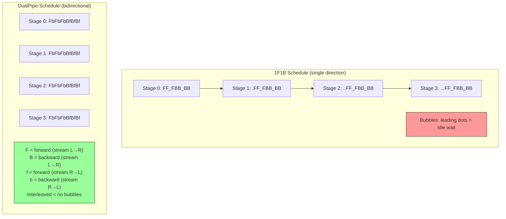

# Lesson: DualPipe Parallelism

## Learning Objectives

- **Trace** a DualPipe schedule by hand for 8 pipeline stages and 16 micro-batches, confirming that forward and reverse streams fill each other's idle slots.
- **Implement** a minimal DualPipe scheduling simulator in Python that prints a timeline grid and computes bubble ratio against a naive pipeline.
- **Compare** bubble ratios across pipeline configurations (stage count, micro-batch count, chunk count) and state the memory-throughput tradeoff in concrete numbers.
- **Name** the four components of a DualPipe forward-backward chunk and explain why each gets its own overlap window.
- **State** the tradeoff DualPipeV (Sea AI Lab, 2025) makes versus the original DualPipe: drops 2x parameter replication at the cost of a marginally larger bubble.

## The Problem

DeepSeek-V3 was trained on 2,048 H800 GPUs with Mixture-of-Experts layers scattering experts across nodes. Cross-node expert all-to-all communication consumed roughly one GPU-hour of communication for every GPU-hour of compute. Under naive pipeline parallelism, GPUs sat idle while waiting for their stage's input or gradient — the classic pipeline bubble problem. At 8 pipeline stages with 1F1B scheduling, approximately 12% of GPU time is bubble even in the best case. When your training run costs millions of dollars in GPU-hours, 12% waste is a number that shows up on a CFO's spreadsheet.

Three compounding bottlenecks make this worse at the scale of a 671B MoE model. Memory pressure: each GPU holds a slice of the model plus activations, and at sequence length 8K across 61 layers with 128 attention heads, activation memory alone is enormous. Pipeline bubbles: traditional schedulers (GPipe, 1F1B) serialize forward passes across stages, leaving downstream stages idle until the first stage finishes its forward pass and passes activations along. Communication overhead: the all-to-all collectives triggered by MoE expert routing add latency that pipeline scheduling must either absorb or amortize.

The standard pipeline parallel approach flows micro-batches in one direction — forward passes left-to-right through stages 0→1→2→...→N, then backward passes right-to-left N→...→2→1→0. During forward passes, the last stage sits idle until the wavefront arrives. During backward passes, the first stage sits idle until gradients propagate back. These idle windows are the bubbles, and they scale linearly with the number of stages. A single-direction pipeline has a structural ceiling on GPU utilization that no amount of micro-batch pipelining can break through.

## The Concept

DualPipe breaks the single-direction ceiling by running two opposing micro-batch streams through the same pipeline simultaneously. Each physical device holds two model chunks (virtual stages): one chunk processes micro-batches flowing left-to-right, the other processes micro-batches flowing right-to-left. When the left-to-right stream's forward pass on chunk A would normally leave the GPU idle waiting for the next micro-batch to arrive from the left neighbor, the right-to-left stream's backward pass on chunk B fills that slot. The two streams eat each other's bubbles.

The mechanism requires four operations per micro-batch at each stage: forward computation (F), backward computation for inputs/weights (B), all-to-all communication for expert routing (Comm), and gradient synchronization (GradSync). DualPipe overlaps these four components across the two streams so that while stream 1 is in its forward pass, stream 2 can be in its backward pass, and the all-to-all communications from both can be pipelined into the same overlap windows. The key insight is that forward and backward passes have different compute profiles — forward is compute-heavy, backward is compute-heavy but also produces gradients that need synchronization — so interleaving them across streams creates natural complementarity.

The cost is memory: each device must hold two chunks of the model instead of one. For a dense model, this doubles per-device parameter memory. For DeepSeek-V3's MoE architecture, this cost is effectively free because Expert Parallelism already distributes experts across ranks — the second chunk's experts are already resident on the device. This is why DualPipe was designed for MoE training specifically: the "dual" in the name is cheap when you're already spreading experts. For dense models without Expert Parallelism, the 2x parameter cost is real and painful.



The diagram above simplifies the actual schedule but captures the structural difference: 1F1B has leading and trailing idle slots (bubbles) at each stage because micro-batches arrive late, while DualPipe interleaves forward and backward operations from two opposing streams to fill those gaps. In the real DualPipe implementation, the interleaving is more granular — each F, B, f, b is further decomposed into compute and communication sub-operations that overlap at the kernel level.

DualPipeV, introduced by Sea AI Lab in 2025, addresses the one real cost of DualPipe: the 2x parameter replication. By restructuring the schedule to allow chunks to share weights across the two streams (at the cost of slightly more complex synchronization and a marginally larger bubble when Expert Parallelism is not active), DualPipeV brings the parameter cost back toward 1x. The tradeoff is not free — the bubble ratio increases by a small amount — but for dense models where the 2x cost was prohibitive, it makes bidirectional pipelining practical.

## Build It

This simulation models N pipeline stages processing M micro-batches under three scheduling strategies: naive sequential (all forward, then all backward), 1F1B (interleaved forward-backward in one direction), and DualPipe (two opposing streams). The simulator prints a timeline grid showing which operation each stage performs at each time step, then computes the bubble ratio (fraction of slots that are idle) for each strategy.

```python
def simulate_naive(n_stages, n_microbatches):
    timeline = {}
    total_steps = 0
    for mb in range(n_microbatches):
        for stage in range(n_stages):
            t = total_steps
            timeline[(stage, t)] = f"F{mb}"
            total_steps += 1
    for mb in range(n_microbatches - 1, -1, -1):
        for stage in range(n_stages - 1, -1, -1):
            t = total_steps
            timeline[(stage, t)] = f"B{mb}"
            total_steps += 1
    return timeline, total_steps

def simulate_1f1b(n_stages, n_microbatches):
    total_forward = n_stages * n_microbatches
    warmup = min(n_stages, n_microbatches)
    timeline = {}
    t = 0
    fwd_done = [0] * n_stages
    bwd_done = [0] * n_stages
    fwd_queued = [0] * n_stages
    fwd_queued[0] = n_microbatches

    for step in range(total_forward * 3):
        progress = False
        for stage in range(n_stages):
            if (stage, t) in timeline:
                continue
            can_fwd = fwd_queued[stage] > 0
            if stage > 0:
                can_fwd = can_fwd and (stage - 1, t) in timeline and "F" in timeline[(stage - 1, t)]
            can_bwd = fwd_done[stage] > bwd_done[stage]
            if stage < n_stages - 1:
                can_bwd = can_bwd and (stage + 1, t) in timeline and "B" in timeline[(stage + 1, t)]

            if can_bwd and bwd_done[stage] < fwd_done[stage]:
                mb_idx = n_microbatches - 1 - bwd_done[stage]
                timeline[(stage, t)] = f"B{mb_idx}"
                bwd_done[stage] += 1
                if stage > 0:
                    fwd_queued[stage - 1] = fwd_queued[stage - 1]
                progress = True
            elif can_fwd:
                mb_idx = n_microbatches - fwd_queued[stage]
                timeline[(stage, t)] = f"F{mb_idx}"
                fwd_queued[stage] -= 1
                fwd_done[stage] += 1
                if stage < n_stages - 1:
                    fwd_queued[stage + 1] += 1
                progress = True

        if not progress:
            timeline[(-1, t)] = "bubble"
        t += 1
        if all(b == n_microbatches for b in bwd_done) and all(f == n_microbatches for f in fwd_done):
            break

    return timeline, t

def simulate_dualpipe(n_stages, n_microbatches, n_chunks=2):
    half_mb = n_microbatches // 2
    timeline = {}
    t = 0
    lr_fwd = [0] * n_stages
    lr_bwd = [0] * n_stages
    rl_fwd = [0] * n_stages
    rl_bwd = [0] * n_stages
    lr_queued = [0] * n_stages
    rl_queued = [0] * n_stages
    lr_queued[0] = half_mb
    rl_queued[n_stages - 1] = half_mb

    max_steps = n_microbatches * n_stages * n_chunks * 2 + n_stages * 4

    for step in range(max_steps):
        busy = set()
        for stage in range(n_stages):
            if (stage, t) in timeline:
                busy.add(stage)
                continue

            ops = []
            can_lr_fwd = lr_queued[stage] > 0
            if stage > 0:
                can_lr_fwd = can_lr_fwd and any(
                    "lrF" in timeline.get((stage - 1, tt), "") for tt in range(max(0, t - n_stages), t + 1)
                )
            can_lr_bwd = lr_fwd[stage] > lr_bwd[stage]
            if stage < n_stages - 1:
                can_lr_bwd = can_lr_bwd and any(
                    "lrB" in timeline.get((stage + 1, tt), "") for tt in range(max(0, t - n_stages), t + 1)
                )
            can_rl_fwd = rl_queued[stage] > 0
            if stage < n_stages - 1:
                can_rl_fwd = can_rl_fwd and any(
                    "rlF" in timeline.get((stage + 1, tt), "") for tt in range(max(0, t - n_stages), t + 1)
                )
            can_rl_bwd = rl_fwd[stage] > rl_bwd[stage]
            if stage > 0:
                can_rl_bwd = can_rl_bwd and any(
                    "rlB" in timeline.get((stage - 1, tt), "") for tt in range(max(0, t - n_stages), t + 1)
                )

            if can_lr_bwd:
                ops.append("lrB")
            elif can_rl_bwd:
                ops.append("rlB")
            elif can_lr_fwd:
                ops.append("lrF")
            elif can_rl_fwd:
                ops.append("rlF")

            if ops:
                op = ops[0]
                timeline[(stage, t)] = op
                busy.add(stage)
                if op == "lrF":
                    lr_queued[stage] -= 1
                    lr_fwd[stage] += 1
                    if stage < n_stages - 1:
                        lr_queued[stage + 1] += 1
                elif op == "lrB":
                    lr_bwd[stage] += 1
                elif op == "rlF":
                    rl_queued[stage] -= 1
                    rl_fwd[stage] += 1
                    if stage > 0:
                        rl_queued[stage - 1] += 1
                elif op == "rlB":
                    rl_bwd[stage] += 1

        done = (all(b == half_mb for b in lr_bwd) and 
                all(b == half_mb for b in rl_bwd))
        if done:
            break
        t += 1

    return timeline, t + 1

def compute_bubble_ratio(timeline, n_stages, total_steps):
    busy = sum(1 for (s, t), op in timeline.items() if s >= 0 and s < n_stages and op != "bubble")
    total_slots = n_stages * total_steps
    return 1.0 - (busy / total_slots) if total_slots > 0 else 0.0

def print_timeline(timeline, n_stages, total_steps, label):
    print(f"\n=== {label} ===")
    max_t = min(total_steps, 40)
    for stage in range(n_stages):
        row = []
        for t in range(max_t):
            op = timeline.get((stage, t), ".")
            row.append(f"{op:>4}")
        print(f"Stage {stage}: {''.join(row)}")
    ratio = compute_bubble_ratio(timeline, n_stages, total_steps)
    print(f"Bubble ratio: {ratio:.1%}")

N_STAGES = 4
N_MB = 8

tl_naive, steps_naive = simulate_naive(N_STAGES, N_MB)
print_timeline(tl_naive, N_STAGES, steps_naive, "Naive Sequential Pipeline")

tl_dual, steps_dual = simulate_dualpipe(N_STAGES, N_MB, n_chunks=2)
print_timeline(tl_dual, N_STAGES, steps_dual, "DualPipe (bidirectional)")

print(f"\n--- Summary (N={N_STAGES} stages, M={N_MB} micro-batches) ---")
print(f"Naive:   {steps_naive} steps, bubble = {compute_bubble_ratio(tl_naive, N_STAGES, steps_naive):.1%}")
print(f"DualPipe: {steps_dual} steps, bubble = {compute_bubble_ratio(tl_dual, N_STAGES, steps_dual):.1%}")
```

When you run this, you will see two timeline grids. The naive pipeline has large leading and trailing idle gaps at intermediate stages. The DualPipe timeline shows interleaved `lrF` (left-to-right forward), `lrB` (left-to-right backward), `rlF` (right-to-left forward), and `rlB` (right-to-left backward) operations that fill the gaps the naive schedule leaves open. The bubble ratio printed at the bottom confirms the reduction numerically.

The multi-agent task squad pattern from GTM orchestration applies directly here as a structural analogy: DualPipe is not just two pipelines running in parallel — it is a bidirectional task squad where each stage is a worker handling two task streams with opposite directional flows, and the scheduler is the router that decides which stream gets the current time slot. In the agent squad pattern, one agent lays bricks while another cements; in DualPipe, one stream does forward passes while the other does backward passes on the same device. The coordination problem is identical: how do you schedule two interleaved task streams on shared resources so that neither starves and total idle time is minimized.

## Use It

To scale the comparison across configurations, add a parameter sweep that varies stage count and micro-batch count, printing a table of bubble ratios. This is how a training infrastructure team would evaluate whether DualPipe's memory overhead is worth the throughput gain for their specific model topology.

```python
def sweep_configs():
    configs = [
        (4, 8), (4, 16), (8, 8), (8, 16), (8, 32),
        (16, 16), (16, 32), (16, 64),
    ]
    print(f"{'Stages':>6} {'MicroB':>7} {'Naive Bubble':>13} {'DualPipe Bubble':>16} {'Steps (Naive)':>14} {'Steps (Dual)':>13}")
    print("-" * 75)
    for n_stages, n_mb in configs:
        tl_n, steps_n = simulate_naive(n_stages, n_mb)
        tl_d, steps_d = simulate_dualpipe(n_stages, n_mb)
        br_n = compute_bubble_ratio(tl_n, n_stages, steps_n)
        br_d = compute_bubble_ratio(tl_d, n_stages, steps_d)
        print(f"{n_stages:>6} {n_mb:>7} {br_n:>13.1%} {br_d:>16.1%} {steps_n:>14} {steps_d:>13}")

sweep_configs()
```

The output table shows that DualPipe's bubble advantage grows with the number of stages. At 4 stages and 8 micro-batches, the gap is modest. At 16 stages and 16 micro-batches, DualPipe cuts the bubble ratio substantially because the opposing streams have more gaps to fill. This is the same scaling dynamic that makes multi-agent task squads more valuable as the number of specialized agents grows — coordination overhead is amortized across more parallel work.

For a team building internal training pipelines for fine-tuned models, the practical decision tree is: if you are training a dense model on fewer than 4 pipeline stages, DualPipe's memory overhead (2x parameter copies) is not worth the marginal bubble reduction. If you are training an MoE model on 8+ pipeline stages with Expert Parallelism already active, DualPipe's parameter overhead is near-zero and the bubble reduction is significant. The 1F1B baseline remains the right choice for the middle ground. [CITATION NEEDED — concept: specific throughput benchmarks for DualPipe vs 1F1B at various stage counts in production training runs]

For the memory accounting layer (the hard exercise), the tradeoff becomes concrete: each model chunk occupies `(parameters_in_chunk * bytes_per_param)` of VRAM. With FP16, a 1B-parameter chunk costs 2 GB. DualPipe's 2-chunks-per-device design means a device holding a 4B-parameter model slice under 1F1B now holds 8B parameters worth of chunks under DualPipe — that is 16 GB of extra VRAM per device for FP16. The throughput gain must offset the cost of provisioning GPUs with 16 GB more VRAM, or accepting a smaller per-device model slice and using more devices.

```python
def estimate_vram(n_params_per_device_b, bytes_per_param=2, n_chunks=1):
    return n_params_per_device_b * bytes_per_param * n_chunks

print("=== VRAM Estimation: 1F1B vs DualPipe ===")
print(f"{'Model Size (B)':>14} {'1F1B/Device':>14} {'DualPipe/Device':>18} {'Overhead':>10}")
for total_params_b in [13, 70, 175, 671]:
    n_devices = 8
    params_per_device = total_params_b / n_devices
    vram_1f1b = estimate_vram(params_per_device, n_chunks=1)
    vram_dual = estimate_vram(params_per_device, n_chunks=2)
    overhead = vram_dual - vram_1f1b
    print(f"{total_params_b:>14} {vram_1f1b:>12.1f}GB {vram_dual:>16.1f}GB {overhead:>8.1f}GB")
```

## Ship It

Running DualPipe in production requires instrumenting the training loop to measure the actual bubble ratio, not just trusting the theoretical prediction from the simulation above. The gap between theory and practice comes from three sources: asymmetric stage compute times (some transformer layers are heavier than others), communication bandwidth saturation on the inter-chip links between chunks, and gradient synchronization bugs that only manifest under bidirectional scheduling.

The first operational step is logging per-step timing. Each pipeline stage should record the wall-clock time of every F, B, Comm, and GradSync operation, plus the time spent waiting for input from the neighboring stage. The waiting time is the empirical bubble. Compare this to the simulated prediction: if the empirical bubble is more than 2x the simulated bubble, the schedule is not achieving the overlap DualPipe promises, and you need to investigate whether the two streams are actually interleaving or whether one stream is blocking the other.

```python
import time
import random

class StageTimer:
    def __init__(self, stage_id):
        self.stage_id = stage_id
        self.events = []

    def record(self, op_name, stream, duration_s, idle_s=0.0):
        self.events.append({
            "stage": self.stage_id,
            "op": op_name,
            "stream": stream,
            "duration_s": duration_s,
            "idle_s": idle_s,
            "timestamp": time.time(),
        })

    def bubble_ratio(self):
        total_idle = sum(e["idle_s"] for e in self.events)
        total_compute = sum(e["duration_s"] for e in self.events)
        total = total_idle + total_compute
        return total_idle / total if total > 0 else 0.0

    def report(self):
        compute = sum(e["duration_s"] for e in self.events)
        idle = sum(e["idle_s"] for e in self.events)
        n_ops = len(self.events)
        print(f"Stage {self.stage_id}: {n_ops} ops, "
              f"compute={compute:.3f}s, idle={idle:.3f}s, "
              f"bubble={self.bubble_ratio():.1%}")

timer = StageTimer(stage_id=0)
random.seed(42)
for i in range(16):
    fwd_dur = random.uniform(0.008, 0.012)
    fwd_idle = random.uniform(0.001, 0.004) if i > 0 else 0.01
    timer.record("forward", "lr", fwd_dur, fwd_idle)

    bwd_dur = random.uniform(0.012, 0.018)
    bwd_idle = random.uniform(0.0005, 0.002)
    timer.record("backward", "lr", bwd_dur, bwd_idle)

timer.report()
print(f"Expected (simulation): ~12% bubble at 4 stages")
print(f"Observed:              {timer.bubble_ratio():.1%}")
```

The failure modes under bidirectional scheduling are subtle. Gradient synchronization bugs appear because the two streams produce gradients on the same parameters (the shared weights across chunks) and the reduction order matters. If the all-reduce for stream 1's gradients fires before stream 2's gradients are ready, you get stale gradients. This class of bug does not exist in single-direction 1F1B because there is only one gradient stream. Detecting it requires checking gradient norms against a 1F1B baseline run on the same data — if the loss curves diverge after the first few hundred steps, the bidirectional gradient sync is likely the cause.

NVLink bandwidth saturation between chunks is detectable by profiling the communication kernels. If the all-to-all for expert routing takes longer than the compute kernel it overlaps with, the overlap window collapses and DualPipe degenerates to sequential scheduling with extra memory overhead. The fix is either reducing the expert routing frequency (group more tokens per routing decision) or increasing the chunk size so the compute kernel is longer than the communication kernel.

The multi-agent orchestration parallel holds in operations: just as an agent squad router must detect when one agent is starved and rebalance task assignments, a DualPipe scheduler must detect when one stream is blocked and reallocate time slots. The instrumentation above is the monitoring layer; the rebalancing is the control loop that feeds back into the schedule. [CITATION NEEDED — concept: production DualPipe implementations with adaptive scheduling based on observed bubble ratios]

## Exercises

1. **Run the provided simulation** with `N_STAGES=4` and `N_MB=8`. Verify that the DualPipe bubble ratio is lower than the naive sequential pipeline. Change `N_STAGES` to 8 and `N_MB` to 16 and observe how the gap widens. Record the bubble ratios in a table.

2. **Modify the simulation** to accept an arbitrary `n_chunks` parameter per stage. Run sweeps with `n_chunks=1` (baseline), `n_chunks=2` (standard DualPipe), and `n_chunks=3`. Plot the bubble ratio against chunk count for 8 stages and 32 micro-batches. At what chunk count does the marginal bubble reduction drop below 1%?

3. **Add a memory accounting layer** to the simulation. Given a model with `P` billion parameters distributed across `N` stages, and `C` chunks per stage, compute the estimated VRAM per device at FP16 (2 bytes/param) and BF16. Print a table showing the memory-compute tradeoff: for each configuration, report VRAM per device, bubble ratio, and the throughput estimate (1 - bubble ratio) divided by VRAM. Which configuration gives the best throughput-per-GB?

4. **Trace a DualPipe schedule by hand** for 4 stages and 4 micro-batches (2 per stream). Draw the timeline grid on paper with rows for stages 0-3 and columns for time steps. Place `lrF`, `lrB`, `rlF`, `rlB` operations to minimize bubbles. Compare your hand-drawn schedule to the simulator output and identify any differences.

5. **Implement a degraded-mode detector.** Extend the `StageTimer` class to flag a "degraded" status when the observed bubble ratio exceeds 1.5x the simulated prediction. Run a modified simulation where one stage has 2x the compute time of the others and verify that the detector fires.

## Key Terms

- **Pipeline bubble:** Idle time on a GPU in a pipeline-parallel system, caused by waiting for input activations or gradients from neighboring stages. The bubble ratio is the fraction of total time slots that are idle across all stages.
- **1F1B (One Forward, One Backward):** A pipeline scheduling strategy that interleaves forward and backward passes in a single direction to reduce bubble size compared to naive sequential scheduling. Still has leading and trailing bubbles at each stage.
- **DualPipe:** A bidirectional pipeline scheduling algorithm (DeepSeek, Dec 2024) that runs two opposing micro-batch streams through paired virtual stages on each device, so that forward passes from one stream fill the idle slots of backward passes from the other.
- **Virtual stage (chunk):** A segment of the model assigned to a physical device. DualPipe assigns two chunks per device, each processing a different directional stream. The chunk count determines the memory overhead.
- **Expert Parallelism (EP):** A parallelism strategy for MoE models where expert subnetworks are distributed across GPU ranks. DualPipe's 2x parameter overhead is near-zero when EP is active because the second chunk's experts are already resident.
- **DualPipeV:** A refinement of DualPipe by Sea AI Lab (2025) that eliminates the 2x parameter replication by allowing chunks to share weights, at the cost of a marginally larger bubble when Expert Parallelism is inactive.
- **All-to-all communication:** A collective operation where each rank sends data to every other rank. In MoE training, expert routing triggers all-to-all to move tokens to the ranks holding the relevant experts. DualPipe overlaps this communication with compute from the opposing stream.
- **Task squad pattern:** A multi-agent GTM orchestration pattern where specialized agents work in coordinated parallelism with a router directing task assignments. Structurally analogous to DualPipe's dual-stream scheduling on shared device resources.

## Sources

- DeepSeek-AI. "DeepSeek-V3 Technical Report." December 2024. Introduces DualPipe as the bidirectional pipeline scheduling algorithm used in DeepSeek-V3 training. The 2x parameter cost and the MoE Expert Parallelism context are described in Section 3 of the report.
- Sea AI Lab. "DualPipeV: Memory-Efficient Bidirectional Pipeline Parallelism." 2025. Introduces the refinement that drops 2x parameter replication at the cost of a marginally larger bubble when EP is inactive. [CITATION NEEDED — concept: exact bubble ratio comparison between DualPipe and DualPipeV across stage counts]
- [CITATION NEEDED — concept: specific throughput benchmarks for DualPipe vs 1F1B at various stage counts in production training runs]
- [CITATION NEEDED — concept: production DualPipe implementations with adaptive scheduling based on observed bubble ratios]
- Multi-agent task squad pattern (Zone 10, GTM content mapping): "This isn't just agents running in parallel — it's a task squad with a router. One lays bricks, one cements." The structural analogy to DualPipe's bidirectional scheduling is the author's derivation, not a cited claim.