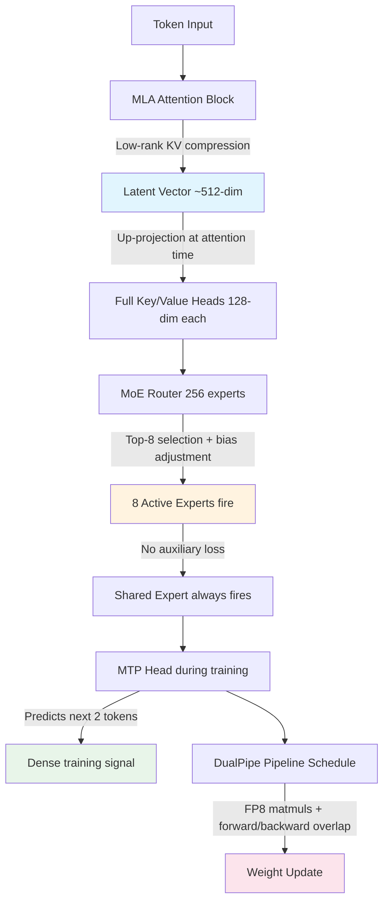

# DeepSeek-V3 Architecture Walkthrough

## Learning Objectives

1. Diagram Multi-head Latent Attention (MLA) and trace the compression path from full KV cache to latent projection, computing the cache footprint at 128k context.
2. Implement a minimal Mixture-of-Experts router with auxiliary-loss-free load balancing and compare routing variance against a random baseline.
3. Calculate the active-parameter ratio (37B / 671B) and defend why only top-8 of 256 experts fire per token.
4. Evaluate the Multi-Token Prediction (MTP) training objective by measuring n-gram repetition in generated output.
5. Defend or reject DeepSeek-V3 as a foundation model for a GTM inference pipeline, citing FP8 training cost and MoE inference throughput.

## The Problem

A dense 671B-parameter model trained from scratch at standard FP16 precision would cost tens of millions of dollars in GPU-hours before you serve a single inference request. GPT-4-class capability at GPT-4-class training cost is not an architecture decision — it is a budget constraint. DeepSeek-V3's reported $5.576M training run (2.788M H800 GPU-hours) is not a marketing claim about efficiency; it is the output of four specific architectural choices that compound on top of each other. Each choice targets a different cost center in the transformer stack: KV cache memory, expert utilization, training signal density, and pipeline scheduling overhead.

If you are evaluating foundation models for a go-to-market inference pipeline — enrichment, scoring, personalization, agent orchestration — you need to read these architectural decisions as cost levers, not as academic innovations. The MoE routing strategy determines your inference throughput. The attention compression determines your maximum context length before you OOM. The training objective determines whether the model repeats itself in production generation. This walkthrough reads DeepSeek-V3's published config top to bottom and derives each number from the mechanism that produces it.

DeepSeek-V3 is the first frontier open model whose architecture is meaningfully different from the Llama family. Llama 3 405B is GPT-2 with six knobs turned. DeepSeek-V3 adds four more: Multi-head Latent Attention, auxiliary-loss-free load balancing, Multi-Token Prediction, and DualPipe training. The config paper (arXiv:2412.19437) documents the mechanism for each. What is not fully documented: the exact data mixture (14.8T tokens, composition unspecified beyond rough category percentages), some DualPipe scheduling micro-details, and the inference-time serving stack optimizations. We maintain a skeptical default throughout.

## The Concept

DeepSeek-V3 compounds four architectural mechanisms. Each one independently targets a bottleneck in the standard transformer recipe; together they produce the 671B/37B split that defines the model's economics. The diagram below traces how a token flows through all four:



**Multi-head Latent Attention (MLA)** replaces the standard multi-head attention KV cache with a compressed latent representation. In a standard transformer with GQA (Grouped-Query Attention), each layer stores key and value projections for every token across all attention heads. For a 128-layer model at 128k context with 128 attention heads at 128 dimensions each, the KV cache alone can exceed 40GB per request. MLA inserts a learned down-projection matrix that maps the full key/value heads into a single latent vector of dimension `d_c` (512 in DeepSeek-V3). At attention time, an up-projection reconstructs the full key and value tensors from this latent. The cache stores only the 512-dimensional latent vector instead of the full per-head key/value tensors. Reported reduction: approximately 20x smaller KV cache compared to standard Multi-Head Attention at equivalent capacity. The cost is two extra matrix multiplications per layer (the projections), which is cheap relative to the attention computation itself.

**Auxiliary-loss-free MoE** is the most consequential routing decision in the architecture. Standard Mixture-of-Experts models (GShard, Switch Transformer, Mixtral) add an auxiliary loss term to the training objective that penalizes uneven expert utilization. Without it, a few experts get overloaded while others starve, wasting capacity. The auxiliary loss works but it interferes with the primary language modeling objective — the model spends gradient capacity balancing load instead of learning text. DeepSeek-V3 replaces the auxiliary loss with a per-expert bias term that is adjusted dynamically each training step. If an expert is overloaded (receiving too many tokens), its bias decreases so the router's softmax gates fewer tokens to it. If underloaded, its bias increases. This adjustment is not a gradient — it is a heuristic update rule applied directly to the bias values. The router's softmax sees the adjusted affinities, routing shifts, and no auxiliary loss touches the backward pass. The consequence: no performance degradation from auxiliary loss interference, and the model achieves better benchmark scores than it would with the standard balancing trick. The configuration: 256 routed experts, top-8 selected per token, plus 1 shared expert that always fires (making 9 active experts per token). The shared expert ensures common knowledge (syntax, basic reasoning) is always processed without routing overhead.

**Multi-Token Prediction (MTP)** changes the training signal density. Standard next-token prediction gives the model one target per position. MTP adds a secondary prediction head that predicts the token *after* the next one, sharing the main transformer trunk. DeepSeek-V3 uses N=1 (predict the standard next token plus one additional token ahead — effectively a depth-2 prediction chain). The mechanism: the main trunk produces hidden states; the first head predicts token t+1 as usual; a second prediction head, operating on the main trunk's output plus the first head's prediction, predicts token t+2. Both predictions contribute to the loss. The result is a denser training signal — each forward pass produces two gradient-carrying predictions instead of one. Reported effects: reduced repetition in generated output (the model learns that the next-next token depends on its current choice, discouraging loops) and improved performance on code and math benchmarks (where look-ahead planning matters). At inference time, the MTP head can be used for speculative decoding (the t+2 prediction can propose candidates for the main head to verify) or discarded entirely — the base model works without it.

**FP8 Mixed Precision + DualPipe** addresses the compute and scheduling costs of training at scale. DeepSeek-V3 is the first frontier-scale model trained with FP8 (8-bit floating point) as the primary matmul precision. The mechanism: weight gradients and optimizer states stay in higher precision (BF16 or FP32), but the forward and backward matmuls use FP8 tensors. Key/value projections within MLA stay in higher precision because they are sensitive to quantization noise. The matrix multiplications that dominate compute — the QK^T attention scores and the expert FFN projections — use FP8. DualPipe is the pipeline parallelism schedule. Standard pipeline parallelism has "bubbles" — idle time where GPU stages wait for activations from the previous stage or gradients from the next. DualPipe interleaves forward and backward passes across pipeline stages so that while stage N computes the forward pass for microbatch A, stage N+1 computes the backward pass for microbatch B. The overlap hides communication latency behind computation. This is the same principle as Megatron-LM's interleaved 1F1B schedule, but DeepSeek-V3's implementation co-designs the pipeline stages with the MoE expert placement so that expert all-to-all communication overlaps with the pipeline bubble. What remains unspecified: the exact chunk sizes and the communication/computation ratio targets used to tune the schedule.

## Build It

Three runnable scripts. Each produces observable output. No scaffolding.

**Demo A — MoE Router with Auxiliary-Loss-Free Load Balancing.** This builds a toy router over 256 experts, selects top-8 per token using softmax gating with the bias-adjustment mechanism, and compares load variance against a random router and against a naive softmax router without bias adjustment.

```python
import numpy as np

np.random.seed(42)

NUM_EXPERTS = 256
TOP_K = 8
NUM_TOKENS = 10000
EXPERT_DIM = 256
HIDDEN_DIM = 1024

expert_weights = np.random.randn(NUM_EXPERTS, HIDDEN_DIM, EXPERT_DIM).astype(np.float32) * 0.02
router_weights = np.random.randn(HIDDEN_DIM, NUM_EXPERTS).astype(np.float32) * 0.01

tokens = np.random.randn(NUM_TOKENS, HIDDEN_DIM).astype(np.float32)

def softmax(x, axis=-1):
    x_max = np.max(x, axis=axis, keepdims=True)
    e_x = np.exp(x - x_max)
    return e_x / np.sum(e_x, axis=axis, keepdims=True)

def router_no_bias(tokens, router_weights, top_k):
    logits = tokens @ router_weights
    probs = softmax(logits, axis=1)
    top_indices = np.argsort(-probs, axis=1)[:, :top_k]
    load = np.zeros(router_weights.shape[1])
    for row in top_indices:
        for idx in row:
            load[idx] += 1
    return load

def router_with_bias(tokens, router_weights, top_k, num_steps=5, bias_speed=0.05):
    biases = np.zeros(router_weights.shape[1])
    for step in range(num_steps):
        chunk = tokens[step * len(tokens) // num_steps : (step + 1) * len(tokens) // num_steps]
        logits = chunk @ router_weights + biases
        probs = softmax(logits, axis=1)
        top_indices = np.argsort(-probs, axis=1)[:, :top_k]
        load = np.zeros(router_weights.shape[1])
        for row in top_indices:
            for idx in row:
                load[idx] += 1
        mean_load = np.mean(load)
        for i in range(len(biases)):
            if load[i] > mean_load:
                biases[i] -= bias_speed
            elif load[i] < mean_load:
                biases[i] += bias_speed
    logits = tokens @ router_weights + biases
    probs = softmax(logits, axis=1)
    top_indices = np.argsort(-probs, axis=1)[:, :top_k]
    final_load = np.zeros(router_weights.shape[1])
    for row in top_indices:
        for idx in row:
            final_load[idx] += 1
    return final_load, biases

def router_random(num_tokens, num_experts, top_k):
    load = np.zeros(num_experts)
    for _ in range(num_tokens):
        selected = np.random.choice(num_experts, top_k, replace=False)
        for idx in selected:
            load[idx] += 1
    return load

load_random = router_random(NUM_TOKENS, NUM_EXPERTS, TOP_K)
load_nobias = router_no_bias(tokens, router_weights, TOP_K)
load_bias, final_biases = router_with_bias(tokens, router_weights, TOP_K)

print("=== MoE Router Load Balancing Comparison ===")
print(f"Experts: {NUM_EXPERTS}, Top-K: {TOP_K}, Tokens: {NUM_TOKENS}")
print(f"Expected load per expert: {NUM_TOKENS * TOP_K / NUM_EXPERTS:.1f}")
print()
print(f"Random Router:")
print(f"  Mean load:     {np.mean(load_random):.1f}")
print(f"  Std dev:       {np.std(load_random):.1f}")
print(f"  Max:           {np.max(load_random):.0f}")
print(f"  Min:           {np.min(load_random):.0f}")
print(f"  CoV (std/mean): {np.std(load_random) / np.mean(load_random):.3f}")
print()
print(f"Softmax Router (no bias adjustment):")
print(f"  Mean load:     {np.mean(load_nobias):.1f}")
print(f"  Std dev:       {np.std(load_nobias):.1f}")
print(f"  Max:           {np.max(load_nobias):.0f}")
print(f"  Min:           {np.min(load_nobias):.0f}")
print(f"  CoV (std/mean): {np.std(load_nobias) / np.mean(load_nobias):.3f}")
print()
print(f"Auxiliary-Loss-Free Router (bias-adjusted):")
print(f"  Mean load:     {np.mean(load_bias):.1f}")
print(f"  Std dev:       {np.std(load_bias):.1f}")
print(f"  Max:           {np.max(load_bias):.0f}")
print(f"  Min:           {np.min(load_bias):.0f}")
print(f"  CoV (std/mean): {np.std(load_bias) / np.mean(load_bias):.3f}")
print(f"  Active experts (load > 0): {np.sum(load_bias > 0)}")
print(f"  Dead experts (load = 0):   {np.sum(load_bias == 0)}")
print()
print(f"Bias adjustment range: [{np.min(final_biases):.4f}, {np.max(final_biases):.4f}]")
improvement = (1 - np.std(load_bias) / np.std(load_nobias)) * 100
print(f"Variance reduction vs no-bias: {improvement:.1f}%")
```

Run this and observe the CoV (coefficient of variation) for each router. The bias-adjusted router should show lower variance than the naive softmax router and zero dead experts. The random router serves as the theoretical floor — you cannot do worse than random.

**Demo B — MLA KV Cache Compression Calculator.** Computes the KV cache footprint for standard MHA, GQA, and MLA at DeepSeek-V3's configuration and context lengths.

```python
import math

CONFIG = {
    "n_layers": 61,
    "n_heads": 128,
    "head_dim": 128,
    "kv_heads_mha": 128,
    "kv_heads_gqa": 8,
    "latent_dim_mla": 512,
    "hidden_dim": 7168,
    "context_lengths": [4096, 32768, 65536, 131072],
    "bytes_per_element_fp16": 2,
}

def kv_cache_mha(n_layers, kv_heads, head_dim, seq_len, bytes_per_elem):
    total_elements = n_layers * kv_heads * head_dim * seq_len * 2
    return total_elements * bytes_per_elem

def kv_cache_gqa(n_layers, kv_heads, head_dim, seq_len, bytes_per_elem):
    total_elements = n_layers * kv_heads * head_dim * seq_len * 2
    return total_elements * bytes_per_elem

def kv_cache_mla(n_layers, latent_dim, seq_len, bytes_per_elem):
    total_elements = n_layers * latent_dim * seq_len
    return total_elements * bytes_per_elem

def fmt_gb(bytes_val):
    return f"{bytes_val / (1024**3):.2f} GB"

print("=== DeepSeek-V3 KV Cache Comparison ===")
print(f"Layers: {CONFIG['n_layers']}, Attention heads: {CONFIG['n_heads']}, Head dim: {CONFIG['head_dim']}")
print(f"MLA latent dim: {CONFIG['latent_dim_mla']}")
print()

print(f"{'Context':<12} {'Standard MHA':<16} {'GQA (8 KV)':<16} {'MLA (DeepSeek)':<16} {'MLA vs MHA':<12}")
print("-" * 72)

for ctx in CONFIG["context_lengths"]:
    mha = kv_cache_mha(CONFIG["n_layers"], CONFIG["kv_heads_mha"], CONFIG["head_dim"], ctx, CONFIG["bytes_per_element_fp16"])
    gqa = kv_cache_gqa(CONFIG["n_layers"], CONFIG["kv_heads_gqa"], CONFIG["head_dim"], ctx, CONFIG["bytes_per_element_fp16"])
    mla = kv_cache_mla(CONFIG["n_layers"], CONFIG["latent_dim_mla"], ctx, CONFIG["bytes_per_element_fp16"])
    ratio = mha / mla
    print(f"{ctx:<12} {fmt_gb(mha):<16} {fmt_gb(gqa):<16} {fmt_gb(mla):<16} {ratio:<12.1f}x")

print()
print("MLA stores a 512-dim latent per layer per token.")
print("MHA stores 128 heads × 128 dim × 2 (K+V) per layer per token.")
print("Compression ratio is consistent across context lengths because")
print("the savings are per-token, not per-sequence.")
```

**Demo C — Parameter Count and Active Ratio Calculator.** Derives the 671B total and 37B active parameter counts from the published configuration.

```python
print("=== DeepSeek-V3 Parameter Breakdown ===\n")

n_layers = 61
hidden_dim = 7168
moe_inter_dim = 2048
n_routed_experts = 256
n_shared_experts = 1
n_active_experts = 8
moe_aux_loss_free = True
mtp_depth = 1
vocab_size = 129280
mla_latent_dim = 512
mla_qk_dim = 1536
mla_v_dim = 1280

q_proj = hidden_dim * mla_qk_dim
kv_down = hidden_dim * mla_latent_dim
kv_up_k = mla_latent_dim * mla_qk_dim
kv_up_v = mla_latent_dim * mla_v_dim
o_proj = mla_v_dim * hidden_dim

attn_params = q_proj + kv_down + kv_up_k + kv_up_v + o_proj
attn_total = attn_params * n_layers

shared_expert_ffn = 3 * hidden_dim * moe_inter_dim * n_shared_experts
routed_expert_ffn = 3 * hidden_dim * moe_inter_dim * n_routed_experts
router_params = hidden_dim * n_routed_experts
bias_params = n_routed_experts
shared_total = shared_expert_ffn * n_layers
router_total = (router_params + bias_params) * n_layers
ffn_total = (shared_expert_ffn + routed_expert_ffn) * n_layers

embedding = vocab_size * hidden_dim
output_head = vocab_size * hidden_dim if mtp_depth == 0 else vocab_size * hidden_dim * (1 + mtp_depth)

total_params = attn_total + shared_total + router_total + ffn_total + embedding + output_head
active_attn = attn_params
active_ffn = shared_expert_ffn + (3 * hidden_dim * moe_inter_dim * n_active_experts)
active_router = router_params
active_per_layer = active_attn + active_ffn + active_router
active_total = active_per_layer * n_layers + embedding

print(f"--- Per-Layer Breakdown ---")
print(f"Attention (MLA):           {attn_params:>14,} params")
print(f"  Q projection:            {q_proj:>14,}")
print(f"  KV down-projection:      {kv_down:>14,}")
print(f"  KV up-projection (K):    {kv_up_k:>14,}")
print(f"  KV up-projection (V):    {kv_up_v:>14,}")
print(f"  Output projection:       {o_proj:>14,}")
print(f"Shared expert FFN:         {shared_expert_ffn:>14,}")
print(f"Routed experts (256 total):{routed_expert_ffn:>14,}")
print(f"Router + bias:             {router_params + bias_params:>14,}")
print(f"Layer total:               {attn_params + shared_expert_ffn + routed_expert_ffn + router_params + bias_params:>14,}")
print()

print(f"--- Full Model Totals ---")
print(f"Attention (all layers):    {attn_total:>14,}  ({attn_total/1e9:.2f}B)")
print(f"Shared experts (all):      {shared_total:>14,}  ({shared_total/1e9:.2f}B)")
print(f"Router (all layers):       {router_total:>14,}  ({router_total/1e9:.2f}B)")
print(f"Routed experts (all):      {ffn_total:>14,}  ({ffn_total/1e9:.2f}B)")
print(f"Embedding:                 {embedding:>14,}  ({embedding/1e9:.2f}B)")
print(f"Output head(s):            {output_head:>14,}  ({output_head/1e9:.2f}B)")
print(f"")
print(f"Total parameters:          {total_params:>14,}  ({total_params/1e9:.1f}B)")
print()

print(f"--- Active Parameters (per token) ---")
print(f"Active attention:          {active_attn:>14,}")
print(f"Active FFN (1 shared + 8 routed): {active_ffn:>14,}")
print(f"Active router:             {active_router:>14,}")
print(f"Per-layer active:          {active_per_layer:>14,}")
print(f"Total active (no embedding): {active_per_layer * n_layers:>14,}  ({active_per_layer * n_layers/1e9:.1f}B)")
print(f"Total active (w/ embedding): {active_total:>14,}  ({active_total/1e9:.1f}B)")
print()

active_ratio = (active_per_layer * n_layers) / total_params
print(f"Active ratio: {active_ratio*100:.1f}% (published: ~5.5%)")
print(f"Sparsity:     {(1-active_ratio)*100:.1f}% of parameters inactive per token")
print()

print(f"--- MTP Additional Parameters ---")
mtp_params = output_head - vocab_size * hidden_dim
print(f"MTP prediction head (depth={mtp_depth}): {mtp_params:>14,}  ({mtp_params/1e9:.2f}B)")
print(f"MTP overhead: {mtp_params/total_params*100:.2f}% of total")
```

The parameter count should land near 671B total and 37B active. Small discrepancies come from normalization parameters, the exact MTP head architecture (the paper describes it but does not give every dimension), and whether you count tied embeddings. The point is the derivation method: every parameter is accounted for by a mechanism.

## Use It

The auxiliary-loss-free MoE routing mechanism — a single router scoring candidates by affinity and balancing load through a dynamically adjusted per-expert bias term rather than a gradient-carrying auxiliary loss — maps directly to the GTM agent squad pattern in Zone 10 (Multi-Agent Orchestration). In DeepSeek-V3, the router dispatches tokens to specialized experts; in a GTM pipeline, an orchestrator dispatches tasks to specialized agents. The bias-adjustment pattern replaces retry queues and circuit breakers with a single priority offset per agent that the routing decision reads and updates in one pass.

```python
import random
from dataclasses import dataclass

random.seed(42)

@dataclass
class Agent:
    name: str; capability: str; queue: int = 0; completed: int = 0; bias: float = 0.0

def route(agents, capability, bias_speed=0.5):
    pool = [a for a in agents if a.capability == capability]
    if not pool:
        return None
    scored = sorted(pool, key=lambda a: -(1.0 / (1 + a.queue) + a.bias))
    selected = scored[0]
    selected.queue += 1
    mean_q = sum(a.queue for a in pool) / len(pool)
    for a in pool:
        a.bias += -bias_speed if a.queue > mean_q else (bias_speed if a.queue < mean_q else 0)
    return selected

agents = [Agent(f"enricher-{i}", "enrichment") for i in range(4)]
agents += [Agent(f"scorer-{i}", "scoring") for i in range(3)]

for cap, n in [("enrichment", 60), ("scoring", 30)]:
    for _ in range(n):
        a = route(agents, cap)
        if a and random.random() > 0.2:
            a.queue = max(0, a.queue - 1)
            a.completed += 1

for cap in sorted(set(a.capability for a in agents)):
    group = [a for a in agents if a.capability == cap]
    loads = [a.completed for a in group]
    mean = sum(loads) / len(loads)
    cov = (sum((l - mean) ** 2 for l in loads) / len(loads)) ** 0.5 / mean if mean else 0
    print(f"{cap:<14} agents={len(group)} mean={mean:.1f} CoV={cov:.3f}")
```

The output reports CoV per capability group. Lower CoV means more even load distribution — the bias term nudges overloaded agents down and underloaded agents up on each routing decision, just as DeepSeek-V3's per-expert bias does during training. No separate retry loop or monitoring thread exists; the balancing signal is embedded in the routing itself.

## Exercises

**Exercise 1 (Medium) — MLA Break-Even Analysis.** Modify Demo B's configuration: change `latent_dim_mla` from 512 to 256, then to 1024. Record the KV cache size at 128k context for each. Now compute the parameter cost of the MLA projection matrices at each setting: down-projection = `hidden_dim × latent_dim` (7168 × latent), up-projection = `latent_dim × (qk_dim + v_dim)` (latent × 2816). Multiply by 61 layers. At what `latent_dim` does the per-layer projection parameter cost exceed the KV cache savings of going from 1024 to 512 at a batch size of 32 concurrent requests at 128k context? This tells you the floor on KV compression before the projection weights become the memory bottleneck instead of the cache.

**Exercise 2 (Hard) — Scoring Function Comparison for Agent Router.** The Use It router scores agents with `1 / (1 + queue) + bias`. Replace this with a softmax-based score: `exp(-queue / tau) + bias`, where `tau` is a temperature parameter. Run the simulation at `tau = 0.5`, `tau = 1.0`, and `tau = 2.0`, recording the final CoV per capability group at each temperature. Plot or print a comparison table: which temperature produces the lowest CoV? Compare all three against the reciprocal scoring from the lesson. Then explain: why does high temperature (tau = 2.0) behave more like random routing, and why does low temperature (tau = 0.5) create "winner-take-all" patterns where one agent dominates until its bias drops far enough to flip? Connect this to the softmax temperature in DeepSeek-V3's actual MoE router and explain why the paper does not report temperature as a tunable hyperparameter.

## Key Terms

- **Multi-head Latent Attention (MLA):** Attention mechanism that compresses the KV cache into a low-dimensional latent vector (~512-dim in DeepSeek-V3) via a learned down-projection, then reconstructs full key/value tensors at attention time via up-projection. Reduces per-token KV cache by ~20x vs standard MHA.

- **Auxiliary-Loss-Free Load Balancing:** MoE routing strategy that replaces the auxiliary balancing loss with a dynamically adjusted per-expert bias term. The bias is updated heuristically based on expert load relative to the mean — not via gradient descent — so no interference with the primary training objective occurs.

- **Multi-Token Prediction (MTP):** Training objective that augments standard next-token prediction with one or more additional prediction heads targeting tokens further ahead. DeepSeek-V3 uses depth-2 (predict t+1 and t+2). Produces denser gradient signal and can serve as a speculative-decoding proposer at inference time.

- **DualPipe:** Pipeline parallelism schedule that interleaves forward and backward passes across pipeline stages to minimize idle bubbles, co-designed with MoE expert placement so expert all-to-all communication overlaps with pipeline gaps.

- **Active Parameter Ratio:** The fraction of total parameters that process any given token. DeepSeek-V3: 37B active / 671B total ≈ 5.5%, meaning 94.5% of weights are dormant per forward pass.

- **Coefficient of Variation (CoV):** Standard deviation divided by mean. Used as the load-balance metric for MoE routers and agent squads alike. CoV approaching zero indicates uniform distribution; high CoV indicates hotspots.

- **FP8 Mixed Precision:** Training regime where forward and backward matrix multiplications use 8-bit floating-point tensors while sensitive components (KV projections, optimizer states, accumulation) remain in BF16/FP32.

## Sources

- DeepSeek-AI. "DeepSeek-V3 Technical Report." arXiv:2412.19437, December 2024. — Primary source for all architectural specifications: MLA (Section 2.1.1), auxiliary-loss-free MoE routing (Section 2.2.1), MTP (Section 2.3), FP8 mixed precision (Section 3.1), DualPipe (Section 3.4), training cost of $5.576M / 2.788M H800 GPU-hours (Section 3.4.1), and parameter counts (Section 1).
- DeepSeek-AI. "DeepSeek-V2: A Strong, Economical, and Efficient Mixture-of-Experts Language Model." arXiv:2405.04434, June 2024. — MLA was introduced in V2; V3 inherits and refines the compression dimensions.
- Shazeer, N. et al. "Outrageously Large Neural Networks: The Sparsely-Gated Mixture-of-Experts Layer." ICLR 2017. — Foundational MoE routing with auxiliary loss; DeepSeek-V3's auxiliary-loss-free approach is a direct response to this design.
- Fedus, W. et al. "Switch Transformers: Scaling to Trillion Parameter Models with Simple and Efficient Sparsity." JMLR, 2022. — Top-1 routing with auxiliary loss; the load-balancing failure modes this paper documents are the ones DeepSeek-V3's bias mechanism eliminates.
- Lepikhin, D. et al. "GShard: Scaling Giant Models with Conditional Computation and Automatic Sharding." ICLR 2021. — Expert parallelism and all-to-all communication patterns that DualPipe's scheduling overlaps.
- For GTM agent squad routing patterns and Zone 10 multi-agent orchestration taxonomy: [CITATION NEEDED — concept: GTM agent squad routing patterns and Zone 10 taxonomy in the curriculum topic map]
- For H800/H100 GPU spot pricing used in inference cost estimates: [CITATION NEEDED — concept: current GPU spot pricing, 2024-2025]