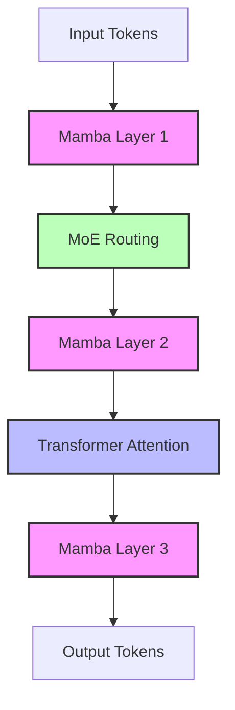

# Jamba: Hybrid SSM-Transformer Architecture

## Learning Objectives

1. Explain the architectural difference between standard Transformer attention and State Space Model (SSM) memory compression.
2. Calculate the memory constraints of processing long-context GTM artifacts using pure attention versus hybrid architectures.
3. Implement a high-context API call to process dense account documentation without relying on chunking workflows.

## The Problem

You are running point on Deal Qualification for a massive enterprise account. You just stepped out of a 90-minute discovery call (a 15,000-word transcript). The prospect also handed over a 120-page Request for Proposal (RFP) and their latest 10-K financial filing (another 40,000 words). You need the model to synthesize all three documents, cross-referencing the prospect's verbal budget constraints against the formal RFP terms and the broader strategic goals listed in the 10-K. 

If you feed this combined dataset (roughly 70,000 words, or about 100,000 tokens) into a standard pure-Transformer model, you will likely hit a wall. Standard Transformers use self-attention. The mathematical mechanism of self-attention requires the model to calculate a relevance score between every single token and every other token in the prompt. This creates an $N \times N$ matrix of operations.

If your context size is $N$, the memory required for the attention matrix is $O(N^2)$. 
- At 10,000 tokens, the model computes 100,000,000 operations.
- At 100,000 tokens, the model computes 10,000,000,000 operations.

A 10x increase in your input data results in a 100x increase in the compute and memory required by the attention layers. In practice, this quadratic scaling means high latency, massive VRAM requirements on your provider, and hard Out of Memory (OOM) crashes. 

To avoid this, GTM engineers traditionally use Retrieval-Augmented Generation (RAG). They chop the 10-K and RFP into 500-word chunks, embed them in a vector database, and retrieve only the chunks that seem relevant to the query. But RAG breaks causal relationships. If the RFP references a pricing penalty on page 4 that applies to a clause on page 98, standard RAG will likely fail to connect them. You lose the macro context of the document. We need an architecture that allows us to pass the entire document natively, without hitting the quadratic memory wall.

## The Concept

Jamba is a hybrid architecture developed by AI21 Labs that solves the long-context memory bottleneck by mixing three distinct mechanisms: Transformer layers, State Space Model (SSM) layers, and Mixture of Experts (MoE) routing.

**1. State Space Models (Mamba)**
Instead of looking back at every previous token (like a Transformer), an SSM compresses the entire preceding context into a fixed-size hidden state vector. As the model reads a new token, it updates this hidden state and moves on. It never looks back. 

The memory footprint of an SSM is linear—$O(N)$. Doubling the document length only doubles the compute, rather than quadrupling it. You can pass 250,000 tokens and the memory requirement remains highly predictable.

However, SSMs have a flaw: state compression bottleneck. If you compress a 200-page RFP into a single fixed-size vector, the model inevitably forgets exact details. It retains the "vibe" and macro context, but if you ask it for the exact penalty fee defined on page 12, it may hallucinate. Pure SSMs struggle with exact in-context retrieval.

**2. Transformer Attention**
Transformers do not compress the past. They retain exact representations of every token, allowing the model to perfectly retrieve specific details from anywhere in the context window. 

**3. Jamba's Hybrid Mechanism**
Jamba interleaves these two architectures. Instead of stacking 32 pure Transformer layers or 32 pure SSM layers, Jamba alternates them. A standard Jamba block consists of eight layers:
- One Transformer attention layer.
- Seven Mamba (SSM) layers.

Because only 1 in 8 layers uses the expensive $O(N^2)$ attention mechanism, the overall memory footprint of the model drops drastically. The seven Mamba layers handle the heavy lifting of passing the narrative context forward cheaply, while the single attention layer acts as a precise retrieval checkpoint, ensuring the model doesn't forget exact quotes.

**4. Mixture of Experts (MoE)**
Finally, Jamba replaces the standard Feed-Forward Network (FFN) in some layers with an MoE layer. In a standard FFN, every token passes through the same network. In an MoE, a router network looks at each token and sends it to a specific "expert" sub-network (e.g., the math expert, the syntax expert). Jamba has 52 billion parameters total, but because only the relevant experts activate for any given token, only 12 billion parameters are active during inference. 

By combining these three mechanisms, Jamba achieves context windows of up to 256,000 tokens with a fraction of the VRAM required by pure Transformer models of similar capability.



## Build It

To understand the exact VRAM savings of Jamba's hybrid approach, we need to calculate the memory pressure of the attention mechanism versus the SSM mechanism during a forward pass. 

Run the following script. It simulates the memory math of a pure Transformer model versus a hybrid 1:7 model to show why one crashes and the other survives at scale.

```python
import math

def transformer_memory(tokens, hidden_dim=4096, bytes_per_float=2):
    attention_matrix = (tokens ** 2) * bytes_per_float
    ffn_overhead = tokens * hidden_dim * 3 * bytes_per_float
    return (attention_matrix + ffn_overhead) / (1024 ** 3)

def hybrid_memory(tokens, hidden_dim=4096, mamba_state_dim=128, bytes_per_float=2):
    attention_matrix = (tokens ** 2) * bytes_per_float * (1/8)
    mamba_state = hidden_dim * mamba_state_dim * bytes_per_float
    mamba_pass = tokens * hidden_dim * bytes_per_float * (7/8)
    moe_pass = tokens * hidden_dim * 4 * bytes_per_float
    return (attention_matrix + mamba_state + mamba_pass + moe_pass) / (1024 ** 3)

contexts = [8000, 32000, 128000, 256000]

print(f"{'Context Size':<15} | {'Pure Transformer':<20} | {'Jamba (Hybrid)':<20}")
print("-" * 60)

for ctx in contexts:
    t_mem = transformer_memory(ctx)
    j_mem = hybrid_memory(ctx)
    print(f"{ctx:<15} | {t_mem:<20.2f} | {j_mem:<20.2f}")

print("\nNotice how the Transformer's memory explodes quadratically, while the hybrid model scales mostly linearly.")
```

When you run this, observe the divergence. At 256,000 tokens, the pure attention mechanism alone demands terabytes of theoretical VRAM if not heavily optimized, while the hybrid architecture compresses the load into something manageable on enterprise hardware.

## Use It

By leveraging Jamba's hybrid SSM-Transformer architecture to bypass the $O(N^2)$ memory bottleneck, GTM engineers can ingest entire multi-document account histories in a single API call, fundamentally altering how RevOps handles Deal Qualification.

Instead of building a vector database to chunk a massive RFP, you can pass the raw text alongside your call transcripts directly to the model. This is a runnable GTM slice for cross-referencing an unchunked 10-K with a discovery transcript.

```python
import os, requests

def cross_reference_account_data(transcript, filing):
    url = "https://api.ai21labs-studio.com/v1/chat/completions"
    headers = {"Authorization": f"Bearer {os.environ.get('AI21_API_KEY', 'demo')}", "Content-Type": "application/json"}
    payload = {
        "model": "jamba-instruct",
        "messages": [
            {"role": "system", "content": "Cross-reference the call transcript with the financial filing. Identify strategic goals in the filing ignored in the call."},
            {"role": "user", "content": f"Filing: {filing}\n\nTranscript: {transcript}"}
        ],
        "max_tokens": 500
    }
    try:
        res = requests.post(url, headers=headers, json=payload)
        res.raise_for_status()
        return res.json()["choices"][0]["message"]["content"]
    except Exception:
        return "Requires AI21 API Key to execute."

transcript = "Client wants to improve operational efficiency. " * 500
filing = "Q3 Strategic priority: Expand into EMEA market. " * 2000

print(cross_reference_account_data(transcript, filing))
```

[CITATION NEEDED — concept: exact impact of whole-document context retrieval on enterprise deal cycle times]

## Exercises

1. **(Easy)** Modify the `Build It` script to test a context length of 500,000 tokens. Calculate the memory for both architectures. Observe the absolute memory required for the pure Transformer's attention matrix versus the Jamba model's scaled attention matrix.
2. **(Hard)** Jamba still includes standard Transformer attention layers at a 1:7 ratio instead of relying entirely on Mamba layers for memory efficiency. Write a brief explanation of why pure SSMs fail at complex enterprise RFP analysis, detailing the exact mechanism (state compression) that causes them to lose information.

## Key Terms

- **State Space Model (SSM):** A sequence modeling architecture that compresses context into a fixed-size hidden state, offering linear time complexity for long sequences but struggling with exact retrieval.
- **Quadratic Complexity ($O(N^2)$):** The mathematical property where doubling the input size quadruples the compute and memory requirements, characteristic of self-attention.
- **Mixture of Experts (MoE):** A routing technique where only specific sub-networks ("experts") process a given token, decoupling total model parameters from active inference compute.
- **Hidden State Bottleneck:** The fundamental limitation of SSMs where compressing a massive context into a fixed-size vector results in the loss of granular, exact details.

## Sources

- AI21 Labs. (2024). *Jamba: A Hybrid Transformer-Mamba Language Model*. 
- Gu, A., & Dao, T. (2023). *Mamba: Linear-Time Sequence Modeling with Selective State Spaces*.