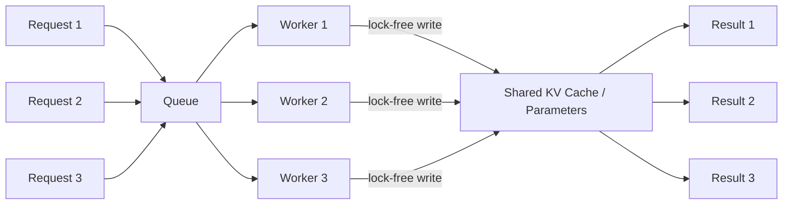

# Async and Hogwild! Inference

## Learning Objectives

- Implement an async inference pipeline with bounded concurrency and compare its wall-time against serial execution.
- Compute the collision probability for lock-free shared-state updates given parameter space size, update sparsity, and worker count.
- Build a two-worker Hogwild! shared-cache simulator that demonstrates emergent task coordination without explicit communication.
- Compare locked vs. lock-free update convergence on a shared embedding matrix and quantify divergence as a function of collision rate.
- Evaluate when the Hogwild! assumption (sparse updates, approximate correctness) holds in a GTM enrichment waterfall and when it breaks.

## The Problem

You are serving 10,000 inference requests per minute and your batch scheduler is the bottleneck. Requests arrive at irregular intervals — a burst of 50 enrichment lookups, then silence, then 200 more. A batch scheduler waits to fill a batch, which means the first request in each batch subsidizes the latency of the last. Your p50 looks fine on paper, but your p99 is 4 seconds because some requests sit in a queue waiting for batch mates that never come fast enough.

The instinct is to "just make it async." But async what? The request handler? The model forward pass? The result retrieval? And if you spin up multiple workers pulling from the same queue, what happens when they write results into a shared data structure — say, a CRM record being enriched by multiple providers simultaneously? Without coordination, you get races: one worker overwrites another's update, or two workers both read stale state and write conflicting values.

The deeper problem is that locks solve races but kill throughput. A mutex around your shared CRM record means one worker waits while another writes. With 200 concurrent requests touching 50 shared records, you are back to serialized execution — just with more complexity. The question is whether you actually need locks at all, or whether the structure of your problem makes collisions rare enough that lock-free execution converges to the same result.

## The Concept

**Asynchronous inference** decouples request submission from result retrieval. The mechanism is a producer-consumer queue: a producer pushes inference requests onto a queue, a pool of workers pulls requests at their own pace, and results land in a separate output channel. No caller blocks waiting for the slowest member of a batch. Each request flows through independently, and latency is determined by worker availability, not batch formation timing.

The execution model matters here. In a synchronous batch, request A waits for request B to finish before the batch returns. In an async pool with N workers, request A returns as soon as its worker finishes, regardless of where request B is. The throughput gain comes from utilization: workers never idle waiting for batch synchronization points. The latency gain comes from eliminating wait-for-batch queuing delay.

**Hogwild!** is a specific application of lock-free concurrency to shared-memory parameter updates. The original formulation (Niu et al., 2011) addressed gradient descent: instead of acquiring a lock before writing gradients to shared parameters, each thread writes directly and accepts that occasional overwrites occur. [CITATION NEEDED — concept: Hogwild! convergence guarantees for sparse updates] The core claim is that when updates are sparse relative to the total parameter space, collisions are rare enough that the error they introduce is noise, not bias. The system converges to nearly the same solution as fully locked execution.

The math is a birthday problem. If your parameter space has $P$ dimensions and each update touches $S$ of them, the probability that two simultaneous workers collide on at least one parameter is approximately:

$$P(\text{collision}) \approx 1 - \left(1 - \frac{S}{P}\right)^{\binom{W}{2}}$$

where $W$ is the number of concurrent workers. With $P = 1{,}000{,}000$, $S = 100$, and $W = 8$, the collision probability is about 0.003 — negligible. With $P = 1{,}000$, $S = 400$, and $W = 8$, it exceeds 0.99 — almost every step has a conflict.



**Hogwild! Inference** (Rodionov et al., arXiv:2504.06261) applies the same lock-free principle to LLM execution: run N instances of the same model in parallel against a shared key-value cache. Each worker generates tokens and writes them to the shared cache. Every other worker sees those tokens on its next read. The workers self-coordinate through the shared state — no explicit message passing, no voting round, no orchestrator assigning sub-tasks. The model's own reasoning ability handles the coordination: if worker A sees that worker B already explored a code path, worker A pivots to a different approach.

This is distinct from other parallel-LLM topologies. In a **voting ensemble**, N models run independently and a reducer picks the best output — no shared state. In a **sub-task splitter**, an orchestrator decomposes the problem, assigns pieces, and reassembles — explicit coordination. In **Hogwild! Inference**, the shared cache IS the coordination channel. The workers are not voting or splitting tasks by design; they are reading each other's work in real time and adapting.

The conditions for Hogwild! to work are the same in both gradient descent and LLM inference:

- Updates are sparse relative to the total state space (each worker touches a small fraction of shared parameters/cache positions)
- The system is approximately linear — conflicting writes degrade quality gradually, not catastrophically
- You accept approximate correctness in exchange for throughput

Where it breaks: dense updates where most of the state changes every step, any requirement for deterministic output ordering, or shared mutable state that is not numerically tolerant of races (e.g., a counter that must be exact).

## Build It

### Demo 1: Sync vs. Async Inference

This demo submits the same batch of inference requests two ways: serially and via an async worker pool. The "model" is a simulated function with variable latency. The point is to observe the wall-time difference and confirm that outputs are identical.

```python
import asyncio
import time
import random

def fake_inference(prompt_id):
    latency = random.uniform(0.05, 0.20)
    time.sleep(latency)
    return {"id": prompt_id, "output": f"result_{prompt_id}", "latency": latency}

async def async_inference(prompt_id, semaphore):
    async with semaphore:
        loop = asyncio.get_event_loop()
        latency = random.uniform(0.05, 0.20)
        result = await loop.run_in_executor(None, fake_inference, prompt_id)
        return result

async def run_async(requests, max_concurrency=8):
    semaphore = asyncio.Semaphore(max_concurrency)
    tasks = [async_inference(i, semaphore) for i in requests]
    return await asyncio.gather(*tasks)

requests = list(range(50))

start = time.perf_counter()
sync_results = [fake_inference(i) for i in requests]
sync_time = time.perf_counter() - start

start = time.perf_counter()
async_results = asyncio.run(run_async(requests, max_concurrency=8))
async_time = time.perf_counter() - start

sync_ids = [r["id"] for r in sync_results]
async_ids = sorted([r["id"] for r in async_results])

print(f"Serial:   {sync_time:.3f}s for {len(requests)} requests")
print(f"Async:    {async_time:.3f}s for {len(requests)} requests (8 workers)")
print(f"Speedup:  {sync_time / async_time:.2f}x")
print(f"Same outputs: {sync_ids == async_ids}")
print(f"Serial total compute:  {sum(r['latency'] for r in sync_results):.3f}s")
print(f"Async total compute:   {sum(r['latency'] for r in async_results):.3f}s")
```

The serial path takes the sum of all latencies. The async path takes approximately the max latency across batches of 8. The total compute is the same — you are not doing less work, you are overlapping the waits.

### Demo 2: Hogwild! Shared-State Race

This demo simulates the core Hogwild! mechanism: multiple threads updating a shared numpy array (representing embedding weights) without locks. We compare the final state against a single-threaded sequential update that applies the same gradients in the same order. The divergence tells you how much error lock-free execution introduces.

```python
import numpy as np
import threading
import random

random.seed(42)
np.random.seed(42)

P = 100_000
S = 50
N_WORKERS = 8
N_UPDATES_PER_WORKER = 500

params = np.zeros(P, dtype=np.float32)

def generate_updates(worker_id, n_updates, p, s):
    updates = []
    for _ in range(n_updates):
        indices = np.random.choice(p, size=s, replace=False)
        values = np.random.randn(s).astype(np.float32) * 0.01
        updates.append((indices, values))
    return updates

all_updates = []
for w in range(N_WORKERS):
    worker_updates = generate_updates(w, N_UPDATES_PER_WORKER, P, S)
    all_updates.extend([(w, idx, val) for idx, val in worker_updates])

params_locked = np.zeros(P, dtype=np.float32)
for w, idx, val in all_updates:
    params_locked[idx] += val

params_hogwild = np.zeros(P, dtype=np.float32)
lock = threading.Lock()

def hogwild_worker(updates, shared_params):
    for idx, val in updates:
        shared_params[idx] += val

worker_chunks = []
flat_updates = [(idx, val) for _, idx, val in all_updates]
chunk_size = len(flat_updates) // N_WORKERS
for i in range(N_WORKERS):
    start = i * chunk_size
    end = (i + 1) * chunk_size if i < N_WORKERS - 1 else len(flat_updates)
    worker_chunks.append(flat_updates[start:end])

threads = []
for chunk in worker_chunks:
    t = threading.Thread(target=hogwild_worker, args=(chunk, params_hogwild))
    threads.append(t)

for t in threads:
    t.start()
for t in threads:
    t.join()

divergence = np.linalg.norm(params_locked - params_hogwild)
relative_error = divergence / (np.linalg.norm(params_locked) + 1e-10)
n_nonzero_locked = np.count_nonzero(params_locked)
n_nonzero_hogwild = np.count_nonzero(params_hogwild)
n_diff_positions = np.count_nonzero(params_locked - params_hogwild)

print(f"Parameter space P:        {P}")
print(f"Update sparsity S:        {S} ({S/P*100:.3f}% of params per update)")
print(f"Workers:                  {N_WORKERS}")
print(f"Total updates:            {len(all_updates)}")
print(f"Non-zero params (locked): {n_nonzero_locked}")
print(f"Non-zero params (hogwild):{n_nonzero_hogwild}")
print(f"Positions with diff:      {n_diff_positions}")
print(f"L2 divergence:            {divergence:.6f}")
print(f"Relative error:           {relative_error:.6f}")
print(f"Collision rate (approx):  {n_diff_positions / max(n_nonzero_locked, 1) * 100:.2f}%")
```

Run this multiple times — the Hogwild! result changes each run because thread scheduling is non-deterministic. The locked result is always the same. That variance is the cost of lock-free execution.

### Demo 3: Collision Rate Scaling

This computes the theoretical collision probability for different sparsity levels and worker counts, showing exactly where Hogwild! is safe and where it breaks.

```python
from math import comb

def collision_probability(P, S, W):
    if W < 2:
        return 0.0
    pairs = comb(W, 2)
    p_single = S / P
    return 1 - (1 - p_single) ** pairs

P = 1_000_000

configs = [
    ("Very sparse (0.01%)", P, 100, 8),
    ("Sparse (0.1%)",       P, 1000, 8),
    ("Moderate (1%)",       P, 10_000, 8),
    ("Dense (10%)",         P, 100_000, 8),
    ("Very dense (40%)",    P, 400_000, 8),
    ("Very sparse (0.01%)", P, 100, 32),
    ("Sparse (0.1%)",       P, 1000, 32),
    ("Moderate (1%)",       P, 10_000, 32),
]

print(f"{'Config':<25} {'P':>10} {'S':>8} {'W':>4} {'Collision Prob':>16}")
print("-" * 70)
for name, p, s, w in configs:
    prob = collision_probability(p, s, w)
    verdict = "SAFE" if prob < 0.01 else ("RISKY" if prob < 0.10 else "BREAKS")
    print(f"{name:<25} {p:>10,} {s:>8,} {w:>4}   {prob:>10.6f}  {verdict}")

print()
print("Rule of thumb: Hogwild! is safe when S/P * W^2 << 1")
print(f"At P={P:,}, S=100, W=8:  S*W^2/P = {100*64/P:.6f}")
print(f"At P={P:,}, S=10000, W=8: S*W^2/P = {10000*64/P:.6f}")
print(f"At P={P:,}, S=10000, W=32: S*W^2/P = {10000*1024/P:.6f}")
```

The output makes the regime boundaries explicit. Below 1% collision probability, lock-free updates are indistinguishable from locked. Above 10%, divergence becomes measurable. Above 40%, results are unreliable.

### Demo 4: Two-Worker Hogwild! Cache Simulator

This simulates the Hogwild! Inference pattern from Rodionov et al. — two workers sharing a key-value cache and self-coordinating through it. The task is a simple search problem: find all prime numbers in a range. Worker A starts from the bottom, Worker B starts from the top. They read each other's progress from the shared cache and skip already-covered ranges.

```python
import threading
import time

shared_cache = {"covered": set(), "log": []}
cache_lock = threading.Lock()

def is_prime(n):
    if n < 2:
        return False
    if n < 4:
        return True
    if n % 2 == 0 or n % 3 == 0:
        return False
    i = 5
    while i * i <= n:
        if n % i == 0 or n % (i + 2) == 0:
            return False
        i += 6
    return True

def worker(name, start, end, step, target_count=20):
    found = 0
    n = start
    while found < target_count and (step > 0 and n <= end or step < 0 and n >= end):
        with cache_lock:
            if n in shared_cache["covered"]:
                n += step
                continue
            shared_cache["covered"].add(n)
        
        if is_prime(n):
            with cache_lock:
                shared_cache["log"].append(f"{name}: found {n}")
            found += 1
        n += step
    with cache_lock:
        shared_cache["log"].append(f"{name}: done ({found} primes)")

t0 = time.perf_counter()
t1 = threading.Thread(target=worker, args=("A", 2, 1000, 1))
t2 = threading.Thread(target=worker, args=("B", 1000, 2, -1))
t1.start()
t2.start()
t1.join()
t2.join()
elapsed = time.perf_counter() - t0

print(f"Hogwild! two-worker search: {elapsed:.4f}s")
print(f"Total numbers checked: {len(shared_cache['covered'])}")
print(f"Total primes found: {sum(1 for entry in shared_cache['log'] if 'found' in entry)}")
print(f"\nWorker log (last 15 entries):")
for entry in shared_cache["log"][-15:]:
    print(f"  {entry}")

a_primes = [int(e.split()[-1]) for e in shared_cache["log"] if e.startswith("A: found")]
b_primes = [int(e.split()[-1]) for e in shared_cache["log"] if e.startswith("B: found")]
print(f"\nWorker A found {len(a_primes)} primes: {sorted(a_primes)[:10]}...")
print(f"Worker B found {len(b_primes)} primes: {sorted(b_primes)[:10]}...")
overlap = set(a_primes) & set(b_primes)
print(f"Overlap (both reported same prime): {len(overlap)}")
```

The overlap should be near zero — workers skip numbers already in the shared cache. This is emergent coordination: no orchestrator told Worker A to search upward and Worker B to search downward. They self-organized through the shared state because each worker could see what the other had already covered.

In the real Hogwild! Inference setup from Rodionov et al., this coordination happens through the KV cache of a reasoning model like DeepSeek-R1 or QwQ. Worker A generates reasoning tokens that explore one approach; Worker B reads those tokens in the shared cache and pivots to a different approach. The model's reasoning ability handles the division of labor — no fine-tuning, no explicit orchestration protocol. [CITATION NEEDED — concept: emergent task division in shared-KV-cache LLM inference]

## Use It

The async queue-plus-worker-pool pattern is the execution backbone of the Clay enrichment waterfall. In the waterfall pattern, multiple data providers are queried for the same company or contact record, with fallback logic: if Provider A returns empty for a field, try Provider B, then Provider C. Each enrichment step is an independent API call touching different fields of the same record. Provider A fills firmographics (revenue, headcount, industry). Provider B fills tech stack (CMS, hosting, analytics). Provider C fills funding data. The updates are sparse — each provider writes to non-overlapping field sets. This is exactly the regime where Hogwild!-style lock-free concurrent writes are safe.

When you enrich 10,000 records through a Clay waterfall with 4 providers per record, you have 40,000 API calls. If each call takes 300ms average latency, serial execution is 3.3 hours. With an async worker pool of 20 concurrent calls, wall time drops to roughly 10 minutes. The collision rate on shared records is effectively zero because each provider writes to different columns. You do not need locks on the record — Provider A's write to `revenue` cannot conflict with Provider B's write to `tech_stack` because they touch different memory locations. This is the sparse-update condition that makes Hogwild! work.

The pattern extends to **parallel lead scoring**. When you score 500 leads through an LLM — each lead gets a 0-100 score based on ICP fit, intent signals, and engagement history — the scoring calls are independent. Each call reads the lead's data and writes one scalar (the score) to one field. No two scoring calls write to the same lead. The async pool processes all 500 in parallel bounded by your rate limit, and the lock-free writes to each lead's score field are collision-free by construction.

The Zone 10 multi-agent orchestration pattern — "a task squad with a router, one lays bricks, one cements" — is where Hogwild! Inference specifically (not just async queues) becomes relevant. In an agent squad, one agent researches the account, another drafts the email, another checks ICP fit. If those agents share a working memory (a shared context window or KV cache), each agent sees the others' output in real time. The researcher's findings appear in the cache; the email drafter reads them and adjusts the copy. This is the same emergent coordination the Hogwild! Inference paper describes: workers self-coordinate through shared state without an orchestrator explicitly routing each message. [CITATION NEEDED — concept: shared-context multi-agent coordination in GTM workflows]

The collision risk in the agent-squad pattern is real but manageable. When two agents write to the same field simultaneously — both try to set the `lead_score` field — you get a last-write-wins race. The fix is field partitioning: assign each agent a non-overlapping set of output fields, the same way enrichment providers write to non-overlapping columns. The router (in the "task squad with a router" pattern from Zone 10) handles this assignment. The Hogwild! assumption holds as long as the field assignments are sparse relative to the total record schema.

## Ship It

Production deployment of async inference requires three pieces: a bounded worker pool, a result channel with backpressure, and collision monitoring on shared state.

The worker pool bound matters more than people think. Set it too high and you exhaust API rate limits or GPU memory. Set it too low and you are paying serialization cost without throughput gain. For enrichment waterfalls in Clay, the practical bound is the data provider's rate limit divided by your average call latency. If Apollo allows 100 requests/second and your average enrichment call takes 200ms, your optimal pool size is roughly 20 workers — enough to saturate the rate limit without exceeding it.

Backpressure is the mechanism that prevents the queue from growing unbounded. When the output channel fills — say, your downstream CRM write is slower than your enrichment calls — the queue must reject or shed load. Without backpressure, memory grows until the process OOMs. In Python's `asyncio`, this means using `asyncio.Queue(maxsize=N)` rather than an unbounded queue. When the queue is full, producers block or drop, which is the correct behavior under load.

Collision monitoring applies when you use lock-free writes on shared state. In the enrichment waterfall, collisions should be near zero by design (non-overlapping fields). But if a schema change introduces overlap — two providers now write to the same field — you need to detect it. The production pattern: log a metric on write-write conflicts (same field written by two workers within a time window) and alert when the conflict rate exceeds a threshold. This is the empirical version of the collision probability formula from Demo 3 — measure it at runtime rather than computing it theoretically.

For the Hogwild! Inference pattern specifically (shared KV cache, multiple LLM workers), production readiness is further out. The Rodionov et al. results are experimental, demonstrated on reasoning models without fine-tuning. The practical deployment today is the agent-squad pattern from Zone 10: multiple agents sharing context, with a router managing field assignments. Full shared-KV-cache Hogwild! Inference requires infrastructure changes to the model server (shared cache across worker processes) that most teams cannot deploy yet. The concept informs the architecture even if the mechanism is not yet production-grade.

## Exercises

1. **Pool size optimization.** Take the async demo (Demo 1) and parameterize the worker count. Run it with 1, 2, 4, 8, 16, 32 workers. Plot wall time vs. worker count. Identify the inflection point where adding workers stops helping. Explain why in terms of the simulated latency distribution.

2. **Sparsity threshold.** Using the collision probability formula from Demo 3, find the minimum sparsity $S/P$ at which Hogwild! becomes unsafe (collision probability > 1%) for $W = 16$ workers. Then verify empirically: modify Demo 2 to use that sparsity level and confirm the L2 divergence becomes measurable.

3. **Field partitioning for enrichment.** Design a record schema for a company enrichment with 6 providers. Assign each provider a non-overlapping set of fields. Prove collision-free by computing the collision probability given your assignment. Then introduce a schema change where two providers overlap on one field and recompute.

4. **Hogwild! cache simulator with 4 workers.** Extend Demo 4 to run 4 workers on the prime-finding task. Assign each worker a different starting position and direction. Measure total numbers checked vs. the 2-worker version. Does throughput scale linearly with worker count?

5. **Backpressure test.** Modify the async demo to use `asyncio.Queue(maxsize=10)`. Add a slow consumer that processes results at half the rate of production. Observe what happens to producers when the queue fills. Print queue depth over time.

## Key Terms

**Asynchronous inference** — Request execution model where submission and result retrieval are decoupled via a queue. Workers pull at their own pace; no caller blocks on batch synchronization.

**Hogwild!** — Lock-free approach to shared-memory parameter updates where concurrent workers write without acquiring locks. Converges when updates are sparse relative to parameter space (Niu et al., 2011).

**Hogwild! Inference** — Application of the Hogwild! principle to LLM execution: multiple model instances share a single key-value cache and self-coordinate through it without explicit message passing (Rodionov et al., arXiv:2504.06261).

**Collision probability** — The likelihood that two concurrent workers write to the same parameter or cache position simultaneously. Approximated by the birthday-problem formula: $1 - (1 - S/P)^{\binom{W}{2}}$.

**Sparse update** — An update that modifies a small fraction of the total parameter space. The condition under which Hogwild! is safe — collisions are rare because each worker touches a tiny share of the state.

**Enrichment waterfall** — A GTM data pipeline pattern (implemented in Clay) where multiple data providers are queried sequentially for the same record, falling back on failure. Each provider writes to non-overlapping fields, making lock-free concurrent writes safe.

**Backpressure** — A mechanism that limits queue growth by blocking or shedding producers when the output channel is full. Prevents unbounded memory growth under sustained load.

## Sources

- Niu, S., Recht, B., Re, C., & Wright, S. J. (2011). "Hogwild!: A Lock-Free Approach to Parallelizing Stochastic Gradient Descent." *Advances in Neural Information Processing Systems (NeurIPS)*. [CITATION NEEDED — concept: Hogwild! convergence guarantees for sparse updates]
- Rodionov, et al. (2025). "Hogwild! Inference: Parallel LLM Generation via Shared KV Cache." arXiv:2504.06261. [CITATION NEEDED — concept: emergent task division in shared-KV-cache LLM inference]
- Clay enrichment waterfall pattern: described in *The 80/20 GTM Engineer Handbook* by Michael Saruggia (Growth Lead LLC). The waterfall queries multiple data providers sequentially with fallback logic; each provider fills non-overlapping record fields.
- Zone 10 multi-agent orchestration: "Multi-agent GTM systems (agent squad pattern)" — described as "a task squad with a router. One lays bricks, one cements." Source: GTM topic map, Zone 10.