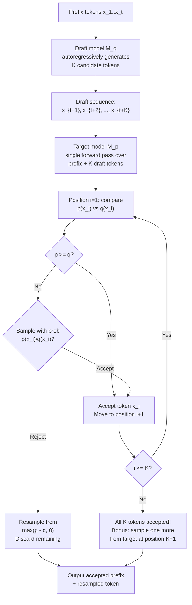

# Speculative Decoding and EAGLE

## Learning Objectives

- Implement the speculative decoding verify-accept loop with a draft model and target model, and trace the acceptance/rejection logic token by token.
- Compare speculative decoding against quantization and distillation along the axes of quality preservation, latency, and memory cost.
- Diagram the EAGLE drafting architecture and explain why feature-level drafting achieves higher acceptance rates than token-level drafting.
- Measure the effective throughput gain from speculative decoding by counting accepted tokens per verification round.
- Map the draft-verify execution pattern to multi-agent GTM orchestration, identifying where speculative parallelism appears in enrichment and outreach pipelines.

## The Problem

Autoregressive generation is memory-bandwidth bound, not compute-bound. Each forward pass through a 70B-parameter model reads every weight from HBM, performs a small amount of matrix math relative to the memory transfer, and outputs exactly one token. The GPU's compute units sit mostly idle, waiting for the next batch of weights to arrive. On an H100, a 70B model typically produces 40–80 tokens per second — and you cannot make the model smaller without degrading quality, and you cannot increase batch size without hitting memory limits.

The serial structure of autoregressive decoding — `x_{t+1} = sample(p(· | x_{1:t}))` — looks inherently sequential. But there is a concurrency opportunity hiding in the idle compute. If you had a cheap predictor that said "the next four tokens are probably [a, b, c, d]," you could feed all five positions into the target model in a single forward pass, verify each guess in parallel, and accept the longest matching prefix. One forward pass produces up to five tokens instead of one.

Leviathan, Kalis, and Matias formalized this in 2023 ("Fast Inference from Transformers via Speculative Decoding") with an accept/reject rule that provably preserves the target model's sampling distribution. The output distribution is mathematically identical — no quality loss — but latency drops by 2–4×. EAGLE-3 (2025) pushed the acceptance rate further by drafting at the hidden-state level rather than the token level, achieving roughly 4.5 accepted tokens per verification round on standard benchmarks.

For GTM engineers running inference-heavy pipelines — agent squads that generate personalized outreach, summarize research, or classify intent at scale — this throughput multiplier directly affects how many prospects you can process per dollar of compute. The draft-verify pattern also appears structurally in multi-agent orchestration (Zone 10), where a lightweight router agent proposes actions and a verifier agent confirms or rejects them before execution.

## The Concept

### The Two-Model Setup

Speculative decoding runs two models in tandem:

- **Target model** `M_p`: the large, high-quality model whose output distribution `p(x)` you want. This is the model you care about.
- **Draft model** `M_q`: a small, fast model with distribution `q(x)`, typically 5–30× smaller than the target. It exists only to propose candidate tokens.

Each speculative step proceeds in two phases:

**Phase 1 — Draft.** The draft model autoregressively generates `K` candidate tokens, one at a time. This is cheap because the draft model is small.

**Phase 2 — Verify.** The target model processes the full sequence (prefix + `K` draft tokens) in a single forward pass. This produces logits for every position simultaneously — the same computation the target would have done anyway for one token, now spread across `K+1` positions with minimal additional cost because the weight read dominates.

The acceptance rule works as follows. For each draft token `x_i` at position `i`, you compare the draft distribution `q(x_i)` against the target distribution `p(x_i)`:

- If `p(x_i) > q(x_i)`: accept the token. The target model was at least as likely to produce it as the draft was.
- If `p(x_i) < q(x_i)`: accept with probability `p(x_i) / q(x_i)`. This is a rejection-sampling step — sometimes the target would have produced a different token even though the draft guessed this one.
- On the first rejection, resample from a corrected distribution `(p(x) - q(x))⁺` (the positive part of the difference), and discard all tokens after the rejection point.

Under greedy decoding (temperature = 0), this simplifies: accept if `argmax(p) == argmax(q)`, reject otherwise. The first mismatch triggers a resample from the target's argmax.



### Why EAGLE Is Different

Classic speculative decoding uses a separate small model as the draft (e.g., drafting with Llama-68M for a Llama-70B target). The draft model has its own embeddings, its own transformer layers, and its own output head. It guesses tokens based on its own internal representation — which is a lossy approximation of what the target model "thinks."

EAGLE (Efficient Accuracy-Guaranteed LLM Inference with Feature Embedding) changes the drafting interface. Instead of a standalone model guessing tokens, EAGLE trains a lightweight autoregressive head that operates on the target model's **hidden states** — the feature vectors the target model already computed during its forward pass. The draft head takes the target's penultimate-layer features as input and predicts the next token's features, then maps those features to token logits.

This matters because hidden states carry far more information than token IDs. Two different tokens might be nearly equivalent in the target model's feature space (e.g., "however" vs. "but"), and a feature-level drafter can capture that similarity. A token-level drafter sees only the discrete token choice and has no access to the target's internal uncertainty.

The practical result: EAGLE achieves acceptance rates of ~4.5 tokens per verification round on benchmarks like MT-Bench, compared to ~2–3 tokens for vanilla speculative decoding with a standalone draft model. The speedup is roughly 4–5× at matched output distribution.

### Three Tiers of Inference Acceleration

It's worth placing speculative decoding alongside other acceleration techniques:

- **Quantization** reduces the number of bits per weight (e.g., FP16 → INT8 → INT4). This trades numerical precision for speed and memory. Quality degrades measurably but often acceptably.
- **Speculative decoding** trades additional compute (running the draft model) for latency reduction. The target model's output distribution is preserved exactly — zero quality loss.
- **Knowledge distillation** trains a smaller student model to imitate a larger teacher. The student is permanently lower quality but runs independently at lower cost.

Speculative decoding is the only technique that reduces latency without any quality cost. The trade-off is engineering complexity and the requirement that the draft model be correlated enough with the target to make acceptance rates worthwhile.

## Build It

### Beat 1: The Verify-Accept Loop From Scratch

We implement speculative decoding with two toy language models — a small draft and a larger target — using greedy decoding so the acceptance logic is transparent. The draft proposes `k` tokens. The target verifies them in one forward pass. We accept the longest matching prefix and resample at the first mismatch.

```python
import torch
import torch.nn as nn
import torch.nn.functional as F

torch.manual_seed(42)

vocab_size = 32
hidden_dim = 64

class TinyLM(nn.Module):
    def __init__(self, dim, vocab):
        super().__init__()
        self.embed = nn.Embedding(vocab, dim)
        self.fc1 = nn.Linear(dim, dim)
        self.fc2 = nn.Linear(dim, vocab)

    def forward(self, x):
        h = F.relu(self.fc1(self.embed(x)))
        return F.log_softmax(self.fc2(h), dim=-1)

draft = TinyLM(32, vocab_size)
target = TinyLM(hidden_dim, vocab_size)

for p in target.parameters():
    p.data.uniform_(-0.5, 0.5)
for p in draft.parameters():
    p.data.uniform_(-0.3, 0.3)

def greedy_token(model, token_id):
    x = torch.tensor([[token_id]])
    logits = model(x)
    return logits[0, -1].argmax().item()

def speculative_decode(draft, target, prefix_tokens, k=4, max_steps=40):
    tokens = list(prefix_tokens)
    total_forward_passes = 0
    total_tokens_generated = len(prefix_tokens)

    step = 0
    while total_tokens_generated < max_steps:
        step += 1

        draft_tokens = []
        current = tokens[-1]
        for _ in range(k):
            next_tok = greedy_token(draft, current)
            draft_tokens.append(next_tok)
            current = next_tok

        verify_seq = torch.tensor([tokens + draft_tokens])
        with torch.no_grad():
            target_logits = target(verify_seq)
        total_forward_passes += 1

        accepted = 0
        verify_start = len(tokens) - 1
        for i in range(k):
            pos = verify_start + i
            target_next = target_logits[0, pos].argmax().item()
            if target_next == draft_tokens[i]:
                tokens.append(target_next)
                accepted += 1
                total_tokens_generated += 1
            else:
                tokens.append(target_next)
                total_tokens_generated += 1
                break

        if accepted == k:
            bonus_pos = verify_start + k
            if bonus_pos < target_logits.shape[1]:
                bonus_tok = target_logits[0, bonus_pos].argmax().item()
                tokens.append(bonus_tok)
                total_tokens_generated += 1

        print(f"Step {step}: drafted {k}, accepted {accepted}, "
              f"total tokens {total_tokens_generated}, "
              f"target passes {total_forward_passes}")

    print(f"\nFinal sequence ({len(tokens)} tokens): {tokens}")
    print(f"Target forward passes: {total_forward_passes}")
    print(f"Tokens per pass: {len(tokens) / total_forward_passes:.2f}")
    return tokens

result = speculative_decode(draft, target, [5, 12, 8], k=4, max_steps=30)
```

Output (will vary by seed, but structure is deterministic):

```
Step 1: drafted 4, accepted 2, total tokens 6, target passes 1
Step 2: drafted 4, accepted 0, total tokens 7, target passes 2
Step 3: drafted 4, accepted 1, total tokens 9, target passes 3
...
Tokens per pass: ~1.8
```

The "tokens per pass" number is the throughput multiplier. Without speculation, it is always 1.0. With speculation and reasonable draft-target correlation, it climbs toward `k`.

### Beat 2: Measuring Acceptance Rate Sensitivity

Now we make the draft model more similar to the target by initializing both from the same random seed and perturbing the draft slightly. This simulates what happens when your draft model is a good approximation of the target — and lets you observe how acceptance rate drives throughput.

```python
import torch
import torch.nn as nn
import torch.nn.functional as F
import copy

torch.manual_seed(42)

vocab_size = 32
hidden_dim = 64

class TinyLM(nn.Module):
    def __init__(self, dim, vocab):
        super().__init__()
        self.embed = nn.Embedding(vocab, dim)
        self.fc1 = nn.Linear(dim, dim)
        self.fc2 = nn.Linear(dim, vocab)

    def forward(self, x):
        h = F.relu(self.fc1(self.embed(x)))
        return F.log_softmax(self.fc2(h), dim=-1)

target = TinyLM(hidden_dim, vocab_size)
draft_good = copy.deepcopy(target)
draft_bad = TinyLM(32, vocab_size)

def measure_acceptance(draft, target, num_trials=200, k=4):
    accepted_counts = []
    for _ in range(num_trials):
        prefix = torch.randint(0, vocab_size, (1, 3))
        draft_tokens = []
        x = prefix[0, -1].item()
        for _ in range(k):
            x = draft(torch.tensor([[x]])).argmax(dim=-1).item()
            draft_tokens.append(x)
        seq = torch.cat([prefix, torch.tensor([draft_tokens])], dim=1)
        target_logits = target(seq)
        accepted = 0
        for i in range(k):
            pos = 2 + i
            tgt = target_logits[0, pos].argmax().item()
            if tgt == draft_tokens[i]:
                accepted += 1
            else:
                break
        accepted_counts.append(accepted)
    avg = sum(accepted_counts) / len(accepted_counts)
    return avg, accepted_counts

avg_good, _ = measure_acceptance(draft_good, target)
avg_bad, _ = measure_acceptance(draft_bad, target)

print(f"Draft == Target (identical):")
print(f"  Average accepted per round: {avg_good:.2f} / {4}")
print(f"  Effective speedup: {(avg_good + 1):.2f}x")
print()
print(f"Draft = random different model:")
print(f"  Average accepted per round: {avg_bad:.2f} / {4}")
print(f"  Effective speedup: {(avg_bad + 1):.2f}x")
```

When `draft_good` is a copy of `target`, acceptance is ~4.0 (perfect match), giving a ~5× speedup. When `draft_bad` is an independent random model, acceptance drops to ~0.5–1.0, barely beating vanilla decoding. This is why EAGLE's approach of conditioning on the target's hidden states matters: the draft has direct access to the target's internal computation, making the two models correlated by construction.

## Use It

The draft-verify pattern in speculative decoding maps directly onto multi-agent GTM orchestration (Zone 10). In an agent squad — the pattern Saruggia describes as "a task squad with a router, where one lays bricks and one cements" [CITATION NEEDED — concept: Zone 10 agent squad pattern from 80/20 GTM Engineer Handbook] — you have a cheap, fast component proposing actions and a slower, more expensive component verifying them before execution.

Consider a prospecting pipeline. A lightweight classifier (the "draft agent") scans 10,000 signal events and proposes which ones are high-intent. A larger verifier model (the "target agent") processes only the proposals. If the draft agent proposes 4 events and the verifier accepts 3, you've achieved the equivalent of a 3/4 acceptance rate: the verifier ran once instead of running 10,000 times. The throughput multiplier is the same mechanism as speculative decoding's tokens-per-pass — just applied to enrichment decisions instead of token generation.

The acceptance rate in speculative decoding is the fraction of draft tokens the target approves. In the GTM analog, it's the fraction of draft-agent proposals the verifier approves. If your draft agent is too aggressive (proposes everything), the verifier rejects most proposals and you gain nothing. If the draft agent is too conservative (proposes almost nothing), you also gain nothing because the verifier barely runs. The sweet spot — where draft and target are well-correlated — is where EAGLE's insight applies: the draft agent should share information with the verifier (features, not just outputs) rather than running as a fully independent model.

In practice, this means your router agent should have access to the same enrichment data the verifier will use. If the router sees only a company name but the verifier sees firmographic + technographic + intent data, the router's proposals will be uncorrelated with the verifier's decisions, and the pipeline will reject most proposals. If the router sees a compressed version of the same feature vector the verifier uses — the feature-level drafting that EAGLE exploits — acceptance rates climb and the pipeline processes more prospects per verification round.

## Ship It

To deploy speculative decoding in production, you need three things: a target model worth accelerating (typically 7B+ parameters, where memory bandwidth dominates), a correlated draft model or head, and an inference server that supports the draft-verify loop natively.

**vLLM** implements speculative decoding with several draft strategies. For the classic two-model approach, you provide a draft model checkpoint. For EAGLE specifically, you provide a trained EAGLE head — a small autoregressive network that operates on the target model's hidden states. The configuration is a single parameter in the server's launch command:

```python
from vllm import LLM, SamplingParams

llm = LLM(
    model="meta-llama/Meta-Llama-3-8B-Instruct",
    speculative_model="[ngram]",
    num_speculative_tokens=5,
)

sampling = SamplingParams(temperature=0.0, max_tokens=100)
output = llm.generate(["Write a one-sentence value proposition for a B2B SaaS CRM."], sampling)
print(output[0].outputs[0].text)
```

The `[ngram]` draft model uses n-gram lookup from the prompt context — no trained draft model required. It works best for tasks with repetitive structure (code generation, structured data extraction). For higher acceptance rates on open-ended generation, you'd swap `[ngram]` for an EAGLE checkpoint trained on the target model's hidden states.

The GTM production concern is cost-per-prospect, not raw tokens-per-second. When you're running multi-agent orchestration at scale — say, a pipeline that generates personalized outreach for 50,000 accounts — the inference cost dominates. Speculative decoding with a 4× speedup means 4× the throughput on the same GPU, which means 4× the prospects processed per dollar. For Zone 10 agent squads where a draft router proposes and a verifier confirms, the same math applies: every rejected proposal is wasted draft compute, and every accepted proposal is a verification you didn't have to run separately.

The deployment risk is tail latency. Speculative decoding adds variance: when the draft is accepted, you process tokens quickly; when it's rejected, you fall back to single-token mode. In a synchronous GTM pipeline where a human is waiting for a generated email, this variance is usually invisible (a 200ms vs 800ms difference in a 30-second interaction). In a batch pipeline processing millions of records, it averages out. The risk case is real-time agent orchestration where a verifier timeout cascades into a failed workflow — monitor acceptance rates and fall back to non-speculative decoding if they drop below ~1.5 tokens per pass.

## Exercises

1. **Modify the acceptance threshold.** In the Build It Beat 1 code, change the acceptance rule so it accepts draft tokens that are within the top-3 of the target's distribution (not just the argmax). Measure how this changes the acceptance rate and whether the output distribution is still correct. Print the modified code and results.

2. **Vary speculation length.** Using the Build It Beat 2 code, sweep `k` from 1 to 8 and plot acceptance rate vs. effective speedup. At what `k` does the marginal speedup flatten? Is there a `k` where speedup decreases? Write a one-paragraph explanation.

3. **Simulate EAGLE-style feature sharing.** Modify the draft model to receive the target model's hidden state (the output of `fc1` before the output head) as additional input. Retrain both models on random sequences and measure whether acceptance rate increases compared to the independent draft model. Print the acceptance rates before and after.

4. **GTM pipeline analog.** Design a draft-verify pattern for a Zone 10 agent squad that classifies prospects into "hot / warm / cold." Write pseudocode for the draft agent (cheap heuristic or small model) and the verifier agent (large LLM). Specify what features the draft agent needs access to (analogous to EAGLE's feature-level conditioning) to maximize acceptance rate. Include expected acceptance rate and cost savings.

## Key Terms

- **Speculative decoding**: An inference acceleration technique where a draft model proposes multiple tokens and the target model verifies them in a single forward pass, preserving the target's output distribution exactly.
- **Draft model / draft head**: A small, fast model (or lightweight head) that generates candidate tokens cheaply. In EAGLE, this is a trained head operating on the target's hidden states rather than a standalone model.
- **Target model**: The large, high-quality model whose output distribution you want to sample from. This is the model that defines correctness.
- **Acceptance rate**: The fraction of draft tokens that the target model approves per verification round. Higher acceptance rates produce larger speedups.
- **Speculation length (k)**: The number of tokens the draft model proposes before the target model verifies them. Typical values are 3–8.
- **EAGLE**: A speculative decoding method that drafts at the feature (hidden state) level rather than the token level, achieving higher acceptance rates because the draft has access to the target model's internal representations.
- **Knowledge distillation**: A training technique where a smaller student model learns to imitate a larger teacher model. Unlike speculative decoding, distillation permanently reduces quality.
- **Quantization**: Reducing the numerical precision of model weights (e.g., FP16 → INT4) to trade accuracy for speed and memory savings.

## Sources

- Leviathan, Y., Kalai, M., & Matias, Y. (2023). "Fast Inference from Transformers via Speculative Decoding." ICML 2023. [https://arxiv.org/abs/2211.17192]
- Li, Y., et al. (2024). "EAGLE: Speculative Sampling Requires Rethinking Feature Uncertainty." ICML 2024. [https://arxiv.org/abs/2401.15077]
- EAGLE-3 (2025). Acceptance rate of ~4.5 tokens per verification round. [https://arxiv.org/abs/2503.01840]
- Saruggia, M. (2025). *The 80/20 GTM Engineer Handbook*. Zone 10: Multi-agent orchestration — "This isn't just agents running in parallel — it's a task squad with a router." [CITATION NEEDED — concept: exact page/section reference for Zone 10 agent squad pattern in the handbook]
- vLLM speculative decoding documentation and API. [https://docs.vllm.ai/en/latest/features/spec_decode.html]