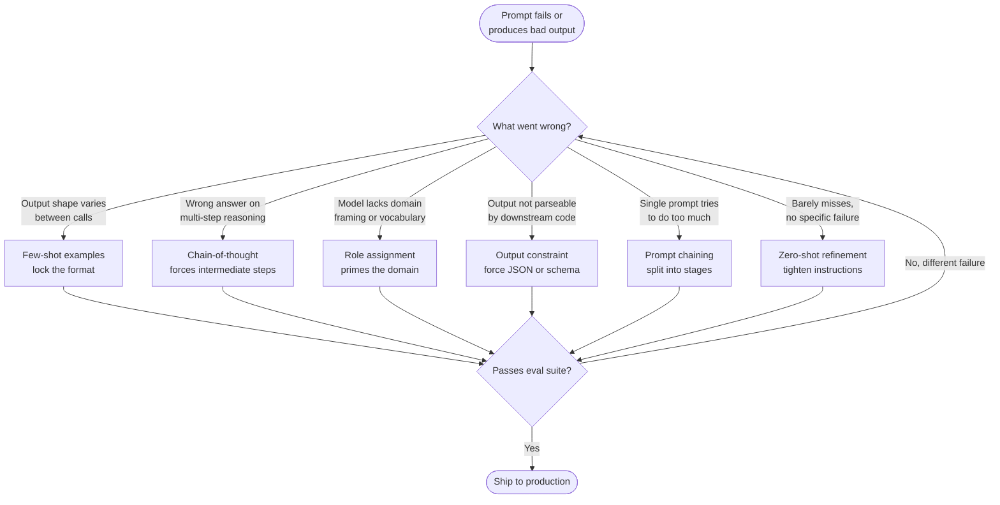

# Prompt Engineering: Techniques & Patterns

## Learning Objectives

1. Implement zero-shot, few-shot, and chain-of-thought prompts and compare their output quality on the same classification task.
2. Diagnose prompt failure modes (hallucination, format drift, reasoning collapse) and select the correct pattern to fix each.
3. Construct a multi-step prompt chain that produces structured JSON output compatible with downstream data pipelines.
4. Build a test harness that evaluates prompt accuracy and schema compliance across a labeled dataset.
5. Estimate token costs for a prompt chain given input/output length targets.

## The Problem

You open ChatGPT. You type: "Write me a marketing email." You get something generic, bloated, and unusable. You try again with more detail. Better, but still off. You spend 20 minutes rephrasing the same request. This is not a model problem. It is an instruction problem. A 200-billion parameter model follows instructions literally — vague instructions produce vague output, and that is not the model being difficult, it is the model doing exactly what you told it to do.

Here is the same task, two ways:

**Vague prompt:**
```
Write a marketing email for our new product.
```

**Engineered prompt:**
```
You are a senior copywriter at a B2B SaaS company. Write a product
launch email for DevFlow, a CI/CD pipeline debugger. Target audience:
engineering managers at Series B startups. Tone: confident, technical,
not salesy. Length: 150 words. Include one specific metric (3.2x faster
pipeline debugging). End with a single CTA linking to a demo page.
Output the email only, no subject line suggestions or preamble.
```

The second prompt produces a usable email on the first try. Not because the model got smarter — because the instructions got specific. Every constraint you add (audience, tone, length, structure) narrows the output space the model samples from. Fewer valid continuions means higher probability the output lands where you want it.

This matters less when you are writing one email in a chat window and more when you are running 10,000 enrichment calls through a pipeline. At that scale, a 15% failure rate on format compliance means 1,500 records your downstream formulas cannot parse. A 5% hallucination rate means 500 enriched records contain fabricated data that your sales team acts on. Prompt engineering at the pipeline level is not about getting a good answer — it is about getting a *reliable* answer across thousands of invocations with different inputs.

## The Concept

Six prompt patterns cover the vast majority of production use cases. Each one solves a specific failure mode. The patterns are not mutually exclusive — production prompts combine them. But each one earns its place by addressing a class of error that the simpler patterns cannot fix.

**Zero-shot** is the baseline: you describe the task and the input, and the model responds. It works for simple tasks where the model's training distribution covers the problem space well. It fails when the task requires a specific output format, domain knowledge the model does not reliably recall, or multi-step reasoning where intermediate steps matter.

**Few-shot** fixes format drift. You provide 2–5 examples of input → output pairs before the actual input. The mechanism is in-context learning: the model treats the examples as a pattern to continue, not as data to learn from. This is why the examples must have the *exact shape* you want — including punctuation, casing, and line breaks. The model copies the format of the last few tokens of your examples almost deterministically.

**Chain-of-thought** fixes reasoning collapse. You instruct the model to show its work before giving an answer. The mechanism is that next-token prediction benefits from intermediate tokens: generating "Step 1: Stripe processes payments, so they are a fintech infrastructure company" before generating "Tier: 1" gives the model's attention mechanism more relevant context to condition the final answer on. Without the intermediate step, the model must predict the answer in a single forward pass from the input, which is harder for multi-step reasoning.

**Role assignment** reduces domain hallucination. You tell the model who it is ("You are a GTM analyst at a B2B SaaS company"). This biases the model's output toward the vocabulary, assumptions, and framing of that role. The mechanism is that the system prompt shapes the distribution the model samples from — "GTM analyst" activates different knowledge clusters than "helpful assistant."

**Output constraints** force machine-parseable output. You specify the exact format — JSON schema, markdown table, comma-separated values — and instruct the model to produce nothing else. The mechanism is straightforward instruction-following, but the key is that constraints reduce the output space so dramatically that the probability of format compliance approaches 1.0, assuming the model is capable enough.

**Prompt chaining** decomposes complex tasks into a sequence of simpler prompts, where each prompt's output becomes the next prompt's input. The mechanism is that a single prompt has limited capacity to hold task complexity — the more steps you ask for in one prompt, the more the model drops or conflates steps. Chaining gives each step its own context window, its own output format, and its own error surface.



The decision tree above is how you should approach a prompt that is not working. Do not add constraints randomly. Identify the failure mode, then reach for the pattern that addresses it. A prompt with format drift does not need chain-of-thought — it needs few-shot examples. A prompt with reasoning errors does not need role assignment — it needs the model to show its work. Diagnosis first, pattern second.

## Build It

We will build all six patterns against the same classification task: sorting companies into ICP (Ideal Customer Profile) tiers. This is a real GTM problem — you need to decide which companies in a list of 5,000 leads are worth a sales rep's time. The task is simple enough to see clear differences between patterns, but complex enough to expose real failure modes. Each pattern is a function that takes a company record and returns a classification. Run them in sequence and compare the outputs.

```python
import anthropic
import json

client = anthropic.Anthropic()
MODEL = "claude-sonnet-4-20250514"

companies = [
    {"name": "Stripe", "description": "Payment processing infrastructure for internet businesses"},
    {"name": "Apex Logistics", "description": "Regional freight forwarding and warehouse management"},
    {"name": "Bob's Hardware", "description": "Local retail hardware store in suburban Chicago"},
    {"name": "Datadog", "description": "Cloud monitoring and analytics platform for DevOps teams"},
    {"name": "Greenleaf Consulting", "description": "Boutique sustainability consulting for manufacturers"},
]

def call_claude(prompt, max_tokens=300):
    response = client.messages.create(
        model=MODEL,
        max_tokens=max_tokens,
        messages=[{"role": "user", "content": prompt}]
    )
    return response.content[0].text.strip()

def classify_zero_shot(company):
    prompt = f"""Classify this company into an ICP tier.

Tier 1: High-fit B2B SaaS/tech company with engineering team
Tier 2: Adjacent industry, possible fit
Tier 3: Poor fit, non-tech or too small

Company: {company['name']} - {company['description']}
Output: tier name only."""
    return call_claude(prompt, max_tokens=20)

print("=== ZERO-SHOT ===")
for c in companies:
    result = classify_zero_shot(c)
    print(f"  {c['name']:25s} -> {result}")
```

Run that and you will see the first failure mode: format drift. Some outputs say "Tier 1", others say "1", others add a period or a newline. The model knows the tiers but does not know the exact format you want because you never showed it. Few-shot fixes this by making the format explicit through examples:

```python
def classify_few_shot(company):
    prompt = f"""Classify companies into ICP tiers.

Vercel - Frontend deployment and hosting platform
Tier 1

Joe's Pizza - Neighborhood restaurant
Tier 3

Pinnacle Staffing - Regional recruitment agency
Tier 2

Now classify:
{company['name']} - {company['description']}
"""
    return call_claude(prompt, max_tokens=20)

print("\n=== FEW-SHOT ===")
for c in companies:
    result = classify_few_shot(c)
    print(f"  {c['name']:25s} -> {result}")
```

The outputs now follow the exact "Tier N" format because the model is continuing a pattern, not interpreting an instruction. Next, add chain-of-thought for cases where the model's classification reasoning is wrong — for example, miscategorizing a logistics company because it did not reason about whether logistics companies have engineering teams:

```python
def classify_cot(company):
    prompt = f"""Classify this company into an ICP tier.

Think step by step:
1. Is this a software/tech company?
2. Does it have an engineering team that uses developer tools?
3. Is it B2B?

Then output the tier.

Company: {company['name']} - {company['description']}

Format:
Reasoning: <one or two sentences>
Tier: <Tier 1, Tier 2, or Tier 3>"""
    raw = call_claude(prompt, max_tokens=150)
    tier_line = [line for line in raw.split('\n') if line.startswith('Tier:')]
    return tier_line[0].replace('Tier:', '').strip() if tier_line else raw

print("\n=== CHAIN-OF-THOUGHT ===")
for c in companies:
    result = classify_cot(c)
    print(f"  {c['name']:25s} -> {result}")
```

Now combine role assignment and output constraints — this is the pattern combination you will see in production enrichment pipelines. The role primes domain vocabulary; the JSON constraint forces parseable output:

```python
def classify_production(company):
    system = """You are a GTM analyst at a B2B SaaS company that sells developer infrastructure tools. You classify prospects into ICP tiers with precision.

Tier 1: B2B software company with an engineering team
Tier 2: Tech-adjacent company that may use developer tools
Tier 3: Non-tech company or company too small to have engineering team"""
    
    user = f"""Classify this company. Respond with ONLY a JSON object, no markdown, no explanation.

Company: {company['name']} - {company['description']}

JSON format:
{{"company": "<name>", "tier": "<Tier 1|Tier 2|Tier 3>", "reason": "<one sentence>"}}"""
    
    response = client.messages.create(
        model=MODEL,
        max_tokens=150,
        system=system,
        messages=[{"role": "user", "content": user}]
    )
    text = response.content[0].text.strip()
    return json.loads(text)

print("\n=== ROLE + OUTPUT CONSTRAINT (JSON) ===")
for c in companies:
    result = classify_production(c)
    print(f"  {result['company']:25s} -> {result['tier']} ({result['reason']})")
```

Finally, prompt chaining — the pattern that powers enrichment waterfalls. Instead of asking one prompt to research and score in a single pass, you split it into two stages. Stage 1 produces a research summary. Stage 2 scores based on that summary. Each stage gets its own context window and its own output format:

```python
def enrich_chain(company):
    research_prompt = f"""You are a sales researcher. Summarize what this company does and its relevance to B2B developer tools.

Company: {company['name']} - {company['description']}

Write a 2-sentence summary."""
    summary = call_claude(research_prompt, max_tokens=100)
    
    score_prompt = f"""Based on this company summary, assign an ICP fit score from 1 to 10.

Summary: {summary}

Respond with ONLY JSON:
{{"score": <integer 1-10>, "tier": "<Tier 1 if score>=8 | Tier 2 if score>=4 | Tier 3>", "reason": "<one sentence>"}}"""
    raw = call_claude(score_prompt, max_tokens=100)
    score_data = json.loads(raw)
    
    return {"company": company['name'], "summary": summary, **score_data}

print("\n=== PROMPT CHAINING (research -> score) ===")
for c in companies:
    result = enrich_chain(c)
    print(f"  {result['company']:25s} -> score={result['score']}, tier={result['tier']}")
    print(f"    summary: {result['summary']}")
```

Run all five sections and compare. The zero-shot outputs are inconsistent in format. The few-shot outputs lock the format but may misclassify borderline cases. The chain-of-thought outputs reason better but are harder to parse. The production combination (role + JSON constraint) gives you clean, parseable, well-reasoned output. The chaining version gives you intermediate data (the research summary) that downstream steps can reuse — which is exactly what an enrichment waterfall does.

## Use It

The enrichment waterfall in Clay is a prompt chain. Each enrichment column is a prompt that conditions on the output of prior columns: company website scraped → company summarized → company classified → lead scored → message personalized. Each step is a separate LLM call with its own prompt, its own output format, and its own error surface. The patterns we just built are the building blocks of that waterfall. Few-shot examples fix the classification accuracy. Output constraints force JSON that Clay's formula columns can reference. Role assignment keeps the research grounded instead of hallucinated. [CITATION NEEDED — concept: Clay enrichment waterfall architecture and column dependency model]

This maps directly to **Cluster 1.2 — TAM Refinement & ICP Scoring**. The enrichment waterfall is the mechanism that turns a raw company list into a scored, tiered, personalized prospect database. Every column in a Clay table is one node in the chain. If your classification column fails (format drift), every downstream column that references it breaks. Prompt engineering at this level is pipeline reliability engineering.

Here is a runnable three-stage enrichment chain that mirrors what a Clay waterfall does — categorize, angle, personalize — against a single lead. Each stage's JSON output feeds the next:

```python
import anthropic, json
client = anthropic.Anthropic()
MODEL = "claude-sonnet-4-20250514"
lead = {"name": "Vercel", "desc": "Frontend cloud and deployment platform"}

def ask(system, user, tokens=100):
    r = client.messages.create(model=MODEL, max_tokens=tokens, system=system,
        messages=[{"role":"user","content":user}])
    return json.loads(r.content[0].text)

cat = ask("You are a GTM analyst. Output JSON only.",
    f"Categorize: {lead['name']} - {lead['desc']}\nJSON: {{\"category\":\"<string>\",\"has_engineering_team\":<bool>}}")

angle = ask("You are a sales strategist. Output JSON only.",
    f"What CI/CD pain point would {lead['name']} ({cat['category']}) have?\nJSON: {{\"pain_point\":\"<string>\"}}")

msg = ask("You are an SDR. Output JSON only.",
    f"Write a 2-sentence cold open for {lead['name']} about: {angle['pain_point']}\nJSON: {{\"subject\":\"<string>\",\"body\":\"<string>\"}}", tokens=150)

print(json.dumps({"lead": lead["name"], "category": cat["category"],
    "pain_point": angle["pain_point"], **msg}, indent=2))
```

Run this and you get a structured enrichment record: the company categorized, a pain-point angle extracted, and a personalized cold open grounded in that angle. That is three nodes of an enrichment waterfall in 25 lines of code. Add error handling (try/except around `json.loads`) and you have the skeleton of a production enrichment step. Scale the `lead` variable to a list of 5,000 and you have a Clay table.

## Exercises

**Exercise 1 — Fix the drift (easy).** Take the zero-shot classifier from Build It. Run it 10 times against the same company and collect the outputs. You will see format drift: some calls return "Tier 1", others return "1" or "tier 1." Now rewrite the prompt using few-shot examples with the exact "Tier N" format. Run it 10 times. Verify that all 10 outputs match the regex `^Tier [123]$`. Then add chain-of-thought and compare: does accuracy improve on the borderline companies (Apex Logistics, Greenleaf Consulting)? Document which pattern combination gives you both format consistency *and* correct classifications.

**Exercise 2 — Build an eval harness (hard).** Create a labeled dataset of 20 companies with their correct ICP tier (you define the labels). Build a test harness that runs the production classifier (role + JSON constraint) against all 20, then measures three things: (1) classification accuracy — how many tiers match your labels, (2) JSON parse failure rate — how many calls failed `json.loads`, (3) average latency per call. Iterate on the prompt until accuracy exceeds 85% and parse failures hit zero. Then swap the prompt for the chaining version and compare all three metrics. Document which approach wins on accuracy versus cost (total tokens consumed across the full dataset). This is the exact workflow you will run when shipping a prompt to production — a prompt that has not passed an eval suite is a prototype, not a deliverable.

## Key Terms

- **Zero-shot prompting** — Giving the model only the instruction and input, with no examples. The baseline pattern; works on simple tasks, fails on format-sensitive or multi-step tasks.
- **Few-shot prompting** — Providing 2–5 input→output examples before the actual input. Fixes format drift through in-context learning: the model treats examples as a pattern to continue.
- **Chain-of-thought (CoT)** — Instructing the model to generate intermediate reasoning steps before the final answer. Fixes reasoning collapse by giving the attention mechanism more relevant tokens to condition on.
- **In-context learning** — The mechanism by which an LLM picks up patterns from examples in the prompt without updating weights. The model is not "learning" — it is conditioning its next-token distribution on the example pattern.
- **Role assignment** — Setting a persona in the system prompt ("You are a GTM analyst") to bias the model's vocabulary and framing toward a specific domain. Reduces domain hallucination.
- **Output constraint** — An instruction that forces a specific format (JSON, CSV, markdown table) and prohibits any other output. Makes the output machine-parseable with probability approaching 1.0.
- **Format drift** — When the model's output shape varies between calls for the same task. The primary failure mode of zero-shot prompts in production pipelines.
- **Prompt chaining** — Decomposing a complex task into a sequence of simpler prompts where each output feeds the next. Each stage gets its own context window, output format, and error surface. The mechanism behind enrichment waterfalls.

## Sources

- Anthropic. *Claude API Documentation — Messages API*. https://docs.anthropic.com/en/api/messages
- Wei, J., Wang, X., Schuurmans, D., et al. (2022). *Chain-of-Thought Prompting Elicits Reasoning in Large Language Models*. arXiv:2201.11903. — Source for the CoT mechanism: intermediate tokens improve reasoning by conditioning the final answer on more relevant context.
- Brown, T., Mann, B., Ryder, N., et al. (2020). *Language Models are Few-Shot Learners*. arXiv:2005.14165. — Source for in-context learning: the model treats few-shot examples as a pattern to continue without weight updates.
- [CITATION NEEDED — concept: Clay enrichment waterfall architecture and column dependency model]
- [CITATION NEEDED — concept: production prompt failure rates at scale (format compliance, hallucination rates in enrichment pipelines)]