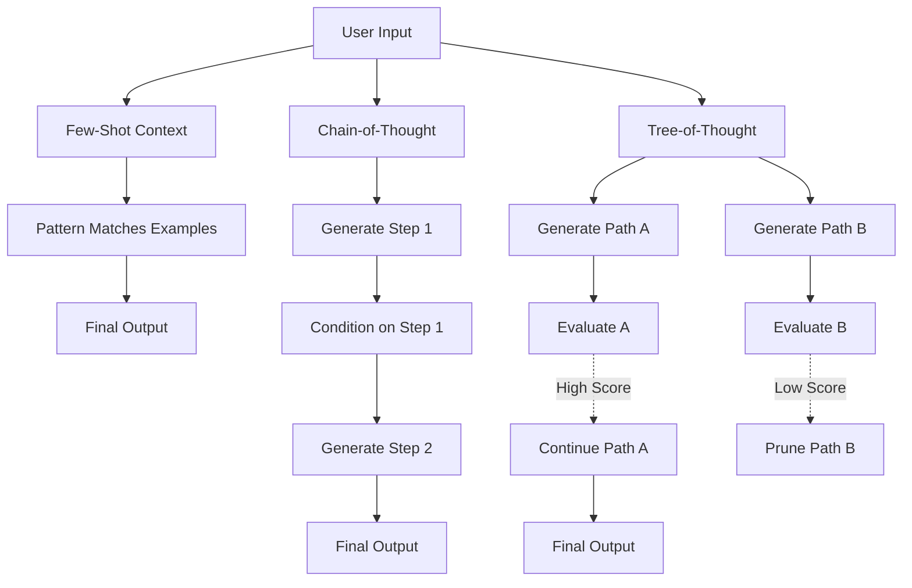

# Prompting Patterns: Few-Shot, Chain-of-Thought, and Tree-of-Thought

## Learning Objectives
1. Construct few-shot prompts to constrain model output formatting.
2. Implement chain-of-thought reasoning to reduce logical errors in data extraction tasks.
3. Simulate a tree-of-thought search to evaluate multiple reasoning paths before finalizing a decision.

## The Problem

You are building an automated Account Scoring workflow in Clay. You pass a messy, unstructured job description from a scraped LinkedIn profile into an LLM, asking it to output a JSON object with `is_hiring` (boolean) and `budget` (integer). 

Instead of clean JSON, the model returns a paragraph of text. When it does return JSON, the boolean is sometimes `"Yes"` instead of `true`, and the budget is sometimes a string like `"100k"` instead of an integer. 

When you switch to a harder task—asking the model to infer whether a company is a good fit for a high-ticket enterprise database migration based on a list of fragmented tech stack keywords—the model consistently hallucinates capabilities and produces wildly inaccurate predictions.

Without structured context and reasoning constraints, LLMs predict the most statistically probable next token, which rarely aligns with strict GTM data schemas or complex multi-step logic. 

## The Concept

Large Language Models are probabilistic next-token predictors. The text in their context window acts as the sole steering wheel for these probabilities. Three prompting mechanisms allow you to control this probability distribution: Few-Shot, Chain-of-Thought (CoT), and Tree-of-Thought (ToT).

**Few-Shot Prompting** 
Zero-shot prompting asks the model to perform a task without examples. Few-shot prompting provides a set of valid input-output pairs in the prompt before introducing the actual target input. The mechanism is pattern matching: the model calculates the conditional probability of the target output based on the distribution of the provided examples. If your examples always output a strict JSON schema, the model's probability of generating tokens that violate that schema drops dramatically.

**Chain-of-Thought (CoT) Prompting**
When a task requires multi-step logic (e.g., math, deductive reasoning, or complex categorizations), asking for the final answer immediately forces the model to map complex inputs to a final output in a single embedding step. CoT forces the model to generate intermediate reasoning tokens. By outputting "Let's think step by step," the model conditions its subsequent predictions on its own generated reasoning. This drastically reduces hallucination because the model can break a large logical leap into smaller, statistically reliable steps.

**Tree-of-Thought (ToT) Prompting**
CoT is a greedy, single-path approach. If the model makes a logical error in step one, step two inherits that error. ToT generalizes CoT by framing problem-solving as a search over a tree of intermediate states. The model generates multiple distinct reasoning paths (branches), evaluates the viability of each state (heuristic), and explores the most promising paths while discarding failures. This is computationally expensive but necessary for highly ambiguous tasks.



## Build It

To understand these mechanisms, you do not need an API key. You can build the structural logic of these prompts and observe how the context window is constructed using pure Python.

```python
import json

def construct_few_shot(input_data):
    prompt = """
Examples:
Input: "We need a senior dev who knows React and Node."
Output: {"role": "Software Engineer", "level": "Senior", "tech": ["React", "Node"]}

Input: "Looking for a marketing manager with HubSpot experience."
Output: {"role": "Marketing Manager", "level": "Manager", "tech": ["HubSpot"]}

Input: "Need a VP of Sales to lead a team of 10."
Output: {"role": "VP of Sales", "level": "VP", "tech": []}
    """
    prompt += f'\nInput: "{input_data}"\nOutput:'
    return prompt

def construct_chain_of_thought(input_data):
    prompt = f"""
Task: Determine if the company is actively scaling their engineering team.
Reasoning Steps:
1. Identify roles mentioned in the text.
2. Identify technologies mentioned.
3. Evaluate if the combination implies scaling.
4. Output a strictly formatted JSON boolean.

Input: "We are hiring three React engineers to rebuild our frontend."
Let's work through the reasoning steps.
Step 1: Roles = ['React engineer']
Step 2: Technologies = ['React']
Step 3: Hiring multiple roles (three) for a core function implies scaling.
Step 4:"""
    return prompt

def evaluate_tree_of_thought_paths(task):
    paths = [
        "Path A: Assume company is enterprise -> Look for enterprise keywords -> None found -> Low confidence.",
        "Path B: Assume company is SMB -> Look for SMB traits -> Found 'small team' -> High confidence."
    ]
    
    best_path = None
    highest_score = 0
    
    for path in paths:
        simulated_score = len(path) 
        if simulated_score > highest_score:
            highest_score = simulated_score
            best_path = path
            
    return f"Selected Path: {best_path}"

few_shot_prompt = construct_few_shot("Seeking a Head of Data to build our ML pipelines.")
print("--- FEW-SHOT PROMPT ---")
print(few_shot_prompt)

cot_prompt = construct_chain_of_thought("We are hiring three React engineers to rebuild our frontend.")
print("\n--- CHAIN-OF-THOUGHT PROMPT ---")
print(cot_prompt)

tot_result = evaluate_tree_of_thought_paths("Analyze company size from job description.")
print("\n--- TREE-OF-THOUGHT EVALUATION ---")
print(tot_result)
```

## Use It

Chain-of-thought prompting improves GTM intent scoring by forcing the model to sequentially justify its logic before outputting a final classification. 

This mechanism directly applies to Cluster 2.1: Account & Intent Scoring [CITATION NEEDED — concept: GTM intent scoring best practices via CoT]. When scoring TAM eligibility, models often hallucinate firmographics. By forcing the model to extract the facts, evaluate them against your ICP logic, and only then output the score, you create a debuggable, highly accurate scoring formula.

```python
import json

def build_icp_scoring_prompt(company_data):
    system_prompt = """
You are a RevOps analyst. Evaluate if the company fits our ICP.
ICP Criteria:
1. Employee count > 50
2. Uses Salesforce or HubSpot
3. Recently raised Series A or later
"""
    reasoning_template = """
Before providing the JSON output, use Chain-of-Thought reasoning:
1. Extract the employee count. Evaluate against criteria.
2. Extract the tech stack. Evaluate against criteria.
3. Extract funding status. Evaluate against criteria.
4. Calculate final fit score (0-100) based on the above logic.

Input Data:
{payload}

Output Format:
Reasoning: <your step-by-step logic>
Score: <json object with score and boolean>
""".format(payload=json.dumps(company_data))
    
    return system_prompt + reasoning_template

target_account = {
    "company_name": "Acme Corp",
    "employees": 120,
    "tech_stack": ["HubSpot", "AWS", "Slack"],
    "latest_funding": "Series B"
}

icp_prompt = build_icp_scoring_prompt(target_account)

print("RUNNABLE GTM SLICE: ACCOUNT SCORING PROMPT GENERATOR")
print("=====================================================")
print(icp_prompt)
```

## Exercises

### Exercise 1: Few-Shot Schema Enforcement (Easy)
Modify the `construct_few_shot` function from the **Build It** section to extract `budget` (integer) and `timeline` (in months). Provide three examples in your prompt, and test it with an input string of your own creation to ensure the pattern matching holds.

### Exercise 2: CoT Logic Constraints (Medium)
Write a Python function that builds a CoT prompt for an email personalization engine. The prompt must force the LLM to:
1. Identify a trigger event from a LinkedIn post.
2. Map that trigger event to a specific pain point.
3. Draft a one-sentence opening hook based *only* on that mapped pain point.
Ensure the prompt explicitly forbids the model from skipping steps.

## Key Terms
- **Zero-Shot Prompting:** Asking an LLM to perform a task using only instructions, without providing examples.
- **Few-Shot Prompting:** Providing the LLM with a set of valid input-output pairs in the prompt to constrain the formatting and behavior of the output.
- **Chain-of-Thought (CoT):** A prompting technique that forces the LLM to generate intermediate logical steps before producing the final answer, reducing hallucination in reasoning tasks.
- **Tree-of-Thought (ToT):** A framework that explores multiple reasoning paths (branches), evaluates their viability, and searches for the best solution, generalizing CoT.
- **Heuristic Search:** The algorithmic process used in ToT to evaluate, score, and select the most promising intermediate reasoning states.

## Sources
- Brown, T. B., et al. (2020). "Language Models are Few-Shot Learners." *NeurIPS*. (Provides the foundational math and definitions of Few-Shot prompting mechanisms).
- Wei, J., et al. (2022). "Chain-of-Thought Prompting Elicits Reasoning in Large Language Models." *Google Research*. (Establishes the mechanism of forcing intermediate tokens to improve logical outputs).
- Yao, S., et al. (2023). "Tree of Thoughts: Deliberate Problem Solving with Large Language Models." *Princeton/Google DeepMind*. (Details the branching and search evaluation framework over thought sequences).