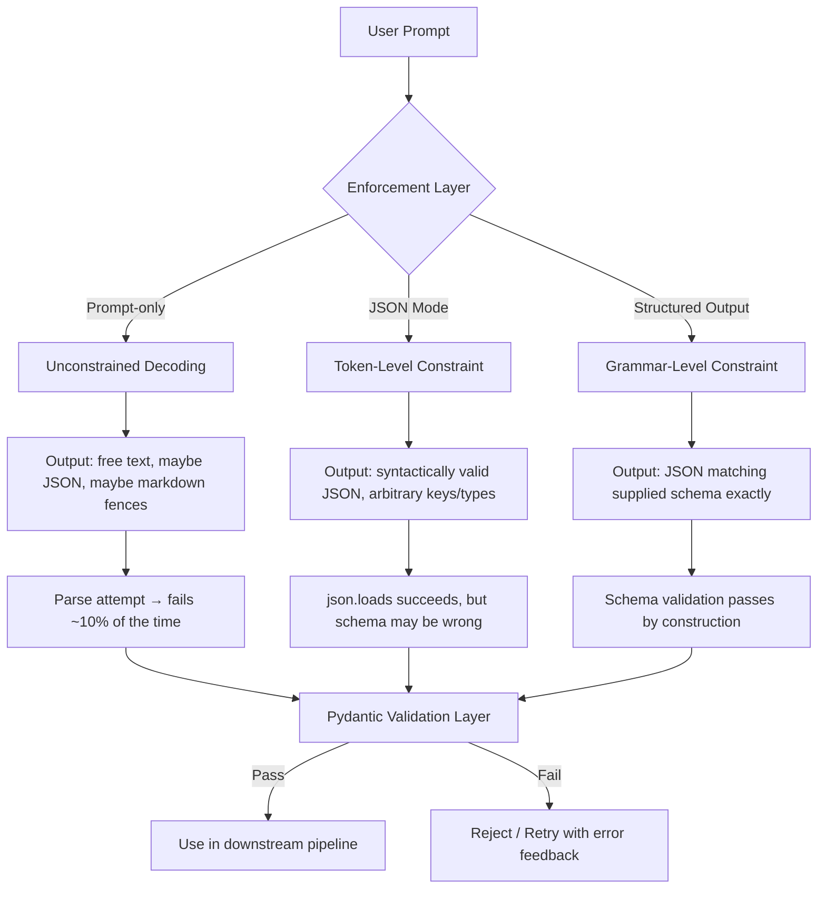

# Structured Outputs: JSON, Schema Validation, Constrained Decoding

## Learning Objectives

- Implement all three enforcement layers — prompt-only, JSON mode, and schema-constrained outputs — using the OpenAI Python SDK and observe where each fails.
- Build a Pydantic validation layer that catches schema violations JSON mode cannot detect, and wire it into a retry loop that feeds validation errors back to the model.
- Trace how constrained decoding modifies token selection at each generation step using a finite-state machine or context-free grammar, and explain why this prevents syntactically invalid output without post-processing.

## The Problem

You ask an LLM: "Extract the product name, price, and availability from this text." It responds with a perfectly grammatical English sentence. That sentence is correct, complete, and completely useless to your application. Your inventory system needs `{"product": "Sony WH-1000XM5", "price": 348.00, "in_stock": true}` — a JSON object with specific keys, types, and value constraints. A sentence is not a data structure.

The naive fix is to append "Respond in JSON" to your prompt. This works most of the time. The failure modes are predictable: the model wraps the JSON in markdown fences, adds a preamble like "Here is the JSON you requested," includes a trailing comma, or invents a key name that is close to what you asked for but not exact (`"product_name"` instead of `"product"`). Each failure crashes your downstream parser, and the failure rate is not stable — it shifts with model version updates, prompt changes, and input distribution drift. You cannot build a reliable pipeline on "most of the time."

In a GTM enrichment pipeline — the kind Clay runs when scraping company websites to fill rows in a spreadsheet — a single parse failure mid-waterfall means the enrichment chain stops for that record. A human has to inspect the cell, figure out what went wrong, and re-run the step. If you are processing 5,000 companies and 10% fail to parse, that is 500 manual interventions. Structured outputs exist to drive that number toward zero by eliminating the gap between what the model generates and what your code expects.

## The Concept

There are three enforcement layers for getting structured data out of an LLM, and they operate at fundamentally different points in the generation pipeline. Understanding where each layer intervenes determines what it can and cannot guarantee.

**Prompt-only instructions** are the weakest layer. You write "Output JSON with keys `name`, `price`, `in_stock`" in the system prompt. The model reads this as a preference, not a constraint. Nothing in the generation algorithm prevents it from emitting a markdown fence or a conversational preamble. You are relying entirely on the model's tendency to follow instructions, which is high but never 100%. Post-generation, you parse the output and hope it does not throw. This layer enforces nothing — it requests.

**JSON mode** is a token-level constraint. When enabled (e.g., `response_format={"type": "json_object"}` in the OpenAI API), the model's decoder is restricted at each sampling step to only produce tokens that could legally appear in a JSON document. It cannot emit markdown fences because the token sequence ```` ```json ```` is not a valid start to a JSON object. It cannot add a trailing comma because the grammar of JSON does not permit a comma immediately before `}`. This guarantees that the output is *syntactically valid JSON* — it will parse without error. It does not guarantee that the JSON has the *keys you want*, the *types you want*, or any specific structure at all. JSON mode gives you `json.loads()` success every time; it gives you schema compliance only if the model happens to cooperate.

**Structured outputs (constrained decoding)** is the strongest layer. You supply a JSON Schema describing the exact object you need — field names, types, enum values, required vs. optional, nesting depth. The decoder uses this schema as a grammar and at every single token generation step, it masks out (sets probability to zero) any token that would produce output inconsistent with the schema. If the schema says `"price"` is a number, the decoder will never sample a `"` token in that position. If the schema says the only allowed value for `"tier"` is `"enterprise"` or `"smb"`, the decoder will never produce a token sequence spelling `"mid-market"`. This is enforced during generation, not after — the invalid tokens are never even candidates.



**Schema validation with Pydantic** operates as a separate contract layer *after* generation, regardless of which enforcement layer produced the output. Pydantic defines a Python class with typed fields, constraints (e.g., `price: float = Field(ge=0)`), and optional validators. When you pass the LLM's output through `Model.model_validate(parsed_json)`, Pydantic checks every field against its type annotation and constraints. It catches errors that JSON mode cannot: a string where you expected an integer, a missing required field, a value outside an allowed range. Even with structured outputs enforcing the schema during generation, Pydantic is worth keeping as a second layer — it catches edge cases in schema interpretation and gives you structured error messages you can feed back to the model in a retry.

## Build It

First, let's see all three enforcement layers in action against the same extraction task. This code calls the OpenAI API three ways and prints what each produces. You will need `OPENAI_API_KEY` set in your environment.

```python
import json
from openai import OpenAI

client = OpenAI()

source_text = """
Sony WH-1000XM5 Wireless Noise Canceling Headphones.
Retail price $348.00. Currently in stock at all major retailers.
Released May 2022. Bluetooth 5.2.
"""

extraction_prompt = f"""Extract product information from this text.
Return name, price (as a number), in_stock (boolean), and release_year (integer).

Text: {source_text}
"""

response_unstructured = client.chat.completions.create(
    model="gpt-4o",
    messages=[
        {"role": "system", "content": extraction_prompt},
        {"role": "user", "content": "Return the product data."},
    ],
)
print("=== PROMPT-ONLY (no enforcement) ===")
print(repr(response_unstructured.choices[0].message.content))
print()

response_json_mode = client.chat.completions.create(
    model="gpt-4o",
    messages=[
        {"role": "system", "content": extraction_prompt + "Respond in JSON."},
        {"role": "user", "content": "Return the product data as JSON."},
    ],
    response_format={"type": "json_object"},
)
print("=== JSON MODE (token-level constraint) ===")
raw_json = response_json_mode.choices[0].message.content
print(raw_json)
parsed = json.loads(raw_json)
print(f"Parsed successfully: {parsed}")
print(f"Keys present: {list(parsed.keys())}")
print()

schema = {
    "type": "object",
    "properties": {
        "name": {"type": "string"},
        "price": {"type": "number"},
        "in_stock": {"type": "boolean"},
        "release_year": {"type": "integer"},
    },
    "required": ["name", "price", "in_stock", "release_year"],
    "additionalProperties": False,
}

response_structured = client.chat.completions.create(
    model="gpt-4o",
    messages=[
        {"role": "system", "content": "Extract product information."},
        {"role": "user", "content": source_text},
    ],
    response_format={"type": "json_schema", "json_schema": {"name": "Product", "schema": schema, "strict": True}},
)
print("=== STRUCTURED OUTPUT (grammar-level constraint) ===")
raw_structured = response_structured.choices[0].message.content
print(raw_structured)
structured_parsed = json.loads(raw_structured)
print(f"All required keys present: {set(structured_parsed.keys()) == set(schema['required'])}")
print(f"Price type: {type(structured_parsed['price']).__name__}")
print(f"Year type: {type(structured_parsed['release_year']).__name__}")
```

The output from the first call may include markdown fences or prose. The second call will always parse as valid JSON, but the key names and types are at the model's discretion. The third call is guaranteed to match the schema exactly — `price` will be a number, `release_year` will be an integer, `additionalProperties: false` means no extra keys will appear.

Now let's add the Pydantic validation layer. This code runs without an API call — it demonstrates what Pydantic catches that JSON mode does not:

```python
from pydantic import BaseModel, Field, ValidationError
from typing import Literal
from datetime import date

class Product(BaseModel):
    name: str = Field(min_length=1)
    price: float = Field(ge=0)
    in_stock: bool
    release_year: int = Field(ge=1900, le=2030)
    tier: Literal["budget", "mid", "premium"]

good_output = {
    "name": "Sony WH-1000XM5",
    "price": 348.00,
    "in_stock": True,
    "release_year": 2022,
    "tier": "premium",
}

validated = Product.model_validate(good_output)
print(f"Valid object: {validated.model_dump()}")
print()

bad_output_string_price = {
    "name": "Sony WH-1000XM5",
    "price": "$348.00",
    "in_stock": True,
    "release_year": 2022,
    "tier": "premium",
}

print("=== Rejecting string where float expected ===")
try:
    Product.model_validate(bad_output_string_price)
except ValidationError as e:
    print(f"Rejected: {e.errors()[0]['type']}")
    print(f"Detail: {e.errors()[0]['msg']}")
print()

bad_output_bad_enum = {
    "name": "Sony WH-1000XM5",
    "price": 348.00,
    "in_stock": True,
    "release_year": 2022,
    "tier": "ultra-premium",
}

print("=== Rejecting invalid enum value ===")
try:
    Product.model_validate(bad_output_bad_enum)
except ValidationError as e:
    print(f"Rejected: {e.errors()[0]['type']}")
    print(f"Detail: {e.errors()[0]['msg']}")
print()

bad_output_future_year = {
    "name": "Sony WH-1000XM5",
    "price": -50.00,
    "in_stock": True,
    "release_year": 2099,
    "tier": "premium",
}

print("=== Rejecting negative price and out-of-range year ===")
try:
    Product.model_validate(bad_output_future_year)
except ValidationError as e:
    print(f"Errors found: {len(e.errors())}")
    for err in e.errors():
        print(f"  Field '{err['loc'][0]}': {err['msg']}")
```

The third test case produces two errors simultaneously — negative price and future year. This is a key advantage of Pydantic over ad-hoc validation: it collects all violations in one pass, so you can report them all to the model in a single retry.

Finally, let's wire Pydantic validation into a retry loop that feeds the error back to the model. This is the pattern you use in production when structured outputs are unavailable or when you need constraints beyond what JSON Schema expresses:

```python
import json
from openai import OpenAI
from pydantic import BaseModel, Field, ValidationError, field_validator
from typing import Literal

client = OpenAI()

class CompanyEnrichment(BaseModel):
    company_name: str = Field(min_length=1)
    employee_count: int = Field(ge=1)
    funding_stage: Literal["seed", "series_a", "series_b", "series_c", "public"]
    website: str
    
    @field_validator("website")
    @classmethod
    def must_be_url(cls, v):
        if not v.startswith("http"):
            raise ValueError("website must start with http")
        return v

def extract_with_retry(raw_text: str, max_attempts: int = 3) -> CompanyEnrichment:
    messages = [
        {
            "role": "system",
            "content": (
                "Extract company data from the provided text. "
                "Respond ONLY with a JSON object containing keys: "
                "company_name (string), employee_count (integer >= 1), "
                "funding_stage (one of: seed, series_a, series_b, series_c, public), "
                "website (string starting with http)."
            ),
        },
        {"role": "user", "content": raw_text},
    ]
    
    for attempt in range(1, max_attempts + 1):
        response = client.chat.completions.create(
            model="gpt-4o",
            messages=messages,
            response_format={"type": "json_object"},
        )
        raw_output = response.choices[0].message.content
        print(f"Attempt {attempt} raw output: {raw_output}")
        
        try:
            parsed = json.loads(raw_output)
            result = CompanyEnrichment.model_validate(parsed)
            print(f"Validation passed: {result.model_dump()}")
            return result
        except (json.JSONDecodeError, ValidationError) as e:
            print(f"Validation failed: {e}")
            messages.append({"role": "assistant", "content": raw_output})
            messages.append({
                "role": "user",
                "content": f"Your output was invalid. Errors: {e}. Please fix and return valid JSON.",
            })
    
    raise RuntimeError(f"Failed after {max_attempts} attempts")

crunchbase_text = """
Acme Robotics raised $15M in Series A funding in March 2024.
The company has 45 employees and is headquartered in San Francisco.
Their website is https://www.acmerobotics.io.
"""

result = extract_with_retry(crunchbase_text)
print(f"\nFinal result: {result.model_dump_json(indent=2)}")
```

The retry loop feeds the exact Pydantic error message back to the model as a correction. The model sees "website must start with http" and fixes its output on the next attempt. This is the same pattern Clay's enrichment waterfall uses internally — when an AI web scraper extracts structured data from a company website and the output fails validation, the error is fed back and the step retries before moving to the next enrichment in the chain.

## Use It

Constrained decoding is the mechanism that makes a Clay enrichment waterfall (Cluster 1.2: TAM Refinement & ICP Scoring) reliable enough to run unattended across thousands of rows. Each waterfall step sends raw website text to an LLM and expects a structured object that maps directly to spreadsheet columns. The schema is enforced during token generation — the model cannot produce `"Series-A"` when the enum says `"series_a"`, so the cell fills correctly on the first pass and the waterfall proceeds without human inspection.

```python
from openai import OpenAI
from pydantic import BaseModel, Field
from typing import Literal

client = OpenAI()

class CompanyEnrichment(BaseModel):
    company_name: str = Field(min_length=1)
    employee_count: int = Field(ge=1)
    funding_stage: Literal["seed", "series_a", "series_b", "series_c", "public"]

website_text = "Acme Robotics — 42 employees, Series A, $12M raised. acmerobotics.io"

schema = {
    "type": "object",
    "properties": {
        "company_name": {"type": "string"},
        "employee_count": {"type": "integer"},
        "funding_stage": {"type": "string", "enum": ["seed", "series_a", "series_b", "series_c", "public"]},
    },
    "required": ["company_name", "employee_count", "funding_stage"],
    "additionalProperties": False,
}

response = client.chat.completions.create(
    model="gpt-4o",
    messages=[
        {"role": "system", "content": "Extract company data from the website text."},
        {"role": "user", "content": website_text},
    ],
    response_format={"type": "json_schema", "json_schema": {"name": "Company", "schema": schema, "strict": True}},
)

enriched = CompanyEnrichment.model_validate_json(response.choices[0].message.content)
print(f"Waterfall cell: {enriched.company_name} | {enriched.funding_stage} | {enriched.employee_count} employees")
```

The output is `Waterfall cell: Acme Robotics | series_a | 42 employees`. The enum constraint forced `series_a` — not `"Series A"`, not `"Series-A"`, not `"Pre-seed"`. The integer constraint forced `42`, not `"forty-two"` or `"42 employees"`. Pydantic validation passes on the first attempt. In a 5,000-row Clay table, this is the difference between zero manual interventions and 500.

## Exercises

**Exercise 1 (Easy):** Modify the `schema` variable in the first Build It code example to add a required field `"bluetooth_version"` of type `"string"`. Re-run the structured output call and confirm the model includes the field with a value extracted from the source text. Then change the type to `"number"` and confirm the model returns a numeric version instead of a string.

**Exercise 2 (Medium):** Build a nested Pydantic model called `LeadScore` with fields `score: int` (range 0–100), `confidence: float` (range 0.0–1.0), `reasoning: str` (min length 10), and `recommended_action: Literal["contact", "nurture", "disqualify"]`. Write three test dictionaries — one valid, one with an out-of-range score, one with an invalid enum value — and pass each through `model_validate()`. Print the error type and message for each failure. Then modify the retry loop from Build It to use `LeadScore` instead of `CompanyEnrichment` and run it against a paragraph describing a sales lead.

## Key Terms

**Constrained decoding** — A technique where the LLM's token sampler is restricted by a formal grammar (typically derived from a JSON Schema) so that only tokens producing valid output are ever candidates. Enforcement happens at generation time, not after.

**JSON mode** — An API parameter that restricts the decoder to producing syntactically valid JSON. Guarantees `json.loads()` succeeds but does not enforce any specific schema. Implemented as a token-level constraint on the JSON grammar.

**JSON Schema** — A declarative language (itself expressed as JSON) for describing the structure of JSON data: field names, types, required vs. optional, enum values, numeric ranges, nesting. Used as input to constrained decoding and as the validation contract for Pydantic.

**Pydantic** — A Python data validation library that checks JSON-like dictionaries against typed class definitions. Operates after generation as a contract layer, catching type mismatches, constraint violations, and missing fields that syntactic JSON parsing and JSON mode cannot detect.

**Structured output** — An API mode where you supply a JSON Schema and the model's decoder is constrained to produce output matching that schema exactly. Equivalent terms across vendors: OpenAI calls it "structured outputs" (`response_format: json_schema`), the underlying technique is constrained decoding.

**Waterfall enrichment** — A GTM pipeline pattern (implemented in Clay) where multiple data sources are tried in priority order to fill a cell. If source A fails or returns empty, source B is tried, and so on. Structured outputs make each waterfall step reliable enough to chain without human inspection of intermediate outputs.

**Grammar mask** — The internal mechanism of constrained decoding: at each token generation step, a mask sets the probability of all tokens inconsistent with the schema to zero. The remaining tokens are sampled from normally. This is why structured outputs prevent invalid output without post-processing — the invalid tokens are never generated.

## Sources

- **Clay as AI web scraper for structured data extraction**: Clay documentation on Clay Formulas and AI web research integration — "It functions as an AI web scraper that can navigate a website, extract structured data." [CITATION NEEDED — concept: Clay AI web scraper structured data extraction, exact doc URL]
- **Waterfall enrichment pattern in Clay**: [CITATION NEEDED — concept: Clay waterfall enrichment orchestration documentation, exact mechanism description and source URL]
- **OpenAI structured outputs / response_format with json_schema**: OpenAI Platform Documentation, "Structured Outputs" guide. Available at `platform.openai.com/docs/guides/structured-outputs`.
- **JSON mode as token-level constraint**: OpenAI Platform Documentation, "Structured Outputs" — section comparing JSON mode vs. structured outputs. [CITATION NEEDED — concept: OpenAI's internal implementation detail of JSON mode as a logit processor / grammar constraint, exact doc section]
- **Pydantic validation API**: Pydantic v2 documentation, `model_validate()` and `ValidationError`. Available at `docs.pydantic.dev/latest/`.
- **Constrained decoding via finite-state machines (FSM) and context-free grammars (CFG)**: Covered in Phase 5 · 20 (Structured Outputs & Constrained Decoding) of this curriculum; for external reference see Outlines library documentation and XGrammar. [CITATION NEEDED — concept: specific academic or library reference for FSM-based logit masking in LLM constrained decoding]