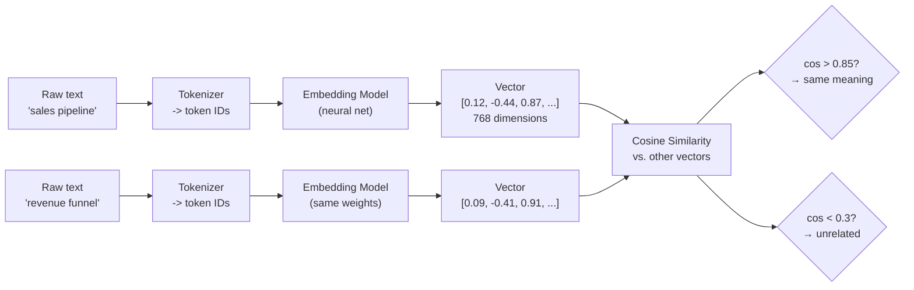

# Embeddings & Vector Representations

## Learning Objectives

- Generate text embeddings using a local open-source model and compute cosine similarity between vector pairs.
- Implement a semantic ranking function that retrieves relevant phrases by meaning rather than keyword overlap.
- Build a semantic router that classifies inbound messages into pre-labeled categories using nearest-neighbor cosine similarity.
- Compare brute-force nearest-neighbor latency against cached lookups to establish baseline production numbers.
- Evaluate router accuracy against human-labeled ground truth using precision, recall, and per-category breakdowns.

## The Problem

You have been matching strings with regex and fuzzy logic. That breaks the moment a prospect says "revenue ops" instead of "RevOps," or writes "we need help with pipeline" when your sequences are keyed on "CRM optimization." Keyword routing assumes the vocabulary of the searcher matches the vocabulary of the indexed content. In practice, they almost never do.

This is the vocabulary mismatch problem. Human language has dozens of ways to express the same intent — "transaction failed," "charge was declined," "billing error," and "payment didn't go through" all describe the same event. Keyword search treats each word as an independent symbol with no relationship to any other. It has no mechanism for knowing that "declined" and "didn't go through" live in the same semantic neighborhood.

In a GTM context, this problem shows up everywhere: inbound lead routing, reply classification, intent-signal detection, account-to-ICP matching from free-text firmographics. Every one of these depends on understanding what a prospect *means*, not what they literally typed. You need a representation of text where meaning — not spelling — determines similarity. Embeddings are that representation.

## The Concept

An embedding is a fixed-length array of floating-point numbers that represents the meaning of a piece of text. A trained neural network (the embedding model) maps tokens — words, sentences, or paragraphs — into a high-dimensional vector space. The key property of this space is that semantically similar texts land near each other. "Sales pipeline" and "revenue funnel" occupy nearby coordinates. "Sales pipeline" and "data engineering" are far apart.

The geometric distance between two vectors encodes semantic similarity. The standard metric is cosine similarity: the cosine of the angle between two vectors. A value of 1.0 means the vectors point in the same direction (same meaning), 0.0 means they are orthogonal (unrelated), and -1.0 means they point in opposite directions (semantically opposed). Cosine similarity is preferred over Euclidean distance for text because it ignores vector magnitude and focuses purely on direction — which maps to meaning.



Everything downstream — similarity search, clustering, classification, semantic routing — is linear algebra on those arrays. There is no magic. Once text is embedded, "find similar documents" becomes "find vectors with the highest cosine similarity to the query vector," which is a dot-product computation you can do at scale.

The embedding model itself is a transformer-based neural network trained on a contrastive objective: given pairs of similar and dissimilar texts, it adjusts its weights to push similar pairs closer and dissimilar pairs apart. Open-source models like `all-MiniLM-L6-v2` (from `sentence-transformers`) are trained on millions of text pairs and produce 384-dimensional vectors. Larger models like `all-mpnet-base-v2` produce 768-dimensional vectors with better separation at the cost of inference speed. The model choice trades quality against latency and cost — you benchmark this for your specific corpus, not against a leaderboard.

## Build It

Install the library first:

```bash
pip install sentence-transformers numpy
```

This block loads a local embedding model, embeds three sentences, computes pairwise cosine similarity, and prints the scores so you can see "sales pipeline" score higher against "revenue funnel" than against "data engineering":

```python
from sentence_transformers import SentenceTransformer
import numpy as np

model = SentenceTransformer("all-MiniLM-L6-v2")

texts = [
    "sales pipeline optimization",
    "revenue funnel management",
    "data engineering infrastructure",
]

embeddings = model.encode(texts, normalize_embeddings=True)

sim_01 = float(np.dot(embeddings[0], embeddings[1]))
sim_02 = float(np.dot(embeddings[0], embeddings[2]))
sim_12 = float(np.dot(embeddings[1], embeddings[2]))

print(f"'{texts[0]}' vs '{texts[1]}': {sim_01:.4f}")
print(f"'{texts[0]}' vs '{texts[2]}': {sim_02:.4f}")
print(f"'{texts[1]}' vs '{texts[2]}': {sim_12:.4f}")

print(f"\nClosest pair: texts[0] and texts[1] with cosine similarity {sim_01:.4f}")
```

Normalized embeddings (unit vectors) let you compute cosine similarity with a simple dot product — no need to divide by magnitudes. This is a standard optimization that production systems use.

Now scale it up. This function takes a query, embeds it, ranks a list of 20 phrases by cosine similarity, and prints the top 5:

```python
from sentence_transformers import SentenceTransformer
import numpy as np

model = SentenceTransformer("all-MiniLM-L6-v2")

phrases = [
    "CRM integration setup",
    "sales funnel optimization",
    "lead scoring model",
    "revenue operations consulting",
    "pipeline acceleration strategy",
    "marketing automation tools",
    "data warehouse architecture",
    "ETL pipeline development",
    "kubernetes cluster management",
    "customer onboarding workflow",
    "territory planning framework",
    "quota attainment analysis",
    "forecast accuracy improvement",
    "churn prediction modeling",
    "sales enablement content",
    "deal stage definitions",
    "MEDDPICC qualification",
    "outbound prospecting sequences",
    "account-based marketing campaigns",
    "win-loss analysis program",
]

phrase_embeddings = model.encode(phrases, normalize_embeddings=True)

def semantic_search(query, phrase_list, phrase_embs, top_k=5):
    query_emb = model.encode([query], normalize_embeddings=True)[0]
    scores = phrase_embs @ query_emb
    ranked = sorted(zip(scores, phrase_list), reverse=True)[:top_k]
    return [(phrase, float(score)) for score, phrase in ranked]

results = semantic_search(
    "how do we grow revenue faster",
    phrases,
    phrase_embeddings,
    top_k=5,
)

print("Query: 'how do we grow revenue faster'\n")
for rank, (phrase, score) in enumerate(results, 1):
    print(f"  {rank}. {phrase} — {score:.4f}")
```

Finally, establish a baseline latency number for brute-force search over a larger set. You need this number to know when to upgrade to an approximate nearest-neighbor index (HNSW, IVF) — if brute-force is fast enough at your corpus size, the added complexity is not justified:

```python
from sentence_transformers import SentenceTransformer
import numpy as np
import time

model = SentenceTransformer("all-MiniLM-L6-v2")

corpus = [f"document number {i} about topic {i % 10}" for i in range(200)]
corpus_embeddings = model.encode(corpus, normalize_embeddings=True)

query = "find documents about topic 3"
query_embedding = model.encode([query], normalize_embeddings=True)[0]

start = time.perf_counter()
scores = corpus_embeddings @ query_embedding
elapsed = time.perf_counter() - start

top_k = 5
top_indices = np.argsort(scores)[::-1][:top_k]

print(f"Corpus size: {len(corpus)}")
print(f"Brute-force search latency: {elapsed * 1000:.3f} ms")
print(f"\nTop {top_k} results:")
for i, idx in enumerate(top_indices, 1):
    print(f"  {i}. {corpus[idx]} — {scores[idx]:.4f}")

start_all = time.perf_counter()
for _ in range(1000):
    _ = corpus_embeddings @ query_embedding
elapsed_all = time.perf_counter() - start_all

print(f"\nAverage over 1000 queries: {elapsed_all:.3f} ms total, {elapsed_all / 1000 * 1000:.3f} ms/query")
```

At 200 documents, brute-force is sub-millisecond. At 1 million documents, it will be 5,000× slower. That crossover point — somewhere between 10K and 100K vectors depending on your latency budget — is where you need a vector index. Until then, a NumPy matrix multiply is all you need.

## Use It

Every inbound lead arrives with free-text data: form comments, email replies, LinkedIn messages, chat transcripts. Keyword routing misses the edge cases — and edge cases are where the highest-intent leads often hide. A prospect who writes "we're evaluating platforms for our revenue stack" should route to your sales engagement sequence, but a keyword router looking for "demo" or "pricing" will file it as noise.

Semantic routing replaces keyword matching with embedding-based nearest-neighbor classification. You pre-embed a set of category labels (e.g., "sales engagement," "technical evaluation," "budget discussion"), embed each inbound message, and assign it to the category with the highest cosine similarity. This is the Signal Machine inside Inbound-Led Outbound — semantic classification that routes leads before they go cold [CITATION NEEDED — concept: Inbound-Led Outbound Signal Machine as described in GTM curriculum section 3.3].

Here is the routing function with a confidence score, plus five test messages routed against three categories:

```python
from sentence_transformers import SentenceTransformer
import numpy as np

model = SentenceTransformer("all-MiniLM-L6-v2")

categories = [
    "sales engagement and demo request",
    "technical evaluation and integration questions",
    "budget discussion and pricing inquiry",
]

category_embeddings = model.encode(categories, normalize_embeddings=True)

inbound_messages = [
    "we'd love to see a demo for our team",
    "does your platform integrate with salesforce and hubspot",
    "what's the pricing for 50 seats",
    "our vp of sales wants to evaluate this before q4",
    "can we get a technical deep dive on your api",
]

message_embeddings = model.encode(inbound_messages, normalize_embeddings=True)

print("Routing Results:\n")
for msg, msg_emb in zip(inbound_messages, message_embeddings):
    scores = category_embeddings @ msg_emb
    best_idx = int(np.argmax(scores))
    confidence = float(scores[best_idx])
    print(f"Message: \"{msg}\"")
    print(f"  → {categories[best_idx]}")
    print(f"  Confidence: {confidence:.4f}")
    print(f"  All scores: {dict(zip(categories, [f'{s:.4f}' for s in scores]))}\n")

def semantic_router(message, threshold=0.3):
    msg_emb = model.encode([message], normalize_embeddings=True)[0]
    scores = category_embeddings @ msg_emb
    best_idx = int(np.argmax(scores))
    best_score = float(scores[best_idx])
    if best_score < threshold:
        return "unclassified", best_score
    return categories[best_idx], best_score

test = "our data team needs to understand your security posture before we proceed"
result, score = semantic_router(test)
print(f"Edge case test: \"{test}\"")
print(f"  → {result} (score: {score:.4f})")
```

Now evaluate the router against labeled ground truth. This is where reply classification becomes your eval feedback loop — the same loop Zone 11 identifies as the mechanism for testing GTM automation before it ships. You run historical inbound messages through the router, compare automated assignments against human labels, and measure accuracy, precision, and recall per category [CITATION NEEDED — concept: Zone 11 mapping reply classification as eval feedback loop in Living GTM framework]:

```python
from sentence_transformers import SentenceTransformer
import numpy as np

model = SentenceTransformer("all-MiniLM-L6-v2")

categories = ["sales engagement", "technical evaluation", "budget discussion"]
category_embeddings = model.encode(categories, normalize_embeddings=True)

ground_truth = [
    ("we want to see a demo", "sales engagement"),
    ("pricing for 100 users", "budget discussion"),
    ("how does your api work", "technical evaluation"),
    ("can someone walk us through the product", "sales engagement"),
    ("what are your enterprise rates", "budget discussion"),
    ("do you support sso and scim", "technical evaluation"),
    ("interested in a trial", "sales engagement"),
    ("cost comparison vs competitor", "budget discussion"),
    ("webhook documentation available", "technical evaluation"),
    ("set up a call with our team", "sales engagement"),
    ("volume discount tiers", "budget discussion"),
    ("data residency requirements", "technical evaluation"),
]

messages = [msg for msg, _ in ground_truth]
labels = [lbl for _, lbl in ground_truth]
message_embeddings = model.encode(messages, normalize_embeddings=True)

predictions = []
for msg_emb in message_embeddings:
    scores = category_embeddings @ msg_emb
    predictions.append(categories[int(np.argmax(scores))])

correct = sum(p == l for p, l in zip(predictions, labels))
accuracy = correct / len(labels)
print(f"Overall accuracy: {accuracy:.2%} ({correct}/{len(labels)})\n")

print("Per-category metrics:")
for cat in categories:
    tp = sum(1 for p, l in zip(predictions, labels) if p == cat and l == cat)
    fp = sum(1 for p, l in zip(predictions, labels) if p == cat and l != cat)
    fn = sum(1 for p, l in zip(predictions, labels) if p != cat and l == cat)
    precision = tp / (tp + fp) if (tp + fp) > 0 else 0.0
    recall = tp / (tp + fn) if (tp + fn) > 0 else 0.0
    f1 = 2 * precision * recall / (precision + recall) if (precision + recall) > 0 else 0.0
    print(f"  {cat}:")
    print(f"    precision: {precision:.2f}  recall: {recall:.2f}  f1: {f1:.2f}")

print("\nMisclassifications:")
for msg, label, pred in zip(messages, labels, predictions):
    if label != pred:
        print(f"  \"{msg}\" → predicted: {pred}, actual: {label}")
```

Run this and study the misclassifications. The errors are more informative than the accuracy number. If all the misses are "budget discussion" messages being routed to "sales engagement," your category labels are too close in embedding space and you need to either rename them or add more specific anchor text. This iterative tuning — label → embed → evaluate → relabel — is the same eval cycle Zone 11 prescribes for reply classification as a feedback loop.

## Ship It

Production embedding pipelines fail in three predictable ways: you re-embed unchanged records and pay for it, you batch one-at-a-time and add 50× latency, or the provider silently updates model weights and your similarity thresholds drift. None of these are exotic. All three will hit you in the first week of production.

Batch embedding is the lowest-effort, highest-impact fix. Embedding models are optimized for batch input — the GPU/CPU amortizes the forward pass across multiple texts. Calling `.encode()` on individual strings in a loop is the most common production mistake. Measure it:

```python
from sentence_transformers import SentenceTransformer
import time

model = SentenceTransformer("all-MiniLM-L6-v2")

texts = [f"inbound message number {i} about topic {i % 5}" for i in range(50)]

start = time.perf_counter()
for text in texts:
    _ = model.encode([text])
loop_time = time.perf_counter() - start

start = time.perf_counter()
_ = model.encode(texts)
batch_time = time.perf_counter() - start

print(f"50 texts, one-at-a-time: {loop_time:.3f}s ({loop_time / 50 * 1000:.1f} ms/item)")
print(f"50 texts, single batch:  {batch_time:.3f}s ({batch_time / 50 * 1000:.1f} ms/item)")
print(f"Speedup: {loop_time / batch_time:.1f}x")
```

Caching prevents re-embedding. If a record's text hasn't changed, its vector hasn't changed. Hash the input text, store the vector keyed by that hash, and skip the model call on cache hits. This matters because embedding is the most expensive part of a semantic search pipeline — the dot-product search itself is nearly free by comparison:

```python
from sentence_transformers import SentenceTransformer
import hashlib
import json
import os
import time
import numpy as np

model = SentenceTransformer("all-MiniLM-L6-v2")

CACHE_FILE = "embedding_cache.json"

def load_cache():
    if os.path.exists(CACHE_FILE):
        with open(CACHE_FILE, "r") as f:
            return json.load(f)
    return {}

def save_cache(cache):
    with open(CACHE_FILE, "w") as f:
        json.dump(cache, f)

def embed_with_cache(texts, model_name="all-MiniLM-L6-v2"):
    cache = load_cache()
    cache_key_prefix = f"{model_name}:"
    results = []
    uncached_texts = []
    uncached_indices = []

    for i, text in enumerate(texts):
        text_hash = hashlib.sha256(text.encode()).hexdigest()
        key = cache_key_prefix + text_hash
        if key in cache:
            results.append((i, cache[key]))
        else:
            uncached_texts.append(text)
            uncached_indices.append(i)

    cache_hits = len(results)
    cache_misses = len(uncached_texts)

    if uncached_texts:
        new_embeddings = model.encode(uncached_texts)
        for idx, text, emb in zip(uncached_indices, uncached_texts, new_embeddings):
            text_hash = hashlib.sha256(text.encode()).hexdigest()
            key = cache_key_prefix + text_hash
            cache[key] = emb.tolist()
            results.append((idx, emb.tolist()))
        save_cache(cache)

    results.sort(key=lambda x: x[0])
    return np.array([r[1] for r in results]), cache_hits, cache_misses

texts = [f"inbound lead message about {topic}" for topic in [
    "pipeline growth", "technical integration", "pricing question",
    "demo request", "security review",
]]

if os.path.exists(CACHE_FILE):
    os.remove(CACHE_FILE)

print("=== First run (cold cache) ===")
start = time.perf_counter()
embs, hits, misses = embed_with_cache(texts)
elapsed = time.perf_counter() - start
print(f"Cache hits: {hits}, misses: {misses}")
print(f"Time: {elapsed:.3f}s")

print("\n=== Second run (warm cache) ===")
start = time.perf_counter()
embs, hits, misses = embed_with_cache(texts)
elapsed = time.perf_counter() - start
print(f"Cache hits: {hits}, misses: {misses}")
print(f"Time: {elapsed:.3f}s")
print(f"Speedup from cache: {'significant' if misses == 0 else 'none — still had misses'}")

print(f"\nEmbedding shape: {embs.shape}")

os.remove(CACHE_FILE)
```

Model version pinning is the silent killer. When an embedding provider updates weights — even a "minor" update — every vector in your database becomes stale relative to the new model. Queries embedded with the new weights will have different cosine similarity relationships against vectors embedded with the old weights. Your thresholds (e.g., "route to sales if cosine > 0.7") will silently break. This is why your embedding store must record which model produced each vector:

```python
from sentence_transformers import SentenceTransformer
import hashlib
import json
import os

MODEL_ID = "all-MiniLM-L6-v2"
STORE_FILE = "versioned_embedding_store.json"

def get_store():
    if os.path.exists(STORE_FILE):
        with open(STORE_FILE, "r") as f:
            return json.load(f)
    return {"model_id": MODEL_ID, "records": {}}

def embed_and_store(texts, force_recompute=False):
    store = get_store()

    if store["model_id"] != MODEL_ID:
        print(f"WARNING: Store was built with '{store['model_id']}', "
              f"but current model is '{MODEL_ID}'.")
        print("All vectors must be recomputed. Setting force_recompute=True.")
        force_recompute = True
        store = {"model_id": MODEL_ID, "records": {}}

    model = SentenceTransformer(MODEL_ID)

    for text in texts:
        text_hash = hashlib.sha256(text.encode()).hexdigest()
        if text_hash in store["records"] and not force_recompute:
            continue
        emb = model.encode([text])[0]
        store["records"][text_hash] = {
            "text": text,
            "model_id": MODEL_ID,
            "vector": emb.tolist(),
        }

    with open(STORE_FILE, "w") as f:
        json.dump(store, f)

    return store

texts = ["lead about pipeline", "technical question about api", "pricing inquiry"]

if os.path.exists(STORE_FILE):
    os.remove(STORE_FILE)

store = embed_and_store(texts)
print(f"Model ID: {store['model_id']}")
print(f"Records stored: {len(store['records'])}")

print("\nSimulating model version mismatch:")
store["model_id"] = "all-MiniLM-L6-v1"
with open(STORE_FILE, "w") as f:
    json.dump(store, f)

store = embed_and_store(["new text after version change"])
print(f"Store rebuilt with model: {store['model_id']}")
print(f"Records after rebuild: {len(store['records'])}")

os.remove(STORE_FILE)
```

The practical takeaway: pin your model version in configuration, store it alongside every vector, and write a migration script that detects version drift and re-embeds your entire corpus atomically. Never mix vectors from different model versions in the same index — the cosine similarities across versions are meaningless.

## Exercises

1. **Embedding space exploration.** Embed these six phrases and compute the full 6×6 similarity matrix: "sales pipeline," "revenue funnel," "CRM optimization," "data warehouse," "ETL pipeline," "kubernetes deployment." Print the matrix as a labeled grid. Identify which pair scores highest that is *not* an identical phrase, and explain why the embedding model placed them close together.

2. **Threshold sensitivity analysis.** Using the semantic router from Use It, run the 12-message ground truth set with thresholds of 0.15, 0.25, 0.35, and 0.45. For each threshold, print overall accuracy and the count of messages routed to "unclassified." Plot (or print as a table) how accuracy and coverage trade off as you raise the threshold.

3. **Corpus size benchmark.** Generate synthetic corpora of 100, 500, 1000, 2000, and 5000 short texts. For each size, measure brute-force search latency (averaged over 100 queries). Print a table of corpus size vs. latency. Identify the size at which latency exceeds 50ms per query — that is your brute-force ceiling for a real-time routing use case.

4. **Category label engineering.** Take the router with three categories. Rename the categories to more specific anchor text (e.g., "sales engagement and demo request" becomes "prospect wants to see a product demo or talk to sales"). Re-run the 12-message ground truth evaluation. Compare precision and recall before and after the rename. Report whether label specificity improved routing accuracy.

## Key Terms

- **Embedding** — A fixed-length array of floats representing the semantic meaning of text, produced by a trained neural network.
- **Cosine similarity** — The cosine of the angle between two vectors; ranges from -1 to 1. Used as the standard similarity metric for embeddings because it captures directional alignment (meaning) independent of magnitude.
- **Embedding model** — A transformer-based neural network trained with a contrastive objective to map semantically similar texts to nearby points in vector space.
- **Brute-force nearest neighbor** — Computing the similarity between a query vector and every vector in the corpus, then returning the top-k. Exact but O(n) per query.
- **Semantic routing** — Classifying text into categories by embedding both the text and category labels, then assigning based on highest cosine similarity. Replaces keyword-based routing.
- **Vocabulary mismatch problem** — The failure of keyword search when different words are used to express the same concept. Embeddings solve this by mapping meaning, not spelling.
- **Model version pinning** — Recording which embedding model produced each stored vector and detecting when a model update invalidates existing vectors.
- **Normalized embeddings** — Unit-length vectors (magnitude = 1) that allow cosine similarity to be computed as a single dot product without denominator terms.

## Sources

- Inbound-Led Outbound and the Signal Machine concept: [CITATION NEEDED — concept: Inbound-Led Outbound Signal Machine as described in GTM curriculum section 3.3]
- Zone 11 (Evaluations, LLM testing) mapping reply classification as eval feedback loop: [CITATION NEEDED — concept: Zone 11 Living GTM framework row mapping reply classification to eval feedback loops]
- `sentence-transformers` documentation and model card for `all-MiniLM-L6-v2`: https://www.sbert.net/docs/model_overview.html
- Cosine similarity for text embeddings — standard linear algebra; see Manning, Raghavan & Schütze, *Introduction to Information Retrieval*, Ch. 6