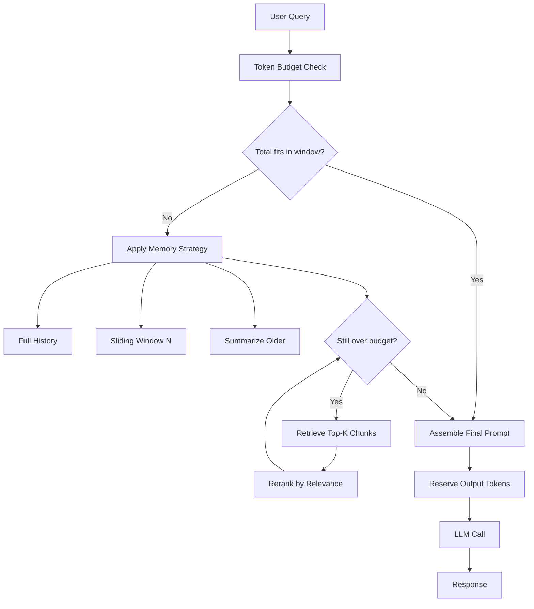

# Context Engineering: Windows, Budgets, Memory, and Retrieval

## Learning Objectives

- Calculate token budgets across system prompt, tool definitions, conversation history, retrieved context, and output reservation
- Implement three memory architectures (full history, sliding window, summarization) and compare their token cost on the same conversation
- Trace the retrieval-augmented generation loop as a budget allocation problem, not a search problem
- Build a context assembler that dynamically allocates tokens across segments and reports headroom before the API call
- Diagnose context overflow conditions (truncation, silent failure, hard error) and predict provider behavior at the boundary

## The Problem

Every LLM call has a hard ceiling: the context window. The window is not "memory" — it is a fixed-size buffer the model processes in a single forward pass. Token count, not character count, determines what fits. Retrieval determines what enters the buffer. Four constraints govern every prompt you ship: window size, token budget, memory strategy, and retrieval policy. Ignore any one and the model either errors, truncates silently, or — the worst case — runs degraded with attention smeared across irrelevant context while you believe it is working.

The trap is that the numbers look enormous. Claude Opus 4.5 has a 200K token window. GPT-5 has 400K. Gemini 3 Pro has 2M. Llama 4 claims 10M. These ceilings sound infinite until you fill them with tool definitions, retrieved documents, and multi-turn history. A coding assistant with 50 tool definitions, 10 retrieved doc chunks, and 12 conversation turns burns 20K+ tokens before the user's question even arrives. That is 2% of a 1M window — and 25% of a 128K window. Add a long output budget and you are at the wall.

Attention does not scale linearly with context length either. A model with 128K tokens of context pays quadratic attention cost in vanilla transformers and exhibits "lost in the middle" degradation where facts buried mid-prompt get ignored. The window limit is the hard constraint; attention degradation is the soft constraint. Context engineering is the discipline of staying well inside both — and knowing which segment to sacrifice first when you cannot.

## The Concept

### Context Window Mechanics

The context window is the maximum number of tokens a model can process in a single call. It is a fixed-size buffer, not persistent memory. Each call receives a fresh window unless you explicitly refill it. The budget equation is mechanical: `input_tokens + output_tokens ≤ context_window`. Input tokens cover system prompt, tool definitions, conversation history, retrieved context, and the current user message. Output tokens are reserved for the model's response — and if you do not reserve them, the model has nothing to generate with.

When the budget is exceeded, behavior depends on the provider. OpenAI returns a hard error (`context_length_exceeded`). Anthropic returns a 400 with a similar message. Some runtimes silently truncate the input from the front, dropping the oldest turns without telling you. None of these are recoverable without re-engineering what went into the prompt. The first job of a context engineer is to never discover the boundary by surprise — measure before you call.

### Token Budgeting

Token count is not character count. Modern LLMs use Byte Pair Encoding (BPE): common subwords and short words get assigned single tokens; rare or long words fragment into multiple tokens. "I love cats" is three tokens. "Antidisestablishmentarianism" is six or seven tokens despite fewer characters per token. Punctuation, whitespace, and special characters all consume tokens. JSON and code are token-dense because of braces, quotes, and indentation. A 1,000-character JSON payload can cost 400+ tokens where the same content as prose might cost 200.

`tiktoken` is the tokenizer OpenAI publishes to estimate token counts for GPT-family models before an API call. Anthropic and Google have their own tokenizers with slightly different counts, but `tiktoken` is a reasonable cross-provider approximation when exact counts are not critical. The discipline it enables is budget reservation: you reserve tokens for output (say 1K–4K), then allocate the remaining budget across system prompt, retrieved context, and conversation history. Every segment competes for the same finite space. [CITATION NEEDED — concept: token budget accounting across prompt segments in production systems]

### Memory Architectures

When a conversation exceeds a single turn, you decide what prior context to carry forward. Three patterns dominate. **Full history** stuffs every prior turn into the prompt, scales linearly with turn count, and hits the ceiling fast — but preserves verbatim recall. **Sliding window** keeps the last N turns and drops the oldest, giving constant token cost per call at the price of long-range context loss. **Summarization** compresses older turns into a summary, appends recent turns verbatim, and trades exact quotes for thematic recall at a fraction of the token cost.

Each trades recall fidelity for token efficiency. The right choice depends on whether the model needs exact quotes from earlier turns or thematic understanding of the conversation arc. A support bot handling a 20-message troubleshooting thread usually wants summarization — the user's original problem statement matters, but the back-and-forth debugging steps can be compressed. A coding assistant editing a file across turns usually wants sliding window with full history of the most recent edits — exact code matters.

### Retrieval-Augmented Context

When the needed information exceeds the window or never appeared in conversation, retrieval fills the gap. The RAG loop is mechanical: embed the query, run similarity search against a vector store, retrieve the top-K chunks, inject them into the prompt, then generate. Every chunk you retrieve consumes tokens that could have been used for instructions, history, or output. Retrieval is not free — it is a budget decision made before generation begins, and a lazy `top_k=10` can eat 3,000 tokens that your output reservation needed.

The retrieval step forces an ordering question: where in the prompt do retrieved chunks go, and in what sequence? Research on "lost in the middle" attention suggests placing the most relevant chunks at the beginning and end of the retrieved block, with lower-relevance chunks in the middle. Some engineers rerank retrieved chunks with a cross-encoder before injection to improve signal-to-noise. Both tactics operate within the same budget constraint — they reorder what fits, they do not expand the window.



## Build It

### Token Budget Reporter

This script takes a realistic GTM prompt — account research with system instructions, tool definitions, retrieved firmographics, and conversation history — and prints a budget report showing how many tokens each segment consumes against a stated window. Run it before every API call in production.

```python
import tiktoken

enc = tiktoken.encoding_for_model("gpt-4")

def count_tokens(text):
    return len(enc.encode(text))

system_prompt = """You are a GTM engineering assistant specialized in account research.
Given account firmographics, technographics, and intent signals, produce a one-paragraph
account summary and a 1-5 priority score with justification."""

tool_definitions = """tools:
- enrich_account(domain): fetch firmographics and technographics
- get_intent_signals(domain): fetch third-party intent data
- score_account(account_data): apply priority scoring rubric
- draft_personalization(account, channel): draft outreach message
- search_similar_accounts(account): find lookalike accounts in CRM"""

retrieved_context = """Acme Corp is a Series B SaaS company in the HR tech space.
Headcount: 240. ARR estimate: $18M. Tech stack includes Salesforce, HubSpot, Segment,
Snowflake, and dbt. Intent signals show elevated research