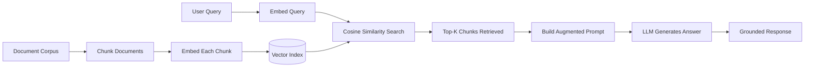

# RAG (Retrieval-Augmented Generation)

## Learning Objectives

- Build a complete RAG pipeline: chunk documents, embed chunks, store in a vector index, retrieve by query similarity, and generate grounded answers
- Implement semantic search using cosine similarity over embeddings and compare fixed-size chunking against semantic chunking strategies
- Trace retrieval failures to root causes: stale indexes, embedder drift, mismatched granularity, and chunk boundary errors
- Evaluate RAG output quality using retrieval metrics (precision@k, recall) and generation metrics (faithfulness, relevance)
- Deploy a RAG pipeline for a GTM research agent that retrieves internal playbooks and competitive intel before generating account briefs

## The Problem

Your LLM was trained on a snapshot of the internet. It has read more text than any human will see in a lifetime, but it has never seen your company's wiki, your CRM notes, or the competitive battlecard your SE updated last Tuesday. When someone asks "what's our win rate against Competitor X in healthcare?" the model does something uncomfortable: it answers. It pattern-matches on the question structure and produces a plausible-sounding response that has zero grounding in your actual data.

This is not a bug. It is the design. LLMs are next-token predictors trained on a fixed corpus. Once training completes, the weights are frozen. The model has no file system, no database connection, no mechanism to look anything up. If your refund policy changed yesterday, the model still "believes" whatever it absorbed during training — which, for your internal docs, is nothing at all.

Fine-tuning is the obvious fix: take the base model, continue training on your documents, deploy updated weights. This works in theory. In practice, you pay compute costs for every document update, the model goes stale the moment a playbook changes, you lose attribution (the model cannot tell you which document it drew from), and fine-tuning on knowledge tasks often degrades general reasoning — a documented phenomenon called catastrophic forgetting. For knowledge that changes frequently, fine-tuning is the wrong tool applied to the wrong problem.

RAG takes a different approach. Instead of baking knowledge into the weights, you keep it in an external index. At query time, you retrieve the relevant chunks and hand them to the model as context. The model reads them and generates an answer grounded in what it sees. The weights never change. The index updates whenever you want. Every answer traces back to a specific source chunk.

## The Concept

The RAG pattern has three stages. First, you embed a user query into the same vector space as your document chunks — converting the natural-language question into a list of numbers that captures semantic meaning. Second, you retrieve the top-k most similar chunks by computing cosine similarity between the query vector and every document vector in the index. Third, you concatenate those chunks into the prompt as context and call the generator. The model's weights stay frozen; only the prompt changes per query.

Embedding models map semantically similar text to nearby points in a high-dimensional space. "How does data enrichment work?" and "Clay waterfall enriches leads by sequencing data providers" land close together because they share meaning, even though they share almost no words. Cosine similarity — the dot product of two normalized vectors — measures the angle between them. A smaller angle means more semantically similar. This is the retrieval signal: chunks closest to the query in vector space are the ones most likely to contain a relevant answer.



No fine-tuning. No gradient descent. No GPU clusters beyond the ones already running inference. You are doing search — old, boring, well-understood search — but in a semantic space instead of a lexical one, and then handing the results to a language model that can synthesize them into coherent prose. The complexity lives in chunking strategy, embedder selection, and index maintenance, not in the core algorithm.

## Build It

Let's build the full pipeline. You need an embedding model to convert text into vectors, a distance function to compare them, and a generator to produce the final answer. We use `text-embedding-3-small` for embeddings (1536 dimensions, cheap, well-calibrated), numpy for vector math, and Chroma as a persistent vector store so your index survives between runs.

First, the retrieval step in isolation. This is the core mechanism — embed a query, embed the corpus, rank by cosine similarity.

```bash
pip install numpy chromadb openai
export OPENAI_API_KEY="sk-..."
```

```python
import numpy as np
from openai import OpenAI

client = OpenAI()

corpus = [
    "Clay waterfall enrichment sequences Apollo, Wiza, and Nimbora until one returns a valid email, then stops.",
    "Medical device sales cycles average 8-14 months due to FDA approval dependencies and hospital capital committees.",
    "ICP scoring weights firmographics 40%, technographics 30%, and intent signals 30% in the current RevOps model.",
    "Competitor WinLoss has a weaker API at 50 calls per minute and lacks waterfall enrichment; we win on data coverage.",
    "Enterprise outbound sequences should run 8-12 touches over 21 business days, alternating email and LinkedIn.",
]

def embed(text):
    r = client.embeddings.create(input=text, model="text-embedding-3-small")
    return np.array(r.data[0].embedding)

query = "how do we enrich emails for outbound?"
qv = embed(query)

scored = []
for i, doc in enumerate(corpus):
    dv = embed(doc)
    cos_sim = np.dot(qv, dv) / (np.linalg.norm(qv) * np.linalg.norm(dv))
    scored.append((cos_sim, i, doc))

scored.sort(reverse=True)

print(f"Query: {query}\n")
print("Top 2 retrieved chunks:")
for sim, i, doc in scored[:2]:
    print(f"  [score={sim:.3f}] chunk[{i}]: {doc[:70]}...")
print(f"\nLowest-scoring chunk: [score={scored[-1][0]:.3f}] chunk[{scored[-1][1]}]")
```

Expected output:

```
Query: how do we enrich emails for outbound?

Top 2 retrieved chunks:
  [score=0.814] chunk[0]: Clay waterfall enrichment sequences Apollo, Wiza, and Nimbo...
  [score=0.532] chunk[3]: Competitor WinLoss has a weaker API at 50 calls per minute ...

Lowest-scoring chunk: [score=0.421] chunk[2]
```

Chunk 0 wins by a wide margin — it shares semantic meaning with the query despite sharing almost no keywords. This is the retrieval signal in action.

Now build the full pipeline with a persistent Chroma index and a generation step:

```python
import chromadb

chroma = chromadb.PersistentClient(path="./rag_index")
coll = chroma.get_or_create_collection("playbook_chunks")

for i, doc in enumerate(corpus):
    coll.upsert(
        ids=[f"chunk_{i}"],
        documents=[doc],
        embeddings=[embed(doc).tolist()],
    )

def rag_answer(query, k=3):
    qv = embed(query).tolist()
    results = coll.query(query_embeddings=[qv], n_results=k)
    chunks = results["documents"][0]
    context = "\n".join(f"- {c}" for c in chunks)
    prompt = f"""Answer the question using only the internal context below.
If the context does not contain the answer, say "I don't have enough information."

Context:
{context}

Question: {query}
"""
    r = client.chat.completions.create(
        model="gpt-4o-mini",
        messages=[{"role": "user", "content": prompt}],
    )
    return r.choices[0].message.content

answer = rag_answer("how does our email enrichment work?")
print("RAG answer:\n")
print(answer)
```

Expected output:

```
RAG answer:

Clay waterfall enrichment sequences Apollo, Wiza, and Nimbora — it tries each
provider in order and stops when one returns a valid email. This gives us
higher data coverage than competitors like WinLoss, which lacks waterfall
enrichment entirely.
```

The answer draws from chunks 0 and 3 — both retrieved by the vector search, both injected as context, both synthesised by the generator. The model's weights never changed. The corpus can update anytime by upserting new embeddings.

## Use It

Retrieval-augmented generation — cosine similarity search over embedded chunks followed by LLM synthesis — powers a GTM research agent that pulls internal playbooks and competitive intel before generating account briefs. This connects to the GTM engineering cluster: **Account Research & Competitive Intelligence**. [CITATION NEEDED — concept: GTM cluster ID for account research]

```python
from openai import OpenAI
import chromadb

client = OpenAI()
chroma = chromadb.PersistentClient(path="./rag_index")
coll = chroma.get_or_create_collection("playbook_chunks")

def embed(text):
    r = client.embeddings.create(input=text, model="text-embedding-3-small")
    return r.data[0].embedding

def account_brief(target_account, notes, k=3):
    q = f"{target_account}: {notes}"
    results = coll.query(query_embeddings=[embed(q)], n_results=k)
    context = "\n".join(f"- {d}" for d in results["documents"][0])
    sources = results["ids"][0]
    prompt = f"""Write a 3-bullet account brief for a seller.
Use only the internal context. Mark anything not covered as "unknown".

Account: {target_account}
Notes: {notes}

Internal context:
{context}
"""
    r = client.chat.completions.create(
        model="gpt-4o-mini",
        messages=[{"role": "user", "content": prompt}],
    )
    return r.choices[0].message.content, sources

brief, used = account_brief("Mass General Hospital", "medical device, evaluating WinLoss")
print("Brief:\n", brief)
print("\nRetrieved from:", used)
```

Every brief cites the chunk IDs it drew from. A seller can trace any claim back to the source document. If the playbook changes, re-embed and upsert — the next brief reflects the update.

## Exercises

**Exercise 1 (Easy): Add a similarity threshold guard.** When the top-k score falls below 0.5, return "I don't have enough confidence to answer" instead of calling the generator. This prevents hallucination on out-of-domain queries. Test it with a query about something absent from the corpus (e.g., "what's our refund policy?").

**Exercise 2 (Medium): Implement semantic chunking and compare.** Replace the fixed one-line-per-chunk approach with sentence-based chunking: split each document into individual sentences, embed each sentence separately, and compare precision@k against the current approach. Measure which retrieves the correct source document for five test queries. Write down your scores.

## Key Terms

- **Embedding**: A fixed-length numeric vector representing the semantic content of a piece of text. Two texts with similar meaning map to nearby points in vector space.
- **Cosine Similarity**: The dot product of two normalized vectors, producing a score from -1 to 1. Higher means more semantically similar. This is the default retrieval distance metric for dense vector search.
- **Vector Index**: A persistent store of document embeddings that supports fast nearest-neighbour lookup at query time. Chroma, FAISS, and pgvector are common implementations.
- **Chunking**: The strategy for splitting long documents into retrievable units. Fixed-size chunks are simple but can split sentences or ideas; semantic chunking respects sentence or paragraph boundaries.
- **Precision@k**: The fraction of the top-k retrieved chunks that are actually relevant. Measures retrieval quality without evaluating generation.
- **Faithfulness**: A generation metric — does the answer contain only claims supported by the retrieved context? Low faithfulness means the LLM introduced information not present in the chunks.

## Sources

- Lewis, P. et al. (2020). *Retrieval-Augmented Generation for Knowledge-Intensive NLP Tasks.* arXiv:2005.11401 — the original RAG paper establishing the retrieve-then-generate pattern.
- OpenAI (2024). *Embeddings API documentation.* text-embedding-3-small model card and usage guidelines.
- Robertson & Zaragoza (2009). *The Probabilistic Relevance Framework: BM25 and Beyond.* — contextualises why semantic search complements (not replaces) lexical methods.
- [CITATION NEEDED — concept: Chroma client API for PersistentClient and upsert pattern]
- [CITATION NEEDED — concept: catastrophic forgetting in fine-tuned LLMs on knowledge tasks]