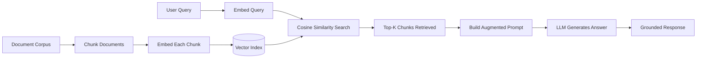

# RAG (Retrieval-Augmented Generation)

## Learning Objectives

- Build a complete RAG pipeline: chunk documents, embed chunks, store in a vector index, retrieve by query similarity, and generate grounded answers
- Implement semantic search using cosine similarity over embeddings and compare fixed-size chunking against semantic chunking strategies
- Trace retrieval failures to root causes: stale indexes, embedder drift, mismatched granularity, and chunk boundary errors
- Evaluate RAG output quality using retrieval metrics (precision@k, recall) and generation metrics (faithfulness, relevance)
- Deploy a RAG pipeline for a GTM research agent that retrieves internal playbooks and competitive intel before generating account briefs

## The Problem

Your LLM was trained on a snapshot of the internet. It has read more text than any human will see in a lifetime, but it has never seen your company's wiki, your CRM notes, or the competitive battlecard your SE updated last Tuesday. When someone asks "what's our win rate against Competitor X in healthcare?" the model does something uncomfortable: it answers. It pattern-matches on the question structure and produces a plausible-sounding response that has zero grounding in your actual data.

This is not a bug. It is the design. LLMs are next-token predictors trained on a fixed corpus. Once training completes, the weights are frozen. The model has no file system, no database connection, no mechanism to look anything up. If your refund policy changed yesterday, the model still "believes" whatever it absorbed during training — which, for your internal docs, is nothing at all.

Fine-tuning is the obvious fix: take the base model, continue training on your documents, deploy updated weights. This works in theory. In practice, you pay compute costs for every document update, the model goes stale the moment a playbook changes, you lose attribution (the model cannot tell you which document it drew from), and fine-tuning on knowledge tasks often degrades general reasoning — a documented phenomenon called catastrophic forgetting. For knowledge that changes frequently, fine-tuning is the wrong tool applied to the wrong problem.

RAG takes a different approach. Instead of baking knowledge into the weights, you keep it in an external index. At query time, you retrieve the relevant chunks and hand them to the model as context. The model reads them and generates an answer grounded in what it sees. The weights never change. The index updates whenever you want. Every answer traces back to a specific source chunk.

## The Concept

The RAG pattern has three stages. First, you embed a user query into the same vector space as your document chunks — converting the natural-language question into a list of numbers that captures semantic meaning. Second, you retrieve the top-k most similar chunks by computing cosine similarity between the query vector and every document vector in the index. Third, you concatenate those chunks into the prompt as context and call the generator. The model's weights stay frozen; only the prompt changes per query.

Embedding models map semantically similar text to nearby points in a high-dimensional space. "How does data enrichment work?" and "Clay waterfall enriches leads by sequencing data providers" land close together because they share meaning, even though they share almost no words. Cosine similarity — the dot product of two normalized vectors — measures the angle between them. A smaller angle means more semantically similar. This is the retrieval signal: chunks closest to the query in vector space are the ones most likely to contain a relevant answer.

No fine-tuning. No gradient descent. No GPU clusters beyond the ones already running inference. You are doing search — old, boring, well-understood search — but in a semantic space instead of a lexical one, and then handing the results to a language model that can synthesize them into coherent prose. The complexity lives in chunking strategy, embedder selection, and index maintenance, not in the core algorithm.

## Build It

Let's build the full pipeline. You need an embedding model to convert text into vectors, a distance function to compare them, and a generator to produce the final answer. We use `text-embedding-3-small` for embeddings (1536 dimensions, cheap, well-calibrated), numpy for vector math, and Chroma as a persistent vector store so your index survives between runs.

First, the retrieval step in isolation. This is the core mechanism