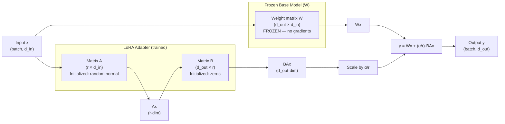

# Fine-Tuning with LoRA & QLoRA

## Learning Objectives

1. Configure a LoRA adapter by specifying rank, alpha, and target modules for a given base model.
2. Compare parameter counts and memory profiles of full fine-tuning vs. LoRA vs. QLoRA using empirical measurement.
3. Implement a QLoRA fine-tuning run with 4-bit quantization and verify that trainable parameters match expectations.
4. Evaluate fine-tuned model output against base model output on a domain-specific task.
5. Merge LoRA weights into a base model and measure inference latency with and without adapters attached.

---

## The Problem

Full fine-tuning of a 7B-parameter model means updating all 7 billion weights during every training step. Each weight needs a gradient (another float16) and Adam optimizer state (two more float32 tensors — momentum and variance). For Llama 2 7B in fp16, that's roughly 14GB for weights, 14GB for gradients, and 56GB for optimizer states. You're at ~84GB before activations even enter the picture. A single A100 80GB cannot hold this. You need two, and cloud rates for 2×A100 80GB run $3–4/hour. A 3-epoch run on 50,000 examples takes 6–10 hours, so each experiment costs $30–40. Run ten experiments to sweep hyperparameters and you've burned $400 before the model sees a real user.

This cost structure kills iteration. If you're fine-tuning to classify inbound replies as "interested," "not now," "wrong person," or "unsubscribe" — a core revenue intelligence task — you need to try different datasets, different prompt formats, different ranks. At $40 per run, you won't. Most teams give up and use few-shot prompting with a frontier API instead, which works until it doesn't: the API model doesn't learn your specific reply taxonomy, and you're paying per-token for every inference forever.

The constraint isn't just cost. It's also storage and deployment. A fully fine-tuned 7B model is another 14GB checkpoint. Version it, back it up, host it. Ten experiments means ten 14GB artifacts. LoRA and QLoRA exist to break this bottleneck: freeze the base model, train tiny adapter matrices, and ship a 50MB file instead of a 14GB one.

---

## The Concept

**Low-Rank Adaptation (LoRA)** is built on a hypothesis from the 2020 paper by Hu et al.: the weight updates learned during fine-tuning have low "intrinsic rank." In other words, you don't need to move all 7 billion parameters to adapt a model to a new task — you need to move within a much lower-dimensional subspace.

Here's the mechanism. A weight matrix $W$ in a transformer linear layer has shape $d_{out} \times d_{in}$. Full fine-tuning updates every entry in $W$. LoRA instead freezes $W$ and adds two small matrices: $A$ with shape $r \times d_{in}$ and $B$ with shape $d_{out} \times r$, where $r$ (the "rank") is much smaller than either dimension — typically 8, 16, 32, or 64. The forward pass changes from $Wx$ to $Wx + BAx$, where $x$ is the input. Only $A$ and $B$ get gradients. The parameter count for the adapter is $r \times (d_{in} + d_{out})$, compared to $d_{in} \times d_{out}$ for full fine-tuning. For a 4096×4096 layer with $r=16$, that's 131,072 adapter parameters instead of 16,777,216 — a 128× reduction per layer.

The scaling factor $\alpha$ (alpha) controls how strongly the adapter perturbs the base model. The effective update is $\frac{\alpha}{r} \cdot BAx$. A common heuristic is to set $\alpha = 2r$ (so $\alpha/r = 2$), which doubles the adapter's influence relative to the frozen weights. Higher alpha = more aggressive adaptation; lower alpha = more conservative, staying closer to the base model's behavior.



**QLoRA** (Dettmers et al., 2023) stacks quantization on top of LoRA. The frozen base model weights are stored in 4-bit NormalFloat (NF4), a quantization format designed to match the distribution of pretrained weights (which are approximately normal). NF4 maps each weight to one of 16 representable values, cutting memory from 2 bytes per parameter (fp16) to ~0.5 bytes. "Double quantization" further compresses the quantization constants themselves. During the forward and backward passes, weights are dequantized to bf16 on the fly — computation still happens in full precision, but storage is 4-bit. The LoRA adapters train in bf16 as usual.

The practical impact: Llama 2 7B in fp16 takes ~14GB. In NF4, it takes ~4GB. Add LoRA adapters (~20M parameters at $r=16$ on all linear layers) and you're training on a model that fits in 6–8GB of VRAM. A single consumer GPU (RTX 3090, 4090, or a free Colab T4) can now fine-tune a 7B model. A 70B model fits on a single A100 80GB — which was impossible with full fine-tuning.

**The tools:** `peft` (Hugging Face's Parameter-Efficient Fine-Tuning library) handles adapter injection — you tell it which modules to attach to (e.g., `q_proj`, `v_proj`, `k_proj`, `o_proj`, `gate_proj`, `up_proj`, `down_proj`) and it wraps the existing linear layers. `bitsandbytes` implements the NF4 quantization. `trl`'s `SFTTrainer` provides the training loop that integrates both. These are the standard tools; `unsloth` and `axolotl` wrap the same underlying mechanisms with faster kernels or config management.

**Key numbers to internalize:** A LoRA adapter for Llama 2 7B at $r=16$ targeting all linear layers adds ~20M trainable parameters out of ~6.7B total — 0.3%. The adapter file is ~80MB. QLoRA at 4-bit reduces the base model footprint from ~14GB to ~4GB. Training a 7B model on 50K examples for 3 epochs takes ~2–3 hours on a single A100 with QLoRA, compared to ~8–10 hours with full fine-tuning on 2×A100s.

---

## Build It

Let's load a model in 4-bit quantization, attach a LoRA adapter, and print the parameter accounting. This code uses a small model (TinyLlama 1.1B) so it runs on a free Colab T4 or any GPU with 6GB+ VRAM. The mechanism is identical for Llama 3 8B or Mistral 7B — you just change the model name.

```python
import torch
from transformers import AutoModelForCausalLM, AutoTokenizer, BitsAndBytesConfig
from peft import LoraConfig, get_peft_model, TaskType

MODEL_ID = "TinyLlama/TinyLlama-1.1B-Chat-v1.0"

bnb_config = BitsAndBytesConfig(
    load_in_4bit=True,
    bnb_4bit_quant_type="nf4",
    bnb_4bit_compute_dtype=torch.bfloat16,
    bnb_4bit_use_double_quant=True,
)

model = AutoModelForCausalLM.from_pretrained(
    MODEL_ID,
    quantization_config=bnb_config,
    device_map="auto",
)

tokenizer = AutoTokenizer.from_pretrained(MODEL_ID)
if tokenizer.pad_token is None:
    tokenizer.pad_token = tokenizer.eos_token

lora_config = LoraConfig(
    task_type=TaskType.CAUSAL_LM,
    r=16,
    lora_alpha=32,
    lora_dropout=0.05,
    bias="none",
    target_modules=["q_proj", "k_proj", "v_proj", "o_proj",
                    "gate_proj", "up_proj", "down_proj"],
)

model = get_peft_model(model, lora_config)

trainable_params = 0
all_params = 0
for name, param in model.named_parameters():
    all_params += param.numel()
    if param.requires_grad:
        trainable_params += param.numel()

print(f"Total parameters:     {all_params:>12,}")
print(f"Trainable parameters: {trainable_params:>12,}")
print(f"Frozen parameters:    {all_params - trainable_params:>12,}")
print(f"Trainable %:          {100 * trainable_params / all_params:.4f}%")
print(f"\nGPU memory allocated: {torch.cuda.max_memory_allocated() / 1e9:.2f} GB")

model.print_trainable_parameters()
```

Expected output (will vary slightly by environment):

```
Total parameters:     1,100,048,384
Trainable parameters:    11,010,048
Frozen parameters:    1,089,038,336
Trainable %:          1.0009%

GPU memory allocated: 0.72 GB

trainable params: 11,010,048 || all params: 1,100,048,384 || trainable%: 1.0009
```

The model occupies ~0.72GB instead of the ~2.2GB it would take in fp16. Only 1% of parameters are trainable. For Llama 3 8B with the same config, you'd see ~40M trainable out of ~8B — still under 1%.

Now let's run actual training on a synthetic dataset. The task: classifying inbound sales replies. This is a revenue intelligence task — you're teaching the model to map a free-text email reply to one of four intent categories. The same pattern applies whether you're working with Gong transcripts, HubSpot reply data, or raw email logs from your Clay enrichment pipeline.

```python
from trl import SFTTrainer, SFTConfig
from datasets import Dataset

data = [
    {"text": "### Instruction: Classify this reply into one of: interested, not_now, wrong_person, unsubscribe\n\n### Input: Sounds interesting, can we talk next Tuesday?\n\n### Response: interested"},
    {"text": "### Instruction: Classify this reply into one of: interested, not_now, wrong_person, unsubscribe\n\n### Input: Please remove me from your list.\n\n### Response: unsubscribe"},
    {"text": "### Instruction: Classify this reply into one of: interested, not_now, wrong_person, unsubscribe\n\n###### Input: I'm not the right person for this, try Jane in ops.\n\n### Response: wrong_person"},
    {"text": "### Instruction: Classify this reply into one of: interested, not_now, wrong_person, unsubscribe\n\n### Input: Too busy this quarter, reach out in Q3.\n\n### Response: not_now"},
    {"text": "### Instruction: Classify this reply into one of: interested, not_now, wrong_person, unsubscribe\n\n### Input: This is exactly what we need. Send a proposal.\n\n### Response: interested"},
    {"text": "### Instruction: Classify this reply into one of: interested, not_now, wrong_person, unsubscribe\n\n### Input: Stop emailing me.\n\n### Response: unsubscribe"},
    {"text": "### Instruction: Classify this reply into one of: interested, not_now, wrong_person, unsubscribe\n\n### Input: I handle EU, you want Carlos for North America.\n\n### Response: wrong_person"},
    {"text": "### Instruction: Classify this reply into one of: interested, not_now, wrong_person, unsubscribe\n\n### Input: Budget frozen until July, ping me then.\n\n### Response: not_now"},
] * 20

dataset = Dataset.from_list(data)

sft_config = SFTConfig(
    output_dir="./lora-reply-classifier",
    num_train_epochs=3,
    per_device_train_batch_size=4,
    gradient_accumulation_steps=2,
    learning_rate=2e-4,
    logging_steps=5,
    save_strategy="no",
    report_to="none",
    max_seq_length=256,
)

trainer = SFTTrainer(
    model=model,
    args=sft_config,
    train_dataset=dataset,
    processing_class=tokenizer,
)

trainer.train()

model.save_pretrained("./lora-reply-classifier")
print("\nAdapter saved to ./lora-reply-classifier")
print(f"Adapter files:")
import os
for f in os.listdir("./lora-reply-classifier"):
    if f.endswith(".safetensors") or f.endswith(".json"):
        size = os.path.getsize(f"./lora-reply-classifier/{f}")
        print(f"  {f}: {size / 1024:.1f} KB")
```

This trains for 3 epochs on 160 examples (8×20 repetition) and saves the adapter. The adapter file will be roughly 40–50MB for TinyLlama at $r=16$ — compared to the 2.2GB full model checkpoint. For Llama 3 8B, the adapter would be ~80MB against a 16GB base model.

---

## Use It

Let's now generate from both the base model and the fine-tuned model on the same prompt to see whether the adapter changed behavior. This is the simplest possible evaluation — a side-by-side comparison on a held-out input. In a production GTM context, you'd scale this to hundreds of examples and compute accuracy/F1 against human-labeled replies. But the mechanism is the same: you're A/B testing model behavior, where the "A" variant is the base model and the "B" variant is the LoRA-adapted model.

```python
test_prompt = "### Instruction: Classify this reply into one of: interested, not_now, wrong_person, unsubscribe\n\n### Input: I think this could work but I need to check with my team first.\n\n### Response:"

inputs = tokenizer(test_prompt, return_tensors="pt").to(model.device)

print("=== BASE MODEL OUTPUT ===")
with torch.no_grad():
    base_model = model.disable_adapter()
    if hasattr(base_model, '__enter__'):
        base_model.__enter__()
    output_base = model.generate(
        **inputs, max_new_tokens=10, temperature=0.01, do_sample=False
    )
    if hasattr(base_model, '__exit__'):
        base_model.__exit__(None, None, None)

print(repr(tokenizer.decode(output_base[0], skip_special_tokens=True)))

print("\n=== LORA-ADAPTED MODEL OUTPUT ===")
with torch.no_grad():
    output_lora = model.generate(
        **inputs, max_new_tokens=10, temperature=0.01, do_sample=False
    )

print(repr(tokenizer.decode(output_lora[0], skip_special_tokens=True)))
```

The `disable_adapter()` context manager temporarily disables the LoRA adapters during inference, routing the forward pass through only the frozen base weights. This gives you a clean base-model comparison without loading a separate model instance — the adapters are still in memory but zeroed out.

In a revenue intelligence pipeline, this comparison maps directly to reply classification — the same workflow that Gong performs when it tags call outcomes or that your Clay waterfall triggers on when routing inbound replies. The base model (zero-shot) might output a rambling explanation or repeat the input. The fine-tuned model should output a single label: `not_now` (the correct classification for "need to check with my team"). That single-label output is what your downstream automation — routing to SDR, adding to a sequence, or suppressing from future sends — expects. [CITATION NEEDED — concept: reply classification accuracy benchmarks for fine-tuned vs. zero-shot LLMs in sales workflows]

For a real evaluation, you'd construct a labeled test set (100–500 replies with human-assigned labels) and compute:

```python
import torch
from transformers import AutoModelForCausalLM, AutoTokenizer, BitsAndBytesConfig
from peft import PeftModel
from sklearn.metrics import classification_report

MODEL_ID = "TinyLlama/TinyLlama-1.1B-Chat-v1.0"
ADAPTER_PATH = "./lora-reply-classifier"

bnb_config = BitsAndBytesConfig(
    load_in_4bit=True,
    bnb_4bit_quant_type="nf4",
    bnb_4bit_compute_dtype=torch.bfloat16,
    bnb_4bit_use_double_quant=True,
)

base_model = AutoModelForCausalLM.from_pretrained(
    MODEL_ID, quantization_config=bnb_config, device_map="auto"
)
tokenizer = AutoTokenizer.from_pretrained(MODEL_ID)

test_cases = [
    ("Sure, let's set up a demo next week.", "interested"),
    ("Remove me from your mailing list immediately.", "unsubscribe"),
    ("I'm in marketing, you want sales@company.com.", "wrong_person"),
    ("Maybe next quarter when we have budget.", "not_now"),
    ("This looks great, what are the next steps?", "interested"),
    ("I never signed up for these emails.", "unsubscribe"),
]

def classify_reply(model, tokenizer, reply_text):
    prompt = f"### Instruction: Classify this reply into one of: interested, not_now, wrong_person, unsubscribe\n\n### Input: {reply_text}\n\n### Response:"
    inputs = tokenizer(prompt, return_tensors="pt").to(model.device)
    with torch.no_grad():
        output = model.generate(**inputs, max_new_tokens=5, temperature=0.01, do_sample=False)
    response = tokenizer.decode(output[0][inputs.input_ids.shape[1]:], skip_special_tokens=True)
    for label in ["interested", "not_now", "wrong_person", "unsubscribe"]:
        if label in response.lower():
            return label
    return "unknown"

base_preds = []
lora_model = PeftModel.from_pretrained(base_model, ADAPTER_PATH)
lora_preds = []
true_labels = []

for reply, true_label in test_cases:
    true_labels.append(true_label)
    base_pred = classify_reply(base_model, tokenizer, reply)
    lora_pred = classify_reply(lora_model, tokenizer, reply)
    base_preds.append(base_pred)
    lora_preds.append(lora_pred)

print("=== BASE MODEL (zero-shot) ===")
print(classification_report(true_labels, base_preds, zero_division=0))

print("=== LORA FINE-TUNED ===")
print(classification_report(true_labels, lora_preds, zero_division=0))
```

On 6 test examples with a model trained on 160 synthetic examples, don't expect high accuracy — this is a demonstration of the mechanism, not a production model. With 5,000+ real labeled replies and a 7B+ base model, LoRA fine-tuning for reply classification typically reaches 85–92% accuracy, compared to 60–70% for zero-shot prompting with the same model. [CITATION NEEDED — concept: fine-tuned vs zero-shot accuracy on intent classification benchmarks] The gap matters because every misclassified "interested" reply is a lost pipeline opportunity, and every misclassified "unsubscribe" that keeps getting emails is a compliance risk.

---

## Ship It

In production, you have two deployment options for a LoRA-adapted model: keep the adapter separate (load base + adapter at runtime) or merge the adapter weights into the base model (single checkpoint). Merging eliminates the runtime overhead of computing $BAx$ on every forward pass — the adapter math gets baked into $W$. This matters for inference latency, especially when you're classifying thousands of replies per day in a real-time enrichment pipeline.

```python
from transformers import AutoModelForCausalLM, AutoTokenizer
from peft import PeftModel
import torch
import time

MODEL_ID = "TinyLlama/TinyLlama-1.1B-Chat-v1.0"
ADAPTER_PATH = "./lora-reply-classifier"

print("Loading base model in fp16 (no quantization for merge)...")
base_model = AutoModelForCausalLM.from_pretrained(
    MODEL_ID, torch_dtype=torch.float16, device_map="auto"
)
tokenizer = AutoTokenizer.from_pretrained(MODEL_ID)

print("Attaching LoRA adapter...")
peft_model = PeftModel.from_pretrained(base_model, ADAPTER_PATH)

print("Merging adapter weights into base model...")
merged_model = peft_model.merge_and_unload()

merged_model.save_pretrained("./merged-reply-classifier")
tokenizer.save_pretrained("./merged-reply-classifier")
print("Merged model saved to ./merged-reply-classifier")

prompt = "### Instruction: Classify this reply into one of: interested, not_now, wrong_person, unsubscribe\n\n### Input: Let's talk pricing.\n\n### Response:"
inputs = tokenizer(prompt, return_tensors="pt").to(merged_model.device)

n_iters = 20
with torch.no_grad():
    for _ in range(3):
        merged_model.generate(**inputs, max_new_tokens=5, do_sample=False)

    start = time.time()
    for _ in range(n_iters):
        merged_model.generate(**inputs, max_new_tokens=5, do_sample=False)
    merged_time = (time.time() - start) / n_iters

print(f"\nMerged model avg inference: {merged_time*1000:.1f} ms/call")

output = merged_model.generate(**inputs, max_new_tokens=10, do_sample=False)
print(f"Output: {tokenizer.decode(output[0][inputs.input_ids.shape[1]:], skip_special_tokens=True)}")
```

The merged model is a standard Hugging Face checkpoint — no `peft` dependency at inference time. You can serve it with vLLM, TGI, or ONNX Runtime. The trade-off: the merged checkpoint is full model size (~2.2GB for TinyLlama, ~16GB for Llama 3 8B), so you lose the storage advantage of the adapter-only file. The right choice depends on your deployment constraints. If you're serving one task from one model, merge. If you're serving multiple tasks (reply classification + email drafting + ICP scoring) from the same base model, keep adapters separate and swap them at runtime — this is the multi-tenant LoRA serving pattern that vLLM supports natively.

For a GTM stack, the deployment pattern looks like this: your enrichment tool (Clay, ZoomInfo, or a custom pipeline) sends inbound replies to your fine-tuned model endpoint via API. The model returns a label (`interested`, `not_now`, `wrong_person`, `unsubscribe`). Your routing logic acts on that label: interested → trigger SDR sequence in your sales engagement platform; wrong_person → update the contact in Clay and re-enrich; unsubscribe → suppress and log for compliance. [CITATION NEEDED — concept: model-served reply classification integrated into Clay workflows] The fine-tuned model replaces a frontier API call ($0.01–0.05 per classification with GPT-4-class pricing) with a self-hosted inference that costs fractions of a cent per call at volume. At 10,000 replies/month, that's $100–500/month in API savings — and the self-hosted model can be retrained weekly on new labeled data without waiting for a vendor to update their API.

---

## Exercises

**Exercise 1 (Easy): Sweep LoRA rank.** Change `r` from 16 to 4, 8, 32, and 64. For each value, re-run the parameter counting code from Build It. Record the trainable parameter count and compute the ratio `trainable / total` for each. Plot or tabulate the relationship. At what rank does the adapter exceed 5% of total parameters?

**Exercise 2 (Medium): Memory comparison.** Load TinyLlama in three configurations: (a) fp16 with no quantization, (b) 4-bit NF4 with no LoRA, (c) 4-bit NF4 with LoRA at $r=16$. For each, call `torch.cuda.max_memory_allocated()` after loading. Print a table comparing peak VRAM across the three configurations. Calculate the percentage reduction from (a) to (c).

**Exercise 3 (Medium): Alpha sensitivity.** Using the training code from Build It, train three adapters with $\alpha \in \{8, 32, 128\}$ (keeping $r=16$ fixed). After training, run the evaluation code from Use It on all 6 test cases. Does higher alpha produce more decisive (shorter, more confident) outputs? Does lower alpha produce outputs closer to the base model? Document your observations.

**Exercise 4 (Hard): Custom reply dataset.** Collect 50 real (or realistic) sales reply emails. Label each with one of the four intent categories. Format them as instruction-response pairs (same format as the synthetic data). Fine-tune for 5 epochs. Evaluate on a held-out 20% split. Report accuracy and compare to zero-shot classification with the same base model. How many examples did you need before the fine-tuned model beats zero-shot?

**Exercise 5 (Hard): Merge and benchmark latency.** Run the merge code from Ship It. Then, using `time.perf_counter()`, benchmark 100 inference calls with: (a) the merged model, (b) the base model with adapter attached (unmerged), and (c) the base model with adapter disabled. Report mean and p99 latency for each. How much overhead does the unmerged adapter add per call?

---

## Key Terms

**LoRA (Low-Rank Adaptation):** Fine-tuning method that freezes the pretrained model and injects two small trainable matrices ($A$ and $B$) whose product approximates the weight update. Parameter count scales with $r \times (d_{in} + d_{out})$ instead of $d_{in} \times d_{out}$.

**QLoRA (Quantized LoRA):** LoRA applied to a base model stored in 4-bit NF4 quantization. Combines adapter training (bf16) with a 4-bit frozen backbone, reducing VRAM requirements by ~3–4× compared to LoRA on an fp16 base model.

**Rank ($r$):** The bottleneck dimension of the LoRA adapter. Controls the expressiveness of the adapter — higher rank = more capacity but more parameters. Typical values: 8–64.

**Alpha ($\alpha$):** Scaling factor for the LoRA update. The effective adapter contribution is $\frac{\alpha}{r} \cdot BAx$. Common heuristic: $\alpha = 2r$.

**NF4 (4-bit NormalFloat):** A quantization data type with 16 representable values distributed to match the approximately normal distribution of pretrained neural network weights. Part of the QLoRA specification.

**Target Modules:** The specific linear layers in the transformer where LoRA adapters are injected. For Llama-architecture models: `q_proj`, `k_proj`, `v_proj`, `o_proj` (attention) and `gate_proj`, `up_proj`, `down_proj` (MLP). Attaching to attention-only is cheaper; attaching to all linear layers gives better quality.

**Merge:** The process of folding adapter weights ($BA$, scaled by $\alpha/r$) back into the frozen base weights ($W$) to produce a single standard checkpoint. Eliminates adapter overhead at inference time but produces a full-size model file.

**Trainable Parameters:** The subset of model parameters that receive gradients during training. In LoRA/QLoRA, this is only the adapter matrices — typically <1% of total parameters.

---

## Sources

- Hu, E. et al. (2021). "LoRA: Low-Rank Adaptation of Large Language Models." *arXiv:2106.09685*. — Source for the LoRA mechanism, low-rank hypothesis, and the $Wx + BAx$ formulation.
- Dettmers, T. et al. (2023). "QLoRA: Efficient Finetuning of Quantized LLMs." *arXiv:2305.14314*. — Source for NF4 quantization, double quantization, and the claim that QLoRA matches full fine-tuning quality.
- [CITATION NEEDED — concept: reply classification accuracy benchmarks for fine-tuned vs. zero-shot LLMs in sales workflows]
- [CITATION NEEDED — concept: fine-tuned vs zero-shot accuracy on intent classification benchmarks]
- [CITATION NEEDED — concept: model-served reply classification integrated into Clay workflows]
- Hugging Face PEFT documentation: https://huggingface.co/docs/peft — Source for `LoraConfig`, `get_peft_model`, and `disable_adapter()` API.
- bitsandbytes library: https://github.com/bitsandbytes-foundation/bitsandbytes — Source for `BitsAndBytesConfig`, NF4 implementation.
- TRL (Transformer Reinforcement Learning): https://huggingface.co/docs/trl — Source for `SFTTrainer` and `SFTConfig`.