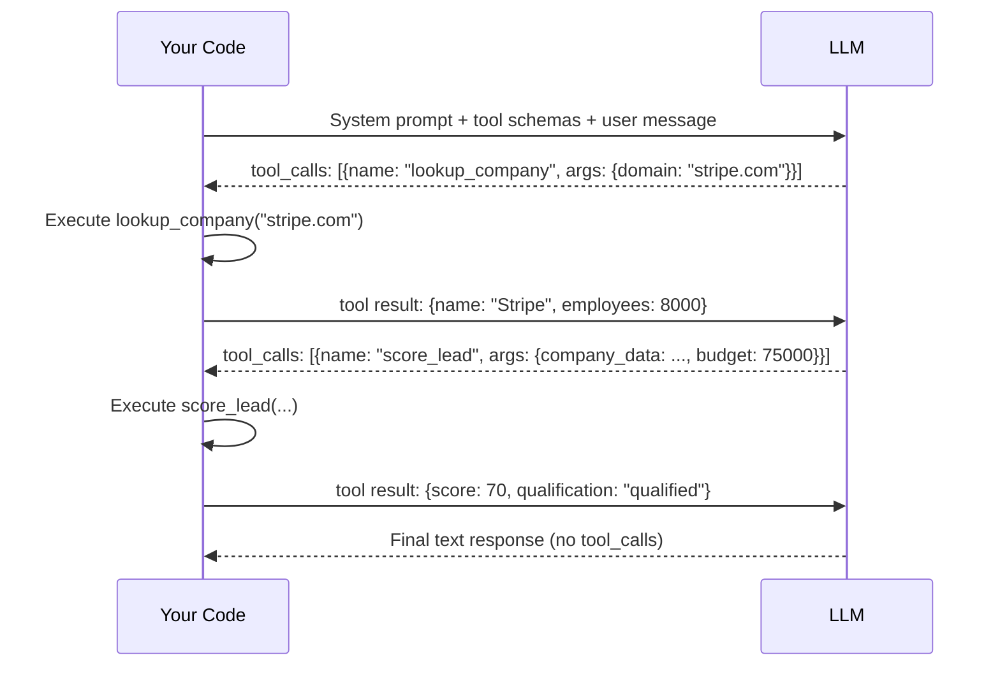

# Function Calling & Tool Use

## Learning Objectives

1. Implement a function-calling loop that parses LLM structured outputs into executable tool invocations.
2. Compare the OpenAI function-calling protocol against Anthropic's tool-use schema format.
3. Build a multi-tool agent that chains tool calls based on intermediate results.
4. Detect and handle tool-call failures with retry and fallback logic.
5. Wire a tool-calling agent into a GTM workflow node for enrichment, routing, and outreach triggering.

## The Problem

You build a chatbot. A user asks: "What's the weather in Tokyo right now?" The model responds with a disclaimer about not having real-time data and then guesses a number based on the season. That is a hallucination in a trench coat. The model's training data is months old. Weather changes every hour. The correct answer requires calling the OpenWeatherMap API, getting the current temperature, and returning a real number. The model cannot call APIs. Your code can.

The same gap exists everywhere in GTM engineering. A user types "qualify this lead" and the model generates a plausible-sounding assessment from whatever context it has — but it never actually looked up the company's headcount, never checked their tech stack, never queried your CRM for past interactions. The output looks authoritative. It is fiction. Every "AI agent" that actually does something — enriches a record, scores a lead, drafts outreach — is solving this exact problem: how do you let a text generator trigger real code?

The answer is not prompt engineering. You cannot bribe the model into calling APIs by describing them better. The answer is a structured protocol where the model emits machine-readable instructions — which function to call, with what arguments — and your code executes them. The model never touches the outside world. It generates a JSON payload. Your code reads that payload, runs the function, and hands the result back. Function calling is that protocol.

## The Concept

The mechanism is a four-step loop: **declare → decide → execute → feed back**. First, you declare available tools as JSON Schema objects alongside your system prompt. Each schema tells the model three things: the function name, what it does (in natural language), and what arguments it accepts (with types). Second, the model reads the user's request and decides whether to respond with text or to call a tool. If it calls a tool, it returns structured JSON instead of (or alongside) prose. Third, your code parses that JSON, invokes the actual function, and captures the result. Fourth, you append the result to the conversation and re-prompt the model — which now has the data it needs to produce a real answer.

The model never executes the tool. This is the single most misunderstood aspect of function calling. The model is a JSON generator with good judgment about *which* function to call and *what arguments* to pass. Your Python process is the runtime. If the model says `lookup_company("stripe.com")`, your code is what actually runs that function, hits the database, and returns a result. The model has no filesystem, no network access, no execution environment. It only produces text — but it produces text in a format your code can parse and act on.



The two major API providers implement this loop with different JSON shapes but the same algorithm. OpenAI wraps tool definitions inside a `tools` array where each entry has `type: "function"` and a nested `function` object containing `name`, `description`, and `parameters` (a JSON Schema). The model's response includes a `tool_calls` array on the assistant message, where each call has an `id`, a function `name`, and a JSON-string `arguments` field. Your code responds with a message where `role: "tool"`, `tool_call_id` matches the request, and `content` is the function's return value serialized as a string.

Anthropic's protocol is structurally similar but uses content blocks instead of a separate `tool_calls` field. Tool definitions use `input_schema` instead of `parameters`. The model's response is an array of content blocks on `response.content`, where each block has a `type` — either `"text"` or `"tool_use"`. A `tool_use` block contains `id`, `name`, and `input` (already parsed as a dict, not a string). Your code responds with a `role: "user"` message containing a `tool_result` content block that references the tool use `id`. The semantics are identical. The serialization differs.

Both providers support parallel tool calls — the model can request multiple functions in a single turn, and your code must execute all of them before re-prompting. Both require you to match tool-call IDs to tool-result messages. Both will loop indefinitely if you keep sending messages that trigger tool calls, so your code must enforce a max-turns limit.

## Build It

Build a minimal agent that demonstrates the full loop. Two tools: `lookup_company` fetches mock company data by domain, and `score_lead` takes that data plus a budget and returns a qualification score. The agent receives a user request, decides which tools to call, chains them, and produces a final answer.

```python
import json
import openai

client = openai.OpenAI()

def lookup_company(domain):
    database = {
        "stripe.com": {"name": "Stripe", "employees": 8000, "industry": "Fintech", "funding": "1.6B"},
        "notion.so": {"name": "Notion", "employees": 400, "industry": "SaaS", "funding": "343M"},
        "linear.app": {"name": "Linear", "employees": 50, "industry": "SaaS", "funding": "35M"},
    }
    return database.get(domain, {"name": domain, "employees": 0, "industry": "Unknown", "funding": "0"})

def score_lead(company_data, budget):
    score = 0
    if company_data["employees"] > 500:
        score += 30
    if company_data["industry"] == "SaaS":
        score += 40
    elif company_data["industry"] == "Fintech":
        score += 25
    if budget > 50000:
        score += 30
    return {
        "company": company_data["name"],
        "score": score,
        "qualification": "qualified" if score >= 50 else "disqualified"
    }

tool_schemas = [
    {
        "type": "function",
        "function": {
            "name": "lookup_company",
            "description": "Look up company information by domain name. Returns employee count, industry, and funding.",
            "parameters": {
                "type": "object",
                "properties": {
                    "domain": {
                        "type": "string",
                        "description": "The company domain without protocol, e.g. stripe.com"
                    }
                },
                "required": ["domain"]
            }
        }
    },
    {
        "type": "function",
        "function": {
            "name": "score_lead",
            "description": "Score a lead based on company data and annual budget. Returns a 0-100 score and qualification status.",
            "parameters": {
                "type": "object",
                "properties": {
                    "company_data": {
                        "type": "object",
                        "description": "Company data object from lookup_company"
                    },
                    "budget": {
                        "type": "integer",
                        "description": "Annual budget in USD"
                    }
                },
                "required": ["company_data", "budget"]
            }
        }
    }
]

available_functions = {
    "lookup_company": lookup_company,
    "score_lead": score_lead,
}

messages = [
    {"role": "system", "content": "You are a lead qualification agent. Use tools to look up companies and score them. Always call tools rather than guessing company data."},
    {"role": "user", "content": "Look up stripe.com, then score them as a lead with a budget of 75000."}
]

MAX_TURNS = 6

print("=== AGENT LOOP START ===")
print(f"User: {messages[-1]['content']}")
print()

for turn in range(MAX_TURNS):
    response = client.chat.completions.create(
        model="gpt-4o",
        messages=messages,
        tools=tool_schemas,
        tool_choice="auto"
    )
    
    assistant_message = response.choices[0].message
    messages.append(assistant_message)
    
    if not assistant_message.tool_calls:
        print(f"[Turn {turn + 1}] FINAL ANSWER:")
        print(assistant_message.content)
        break
    
    for tc in assistant_message.tool_calls:
        func_name = tc.function.name
        func_args = json.loads(tc.function.arguments)
        
        print(f"[Turn {turn + 1}] TOOL CALL: {func_name}({json.dumps(func_args)})")
        
        try:
            result = available_functions[func_name](**func_args)
            print(f"[Turn {turn + 1}] TOOL RESULT: {json.dumps(result)}")
        except Exception as e:
            result = {"error": str(e)}
            print(f"[Turn {turn + 1}] TOOL ERROR: {result}")
        
        messages.append({
            "role": "tool",
            "tool_call_id": tc.id,
            "content": json.dumps(result)
        })
    
    print()
else:
    print(f"[Turn {MAX_TURNS}] MAX TURNS REACHED — forcing stop")

print("=== AGENT LOOP END ===")
```

Run this and you will see the full decision chain printed step by step: the model first calls `lookup_company`, receives the company data, then calls `score_lead` with that data and the budget, receives the score, and finally produces a text summary. The model chained two tools across three turns without you writing any control-flow logic. You wrote the tools and their schemas. The model decided the execution order.

Now compare the same loop against Anthropic's API. The algorithm is identical — declare tools, parse tool-use response, execute, feed back. The JSON shape changes:

```python
import anthropic

client = anthropic.Anthropic()

tool_schemas = [
    {
        "name": "lookup_company",
        "description": "Look up company information by domain name.",
        "input_schema": {
            "type": "object",
            "properties": {
                "domain": {"type": "string", "description": "Domain without protocol, e.g. stripe.com"}
            },
            "required": ["domain"]
        }
    }
]

response = client.messages.create(
    model="claude-3-5-sonnet-20241022",
    max_tokens=1024,
    tools=tool_schemas,
    messages=[{"role": "user", "content": "Look up stripe.com"}]
)

print("Stop reason:", response.stop_reason)
print("Content blocks:")
for block in response.content:
    print(f"  type: {block.type}")
    if block.type == "tool_use":
        print(f"  name: {block.name}")
        print(f"  id:   {block.id}")
        print(f"  input: {block.input}")
    elif block.type == "text":
        print(f"  text:  {block.text}")
```

The key differences: Anthropic uses `input_schema` where OpenAI uses `parameters`. Anthropic's response is a list of typed content blocks where `tool_use` blocks carry `input` as a parsed dict, while OpenAI stuffs tool calls into a `tool_calls` array with JSON-string `arguments`. Anthropic signals why it stopped via `stop_reason` (`"tool_use"` vs `"end_turn"`), while OpenAI signals it via the presence or absence of `tool_calls` on the message. Both require you to execute the function and return the result before re-prompting. The loop is the same loop.

## Use It

Function calling is the mechanism behind every enrichment waterfall and task-routing agent in GTM. When you build a Clay waterfall — Clearbit → Apollo → Hunter → custom enrichment — each provider lookup is a tool call. The router (whether that is a Clay enrichment column, an n8n node, or a custom agent) decides what to call next based on what the previous step returned. The loop you built in the previous section, with `lookup_company` feeding into `score_lead`, is the same control flow as a Clay enrichment chain: fetch domain data → check headcount → score ICP fit → draft outreach. [CITATION NEEDED — concept: Clay waterfall tool-call internals]

The same loop powers Cold Calling Infrastructure (Zone 2.2). The handbook describes a refinement stack where leads are filtered through multiple data points before dialing. Each filter — employee count, industry match, tech stack signal — is a tool call. Your agent fetches lead data, scores it, and either queues the dial or drops the lead. The function-calling protocol is what lets the model say "call the enrichment tool first, then call the scoring tool with the results" instead of hallucinating a score from whatever context it already has.

Swap the demo tools for GTM-relevant ones. Here is the same agent loop with tools mapped to real GTM actions:

```python
import json
import openai

client = openai.OpenAI()

def enrich_domain(domain):
    return {
        "domain": domain,
        "company_name": "Acme Corp",
        "employees": 1200,
        "industry": "Manufacturing",
        "tech_stack": ["Salesforce", "Marketo", "AWS"],
        "recent_funding": "Series C, $45M, 2024"
    }

def score_icp_fit(company_data, icp_rules):
    score = 0
    if company_data["employees"] >= icp_rules["min_employees"]:
        score += 30
    if company_data["industry"] in icp_rules["target_industries"]:
        score += 40
    if any(tech in icp_rules["required_tech"] for tech in company_data["tech_stack"]):
        score += 30
    return {"score": score, "fit": "strong" if score >= 70 else "weak"}

def draft_email(company_data, icp_score):
    if icp_score["fit"] == "strong":
        return {
            "subject": f"Scaling {company_data['industry'].lower()} operations",
            "body": f"Hi — saw {company_data['company_name']} recently raised {company_data['recent_funding']}. We help companies like yours automate the workflow between {company_data['tech_stack'][0]} and the rest of your stack. Open to a 15-minute call?"
        }
    return {"subject": "Quick question", "body": "Hi — not sure if this is relevant yet, but worth a conversation?"}

gtm_tools = [
    {
        "type": "function",
        "function": {
            "name": "enrich_domain",
            "description": "Enrich a company domain. Returns name, employees, industry, tech stack, and funding data.",
            "parameters": {
                "type": "object",
                "properties": {"domain": {"type": "string", "description": "Company domain"}},
                "required": ["domain"]
            }
        }
    },
    {
        "type": "function",
        "function": {
            "name": "score_icp_fit",
            "description": "Score how well a company fits your ICP based on enrich data and rules.",
            "parameters": {
                "type": "object",
                "properties": {
                    "company_data": {"type": "object", "description": "Output from enrich_domain"},
                    "icp_rules": {"type": "object", "description": "ICP rules with min_employees, target_industries, required_tech"}
                },
                "required": ["company_data", "icp_rules"]
            }
        }
    },
    {
        "type": "function",
        "function": {
            "name": "draft_email",
            "description": "Draft a personalized cold email based on company data and ICP score.",
            "parameters": {
                "type": "object",
                "properties": {
                    "company_data": {"type": "object", "description": "Output from enrich_domain"},
                    "icp_score": {"type": "object", "description": "Output from score_icp_fit"}
                },
                "required": ["company_data", "icp_score"]
            }
        }
    }
]

functions_map = {
    "enrich_domain": enrich_domain,
    "score_icp_fit": score_icp_fit,
    "draft_email": draft_email,
}

icp_rules = {
    "min_employees": 500,
    "target_industries": ["Manufacturing", "Logistics", "SaaS"],
    "required_tech": ["Salesforce", "AWS"]
}

messages = [
    {
        "role": "system",
        "content": f"You are a GTM automation agent. Enrich the company, score ICP fit using these rules: {json.dumps(icp_rules)}, then draft outreach. Call tools in sequence — do not guess data."
    },
    {"role": "user", "content": "Process acme.com as a new lead."}
]

MAX_TURNS = 8

print("=== GTM AGENT: LEAD PROCESSING ===\n")

for turn in range(MAX_TURNS):
    response = client.chat.completions.create(
        model="gpt-4o",
        messages=messages,
        tools=gtm_tools,
        tool_choice="auto"
    )
    
    msg = response.choices[0].message
    messages.append(msg)
    
    if not msg.tool_calls:
        print(f"[Turn {turn+1}] FINAL OUTPUT:\n{msg.content}")
        break
    
    for tc in msg.tool_calls:
        name = tc.function.name
        args = json.loads(tc.function.arguments)
        print(f"[Turn {turn+1}] → {name}({json.dumps(args, indent=2)})")
        
        result = functions_map[name](**args)
        print(f"[Turn {turn+1}] ← {json.dumps(result, indent=2)}\n")
        
        messages.append({"role": "tool", "tool_call_id": tc.id, "content": json.dumps(result)})
else:
    print(f"[Turn {MAX_TURNS}] Hit max turns")

print("=== DONE ===")
```

This agent chains three GTM-relevant tools: enrichment, ICP scoring, and email drafting. The model decides the order based on the tool descriptions and the user's request. You did not write `if` statements controlling the flow — the function-calling protocol did. That is the same delegation pattern that powers a Clay waterfall, an n8n agent node, or a custom routing layer. The tools change. The loop does not.

## Ship It

Production function-calling agents fail in three predictable ways: tools throw exceptions, the model loops without terminating, and API latency compounds across turns. Ship code that handles all three.

```python
import json
import time
import openai

client = openai.OpenAI()

def safe_tool_call(func, args, max_retries=2):
    for attempt in range(max_retries + 1):
        try:
            result = func(**args)
            return {"status": "ok", "data": result}
        except Exception as e:
            if attempt < max_retries:
                wait = 2 ** attempt
                print(f"  Retry {attempt+1}/{max_retries} after {wait}s: {e}")
                time.sleep(wait)
            else:
                return {"status": "error", "error": str(e)}

def run_agent(messages, tools, functions_map, max_turns=6):
    conversation = list(messages)
    log = []
    
    for turn in range(max_turns):
        try:
            response = client.chat.completions.create(
                model="gpt-4o",
                messages=conversation,
                tools=tools,
                tool_choice="auto",
                timeout=30
            )
        except openai.APITimeoutError:
            log.append({"turn": turn + 1, "event": "timeout", "action": "abort"})
            return {"answer": None, "error": "LLM request timed out", "log": log}
        except openai.RateLimitError:
            wait = 5
            print(f"  Rate limited, waiting {wait}s")
            time.sleep(wait)
            continue
        
        msg = response.choices[0].message
        conversation.append(msg)