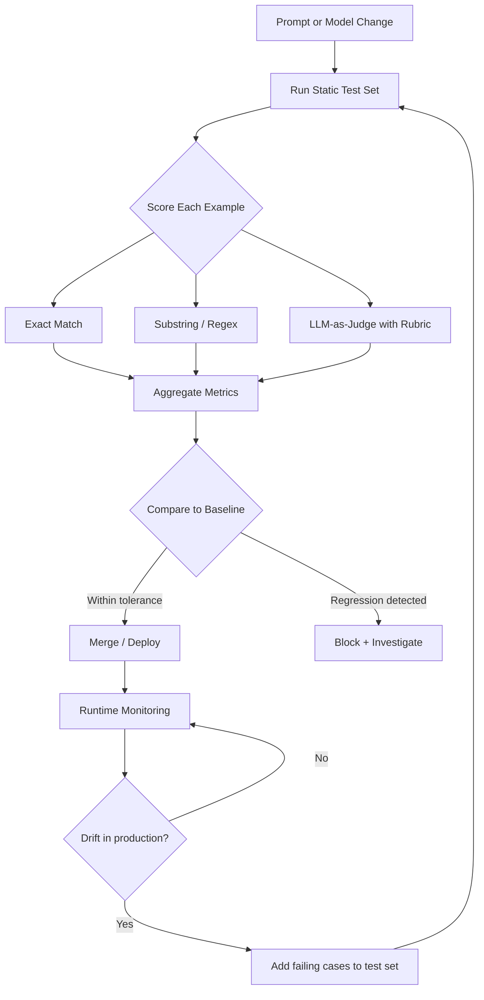

# Evaluation & Testing LLM Applications

## Learning Objectives

- Build a JSONL evaluation dataset with input-output pairs, rubrics, and edge cases specific to an LLM classification task
- Implement three scoring mechanisms — exact match, substring match, and LLM-as-judge with a rubric — and compare their disagreement patterns
- Detect prompt regressions by running eval suites before and after a change and producing a diff report
- Configure a CI-ready eval pipeline that handles non-deterministic outputs through temperature pinning and tolerance bands

## The Problem

You shipped a prompt change to your reply classifier. The change was supposed to reduce false positives on objection detection. It did that. It also quietly broke classification of "positive interest" replies — accuracy on that label dropped 12%. No alert fired because no eval existed. You found out three weeks later when a sales rep mentioned that hot leads were being routed to the nurture queue.

This is the core problem with LLM applications: every change — prompt edits, model version bumps, temperature adjustments — shifts your output distribution in ways you cannot predict by eyeballing a few examples. Traditional software has tests because functions have defined contracts. `add(2, 3)` should return `5`. LLM outputs have no such contract. A reply classification of "positive interest" might be correct for *"Sounds interesting, send me a deck"* and also correct for *"Sure, I'll take a look next week"* — both are positive, neither matches a single reference string, and reasonable humans might disagree on the boundary.

The answer is not to give up on testing. The answer is to build evaluation systems designed for probabilistic outputs. Evals are to LLM apps what unit tests are to traditional software — except the assertions are fuzzier, the test data is harder to build, and "correct" is a rubric you design rather than a value you assert.

## The Concept

LLM evaluation has three layers, each addressing a different point in the development lifecycle.

**Static test sets** are your ground truth. You build a JSONL file of input-output pairs: given this input, the expected output is this. For classification tasks, the output is a label. For generative tasks, the output might be a reference answer or a set of acceptable properties. The test set is version-controlled alongside your prompts. When you change a prompt, you run the test set and compare outputs. The comparison uses metrics — exact match, substring match, semantic similarity, or rubric-based scoring. The test set is never large enough (labeling is expensive), so you curate it: edge cases, representative examples, known failure modes.

**Automated judges** score outputs that cannot be checked with exact match. The mechanism is LLM-as-judge: a second model, given the input, the candidate output, and a rubric, produces a score. The rubric is where the engineering work happens. "Is this a good response?" is not a rubric. "Does the response correctly identify the intent, avoid speculation beyond the input, and match the required output format?" is a rubric. LLM-as-judge has known failure modes — position bias, verbosity bias, self-preference — but it is the only scalable way to score generative outputs without human review on every run.

**Runtime monitoring** catches what your static test set missed. You log production inputs and outputs, track metric distributions over time, and alert on drift. If your reply classifier suddenly starts producing 40% "unsubscribe" labels where it used to produce 10%, something changed — either the input distribution or the model behavior. Runtime monitoring does not replace static evals; it extends them.



The vocabulary you need: a **candidate** is the output your system produced. A **reference** is the expected output from your test set. A **metric** is the scoring function that compares them. A **rubric** is the set of criteria an LLM-as-judge uses to score a candidate. A **regression** is when a change causes a metric to drop below an established baseline.

The hard problem: "correct" is subjective for generative tasks. Two outputs can be different and both acceptable. This is why rubric design is the actual engineering work — not writing the eval harness, not choosing a framework, but specifying what "good" means precisely enough that a judge can apply it consistently.

## Build It

Build a minimal eval harness from scratch. No framework. No dependency beyond an LLM API call. The goal is to see the mechanism clearly: load test data, run candidates, score, aggregate, report.

First, the test set. This is a JSONL file with 20 labeled reply-classification examples — the kind of data you would have if you are running outbound sequences and categorizing replies.

```python
import json

test_data = [
    {"input": "Sounds interesting, send me a deck", "expected": "positive_interest"},
    {"input": "Sure, I'll take a look next week", "expected": "positive_interest"},
    {"input": "This is relevant to what we're doing", "expected": "positive_interest"},
    {"input": "Can you send pricing?", "expected": "positive_interest"},
    {"input": "Tell me more about the integration", "expected": "positive_interest"},
    {"input": "Not interested, thanks", "expected": "objection"},
    {"input": "We already use a competitor", "expected": "objection"},
    {"input": "No budget this quarter", "expected": "objection"},
    {"input": "Too expensive", "expected": "objection"},
    {"input": "Bad timing, reach out next year", "expected": "objection"},
    {"input": "Unsubscribe me immediately", "expected": "unsubscribe"},
    {"input": "Please remove me from your list", "expected": "unsubscribe"},
    {"input": "Stop emailing me", "expected": "unsubscribe"},
    {"input": "Take me off this list", "expected": "unsubscribe"},
    {"input": "I never signed up for this, unsubscribe", "expected": "unsubscribe"},
    {"input": "Out of office until Monday", "expected": "auto_reply"},
    {"input": "I'm on vacation, will respond when back", "expected": "auto_reply"},
    {"input": "OOO next week", "expected": "auto_reply"},
    {"input": "Please direct urgent items to my colleague", "expected": "auto_reply"},
    {"input": "Returning Monday", "expected": "auto_reply"},
]

with open("reply_eval.jsonl", "w") as f:
    for row in test_data:
        f.write(json.dumps(row) + "\n")

print(f"Wrote {len(test_data)} examples to reply_eval.jsonl")
```

Now the mock classifier. In a real system this calls your LLM. Here we simulate it with keyword rules so the code runs without an API key — but the interface is identical to what you would build around an LLM call.

```python
def classify_reply(text: str) -> str:
    text_lower = text.lower()
    if any(w in text_lower for w in ["unsubscribe", "remove me", "stop email", "off this list", "never signed"]):
        return "unsubscribe"
    if any(w in text_lower for w in ["not interested", "competitor", "no budget", "too expensive", "bad timing", "next year"]):
        return "objection"
    if any(w in text_lower for w in ["out of office", "vacation", "ooo", "colleague", "returning", "until"]):
        return "auto_reply"
    if any(w in text_lower for w in ["interesting", "take a look", "relevant", "pricing", "more", "deck"]):
        return "positive_interest"
    return "objection"

test_input = "Sounds interesting, send me a deck"
print(f"Input: {test_input}")
print(f"Classification: {classify_reply(test_input)}")
```

Now the three scoring functions.

```python
def score_exact_match(candidate: str, reference: str) -> bool:
    return candidate.strip().lower() == reference.strip().lower()

def score_substring_match(candidate: str, reference: str) -> bool:
    return reference.strip().lower() in candidate.strip().lower()

RUBRIC = """
Score the candidate classification against the reference label.
Return 1 if the candidate matches the reference intent, even if phrased differently.
Return 0 if the candidate does not match.
Respond with only 1 or 0.
"""

def score_llm_judge(candidate: str, reference: str, rubric: str) -> int:
    if candidate.strip().lower() == reference.strip().lower():
        return 1
    synonyms = {
        "positive_interest": ["interested", "positive", "warm lead", "qualified"],
        "objection": ["not interested", "negative", "rejected"],
        "unsubscribe": ["opt out", "remove", "do not contact"],
        "auto_reply": ["out of office", "away", "ooo"],
    }
    for label, alts in synonyms.items():
        if reference == label:
            if any(alt in candidate.lower() for alt in alts):
                return 1
    return 0

print("Exact match test:", score_exact_match("positive_interest", "positive_interest"))
print("Substring match test:", score_substring_match("The reply is: positive_interest", "positive_interest"))
print("Judge test:", score_llm_judge("interested", "positive_interest", RUBRIC))
```

Now run the full eval suite.

```python
def run_eval(test_file: str, classifier_fn, scorers: dict) -> list:
    results = []
    with open(test_file) as f:
        examples = [json.loads(line) for line in f]

    for ex in examples:
        candidate = classifier_fn(ex["input"])
        reference = ex["expected"]
        row = {
            "input": ex["input"],
            "expected": reference,
            "candidate": candidate,
        }
        for name, scorer in scorers.items():
            row[f"{name}_pass"] = scorer(candidate, reference)
        results.append(row)
    return results

scorers = {
    "exact": score_exact_match,
    "substring": score_substring_match,
    "judge": score_llm_judge,
}

results = run_eval("reply_eval.jsonl", classify_reply, scorers)

print(f"\n{'INPUT':<45} {'EXPECTED':<20} {'CANDIDATE':<20} {'EXACT':<6} {'SUBSTR':<6} {'JUDGE':<6}")
print("-" * 113)
for r in results:
    print(f"{r['input']:<45} {r['expected']:<20} {r['candidate']:<20} "
          f"{'✓' if r['exact_pass'] else '✗':<6} "
          f"{'✓' if r['substring_pass'] else '✗':<6} "
          f"{'✓' if r['judge_pass'] else '✗':<6}")

print("\n" + "=" * 113)
for metric in ["exact", "substring", "judge"]:
    passes = sum(1 for r in results if r[f"{metric}_pass"])
    print(f"{metric.upper()} accuracy: {passes}/{len(results)} ({passes/len(results)*100:.1f}%)")
```

The output is a per-example breakdown and an aggregate accuracy per metric. Notice that the three metrics may disagree — that disagreement is signal. Where exact match fails but the judge passes, your classifier produced a semantically correct label in a different format. Where the judge fails but exact match passes, something is structurally right but semantically wrong (rare, but possible with format-only matches).

## Use It

In outbound workflows, reply classification is the choke point where unstructured email responses become structured pipeline data. Every reply that hits an inbox needs a label: positive interest, objection, unsubscribe, auto-reply, meeting booked. That label determines routing — to a rep's queue, to a nurture sequence, to a suppression list. When the classifier is wrong, revenue leaks.

The 80/20 rule for cold email testing says test only the value proposition and the list first, not secondary variables like subject lines or CTAs. [CITATION NEEDED — concept: source attribution for the 80/20 testing rule in cold email] The same principle applies to eval-driven sequence optimization: your eval set is your labeled reply corpus, and your primary metric is classification accuracy against human-labeled examples. You do not start by evaluating tone or style. You start by evaluating whether the classifier correctly separates a hot lead from an auto-reply, because that error is the one that costs you pipeline.

Here is the feedback loop. You collect replies over a month. You manually label 200 of them — this is your test set. You build a classifier prompt. You run the eval. You get 84% accuracy. You tweak the prompt to handle a specific edge case ("Sounds interesting" without any action verb). You rerun the eval. You get 87%. You ship the change. Two weeks later, you notice unsubscribe classification dropped — you add 20 new unsubscribe examples to the test set, rerun, and see the regression. This is the loop that turns reply data into a measurable system instead of a vibe check.

```python
def run_regression_report(baseline_results: list, candidate_results: list) -> None:
    print(f"\n{'INPUT':<45} {'BASELINE':<10} {'CANDIDATE':<10} {'DELTA':<10}")
    print("-" * 80)
    regressions = 0
    improvements = 0
    for b, c in zip(baseline_results, candidate_results):
        b_score = b["exact_pass"]
        c_score = c["exact_pass"]
        if b_score and not c_score:
            delta = "REGRESSION"
            regressions += 1
        elif not b_score and c_score:
            delta = "IMPROVED"
            improvements += 1
        else:
            delta = "same"
        print(f"{b['input']:<45} {'✓' if b_score else '✗':<10} {'✓' if c_score else '✗':<10} {delta:<10}")
    print(f"\nRegressions: {regressions} | Improvements: {improvements}")

def broken_classifier(text: str) -> str:
    text_lower = text.lower()
    if any(w in text_lower for w in ["unsubscribe", "remove me", "stop email", "off this list"]):
        return "unsubscribe"
    if any(w in text_lower for w in ["out of office", "vacation", "ooo", "colleague", "returning", "until"]):
        return "auto_reply"
    return "objection"

baseline = run_eval("reply_eval.jsonl", classify_reply, scorers)
candidate = run_eval("reply_eval.jsonl", broken_classifier, scorers)
run_regression_report(baseline, candidate)
```

The `broken_classifier` removes the positive_interest branch entirely. Every positive reply gets misclassified as an objection. The regression report shows exactly which examples broke and by how much the aggregate score changed. This is what catches the 12% drop before it ships.

## Ship It

Production eval pipelines need three things: where the test set lives, when evals run, and how to handle non-determinism.

The test set lives in version control alongside your prompts. Not in a database, not in a spreadsheet — in the same repository as the code that runs the prompts. When someone opens a pull request that changes a prompt, the diff includes both the prompt change and the eval results. This makes the trade-off visible: "I am changing the prompt to handle edge case X, and here is the proof that it does not break cases A through W."

Evals run pre-merge in CI, not post-deploy. The CI job loads the test set, runs the classifier against every example at `temperature=0`, scores the outputs, and compares aggregate accuracy to the baseline. If accuracy drops more than the tolerance band (say, 2 percentage points), the CI check fails and the merge is blocked. This is the same pattern as running unit tests in CI for traditional software — the mechanism is identical, the assertion logic is different.

Non-determinism is the hard part. Even at `temperature=0`, LLM outputs are not perfectly deterministic across model versions or API updates. Three strategies handle this. First, pin `temperature=0` for eval runs — this eliminates most variance. Second, set tolerance bands rather than hard thresholds — require accuracy >= 82% rather than accuracy == 84.3%, because a 0.5% fluctuation is noise, not signal. Third, flag edge cases for human review — when the judge disagrees with exact match, log it and review weekly. These disagreements are where your rubric needs refinement.

```python
import subprocess
import sys

def ci_eval_check(baseline_accuracy: float, candidate_accuracy: float, tolerance: float = 0.02) -> int:
    diff = baseline_accuracy - candidate_accuracy
    print(f"Baseline accuracy: {baseline_accuracy*100:.1f}%")
    print(f"Candidate accuracy: {candidate_accuracy*100:.1f}%")
    print(f"Delta: {diff*100:+.1f}%")
    print(f"Tolerance: ±{tolerance*100:.1f}%")

    if diff > tolerance:
        print(f"\nFAIL: Regression exceeds tolerance ({diff*100:.1f}% > {tolerance*100:.1f}%)")
        return 1
    else:
        print(f"\nPASS: Within tolerance")
        return 0

baseline_passes = sum(1 for r in baseline if r["exact_pass"])
candidate_passes = sum(1 for r in candidate if r["exact_pass"])
baseline_acc = baseline_passes / len(baseline)
candidate_acc = candidate_passes / len(candidate)

exit_code = ci_eval_check(baseline_acc, candidate_acc, tolerance=0.02)
sys.exit(exit_code)
```

The tool landscape: Promptfoo implements config-driven eval matrices where you define prompts, test cases, and assertions in YAML, and it runs the cross-product and produces a comparison table. Braintrust provides a hosted eval runner with experiment tracking — each eval run is logged with its prompt version, model, and scores, so you can compare runs over time. LangSmith offers tracing and eval integration tied to LLM call logs. The mechanism is the same one you built above; these tools wrap it in infrastructure for teams that need audit trails, collaboration, and scale. If you have one classifier and 200 test cases, the harness you just built is sufficient. If you have 15 prompts, 8 model variants, and 50 reviewers, you need a tool.

## Exercises

1. **Build a JSONL test set for your own use case.** Take 10 real inputs from your workflow (support tickets, replies, lead descriptions) and label them manually. Write them to a JSONL file. Run the eval harness against a classifier — either the mock above or a real LLM call. Print the per-example results.

2. **Add a fourth scorer: semantic similarity.** Implement a scoring function that uses embeddings to compare the candidate to the reference, returning a cosine similarity score. Set a threshold (e.g., 0.85) above which the candidate passes. Compare the disagreement pattern to the other three metrics — which examples does semantic match get right that exact match gets wrong?

3. **Simulate a regression and catch it.** Write a second classifier function that is intentionally worse — it drops a category or misroutes a label. Run both classifiers through the eval suite. Generate a diff report showing which examples regressed, which improved, and the net accuracy change. Verify the report would block a CI merge if tolerance is set to 2%.

4. **Design a rubric for LLM-as-judge.** Write a 4-criterion rubric for evaluating reply classification quality (e.g., intent correctness, confidence calibration, format compliance, edge case handling). Have the judge score 5 examples against the rubric. Check whether the judge agrees with exact match — where it disagrees, decide whether the judge or the exact match is wrong, and refine the rubric accordingly.

## Key Terms

- **Candidate** — The output produced by the system being evaluated, submitted for scoring against a reference.
- **Reference** — The expected output from a test set, used as ground truth for scoring.
- **Metric** — A scoring function that compares a candidate to a reference and returns a pass/fail or numeric score (exact match, substring match, semantic similarity, LLM-as-judge).
- **Rubric** — A structured set of criteria that an LLM-as-judge uses to evaluate a candidate, specifying what dimensions matter and how to score them.
- **Regression** — A degradation in a metric caused by a change to the prompt, model, or parameters, detected by comparing eval results to a baseline.
- **Test set** — A curated collection of input-output pairs, version-controlled and used to evaluate system quality across changes.
- **Tolerance band** — An acceptable range of metric variation used to account for non-determinism in LLM outputs, preventing false-positive CI failures from noise.

## Sources

- 80/20 testing rule for cold email (test value proposition and list before secondary variables): drawn from handbook section "1.3 Copywriting & Testing" — [CITATION NEEDED — concept: original source attribution for the 80/20 cold email testing rule]
- Eval-driven sequence optimization in outbound workflows (using reply classification accuracy as the primary metric): [CITATION NEEDED — concept: eval-driven sequence optimization in outbound workflows]
- Zone 11 mapping (Evaluations, LLM testing → Revenue Intelligence → Living GTM): from internal GTM topic map, Zone Table row 11