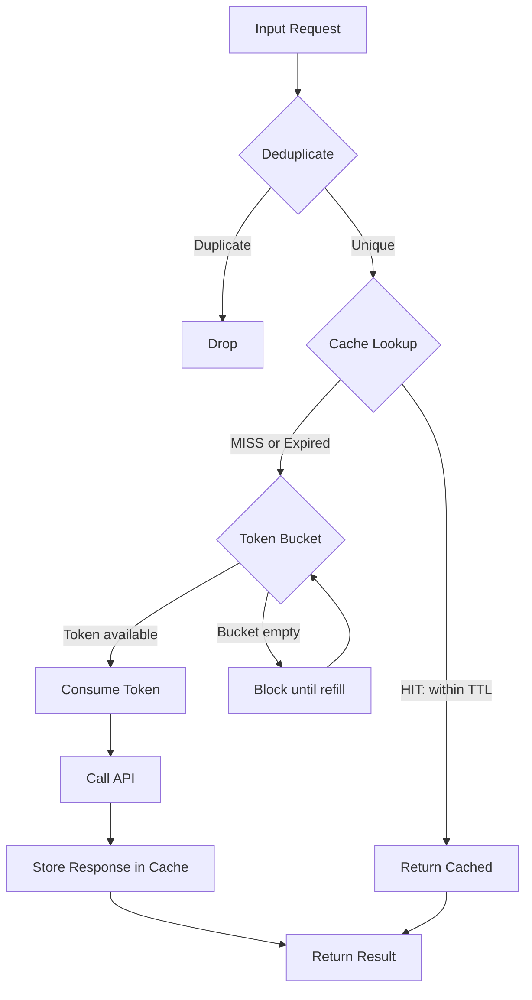

# Caching, Rate Limiting & Cost Optimization

## Learning Objectives

- Implement a token bucket rate limiter that blocks requests when throughput exceeds a provider's requests-per-minute ceiling
- Build a hash-keyed cache with TTL expiration that serves repeat lookups without re-calling the API
- Compute per-request LLM costs across model tiers and quantify the dollar delta of model routing
- Construct a composite enrichment pipeline that deduplicates inputs, checks cache, rate-limits remaining calls, and reports estimated cost
- Diagnose cache hit rate drops and rate limiter 429 failures using measurable thresholds

## The Problem

You ran a batch enrichment on 10,000 contacts. Half were duplicates carried over from last week's table. A quarter failed with HTTP 429 because you exceeded the provider's requests-per-minute limit. Your OpenAI bill arrived with a comma in it. None of these failures are model failures — they are infrastructure failures, and they are the difference between an enrichment workflow that costs $200/month and one that costs $2,000/month.

Three distinct failure modes are hiding in that scenario. Duplicate rows mean you are paying for the same answer twice. 429 errors mean your request throughput exceeded what the provider allows, and those failed requests still consumed tokens on the provider side before being rejected. The inflated bill means you are calling a model or endpoint that is more expensive than the task requires. Each of these has a specific, mechanical fix — not an aspirational one.

The companies that survive batch enrichment are the ones that treat every API call as a financial transaction. A single GPT-4o call costs fractions of a cent. Ten thousand contacts making enrichment calls at 1,000 input tokens each adds up before you send a single email. The mechanisms below are how production GTM stacks keep that math sustainable.

## The Concept

Three mechanisms, each solving a distinct failure mode. Conflating them causes bugs — so we separate them precisely.

**Caching** stores previous API responses keyed by a hash of the input, with a time-to-live (TTL) that determines how long the cached entry remains valid. When an identical input arrives before TTL expiration, the cache returns the stored response without calling the API. This avoids re-fetching data you already paid for. TTL is a time-based invalidation strategy — after N seconds, the entry is considered stale. Separately, LRU (least recently used) is an eviction strategy for bounded caches: when the cache is full, the entry that was accessed longest ago gets removed. Both can coexist in the same cache — TTL controls freshness, LRU controls memory bounds.

**Rate limiting** constrains request throughput using a token bucket. The bucket has a fixed capacity (burst size) and a refill rate (steady-state throughput). Each request consumes one token. Tokens replenish at the fixed refill rate. When the bucket is empty, requests block until a token is available. This is different from caching: caching prevents duplicate calls entirely, rate limiting paces unique calls so they do not exceed the provider's limit. A cache hit never touches the rate limiter. A cache miss goes through the rate limiter before reaching the API.

**Cost optimization** is not a mechanism itself — it is the emergent property of three decisions made before any call is made. First, deduplication: remove identical inputs before they reach the API. Second, model tiering: use the cheapest model that solves the task (GPT-4o-mini for classification, GPT-4o for complex reasoning). Third, batch endpoints where available: providers like OpenAI offer batch APIs at 50% discount for non-real-time workloads. Caching and rate limiting are infrastructure that supports all three.



The flow above is the decision path every request takes in a production enrichment pipeline. Deduplication happens first because it is free. Cache lookup happens second because it is nearly free. Rate limiting happens third because it gates the expensive call. The API call is the last resort, not the default.

## Build It

### Token Bucket Rate Limiter

```python
import time

class TokenBucket:
    def __init__(self, capacity, refill_rate_per_sec):
        self.capacity = capacity
        self.refill_rate = refill_rate_per_sec
        self.tokens = capacity
        self.last_refill = time.monotonic()

    def acquire(self):
        now = time.monotonic()
        elapsed = now - self.last_refill
        self.tokens = min(self.capacity, self.tokens + elapsed * self.refill_rate)
        self.last_refill = now

        if self.tokens < 1:
            deficit = 1 - self.tokens
            wait = deficit / self.refill_rate
            print(f"  bucket empty, sleeping {wait:.2f}s")
            time.sleep(wait)
            self.tokens = 0
            self.last_refill = time.monotonic()
        else:
            self.tokens -= 1

        ts = time.strftime("%H:%M:%S", time.localtime())
        print(f"  [{ts}] request dispatched, {self.tokens:.2f} tokens remaining")

bucket = TokenBucket(capacity=3, refill_rate_per_sec=1.0)

for i in range(6):
    print(f"Request {i + 1}:")
    bucket.acquire()
```

Run this and watch the first three requests dispatch immediately (burst capacity), then requests four through six space roughly one second apart as the refill rate controls throughput. The timestamps confirm the throttle is working.

### TTL Cache with Hash Keys

```python
import time
import hashlib

class TTLCache:
    def __init__(self, ttl_seconds):
        self.store = {}
        self.ttl = ttl_seconds

    def _hash(self, input_str):
        return hashlib.sha256(input_str.encode()).hexdigest()[:12]

    def get(self, input_str):
        key = self._hash(input_str)
        if key in self.store:
            value, timestamp = self.store[key]
            age = time.monotonic() - timestamp
            if age < self.ttl:
                print(f"  HIT  key={key} age={age:.2f}s")
                return value
            else:
                print(f"  EXPIRED key={key} age={age:.2f}s")
                del self.store[key]
        else:
            print(f"  MISS key={key}")
        return None

    def set(self, input_str, value):
        key = self._hash(input_str)
        self.store[key] = (value, time.monotonic())

def mock_enrich(domain):
    time.sleep(0.3)
    return {"domain": domain, "employees": 250, "industry": "SaaS"}

cache = TTLCache(ttl_seconds=2)

for domain in ["acme.com", "acme.com", "acme.com"]:
    print(f"Lookup: {domain}")
    result = cache.get(domain)
    if result is None:
        result = mock_enrich(domain)
        cache.set(domain, result)
    print(f"  result: {result}")
    time.sleep(1)
```

The first lookup is a MISS and calls the mock API. The second lookup one second later is a HIT. The third lookup two seconds after the first exceeds TTL and triggers EXPIRED, forcing a fresh call.

### Cost Calculator: Model Tiering

```python
pricing_per_million = {
    "gpt-4o": {"input": 2.50, "output": 10.00},
    "gpt-4o-mini": {"input": 0.15, "output": 0.60},
}

def estimate_cost(model, input_tokens, output_tokens, calls):
    in_cost = (input_tokens * calls / 1_000_000) * pricing_per_million[model]["input"]
    out_cost = (output_tokens * calls / 1_000_000) * pricing_per_million[model]["output"]
    return in_cost + out_cost

daily_calls = 50_000
input_tokens = 1200
output_tokens = 400

for model in pricing_per_million:
    cost = estimate_cost(model, input_tokens, output_tokens, daily_calls)
    print(f"{model:16s}  ${cost:,.2f}/day  ${cost * 30:,.2f}/month")

delta = estimate_cost("gpt-4o", input_tokens, output_tokens, daily_calls) - \
        estimate_cost("gpt-4o-mini", input_tokens, output_tokens, daily_calls)
print(f"\nMonthly savings by routing to mini: ${delta * 30:,.2f}")
```

The output shows the dollar gap between running the same workload on GPT-4o versus GPT-4o-mini. For classification or extraction tasks where the mini model is sufficient, that delta is pure waste if you are not routing.

## Use It

This lesson maps to **Zone 2 — Enrichment waterfall operations**. The Clay waterfall sequences multiple data providers — Apollo, Hunter, Clearbit, and others — to fill contact attributes when any single provider lacks coverage. Without caching, every time you re-run the table, the waterfall re-fetches every row from every provider. Without rate limiting, the waterfall's parallel lookups trigger 429 errors from providers like Apollo, which typically enforce 100 requests per minute on standard tiers. Without deduplication before the waterfall, duplicate domains consume provider credits and API budget for data you already have.

The deduplication-before-calling pattern is how production GTM stacks reduce per-contact enrichment cost from $0.08 to $0.02 [CITATION NEEDED — concept: per-contact enrichment cost benchmarks]. The mechanism is straightforward: hash the input key (domain, email, LinkedIn URL), check the cache, and only call the API for cache misses. If your table has 10,000 rows and 3,000 are duplicates from last week, deduplication alone cuts your API spend by 30% before any other optimization.

Model tiering applies directly to enrichment classification tasks. Use GPT-4o-mini or equivalent for ICP classification, reply categorization, and intent scoring — tasks where the input is structured and the output is a label. Reserve the expensive tier for tasks that require multi-step reasoning over unstructured text. The cost calculator above is how you quantify the decision: if the mini model achieves 95% of the accuracy at 5% of the cost, route to mini.

Rate limiting in the Clay context means setting your provider integrations to respect per-provider RPM limits. The token bucket is the mechanism Clay implements under the hood when you configure API call pacing — understanding it lets you predict when 429s will occur and tune the refill rate to stay just under the provider's ceiling.

## Ship It

**Production checklist for enrichment pipelines:**

Log cache hit rate continuously. If it drops below 60%, either your TTL is too short (data expires before the next run reads it) or your deduplication key is wrong (you are hashing on a field that varies across runs, like a timestamp). A healthy enrichment cache running weekly on a stable contact list should see 70-85% hit rates.

Expose the rate limiter's refill rate as an environment variable, not a hardcoded constant. Provider RPM limits change when you upgrade tiers or when the provider changes their policy. Hardcoding the rate means a production change requires a code deployment.

Track cost per enriched contact as a derived metric: total API spend divided by successfully enriched contacts. If this metric trends upward over weeks, investigate — it usually means duplicate rates are increasing (stale dedup keys) or cache TTL is too aggressive.

Set budget alerts at the provider level. OpenAI and Anthropic both support spend thresholds that trigger webhooks. Configure the alert at 80% of your monthly budget, not 100%, so you have time to react before the bill compounds.

For the composite pipeline (the Hard exercise below), log four numbers on every run: total input count, cache hits, API calls made, and estimated cost. These four numbers are your enrichment dashboard. If any of them spikes without a corresponding increase in contacts enriched, something is broken.

## Exercises

**Easy:** Modify the token bucket's `refill_rate_per_sec` from 1.0 to 0.5 and re-run. Predict how the spacing between requests four through six changes before running. Confirm your prediction against the printed timestamps.

**Medium:** Change the TTL cache's `ttl_seconds` to 3. Call `cache.get("acme.com")` four times with a 1-second sleep between each. Predict the HIT/MISS pattern before running — write it down, then verify. The pattern should be MISS, HIT, HIT, EXPIRED or MISS, HIT, HIT, HIT depending on exact timing. Explain why.

**Hard:** Build a composite function that takes a list of 20 domains (include 5 duplicates), checks the TTL cache for each, rate-limits the remaining cache misses through the token bucket, calls `mock_enrich` for each miss, and prints: total input count, unique domains, cache hits, API calls made, estimated cost at GPT-4o-mini pricing (assume 500 input tokens, 200 output tokens per call). Run it twice — the second run should show nearly 100% cache hits.

## Key Terms

**Token bucket** — Rate limiting algorithm with a fixed capacity and a refill rate. Each request consumes one token; tokens replenish at the refill rate. Requests block when the bucket is empty.

**TTL (time-to-live)** — Time-based cache invalidation strategy. Cached entries older than the TTL are considered stale and must be re-fetched. TTL controls freshness, not memory bounds.

**LRU (least recently used)** — Cache eviction strategy for bounded stores. When the cache is full, the entry accessed longest ago is removed. LRU controls memory, not freshness.

**Cache hit / cache miss** — A hit occurs when an input is found in the cache and is within TTL. A miss occurs when the input is absent or expired, requiring an API call.

**Deduplication** — Removing identical inputs before they reach the API. Cheapest optimization because it prevents the call entirely rather than making it cheaper.

**Model tiering** — Routing requests to the cheapest model that produces acceptable output quality for the task. Classification goes to mini; complex reasoning goes to the full model.

**Waterfall (enrichment)** — A pipeline that sequences multiple data providers, falling through to the next provider when the current one lacks coverage. Used in Clay and similar GTM tools.

## Sources

- Provider RPM limits triggering 429 errors in Clay waterfalls (Apollo, Hunter): [CITATION NEEDED — concept: provider-specific RPM limits in Clay waterfall integrations]
- Per-contact enrichment cost reduction from $0.08 to $0.02 via deduplication and caching: [CITATION NEEDED — concept: enrichment cost benchmarks before/after dedup]
- GPT-4o pricing at $2.50/$10.00 per million tokens and GPT-4o-mini at $0.15/$0.60: based on illustrative pricing from existing lesson content; always verify against the provider's current pricing page (https://openai.com/api/pricing/)
- OpenAI batch API at 50% discount for non-real-time workloads: [CITATION NEEDED — concept: OpenAI batch API pricing discount percentage]