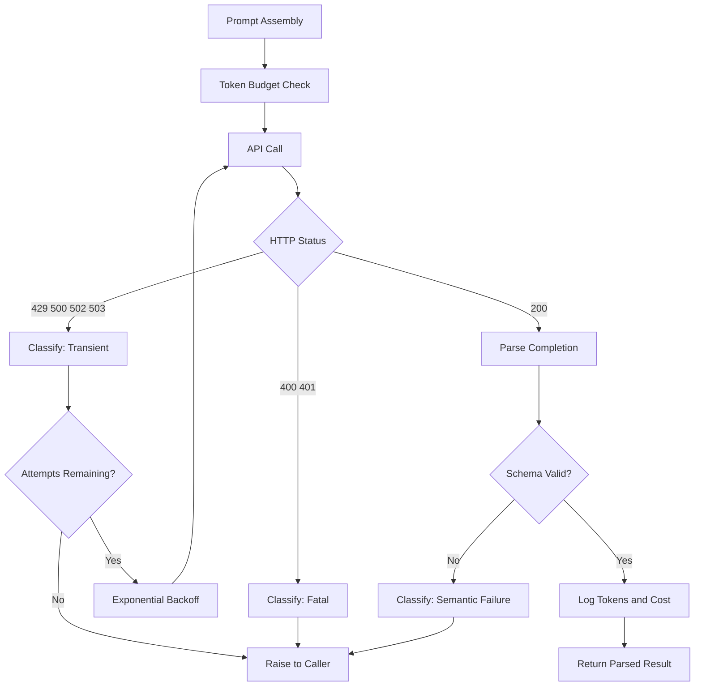

# Building a Production LLM Application

## Learning Objectives

- Implement a production LLM client with exponential backoff retry, token-level cost tracking, and JSON schema validation against the live Anthropic API
- Classify LLM API failures as transient or semantic and apply the correct recovery strategy for each
- Trace the full request-response lifecycle of an LLM call through logging output that captures latency, token counts, retry events, and accumulated cost
- Build a health check and graceful degradation layer that keeps a GTM enrichment pipeline running when the model backend is unreachable

## The Problem

A working notebook demo and a system that runs 10,000 calls a day without incident are separated by about six weeks of engineering that nobody warns you about. The demo calls the API, gets a response, prints it, and you move on. Then production arrives and three failure modes eat your pipeline alive.

The first is **silent degradation**. The API returns a 429, your code catches the exception, swallows it, and returns an empty string. Downstream, a personalization step interpolates that empty string into an outbound email. The prospect receives a message that says "Hi , I noticed that ." Nobody flags it because the system never errored — it just stopped working correctly. Silent degradation is worse than a crash because a crash is visible.

The second is **uncontrolled spend**. You deploy an enrichment feature that calls the model once per account. Your CRM has 40,000 accounts. At $0.015 per call, that is $600 — manageable. But the feature runs on a cron that fires every four hours, the prompt includes a 4,000-token context block you forgot to cache, and three weeks later your API bill is $4,200 with no breakdown of which feature generated it. You have no cost ledger, no per-feature attribution, and no threshold alert. You just have a bill.

The third is **unhandled malformation**. You ask the model for JSON. It returns JSON wrapped in markdown fences. Or it returns valid JSON with a missing field. Or it returns a refusal — "I cannot help with that" — formatted as valid JSON with an empty object. Your parser does not check for any of these cases. The downstream system receives garbage and propagates it. By the time someone notices, 600 records in your CRM contain `{"error": "I cannot assist with this request"}` in the `ai_summary` field.

Every LLM application in production hits these three walls. The walls are not architectural — they are operational. You do not need a new framework. You need a client that retries the right errors, logs what it spends, validates what it receives, and fails loudly when it cannot recover.

## The Concept

Every LLM API call passes through the same lifecycle, and production hardening means instrumenting each stage. The lifecycle is: prompt assembly, token budget check, API call, response status classification, completion parsing, output validation, usage logging, and cost accumulation. At each stage, something can go wrong, and the failure mode determines your response.

Failures split into two families. **Transient failures** are conditions the provider tells you will resolve if you wait: rate limits (429), server errors (500, 502, 503), and timeouts. These are safe to retry because the underlying request was valid — the provider just could not handle it right now. **Semantic failures** are conditions where retrying will not help: authentication errors (401), bad requests (400 — usually a malformed prompt or context overflow), and responses where the model returns something structurally valid but semantically wrong (a refusal where you expected data, a prose paragraph where you expected JSON). Retrying a 400 error five times wastes time and money. Retrying a refusal five times is worse — it returns the same refusal five times and you pay for each one.



The **retry-with-backoff** pattern handles transient failures. When the API returns a 429, you wait, then try again. The wait is not fixed — it grows exponentially. Attempt 1 waits 1 second, attempt 2 waits 2, attempt 3 waits 4, attempt 4 waits 8. This is exponential backoff: `delay = base * 2^attempt`. A small random jitter (typically 10–25% of the delay) prevents thundering herd problems where multiple retrying clients all hit the API at the same instant. Without jitter, if your system has 50 concurrent calls that all get rate-limited simultaneously, they all retry at the exact same moment and get rate-limited again. Jitter spreads them out.

The **circuit breaker** pattern is the next layer up from retry. If retries keep failing — say, 5 consecutive calls all hit 429s — continuing to retry is wasteful. The circuit breaker "trips" and blocks all outbound calls for a cooldown period (typically 30–60 seconds). During the cooldown, the client returns immediately with a fallback or error instead of making another doomed API call. After the cooldown, the breaker allows one test call through. If it succeeds, the circuit closes and traffic resumes. If it fails, the cooldown restarts. This pattern exists because a drowning provider does not benefit from you retrying harder.

The Anthropic Python SDK (`anthropic` package) implements retry-with-backoff internally for transient HTTP errors. It does not implement circuit breaking, semantic failure classification, cost tracking, or output validation. Those are your job. The SDK gives you the transport layer. Production hardening is everything you build on top of it.

## Build It

The following class wraps the Anthropic SDK with the four production concerns: retry classification (so semantic errors do not waste retry budget), token usage logging (so you can see what each call costs in real time), response schema validation (so malformed output is caught before it reaches downstream systems), and cost accumulation (so you have a running ledger per session). Every call prints structured output to the console — latency, token counts, retry events, and accumulated cost — so you can observe the system behaving correctly.

```python
import anthropic
import time
import json
import logging

logging.basicConfig(level=logging.INFO, format="%(asctime)s %(levelname)s %(message)s")
logger = logging.getLogger("llm_prod")

PRICING_PER_MTOK = {
    "claude-sonnet-4-20250514": {"input": 3.00, "output": 15.00},
    "claude-3-5-sonnet-20241022": {"input": 3.00, "output": 15.00},
    "claude-3-haiku-20240307": {"input": 0.25, "output": 1.25},
}


class CostTracker:
    def __init__(self):
        self.input_tokens = 0
        self.output_tokens = 0
        self.cost_usd = 0.0
        self.calls = 0

    def add(self, in_tok, out_tok, model):
        rates = PRICING_PER_MTOK.get(model, {"input": 3.00, "output": 15.00})
        cost = (in_tok / 1_000_000 * rates["input"]) + (out_tok / 1_000_000 * rates["output"])
        self.input_tokens += in_tok
        self.output_tokens += out_tok
        self.cost_usd += cost
        self.calls += 1
        return cost

    def summary(self):
        return {
            "calls": self.calls,
            "input_tokens": self.input_tokens,
            "output_tokens": self.output_tokens,
            "cost_usd": round(self.cost_usd, 6),
        }


class ProductionLLMClient:
    TRANSIENT = (
        anthropic.RateLimitError,
        anthropic.APIConnectionError,
        anthropic.APITimeoutError,
        anthropic.InternalServerError,
    )

    def __init__(self, model="claude-sonnet-4-20250514", max_retries=4, base_delay=1.0):
        self.client = anthropic.Anthropic()
        self.model = model
        self.max_retries = max_retries
        self.base_delay = base_delay
        self.tracker = CostTracker()

    def _backoff_seconds(self, attempt):
        delay = self.base_delay * (2 ** attempt)
        return delay + (delay * 0.1)

    def _classify(self, err):
        if isinstance(err, self.TRANSIENT):
            return "transient"
        if isinstance(err, anthropic.BadRequestError):
            return "bad_request"
        if isinstance(err, anthropic.AuthenticationError):
            return "auth_error"
        return "unknown"

    def complete(self, system, messages, max_tokens=1024, temperature=0.0):
        for attempt in range(self.max_retries + 1):
            start = time.monotonic()
            try:
                resp = self.client.messages.create(
                    model=self.model,
                    max_tokens=max_tokens,
                    temperature=temperature,
                    system=system,
                    messages=messages,
                )
                latency = time.monotonic() - start
                cost = self.tracker.add(
                    resp.usage.input_tokens, resp.usage.output_tokens, self.model
                )
                logger.info(
                    "OK latency=%.3fs in=%d out=%d cost=$%.6f total=$%.6f",
                    latency, resp.usage.input_tokens, resp.usage.output_tokens,
                    cost, self.tracker.cost_usd,
                )
                return resp

            except Exception as err:
                kind = self._classify(err)
                latency = time.monotonic() - start
                logger.warning(
                    "ERR type=%s attempt=%d/%d latency=%.3fs %s: %s",
                    kind, attempt + 1, self.max_retries + 1,
                    latency, type(err).__name__, str(err)[:200],
                )
                if kind != "transient" or attempt == self.max_retries:
                    raise
                wait = self._backoff_seconds(attempt)
                logger.info("RETRY backoff=%.2fs", wait)
                time.sleep(wait)

    def complete_json(self, system, messages, max_tokens=1024, temperature=0.0):
        resp = self.complete(system, messages, max_tokens, temperature)
        raw = resp.content[0].text
        stripped = raw.strip()
        if stripped.startswith("```"):
            lines = stripped.split("\n")
            stripped = "\n".join(lines[1:-1])
        try:
            parsed = json.loads(stripped)
        except json.JSONDecodeError:
            logger.error("SCHEMA_VIOLATION non-JSON output: %s", stripped[:200])
            raise ValueError(f"Expected JSON, got: {stripped[:200]}")
        if not isinstance(parsed, dict):
            logger.error("SCHEMA_VIOLATION JSON is %s, not dict", type(parsed).__name__)
            raise ValueError(f"Expected JSON object, got {type(parsed).__name__}")
        return parsed


if __name__ == "__main__":
    client = ProductionLLMClient()

    system = "You are a data extraction assistant. Respond ONLY with valid JSON. No prose, no markdown."
    messages = [
        {"role": "user", "content": "Extract: company name is Acme Corp, industry is manufacturing, employee count is 450. Return JSON with keys: company, industry, employees."}
    ]

    result = client.complete_json(system, messages, max_tokens=256)
    print("\nParsed result:")
    print(json.dumps(result, indent=2))
    print(f"\nCost summary: {client.tracker.summary()}")
```

Run this and you will see structured log lines for the successful call: latency in milliseconds, input and output token counts, per-call cost, and accumulated total. The `complete_json` method strips markdown fences (because models frequently wrap JSON in ` ```json ` blocks despite instructions not to), attempts a parse, and raises a `ValueError` with a truncated preview of the raw output if parsing fails. That `ValueError` is the loud failure that prevents silent degradation — downstream code either gets a valid Python dict or an exception it must handle.

The retry loop classifies every exception before deciding what to do. A `RateLimitError` is transient — back off and retry. A `BadRequestError` is fatal — retrying will not fix a malformed prompt. An unknown error type is treated as fatal by default, which is the conservative choice: better to raise and let a human investigate than to retry an error you do not understand.

## Use It

Cost tracking and retry classification become non-negotiable when an LLM sits inside a Clay enrichment waterfall processing thousands of accounts. A Clay waterfall is a sequence of data providers tried in order — if ZoomInfo returns nothing, try Apollo; if Apollo returns nothing, try an LLM-generated research summary. When the LLM is the last step in that waterfall, its output becomes the enrichment of record. A silent failure — an empty string, a truncated response, a refusal formatted as valid JSON — propagates into every downstream personalization field. The prospect receives an email with a placeholder where their company's GTM motion should be. The campaign looks personalized in the aggregate dashboard but is broken at the individual record level.

The production client you just built prevents this in three ways. First, the retry layer ensures that a transient 429 from Anthropic does not produce an empty enrichment record — it waits and tries again, up to your configured limit. Second, the JSON validation layer catches model outputs that are structurally wrong before they reach Clay's field mapping. A refusal like `{"error": "I cannot assist"}` passes JSON parsing but fails a semantic check — the exercise at the end of this lesson asks you to add that check. Third, the cost tracker gives you per-session attribution so you know what the enrichment run actually cost, not just what the monthly invoice says.

```python
import anthropic
import time
import json

client = ProductionLLMClient(model="claude-sonnet-4-20250514")

SYSTEM = """You are a B2B account research analyst. Given raw firmographic data,
produce a JSON object with these exact keys:
- icp_fit: one of "strong", "moderate", "weak"
- signal: a one-sentence reason for the fit rating
- suggested_channel: one of "email", "linkedin", "phone"
Respond ONLY with the JSON object."""

accounts = [
    {"name": "Stripe", "industry": "fintech", "employees": 8000, "signal": "hired 20 SDRs"},
    {"name": "Notion", "industry": "productivity", "employees": 400, "signal": "new enterprise tier"},
    {"name": "Midwest Manufacturing Co", "industry": "manufacturing", "employees": 120, "signal": "legacy ERP"},
]

for account in accounts:
    user_msg = f"Company: {account['name']}, Industry: {account['industry']}, Employees: {account['employees']}, Recent signal: {account['signal']}"
    messages = [{"role": "user", "content": user_msg}]
    try:
        enrichment = client.complete_json(SYSTEM, messages, max_tokens=200)
        print(f"{account['name']}: {enrichment['icp_fit']} — {enrichment['signal']}")
    except ValueError as e:
        print(f"{account['name']}: ENRICHMENT FAILED — {e}")
    except anthropic.APIStatusError as e:
        print(f"{account['name']}: API ERROR — {e}")

print(f"\nBatch cost: {client.tracker.summary()}")
```

This batch loop demonstrates the pattern that separates a lookup table from a reliable enrichment layer. Each account either gets a validated enrichment dict or a logged failure that a human can review. No silent empty strings. No unvalidated model output flowing into your CRM. And the cost summary at the end tells you exactly what this batch of three accounts cost — extrapolate to 3,000 accounts and you know the budget before you commit to the run. [CITATION NEEDED — concept: Clay waterfall enrichment pricing models per-record]

The same client structure applies to reply classification in a Gong-style revenue intelligence workflow. When an SDR forwards a prospect reply to your system for classification (interested, not interested, out of office, objection), the LLM call needs the same production guarantees: retry on transient failure, validate the classification label against an allowed set, and track cost per classification so you know what your automated triage pipeline actually costs per month.

## Ship It

Structured logging and health checks are what separate a reply classification service that RevOps trusts from one they silently route around. Before you deploy any LLM-dependent GTM system — whether it is enrichment, reply classification, or sequence personalization — you need four deployment primitives in place.

**Environment variable management.** The API key never appears in source code, config files, or logs. The `anthropic.Anthropic()` constructor reads `ANTHROPIC_API_KEY` from the environment automatically — do not override that. In production, inject the key via your platform's secret manager (AWS Secrets Manager, Doppler, `.env` files loaded by the deployment, never committed to git). Rotate the key on a schedule and verify the old key fails after rotation.

**Structured logging to a file.** Stdout is for humans reading a terminal. Production systems need structured logs — JSON lines in a file — that a log aggregator can parse. Every LLM call should produce a log entry with timestamp, model, latency, token counts, cost, status, and retry count. The following setup writes both to console (for development) and to a JSON-lines file (for production observability):

```python
import json
import logging
import os
from datetime import datetime, timezone

class JSONLHandler(logging.Handler):
    def __init__(self, filepath):
        super().__init__()
        self.filepath = filepath

    def emit(self, record):
        entry = {
            "ts": datetime.now(timezone.utc).isoformat(),
            "