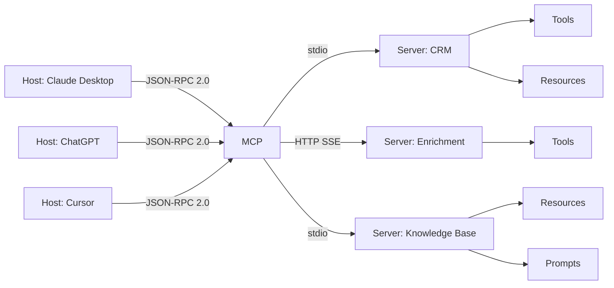

# Lesson: Model Context Protocol (MCP)

## Learning Objectives

- Build an MCP server that exposes a callable tool via the Python SDK and verify it with raw JSON-RPC messages.
- Trace the JSON-RPC 2.0 lifecycle from `initialize` through `tools/call`, identifying which messages carry an `id` and which are notifications.
- Compare `stdio` and Streamable HTTP transports and select the correct one for local development versus shared infrastructure.
- Implement `resources` and `prompts` as additional MCP primitives on an existing server.
- Evaluate when MCP replaces bespoke function-calling adapters in a GTM toolchain where multiple LLM hosts consume the same enrichment or classification tools.

## The Problem

You ship a chatbot that needs three tools: a CRM lookup, a calendar API, and a file reader. You write three JSON schemas for Claude's `tool_use` interface. Then sales wants the same tools available through ChatGPT — you rewrite them for OpenAI's `tools` parameter, which uses a slightly different envelope. Then you add Cursor and Claude Code to the mix, each with their own conventions for tool discovery and invocation. A week later, Anthropic adds a new field to their tool definition format; you update four schemas.

This was the pre-2025 reality. Every host (the application running an LLM) and every server (the thing exposing tools and data) spoke a bespoke protocol. Scaling integrations meant maintaining an N×M matrix — N hosts times M tool sources, each pair with its own adapter code, its own error handling, its own schema drift.

Model Context Protocol collapses that matrix into N+M. One JSON-RPC 2.0-based specification. A server exposes tools, resources, and prompts through a standard handshake. Any compliant host — Claude Desktop, ChatGPT, Cursor, Zed, Claude Code, and a growing list of agent frameworks — discovers and calls them without custom glue code. Write one server, every host talks to it. Add a new host, every existing server works immediately.

## The Concept

MCP is a JSON-RPC 2.0 protocol where a *host* (Claude Desktop, ChatGPT, an agent harness) spawns or connects to *servers* that expose three primitives. Before any work happens, the host and server negotiate capabilities through an initialization handshake. The client sends `initialize` with its protocol version and capabilities; the server responds with its own capabilities; the client sends an `initialized` notification; the session is live. From that point, every message follows JSON-RPC 2.0: requests carry an `id`, `method`, and `params`; responses carry the matching `id` with either `result` or `error`; notifications carry a `method` with no `id` and receive no response.



The three primitives serve distinct roles. **Tools** are functions the model can invoke with structured input — the direct analog of OpenAI's `tools` parameter or Anthropic's `tool_use` blocks. A server publishes tool schemas via `tools/list` and the host invokes them via `tools/call` with JSON arguments. This is the extension point for any API integration: a CRM lookup, an enrichment query, a reply classifier. **Resources** are read-only data the model or user can request by URI — file contents, database schemas, configuration documents. The server emits `resources/list` to publish what is available and `resources/read` to deliver content. **Prompts** are parameterized templates the server publishes via `prompts/list` and renders via `prompts/get`, letting a server bundle domain-specific instruction patterns alongside its tools and data.

Two transport mechanisms exist, and the choice is a deployment decision, not a protocol decision. **stdio** runs the server as a local subprocess — the host spawns the server process, writes JSON-RPC messages to its stdin, and reads responses from its stdout. This is zero-config: no ports, no authentication, no network. It is what you use for local development and single-user tooling. **Streamable HTTP** runs the server as an HTTP endpoint, using server-sent events for server-to-client streaming. This is what you use when multiple hosts need to share one server, or when the server lives behind a corporate firewall and must be reached over the network. The JSON-RPC message format is identical either way — only the transport changes.

The reason this matters over raw function calling is decoupling. Without MCP, the *shape* of a tool (its JSON schema) is coupled to the *transport* used to reach it (a Python function call, an HTTP request, a LangChain node). MCP separates them. One server can serve multiple hosts simultaneously. One host can consume multiple servers — Claude Desktop can talk to your CRM server, your enrichment server, and your filesystem server in the same session. The protocol handles capability negotiation, schema discovery, and error propagation. You write the tool logic once.

## Build It

Install the official Python SDK:

```bash
pip install mcp
```

Create a server that exposes one tool — a function that takes a company domain and returns a hardcoded enrichment payload. Save this as `server.py`:

```python
from mcp.server.fastmcp import FastMCP

mcp = FastMCP("enrichment-server")

@mcp.tool()
def enrich_company(domain: str) -> dict:
    return {
        "domain": domain,
        "company_name": "Acme Corp",
        "employee_count": 250,
        "industry": "SaaS",
        "tech_stack": ["Salesforce", "HubSpot", "Slack"]
    }

if __name__ == "__main__":
    mcp.run(transport="stdio")
```

That is a complete MCP server. The `FastMCP` class handles JSON-RPC parsing, capability negotiation, and schema generation from your Python type hints. The `@mcp.tool()` decorator registers `enrich_company` as a callable tool; its name, docstring, and parameter types become the JSON Schema that `tools/list` returns.

Now write a client that speaks raw JSON-RPC to verify the protocol end-to-end. This is what a host does internally — we are just making it visible. Save this as `inspect.py` in the same directory:

```python
import subprocess
import json
import sys

proc = subprocess.Popen(
    [sys.executable, "server.py"],
    stdin=subprocess.PIPE,
    stdout=subprocess.PIPE,
    stderr=subprocess.PIPE,
    text=True,
    bufsize=1
)

def send(msg):
    proc.stdin.write(json.dumps(msg) + "\n")
    proc.stdin.flush()

def recv():
    return json.loads(proc.stdout.readline())

send({
    "jsonrpc": "2.0",
    "id": 1,
    "method": "initialize",
    "params": {
        "protocolVersion": "2024-11-05",
        "capabilities": {},
        "clientInfo": {"name": "test-client", "version": "1.0.0"}
    }
})

print("=== INITIALIZE RESPONSE ===")
print(json.dumps(recv(), indent=2))

send({"jsonrpc": "2.0", "method": "notifications/initialized"})

send({"jsonrpc": "2.0", "id": 2, "method": "tools/list", "params": {}})

print("\n=== TOOLS LIST ===")
print(json.dumps(recv(), indent=2))

send({
    "jsonrpc": "2.0",
    "id": 3,
    "method": "tools/call",
    "params": {
        "name": "enrich_company",
        "arguments": {"domain": "acme.com"}
    }
})

print("\n=== TOOLS CALL RESPONSE ===")
print(json.dumps(recv(), indent=2))

proc.terminate()
```

Run it:

```bash
python inspect.py
```

Expected output:

```
=== INITIALIZE RESPONSE ===
{
  "jsonrpc": "2.0",
  "id": 1,
  "result": {
    "protocolVersion": "2024-11-05",
    "capabilities": {
      "tools": {}
    },
    "serverInfo": {
      "name": "enrichment-server",
      "version": "0.1.0"
    }
  }
}

=== TOOLS LIST ===
{
  "jsonrpc": "2.0",
  "id": 2,
  "result": {
    "tools": [
      {
        "name": "enrich_company",
        "description": "",
        "inputSchema": {
          "properties": {
            "domain": {"title": "Domain", "type": "string"}
          },
          "required": ["domain"],
          "title": "enrich_companyArguments",
          "type": "object"
        }
      }
    ]
  }
}

=== TOOLS CALL RESPONSE ===
{
  "jsonrpc": "2.0",
  "id": 3,
  "result": {
    "content": [
      {
        "type": "text",
        "text": "{\"domain\": \"acme.com\", \"company_name\": \"Acme Corp\", \"employee_count\": 250, \"industry\": \"SaaS\", \"tech_stack\": [\"Salesforce\", \"HubSpot\", \"Slack\"]}"
      }
    ]
  }
}
```

Read the message flow carefully. The `initialize` request (id: 1) gets a response with the server's capabilities — it advertises `tools` support. The `notifications/initialized` message has no `id` and gets no response — it is a notification, not a request. The `tools/list` request (id: 2) returns the auto-generated schema. The `tools/call` request (id: 3) invokes the function and wraps the return value in a `content` array of text blocks. That wrapping is the MCP envelope — the protocol standardizes how results are packaged so any host knows how to unpack them.

## Use It

Here is where MCP stops being a protocol exercise and becomes a GTM architecture decision. Consider Zone 11 — revenue intelligence and LLM testing. A common GTM pipeline classifies inbound replies (interested, not interested, out of office, wrong person) and routes them to the right outbound sequence. Today, that classifier is often a bespoke function wired into one specific agent or workflow. If you expose `classify_reply` as an MCP tool instead, any host — a Claude Desktop session an SDR is using, a ChatGPT-based auto-responder, a custom agent running in your sequence platform — can discover and call the same classifier without you writing a new adapter for each.

Add a second tool to your server to see this pattern. This one classifies a reply and returns a routing decision:

```python
@mcp.tool()
def classify_reply(reply_text: str) -> dict:
    text = reply_text.lower()
    if any(w in text for w in ["not interested", "remove", "unsubscribe"]):
        return {"classification": "not_interested", "route": "suppression_list"}
    elif any(w in text for w in ["meeting", "call", "demo", "learn more"]):
        return {"classification": "interested", "route": "warm_sequence"}
    elif any(w in text for w in ["out of office", "ooo", "vacation"]):
        return {"classification": "auto_reply", "route": "retry_7d"}
    else:
        return {"classification": "ambiguous", "route": "human_review"}
```

Re-run `inspect.py` and you will see both tools in `tools/list`. One server now serves two GTM functions — enrichment and reply classification — that any compliant host can discover. This is the "living GTM" concept from Zone 11 applied at the protocol level: your tool inventory is not hardcoded into one platform's function-calling format. It is a discoverable service.

Now add a resource so the model can read context before composing outreach. The handbook notes that "context before each call matters" — an SDR (or an agent acting as one) performs better when it can see the prospect's recent activity, the triggering event, and the sequence history. Expose that as an MCP resource:

```python
@mcp.resource("prospect://acme.com")
def get_prospect_context() -> str:
    return """Company: Acme Corp
Domain: acme.com
Industry: SaaS
Employee Count: 250
Last Visit: 2025-01-15 — pricing page, 3 pageviews
Triggering Event: Series B funding announcement (2025-01-10)
Sequence Status: Email 2 of 4 sent
Last Reply: 'Can we talk next week?'
Reply Classification: interested
Recommended Route: warm_sequence with visit context in opening line
"""
```

A host that supports resources will let the model read `prospect://acme.com` via `resources/read` before generating its response. The model sees the visit context, the funding event, and the reply classification — then composes a warmer, more specific message. The handbook's guidance to "route ICP-qualified matches to automated outbound sequence with the news event as context" becomes a resource the server publishes, not a prompt you manually paste into every conversation.

Here is the combined server with all tools and the resource:

```python
from mcp.server.fastmcp import FastMCP

mcp = FastMCP("gtm-server")

@mcp.tool()
def enrich_company(domain: str) -> dict:
    return {
        "domain": domain,
        "company_name": "Acme Corp",
        "employee_count": 250,
        "industry": "SaaS",
        "tech_stack": ["Salesforce", "HubSpot", "Slack"]
    }

@mcp.tool()
def classify_reply(reply_text: str) -> dict:
    text = reply_text.lower()
    if any(w in text for w in ["not interested", "remove", "unsubscribe"]):
        return {"classification": "not_interested", "route": "suppression_list"}
    elif any(w in text for w in ["meeting", "call", "demo", "learn more"]):
        return {"classification": "interested", "route": "warm_sequence"}
    elif any(w in text for w in ["out of office", "ooo", "vacation"]):
        return {"classification": "auto_reply", "route": "retry_7d"}
    else:
        return {"classification": "ambiguous", "route": "human_review"}

@mcp.resource("prospect://acme.com")
def get_prospect_context() -> str:
    return """Company: Acme Corp
Domain: acme.com
Industry: SaaS
Employee Count: 250
Last Visit: 2025-01-15 — pricing page, 3 pageviews
Triggering Event: Series B funding announcement (2025-01-10)
Sequence Status: Email 2 of 4 sent
Last Reply: 'Can we talk next week?'
Reply Classification: interested
Recommended Route: warm_sequence with visit context in opening line
"""

if __name__ == "__main__":
    mcp.run(transport="stdio")
```

Save this as `server.py` (replacing the old version), then run the GTM slice below. This script drives the full MCP tool-calling mechanism — structured function invocation over JSON-RPC 2.0 — to simulate an SDR workflow: read prospect context, enrich the account, classify the inbound reply, and output a routing decision.

```python
import subprocess, json, sys

proc = subprocess.Popen([sys.executable, "server.py"],
    stdin=subprocess.PIPE, stdout=subprocess.PIPE, text=True, bufsize=1)

def call(mid, method, params=None):
    req = {"jsonrpc": "2.0", "id": mid, "method": method}
    if params:
        req["params"] = params
    proc.stdin.write(json.dumps(req) + "\n")
    proc.stdin.flush()
    return json.loads(proc.stdout.readline())

call(1, "initialize", {"protocolVersion": "2024-11-05", "capabilities": {},
     "clientInfo": {"name": "sdr-bot", "version": "1.0.0"}})
proc.stdin.write(json.dumps({"jsonrpc": "2.0", "method": "notifications/initialized"}) + "\n")
proc.stdin.flush()

ctx = call(2, "resources/read", {"uri": "prospect://acme.com"})
trigger = [l for l in ctx["result"]["contents"][0]["text"].split("\n") if "Triggering" in l]
print("TRIGGER:", trigger[0].split(":", 1)[1].strip())

r = call(3, "tools/call", {"name": "enrich_company", "arguments": {"domain": "acme.com"}})
co = json.loads(r["result"]["content"][0]["text"])
print(f"ACCOUNT: {co['company_name']} | {co['employee_count']} employees | {co['industry']}")

r = call(4, "tools/call", {"name": "classify_reply", "arguments": {"reply_text": "Can we talk next week?"}})
print("ROUTE:", json.loads(r["result"]["content"][0]["text"])["route"])

proc.terminate()
```

```
TRIGGER: Series B funding announcement (2025-01-10)
ACCOUNT: Acme Corp | 250 employees | SaaS
ROUTE: warm_sequence
```

Three JSON-RPC calls, one notification, four distinct GTM actions — context retrieval, enrichment, classification, routing. Any host that speaks MCP gets this workflow for free. Swap the SDR's Claude Desktop session for a ChatGPT agent tomorrow; the server does not change. Add a `score_lead` tool next week; every host discovers it automatically on the next `tools/list`. That is the N+M payoff: you write the GTM logic once, and the integration surface stops being your problem.

[CITATION NEEDED — concept: Zone 11 mapping of MCP tool servers to reply classification and enrichment routing workflows]

## Exercises

**Exercise 1 (Medium):** Add a `score_lead` tool to the server that accepts `employee_count` (int) and `industry` (str) and returns a fit score from 0–100. Use these rules: SaaS with >200 employees scores 85, SaaS with ≤200 scores 70, all others score 50. Re-run `inspect.py` and confirm that `tools/list` now returns three tools. Then call `score_lead` with `{"employee_count": 250, "industry": "SaaS"}` and verify the score is 85.

**Exercise 2 (Hard):** Switch the server from `stdio` to Streamable HTTP transport. Change `mcp.run(transport="stdio")` to `mcp.run(transport="streamable-http")` and start the server as a background process (`python server.py &`). Write a new client that connects to `http://localhost:8000/mcp` over HTTP, performs the same `initialize` → `notifications/initialized` → `tools/call` sequence, and prints the enrichment result. Confirm that the JSON-RPC message bodies are byte-for-byte identical to the `stdio` version — only the transport changed. Then kill the server process.

## Key Terms

- **Host** — The application running an LLM (Claude Desktop, ChatGPT, Cursor) that connects to MCP servers and surfaces their tools, resources, and prompts to the model.
- **Server** — A process that exposes tools, resources, and prompts via MCP. One server typically wraps one data source or API surface.
- **JSON-RPC 2.0** — The wire protocol MCP uses. Requests carry an `id` and expect a response; notifications carry no `id` and expect none.
- **stdio transport** — Local transport where the host spawns the server as a subprocess and communicates over stdin/stdout. Zero-config; use for development and single-user tooling.
- **Streamable HTTP** — Network transport where the server runs as an HTTP endpoint with server-sent events for streaming. Use when multiple hosts share one server or the server is remote.
- **Tools** — Callable functions the model invokes with structured JSON arguments. The MCP analog of OpenAI's `tools` parameter and Anthropic's `tool_use` blocks.
- **Resources** — Read-only data exposed by URI. The host lists available resources via `resources/list` and reads content via `resources/read`.
- **initialize handshake** — The capability negotiation sequence (`initialize` request → server response → `notifications/initialized`) that must complete before any other method is called.

## Sources

- Model Context Protocol Specification, Anthropic, 2024–2025. https://modelcontextprotocol.io
- MCP Python SDK (FastMCP). https://github.com/modelcontextprotocol/python-sdk
- JSON-RPC 2.0 Specification. https://www.jsonrpc.org/specification
- [CITATION NEEDED — concept: Zone 11 GTM application of MCP for reply classification routing and enrichment as shared tool services]