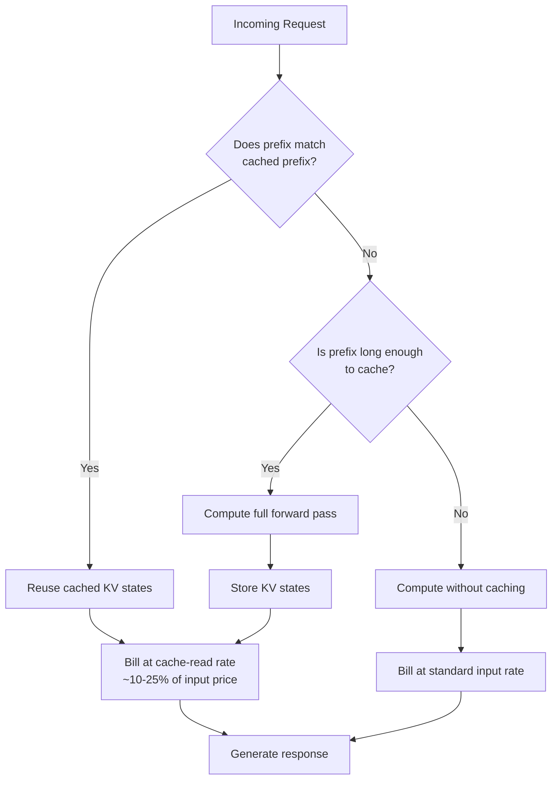

# Prompt Caching and Context Caching

## Learning Objectives

- Explain how KV-cache reuse works at the token level and why exact prefix matching — not semantic similarity — governs cache hits.
- Implement explicit prompt caching using Anthropic's `cache_control` markers and Google's `cachedContents` API, observing cache creation and cache read token counts in both providers' responses.
- Structure GTM enrichment prompts with static prefixes and dynamic suffixes to maximize cache hit rate across bulk processing.
- Compute cost and latency savings from cache hit ratios using provider-specific pricing multipliers.
- Diagnose cache misses caused by TTL expiry, prefix mutation, and insufficient prefix length in production pipelines.

## The Problem

Every LLM API call re-processes the entire prompt from scratch. When your enrichment pipeline sends 10,000 requests that each carry the same 2,000-token system prompt — extraction instructions, few-shot examples, output format specs — the provider tokenizes and encodes that prefix 10,000 separate times. You pay full input-token pricing for identical compute, 10,000 times over. At $3 per million input tokens on Claude Sonnet, a 2,000-token system prompt costs $0.006 per call, which is $60 across 10,000 calls for text that never changes.

The brute-force fix — shrinking the system prompt — hurts output quality. Few-shot examples and detailed formatting instructions exist because they measurably improve extraction accuracy. Removing them to save tokens trades a known cost for an unknown quality regression.

Prompt caching is the mechanism that breaks this trade-off. The provider retains the intermediate computation from a previous request's prefix. When a new request shares that exact prefix, the provider skips re-encoding it and charges a fraction of the normal rate. Anthropic shipped explicit `cache_control` markers in August 2024, Google shipped explicit context caching alongside Gemini 1.5, and OpenAI automated prefix detection later that year. All three frontier providers now offer it as a first-class billing feature.

## The Concept

During inference, a transformer model computes attention over every token against every previous token. To avoid recomputing these attention values on each generation step, the model stores them in a data structure called the KV cache — key and value tensors for each token's representation at each layer. This cache exists within a single generation: token 500 can look up tokens 1–499 without recomputing them.

Prompt caching extends this idea across requests. When request B's prefix is byte-for-byte identical to request A's prefix, the provider can persist A's KV cache and hand it to B. The provider skips the entire forward pass for those tokens. The constraint is exact prefix match: if token 47 differs by a single character, the cache is invalid from that position onward, because attention is sequential and each token's representation depends on everything before it.



Three provider approaches exist in 2026, each with different trade-offs:

| Provider | Mechanism | Cache read cost | Cache write cost | Default TTL | Min prefix |
|----------|-----------|----------------|-----------------|-------------|------------|
| Anthropic | Explicit `cache_control` markers on content blocks | 0.10× input | 1.25× input | 5 min (1 hr optional) | 1024 tokens (Sonnet/Opus), 2048 (Haiku) |
| Google Gemini | Explicit `cachedContents` resource creation | 0.25× input | 1.00× input (no premium, but you pay for TTL) | 1 hour (configurable) | 2048 tokens |
| OpenAI | Automatic prefix detection | 0.50× input | 1.00× input (no premium) | 5–10 min (managed automatically) | 1024 tokens |

Anthropic's explicit markers give you control over what gets cached — you place `cache_control: {"type": "ephemeral"}` on specific content blocks, and the provider caches everything from the start of the message up to that marker. Google's `cachedContents` takes a different approach: you create a cache object as a separate API call, receive a cache ID, then reference that ID in subsequent generation calls. OpenAI's automatic caching requires no code changes but offers less control — the provider detects reusable prefixes and applies discounts retroactively.

The critical variable is TTL. Anthropic's default ephemeral cache lasts 5 minutes. If your pipeline processes a batch, pauses for 6 minutes, then resumes, every cache entry has expired and you pay full write pricing again. The 1-hour TTL variant (announced in 2025) costs more per cached token but extends the window. Google lets you set explicit TTLs on cache objects — up to 24 hours on some models. OpenAI manages TTLs automatically and does not expose controls.

## Build It

### Example 1: Anthropic Explicit Cache Control

This example uses Anthropic's `cache_control` marker on a long system prompt. The first call creates the cache (observable via `cache_creation_input_tokens`); the second call reads it (observable via `cache_read_input_tokens`).

```python
import anthropic
import os

client = anthropic.Anthropic(api_key=os.environ.get("ANTHROPIC_API_KEY"))

SYSTEM_PROMPT = """You are an expert GTM operations analyst. Your job is to extract structured company intelligence from web page content.

For each company, extract the following fields:
- company_name: The legal or trading name
- industry: Primary industry classification
- employee_count_range: Estimated headcount (1-10, 11-50, 51-200, 201-1000, 1000+)
- funding_stage: Bootstrapped, Seed, Series A-C, Late Stage, Public, or Unknown
- tech_stack_signals: Any technologies mentioned on the page
- icp_fit_score: 0-100 confidence that this company matches a B2B SaaS ICP

Guidelines:
- Be conservative with ICP scores. Only score above 70 if you find explicit signals of B2B SaaS purchasing behavior.
- If information is missing, return null rather than guessing.
- tech_stack_signals should only include technologies you can verify from the page content.

Output format: JSON only, no markdown wrapping, no commentary.

Few-shot example 1:
Input: "Acme Corp is a Series B fintech company with 350 employees. They use Salesforce, HubSpot, and Snowflake."
Output: {"company_name": "Acme Corp", "industry": "Fintech", "employee_count_range": "201-1000", "funding_stage": "Series B", "tech_stack_signals": ["Salesforce", "HubSpot", "Snowflake"], "icp_fit_score": 78}

Few-shot example 2:
Input: "Local Bakery is a family-owned business with 8 employees, founded in 2015."
Output: {"company_name": "Local Bakery", "industry": "Food & Beverage", "employee_count_range": "1-10", "funding_stage": "Bootstrapped", "tech_stack_signals": [], "icp_fit_score": 5}

Few-shot example 3:
Input: "TechFlow Inc, a late-stage enterprise software company, 2000+ employees, uses AWS, Kubernetes, Datadog, and Stripe. Recently raised $150M Series D."
Output: {"company_name": "TechFlow Inc", "industry": "Enterprise Software", "employee_count_range": "1000+", "funding_stage": "Late Stage", "tech_stack_signals": ["AWS", "Kubernetes", "Datadog", "Stripe"], "icp_fit_score": 92}

Few-shot example 4:
Input: "StartupX is a seed-stage devtools company with 25 employees. Their stack includes React, Node.js, and MongoDB."
Output: {"company_name": "StartupX", "industry": "Developer Tools", "employee_count_range": "11-50", "funding_stage": "Seed", "tech_stack_signals": ["React", "Node.js", "MongoDB"], "icp_fit_score": 65}

Few-shot example 5:
Input: "Global Manufacturing Co, public company, 15000 employees, industrial equipment. Uses SAP and Oracle ERP."
Output: {"company_name": "Global Manufacturing Co", "industry": "Industrial Manufacturing", "employee_count_range": "1000+", "funding_stage": "Public", "tech_stack_signals": ["SAP", "Oracle ERP"], "icp_fit_score": 30}

Now process the company page content provided by the user.
""" * 3

def make_call(user_content, label):
    response = client.messages.create(
        model="claude-3-5-sonnet-20241022",
        max_tokens=500,
        system=[
            {
                "type": "text",
                "text": SYSTEM_PROMPT,
                "cache_control": {"type": "ephemeral"}
            }
        ],
        messages=[
            {"role": "user", "content": user_content}
        ]
    )

    print(f"\n--- {label} ---")
    print(f"Input tokens:        {response.usage.input_tokens}")
    print(f"Output tokens:       {response.usage.output_tokens}")
    print(f"Cache creation:      {response.usage.cache_creation_input_tokens}")
    print(f"Cache read:          {response.usage.cache_read_input_tokens}")
    print(f"Response:            {response.content[0].text[:200]}...")

make_call(
    "DataSync Pro is a Series A data infrastructure company with 85 employees. They use dbt, Airflow, and BigQuery.",
    "CALL 1 (expect cache creation)"
)

make_call(
    "CloudNative Labs is a Series B platform engineering company with 400 employees. They use Terraform, ArgoCD, and Prometheus.",
    "CALL 2 (expect cache read)"
)
```

Run this and observe the output. Call 1 shows `cache_creation_input_tokens` > 0 and `cache_read_input_tokens` = 0 — the cache was just created. Call 2 shows the inverse — `cache_read_input_tokens` matches the system prompt length, and `cache_creation_input_tokens` = 0. The user content (dynamic, uncached) appears in `input_tokens` on both calls.

At Anthropic's pricing ($3/M input on Sonnet), cache creation costs $3.75/M (1.25× premium) and cache reads cost $0.30/M (0.10× rate). On a 6,000-token cached system prompt sent 1,000 times, that's $3.75 for the initial write plus $1.80 for 999 reads — $5.55 total, versus $18.00 without caching. The break-even point is roughly the second call.

### Example 2: Google Gemini Cached Contents

Google's approach separates cache creation from usage. You create a cache object once, then reference it by ID.

```python
import os
import time
from google import genai

client = genai.Client(api_key=os.environ.get("GEMINI_API_KEY"))

COMPANY_INTEL_PROMPT = """You are an expert GTM operations analyst. Extract structured company intelligence from web page content.

For each company, extract:
- company_name
- industry
- employee_count_range (1-10, 11-50, 51-200, 201-1000, 1000+)
- funding_stage
- tech_stack_signals
- icp_fit_score (0-100)

Output: JSON only, no markdown wrapping.

Example:
Input: "Acme Corp is a Series B fintech with 350 employees, uses Salesforce and Snowflake."
Output: {"company_name": "Acme Corp", "industry": "Fintech", "employee_count_range": "201-1000", "funding_stage": "Series B", "tech_stack_signals": ["Salesforce", "Snowflake"], "icp_fit_score": 78}

Now process the page content from the user.
""" * 8

cache = client.caches.create(
    model="gemini-1.5-flash-002",
    config={
        "system_instruction": COMPANY_INTEL_PROMPT,
        "display_name": "company-intel-cache",
        "ttl": "3600s",
    }
)

print(f"Cache created: {cache.name}")
print(f"TTL: {cache.expire_time}")
print(f"Model: {cache.model}")

def generate_with_cache(user_content, label):
    response = client.models.generate_content(
        model=cache.model,
        contents=user_content,
        config={
            "cached_content": cache.name,
        }
    )

    usage = response.usage_metadata
    print(f"\n--- {label} ---")
    print(f"Prompt token count:       {usage.prompt_token_count}")
    print(f"Cached content tokens:    {usage.cached_content_token_count}")
    print(f"Candidates token count:   {usage.candidates_token_count}")
    print(f"Response: {response.text[:200]}...")

generate_with_cache(
    "Streamly is a seed-stage video infrastructure startup with 30 employees. Uses FFmpeg, AWS MediaLive, and Mux.",
    "CALL 1"
)

generate_with_cache(
    "InfraCloud is a Series C cloud cost optimization platform with 600 employees. Uses Kubernetes, Datadog, and CloudHealth.",
    "CALL 2"
)

client.caches.delete(name=cache.name)
print("\nCache deleted.")
```

The `cached_content_token_count` field shows how many tokens were served from cache. On Google, cached tokens are billed at 0.25× the standard rate (on Flash, that's $0.075/M vs $0.30/M for non-cached). There's no write premium, but you pay for TTL duration — the cache occupies storage on Google's side until it expires or you delete it.

## Use It

GTM enrichment pipelines are the highest-leverage application for prompt caching in a go-to-market stack. The dominant pattern is the enrichment waterfall: a pipeline that processes thousands of companies or contacts, running each through an LLM for extraction, classification, or scoring. The system prompt — extraction instructions, scoring rubric, few-shot examples — is identical across every row. Only the user content varies per record. This is the exact workload prompt caching was designed for.

In a Clay waterfall or bulk AI enrichment workflow processing 5,000 companies, a 3,000-token system prompt sent without caching costs $45 in input tokens alone (at Sonnet pricing). With caching, that drops to roughly $4.50 — the initial write at 1.25× plus 4,999 reads at 0.10×. The latency improvement is equally significant: the cached prefix skips forward-pass computation entirely, cutting first-token latency by 40–85% depending on prefix length relative to total prompt.

The prompt structure that maximizes cache hits follows a strict ordering rule: static content first, dynamic content last. Your system prompt goes first — extraction instructions, output format, scoring criteria. Few-shot examples go next — they're part of the system block and rarely change between requests. Dynamic data goes in the user message as the final block — company page HTML, contact metadata, the actual content to process. Any dynamic content placed before the static content breaks the prefix match from that point forward, invalidating the entire cache.

For Zone 2 (Enrich) workflows where this pattern is most prevalent — company enrichment, tech-stack detection, ICP scoring, reply classification — the cacheable prefix is your methodology. It encodes your definition of what constitutes a qualified company, how to extract funding signals, what a strong tech-stack indicator looks like. That methodology is your intellectual property as a GTM engineer; it should be large, detailed, and consistent across every request. The dynamic suffix is the raw input your methodology operates on. Prompt caching makes the economics of a rich, detailed system prompt viable at scale — without it, you'd be pressured to shrink the prompt to control costs, degrading extraction quality.

If you're running enrichment through Clay's native AI enrichment column, cache behavior is not consistently documented. Clay's AI column may or may not pass through cache control parameters to the underlying provider — this is not visible in the UI or API docs as of early 2025. [CITATION NEEDED — concept: Clay AI column prompt caching behavior]. For cost-critical enrichment at scale, calling the provider API directly (via Clay's HTTP enrichment column or a webhook to your own service) gives you full control over cache markers and observable cache hit metrics in the response.

## Ship It

Production caching has three failure modes you need to instrument for. First, TTL expiry: Anthropic's default 5-minute window is unforgiving for bursty workloads. If your enrichment pipeline processes a batch of 500 companies, then waits 7 minutes for a downstream API call before processing the next batch, every cache entry from the first batch has expired. The fix is either the 1-hour TTL variant or structuring your pipeline to maintain cache warmth — process batches in overlapping windows rather than discrete sequential batches.

Second, prefix mutation: any change to the system prompt invalidates the cache from the point of change onward. If you include a timestamp ("Current time: 2025-01-15 10:30:00") in your system prompt, the prefix changes on every call and caching never activates. The same applies to dynamic few-shot selection — if you retrieve different examples per request based on the input, the prefix varies. Keep the system prompt deterministic, or split it into a cached static portion and an uncached dynamic portion using multiple `cache_control` markers.

Third, insufficient prefix length: Anthropic requires a minimum of 1,024 tokens (2,048 on Haiku) before caching activates. Google requires 2,048. If your system prompt is 800 tokens, you get zero caching benefit regardless of how many times you send it. Verify your prefix length by checking the `cache_creation_input_tokens` field on the first call — if it's zero when you expected a cache write, your prefix is below the threshold.

Here's a monitoring utility that tracks cache health across a batch of calls:

```python
import json
from dataclasses import dataclass, field
from datetime import datetime, timezone

@dataclass
class CacheMetrics:
    calls: list = field(default_factory=list)

    def record(self, response_usage, label=""):
        self.calls.append({
            "timestamp": datetime.now(timezone.utc).isoformat(),
            "label": label,
            "input_tokens": getattr(response_usage, "input_tokens", 0),
            "output_tokens": getattr(response_usage, "output_tokens", 0),
            "cache_creation": getattr(response_usage, "cache_creation_input_tokens", 0),
            "cache_read": getattr(response_usage, "cache_read_input_tokens", 0),
        })

    def summary(self):
        total_input = sum(c["input_tokens"] for c in self.calls)
        total_output = sum(c["output_tokens"] for c in self.calls)
        total_cache_creation = sum(c["cache_creation"] for c in self.calls)
        total_cache_read = sum(c["cache_read"] for c in self.calls)

        calls_with_cache_write = sum(1 for c in self.calls if c["cache_creation"] > 0)
        calls_with_cache_read = sum(1 for c in self.calls if c["cache_read"] > 0)
        calls_with_neither = sum(1 for c in self.calls if c["cache_creation"] == 0 and c["cache_read"] == 0)

        cache_read_ratio = total_cache_read / (total_input + total_cache_read) if (total_input + total_cache_read) > 0 else 0

        uncached_cost = ((total_input + total_cache_read + total_cache_creation) / 1_000_000) * 3.00 + (total_output / 1_000_000) * 15.00

        cached_cost = ((total_cache_creation / 1_000_000) * 3.75
                      + (total_cache_read / 1_000_000) * 0.30
                      + (total_input / 1_000_000) * 3.00
                      + (total_output / 1_000_000) * 15.00)

        print("=== Cache Metrics Summary ===")
        print(f"Total calls:                {len(self.calls)}")
        print(f"Calls with cache write:     {calls_with_cache_write}")
        print(f"Calls with cache read:      {calls_with_cache_read}")
        print(f"Calls with no cache:        {calls_with_neither}")
        print(f"Cache read ratio:           {cache_read_ratio:.1%}")
        print(f"Uncached equivalent cost:   ${uncached_cost:.4f}")
        print(f"Actual cost (cached):       ${cached_cost:.4f}")
        print(f"Savings:                    ${uncached_cost - cached_cost:.4f} ({(1 - cached_cost/uncached_cost):.1%})")

        return {
            "cache_read_ratio": cache_read_ratio,
            "savings": uncached_cost - cached_cost,
            "calls_without_cache": calls_with_neither,
        }

metrics = CacheMetrics()

mock_usages = [
    type("Usage", (), {"input_tokens": 50, "output_tokens": 200, "cache_creation_input_tokens": 6000, "cache_read_input_tokens": 0})(),
    type("Usage", (), {"input_tokens": 55, "output_tokens": 180, "cache_creation_input_tokens": 0, "cache_read_input_tokens": 6000})(),
    type("Usage", (), {"input_tokens": 60, "output_tokens": 220, "cache_creation_input_tokens": 0, "cache_read_input_tokens": 6000})(),
    type("Usage", (), {"input_tokens": 45, "output_tokens": 190, "cache_creation_input_tokens": 0, "cache_read_input_tokens": 6000})(),
]

for i, usage in enumerate(mock_usages):
    metrics.record(usage, f"company_{i+1}")

metrics.summary()
```

For reply classification — a Zone 11 (Revenue Intelligence) application where you categorize inbound email replies as interested, not interested, out of office, or needs follow-up — prompt caching applies when you have a detailed rubric. A reply classification system prompt with category definitions, edge-case handling rules, and few-shot examples can easily hit 1,500–2,000 tokens. Across 10,000 inbound replies per day, caching turns a $30/day input cost into $3/day. The cached prefix encodes your classification methodology; the dynamic suffix is each individual reply text.

For long-running enrichment pipelines that exceed the TTL window, consider a cache-warming loop: a lightweight job that sends a minimal request with the cached system prompt every 4 minutes to keep the cache alive between batches. This costs one cache read per warmup call (~$0.0018 for 6,000 tokens at Sonnet's cache-read rate) but prevents full cache rewrites that cost 12.5× more per token.

## Exercises

**Easy — Threshold detection.** Take the Anthropic example above and progressively shorten `SYSTEM_PROMPT` (change the `* 3` multiplier to `* 2`, then `* 1`, then remove it). Run each version and observe when `cache_creation_input_tokens` drops to zero. Document the exact token count where caching stops activating. This is the minimum cacheable prefix for the model you're using.

**Medium — Cumulative cost tracking.** Modify the Anthropic example to loop 5 times with different company inputs but the same cached system prompt. After each call, accumulate the cost using cache-write pricing ($3.75/M) for creation tokens and cache-read pricing ($0.30/M) for read tokens. Print a running total showing actual spend vs. what uncached pricing ($3.00/M for all input) would have cost. Calculate the break-even point: how many calls until caching saves more than it costs?

**Hard — Prefix manager with automatic segmentation.** Build a Python class that accepts a prompt with multiple labeled segments (e.g., `[SYSTEM: instructions]`, `[FEW_SHOT: examples]`, `[DYNAMIC: company data]`). The class automatically places `cache_control` markers at the boundary between static and dynamic segments, sends 20 varied requests with different dynamic content, and reports cache hit rate. Then introduce a single-token change in the "static" segment and show how the hit rate collapses. The exercise should output a table: call number, cache_creation, cache_read, input_tokens — making the cache invalidation observable.

## Key Terms

- **KV Cache** — Key-value tensor storage from a transformer's forward pass, enabling attention computation without re-encoding previous tokens. Prompt caching persists this across requests.
- **Cache Hit** — A request whose prefix exactly matches a previously cached prefix. The provider serves the cached KV states at a discounted rate (0.10× on Anthropic, 0.25× on Google, 0.50× on OpenAI).
- **Cache Miss** — A request whose prefix does not match any cached prefix, either because it's new, mutated, or the previous cache expired. Full forward pass, standard pricing.
- **Cache Write Premium** — The surcharge providers apply when creating a new cache entry. Anthropic charges 1.25× the standard input rate on cache writes. Google and OpenAI charge 1.00× (no premium).
- **TTL (Time to Live)** — The duration a cached prefix persists on the provider's servers before eviction. Anthropic: 5 min default, 1 hr optional. Google: configurable, up to 24 hr. OpenAI: 5–10 min, managed automatically.
- **Exact Prefix Match** — The rule governing cache eligibility. Every token from position 0 to the cache boundary must be byte-for-byte identical to the cached prefix. Semantic similarity is irrelevant.
- **`cache_control`** — Anthropic's API parameter placed on content blocks to mark cache boundaries. Everything from the start of the message to the marker becomes eligible for caching.
- **`cachedContents`** — Google Gemini's API resource for explicit context caching. You create a cache object (separate API call), receive a cache ID, and reference it in subsequent generation calls.

## Sources

- Anthropic prompt caching pricing and API: Anthropic documentation, "Prompt Caching" (docs.anthropic.com/en/docs/build-with-claude/prompt-caching). Cache read at 0.10× input, write at 1.25× input, 5-minute and 1-hour TTLs, 1024-token minimum on Sonnet/Opus.
- Google Gemini context caching: Google AI documentation, "Context caching" (ai.google.dev/gemini-api/docs/caching). Cache read at 0.25× input, configurable TTL, 2048-token minimum.
- OpenAI automatic prompt caching: OpenAI platform documentation, "Prompt Caching" (platform.openai.com/docs/guides/prompt-caching). Automatic detection, 0.50× read rate, 1024-token minimum, 5–10 minute managed TTL.
- [CITATION NEEDED — concept: Clay AI column prompt caching behavior] — Whether Clay's native AI enrichment column passes cache control parameters to underlying LLM providers is not documented in Clay's public resources as of early 2025.
- GTM enrichment waterfall pattern and Zone 2 (Enrich) workflow structure: Saruggia, M. (2025). *The 80/20 GTM Engineer Handbook*. Growth Lead LLC. Zone 2 covers enrichment, company intelligence, and ICP scoring pipelines where bulk LLM processing is most prevalent.
- Reply classification as revenue intelligence: Zone 11 mapping — "Revenue Intelligence (Gong, reply classification)" from the GTM topic map, where reply classification serves as the eval feedback loop for outbound sequences.