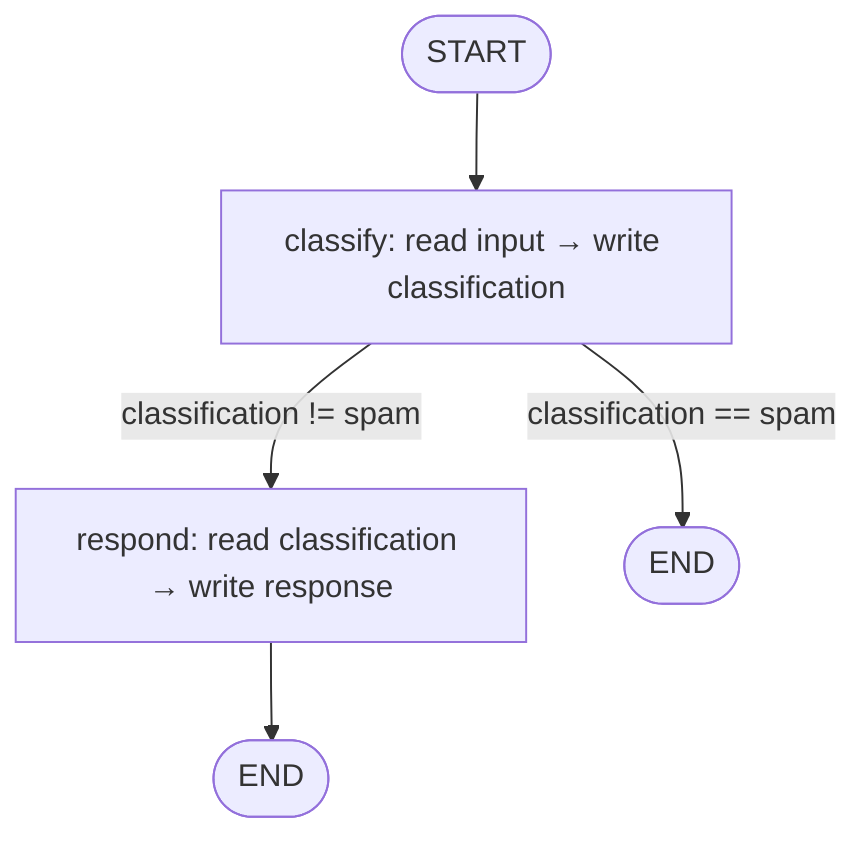

# LangGraph — State Machines for Agents

## Learning Objectives

1. Build a typed state graph with nodes, edges, and conditional routing in LangGraph
2. Compare cyclic state machines to acyclic DAGs and identify when each applies
3. Implement conditional edges that route execution based on state values
4. Trace state mutations through a multi-node graph and predict final state
5. Map an enrichment waterfall pattern onto a state machine with branching logic

## The Problem

You ship a function-calling agent. It works for three turns, then something goes sideways: the model calls a tool that returns a 500, the user changes their mind mid-task, or the agent decides to take an action that needs human sign-off. Your `while True:` loop has no hooks. You cannot pause it, you cannot rewind it, and you cannot branch into "what if the model had chosen differently." Once it passes a demo, the agent is a black box that either worked or did not — and if it failed, you have no idea where.

The root cause is that the agent's state is implicit. The message history lives in a list, the pending tool calls live in the model's last response, and the "what should I do next" logic lives in a prompt that the model interprets at runtime. Nothing in your code explicitly says "the agent is at step 3 of 5, it has tried tool A and tool B, and it is waiting for human approval." When an LLM call fails mid-sequence, you lose the conversation because there is no checkpoint to resume from.

This is where state machines enter. An agent is already a state machine — system prompt plus message history plus pending tool calls plus the next action. The fix is to make that state machine explicit: nodes for "the model thinks," "a tool runs," "a human approves," and edges for the conditional transitions between them. Once the graph is explicit, the harness gets checkpointing, interrupts, streaming, and time-travel for free, because every node knows where it is and what happened before.

## The Concept

A state machine differs from a directed acyclic graph (DAG) in one critical way: a state machine allows cycles. A DAG executes top-to-bottom, each step running exactly once, with no path that loops back. A state machine can revisit nodes — the agent thinks, calls a tool, evaluates the result, and loops back to "think" if the result was insufficient. That loop is the ReAct pattern, and it cannot be expressed in a DAG without unrolling it into a fixed number of iterations, which defeats the purpose.

LangGraph implements the state machine pattern with three components. First, a **typed state schema** — a `TypedDict` or Pydantic model that defines exactly what data flows through the graph. Every node reads from and writes to this schema. Second, **nodes** — Python functions that take the current state as input and return a partial state update (a dict containing only the keys they changed). Third, **edges** — routing rules that connect nodes. A fixed edge always goes from node A to node B. A conditional edge calls a routing function that inspects state and returns the name of the next node (or `END`). The execution model is straightforward: start at the entry node, traverse edges, merge state updates, repeat until you reach `END`.



The diagram above shows the three-component model: `classify` and `respond` are nodes (functions), the arrows are edges (fixed and conditional), and the labels on the conditional arrows show the state values the routing function inspects. State flows through the graph as a single typed dict, mutated at each node, persisted between steps by the checkpointer if you configure one.

The distinction between this and a linear pipeline (the DAG that tools like Zapier implement) is the conditional edge. A DAG says "do step 1, then step 2, then step 3." A state machine says "do step 1, then check a condition: if it passes, go to step 2; if not, go to step 3; if step 2's output is insufficient, loop back to step 1." That conditional routing — combined with the ability to persist state between steps — is what makes agents possible.

## Build It

Install LangGraph first. The core package is lightweight and does not pull in LangChain's full dependency tree:

```bash
pip install langgraph
```

Now build a minimal two-node graph. The first node classifies an input into one of three categories. The second node generates a response. A conditional edge after classification either routes to the response node or skips it entirely (for spam). No LLM calls, no tools — just the state machine skeleton, so you can see the mechanics without API keys.

```python
from langgraph.graph import StateGraph, END, START
from typing import TypedDict

class AgentState(TypedDict):
    input: str
    classification: str
    response: str

def classify_node(state: AgentState) -> dict:
    text = state["input"].lower()
    if "urgent" in text or "asap" in text:
        category = "priority"
    elif "buy now" in text or "free" in text or "click here" in text:
        category = "spam"
    else:
        category = "standard"
    return {"classification": category}

def respond_node(state: AgentState) -> dict:
    category = state["classification"]
    if category == "priority":
        return {"response": "Routed to priority queue. SLA: 1 hour."}
    return {"response": "Added to standard queue. SLA: 24 hours."}

def route_after_classify(state: AgentState) -> str:
    if state["classification"] == "spam":
        return END
    return "respond"

builder = StateGraph(AgentState)
builder.add_node("classify", classify_node)
builder.add_node("respond", respond_node)
builder.add_edge(START, "classify")
builder.add_conditional_edges("classify", route_after_classify)
builder.add_edge("respond", END)

graph = builder.compile()

inputs = [
    "Need help ASAP, production is down!",
    "What are your pricing tiers?",
    "BUY NOW! FREE iPhone click here!!!",
]

for user_input in inputs:
    print(f"Input: {user_input}")
    for event in graph.stream({"input": user_input}):
        for node_name, state_update in event.items():
            print(f"  [{node_name}] state update: {state_update}")
    print("---")
```

Expected output:

```
Input: Need help ASAP, production is down!
  [classify] state update: {'classification': 'priority'}
  [respond] state update: {'response': 'Routed to priority queue. SLA: 1 hour.'}
---
Input: What are your pricing tiers?
  [classify] state update: {'classification': 'standard'}
  [respond] state update: {'response': 'Added to standard queue. SLA: 24 hours.'}
---
Input: BUY NOW! FREE iPhone click here!!!
  [classify] state update: {'classification': 'spam'}
---
```

The third input never reaches the `respond` node. The conditional edge routes it directly to `END` after classification, and the stream output confirms this — only one state update appears instead of two. That is the state machine working: the routing function inspected state, made a decision, and the graph obeyed it. This same reply classification mechanism is the eval feedback loop in Zone 11 — revenue intelligence tools like Gong classify transcripts and replies, and the classification determines the next action in the workflow. [CITATION NEEDED — concept: reply classification as eval feedback loop in Zone 11]

## Use It

The Clay waterfall pattern is a state machine. [CITATION NEEDED — concept: Clay waterfall as state machine] In a multi-step enrichment sequence, each step is a node and each conditional check is an edge: fetch LinkedIn data, inspect the title, fetch company data if the title matches, inspect the company, write to the table if the company matches. Steps get skipped when conditions fail. The enrichment does not run linearly — it branches based on what each step finds.

Compare this to a linear Zapier-style DAG. A Zapier zap fetches LinkedIn, then fetches company, then writes to a table, in fixed order. If the LinkedIn title does not match your ICP, you have wasted a company enrichment API call. The waterfall pattern — and the state machine that implements it — skips that call entirely because the conditional edge short-circuits to `END`.

Here is the enrichment waterfall implemented as a LangGraph state machine with mock data