# Agent Framework Tradeoffs — LangGraph vs CrewAI vs AutoGen vs Agno

## Learning Objectives

1. Compare how LangGraph, CrewAI, AutoGen, and Agno resolve control flow, manage state, and define agent identity.
2. Implement the same three-step ICP-scoring pipeline in each framework's architectural pattern.
3. Diagnose which framework abstraction matches a given production workload based on its failure modes.
4. Evaluate where state lives in each framework and predict what breaks during retry, checkpoint, and debugging.

## The Problem

You have a task that needs more than one LLM call. A research workflow that plans, searches, summarizes, and cites. A code-review pipeline that parses a diff, critiques, patches, and validates. A multi-turn assistant that books flights, writes emails, and files expense reports. You pick a framework based on a README example that looks like ten lines of code and ships in an afternoon.

Three days later, the framework's abstractions leak. CrewAI gives you roles but fights you when the "researcher" needs to hand a structured plan to the "writer" — the task handoff assumes free-text context, not a typed schema. AutoGen gives you chat between agents but has no first-class state object, so your checkpoint is a pickle of a conversation log that you cannot partially replay. LangGraph gives you a state graph but forces you to name every transition before you know what the agent will actually do in edge cases. Agno gives you a single-agent abstraction that handles tool-call loops well but provides no built-in primitive for fanning out to concurrent workers.

The rebuild is inevitable because the framework you chose encoded assumptions about control flow, state, and agent identity that did not match your actual workload. This lesson maps those assumptions explicitly. The goal is not to crown a winner — it is to give you the vocabulary to pick based on mechanism, not demo aesthetics.

In a GTM context, this shows up as an ICP-scoring pipeline: research a prospect company, score its fit against your ideal customer profile, and draft a personalized outreach summary. That pipeline is three steps with structured data flowing between them, which is exactly the shape where framework tradeoffs become visible. The same pipeline also functions as an evaluation harness — you can A/B test outreach variants against the ICP score to measure which messages correlate with replies, turning the agent system into a feedback loop for sequence optimization [CITATION NEEDED — concept: evals as A/B testing for GTM sequences, Zone 11 mapping].

## The Concept

Four frameworks, four architectural bets. Each one encodes a different answer to three questions: where does state live, who decides what runs next, and what is an agent?

**LangGraph** encodes a finite-state machine. You define a `StateGraph` with a typed state schema, add nodes (functions that transform state), and draw edges (including conditional edges that branch on state values). State lives in the graph object, which means you can checkpoint it, replay it, and inspect it at any node. The developer explicitly defines every transition. This is the right choice when your workflow has known states and you need human-in-the-loop interrupts, time-travel debugging, or deterministic retry from a specific checkpoint. The cost is verbosity — you name every edge before the agent runs, including edges for failure paths you have not encountered yet.

**CrewAI** encodes roles and tasks. You define `Agent` objects with a role, goal, and backstory, then assign them `Task` objects with descriptions and expected outputs. The framework resolves execution order based on task dependencies and agent assignments. State lives in task outputs — each task receives the output of previous tasks as context. This is convenient when your workflow maps cleanly to "a researcher researches, a writer writes" but becomes friction when the handoff between roles requires structured data rather than free-text summaries. The framework decides what runs next, which means you trade control for convenience and accept that the execution order may not match your mental model.

**AutoGen** encodes conversation loops. You define `ConversableAgent` objects that exchange messages, and a `GroupChat` manager routes messages between them. State lives in the conversation history — a list of messages that grows as agents reply. This is the right abstraction when the work genuinely requires back-and-forth reasoning between specialist agents (a coder and a reviewer iterating on a patch). The cost is that conversation history is an unstructured state representation. You cannot easily checkpoint a specific reasoning step, partially replay a conversation, or attribute cost to a specific sub-task without parsing the message log.

**Agno** encodes a thin agent abstraction optimized for speed of instantiation. You define an `Agent` class with instructions and tools, and the framework runs a linear tool-call loop: the model decides to call a tool, the tool executes, the result returns to the model, and the loop continues until the model produces a final answer. State lives in agent memory (the tool-call history for the current run). This is fast and lightweight — agent instantiation takes milliseconds, which matters when you are spawning thousands of agents for parallel data processing. The cost is that there is no built-in primitive for multi-agent coordination. If you need three agents to collaborate, you build that coordination layer yourself.

```mermaid
graph TB
    subgraph LangGraph["LangGraph: Explicit State Machine"]
        LG_INIT["state: {company, score, summary}"] --> LG_R["Node: research"]
        LG_R --> LG_COND{"conditional edge<br/>score >= 50?"}
        LG_COND -->|"yes"| LG_S["Node: score"]
        LG_S --> LG_SUM["Node: summarize"]
        LG_COND -->|"no"| LG_SKIP["Node: discard"]
    end

    subgraph CrewAI["CrewAI: Role + Task Resolution"]
        CR_A1["Agent: Researcher"] --> CR_T1["Task: research"]
        CR_T1 -->|"output as context"| CR_T2["Task: score"]
        CR_A2["Agent: Analyst"] --> CR_T2
        CR_T2 -->|"output as context"| CR_T3["Task: summarize"]
        CR_A3["Agent: Writer"] --> CR_T3
    end

    subgraph AutoGen["AutoGen: Conversation Loop"]
        AG_MGR["GroupChat Manager"] -->|"route"| AG_R["Researcher Agent"]
        AG_R -->|"reply"| AG_MGR
        AG_MGR -->|"route"| AG_A["Analyst Agent"]
        AG_A -->|"reply"| AG_MGR
        AG_MGR -->|"route"| AG_W["Writer Agent"]
        AG_W -->|"reply"| AG_MGR
    end

    subgraph Agno["Agno: Linear Tool-Call Loop"]
                AN_AGENT["Agent"] -->|"call"| AN_T1["tool: research"]
        AN_T1 -->|"result"| AN_AGENT
        AN_AGENT -->|"call"| AN_T2["tool: score"]
        AN_T2 -->|"result"| AN_AGENT
        AN_AGENT -->|"call"| AN_T3["tool: summarize"]
    end
```



The tradeoff axis runs from **explicit control** (LangGraph) through **declarative convenience** (CrewAI) and **conversational flexibility** (AutoGen) to **minimal overhead** (Agno). Each position on that axis determines what you can observe (structured state vs. message log vs. tool-call history), what you can retry (a specific node vs. a task vs. a conversation turn vs. a tool call), and what breaks in production (undeclared edges vs. implicit task ordering vs. unbounded conversation length vs. no multi-agent primitive).

For a GTM ICP-scoring pipeline, the framework choice has a direct evaluation consequence. If you treat the pipeline as an eval — scoring prospect fit and drafting outreach that you test against reply rates — you need to isolate which step failed when a message underperforms. LangGraph lets you checkpoint after the scoring node and swap only the summarization node. CrewAI requires you to rerun the whole crew because task outputs are not independently addressable. AutoGen requires you to parse the conversation log to find where the scoring went wrong. Agno, running as a single agent with tools, lets you inspect the tool-call log but provides no structure for comparing variants across agents [CITATION NEEDED — concept: reply classification as eval feedback loop, Zone 11].

## Build It

The same task in all four patterns: research a company, score its ICP fit, draft a one-paragraph summary. Three steps, one data pipeline. The implementations below are pure-Python mocks of each framework's architectural pattern — no API keys, no pip installs, just the control flow each framework encodes.

First, the shared task definition and simulated step logic:

```python
import json

task_input = {"company": "Acme Corp"}

def research(company):
    return {"company": company, "employees": 450, "industry": "fintech", "funding": "Series B"}

def score(research_data):
    base = 50
    if research_data["industry"] == "fintech":
        base += 20
    if research_data["employees"] > 200:
        base += 12
    return {"icp_score": base, "reasons": ["fintech industry", "450 employees"]}

def summarize(research_data, score_data):
    return f"{research_data['company']} is a {research_data['employees']}-person {research_data['industry']} company at {research_data['funding']}. ICP fit: {score_data['icp_score']}/100."

print("=== Plain Pipeline ===")
r = research(task_input["company"])
s = score(r)
m = summarize(r, s)
print(m)
```

Now the same pipeline in each framework's pattern. Each mock isolates the architectural decision — where state lives, who decides ordering, what an agent is.

```python
print("\n=== LangGraph Pattern: Explicit State Graph ===")

class StateGraph:
    def __init__(self):
        self.nodes = {}
        self.edges = {}
        self.conditionals = {}

    def add_node(self, name, fn):
        self.nodes[name] = fn

    def add_edge(self, source, target):
        self.edges[source] = ("direct", target)

    def add_conditional_edges(self, source, condition_fn, mapping):
        self.edges[source] = ("conditional", condition_fn, mapping)

    def compile(self):
        return self

    def invoke(self, initial_state):
        state = dict(initial_state)
        current = "entry"
        path = []
        while current != "end":
            if current == "entry":
                current = self.edges["entry"][1]
                continue
            if current in self.nodes:
                result = self.nodes[current](state)
                state.update(result)
                path.append(current)
            if current in self.edges:
                edge = self.edges[current]
                if edge[0] == "direct":
                    current = edge[1]
                elif edge[0] == "conditional":
                    branch = edge[1](state)
                    current = edge[2].get(branch, "end")
            else:
                current = "end"
        return {"state": state, "path": path}

graph = StateGraph()
graph.add_node("research", lambda s: {"research": research(s["company"])})
graph.add_node("score", lambda s: {"score": score(s["research"])})
graph.add_node("summarize", lambda s: {"summary": summarize(s["research"], s["score"])})
graph.add_node("discard", lambda s: {"summary": "ICP score too low. Skipping."})
graph.add_edge("entry", "research")
graph.add_edge("research", "score")
graph.add_conditional_edges(
    "score",
    lambda s: "summarize" if s["score"]["icp_score"] >= 50 else "discard",
    {"summarize": "summarize", "discard": "discard"}
)
graph.add_edge("summarize", "end")
graph.add_edge("discard", "end")

result = graph.invoke(task_input)
print(f"Path taken: {result['path']}")
print(f"Final state keys: {list(result['state'].keys())}")
print(f"Summary: {result['state']['summary']}")
print("State is fully typed and checkpointable at every node.")
```

```python
print("\n=== CrewAI Pattern: Roles + Tasks ===")

class CrewAgent:
    def __init__(self, role, goal):
        self.role = role
        self.goal = goal

class CrewTask:
    def __init__(self, description, agent, expected_output):
        self.description = description
        self.agent = agent
        self.expected_output = expected_output
        self.output = None

class Crew:
    def __init__(self, agents, tasks):
        self.agents = agents
        self.tasks = tasks

    def kickoff(self, inputs):
        context = dict(inputs)
        for task in self.tasks:
            role = task.agent.role
            if role == "Researcher":
                task.output = research(context.get("company", ""))
            elif role == "Analyst":
                task.output = score(context.get("research") or self.tasks[0].output)
            elif role == "Writer":
                r = self.tasks[0].output
                s = self.tasks[1].output
                task.output = summarize(r, s)
            context[task.description] = task.output
        return {"final_output": self.tasks[-1].output}

researcher = CrewAgent("Researcher", "Find company data")
analyst = CrewAgent("Analyst", "Score ICP fit")
writer = CrewAgent("Writer", "Draft summary")

t1 = CrewTask("research", researcher, "dict: company data")
t2 = CrewTask("score", analyst, "dict: icp score")
t3 = CrewTask("summarize", writer, "str: summary")

crew = Crew([researcher, analyst, writer], [t1, t2, t3])
result = crew.kickoff(task_input)
print(f"Agent roles: {[a.role for a in crew.agents]}")
print(f"Task outputs: {[type(t.output).__name__ for t in crew.tasks]}")
print(f"Summary: {result['final_output']}")
print("Framework resolved order. State lives in task outputs, not a shared schema.")
```

```python
print("\n=== AutoGen Pattern: Conversation Loop ===")

class ConversableAgent:
    def __init__(self, name, system_msg):
        self.name = name
        self.system_msg = system_msg
        self.messages = []

    def generate_reply(self, messages_so_far):
        last_msg = messages_so_far[-1]["content"] if messages_so_far else ""
        if self.name == "Researcher":
            data = research(task_input["company"])
            return f"RESEARCH_RESULT: {json.dumps(data)}"
        elif self.name == "Analyst":
            for m in messages_so_far:
                if "RESEARCH_RESULT:" in m["content"]:
                    data = json.loads(m["content"].split("RESEARCH_RESULT: ")[1])
                    s = score(data)
                    return f"SCORE_RESULT: {json.dumps(s)}"
        elif self.name == "Writer":
            r_data = None
            s_data = None
            for m in messages_so_far:
                if "RESEARCH_RESULT:" in m["content"]:
                    r_data = json.loads(m["content"].split("RESEARCH_RESULT: ")[1])
                if "SCORE_RESULT:" in m["content"]:
                    s_data = json.loads(m["content"].split("SCORE_RESULT: ")[1])
            if r_data and s_data:
                return summarize(r_data, s_data)
        return "TERMINATE"

class GroupChat:
    def __init__(self, agents):
        self.agents = agents
        self.messages = []

    def run(self, initial_message):
        self.messages.append({"sender": "User", "content": initial_message})
        for i in range(len(self.agents)):
            agent = self.agents[i]
            reply = agent.generate_reply(self.messages)
            self.messages.append({"sender": agent.name, "content": reply})
            if reply == "TERMINATE":
                break
        return self.messages

agents = [
    ConversableAgent("Researcher", "You research companies."),
    ConversableAgent("Analyst", "You score ICP fit."),
    ConversableAgent("Writer", "You write summaries."),
]
chat = GroupChat(agents)
messages = chat.run(f"Research {task_input['company']}, score it, summarize.")
print(f"Message count: {len(messages)}")
for m in messages:
    print(f"  {m['sender']}: {m['content'][:80]}...")
print("State lives in the message log. No typed schema between agents.")
```

```python
print("\n=== Agno Pattern: Linear Tool-Call Loop ===")

class AgnoAgent:
    def __init__(self, instructions, tools):
        self.instructions = instructions
        self.tools = {t.__name__: t for t in tools}
        self.tool_call_log = []

    def run(self, user_input):
        tool_sequence = ["research", "score", "summarize"]
        results = {}
        results["company"] = user_input
        for tool_name in tool_sequence:
            if tool_name == "research":
                results.update(self.tools[tool_name](results["company"]))
            elif tool_name == "score":
                results.update(self.tools[tool_name](results))
            elif tool_name == "summarize":
                results["output"] = self.tools[tool_name](results)
            self.tool_call_log.append({
                "tool": tool_name,
                "input_keys": [k for k in results.keys()],
            })
        return results["output"]

agent = AgnoAgent(
    "Research a company, score ICP, summarize.",
    [research, score, summarize]
)
output = agent.run(task_input["company"])
print(f"Tool call log: {[t['tool'] for t in agent.tool_call_log]}")
print(f"Output: {output}")
print("Single agent, linear tool calls. No multi-agent coordination primitive.")
```

Run all four blocks in sequence and you see the same output produced through four different control flow mechanisms. The differences that matter are not in the output — they are in what you can observe, retry, and restructure.

## Use It

The mechanism that determines whether your ICP pipeline is debuggable in production is **per-step state isolation**: whether each pipeline step (research, score, summarize) emits an independently addressable, typed output that you can inspect, replay, and evaluate without rerunning the whole chain. This is the GTM pattern behind Cluster 1.2 — TAM Refinement & ICP Scoring — and it is the same property that determines whether you can build an eval harness when an AE reports "the scores are wrong."

```python
print("=== GTM ICP Eval: Per-Step State Isolation ===")

cases = [
    ("Acme Corp", "fintech", 450, (70, 90)),
    ("Globex Inc", "retail", 50, (40, 60)),
    ("Initech", "fintech", 1200, (80, 100)),
]

for company, exp_ind, exp_emp, score_range in cases:
    r_data = research(company)
    r_ok = r_data["industry"] == exp_ind and r_data["employees"] == exp_emp
    s_data = score(r_data)
    s_ok = score_range[0] <= s_data["icp_score"] <= score_range[1]
    m_text = summarize(r_data, s_data)
    m_ok = str(s_data["icp_score"]) in m_text and company in m_text
    print(f"{company}: research={'PASS' if r_ok else 'FAIL'} "
          f"score={'PASS' if s_ok else 'FAIL'}({s_data['icp_score']}) "
          f"summary={'PASS' if m_ok else 'FAIL'}")

print("\nTriage map:")
print("  research FAIL -> enrichment source broken")
print("  score FAIL    -> scoring rubric broken")
print("  summary FAIL  -> LLM prompt broken")
print("  all PASS      -> pipeline healthy; check outreach channel")
```

When the eval reports `research=FAIL` for Globex, you fix the enrichment provider — you do not touch the scoring logic or the summary prompt. That surgical triage is only possible because each step's output is isolated. In LangGraph, you load the checkpoint after the research node and inspect the exact dict that fed into scoring. In CrewAI, `task1.output` exists but is not typed, so you read task descriptions to remember what each field means. In AutoGen, you grep the message log for `RESEARCH_RESULT:` and hope the agent formatted it. In Agno, the tool-call log gives you tool names but the intermediate state is a flat dict mutated in place — you see what ran, not what it produced in a structured form.

The eval harness is the GTM feedback loop. Run it nightly against your prospect list. When reply rates drop, run the eval first — if `score=FAIL` spiked overnight, your enrichment provider changed its industry taxonomy and your rubric needs updating. You found the root cause in seconds because the framework gave you addressable state. If you had picked AutoGen, you would be parsing message logs at 2 AM.

## Exercises

1. **Add a failing case and diagnose the break.** Add a fourth eval case: `("Hooli", "adtech", 5000, (70, 100))`. Run the harness. The `score` step will `FAIL` because adtech gets no bonus in the `score` function — the base is 50, plus 12 for employees > 200, totaling 62, which is below 70. Modify the `score` function to add a `+15` bonus for companies with more than 2,000 employees. Re-run. Which step's output changed? Which didn't? This is the per-step isolation property: you changed one function and the eval tells you exactly which downstream steps are affected.

2. **Convert the AutoGen mock to emit typed state.** The AutoGen pattern serializes everything through free-text messages tagged with `RESEARCH_RESULT:` and `SCORE_RESULT:`. Rewrite `ConversableAgent.generate_reply` so that each agent appends a JSON-serializable dict to a shared `state` object instead of embedding data in message strings. Then rewrite the Writer agent to read from that shared state rather than parsing message content. What did you just build? (Answer: you reinvented LangGraph's state graph inside AutoGen's conversation loop — which is the architectural friction the lesson describes.) Now do the same for the Agno mock: add a second agent and a routing mechanism so the two agents can hand work to each other. How many lines of coordination code did you write?

## Key Terms

- **State Graph (LangGraph):** A directed graph where each node is a state-transformation function and each edge is an explicit, developer-declared transition. Conditional edges branch on state values. State is a typed schema shared across all nodes.
- **Task Resolution (CrewAI):** The framework's mechanism for determining execution order from task dependencies and agent role assignments rather than explicit developer-declared edges. State lives in task outputs passed as context to downstream tasks.
- **Conversable Agent (AutoGen):** An agent that participates in a message-passing loop managed by a GroupChat router. State lives in the conversation history — an append-only list of messages with no typed schema between agents.
- **Tool-Call Loop (Agno):** A linear execution pattern where a single agent calls tools, receives results, and repeats until producing a final answer. No built-in primitive for multi-agent coordination or fan-out.
- **Checkpoint:** A serializable snapshot of pipeline state at a specific node or step, enabling retry, replay, and time-travel debugging from a known-good state. Only possible when state is a typed, addressable object rather than an unstructured log.
- **Per-Step State Isolation:** The property that each pipeline step emits an independently addressable, typed output. Determines whether you can build a targeted eval per step or must rerun the entire pipeline to debug a single failure.

## Sources

- LangGraph — StateGraph API, conditional edges, checkpointing: https://langchain-ai.github.io/langgraph/concepts/low_level/
- CrewAI — Agent, Task, Crew, and kickoff documentation: https://docs.crewai.com/concepts/crews
- AutoGen — ConversableAgent, GroupChat, and termination conditions: https://microsoft.github.io/autogen/0.2/docs/topics/patterns/group-chat/
- Agno — Agent abstraction, tools, and session memory: https://docs.agno.com/agents/introduction
- [CITATION NEEDED — concept: evals as A/B testing for GTM sequences, Zone 11 mapping]
- [CITATION NEEDED — concept: reply classification as eval feedback loop, Zone 11]