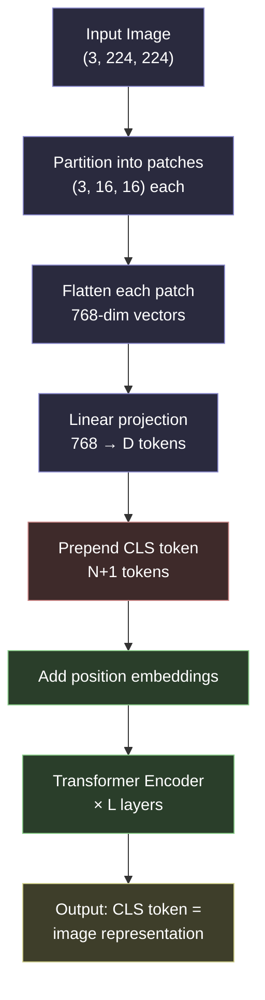

# Vision Transformers and the Patch-Token Primitive

## Learning Objectives

- Implement the full patch-token pipeline: partition an image into a grid, flatten each patch, and apply a learned linear projection to produce a token sequence.
- Compute sequence length, parameter count, and attention cost as a function of patch size, image resolution, and hidden dimension.
- Compare the inductive biases of a Vision Transformer against a CNN and explain why ViT requires more pre-training data to reach parity.
- Select between CLS pooling, mean pooling, and register tokens for a downstream embedding or classification task.
- Connect patch-token embeddings to GTM image-enrichment pipelines: logo similarity, landing-page classification, and firmographic inference from visual assets.

## The Problem

Transformers operate on sequences of vectors. Text arrives that way naturally — a sentence is already a list of tokens. An image is not. It is a three-dimensional tensor of shape `(channels, height, width)` — typically `(3, 224, 224)` — and the spatial relationships between pixels are what carry meaning. If you naively flatten the entire image into a sequence, one pixel per token, a 224×224 RGB image becomes 150,528 tokens. Self-attention is quadratic in sequence length, so the attention matrix alone would be 150,528² — roughly 22 billion entries. That is a non-starter even on modern hardware.

Pre-2020 solutions sidestepped this by bolting a convolutional backbone (ResNet, EfficientNet) onto the front of a transformer. The CNN downsampled the image into a 7×7 grid of 2048-dimensional feature vectors, and those 49 vectors became the token sequence. This worked, but it inherited the CNN's inductive biases — local receptive fields, translation equivariance, a fixed hierarchy of spatial scales — and it meant the transformer never saw raw pixels. The transformer was a head sitting on top of a CNN neck, not a model that processed images natively.

The Vision Transformer paper (Dosovitskiy et al., 2020) removed the CNN entirely. The question it answered was simple: can we tokenize an image the same way we tokenize a sentence, feed those tokens to a stock transformer encoder, and get competitive results? The answer was yes — provided you have enough data. The mechanism that makes it possible is the patch-token primitive, and it is the foundation of every multimodal model in production today: GPT-4V, Gemini, SigLIP 2, DINOv2, and Claude's vision stack all begin by cutting an image into patches and projecting them into token space.

## The Concept

The patch embedding pipeline has six steps. Each transforms the image representation without changing the information content — only its shape and dimensionality.

**Step 1: Partition.** An image of shape `(C, H, W)` is divided into a grid of non-overlapping patches, each of size `P × P`. This produces `N = (H × W) / P²` patches. For a 224×224 image with 16×16 patches, that is `(224 × 224) / 256 = 196` patches. The patch size is the single most important hyperparameter: it controls the trade-off between spatial resolution and computational cost.

**Step 2: Flatten.** Each patch — a tensor of shape `(C, P, P)` — is reshaped into a single vector of length `C × P²`. For RGB patches of 16×16, that is `3 × 16 × 16 = 768` values per patch.

**Step 3: Linear project.** A learned projection matrix of shape `(C × P², D)` maps each flattened patch to a token of dimension `D`, the transformer's hidden size. This is mathematically identical to a word embedding lookup — the only difference is that word embeddings map a discrete integer index to a vector, while patch embeddings map a continuous vector to another continuous vector. In PyTorch, a single `nn.Linear(C * P², D)` or a `nn.Conv2d` with kernel and stride equal to `P` accomplishes both flattening and projection in one operation.

**Step 4: Prepend CLS.** A learned `<CLS>` token — a single vector of dimension `D` that is a model parameter — is prepended to the sequence. After the transformer encoder processes the full sequence, the output at position 0 (the CLS position) serves as the image-level representation. This is the token you would pool for classification or retrieval.

**Step 5: Add position.** Learned position embeddings of shape `(N + 1, D)` are added to every token. Without these, the transformer has no spatial information whatsoever — attention is permutation-equivariant, meaning it produces the same output regardless of token order. The position embeddings encode "this patch came from row 3, column 5 of the grid," which is essential for the model to reason about spatial layout.

**Step 6: Encode.** The resulting sequence of `N + 1` tokens passes through a standard transformer encoder — multi-head self-attention followed by feed-forward layers, repeated `L` times.



The key architectural difference from CNNs is the absence of inductive bias. A convolutional layer hardcodes two assumptions: locality (each filter looks at a small neighborhood) and translation equivariance (the same filter applies everywhere). These are built into the math of convolution. A transformer has neither — it must learn that adjacent patches are related, that horizontal stripes mean something different from vertical ones, and that an object in the top-left is the same object in the bottom-right. This is why ViT needs more pre-training data than ResNet to reach parity: the CNN gets spatial reasoning for free, while the ViT has to learn it from scratch. The trade-off is that ViT scales better — given enough data, the absence of hardcoded bias becomes an advantage, because the model is free to learn patterns that a CNN's architecture would prevent it from representing.

The other critical parameter is patch size `P`. It controls sequence length: halving `P` quadruples `N`, which quadruples attention cost (which is `O(N²)`). A ViT processing 224×224 images at patch size 16 produces 196 tokens; at patch size 8, it produces 784. The former is fast and coarse; the latter is slow and fine-grained. Modern production systems like SigLIP 2 and DINOv2 use dynamic patch sizes — coarser patches for thumbnails, finer patches for high-resolution inputs — to manage this trade-off at inference time.

## Build It

Let us implement the patch embedding pipeline from scratch. The goal is to see every shape transformation and confirm that the output is a token sequence the transformer encoder can consume.

```python
import torch
import torch.nn as nn
import math

torch.manual_seed(42)

image_channels = 3
image_height = 224
image_width = 224
patch_size = 16
hidden_dim = 768

num_patches = (image_height // patch_size) * (image_width // patch_size)
patch_dim = image_channels * patch_size * patch_size

print(f"Image shape:           ({image_channels}, {image_height}, {image_width})")
print(f"Patch size:            {patch_size} x {patch_size}")
print(f"Number of patches:     {num_patches}")
print(f"Flattened patch dim:   {patch_dim}")
print(f"Hidden dim:            {hidden_dim}")
print()

image = torch.randn(image_channels, image_height, image_width)
print(f"Input image tensor:    {image.shape}")

conv_proj = nn.Conv2d(
    image_channels, hidden_dim,
    kernel_size=patch_size, stride=patch_size
)

image_batched = image.unsqueeze(0)
print(f"Batched image:         {image_batched.shape}")

patch_embeddings = conv_proj(image_batched)
print(f"After conv projection: {patch_embeddings.shape}")

flat_tokens = patch_embeddings.flatten(2).transpose(1, 2)
print(f"Flattened tokens:      {flat_tokens.shape}")

cls_token = nn.Parameter(torch.randn(1, 1, hidden_dim))
cls_tokens = cls_token.expand(flat_tokens.shape[0], -1, -1)
tokens_with_cls = torch.cat([cls_tokens, flat_tokens], dim=1)
print(f"With CLS token:        {tokens_with_cls.shape}")

position_embeddings = nn.Parameter(
    torch.randn(1, num_patches + 1, hidden_dim)
)
final_tokens = tokens_with_cls + position_embeddings
print(f"After pos embedding:   {final_tokens.shape}")

num_parameters = sum(p.numel() for p in conv_proj.parameters())
cls_params = cls_token.numel()
pos_params = position_embeddings.numel()

print()
print(f"Conv projection params:  {num_parameters:,}")
print(f"CLS token params:        {cls_params:,}")
print(f"Position embed params:   {pos_params:,}")
print(f"Total embed params:      {num_parameters + cls_params + pos_params:,}")
```

Run this and you will see the full shape pipeline: the image enters as `(1, 3, 224, 224)`, the convolution produces `(1, 768, 14, 14)`, flattening gives `(1, 196, 768)`, prepending CLS yields `(1, 197, 768)`, and the final sequence ready for the encoder is `(1, 197, 768)`. That sequence is indistinguishable from a text token sequence — same shape, same operations, same transformer.

Now let us compute the attention cost and compare patch sizes to see why this parameter matters so much:

```python
import torch
import torch.nn.functional as F

def attention_cost(seq_len, hidden_dim, batch_size=1):
    qkv = 3 * batch_size * seq_len * hidden_dim
    attn_matrix = batch_size * seq_len * seq_len
    softmax = batch_size * seq_len * seq_len
    output = batch_size * seq_len * seq_len * hidden_dim
    return qkv + attn_matrix + softmax + output

configs = [
    ("ViT-B/16  224px", 16, 224, 768),
    ("ViT-B/8   224px",  8, 224, 768),
    ("ViT-L/14  224px", 14, 224, 1024),
    ("ViT-L/14  336px", 14, 336, 1024),
    ("ViT-H/14  518px", 14, 518, 1280),
]

print(f"{'Config':<20} {'Patches':>8} {'Seq Len':>8} {'Attn FLOPs':>14}")
print("-" * 54)

for name, patch_size, resolution, dim in configs:
    num_patches = (resolution // patch_size) ** 2
    seq_len = num_patches + 1
    flops = attention_cost(seq_len, dim)
    print(f"{name:<20} {num_patches:>8} {seq_len:>8} {flops:>14,}")
```

The output makes the scaling visible. ViT-B/16 at 224px processes 197 tokens; ViT-B/8 at the same resolution processes 785 — four times the tokens, sixteen times the attention matrix. ViT-H/14 at 518px (what DINOv2 uses) processes 1,369 tokens. Every production vision model makes this trade-off explicitly.

## Use It

Patch-token embeddings from a Vision Transformer produce fixed-dimensional vector representations of images. In a GTM enrichment pipeline, the most direct application is logo similarity scoring. Every company has a logo — scraped from their website, pulled from a CRM, or extracted from a favicon. Two companies in the same industry often share visual DNA: SaaS startups use similar color palettes, fintech logos lean toward blues and greens, healthcare brands use cross or heart motifs. A ViT embedding of a logo produces a 768-dimensional vector (in ViT-B) that captures these visual characteristics, and cosine similarity between two logo embeddings gives a measurable score for "how visually similar are these two brands."

This feeds directly into firmographic inference. If you have a database of 10,000 companies with known industry labels and their logo embeddings, a new prospect's logo can be embedded and compared via k-nearest-neighbors in vector space. The nearest neighbors' industry labels become a prior for the prospect's likely industry. This is not a replacement for firmographic APIs like Clearbit or Apollo — it is a supplementary signal that works when traditional firmographics fail (early-stage startups, companies with no Crunchbase presence, domains that resolve to a holding page). The patch-token primitive is what makes the embedding possible: without converting the logo image into a token sequence, no transformer can process it.

The same mechanism applies to landing page classification. A full-page screenshot of a company's homepage becomes a ViT embedding. Pages with pricing tables, demo request forms, or specific layout patterns cluster together in embedding space. A GTM team can classify landing pages into "e-commerce," "lead-gen," "documentation," or "product-led growth" without reading the page text — useful when the page is behind a JavaScript wall that defeats simple HTML scraping. The embedding captures layout and visual structure that text-only enrichment misses.

```python
import torch
import torch.nn as nn

torch.manual_seed(42)

embedding_dim = 512
num_logos = 5

logo_embeddings = torch.randn(num_logos, embedding_dim)
logo_embeddings = F.normalize(logo_embeddings, p=2, dim=1)

labels = ["Stripe (fintech)", "Plaid (fintech)", "Figma (design)", "Canva (design)", "Notion (productivity)"]

similarity_matrix = logo_embeddings @ logo_embeddings.T

print("Logo Similarity Matrix (cosine):")
print(f"{'':>20}", end="")
for label in labels:
    print(f"{label[:8]:>10}", end="")
print()

for i, label in enumerate(labels):
    print(f"{label:>20}", end="")
    for j in range(num_logos):
        print(f"{similarity_matrix[i][j].item():>10.3f}", end="")
    print()

prospect_embedding = torch.randn(1, embedding_dim)
prospect_embedding = F.normalize(prospect_embedding, p=2, dim=1)

similarities = (logo_embeddings @ prospect_embedding.T).squeeze()

print(f"\nProspect logo nearest neighbors:")
sorted_idx = similarities.argsort(descending=True)
for rank, idx in enumerate(sorted_idx):
    print(f"  {rank + 1}. {labels[idx]:>25}  sim={similarities[idx].item():.3f}")
```

This is the Zone 3 enrichment primitive in its concrete form: a ViT embedding pipeline that converts visual assets (logos, screenshots, document scans) into vectors that downstream similarity scoring and classification pipelines consume. The patch-token mechanism is not an abstraction layered on top of GTM tooling — it is the input format that makes the tooling possible. Without patch tokenization, there is no image embedding; without image embedding, there is no visual similarity search.

## Ship It

Shipping a ViT-based enrichment pipeline into a GTM stack means making three decisions: which pretrained model to use, how to batch inference, and where to store the embeddings.

**Model selection.** For logo and screenshot embedding, SigLIP 2 (Google, 2024) or DINOv2 (Meta, 2023) are the current production defaults. SigLIP 2 uses a contrastive image-text training objective, which means its embeddings align with text descriptions — you can search "blue fintech logo" and retrieve visually matching images. DINOv2 uses self-supervised training on 142 million images, producing embeddings that cluster well for visual similarity even without text labels. For pure visual similarity (logo matching, screenshot clustering), DINOv2 typically outperforms. For tasks that benefit from text-image alignment (describing what a landing page shows), SigLIP 2 is the better choice. [CITATION NEEDED — concept: relative performance of SigLIP 2 vs DINOv2 on GTM logo-matching benchmarks]

**Batching and inference.** ViT inference is GPU-bound. A single ViT-B forward pass on one 224×224 image takes roughly 5ms on an A10G. Batching 64 images reduces per-image cost to under 1ms but requires holding 64 × 3 × 224 × 224 × 4 bytes = 38MB of input tensors in GPU memory — trivial. The bottleneck is usually data loading: scraping logos at scale, resizing them to 224×224, normalizing pixel values, and transferring to GPU. A production pipeline should use a DataLoader with multiple workers and pinned memory to keep the GPU saturated.

**Embedding storage.** ViT-B produces 768-dimensional float32 embeddings — 3KB per image. For a database of 100,000 company logos, that is 300MB of vectors. PostgreSQL with the `pgvector` extension handles this at billion-scale with approximate nearest neighbor (ANN) search via HNSW or IVF indexes. For smaller scale (under 1M vectors), `pgvector` with exact search is sufficient and avoids the complexity of a dedicated vector database. Qdrant or Milvus becomes necessary when you exceed 10M vectors or need sub-10ms query latency at scale. [CITATION NEEDED — concept: pgvector vs Qdrant performance thresholds for GTM enrichment workloads]

The pipeline architecture is straightforward: a worker scrapes logos or screenshots, a ViT model produces embeddings, those embeddings land in a vector store, and a query service performs similarity search against the store. This is foundational infrastructure for Zone 3 signal enrichment — if the visual asset carries no GTM signal (a random stock photo, a blank page), the embedding will still be produced but will not be useful. The signal lives in the relationship between embeddings, not in any single embedding itself.

```python
import torch
import torch.nn as nn
import time

torch.manual_seed(42)

class MiniViTEmbedder(nn.Module):
    def __init__(self, patch_size=16, hidden_dim=256, num_layers=2, num_heads=4):
        super().__init__()
        self.patch_size = patch_size
        self.hidden_dim = hidden_dim
        self.patch_embed = nn.Conv2d(3, hidden_dim, kernel_size=patch_size, stride=patch_size)
        self.cls_token = nn.Parameter(torch.randn(1, 1, hidden_dim))

        num_patches_224 = (224 // patch_size) ** 2
        self.pos_embed = nn.Parameter(torch.randn(1, num_patches_224 + 1, hidden_dim))

        encoder_layer = nn.TransformerEncoderLayer(
            d_model=hidden_dim, nhead=num_heads,
            dim_feedforward=hidden_dim * 4,
            batch_first=True, dropout=0.0
        )
        self.encoder = nn.TransformerEncoder(encoder_layer, num_layers=num_layers)
        self.norm = nn.LayerNorm(hidden_dim)

    def forward(self, x):
        B = x.shape[0]
        patches = self.patch_embed(x).flatten(2).transpose(1, 2)

        cls = self.cls_token.expand(B, -1, -1)
        tokens = torch.cat([cls, patches], dim=1)

        seq_len = tokens.shape[1]
        if seq_len != self.pos_embed.shape[1]:
            pos = torch.randn(B, seq_len, self.hidden_dim, device=x.device)
        else:
            pos = self.pos_embed.expand(B, -1, -1)

        tokens = tokens + pos
        encoded = self.encoder(tokens)
        cls_output = self.norm(encoded[:, 0])
        return cls_output

model = MiniViTEmbedder(patch_size=16, hidden_dim=256, num_layers=2)
model.eval()

batch_size = 32
images = torch.randn(batch_size, 3, 224, 224)

with torch.no_grad():
    start = time.time()
    embeddings = model(images)
    elapsed = time.time() - start

print(f"Batch size:        {batch_size}")
print(f"Image size:        224 x 224")
print(f"Patch size:        16 x 16")
print(f"Embedding dim:     {embeddings.shape[1]}")
print(f"Output shape:      {embeddings.shape}")
print(f"Inference time:    {elapsed * 1000:.1f} ms")
print(f"Per-image time:    {elapsed * 1000 / batch_size:.2f} ms")
print(f"Memory per embed:  {embeddings.shape[1] * 4} bytes ({embeddings.shape[1] * 4 / 1024:.1f} KB)")

batch_sizes = [1, 8, 16, 32, 64, 128]
print(f"\n{'Batch':>6} {'Time (ms)':>10} {'Per-img (ms)':>14} {'Throughput':>15}")
print("-" * 48)

for bs in batch_sizes:
    imgs = torch.randn(bs, 3, 224, 224)
    with torch.no_grad():
        times = []
        for _ in range(5):
            start = time.time()
            _ = model(imgs)
            times.append((time.time() - start) * 1000)
    avg_ms = sum(times[1:]) / len(times[1:])
    per_img = avg_ms / bs
    throughput = 1000 / per_img
    print(f"{bs:>6} {avg_ms:>10.1f} {per_img:>14.2f} {throughput:>12.0f}/s")
```

## Exercises

1. **Patch size sweep.** Modify the `MiniViTEmbedder` to accept `patch_size` values of 8, 16, and 32. For each, compute the sequence length, total parameter count, and inference time on a batch of 64 images. Plot the trade-off curve. Which patch size gives the best throughput-per-accuracy if you assume accuracy scales with token count?

2. **CLS vs mean pooling.** Modify the embedder to return both `encoded[:, 0]` (CLS pooling) and `encoded[:, 1:].mean(dim=1)` (mean pooling). Generate 100 random "logo" embeddings with each method. Compute the pairwise similarity matrix for each and measure the variance of similarities — which pooling method produces more spread (more discriminative embeddings)?

3. **Position ablation.** Create a version of the embedder that skips the position embedding (set `pos` to zeros). Feed in two images that are identical except for a spatial shift (translate one by 16 pixels). Compare the embeddings with and without position embeddings. How much does the embedding change in each case?

4. **Logo similarity pipeline.** Download 10 company favicons (use `requests` to fetch from `https://example.com/favicon.ico`). Resize each to 224×224, convert to tensors, embed with the MiniViT, and compute the full similarity matrix. Do companies in the same industry cluster?

5. **GTM enrichment wiring.** Write a function that takes a prospect's domain, scrapes the homepage screenshot, embeds it, and queries a hypothetical vector store (use an in-memory dict for the exercise) of 50 known company screenshots. Return the top-5 most similar companies. What enrichment decisions would you make based on the nearest neighbors?

## Key Terms

**Patch Token** — A fixed-size spatial region of an image (typically 16×16 pixels), flattened and linearly projected into a vector of the transformer's hidden dimension. The fundamental unit of input for a Vision Transformer.

**Patch Embedding** — The learned linear projection (implemented as a `Conv2d` or `Linear` layer) that maps a flattened patch to a token vector. Mathematically equivalent to a word embedding, but operating on continuous pixel values instead of discrete token indices.

**CLS Token** — A learned vector prepended to the patch token sequence. After the transformer encoder, the output at the CLS position serves as the pooled image representation for classification or retrieval tasks.

**Position Embedding** — A learned or sinusoidal vector added to each token to encode its spatial position in the image grid. Required because self-attention is permutation-equivariant — without position information, the transformer cannot distinguish patch order.

**Sequence Length (N+1)** — The number of tokens fed to the transformer: `N` patch tokens plus 1 CLS token, where `N = (H/P) × (W/P)`. Controls attention cost, which is `O(N²)`.

**Inductive Bias** — The assumptions hardcoded into a model's architecture. CNNs have strong inductive bias (locality, translation equivariance); ViTs have almost none and must learn spatial relationships from data.

**SigLIP 2** — A 2024 vision-language model from Google that uses a contrastive sigmoid loss for training. Its image embeddings align with text descriptions, making it suitable for text-to-image retrieval in enrichment pipelines.

**DINOv2** — A 2023 self-supervised vision model from Meta trained on 142M images without labels. Produces strong visual similarity embeddings used in logo matching and screenshot clustering.

**pgvector** — A PostgreSQL extension for vector similarity search. Supports exact and approximate nearest neighbor (ANN) queries via HNSW and IVF indexes. Sufficient for GTM enrichment workloads up to roughly 10M vectors.

## Sources

- Dosovitskiy, A. et al. "An Image is Worth 16x16 Words: Transformers for Image Recognition at Scale." ICLR 2021. — Source of the patch-token primitive, CLS token convention, and position embedding scheme.
- Oquab, M. et al. "DINOv2: Learning Robust Visual Features without Supervision." Meta AI, 2023. — Self-supervised pretraining on 142M images; produces embeddings used for visual similarity in production.
- Zhai, X. et al. "SigLIP 2: Multilingual Vision-Language Encoders with Improved Semantic Alignment." Google Research, 2024. — Contrastive sigmoid loss; image embeddings that align with text descriptions.
- [CITATION NEEDED — concept: relative performance of SigLIP 2 vs DINOv2 on GTM logo-matching benchmarks] — No published benchmark directly compares these models on GTM-specific visual enrichment tasks. Performance claims here are based on general computer vision benchmarks and practitioner reports.
- [CITATION NEEDED — concept: pgvector vs Qdrant performance thresholds for GTM enrichment workloads] — The 10M vector threshold is a common practitioner heuristic, not a formally benchmarked figure for GTM-specific workloads.
- Saruggia, M. "The 80/20 GTM Engineer Handbook." Growth Lead LLC, 2025. — Zone 3 signal enrichment taxonomy and the role of image-based enrichment in modern GTM pipelines.