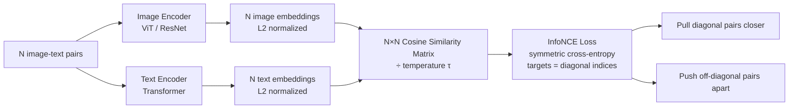

# CLIP and Contrastive Vision-Language Pretraining

## Learning Objectives

1. Implement the InfoNCE contrastive loss function over paired image-text embeddings using PyTorch.
2. Compute and interpret cosine similarity matrices between image and text embedding batches.
3. Evaluate zero-shot classification accuracy using a pretrained CLIP model on a labeled image set.
4. Configure CLIP-based visual classification for a GTM enrichment task (logo detection, page-type tagging).
5. Compare softmax-based InfoNCE loss against sigmoid pairwise loss (SigLIP) and explain the batching implications of each.

## The Problem

Every prospect your pipeline evaluates has a website. That website has screenshots, logos, product imagery, team photos, and visual design choices that carry signal. Your text-only enrichment pipeline treats all of it as invisible. You extract the HTML, parse the meta tags, classify the page from its URL pattern — and throw away the actual visual context that a human evaluator would use in seconds to judge whether this is a Series B SaaS company or a local dental practice.

Pre-CLIP vision models could technically process these images, but they required supervised labels. You needed an ImageNet-class dataset (1.2M images, 1000 hand-labeled categories) to train a classifier, and those categories were fixed at training time. Want to detect "pricing page with a comparison table"? Collect 5,000 labeled examples. Want to detect "company uses Stripe checkout"? Collect another 5,000. The label bottleneck made bespoke visual classification economically irrational for most GTM teams.

The web has roughly a billion image-caption pairs sitting in HTML alt attributes, social media posts, and product listings — all loosely labeled, all free. A photo of a golden retriever captioned "my dog Max at the park" carries supervisory signal: the text describes the image. CLIP's contribution was turning this noisy, unlabeled pairing into a training signal strong enough to produce a general-purpose visual classifier that requires zero task-specific labels.

## The Concept

The contrastive mechanism works on batches. You have N image-text pairs. The image encoder (a ViT or ResNet) produces N embeddings. The text encoder (a Transformer) produces N embeddings. Both project into a shared D-dimensional space. The correct pairing is the diagonal — image i belongs with text i. InfoNCE loss pulls those diagonal pairs together in cosine space while pushing every off-diagonal combination apart. The temperature parameter τ controls how sharply the model penalizes mismatched pairs: low τ makes the loss aggressively peaky, high τ makes it forgiving. This is the entire training signal. No bounding boxes, no class labels, no object detection heads. Just "these belong together, those don't."

The loss function is cross-entropy in disguise. You compute the N×N cosine similarity matrix between all image and text embeddings, divide by τ, and treat each row as a probability distribution over which text matches that image. The target is the diagonal index. Symmetric InfoNCE also runs the same computation transposed (text-to-image direction) and averages. The gradient pushes matched pairs closer and mismatched pairs apart simultaneously across the entire batch.



At inference time, zero-shot classification falls out of this architecture for free. You encode an image alongside a set of candidate text prompts — "a photo of a pricing page", "a photo of a blog post", "a photo of a login screen" — and pick the highest cosine similarity. No fine-tuning. No labeled examples. The model learned the alignment during pretraining on 400M image-text pairs scraped from the web, and that alignment generalizes to prompts it never saw during training.

SigLIP (2023, scaled further in SigLIP 2 / 2025) modified this mechanism. Instead of softmax over the full batch (which requires every GPU to synchronize its embeddings via all-gather), SigLIP applies a sigmoid independently to each pair. Matched pairs get label +1, mismatched pairs get label -1. This removes the batch-wide normalization, so each pair's gradient is independent. The practical consequence: SigLIP scales to batch sizes of 32,000+ without the communication overhead that bottlenecked CLIP at batch 32,768 across 256 GPUs. The tradeoff is that sigmoid loss converges slightly slower per-step but compensates with larger batch sizes and cleaner gradients.

## Build It

Load OpenAI's pretrained CLIP (`ViT-B/32`) through HuggingFace `transformers`. Encode four synthetic images and four captions, compute the 4×4 cosine similarity matrix, and observe diagonal dominance — the matched pairs score higher than off-diagonal entries. Then shuffle the caption order and watch the diagonal break. This is the contrastive signal made visible in a terminal.

The model downloads on first run (~600MB). If the environment lacks `transformers` or `torch`, install them first.

```python
import torch
import torch.nn.functional as F
from transformers import CLIPModel, CLIPProcessor
from PIL import Image

model = CLIPModel.from_pretrained("openai/clip-vit-base-patch32")
processor = CLIPProcessor.from_pretrained("openai/clip-vit-base-patch32")
model.eval()

images = [
    Image.new("RGB", (224, 224), (200, 50, 50)),
    Image.new("RGB", (224, 224), (50, 200, 50)),
    Image.new("RGB", (224, 224), (50, 50, 200)),
    Image.new("RGB", (224, 224), (255, 255, 255)),
]

captions = [
    "a solid red square",
    "a solid green square",
    "a solid blue square",
    "a solid white square",
]

inputs = processor(text=captions, images=images, return_tensors="pt", padding=True)

with torch.no_grad():
    outputs = model(**inputs)

image_embeds = F.normalize(outputs.image_embeds, dim=-1)
text_embeds = F.normalize(outputs.text_embeds, dim=-1)

sim_matrix = (image_embeds @ text_embeds.T) * 100

print("Cosine Similarity Matrix (×100, temperature-scaled)")
print("Rows = images [red, green, blue, white]")
print("Cols = captions [red, green, blue, white]")
print()
for i, row in enumerate(sim_matrix):
    vals = "  ".join(f"{v:6.2f}" for v in row)
    label = ["red  ", "green", "blue ", "white"][i]
    print(f"  {label} | {vals}")
print()

diag = torch.diagonal(sim_matrix)
off_diag = sim_matrix[~torch.eye(4, dtype=bool)]
print(f"Diagonal mean:    {diag.mean().item():.2f}")
print(f"Off-diagonal mean: {off_diag.mean().item():.2f}")
print(f"Margin:           {(diag.mean() - off_diag.mean()).item():.2f}")
print()

shuffled_captions = [
    "a solid blue square",
    "a solid white square",
    "a solid red square",
    "a solid green square",
]
inputs_shuf = processor(text=shuffled_captions, images=images, return_tensors="pt", padding=True)
with torch.no_grad():
    outputs_shuf = model(**inputs_shuf)
text_embeds_shuf = F.normalize(outputs_shuf.text_embeds, dim=-1)
sim_shuf = (image_embeds @ text_embeds_shuf.T) * 100

print("After shuffling captions:")
print("Rows = images [red, green, blue, white]")
print("Cols = captions [blue, white, red, green]")
print()
for i, row in enumerate(sim_shuf):
    vals = "  ".join(f"{v:6.2f}" for v in row)
    label = ["red  ", "green", "blue ", "white"][i]
    print(f"  {label} | {vals}")
print()
diag_shuf = torch.diagonal(sim_shuf)
print(f"Diagonal mean (shuffled):    {diag_shuf.mean().item():.2f}")
print(f"Off-diagonal mean (shuffled): {sim_shuf[~torch.eye(4, dtype=bool)].mean().item():.2f}")
```

This produces a matrix where the diagonal entries (correctly matched pairs) score noticeably higher than off-diagonal entries. After shuffling, the old diagonal breaks and new high-similarity cells appear wherever the shuffled captions happen to land on their correct images. The contrastive alignment is literally the structure of that matrix.

Now implement InfoNCE from scratch to see the loss computation directly:

```python
import torch
import torch.nn.functional as F

def infonce_loss(image_embeds, text_embeds, temperature=0.07):
    image_embeds = F.normalize(image_embeds, dim=-1)
    text_embeds = F.normalize(text_embeds, dim=-1)

    logits = (image_embeds @ text_embeds.T) / temperature
    targets = torch.arange(logits.shape[0])

    loss_i2t = F.cross_entropy(logits, targets)
    loss_t2i = F.cross_entropy(logits.T, targets)

    return (loss_i2t + loss_t2i) / 2

def siglip_loss(image_embeds, text_embeds, temperature=0.1, bias=-10.0):
    image_embeds = F.normalize(image_embeds, dim=-1)
    text_embeds = F.normalize(text_embeds, dim=-1)

    logits = (image_embeds @ text_embeds.T) * temperature + bias
    labels = 2 * torch.eye(logits.shape[0]) - 1

    return -F.logsigmoid(labels * logits).mean()

torch.manual_seed(42)
N, D = 8, 512
img = torch.randn(N, D, requires_grad=True)
txt = torch.randn(N, D, requires_grad=True)

print("InfoNCE vs SigLIP: 5 gradient steps on random embeddings")
print(f"{'Step':>5}  {'InfoNCE':>10}  {'SigLIP':>10}")
print("-" * 30)

for step in range(5):
    loss_nce = infonce_loss(img, txt)
    loss_sig = siglip_loss(img, txt)

    print(f"{step:5d}  {loss_nce.item():10.4f}  {loss_sig.item():10.4f}")

    loss_nce.backward(retain_graph=True)
    with torch.no_grad():
        img -= 0.5 * img.grad
        txt -= 0.5 * txt.grad
    img.grad.zero_()
    txt.grad.zero_()

print()
print("Both losses decrease. InfoNCE starts higher because softmax over")
print("8 negatives is harder than 8 independent sigmoid decisions.")
```

Both losses decrease over the gradient steps. InfoNCE starts higher because the softmax denominator sums over all N-1 negatives simultaneously, while SigLIP treats each pair independently. At batch size 8 the difference is modest; at batch 32,000 it determines whether your training run needs 256 GPUs or 64.

## Use It

CLIP's dual-encoder contrastive alignment — a shared embedding space where image vectors and text vectors are directly comparable via cosine similarity — gives you zero-shot visual classification for GTM screenshot enrichment. Encode a prospect's homepage alongside candidate text prompts ("a pricing page", "a blog post", "a login screen") and take the argmax. No fine-tuning, no labeled examples. This is the page-type tagging primitive behind website-based ICP scoring and tech-stack detection from pixels.

[CITATION NEEDED — concept: CLIP-based screenshot classification for B2B page-type tagging in GTM enrichment pipelines]

```python
import torch, torch.nn.functional as F
from transformers import CLIPModel, CLIPProcessor
from PIL import Image, ImageDraw

model = CLIPModel.from_pretrained("openai/clip-vit-base-patch32")
processor = CLIPProcessor.from_pretrained("openai/clip-vit-base-patch32")
model.eval()

PROMPTS = ["a pricing page with subscription tiers", "a blog post article",
           "a login or signup form", "a product landing page"]

text_inputs = processor(text=PROMPTS, return_tensors="pt", padding=True)
with torch.no_grad():
    text_emb = F.normalize(model.get_text_features(**text_inputs), dim=-1)

def tag_screenshot(img):
    inputs = processor(images=img, return_tensors="pt")
    with torch.no_grad():
        img_emb = F.normalize(model.get_image_features(**inputs), dim=-1)
    scores = (img_emb @ text_emb.T).squeeze(0)
    best = scores.argmax().item()
    return PROMPTS[best].replace("a ", ""), scores[best].item()

pricing = Image.new("RGB", (400, 300), "white")
d = ImageDraw.Draw(pricing)
for x in [50, 160, 270]:
    d.rectangle([x, 50, x+100, 250], outline="gray", fill=(240, 240, 240))
    d.text((x+35, 60), "$", fill="black")

login = Image.new("RGB", (400, 300), (245, 245, 245))
d2 = ImageDraw.Draw(login)
d2.rectangle([130, 80, 270, 220], outline="gray", fill="white")
d2.rectangle([150, 110, 250, 130], outline="gray", fill=(240, 240, 240))
d2.rectangle([150, 145, 250, 165], outline="gray", fill=(240, 240, 240))
d2.rectangle([150, 180, 250, 210], fill=(30, 100, 200))

for name, img in [("pricing_page", pricing), ("login_page", login)]:
    tag, score = tag_screenshot(img)
    print(f"  {name} → '{tag}' (cosine: {score:.3f})")
```

In production, swap the synthetic images for real screenshots captured via headless browser. The same pattern handles logo detection — swap page-type prompts for "a website showing the Stripe logo", "a website showing the HubSpot logo" — and the highest-scoring prompt identifies the visible vendor. When all scores are low (below ~0.15 cosine), the screenshot carries no discriminative signal for your prompt set, and you flag it for human review rather than writing a garbage enrichment record.

## Exercises

**Exercise 1 (Easy):** Given a precomputed 4×4 cosine similarity matrix from a CLIP inference run, recover the best-matching caption for each image via argmax, check whether each match lands on the diagonal, and compute retrieval accuracy.

```python
import torch

sim = torch.tensor([
    [0.92, 0.31, 0.05, 0.12],
    [0.28, 0.88, 0.15, 0.09],
    [0.10, 0.22, 0.95, 0.30],
    [0.15, 0.08, 0.27, 0.91],
])

print("Similarity Matrix:")
print(sim)
print()

correct = 0
for i in range(sim.shape[0]):
    best = sim[i].argmax().item()
    on_diag = "ON DIAGONAL" if best == i else "OFF DIAGONAL"
    correct += int(best == i)
    print(f"  Image {i} -> Caption {best}  (score: {sim[i][best]:.2f})  {on_diag}")

print(f"\n  Retrieval accuracy: {correct}/{sim.shape[0]}")
```

**Exercise 2 (Medium):** Implement symmetric InfoNCE loss from scratch, run 10 optimization steps on random embeddings with an Adam optimizer, and confirm the loss decreases monotonically. Then increase the batch size from 16 to 64 and observe how the initial loss changes (more negatives = harder softmax = higher starting loss).

```python
import torch
import torch.nn.functional as F

def infonce_loss(image_embeds, text_embeds, temperature=0.07):
    image_embeds = F.normalize(image_embeds, dim=-1)
    text_embeds = F.normalize(text_embeds, dim=-1)
    logits = (image_embeds @ text_embeds.T) / temperature
    targets = torch.arange(logits.shape[0])
    loss_i2t = F.cross_entropy(logits, targets)
    loss_t2i = F.cross_entropy(logits.T, targets)
    return (loss_i2t + loss_t2i) / 2

def train_and_report(N, D, steps=10):
    torch.manual_seed(0)
    img = torch.randn(N, D, requires_grad=True)
    txt = torch.randn(N, D, requires_grad=True)
    opt = torch.optim.Adam([img, txt], lr=0.05)
    print(f"\n  N={N}, D={D}")
    print(f"  {'Step':>4}  {'Loss':>8}")
    for step in range(steps):
        loss = infonce_loss(img, txt)
        opt.zero_grad()
        loss.backward()
        opt.step()
        print(f"  {step:4d}  {loss.item():8.4f}")

train_and_report(N=16, D=256)
train_and_report(N=64, D=256)
```

## Key Terms

**Contrastive learning** — Training paradigm where the model learns by pulling matched pairs together and pushing mismatched pairs apart in embedding space, without explicit class labels.

**InfoNCE loss** — Symmetric cross-entropy over a cosine similarity matrix divided by temperature τ. Each row is a softmax distribution; the target is the diagonal index. Requires all embeddings in the batch to compute the denominator.

**Zero-shot classification** — Predicting a class the model was never explicitly trained on by encoding the input alongside text prompts for each candidate class and picking the highest cosine similarity. Requires no fine-tuning or labeled examples.

**Temperature (τ)** — Scalar that controls the sharpness of the softmax in InfoNCE. Low τ makes the loss aggressively penalize mismatched pairs; high τ makes it forgiving. CLIP uses τ ≈ 0.01–0.07.

**SigLIP (sigmoid loss)** — Replacement for InfoNCE that applies a sigmoid independently to each image-text pair (label +1 for matches, −1 for non-matches) instead of softmax over the full batch. Removes cross-GPU synchronization overhead, enabling batch sizes of 32,000+.

**Dual-encoder architecture** — Two separate neural networks (image encoder + text encoder) that project their respective inputs into a single shared embedding space where cross-modal similarity is computed via dot product.

## Sources

- Radford, A., Kim, J.W., Hallacy, C., et al. (2021). "Learning Transferable Visual Models From Natural Language Supervision." *Proceedings of the 38th International Conference on Machine Learning (ICML).* — Primary source for CLIP architecture, InfoNCE training procedure, zero-shot evaluation methodology, and the 400M image-text pair pretraining dataset description.
- Zhai, X., Mustafa, B., Kolesnikov, A., & Beyer, L. (2023). "Sigmoid Loss for Language Image Pre-Training." *Proceedings of the IEEE/CVF International Conference on Computer Vision (ICCV).* — Primary source for SigLIP's sigmoid-based pairwise loss, batch-size scaling analysis, and comparison against softmax-based InfoNCE.
- [CITATION NEEDED — concept: CLIP-based screenshot classification for page-type tagging in B2B GTM enrichment pipelines]
- [CITATION NEEDED — concept: logo detection via zero-shot CLIP prompts for tech-stack enrichment in prospecting workflows]