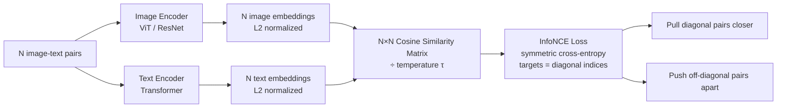

# CLIP and Contrastive Vision-Language Pretraining

## Learning Objectives

1. Implement the InfoNCE contrastive loss function over paired image-text embeddings using PyTorch.
2. Compute and interpret cosine similarity matrices between image and text embedding batches.
3. Evaluate zero-shot classification accuracy using a pretrained CLIP model on a labeled image set.
4. Configure CLIP-based visual classification for a GTM enrichment task (logo detection, page-type tagging).
5. Compare softmax-based InfoNCE loss against sigmoid pairwise loss (SigLIP) and explain the batching implications of each.

## The Problem

Every prospect your pipeline evaluates has a website. That website has screenshots, logos, product imagery, team photos, and visual design choices that carry signal. Your text-only enrichment pipeline treats all of it as invisible. You extract the HTML, parse the meta tags, classify the page from its URL pattern — and throw away the actual visual context that a human evaluator would use in seconds to judge whether this is a Series B SaaS company or a local dental practice.

Pre-CLIP vision models could technically process these images, but they required supervised labels. You needed an ImageNet-class dataset (1.2M images, 1000 hand-labeled categories) to train a classifier, and those categories were fixed at training time. Want to detect "pricing page with a comparison table"? Collect 5,000 labeled examples. Want to detect "company uses Stripe checkout"? Collect another 5,000. The label bottleneck made bespoke visual classification economically irrational for most GTM teams.

The web has roughly a billion image-caption pairs sitting in HTML alt attributes, social media posts, and product listings — all loosely labeled, all free. A photo of a golden retriever captioned "my dog Max at the park" carries supervisory signal: the text describes the image. CLIP's contribution was turning this noisy, unlabeled pairing into a training signal strong enough to produce a general-purpose visual classifier that requires zero task-specific labels.

## The Concept

The contrastive mechanism works on batches. You have N image-text pairs. The image encoder (a ViT or ResNet) produces N embeddings. The text encoder (a Transformer) produces N embeddings. Both project into a shared D-dimensional space. The correct pairing is the diagonal — image i belongs with text i. InfoNCE loss pulls those diagonal pairs together in cosine space while pushing every off-diagonal combination apart. The temperature parameter τ controls how sharply the model penalizes mismatched pairs: low τ makes the loss aggressively peaky, high τ makes it forgiving. This is the entire training signal. No bounding boxes, no class labels, no object detection heads. Just "these belong together, those don't."

The loss function is cross-entropy in disguise. You compute the N×N cosine similarity matrix between all image and text embeddings, divide by τ, and treat each row as a probability distribution over which text matches that image. The target is the diagonal index. Symmetric InfoNCE also runs the same computation transposed (text-to-image direction) and averages. The gradient pushes matched pairs closer and mismatched pairs apart simultaneously across the entire batch.



At inference time, zero-shot classification falls out of this architecture for free. You encode an image alongside a set of candidate text prompts — "a photo of a pricing page", "a photo of a blog post", "a photo of a login screen" — and pick the highest cosine similarity. No fine-tuning. No labeled examples. The model learned the alignment during pretraining on 400M image-text pairs scraped from the web, and that alignment generalizes to prompts it never saw during training.

SigLIP (2023, scaled further in SigLIP 2 / 2025) modified this mechanism. Instead of softmax over the full batch (which requires every GPU to synchronize its embeddings via all-gather), SigLIP applies a sigmoid independently to each pair. Matched pairs get label +1, mismatched pairs get label -1. This removes the batch-wide normalization, so each pair's gradient is independent. The practical consequence: SigLIP scales to batch sizes of 32,000+ without the communication overhead that bottlenecked CLIP at batch 32,768 across 256 GPUs. The tradeoff is that sigmoid loss converges slightly slower per-step but compensates with larger batch sizes and cleaner gradients.

## Build It

Load OpenAI's pretrained CLIP (`ViT-B/32`) through HuggingFace `transformers`. Encode four synthetic images and four captions, compute the 4×4 cosine similarity matrix, and observe diagonal dominance — the matched pairs score higher than off-diagonal entries. Then shuffle the caption order and watch the diagonal break. This is the contrastive signal made visible in a terminal.

The model downloads on first run (~600MB). If the environment lacks `transformers` or `torch`, install them first.

```python
import torch
import torch.nn.functional as F
from transformers import CLIPModel, CLIPProcessor
from PIL import Image

model = CLIPModel.from_pretrained("openai/clip-vit-base-patch32")
processor = CLIPProcessor.from_pretrained("openai/clip-vit-base-patch32")
model.eval()

images = [
    Image.new("RGB", (224, 224), (200, 50, 50)),
    Image.new("RGB", (224, 224), (50, 200, 50)),
    Image.new("RGB", (224, 224), (50, 50, 200)),
    Image.new("RGB", (224, 224), (255, 255, 255)),
]

captions = [
    "a solid red square",
    "a solid green square",
    "a solid blue square",
    "a solid white square",
]

inputs = processor(text=captions, images=images, return_tensors="pt", padding=True)

with torch.no_grad():
    outputs = model(**inputs)

image_embeds = F.normalize(outputs.image_embeds, dim=-1)
text_embeds = F.normalize(outputs.text_embeds, dim=-1)

sim_matrix = (image_embeds @ text_embeds.T) * 100

print("Cosine Similarity Matrix (×100, temperature-scaled)")
print("Rows = images [red, green, blue, white]")
print("Cols = captions [red, green, blue, white]")
print()
for i, row in enumerate(sim_matrix):
    vals = "  ".join(f"{v:6.2f}" for v in row)
    label = ["red  ", "green", "blue ", "white"][i]
    print(f"  {label} | {vals}")
print()

diag = torch.diagonal(sim_matrix)
off_diag = sim_matrix[~torch.eye(4, dtype=bool)]
print(f"Diagonal mean:    {diag.mean().item():.2f}")
print(f"Off-diagonal mean: {off_diag.mean().item():.2f}")
print(f"Margin:           {(diag.mean() - off_diag.mean()).item():.2f}")
print()

shuffled_captions = [
    "a solid blue square",
    "a solid white square",
    "a solid red square",
    "a solid green square",
]
inputs_shuf = processor(text=shuffled_captions, images=images, return_tensors="pt", padding=True)
with torch.no_grad():
    outputs_shuf = model(**inputs_shuf)
text_embeds_shuf = F.normalize(outputs_shuf.text_embeds, dim=-1)
sim_shuf = (image_embeds @ text_embeds_shuf.T) * 100

print("After shuffling captions:")
print("Rows = images [red, green, blue, white]")
print("Cols = captions [blue, white, red, green]")
print()
for i, row in enumerate(sim_shuf):
    vals = "  ".join(f"{v:6.2f}" for v in row)
    label = ["red  ", "green", "blue ", "white"][i]
    print(f"  {label} | {vals}")
print()
diag_shuf = torch.diagonal(sim_shuf)
print(f"Diagonal mean (shuffled):    {diag_shuf.mean().item():.2f}")
print(f"Off-diagonal mean (shuffled): {sim_shuf[~torch.eye(4, dtype=bool)].mean().item():.2f}")
```

This produces a matrix where the diagonal entries (correctly matched pairs) score noticeably higher than off-diagonal entries. After shuffling, the old diagonal breaks and new high-similarity cells appear wherever the shuffled captions happen to land on their correct images. The contrastive alignment is literally the structure of that matrix.

Now implement InfoNCE from scratch to see the loss computation directly:

```python
import torch
import torch.nn.functional as F

def infonce_loss(image_embeds, text_embeds, temperature=0.07):
    image_embeds = F.normalize(image_embeds, dim=-1)
    text_embeds = F.normalize(text_embeds, dim=-1)

    logits = (image_embeds @ text_embeds.T) / temperature
    targets = torch.arange(logits.shape[0])

    loss_i2t = F.cross_entropy(logits, targets)
    loss_t2i = F.cross_entropy(logits.T, targets)

    return (loss_i2t + loss_t2i) / 2

def siglip_loss(image_embeds, text_embeds, temperature=0.1, bias=-10.0):
    image_embeds = F.normalize(image_embeds, dim=-1)
    text_embeds = F.normalize(text_embeds, dim=-1)

    logits = (image_embeds @ text_embeds.T) * temperature + bias
    labels = 2 * torch.eye(logits.shape[0]) - 1

    return -F.logsigmoid(labels * logits).mean()

torch.manual_seed(42)
N, D = 8, 512
img = torch.randn(N, D, requires_grad=True)
txt = torch.randn(N, D, requires_grad=True)

print("InfoNCE vs SigLIP: 5 gradient steps on random embeddings")
print(f"{'Step':>5}  {'InfoNCE':>10}  {'SigLIP':>10}")
print("-" * 30)

for step in range(5):
    loss_nce = infonce_loss(img, txt)
    loss_sig = siglip_loss(img, txt)

    print(f"{step:5d}  {loss_nce.item():10.4f}  {loss_sig.item():10.4f}")

    loss_nce.backward(retain_graph=True)
    with torch.no_grad():
        img -= 0.5 * img.grad
        txt -= 0.5 * txt.grad
    img.grad.zero_()
    txt.grad.zero_()

print()
print("Both losses decrease. InfoNCE starts higher because softmax over")
print("8 negatives is harder than 8 independent sigmoid decisions.")
```

Both losses decrease over the gradient steps. InfoNCE starts higher because the softmax denominator sums over all N-1 negatives simultaneously, while SigLIP treats each pair independently. At batch size 8 the difference is modest; at batch 32,000 it determines whether your training run needs 256 GPUs or 64.

## Use It

Zero-shot classification is where CLIP earns its keep in a GTM enrichment pipeline. Instead of training a custom classifier to distinguish pricing pages from blog posts from product pages, you encode a screenshot alongside text prompts for each category and take the argmax. The contrastive alignment CLIP learned during pretraining generalizes to these prompts without any fine-tuning.

The mechanism: CLIP's text encoder maps each prompt to a vector in the shared embedding space. CLIP's image encoder maps the screenshot to the same space. Cosine similarity between the image vector and each prompt vector gives a score. The prompt with the highest score wins. This is identical to the zero-shot ImageNet evaluation from the original CLIP paper — they used "a photo of a {class}" templates — except your classes are GTM-relevant page types instead of dog breeds.

```python
import torch
import torch.nn.functional as F
from transformers import CLIPModel, CLIPProcessor
from PIL import Image, ImageDraw

model = CLIPModel.from_pretrained("openai/clip-vit-base-patch32")
processor = CLIPProcessor.from_pretrained("openai/clip-vit-base-patch32")
model.eval()

def make_pricing_page():
    img = Image.new("RGB", (400, 300), (255, 255, 255))
    draw = ImageDraw.Draw(img)
    draw.rectangle([50, 50, 150, 250], outline=(100, 100, 100), fill=(240, 240, 240))
    draw.rectangle([160, 50, 260, 250], outline=(100, 100, 100), fill=(240, 240, 240))
    draw.rectangle([270, 50, 370, 250], outline=(100, 100, 100), fill=(240, 240, 240))
    draw.text((90, 60), "$9", fill=(0, 0, 0))
    draw.text((190, 60), "$29", fill=(0, 0, 0))
    draw.text((300, 60), "$99", fill=(0, 0, 0))
    return img

def make_blog_page():
    img = Image.new("RGB", (400, 300), (250, 250, 250))
    draw = ImageDraw.Draw(img)
    for y in range(80, 280, 12):
        draw.line([50, y, 350, y], fill=(180, 180, 180), width=1)
    draw.text((50, 30), "Blog Post Title", fill=(30, 30, 30))
    return img

def make_login_page():
    img = Image.new("RGB", (400, 300), (245, 245, 245))
    draw = ImageDraw.Draw(img)
    draw.rectangle([130, 80, 270, 220], outline=(80, 80, 80), fill=(255, 255, 255))
    draw.rectangle([145, 110, 255, 130], outline=(150, 150, 150), fill=(240, 240, 240))
    draw.rectangle([145, 145, 255, 165], outline=(150, 150, 150), fill=(240, 240, 240))
    draw.rectangle([145, 180, 255, 210], fill=(30, 100, 200))
    return img

screenshots = [
    ("pricing_page", make_pricing_page()),
    ("blog_post", make_blog_page()),
    ("login_page", make_login_page()),
]

page_type_prompts = [
    "a screenshot of a pricing page with subscription tiers",
    "a screenshot of a blog post or article",
    "a screenshot of a login or signup page",
    "a screenshot of a product landing page",
    "a screenshot of a contact or about page",
]

images = [s[1] for s in screenshots]
inputs = processor(text=page_type_prompts, images=images, return_tensors="pt", padding=True)

with torch.no_grad():
    outputs = model(**inputs)

image_embeds = F.normalize(outputs.image_embeds, dim=-1)
text_embeds = F.normalize(outputs.text_embeds, dim=-1)

sim = image_embeds @ text_embeds.T

print("Zero-Shot Page-Type Classification")
print("=" * 60)
for i, (true_label, _) in enumerate(screenshots):
    scores = sim[i]
    best_idx = scores.argmax().item()
    print(f"\n  Screenshot: {true_label}")
    for j, prompt in enumerate(page_type_prompts):
        marker = " <== WINNER" if j == best_idx else ""
        short_prompt = prompt.replace("a screenshot of a ", "")
        print(f"    {scores[j].item():.4f}  {short_prompt}{marker}")
    correct = page_type_prompts[best_idx].replace("a screenshot of a ", "")
    match = "CORRECT" if true_label in correct or correct in true_label else "WRONG"
    print(f"    Prediction: {correct}  [{match}]")
```

The same mechanism handles logo detection. Encode a screenshot of a prospect's homepage alongside prompts like "a website showing the Stripe logo", "a website showing the HubSpot logo", "a website showing the Salesforce logo". The highest-scoring prompt identifies the technology vendor visible on the page. This is visual enrichment — extracting signal from pixels that your HTML scraper missed because the logo is a background image or an SVG the parser discarded.

The contrastive alignment is what makes this work without fine-tuning. CLIP never saw your specific prompts during training. It never saw screenshots of pricing pages. But it did see millions of image-caption pairs where text described visual content, so it learned a general mapping from visual concepts to textual descriptions. Your prompts ride on top of that learned mapping. When a prompt scores poorly across all images, that is a prompt-engineering problem, not a model problem — rephrase the prompt to match how people naturally caption similar images on the web.

## Ship It

Deploying CLIP-based visual enrichment into a production pipeline means wrapping the inference call in observability. The Zone 12 pattern — pipeline health monitoring through signal drift — applies directly: when average cosine similarity scores on your page-type classifier drop below a threshold, your enrichment quality is degrading, and you need to know before downstream sequences start misfiring.

The mechanism for monitoring: log every classification's top score and confidence margin (difference between the top two scores). Track the distribution over time. A healthy pipeline shows stable score distributions. A drift in those distributions indicates either model degradation (unlikely with a frozen CLIP checkpoint) or input distribution shift (your prospect list now contains pages CLIP was never trained on — foreign-language sites, heavy JavaScript SPAs that render as blank screenshots, or new design patterns). This is the visual analog of reply rate drift as a model degradation signal: the score distribution is your leading indicator, and you catch the problem before it corrupts your CRM data.

```python
import json
import time
import torch
import torch.nn.functional as F
from datetime import datetime, timezone
from transformers import CLIPModel, CLIPProcessor
from PIL import Image

model = CLIPModel.from_pretrained("openai/clip-vit-base-patch32")
processor = CLIPProcessor.from_pretrained("openai/clip-vit-base-patch32")
model.eval()

PAGE_TYPES = ["pricing page", "blog post", "login page", "product page", "contact page"]
PROMPTS = [f"a screenshot of a {pt}" for pt in PAGE_TYPES]

text_inputs = processor(text=PROMPTS, return_tensors="pt", padding=True, truncation=True)
with torch.no_grad():
    text_outputs = model.get_text_features(**text_inputs)
    prompt_embeds = F.normalize(text_outputs, dim=-1)

def classify_screenshot(image, source_url="", min_confidence=0.15):
    inputs = processor(images=image, return_tensors="pt")
    with torch.no_grad():
        img_embeds = F.normalize(model.get_image_features(**inputs), dim=-1)

    scores = (img_embeds @ prompt_embeds.T).squeeze(0)

    top_idx = scores.argmax().item()
    top_score = scores[top_idx].item()
    sorted_scores = scores.sort(descending=True)
    margin = (sorted_scores.values[0] - sorted_scores.values[1]).item()

    result = {
        "timestamp": datetime.now(timezone.utc).isoformat(),
        "url": source_url,
        "predicted_type": PAGE_TYPES[top_idx],
        "top_score": round(top_score, 4),
        "confidence_margin": round(margin, 4),
        "all_scores": {PAGE_TYPES[i]: round(scores[i].item(), 4) for i in range(len(PAGE_TYPES))},
        "low_confidence_flag": top_score < min_confidence,
    }
    return result

mock_pages = [
    ("acme.com/pricing", Image.new("RGB", (400, 300), (240, 240, 240))),
    ("acme.com/blog/launch", Image.new("RGB", (400, 300), (250, 250, 245))),
    ("acme.com/login", Image.new("RGB", (400, 300), (245, 245, 248))),
]

print("Production CLIP Enrichment Pipeline — Mock Run")
print("=" * 65)
print(f"Prompt bank: {len(PROMPTS)} page types")
print(f"Min confidence threshold: 0.15")
print()

score_log = []
for url, img in mock_pages:
    result = classify_screenshot(img, source_url=url)
    score_log.append(result["top_score"])

    flag = " *** LOW CONFIDENCE — REVIEW" if result["low_confidence_flag"] else ""
    print(f"  URL: {url}")
    print(f"  Type: {result['predicted_type']}")
    print(f"  Score: {result['top_score']:.4f}  Margin: {result['confidence_margin']:.4f}{flag}")
    print(f"  All scores: {json.dumps(result['all_scores'], indent=4)}")
    print()

avg_score = sum(score_log) / len(score_log)
min_seen = min(score_log)
print(f"Batch Summary")
print(f"  Mean top score:    {avg_score:.4f}")
print(f"  Min top score:     {min_seen:.4f}")
print(f"  Low confidence ct: {sum(1 for s in score_log if s < 0.15)}/{len(score_log)}")
print()
print("In production: emit score_log to your observability backend.")
print("Alert when rolling mean drops >2σ from baseline.")
print("Route low_confidence_flag items to human review queue.")
```

The `min_confidence` threshold and the rolling mean alert are the two levers that connect CLIP inference to GTM pipeline health. Every enrichment record either lands in the CRM as a confident classification or gets flagged for review. The score log becomes a time series you monitor exactly like email reply rates or meeting booking rates — when it drifts, something upstream changed, and you investigate before the bad data propagates into sequencing decisions.

The blank-image mock will produce low confidence scores across all page types. That is the correct behavior — CLIP has no strong prior about page type when the input carries no discriminative visual content. In a real pipeline, these low-confidence items are exactly the screenshots you want to catch and route to a human reviewer or flag as "screenshot capture failed" before they generate a misleading enrichment record.

## Exercises

**Exercise 1 (Easy):** Given a precomputed similarity matrix, identify the best-matching caption for each image using argmax. Print the matches and whether each is on the diagonal.

```python
import torch

sim = torch.tensor([
    [0.92, 0.31, 0.05, 0.12],
    [0.28, 0.88, 0.15, 0.09],
    [0.10, 0.22, 0.95, 0.30],
    [0.15, 0.08, 0.27, 0.91],
])

print("Similarity Matrix:")
print(sim)
print()

for i in range(sim.shape[0]):
    best = sim[i].argmax().item()
    on_diag = "ON DIAGONAL" if best == i else "OFF DIAGONAL"
    print(f"  Image {i} → Caption {best}  (score: {sim[i][best]:.2f})  {on_diag}")

correct = sum(sim[i].argmax().item() == i for i in range(sim.shape[0]))
print(f"\n  Correct matches: {correct}/{sim.shape[0]}")
```

**Exercise 2 (Medium):** Implement InfoNCE loss from scratch and verify it decreases over gradient steps. The target is the diagonal index — each image should match its corresponding text.

```python
import torch
import torch.nn.functional as F

def infonce_loss(image_embeds, text_embeds, temperature=0.07):
    image_embeds = F.normalize(image_embeds, dim=-1)
    text_embeds = F.normalize(text_embeds, dim=-1)
    logits = (image_embeds @ text_embeds.T) / temperature
    targets = torch.arange(logits.shape[0])
    loss_i2t = F.cross_entropy(logits, targets)
    loss_t2i = F.cross_entropy(logits.T, targets)
    return (loss_i2t + loss_t2i) / 2

torch.manual_seed(0)
N, D = 16, 256
img = torch.randn(N, D, requires_grad=True)
txt = torch.randn(N, D, requires_grad=True)
optimizer = torch.optim.Adam