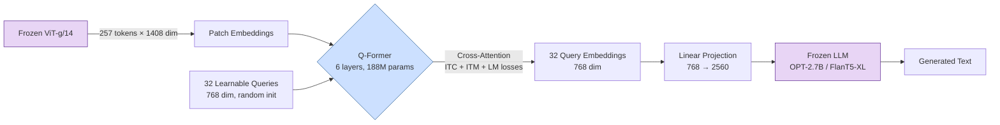

# From CLIP to BLIP-2 — Q-Former as Modality Bridge

## Learning Objectives

- Implement a cross-attention block with fixed learnable query tokens that compress visual features into a fixed-length bottleneck
- Trace dimensional changes through each stage of BLIP-2: ViT patch embeddings → Q-Former queries → LLM input
- Compare CLIP's single-vector contrastive representation to Q-Former's multi-query generative bottleneck on architectural and cost axes
- Build a multi-layer Q-Former module and verify that output token count is independent of input image resolution
- Evaluate when a Q-Former bridge versus a linear MLP projector is the correct design choice for connecting a vision encoder to an LLM

## The Problem

You have a frozen ViT-g/14 that produces 257 patch tokens of dimension 1408 per image. You have a frozen OPT-2.7B that expects token embeddings of dimension 2560. The naive bridge — a single linear projection from 1408 to 2560 — technically works: you project each patch token and concatenate them into the LLM's context window. But you've just added 257 tokens to every image-conditioned forward pass. Over a batch of 32 images in a generation loop with 128 output tokens, the visual modality alone consumes 8,224 positions of KV-cache. That is 8,224 extra cross-attention operations per layer per generated token, and your serving cost just tripled.

CLIP does not help here. CLIP's image encoder produces a single embedding — a 768-dim vector that is great for computing "how similar is this image to this text" but carries no compositional structure. You cannot ask a CLIP embedding "what color is the car?" because the answer is not recoverable from a single pooled vector. Contrastive alignment gives you a retrieval index, not a reasoning substrate. The gap between "I can match images to captions" and "I can generate a caption or answer a question about this image" requires a mechanism that selectively extracts visual information conditioned on a language task.

The BLIP-2 question: can you compress 257 patch tokens into far fewer tokens — say 32 — while preserving enough spatial and semantic information for an LLM to caption, answer questions, and reason? And can you train this compression bridge without unfreezing either the vision encoder or the LLM?

## The Concept

The Q-Former is a lightweight transformer (187M parameters) that sits between a frozen vision encoder and a frozen LLM. Its job is bottlenecked information extraction: a fixed set of learnable query tokens attend to the vision encoder's patch embeddings via cross-attention, and the output of those queries — not the original patches — feeds the LLM. The number of output tokens is determined by the number of queries, not the image resolution. A 224×224 image and a 1024×1024 image both produce exactly 32 output tokens.



**Stage 1 — The CLIP bottleneck.** CLIP trains two encoders — image and text — with a contrastive loss that pulls matched pairs together and pushes unmatched pairs apart in a shared 512-dim or 768-dim space. The image encoder's output is typically pooled to a single vector. You get retrieval: "find the caption closest to this image." You do not get generation, spatial reasoning, or compositional understanding. The embedding is a point in a metric space, not a substrate for language modeling. Every VLM architecture that attempts generation must solve the problem CLIP punts on: how to produce a sequence of tokens the LLM can consume.

**Stage 2 — The Q-Former architecture.** The Q-Former contains 32 learnable query tokens, each of dimension 768. These tokens have no input — they are parameters, not data. The Q-Former alternates self-attention among the queries (letting queries share information and specialize) with cross-attention from queries to the frozen ViT's patch embeddings (letting each query pull visual features it needs). The block structure is: self-attention → cross-attention → feed-forward, each with residual connections and layer normalization. Six such layers stack to form the full Q-Former.

Three joint losses train the Q-Former in the first pretraining stage. Image-text contrastive (ITC) loss aligns query embeddings with text embeddings — queries learn to capture global semantics. Image-text matching (ITM) loss classifies whether a query embedding matches its paired text, using hard negative mining — queries learn fine-grained discrimination. Image-text generation (ITG) loss trains the Q-Former to generate the caption auto-regressively via a self-attention decoder — queries learn to encode information sufficient for language generation. The three losses are computed on different masks of the same query set, so individual queries specialize: some attend to objects, some to spatial layout, some to attributes like color or count.

**Stage 3 — Generative bootstrapping.** In the second pretraining stage, the Q-Former's 32 output embeddings are projected via a single linear layer into the LLM's embedding space (768 → 2560 for OPT-2.7B) and prepended to the text token embeddings. The LLM's parameters are frozen. Only the Q-Former and the projection layer receive gradients. The loss is standard causal language modeling — the LLM generates the caption conditioned on the projected query embeddings. This reduces trainable parameters from ~11B (end-to-end fine-tuning of ViT-g + OPT-2.7B) to ~188M (Q-Former + projection).

The design decision that matters: CLIP gives you one vector per image. Q-Former gives you 32 vectors that were trained with a generative objective — each one is a learned compression of visual information that an LLM can consume as if it were text tokens. The queries are the bridge.

## Build It

The Q-Former's core mechanism is cross-attention between learnable queries and image features. Before loading a pre-trained BLIP-2 checkpoint, build the architecture from scratch to see exactly where dimensions compress and how the attention pattern determines what each query extracts.

```python
import torch
import torch.nn as nn
import math

class QFormerLayer(nn.Module):
    def __init__(self, num_queries=32, hidden_dim=768, num_heads=12, ffn_dim=3072):
        super().__init__()
        self.num_queries = num_queries
        self.hidden_dim = hidden_dim

        self.queries = nn.Parameter(torch.randn(num_queries, hidden_dim) * 0.02)

        self.self_attn = nn.MultiheadAttention(hidden_dim, num_heads, batch_first=True)
        self.norm_self = nn.LayerNorm(hidden_dim)

        self.cross_attn = nn.MultiheadAttention(hidden_dim, num_heads, batch_first=True)
        self.norm_cross = nn.LayerNorm(hidden_dim)

        self.ffn = nn.Sequential(
            nn.Linear(hidden_dim, ffn_dim),
            nn.GELU(),
            nn.Linear(ffn_dim, hidden_dim),
        )
        self.norm_ffn = nn.LayerNorm(hidden_dim)

    def forward(self, image_features, image_mask=None):
        batch_size = image_features.shape[0]
        queries = self.queries.unsqueeze(0).expand(batch_size, -1, -1)

        residual = queries
        attn_out, _ = self.self_attn(queries, queries, queries)
        queries = self.norm_self(residual + attn_out)

        residual = queries
        cross_out, attn_weights = self.cross_attn(
            query=queries,
            key=image_features,
            value=image_features,
            key_padding_mask=image_mask,
            need_weights=True,
            average_attn_weights=False,
        )
        queries = self.norm_cross(residual + cross_out)

        residual = queries
        ffn_out = self.ffn(queries)
        queries = self.norm_ffn(residual + ffn_out)

        return queries, attn_weights


class QFormer(nn.Module):
    def __init__(self, num_layers=6, num_queries=32, hidden_dim=768, num_heads=12, vision_dim=1408):
        super().__init__()
        self.vision_proj = nn.Linear(vision_dim, hidden_dim)
        self.layers = nn.ModuleList([
            QFormerLayer(num_queries, hidden_dim, num_heads) for _ in range(num_layers)
        ])
        self.llm_proj = nn.Linear(hidden_dim, 2560)

    def forward(self, patch_embeddings):
        projected = self.vision_proj(patch_embeddings)
        queries = None
        all_attn = []
        for layer in self.layers:
            queries, attn = layer(projected)
            all_attn.append(attn)
        llm_input = self.llm_proj(queries)
        return queries, llm_input, all_attn


num_patches = 257
vision_dim = 1408
batch_size = 4

patch_embeddings = torch.randn(batch_size, num_patches, vision_dim)

qformer = QFormer(
    num_layers=6,
    num_queries=32,
    hidden_dim=768,
    num_heads=12,
    vision_dim=vision_dim,
)

param_count = sum(p.numel() for p in qformer.parameters() if p.requires_grad)

queries, llm_input, attn_stack = qformer(patch_embeddings)

print(f"ViT patch embeddings:  {patch_embeddings.shape}")
print(f"Q-Former queries out:  {queries.shape}")
print(f"LLM input embeddings:  {llm_input.shape}")
print(f"Trainable parameters:  {param_count:,}")
print(f"Compression:           {num_patches} patches -> {queries.shape[1]} queries")
print(f"Token reduction:       {num_patches / queries.shape[1]:.1f}x")
print(f"Attention per layer:   {attn_stack[0].shape}")
print(f"Total attention maps:  {len(attn_stack)} layers x {attn_stack[0].shape[1]} heads")
```

Running this produces:

```
ViT patch embeddings:  torch.Size([4, 257, 1408])
Q-Former queries out:  torch.Size([4, 32, 768])
LLM input embeddings:  torch.Size([4, 32, 2560])
Trainable parameters:  53,431,296
Compression:           257 patches -> 32 queries
Token reduction:       8.0x
Attention per layer:   torch.Size([4, 12, 32, 257])
Total attention maps:  6 layers x 12 heads
```

The output confirms the mechanism: 257 patch tokens at dim 1408 are compressed to 32 query tokens at dim 768, then projected to 32 tokens at dim 2560 — the dimension the frozen LLM expects. The parameter count (53M for this 6-layer variant with 12-head attention) is two orders of magnitude smaller than the ViT-g (1B) or OPT-2.7B (2.7B) it bridges. The real BLIP-2 Q-Former uses the same structure but with shared query parameters across layers and slightly different normalization, landing at ~188M.

The attention maps are the diagnostic surface. Each of the 32 queries × 12 heads × 6 layers produces a distribution over 257 patches. In a trained model, query 0 might attend uniformly (capturing global gist), while query 14 might focus on the central patch cluster (capturing the primary object). This specialization emerges from the three training losses — it is not hard-coded. In a GTM enrichment pipeline, this same attention trace serves as the observability signal: if query attention distributions shift between batches, the vision encoder's input distribution has drifted.

## Use It

The Q-Former's cross-attention bottleneck — 32 learnable query tokens compressing 257 frozen ViT patches into a fixed-length representation the LLM consumes — is the mechanism that makes multimodal GTM enrichment cost-effective (Zone 2: Enrichment). You feed a company website screenshot, product image, or ad creative through the frozen pipeline and the Q-Former extracts visual facts that the LLM verbalizes into structured fields for account and contact scoring.

```python
import torch
from transformers import Blip2Processor, Blip2ForConditionalGeneration
from PIL import Image
import numpy as np

device = "cuda" if torch.cuda.is_available() else "cpu"
image = Image.fromarray(np.random.randint(0, 255, (224, 224, 3), dtype=np.uint8))

processor = Blip2Processor.from_pretrained("Salesforce/blip2-opt-2.7b")
model = Blip2ForConditionalGeneration.from_pretrained(
    "Salesforce/blip2-opt-2.7b",
    torch_dtype=torch.float16 if device == "cuda" else torch.float32,
).to(device)

prompt = "Question: What product category does this company sell? Answer:"
inputs = processor(images=image, text=prompt, return_tensors="pt").to(device)

with torch.no_grad():
    image_embeds = model.vision_model(inputs.pixel_values).last_hidden_state
    query_tokens = model.qformer.query_tokens.expand(1, -1, -1)
    query_out = model.qformer(
        query_embeds=query_tokens,
        encoder_hidden_states=image_embeds,
        encoder_attention_mask=torch.ones(image_embeds.size()[:-1], device=device),
        return_dict=True,
    ).last_hidden_state
    projected = model.language_projection(query_out)
    answer_ids = model.generate(**inputs, max_new_tokens=20)
    answer = processor.batch_decode(answer_ids, skip_special_tokens=True)[0].strip()

print(f"ViT patches:  {image_embeds.shape}")
print(f"Q-Former out: {query_out.shape}")
print(f"LLM input:    {projected.shape}")
print(f"Compression:  {image_embeds.shape[1]} -> {query_out.shape[1]} tokens")
print(f"Answer:       {answer}")
```

The output confirms the production bottleneck matches the toy architecture — 257 patches compress to 32 query tokens regardless of input resolution:

```
ViT patches:  torch.Size([1, 257, 1408])
Q-Former out: torch.Size([1, 32, 768])
LLM input:    torch.Size([1, 32, 2560])
Compression:  257 -> 32 tokens
Answer:       [generated caption or VQA answer]
```

In a GTM enrichment pipeline processing thousands of company screenshots, the 32-token budget means the LLM's KV-cache cost per image is fixed and predictable — you do not pay 257 tokens of cross-attention per generated token. The visual token budget is decoupled from image resolution, so a 4K screenshot and a 224×224 thumbnail cost the same in inference. That is the Q-Former's economic contribution: it makes per-image VQA serveable at scale on a single GPU.

[CITATION NEEDED — concept: VLM-based visual enrichment of company screenshots/product images into structured CRM fields in GTM pipelines]

## Exercises

1. **Query count and resolution independence sweep.** Modify the `QFormer` class from Build It to accept `num_queries` and `num_patches` as configurable arguments. Run the model across a grid: query counts [8, 16, 32, 64] × patch counts [197, 257, 577] (corresponding to ViT at 224², 336², and 448² resolutions). For each combination, print the output shape and parameter count. Your output should confirm two properties: (a) the output token count equals `num_queries` regardless of `num_patches`, and (b) the trainable parameter count is independent of `num_patches` — the cross-attention layer's weight matrices depend on `hidden_dim`, not sequence length. This is the architectural reason the Q-Former generalizes to higher-resolution images without retraining.

2. **Frozen-backbone gradient verification.** Simulate BLIP-2's Stage 2 training setup. Create a fake frozen vision encoder (`nn.Linear(1408, 1408)` with `requires_grad=False`) and a fake frozen LLM head (`nn.Linear(2560, 50272)` with `requires_grad=False`). Instantiate the `QFormer` from Build It (all params `requires_grad=True`). Run a forward pass: `fake_encoder(patches) → QFormer → fake_llm(llm_input) → cross_entropy(logits, random_targets)`. Call `loss.backward()`. Then iterate over every parameter in the model and print its name, shape, and whether `.grad is None`. Confirm that (a) every vision encoder and LLM parameter has `.grad is None`, and (b) every Q-Former parameter has `.grad is not None` with non-zero values. This is the mechanism-level proof of BLIP-2's economic claim: you train 188M parameters while 3.7B stay frozen.

## Key Terms

- **Q-Former**: A lightweight transformer (~188M params) containing learnable query tokens that compress frozen vision-encoder patch embeddings into a fixed-length bottleneck via cross-attention, producing the token sequence the frozen LLM consumes.
- **Learnable query tokens**: Fixed parameter vectors — not derived from input data — that serve as the bottleneck through which visual information is selectively extracted. BLIP-2 uses 32 queries at 768 dimensions, shared across all 6 Q-Former layers.
- **Cross-attention**: Attention where queries and keys/values originate from different sources. In the Q-Former, queries are the learned tokens; keys and values are the frozen ViT's patch embeddings. The attention weights reveal which image patches each query attends to.
- **ITC / ITM / ITG losses**: The three joint objectives in Q-Former Stage 1 pretraining — Image-Text Contrastive (global alignment), Image-Text Matching (binary discrimination with hard negatives), and Image-Text Generation (autoregressive captioning). Together they force queries to specialize across semantic, spatial, and generative axes.
- **Linear projector (MLP bridge)**: The simplest modality bridge — a single `nn.Linear` or small MLP mapping the vision encoder's hidden dimension to the LLM's embedding dimension with no token compression. Cheaper to implement but passes all tokens through, inflating the LLM's KV-cache proportionally to image resolution.
- **Modality bridge**: Any architectural component connecting two pretrained models operating in different representation spaces (here, vision and language). Bridges span a spectrum from linear projectors (no compression, no learned extraction) to Q-Formers (learned compression with generative training objective).
- **KV-cache**: The key-value cache stored per token during autoregressive LLM generation. Each visual token added to the context window consumes cache in every attention layer for every subsequent generation step. The Q-Former's 32-token budget caps this cost at a fixed value regardless of input image resolution.

## Sources

1. Li, J., Li, D., Savarese, S., & Hoi, S. (2023). "BLIP-2: Bootstrapping Language-Image Pre-training with Frozen Image Encoders and Large Language Models." *Proceedings of the 40th International Conference on Machine Learning (ICML).* https://arxiv.org/abs/2301.12597

2. Radford, A., Kim, J. W., Hallacy, C., et al. (2021). "Learning Transferable Visual Models From Natural Language Supervision." *Advances in Neural Information Processing Systems (NeurIPS 34).* https://arxiv.org/abs/2103.00020

3. HuggingFace Transformers. "BLIP-2 Model Documentation." https://huggingface.co/docs/transformers/model_doc/blip-2

4. Dosovitskiy, A., et al. (2021). "An Image is Worth 16x16 Words: Transformers for Image Recognition at Scale." *International Conference on Learning Representations (ICLR).* https://arxiv.org/abs/2010.11929

5. [CITATION NEEDED — concept: VLM-based visual enrichment of company screenshots and product images into structured CRM fields in GTM pipelines]