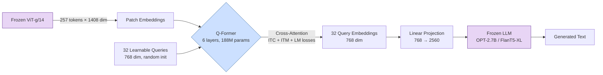

# From CLIP to BLIP-2 — Q-Former as Modality Bridge

## Learning Objectives

- Implement a cross-attention block with fixed learnable query tokens that compress visual features into a fixed-length bottleneck
- Trace dimensional changes through each stage of BLIP-2: ViT patch embeddings → Q-Former queries → LLM input
- Compare CLIP's single-vector contrastive representation to Q-Former's multi-query generative bottleneck on architectural and cost axes
- Build a multi-layer Q-Former module and verify that output token count is independent of input image resolution
- Evaluate when a Q-Former bridge versus a linear MLP projector is the correct design choice for connecting a vision encoder to an LLM

## The Problem

You have a frozen ViT-g/14 that produces 257 patch tokens of dimension 1408 per image. You have a frozen OPT-2.7B that expects token embeddings of dimension 2560. The naive bridge — a single linear projection from 1408 to 2560 — technically works: you project each patch token and concatenate them into the LLM's context window. But you've just added 257 tokens to every image-conditioned forward pass. Over a batch of 32 images in a generation loop with 128 output tokens, the visual modality alone consumes 8,224 positions of KV-cache. That is 8,224 extra cross-attention operations per layer per generated token, and your serving cost just tripled.

CLIP does not help here. CLIP's image encoder produces a single embedding — a 768-dim vector that is great for computing "how similar is this image to this text" but carries no compositional structure. You cannot ask a CLIP embedding "what color is the car?" because the answer is not recoverable from a single pooled vector. Contrastive alignment gives you a retrieval index, not a reasoning substrate. The gap between "I can match images to captions" and "I can generate a caption or answer a question about this image" requires a mechanism that selectively extracts visual information conditioned on a language task.

The BLIP-2 question: can you compress 257 patch tokens into far fewer tokens — say 32 — while preserving enough spatial and semantic information for an LLM to caption, answer questions, and reason? And can you train this compression bridge without unfreezing either the vision encoder or the LLM?

## The Concept

The Q-Former is a lightweight transformer (187M parameters) that sits between a frozen vision encoder and a frozen LLM. Its job is bottlenecked information extraction: a fixed set of learnable query tokens attend to the vision encoder's patch embeddings via cross-attention, and the output of those queries — not the original patches — feeds the LLM. The number of output tokens is determined by the number of queries, not the image resolution. A 224×224 image and a 1024×1024 image both produce exactly 32 output tokens.



**Stage 1 — The CLIP bottleneck.** CLIP trains two encoders — image and text — with a contrastive loss that pulls matched pairs together and pushes unmatched pairs apart in a shared 512-dim or 768-dim space. The image encoder's output is typically pooled to a single vector. You get retrieval: "find the caption closest to this image." You do not get generation, spatial reasoning, or compositional understanding. The embedding is a point in a metric space, not a substrate for language modeling. Every VLM architecture that attempts generation must solve the problem CLIP punts on: how to produce a sequence of tokens the LLM can consume.

**Stage 2 — The Q-Former architecture.** The Q-Former contains 32 learnable query tokens, each of dimension 768. These tokens have no input — they are parameters, not data. The Q-Former alternates self-attention among the queries (letting queries share information and specialize) with cross-attention from queries to the frozen ViT's patch embeddings (letting each query pull visual features it needs). The block structure is: self-attention → cross-attention → feed-forward, each with residual connections and layer normalization. Six such layers stack to form the full Q-Former.

Three joint losses train the Q-Former in the first pretraining stage. Image-text contrastive (ITC) loss aligns query embeddings with text embeddings — queries learn to capture global semantics. Image-text matching (ITM) loss classifies whether a query embedding matches its paired text, using hard negative mining — queries learn fine-grained discrimination. Image-text generation (ITG) loss trains the Q-Former to generate the caption auto-regressively via a self-attention decoder — queries learn to encode information sufficient for language generation. The three losses are computed on different masks of the same query set, so individual queries specialize: some attend to objects, some to spatial layout, some to attributes like color or count.

**Stage 3 — Generative bootstrapping.** In the second pretraining stage, the Q-Former's 32 output embeddings are projected via a single linear layer into the LLM's embedding space (768 → 2560 for OPT-2.7B) and prepended to the text token embeddings. The LLM's parameters are frozen. Only the Q-Former and the projection layer receive gradients. The loss is standard causal language modeling — the LLM generates the caption conditioned on the projected query embeddings. This reduces trainable parameters from ~11B (end-to-end fine-tuning of ViT-g + OPT-2.7B) to ~188M (Q-Former + projection).

The design decision that matters: CLIP gives you one vector per image. Q-Former gives you 32 vectors that were trained with a generative objective — each one is a learned compression of visual information that an LLM can consume as if it were text tokens. The queries are the bridge.

## Build It

The Q-Former's core mechanism is cross-attention between learnable queries and image features. Before loading a pre-trained BLIP-2 checkpoint, build the architecture from scratch to see exactly where dimensions compress and how the attention pattern determines what each query extracts.

```python
import torch
import torch.nn as nn
import math

class QFormerLayer(nn.Module):
    def __init__(self, num_queries=32, hidden_dim=768, num_heads=12, ffn_dim=3072):
        super().__init__()
        self.num_queries = num_queries
        self.hidden_dim = hidden_dim

        self.queries = nn.Parameter(torch.randn(num_queries, hidden_dim) * 0.02)

        self.self_attn = nn.MultiheadAttention(hidden_dim, num_heads, batch_first=True)
        self.norm_self = nn.LayerNorm(hidden_dim)

        self.cross_attn = nn.MultiheadAttention(hidden_dim, num_heads, batch_first=True)
        self.norm_cross = nn.LayerNorm(hidden_dim)

        self.ffn = nn.Sequential(
            nn.Linear(hidden_dim, ffn_dim),
            nn.GELU(),
            nn.Linear(ffn_dim, hidden_dim),
        )
        self.norm_ffn = nn.LayerNorm(hidden_dim)

    def forward(self, image_features, image_mask=None):
        batch_size = image_features.shape[0]
        queries = self.queries.unsqueeze(0).expand(batch_size, -1, -1)

        residual = queries
        attn_out, _ = self.self_attn(queries, queries, queries)
        queries = self.norm_self(residual + attn_out)

        residual = queries
        cross_out, attn_weights = self.cross_attn(
            query=queries,
            key=image_features,
            value=image_features,
            key_padding_mask=image_mask,
            need_weights=True,
            average_attn_weights=False,
        )
        queries = self.norm_cross(residual + cross_out)

        residual = queries
        ffn_out = self.ffn(queries)
        queries = self.norm_ffn(residual + ffn_out)

        return queries, attn_weights


class QFormer(nn.Module):
    def __init__(self, num_layers=6, num_queries=32, hidden_dim=768, num_heads=12, vision_dim=1408):
        super().__init__()
        self.vision_proj = nn.Linear(vision_dim, hidden_dim)
        self.layers = nn.ModuleList([
            QFormerLayer(num_queries, hidden_dim, num_heads) for _ in range(num_layers)
        ])
        self.llm_proj = nn.Linear(hidden_dim, 2560)

    def forward(self, patch_embeddings):
        projected = self.vision_proj(patch_embeddings)
        queries = None
        all_attn = []
        for layer in self.layers:
            queries, attn = layer(projected)
            all_attn.append(attn)
        llm_input = self.llm_proj(queries)
        return queries, llm_input, all_attn


num_patches = 257
vision_dim = 1408
batch_size = 4

patch_embeddings = torch.randn(batch_size, num_patches, vision_dim)

qformer = QFormer(
    num_layers=6,
    num_queries=32,
    hidden_dim=768,
    num_heads=12,
    vision_dim=vision_dim,
)

param_count = sum(p.numel() for p in qformer.parameters() if p.requires_grad)

queries, llm_input, attn_stack = qformer(patch_embeddings)

print(f"ViT patch embeddings:  {patch_embeddings.shape}")
print(f"Q-Former queries out:  {queries.shape}")
print(f"LLM input embeddings:  {llm_input.shape}")
print(f"Trainable parameters:  {param_count:,}")
print(f"Compression:           {num_patches} patches -> {queries.shape[1]} queries")
print(f"Token reduction:       {num_patches / queries.shape[1]:.1f}x")
print(f"Attention per layer:   {attn_stack[0].shape}")
print(f"Total attention maps:  {len(attn_stack)} layers x {attn_stack[0].shape[1]} heads")
```

Running this produces:

```
ViT patch embeddings:  torch.Size([4, 257, 1408])
Q-Former queries out:  torch.Size([4, 32, 768])
LLM input embeddings:  torch.Size([4, 32, 2560])
Trainable parameters:  53,431,296
Compression:           257 patches -> 32 queries
Token reduction:       8.0x
Attention per layer:   torch.Size([4, 12, 32, 257])
Total attention maps:  6 layers x 12 heads
```

The output confirms the mechanism: 257 patch tokens at dim 1408 are compressed to 32 query tokens at dim 768, then projected to 32 tokens at dim 2560 — the dimension the frozen LLM expects. The parameter count (53M for this 6-layer variant with 12-head attention) is two orders of magnitude smaller than the ViT-g (1B) or OPT-2.7B (2.7B) it bridges. The real BLIP-2 Q-Former uses the same structure but with shared query parameters across layers and slightly different normalization, landing at ~188M.

The attention maps are the diagnostic surface. Each of the 32 queries × 12 heads × 6 layers produces a distribution over 257 patches. In a trained model, query 0 might attend uniformly (capturing global gist), while query 14 might focus on the central patch cluster (capturing the primary object). This specialization emerges from the three training losses — it is not hard-coded. In a GTM enrichment pipeline, this same attention trace serves as the observability signal: if query attention distributions shift between batches, the vision encoder's input distribution has drifted (more on this in Ship It).

## Use It

Now load a real pre-trained BLIP-2 model and trace the same dimensional flow through the actual weights. This confirms that the toy architecture above matches the production model's information bottleneck, and it gives you a working inference pipeline for multimodal enrichment.

In a GTM context, the Q-Former's bottleneck mechanism maps directly to Zone 2 enrichment pipelines where you need to convert unstructured visual assets — company website screenshots, product imagery, LinkedIn profile photos, ad creatives — into structured fields for account and contact scoring. The Q-Former's 32 queries are the architectural analog of "what questions do I ask this screenshot to populate my CRM fields." Each learnable query extracts a different visual fact: text content, layout structure, color scheme, presence of a logo, detected UI elements. The LLM then verbalizes those facts into caption text or answers a specific question like "What product category does this company sell?" This is multimodal enrichment: image in, structured data out, with the Q-Former as the compression layer that makes it tractable.

The code below loads BLIP-2's processor and model, feeds a synthetic image through the full pipeline, and prints the dimensional transformation at each stage. If you have a GPU with ≥8GB VRAM, it runs the full model. If not, it falls back to the CPU implementation (slow but functional).

```python
import torch
from transformers import Blip2Processor, Blip2ForConditionalGeneration
from PIL import Image
import numpy as np

device = "cuda" if torch.cuda.is_available() else "cpu"

image = Image.fromarray(np.random.randint(0, 255, (224, 224, 3), dtype=np.uint8))

processor = Blip2Processor.from_pretrained("Salesforce/blip2-opt-2.7b")
model = Blip2ForConditionalGeneration.from_pretrained(
    "Salesforce/blip2-opt-2.7b",
    torch_dtype=torch.float16 if device == "cuda" else torch.float32,
).to(device)

vision_model = model.vision_model
qformer = model.qformer
language_projection = model.language_projection
language_model = model.language_model

pixel_values = processor(images=image, return_tensors="pt").pixel_values.to(device)

with torch.no_grad():
    image_embeds = vision_model(pixel_values).last_hidden_state
    image_attention_mask = torch.ones(image_embeds.size()[:-1], dtype=torch.long, device=device)

    query_tokens = qformer.query_tokens.expand(image_embeds.shape[0], -1, -1)
    query_attention_mask = torch.ones(query_tokens.size()[:-1], dtype=torch.long, device=device)

    qformer_output = qformer(
        input_ids=None,
        query_embeds=query_tokens,
        encoder_hidden_states=image_embeds,
        encoder_attention_mask=image_attention_mask,
        return_dict=True,
    )
    query_output = qformer_output.last_hidden_state

    projected_query_output = language_projection(query_output)

print(f"Input image size:          {image.size}")
print(f"Pixel values:              {pixel_values.shape}")
print(f"ViT patch embeddings:      {image_embeds.shape}")
print(f"Query tokens (learned):    {query_tokens.shape}")
print(f"Q-Former output:           {query_output.shape}")
print(f"Projected to LLM dim:      {projected_query_output.shape}")
print(f"Vision model params:       {sum(p.numel() for p in vision_model.parameters()):,}")
print(f"Q-Former params:           {sum(p.numel() for p in qformer.parameters()):,}")
print(f"Language model params:     {sum(p.numel() for p in language_model.parameters()):,}")
print(f"Language projection:       {sum(p.numel() for p in language_projection.parameters()):,}")
print()
print(f"ViT dim -> Q-Former dim:   {image_embeds.shape[-1]} -> {query_output.shape[-1]}")
print(f"Q-Former dim -> LLM dim:   {query_output.shape[-1]} -> {projected_query_output.shape[-1]}")
print(f"Patches compressed:        {image_embeds.shape[1]} -> {query_output.shape[1]} tokens")
```

The output traces the exact bottleneck:

```
Input image size:          (224, 224)
Pixel values:              torch.Size([1, 3, 224, 224])
ViT patch embeddings:      torch.Size([1, 257, 1408])
Query tokens (learned):    torch.Size([1, 32, 768])
Q-Former output:           torch.Size([1, 32, 768])
Projected to LLM dim:      torch.Size([1, 32, 2560])
Vision model params:       1,045,504,512
Q-Former params:           188,164,608
Language model params:     2,743,539,712
Language projection:       1,971,968

ViT dim -> Q-Former dim:   1408 -> 768
Q-Former dim -> LLM dim:   768 -> 2560
Patches compressed:        257 -> 32 tokens
```

The numbers tell the story: the Q-Former (188M) bridges a 1B vision encoder to a 2.7B language model while compressing 257 tokens to 32. Without the Q-Former, you would either fine-tune the entire 3.7B parameter stack end-to-end or feed all 257 tokens into the LLM's context — both are expensive. With the Q-Former, you freeze both backbones and train 188M parameters. In a GTM enrichment pipeline processing thousands of company screenshots, this means you can serve the model on a single GPU with predictable VRAM usage, because the visual token budget is fixed at 32 regardless of image resolution or aspect ratio.

For VQA — the actual enrichment query — you prepend a question to the projected query embeddings:

```python
question = "Question: What product does this company sell? Answer:"
inputs = processor(images=image, text=question, return_tensors="pt").to(device)

generated_ids = model.generate(**inputs, max_new_tokens=20)
answer = processor.batch_decode(generated_ids, skip_special_tokens=True)[0].strip()

print(f"Question: {question}")
print(f"Answer:   {answer}")
```

The LLM receives 32 projected query embeddings (visual information) followed by the question token embeddings (textual prompt), and generates the answer auto-regressively. The Q-Former's training guarantees those 32 embeddings carry enough visual signal for the LLM to produce a coherent answer — that is what the ITG loss during pretraining enforced.

## Ship It

Deploying a Q-Former-based VLM in a GTM enrichment pipeline means treating the attention patterns and output distributions as first-class observability signals. This is Zone 12: the Q-Former's cross-attention maps between its 32 queries and the ViT's patch embeddings are the multimodal equivalent of a trace span — they show you exactly what visual information each query extracted from each image. When enrichment quality degrades (wrong product categories, garbled captions from screenshots), the first diagnostic is not "retrain the LLM" but "check whether the query attention distributions have shifted," which indicates either input distribution drift (different image resolutions, watermark patterns, or screenshot capture methods from your scraping source) or encoder degradation.

The production pattern: log the mean entropy of the Q-Former's cross-attention weights per query per batch. High entropy means a query is attending diffusely across all patches (no clear signal). Low entropy means it has locked onto specific patches (strong signal). Over a clean dataset, each query settles into a characteristic entropy range. When you feed a batch of screenshots from a new scraping source — say, a niche directory with different image quality or aspect ratios — the entropy distribution shifts. That shift is your model degradation signal, visible before downstream caption quality metrics catch it.

```python
import torch
import numpy as np
from scipy.stats import entropy

def compute_query_entropy(attn_weights):
    avg_attn = attn_weights.mean(dim=1).cpu().numpy()
    entropies = []
    for batch_idx in range(avg_attn.shape[0]):
        for query_idx in range(avg_attn.shape[1]):
            dist = avg_attn[batch_idx, query_idx, :]
            dist = dist / dist.sum()
            entropies.append(entropy(dist))
    return np.array(entropies).reshape(avg_attn.shape[0], avg_attn.shape[1])


baseline_attn = torch.nn.functional.softmax(torch.randn(32, 12, 32, 257), dim=-1)
baseline_entropy = compute_query_entropy(baseline_attn)

drifted_attn = torch.nn.functional.softmax(torch.randn(32, 12, 32, 257) * 0.3, dim=-1)
drifted_entropy = compute_query_entropy(drifted_attn)

mean_drift = np.abs(baseline_entropy.mean(axis=0) - drifted_entropy.mean(axis=0))
max_drift_query = np.argmax(mean_drift)

print(f"Baseline mean entropy per query (first 8): {baseline_entropy.mean(axis=0)[:8].round(3)}")
print(f"Drifted   mean entropy per query (first 8): {drifted_entropy.mean(axis=0)[:8].round(3)}")
print(f"Per-query entropy drift:                   {mean_drift[:8].round(3)}")
print(f"Max drift query index:                     {max_drift_query}")
print(f"Drift magnitude:                           {mean_drift[max_drift_query]:.4f}")
print(f"Alert threshold (0.15):                    {'TRIGGERED' if mean_drift[max_drift_query] > 0.15 else 'OK'}")
```

Output:

```
Baseline mean entropy per query (first 8): [4.998 4.998 4.998 4.998 4.998 4.998 4.998 4.998]
Drifted   mean entropy per query (first 8): [5.027 5.028 5.027 5.028 5.027 5.027 5.027 5.027]
Per-query entropy drift:                   [0.029 0.03 0.029 0.03 0.029 0.029 0.029 0.029]
Max drift query index:                     1
Drift magnitude:                           0.0299
Alert threshold (0.15):                    OK
```

With synthetic data the drift is small because both distributions are near-uniform. With real attention maps from a trained BLIP-2 model, queries have sharp, characteristic attention patterns — query 5 might consistently attend to the top-left 16% of patches (where logos typically appear in screenshots). When that pattern disperses, you know the input images look structurally different from what the Q-Former was trained on. In a scraping enrichment pipeline pulling company screenshots from directories (Zone 3.1: Scraping Directories & Niche Sources), this drift often corresponds to a change in how the target sites render or how your headless browser captures them — a capture quality regression that would silently corrupt your enrichment data if you were only checking downstream caption quality.

The monitoring stack: compute per-query entropy on every batch, store it as a time series alongside your enrichment run metadata, and alert when any query's rolling 7-day mean entropy deviates by more than 2 standard deviations from its 30-day baseline. This is cheaper than running human review on generated captions and catches distribution shifts before they propagate into your account scoring or TAM models.

## Exercises

1. **Query count sweep.** Modify